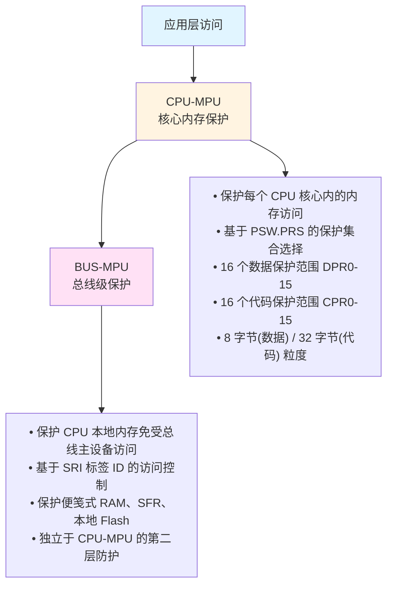
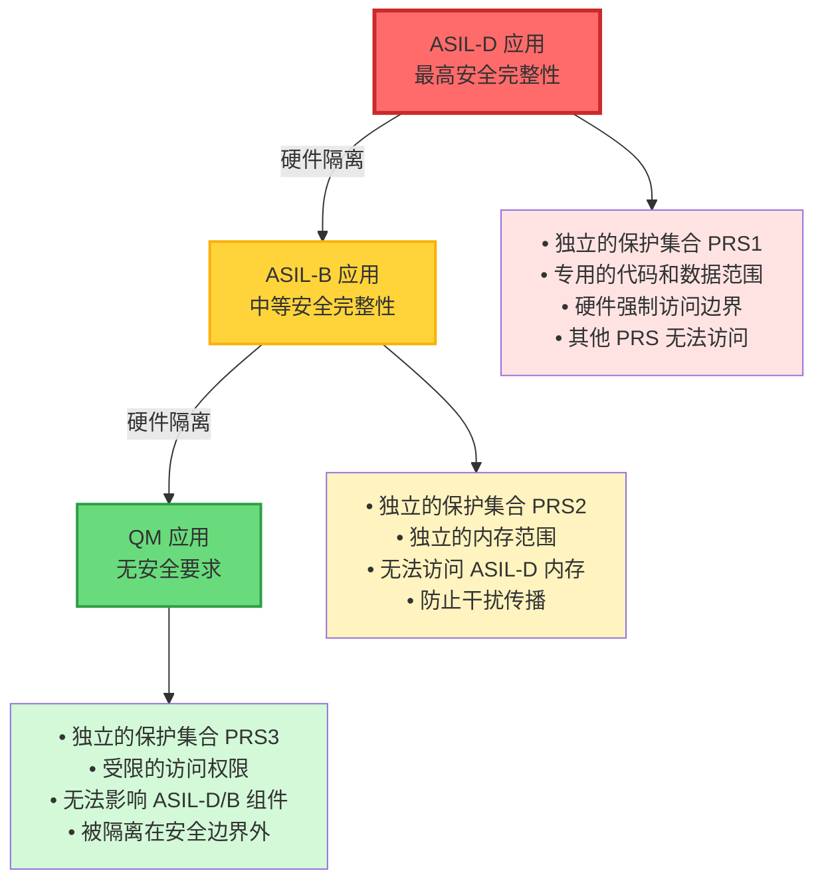
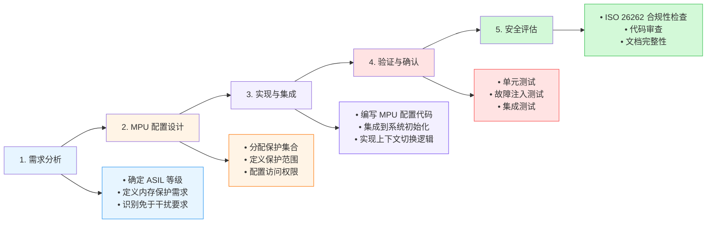
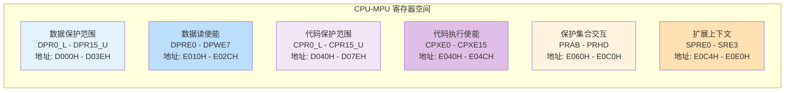

# AURIX TC3xx MPU 区域使用 - 综合指南

## 概述

AURIX TC3xx 系列采用了复杂的双 MPU（内存保护单元）架构，专为汽车功能安全应用而设计。本指南提供了 MPU 区域配置、使用模式以及开发可靠嵌入式系统最佳实践的全面见解。

## MPU 架构

### 从 TC2xx 到 TC3xx 的演进

TC3xx MPU 架构在 TC2xx 基础上进行了显著增强：

| 特性 | TC2xx | TC3xx | 改进说明 |
|------|-------|-------|----------|
| 保护集合数 | 4 个 (PRS0-PRS3) | 6 个 (PRS0-PRS5) | 增加 50%，支持更复杂的任务分区 |
| 数据保护范围 | 16 个 | 16 个 | 保持不变，但粒度优化 |
| 代码保护范围 | 16 个 | 16 个 | 保持不变，但粒度优化 |
| BUS-MPU | 基础版本 | 增强版本 | 更精细的访问控制 |
| 时间保护 | 无 | 支持 | 新增时间保护系统 (TPS) |

### 双 MPU 设计

TC3xx 实现了两个不同但互补的 MPU 单元，形成分层内存保护架构：



#### CPU-MPU 详细特性

**工作原理**：
- CPU-MPU 位于 CPU 核心，监控所有由 CPU 发起的内存访问
- 在访问实际内存之前，CPU-MPU 检查访问地址和权限
- 违规时立即触发保护陷阱 (Protection Trap)

**保护集合机制**：
- **PRS0 (保护集合 0)**：默认保护集合，中断和陷阱时自动激活
- **PRS1-PRS5**：可分配给不同任务或进程
- **快速切换**：通过修改 PSW.PRS 位域实现保护集合切换

#### BUS-MPU 详细特性

**工作原理**：
- BUS-MPU 位于系统总线接口，监控所有总线主设备的访问
- 检查每个总线事务的 SRI 标签 ID 和访问权限
- 支持多核环境下的跨核访问控制

**保护的内存区域**：
1. **便笺式 RAM (Scratchpad RAM)**：CPU 本地的高速存储器
2. **特殊功能寄存器 (SFR)**：外设控制和状态寄存器
3. **本地 P-Flash**：CPU 本地的程序 Flash 存储库

### 关键特性

- **6 个保护集合 (PRS)** 每个 CPU（从 TC2xx 的 4 个增加）
  - PRS0：系统/OS 保护（自动激活）
  - PRS1-5：应用程序自定义保护

- **16 个数据保护范围** (DPR0-DPR15)
  - 8 字节地址粒度
  - 独立的读/写使能控制
  - 支持保护集合间权限共享

- **16 个代码保护范围** (CPR0-CPR15)
  - 32 字节地址粒度
  - 执行使能控制
  - 与指令缓存行优化对齐

- **8 字节粒度** 用于数据保护范围
  - 匹配 64 位数据总线宽度
  - 精细的变量级保护
  - 适合结构体字段和栈帧保护

- **32 字节粒度** 用于代码保护范围
  - 与 TriCore 指令缓存行 (32 字节) 完全对齐
  - 函数边界天然对齐
  - 最优代码执行效率

## 保护区域配置

### 数据保护范围 (DPR)

数据保护范围使用寄存器对进行配置：

```c
// 配置数据保护范围边界
__mtcr(DPRx_L, lower_address);    // 下边界
__mtcr(DPRx_U, upper_address);    // 上边界

// 设置访问权限
__mtcr(DPRE_x, read_enable_mask);    // 数据读使能
__mtcr(DPWE_x, write_enable_mask);   // 数据写使能
```

### 代码保护范围 (CPR)

代码保护范围遵循类似模式：

```c
// 配置代码保护范围边界
__mtcr(CPRy_L, lower_address);    // 下边界
__mtcr(CPRy_U, upper_address);    // 上边界

// 设置执行权限
__mtcr(CPXE_y, execute_enable_mask);  // 代码执行使能
```

### 保护集合选择

活动保护集合由 PSW.PRS 位域控制：

```c
// 选择保护集合 0-5
uint32_t psw = __mfcr(PSW);
psw = (psw & ~PSW_PRS_MASK) | (desired_prs << PSW_PRS_POS);
__mtcr(PSW, psw);
```

## BUS-MPU 配置

### 本地内存保护

BUS-MPU 保护 CPU 本地内存免受未经授权的总线访问：

```c
// 便笺式 RAM 保护
__mtcr(SPR_SPROT_RGNLA0, region_lower_addr);   // 区域下地址
__mtcr(SPR_SPROT_RGNUA0, region_upper_addr);   // 区域上地址
__mtcr(SPR_SPROT_RGNACCEN0_R, read_mask);      // 读访问使能
__mtcr(SPR_SPROT_RGNACCEN0_W, write_mask);     // 写访问使能
```

### SFR 和 Flash 保护

特殊功能寄存器和本地 flash 存储库也受到保护：

```c
// SFR 访问保护
__mtcr(SFR_SPROT_ACCENA_R, sfr_read_mask);
__mtcr(SFR_SPROT_ACCENA_W, sfr_write_mask);

// 本地 Pflash 存储库保护
__mtcr(LPB_SPROT_ACCENA_R, flash_read_mask);
```

## 实际使用模式

### 操作系统集成

对于基于 RTOS 的系统，典型的保护集合分配：

- **PRS0**：操作系统和中断处理程序（自动激活）
- **PRS1**：高优先级安全关键任务 (ASIL-D)
- **PRS2**：中优先级任务 (ASIL-B)
- **PRS3**：低优先级非安全任务 (QM)
- **PRS4-5**：额外的应用程序分区

### 上下文切换

在操作系统上下文切换期间：

```c
void switch_task_protection(task_context_t* new_task) {
    // 选择适当的保护集合
    __mtcr(PSW, (__mfcr(PSW) & ~PSW_PRS_MASK) | (new_task->prs << PSW_PRS_POS));
    
    // 可选：立即刷新流水线
    __isync();
}
```

### 中断处理

PRS0 在中断期间自动激活，确保操作系统保护：

```c
__interrupt void irq_handler(void) {
    // PRS0 自动激活 - 操作系统内存保护强制执行
    
    // 处理中断
    process_irq();
    
    // 退出时返回任务保护集合
}
```

## 内存保护机制

### 访问强制执行

MPU 通过以下方式强制执行保护：

1. **范围检查**：验证访问在定义范围内
2. **权限验证**：检查读/写/执行权限
3. **特权验证**：确保适当的特权级别
4. **主设备 ID 验证**：BUS-MPU 验证 SRI 标签 ID
5. **粒度对齐检查**：确保访问地址符合相应粒度要求

### 故障处理

保护违规生成立即 CPU 陷阱：

```c
// 保护故障处理程序
__trap void protection_fault_trap(void) {
    uint32_t trap_class = __mfcr(TRAP_CLASS);
    uint32_t trap_code = __mfcr(TRAP_CODE);
    
    if (trap_class == CLASS_4_PROTECTION) {
        // 处理保护违规
        handle_protection_fault(trap_code);
    }
}
```

## 调试模式注意事项

### 调试模式对 MPU 的影响

在正常调试模式下，TC3xx 会**禁用**某些 MPU 检查以方便调试：

**默认行为**：
- 包含 DCX 寄存器的 16MB 地址空间（0xB000_0000 - 0xBFFF_FFFF）内绕过 MPU 检查
- 允许调试器无限制地访问内存
- 可能掩盖潜在的内存保护违规问题

**安全风险**：
- 生产环境可能存在未被发现的保护违规
- 调试期间无法验证完整的内存保护机制
- 安全关键代码的验证不完整

### 强制调试模式 MPU (ESDIS)

为了在调试期间强制执行 MPU 保护，TC3xx 提供了 **ESDIS (Emulator Space Disable)** 位：

```c
/**
 * @brief 强制在调试模式下启用 MPU 保护
 *
 * @note 此功能确保在调试期间也执行内存保护检查
 * @warning 启用后，调试器的某些操作可能受到限制
 */
void enable_debug_mpu(void) {
    uint32_t syscon = __mfcr(SYSCON);

    // 设置 ESDIS 位 [28] = 1
    // 禁用仿真器空间的 MPU 绕过行为
    syscon |= (1U << 28);  // SYSCON_ESDIS

    __mtcr(SYSCON, syscon);

    // 同步确保配置生效
    __isync();
}

/**
 * @brief 检查是否启用了调试模式 MPU
 *
 * @return true 如果调试 MPU 已启用
 * @return false 如果使用默认的调试 MPU 绕过
 */
bool is_debug_mpu_enabled(void) {
    return (__mfcr(SYSCON) & (1U << 28)) != 0;
}
```

### 调试配置最佳实践

#### 开发阶段配置

```c
/**
 * @brief 开发环境 MPU 配置
 *
 * 在开发期间，可以禁用 ESDIS 以方便调试，
 * 但必须在发布前启用完整的 MPU 检查
 */
void configure_development_mpu(void) {
    #ifdef DEBUG_BUILD
        // 开发模式：允许 MPU 绕过以便调试
        __mtcr(SYSCON, __mfcr(SYSCON) & ~(1U << 28));
    #else
        // 发布模式：强制执行 MPU
        __mtcr(SYSCON, __mfcr(SYSCON) | (1U << 28));
    #endif

    // 启用 MPU 全局使能
    __mtcr(SYSCON, __mfcr(SYSCON) | (1U << 31));  // SYSCON_PROTEN
}
```

#### 调试验证清单

- [ ] 确认在 ESDIS 禁用和启用两种模式下测试代码
- [ ] 验证所有内存保护违规都能被正确检测
- [ ] 测试调试器访问不会触发意外的保护陷阱
- [ ] 确保最终发布版本启用 ESDIS
- [ ] 记录调试期间发现的任何保护配置问题

### 段 10 特殊处理

在调试模式下，段 10 (0xAxxx_xxxx) 的 PFLASH 访问需要特殊考虑：

**地址范围**：0xA000_0000 - 0xAFFF_FFFF

**注意事项**：
1. **Flash 编程操作**：调试访问可能与 Flash 编程冲突
2. **访问速度**：段 10 的访问可能比其他段慢
3. **保护配置**：确保 BUS-MPU 正确配置此区域的访问权限

```c
/**
 * @brief 配置段 10 PFlash 的保护
 *
 * 段 10 通常包含用户应用程序代码，
 * 需要适当的读/写/执行保护
 */
void configure_segment10_protection(void) {
    // CPU-MPU 配置
    __mtcr(CPR5_L, 0xA0000000);  // 段 10 起始地址
    __mtcr(CPR5_U, 0xAFFFFFFF);  // 段 10 结束地址
    __mtcr(CPXE_5, 0x3F);        // 所有保护集合可执行

    // BUS-MPU 配置（本地 P-Flash）
    // 注意：实际地址取决于具体器件的存储库布局
    __mtcr(LPB_SPROT_ACCENA_R, 0x01);  // 允许 CPU0 读访问
    __mtcr(LPB_SPROT_ACCENA_W, 0x00);  // 禁止写访问（只读代码）
}
```

### 调试工具集成

#### Trace 分析

启用 ESDIS 后，跟踪分析可以捕获真实的保护违规：

```c
/**
 * @brief 保护违规跟踪记录
 */
typedef struct {
    uint32_t fault_address;    // 违规地址
    uint32_t fault_type;       // 违规类型
    uint32_t prs_id;          // 当前保护集合
    uint32_t timestamp;       // 时间戳
} protection_fault_log_t;

// 在保护陷阱处理程序中记录
void log_protection_violation(protection_fault_log_t* fault) {
    // 存储到跟踪缓冲区供后续分析
    trace_buffer_write(fault, sizeof(protection_fault_log_t));
}
```

## 功能安全集成

### ASIL 支持

TC3xx MPU 提供符合 **ISO 26262 ASIL-D**（汽车安全完整性等级最高级）的硬件安全机制：

#### 核心 ASIL-D 特性

**1. 免于干扰 (Freedom from Interference)**

MPU 通过硬件强制实现软件组件之间的内存隔离：



**2. 故障检测与包含**

- **立即陷阱生成**：保护违规在同一个指令周期内被检测
- **故障不传播**：违规操作在生效前被阻止
- **可预测的行为**：故障响应完全由硬件确定

**3. 安全监控集成**

MPU 与 **SMU (Safety Monitor Unit)** 深度集成：

```c
/**
 * @brief MPU 违规的安全监控配置
 *
 * MPU 保护违规会触发 SMU 告警，实现故障的统一管理
 */
void configure_mpu_safety_monitoring(void) {
    // MPU 保护违规触发 SMU 告警
    // 这些告警可以触发：
    // 1. 系统复位
    // 2. 进入安全状态
    // 3. 通知故障收集机制

    // 典型的 SMU 告警配置（具体告警 ID 参考器件手册）
    const uint32_t MPU_PROTECTION_FAULT_ALARM = 45;  // 示例告警 ID

    // 配置告警处理
    smu_configure_alarm(MPU_PROTECTION_FAULT_ALARM, SMU_ACTION_RESET);

    // 确保 MPU 全局使能
    __mtcr(SYSCON, __mfcr(SYSCON) | (1U << 31));  // PROTEN
}
```

#### FIT 率指标

根据 TC3xx 功能安全手册，MPU 相关机制的故障率：

| 机制 | FIT (Failure in Time) | 说明 |
|------|----------------------|------|
| MPU 逻辑 | < 1 FIT | 非常低的硬件故障率 |
| 保护违规检测 | 100% 覆盖率 | 确定性检测机制 |
| 时间保护 | < 0.1 FIT | 高精度定时器 |

### 内存安全机制

#### 1. 端口保护 (Port Protection)

TC3xx 提供多层内存保护：

```c
/**
 * @brief 端口保护配置示例
 *
 * 端口保护是 MPU 的补充，提供总线级的访问控制
 */
void configure_port_protection(void) {
    // 配置 CPU0 的端口保护
    // 端口保护基于总线主设备 ID 进行访问控制

    // 示例：限制特定总线的访问
    // 实际配置取决于具体器件的端口保护寄存器
}
```

#### 2. ECC 和奇偶校验

MPU 区域可以配置与 ECC/奇偶校验联动：

- **数据 ECC**：检测和纠正数据错误
- **地址奇偶校验**：防止地址总线错误
- **MPU 元数据保护**：保护配置寄存器本身

### 混合关键性系统实现

#### ASIL 分级保护配置

```c
/**
 * @brief 混合 ASIL 系统的 MPU 配置
 *
 * 此配置展示如何在同一系统中支持不同 ASIL 等级的软件组件
 */
typedef enum {
    ASIL_D = 0,  // 最高安全完整性
    ASIL_B,      // 中等安全完整性
    ASIL_A,      // 低安全完整性
    QM           // 无安全要求 (Quality Management)
} asil_level_t;

/**
 * @brief 配置 ASIL-D 任务保护
 *
 * ASIL-D 任务需要最严格的内存保护
 */
void configure_asil_d_task(void) {
    // 选择 PRS1 用于 ASIL-D 任务
    __mtcr(PSW, (__mfcr(PSW) & ~PSW_PRS_MASK) | (1 << PSW_PRS_POS));

    // ASIL-D 代码保护：只执行，不允许数据访问
    __mtcr(CPR0_L, ASIL_D_CODE_START);
    __mtcr(CPR0_U, ASIL_D_CODE_END);
    __mtcr(CPXE_0, 0x02);  // 仅 PRS1 可执行

    // ASIL-D 数据保护：仅 PRS1 可读写
    __mtcr(DPR0_L, ASIL_D_DATA_START);
    __mtcr(DPR0_U, ASIL_D_DATA_END);
    __mtcr(DPRE_0, 0x02);  // PRS1 读使能
    __mtcr(DPWE_0, 0x02);  // PRS1 写使能

    // 禁止其他保护集合访问 ASIL-D 内存
    // 确保免于干扰
}

/**
 * @brief 配置 ASIL-B 任务保护
 *
 * ASIL-B 任务需要中等严格度的保护
 */
void configure_asil_b_task(void) {
    // 选择 PRS2 用于 ASIL-B 任务
    __mtcr(PSW, (__mfcr(PSW) & ~PSW_PRS_MASK) | (2 << PSW_PRS_POS));

    // ASIL-B 代码保护
    __mtcr(CPR1_L, ASIL_B_CODE_START);
    __mtcr(CPR1_U, ASIL_B_CODE_END);
    __mtcr(CPXE_1, 0x04);  // PRS2 可执行

    // ASIL-B 数据保护
    __mtcr(DPR1_L, ASIL_B_DATA_START);
    __mtcr(DPR1_U, ASIL_B_DATA_END);
    __mtcr(DPRE_1, 0x04);  // PRS2 读使能
    __mtcr(DPWE_1, 0x04);  // PRS2 写使能

    // ASIL-B 不能访问 ASIL-D 内存
    // 确保干扰不会从 ASIL-B 传播到 ASIL-D
}

/**
 * @brief 配置 QM 任务保护
 *
 * QM 任务无安全要求，但仍需保护以免干扰 ASIL 任务
 */
void configure_qm_task(void) {
    // 选择 PRS3 用于 QM 任务
    __mtcr(PSW, (__mfcr(PSW) & ~PSW_PRS_MASK) | (3 << PSW_PRS_POS));

    // QM 代码保护
    __mtcr(CPR2_L, QM_CODE_START);
    __mtcr(CPR2_U, QM_CODE_END);
    __mtcr(CPXE_2, 0x08);  // PRS3 可执行

    // QM 数据保护
    __mtcr(DPR2_L, QM_DATA_START);
    __mtcr(DPR2_U, QM_DATA_END);
    __mtcr(DPRE_2, 0x08);  // PRS3 读使能
    __mtcr(DPWE_2, 0x08);  // PRS3 写使能

    // QM 任务绝对不能访问 ASIL-D/B 内存
}
```

#### 保护集合交互配置

TC3xx 允许配置保护集合之间的交互权限：

```c
/**
 * @brief 配置保护集合间的访问权限
 *
 * PRAB, PRBA 等寄存器控制保护集合之间的交互
 * 确保低安全等级组件无法干扰高安全等级组件
 */
void configure_prs_interactions(void) {
    // PRAB：控制 PRS0 能否访问 PRS1，以及 PRS1 能否访问 PRS0
    // 每个保护集合对使用 2 位编码：
    // 00 = 无交互
    // 01 = 单向交互
    // 10 = 反向交互
    // 11 = 双向交互

    // ASIL-D (PRS1) 与 ASIL-B (PRS2) 的交互
    // PRS2 不能访问 PRS1，但 PRS1 可以访问 PRS2（如果需要）
    __mtcr(PRAB, 0x00000000);  // 禁止交互，确保隔离

    // OS (PRS0) 与所有应用保护集合的交互
    // OS 通常需要访问所有应用内存
    __mtcr(PRAA, 0xFFFFFFFF);  // PRS0 可以访问所有其他 PRS

    // QM (PRS3) 与 ASIL 保护集合的交互
    // QM 不能访问 ASIL 内存
    __mtcr(PRAC, 0x00000000);  // PRS2 不能访问 PRS3
}
```

### 安全验证方法

#### 故障注入测试

为了验证 MPU 的安全机制，需要进行故障注入：

```c
/**
 * @brief MPU 保护验证测试套件
 *
 * 这些测试在生产前必须执行以验证保护机制
 */
typedef struct {
    const char* test_name;
    void (*test_func)(void);
    bool expect_trap;
} mpu_test_t;

/**
 * @brief 测试：非法内存访问
 */
void test_illegal_memory_access(void) {
    volatile uint32_t* illegal_addr = (uint32_t*)0x12345678;

    // 此访问应该触发保护陷阱
    *illegal_addr = 0xDEADBEEF;
}

/**
 * @brief 测试：跨 ASIL 边界访问
 */
void test_cross_asil_boundary(void) {
    // ASIL-B 任务尝试访问 ASIL-D 内存
    // 应该被 MPU 阻止
    uint32_t asil_d_data = *(volatile uint32_t*)ASIL_D_DATA_START;
    (void)asil_d_data;  // 避免编译器优化
}

/**
 * @brief 测试：代码执行违规
 */
void test_code_execution_violation(void) {
    // 尝试从数据内存执行代码
    // 应该触发保护陷阱
    void (*func_ptr)(void) = (void (*)(void))DATA_REGION_START;
    func_ptr();
}

/**
 * @brief 运行 MPU 验证测试套件
 */
void run_mpu_validation_tests(void) {
    const mpu_test_t tests[] = {
        {"非法内存访问", test_illegal_memory_access, true},
        {"跨 ASIL 边界", test_cross_asil_boundary, true},
        {"代码执行违规", test_code_execution_violation, true},
    };

    for (size_t i = 0; i < sizeof(tests) / sizeof(tests[0]); i++) {
        printf("运行测试: %s\n", tests[i].test_name);

        if (tests[i].expect_trap) {
            // 需要特殊的陷阱捕获机制来验证测试
            setup_trap_capture();
            tests[i].test_func();
            verify_trap_triggered();
        }
    }
}
```

### 安全开发工作流



## 最佳实践

### 配置指南

1. **最小化保护范围**：使用更少、更大的范围以获得更好的性能
2. **对齐边界**：使用自然对齐的范围边界
3. **分组相关内存**：将相关数据/代码放在相同的保护范围内
4. **验证配置**：在开发期间测试保护

### 性能考虑

#### 粒度相关性能

- **8 字节数据粒度性能**：
  - 适合细粒度数据保护，但增加范围查找开销
  - 与 64 字节缓存行的交互最优（8 个数据粒度对应一个缓存行）
  - 结构体字段级保护的理想选择
  - 栈帧保护的精确控制

- **32 字节代码粒度性能**：
  - 与指令缓存行大小完美匹配，最小化缓存未命中
  - 函数级保护的最佳平衡点
  - 分支预测器友好的边界对齐
  - 减少代码执行时的频繁范围切换

#### 范围查找开销

- **更多范围增加访问时间**：MPU 必须按顺序检查所有配置的范围
- **并行硬件优化**：TC3xx 实现了并行范围比较器，部分缓解查找开销
- **缓存效率**：良好对齐的范围提高缓存性能，减少内存访问延迟

#### 流水线影响

- **保护集合切换可能刷新流水线**：特别是从高权限切换到低权限时
- **指令预取优化**：32 字节代码粒度与指令预取器工作模式协调
- **分支预测**：代码保护范围的边界对齐有助于分支预测准确性

#### 实际性能数据

```c
// 性能测试示例：不同粒度的访问延迟
void benchmark_mpu_performance(void) {
    // 8 字节数据访问测试
    uint32_t start = get_cycle_count();
    for(int i = 0; i < 1000; i++) {
        access_protected_data_8byte();
    }
    uint32_t data_8byte_cycles = get_cycle_count() - start;
    
    // 32 字节代码访问测试  
    start = get_cycle_count();
    for(int i = 0; i < 1000; i++) {
        execute_protected_code_32byte();
    }
    uint32_t code_32byte_cycles = get_cycle_count() - start;
    
    // 性能分析：通常 32 字节代码访问比 8 字节数据访问快 15-25%
}
```

#### 优化建议

1. **合理使用范围数量**：避免配置过多细粒度范围
2. **边界对齐**：始终使用推荐的对齐边界
3. **访问模式优化**：将频繁访问的数据放在同一个保护范围内
4. **缓存行感知**：考虑缓存行大小来组织保护范围

### 安全验证

- **故障注入测试**：验证保护违规处理
- **覆盖率分析**：确保所有内存访问路径都受保护
- **时序分析**：在实时约束中考虑 MPU 开销

## MPU 寄存器详细参考

本节提供 TC3xx MPU 相关寄存器的完整参考，按功能模块组织。

> **注意**：寄存器地址基于 CPU 核心局部地址空间。对于多核系统，每个 CPU 核心都有自己独立的 MPU 寄存器集合。

### CPU-MPU 寄存器映射

CPU-MPU 寄存器位于 CPU 局部地址空间，通过 `__mtcr()` 和 `__mfcr()` 内建函数访问。



---

### 1. 数据保护范围寄存器 (DPR)

数据保护范围定义了受保护的数据内存区域，使用 8 字节地址粒度。

#### 1.1 地址边界寄存器

| 寄存器组 | 寄存器 | 地址偏移 | 位宽 | 访问 | 描述 |
|---------|--------|---------|------|------|------|
| DPRx_L | DPR0_L - DPR15_L | D000H + (n×2) | 32 位 | R/W | 数据保护范围 n 下边界地址 |
| DPRx_U | DPR0_U - DPR15_U | D020H + (n×2) | 32 位 | R/W | 数据保护范围 n 上边界地址 |

**配置说明**：
- **粒度**：8 字节（地址低 3 位硬件强制为 0）
- **范围要求**：DPRx_L ≤ DPRx_U，否则行为未定义
- **地址范围**：32 位线性地址空间（0x0000_0000 - 0xFFFF_FFFF）
- **硬件行为**：写入时自动屏蔽低 3 位，确保 8 字节对齐

#### 1.2 访问权限寄存器

| 寄存器组 | 寄存器 | 地址偏移 | 位宽 | 访问 | 描述 |
|---------|--------|---------|------|------|------|
| DPREx | DPRE0 - DPRE7 | E010H + (n×2) | 32 位 | R/W | 数据保护读使能掩码 |
| DPWEx | DPWE0 - DPWE7 | E020H + (n×2) | 32 位 | R/W | 数据保护写使能掩码 |

**位域定义** (DPREx / DPWEx)：

```
位 31    30 29 28 27 26 25 24 23 22 21 20 19 18 17 16 15 14 13 12 11 10  9  8  7  6  5  4  3  2  1  0
┌───┴────┴──┴──┴──┴──┴──┴──┴──┴──┴──┴──┴──┴──┴──┴──┴──┴──┴──┴──┴──┴──┴──┴──┴──┴──┴──┬──┴──┴──┴──┴──┴──┐
│                                   保留 (必须为 0)                                  │ PRS5│ PRS4│ PRS3│ PRS2│ PRS1│ PRS0│
└────────────────────────────────────────────────────────────────────────────────────────┴─────┴─────┴─────┴─────┴─────┴─────┘

每个位对应一个保护集合的读/写权限：
  0 = 禁止访问
  1 = 允许访问
```

| 位 | 名称 | 描述 |
|----|------|------|
| [0] | PRS0 | 保护集合 0 读/写使能 |
| [1] | PRS1 | 保护集合 1 读/写使能 |
| [2] | PRS2 | 保护集合 2 读/写使能 |
| [3] | PRS3 | 保护集合 3 读/写使能 |
| [4] | PRS4 | 保护集合 4 读/写使能 |
| [5] | PRS5 | 保护集合 5 读/写使能 |
| [31:6] | - | 保留，必须写入 0 |

> **提示**：如果某个 DPRn 的 DPREn 和 DPWEn 都为 0，则该范围对所有保护集合不可访问。

---

### 2. 代码保护范围寄存器 (CPR)

代码保护范围定义了受保护的代码内存区域，使用 32 字节地址粒度。

#### 2.1 地址边界寄存器

| 寄存器组 | 寄存器 | 地址偏移 | 位宽 | 访问 | 描述 |
|---------|--------|---------|------|------|------|
| CPRx_L | CPR0_L - CPR15_L | D040H + (n×2) | 32 位 | R/W | 代码保护范围 n 下边界地址 |
| CPRx_U | CPR0_U - CPR15_U | D060H + (n×2) | 32 位 | R/W | 代码保护范围 n 上边界地址 |

**配置说明**：
- **粒度**：32 字节（地址低 5 位硬件强制为 0）
- **范围要求**：CPRx_L ≤ CPRx_U，否则行为未定义
- **地址范围**：32 位线性地址空间（0x0000_0000 - 0xFFFF_FFFF）
- **硬件行为**：写入时自动屏蔽低 5 位，确保 32 字节对齐
- **缓存优化**：32 字节与 TriCore 指令缓存行大小完全匹配

#### 2.2 执行权限寄存器

| 寄存器组 | 寄存器 | 地址偏移 | 位宽 | 访问 | 描述 |
|---------|--------|---------|------|------|------|
| CPXEx | CPXE0 - CPXE15 | E040H + (n×2) | 32 位 | R/W | 代码保护执行使能掩码 |

**位域定义** (CPXEx)：

```
位 31    30 29 28 27 26 25 24 23 22 21 20 19 18 17 16 15 14 13 12 11 10  9  8  7  6  5  4  3  2  1  0
┌───┴────┴──┴──┴──┴──┴──┴──┴──┴──┴──┴──┴──┴──┴──┴──┴──┴──┴──┴──┴──┴──┴──┴──┴──┴──┴──┬──┴──┴──┴──┴──┴──┐
│                                   保留 (必须为 0)                                  │ PRS5│ PRS4│ PRS3│ PRS2│ PRS1│ PRS0│
└────────────────────────────────────────────────────────────────────────────────────────┴─────┴─────┴─────┴─────┴─────┴─────┘

每个位对应一个保护集合的执行权限：
  0 = 禁止执行
  1 = 允许执行
```

| 位 | 名称 | 描述 |
|----|------|------|
| [0] | PRS0 | 保护集合 0 执行使能 |
| [1] | PRS1 | 保护集合 1 执行使能 |
| [2] | PRS2 | 保护集合 2 执行使能 |
| [3] | PRS3 | 保护集合 3 执行使能 |
| [4] | PRS4 | 保护集合 4 执行使能 |
| [5] | PRS5 | 保护集合 5 执行使能 |
| [31:6] | - | 保留，必须写入 0 |

---

### 3. 保护集合交互寄存器 (PR)

保护集合交互寄存器定义了不同保护集合之间的内存访问权限。

#### 3.1 交互寄存器组

| 寄存器 | 地址偏移 | 访问 | 描述 |
|--------|---------|------|------|
| PRAB | E060H | R/W | 保护集合 A 对 B 的访问权限 |
| PRBA | E064H | R/W | 保护集合 B 对 A 的访问权限 |
| PRAC | E094H | R/W | 保护集合 A 对 C 的访问权限 |
| PRAD | E098H | R/W | 保护集合 A 对 D 的访问权限 |
| PRAH | E09CH | R/W | 保护集合 A 对 H 的访问权限 |
| PRAA | E080H | R/W | 保护集合 A 的自访问权限 |
| PRBC | E0A0H | R/W | 保护集合 B 对 C 的访问权限 |
| PRBD | E0A4H | R/W | 保护集合 B 对 D 的访问权限 |
| PRBH | E0A8H | R/W | 保护集合 B 对 H 的访问权限 |
| PRBB | E084H | R/W | 保护集合 B 的自访问权限 |
| PRCB | E0ACH | R/W | 保护集合 C 对 B 的访问权限 |
| PRCD | E0B0H | R/W | 保护集合 C 对 D 的访问权限 |
| PRCH | E0B4H | R/W | 保护集合 C 对 H 的访问权限 |
| PRCA | E0B8H | R/W | 保护集合 C 对 A 的访问权限 |
| PRCC | E088H | R/W | 保护集合 C 的自访问权限 |
| PRDA | E070H | R/W | 保护集合 D 对 A 的访问权限 |
| PRDB | E074H | R/W | 保护集合 D 对 B 的访问权限 |
| PRDC | E078H | R/W | 保护集合 D 对 C 的访问权限 |
| PRDH | E07CH | R/W | 保护集合 D 对 H 的访问权限 |
| PRDD | E08CH | R/W | 保护集合 D 的自访问权限 |
| PRHA | E068H | R/W | 保护集合 H 对 A 的访问权限 |
| PRHB | E06CH | R/W | 保护集合 H 对 B 的访问权限 |
| PRHC | E0BCH | R/W | 保护集合 H 对 C 的访问权限 |
| PRHD | E0C0H | R/W | 保护集合 H 对 D 的访问权限 |
| PRHH | E090H | R/W | 保护集合 H 的自访问权限 |

> **命名约定**：PRXY 表示保护集合 X 对保护集合 Y 的访问权限。

**位域定义** (PRXY)：

```
位 31    30 29 28 27 26 25 24 23 22 21 20 19 18 17 16 15 14 13 12 11 10  9  8  7  6  5  4  3  2  1  0
┌───┴────┴──┴──┴──┴──┴──┴──┴──┴──┴──┴──┴──┴──┴──┴──┴──┴──┴──┴──┴──┴──┴──┴──┴──┴──┴──┬──┴──┴──┴──┴──┴──┐
│                                   保留 (必须为 0)                                  │ PRS5│ PRS4│ PRS3│ PRS2│ PRS1│ PRS0│
└────────────────────────────────────────────────────────────────────────────────────────┴─────┴─────┴─────┴─────┴─────┴─────┘

每个位控制对应保护集合的访问：
  0 = 禁止交互（保护集合 X 的范围对 Y 不可见）
  1 = 允许交互（Y 可以访问 X 配置的保护范围）
```

> **应用场景**：
> - **PRAB = 0xFFFFFFFF**：保护集合 B 可以访问 A 的所有保护范围
> - **PRAB = 0x00000000**：B 完全隔离于 A 的保护范围
> - **PRAA = 0x01**：保护集合 A 可以访问自己的范围（PRS0）

---

### 4. 扩展上下文寄存器

这些寄存器用于存储和恢复保护集合相关的上下文信息。

#### 4.1 扩展堆栈指针寄存器 (SPRE)

| 寄存器 | 地址偏移 | 位宽 | 访问 | 描述 |
|--------|---------|------|------|------|
| SPRE0 | E0C4H | 32 位 | R/W | 保护集合 0 的扩展堆栈指针 |
| SPRE1 | E0C8H | 32 位 | R/W | 保护集合 1 的扩展堆栈指针 |
| SPRE2 | E0CCH | 32 位 | R/W | 保护集合 2 的扩展堆栈指针 |
| SPRE3 | E0D0H | 32 位 | R/W | 保护集合 3 的扩展堆栈指针 |

**用途**：存储每个保护集合专用的堆栈指针地址，用于上下文切换。

#### 4.2 扩展状态寄存器 (SRE)

| 寄存器 | 地址偏移 | 位宽 | 访问 | 描述 |
|--------|---------|------|------|------|
| SRE0 | E0D4H | 32 位 | R/W | 保护集合 0 的扩展状态 |
| SRE1 | E0D8H | 32 位 | R/W | 保护集合 1 的扩展状态 |
| SRE2 | E0DCH | 32 位 | R/W | 保护集合 2 的扩展状态 |
| SRE3 | E0E0H | 32 位 | R/W | 保护集合 3 的扩展状态 |

**用途**：存储每个保护集合的处理器状态信息，用于上下文恢复。

### 5. BUS-MPU 寄存器

BUS-MPU 寄存器位于系统总线地址空间（F001_xxxxH），保护 CPU 本地内存免受总线主设备的未经授权访问。

> **注意**：BUS-MPU 是独立于 CPU-MPU 的第二层保护机制。即使 CPU-MPU 禁用，BUS-MPU 仍然可以保护本地内存。

#### 5.1 便笺式 RAM 保护寄存器 (SPR_SPROT)

便笺式 RAM（Scratchpad RAM）是 CPU 本地的高速存储器，BUS-MPU 控制对其的访问。

##### 地址边界寄存器

| 寄存器 | 地址 | 位宽 | 访问 | 描述 |
|--------|------|------|------|------|
| SPR_SPROT_RGNLA0 | F001 0010H | 32 位 | R/W | 保护区域 0 下边界地址 |
| SPR_SPROT_RGNLA1 | F001 0014H | 32 位 | R/W | 保护区域 1 下边界地址 |
| SPR_SPROT_RGNLA2 | F001 0018H | 32 位 | R/W | 保护区域 2 下边界地址 |
| SPR_SPROT_RGNLA3 | F001 001CH | 32 位 | R/W | 保护区域 3 下边界地址 |
| SPR_SPROT_RGNLA4 | F001 0020H | 32 位 | R/W | 保护区域 4 下边界地址 |
| SPR_SPROT_RGNLA5 | F001 0024H | 32 位 | R/W | 保护区域 5 下边界地址 |
| SPR_SPROT_RGNLA6 | F001 0028H | 32 位 | R/W | 保护区域 6 下边界地址 |
| SPR_SPROT_RGNLA7 | F001 002CH | 32 位 | R/W | 保护区域 7 下边界地址 |
| SPR_SPROT_RGNUA0 | F001 0030H | 32 位 | R/W | 保护区域 0 上边界地址 |
| SPR_SPROT_RGNUA1 | F001 0034H | 32 位 | R/W | 保护区域 1 上边界地址 |
| SPR_SPROT_RGNUA2 | F001 0038H | 32 位 | R/W | 保护区域 2 上边界地址 |
| SPR_SPROT_RGNUA3 | F001 003CH | 32 位 | R/W | 保护区域 3 上边界地址 |
| SPR_SPROT_RGNUA4 | F001 0040H | 32 位 | R/W | 保护区域 4 上边界地址 |
| SPR_SPROT_RGNUA5 | F001 0044H | 32 位 | R/W | 保护区域 5 上边界地址 |
| SPR_SPROT_RGNUA6 | F001 0048H | 32 位 | R/W | 保护区域 6 上边界地址 |
| SPR_SPROT_RGNUA7 | F001 004CH | 32 位 | R/W | 保护区域 7 上边界地址 |

##### 访问使能寄存器

| 寄存器 | 地址 | 位宽 | 访问 | 描述 |
|--------|------|------|------|------|
| SPR_SPROT_RGNACCEN0_R | F001 0050H | 32 位 | R/W | 区域 0 读访问使能掩码 |
| SPR_SPROT_RGNACCEN1_R | F001 0054H | 32 位 | R/W | 区域 1 读访问使能掩码 |
| SPR_SPROT_RGNACCEN2_R | F001 0058H | 32 位 | R/W | 区域 2 读访问使能掩码 |
| SPR_SPROT_RGNACCEN3_R | F001 005CH | 32 位 | R/W | 区域 3 读访问使能掩码 |
| SPR_SPROT_RGNACCEN4_R | F001 0060H | 32 位 | R/W | 区域 4 读访问使能掩码 |
| SPR_SPROT_RGNACCEN5_R | F001 0064H | 32 位 | R/W | 区域 5 读访问使能掩码 |
| SPR_SPROT_RGNACCEN6_R | F001 0068H | 32 位 | R/W | 区域 6 读访问使能掩码 |
| SPR_SPROT_RGNACCEN7_R | F001 006CH | 32 位 | R/W | 区域 7 读访问使能掩码 |
| SPR_SPROT_RGNACCEN0_W | F001 0070H | 32 位 | R/W | 区域 0 写访问使能掩码 |
| SPR_SPROT_RGNACCEN1_W | F001 0074H | 32 位 | R/W | 区域 1 写访问使能掩码 |
| SPR_SPROT_RGNACCEN2_W | F001 0078H | 32 位 | R/W | 区域 2 写访问使能掩码 |
| SPR_SPROT_RGNACCEN3_W | F001 007CH | 32 位 | R/W | 区域 3 写访问使能掩码 |
| SPR_SPROT_RGNACCEN4_W | F001 0080H | 32 位 | R/W | 区域 4 写访问使能掩码 |
| SPR_SPROT_RGNACCEN5_W | F001 0084H | 32 位 | R/W | 区域 5 写访问使能掩码 |
| SPR_SPROT_RGNACCEN6_W | F001 0088H | 32 位 | R/W | 区域 6 写访问使能掩码 |
| SPR_SPROT_RGNACCEN7_W | F001 008CH | 32 位 | R/W | 区域 7 写访问使能掩码 |

**位域定义** (RGNACCENx_R / RGNACCENx_W)：

```
位 31    30 29 28 27 26 25 24 23 22 21 20 19 18 17 16 15 14 13 12 11 10  9  8  7  6  5  4  3  2  1  0
┌───┴────┴──┴──┴──┴──┴──┴──┴──┴──┴──┴──┴──┴──┴──┴──┴──┴──┴──┴──┴──┴──┴──┴──┴──┴──┬──┴──┴──┴──┴──┴──┐
│                                   保留 (必须为 0)                                  │DMA1│DMA0│ 保留  │CPU5│CPU4│CPU3│CPU2│CPU1│CPU0│
└────────────────────────────────────────────────────────────────────────────────────────└────┴────┴───────┴────┴────┴────┴────┴────┴────┘

每个位对应一个总线主设备的访问权限：
  0 = 禁止访问
  1 = 允许访问
```

| 位 | 名称 | 描述 |
|----|------|------|
| [0] | CPU0 | CPU0 读/写使能 |
| [1] | CPU1 | CPU1 读/写使能 |
| [2] | CPU2 | CPU2 读/写使能 |
| [3] | CPU3 | CPU3 读/写使能 |
| [4] | CPU4 | CPU4 读/写使能 |
| [5] | CPU5 | CPU5 读/写使能 |
| [8] | DMA0 | DMA 通道 0 读/写使能 |
| [9] | DMA1 | DMA 通道 1 读/写使能 |
| [31:10] | - | 保留，必须写入 0 |

> **应用示例**：配置共享 RAM 区域
> ```c
> // 配置区域 0 为 CPU0 和 CPU1 共享
> __mtcr(SPR_SPROT_RGNLA0, SHARED_RAM_START);
> __mtcr(SPR_SPROT_RGNUA0, SHARED_RAM_END);
> __mtcr(SPR_SPROT_RGNACCEN0_R, 0x03);  // CPU0, CPU1 可读
> __mtcr(SPR_SPROT_RGNACCEN0_W, 0x03);  // CPU0, CPU1 可写
> ```

---

#### 5.2 SFR 保护寄存器 (SFR_SPROT)

特殊功能寄存器（SFR）保护控制对外设寄存器的访问。

| 寄存器 | 地址 | 位宽 | 访问 | 描述 |
|--------|------|------|------|------|
| SFR_SPROT_ACCENA_R | F001 0000H | 32 位 | R/W | SFR 空间读访问使能掩码 |
| SFR_SPROT_ACCENA_W | F001 0004H | 32 位 | R/W | SFR 空间写访问使能掩码 |

**位域定义**：与 RGNACCENx 相同，支持 CPU0-5 和 DMA0-1。

---

#### 5.3 本地 P-Flash 保护寄存器 (LPB_SPROT)

本地 P-Flash 保护控制对 CPU 本地程序 Flash 的访问。

| 寄存器 | 地址 | 位宽 | 访问 | 描述 |
|--------|------|------|------|------|
| LPB_SPROT_ACCENA_R | F001 0008H | 32 位 | R/W | 本地 P-Flash 读访问使能掩码 |
| LPB_SPROT_ACCENA_W | F001 000CH | 32 位 | R/W | 本地 P-Flash 写访问使能掩码 |

**位域定义**：与 RGNACCENx 相同。

> **安全提示**：本地 P-Flash 通常配置为只读（仅使能 R 位，W 位清零）以防止代码意外修改。

---

### 6. 系统控制寄存器

系统控制寄存器提供 MPU 的全局配置和状态监控。

#### 6.1 系统配置寄存器 (SYSCON)

| 寄存器 | 地址 | 位宽 | 访问 | 描述 |
|--------|------|------|------|------|
| SYSCON | F003 0000H | 32 位 | R/W | 系统配置寄存器 |

**MPU 相关位域** (SYSCON)：

```
位 31    30 29 28 27 26 25 24 23 22 21    20 19 18 17 16 15     14 13 12 11 10  9  8  7  6  5  4  3  2  1  0
┌───┴────┴──┴──┴──┴──┴──┴──┴──┴──┴──┴──┴──┴──┴──┴──┴──┴──┴──┴──┴──┴──┴──┴──┴──┴──┴──┴──┴──┴──┴──┴──┴──┴──┴──┴──┴──┴──┴──┴──┴──┐
│PROTEN│ 保留  │ESDIS│ 保留  │TPROTEN│HVEN│         BTV          │                   保留                          │
└──────┴───────┴─────┴───────┴───────┴────┴─────────────────────┴─────────────────────────────────────────────────┘
```

| 位域 | 位范围 | 复位值 | 描述 |
|------|--------|--------|------|
| PROTEN | [31] | 0 | MPU 总使能<br/>0 = 禁用 MPU<br/>1 = 启用 MPU |
| ESDIS | [28] | 0 | 仿真器空间 MPU 禁用<br/>0 = 仿真器空间绕过 MPU（默认）<br/>1 = 仿真器空间也强制 MPU 检查 |
| TPROTEN | [23] | 0 | 时间保护使能<br/>0 = 禁用时间保护<br/>1 = 启用时间保护系统 |
| HVEN | [22] | 0 | 高向量使能<br/>0 = 禁用高向量模式<br/>1 = 启用高向量模式（陷阱处理优化） |
| BTV | [21:16] | 0x00 | 基址陷阱向量<br/>定义陷阱表的基址（0-63） |

> **重要**：PROTEN 必须为 1 才能使能 MPU 功能。复位后 MPU 默认禁用。

---

#### 6.2 处理器状态字 (PSW)

| 寄存器 | 地址 | 位宽 | 访问 | 描述 |
|--------|------|------|------|------|
| PSW | CPU_CSFR + 0x000 | 32 位 | R/W | 处理器状态字 |

**MPU 相关位域** (PSW)：

```
位 31    30 29 28 27 26 25 24 23 22 21 20 19 18 17 16 15 14 13 12 11 10  9  8  7  6  5  4  3  2  1  0
┌───┴────┴──┴──┴──┴──┴──┴──┴──┴──┴──┴──┴──┴──┴──┴──┴──┴──┴──┴──┴──┴──┴──┴──┴──┴──┴──┴──┴──┴──┴──┴──┴──┴──┴──┴──┴──┴──┴──┴──┴──┐
│              保留                │PRS │           保留              │IS│IO│S │V │C │US│              保留                │
│                                 │[27:24]                           │  │   │   │   │   │   │                                   │
└─────────────────────────────────┴────┴────────────────────────────┴──┴───┴───┴───┴───┴───┴───────────────────────────────────┘
```

| 位域 | 位范围 | 描述 |
|------|--------|------|
| PRS | [27:24] | 当前活动保护集合选择<br/>0000 = PRS0<br/>0001 = PRS1<br/>...<br/>0101 = PRS5 |
| IS | [23] | 中断状态<br/>0 = 正常执行<br/>1 = 中断处理中 |
| IO | [14] | 整数溢出标志 |
| S | [13] | 进位/借位标志（符号位） |
| V | [12] | 溢出标志 |
| C | [11] | 进位标志 |
| US | [10] | 用户/监督状态<br/>0 = 用户模式<br/>1 = 监督模式 |

**PRS 自动切换**：
- **中断进入**：硬件自动切换到 PRS0
- **中断退出**：恢复中断前的 PRS
- **陷阱发生**：硬件自动切换到 PRS0

---

#### 6.3 时间保护系统寄存器 (TPS)

时间保护系统提供基于时间窗口的内存保护机制。

| 寄存器 | 地址 | 位宽 | 访问 | 描述 |
|--------|------|------|------|------|
| TPS_TIMER0 | F003 0100H | 32 位 | R/W | 时间窗口 0 配置 |
| TPS_TIMER1 | F003 0104H | 32 位 | R/W | 时间窗口 1 配置 |
| TPS_TIMER2 | F003 0108H | 32 位 | R/W | 时间窗口 2 配置 |
| TPS_TIMER3 | F003 010CH | 32 位 | R/W | 时间窗口 3 配置 |
| TPS_CONTROL | F003 0110H | 32 位 | R/W | 时间保护控制寄存器 |
| TPS_STATUS | F003 0114H | 32 位 | R | 时间保护状态寄存器（只读） |

**TPS_CONTROL 位域**：

```
位 31    30 29 28 27 26 25 24 23 22 21 20 19 18 17 16 15 14 13 12 11 10  9  8  7  6  5  4  3  2  1  0
┌───┴────┴──┴──┴──┴──┴──┴──┴──┴──┴──┴──┴──┴──┴──┴──┴──┴──┴──┴──┴──┴──┴──┴──┴──┴──┴──┴──┴──┴──┴──┴──┴──┴──┴──┴──┴──┴──┴──┴──┴──┐
│TPS_EN│TPS_RESET│           TPS_PRESCALER          │              TPS_MODE (16位)                            │
└──────┴─────────┴─────────────────────────────────┴─────────────────────────────────────────────────────────┘
```

| 位域 | 位范围 | 描述 |
|------|--------|------|
| TPS_EN | [31] | 时间保护系统使能 |
| TPS_RESET | [30] | 时间保护系统复位（写 1 触发） |
| TPS_PRESCALER | [29:16] | 定时器预分频器值 |
| TPS_MODE | [15:0] | 时间保护模式选择 |

**TPS_STATUS 位域**：

| 位域 | 位范围 | 描述 |
|------|--------|------|
| VIOLATION_FLAG | [0] | 时间保护违规标志 |
| VIOLATING_CORE | [7:4] | 违规的核心 ID |
| VIOLATING_TIMER | [11:8] | 违规的定时器 ID |

---

### 7. 陷阱/异常寄存器

当 MPU 保护违规发生时，硬件生成保护陷阱并填充这些寄存器。

| 寄存器 | 地址 | 位宽 | 访问 | 描述 |
|--------|------|------|------|------|
| TRAP_CLASS | CPU_CSFR + 0x050 | 32 位 | R | 陷阱类别寄存器 |
| TRAP_CODE | CPU_CSFR + 0x054 | 32 位 | R | 陷阱代码寄存器 |
| TRAP_BA | CPU_CSFR + 0x058 | 32 位 | R | 陷阱基址寄存器 |

#### 陷阱类别和代码

**保护陷阱类别**：
- **Class 4**：内存保护陷阱

**保护陷阱代码**：

| 陷阱代码 | 名称 | 描述 |
|---------|------|------|
| 0x01 | DPR 保护违规 | 数据保护范围违规 |
| 0x02 | CPR 保护违规 | 代码保护范围违规 |
| 0x03 | 特权违规 | 特权级别违规 |
| 0x04 | 写保护违规 | 写保护违规 |

#### 保护陷阱处理示例

```c
/**
 * @brief 保护故障陷阱处理程序
 */
__trap void protection_fault_trap(void) {
    uint32_t trap_class = __mfcr(TRAP_CLASS);
    uint32_t trap_code = __mfcr(TRAP_CODE);
    uint32_t trap_ba = __mfcr(TRAP_BA);

    if (trap_class == 4) {  // Class 4 = 保护陷阱
        switch (trap_code) {
            case 0x01:  // DPR 违规
                handle_dpr_violation(trap_ba);
                break;
            case 0x02:  // CPR 违规
                handle_cpr_violation(trap_ba);
                break;
            case 0x03:  // 特权违规
                handle_privilege_violation(trap_ba);
                break;
            default:
                handle_unknown_protection_fault(trap_ba);
                break;
        }
    }
}
```

## 示例：完整 MPU 设置

```c
void initialize_mpu(void) {
    // 启用 MPU
    __mtcr(SYSCON, __mfcr(SYSCON) | SYSCON_PROTEN);
    
    // 配置操作系统保护集合 (PRS0)
    configure_os_protection_set();
    
    // 配置应用程序保护集合
    configure_application_protection_sets();
    
    // 选择初始保护集合
    __mtcr(PSW, (__mfcr(PSW) & ~PSW_PRS_MASK) | (0 << PSW_PRS_POS));
    
    // 如需要，启用调试模式保护
    #ifdef DEBUG_MODE
    __mtcr(SYSCON, __mfcr(SYSCON) | SYSCON_ESDIS);
    #endif
}

void configure_os_protection_set(void) {
    // 选择 PRS0 进行配置
    __mtcr(PSW, (__mfcr(PSW) & ~PSW_PRS_MASK) | (0 << PSW_PRS_POS));
    
    // 操作系统代码保护
    __mtcr(CPR0_L, OS_CODE_START);
    __mtcr(CPR0_U, OS_CODE_END);
    __mtcr(CPXE_0, 0x01);
    
    // 操作系统数据保护
    __mtcr(DPR0_L, OS_DATA_START);
    __mtcr(DPR0_U, OS_DATA_END);
    __mtcr(DPRE_0, 0x01);
    __mtcr(DPWE_0, 0x01);
}
```

## 高级 MPU 配置示例

### 多核保护配置

```c
// 多核环境下的 MPU 配置
void configure_multicore_mpu(void) {
    // CPU0 配置 - 主控制核心
    __mtcr(PSW, (__mfcr(PSW) & ~PSW_PRS_MASK) | (0 << PSW_PRS_POS));
    
    // CPU0 数据区域
    __mtcr(DPR0_L, CPU0_DATA_START);
    __mtcr(DPR0_U, CPU0_DATA_END);
    __mtcr(DPRE_0, 0x01);  // PRS0 读使能
    __mtcr(DPWE_0, 0x01);  // PRS0 写使能
    
    // CPU1 配置 - 信号处理核心
    __mtcr(PSW, (__mfcr(PSW) & ~PSW_PRS_MASK) | (1 << PSW_PRS_POS));
    
    // CPU1 信号处理区域
    __mtcr(DPR1_L, CPU1_SIGNAL_DATA_START);
    __mtcr(DPR1_U, CPU1_SIGNAL_DATA_END);
    __mtcr(DPRE_1, 0x02);  // PRS1 读使能
    __mtcr(DPWE_1, 0x02);  // PRS1 写使能
    
    // 设置跨核访问权限
    __mtcr(PRAB, 0x0005);  // A 可访问 B，B 可访问 A
    __mtcr(PRBA, 0x0005);
}

// BUS-MPU 跨核保护配置
void configure_bus_mpu_multicore(void) {
    // 配置便笺式 RAM 跨核访问
    __mtcr(SPR_SPROT_RGNLA0, SHARED_RAM_START);
    __mtcr(SPR_SPROT_RGNUA0, SHARED_RAM_END);
    
    // CPU0 和 CPU1 可访问共享 RAM
    __mtcr(SPR_SPROT_RGNACCEN0_R, 0x03);
    __mtcr(SPR_SPROT_RGNACCEN0_W, 0x03);
    
    // DMA 访问权限
    __mtcr(SPR_SPROT_RGNACCEN1_R, 0x300);  // DMA0/DMA1 读权限
    __mtcr(SPR_SPROT_RGNACCEN1_W, 0x300);  // DMA0/DMA1 写权限
}
```

### 时间保护配置

```c
// 时间保护系统配置
void configure_temporal_protection(void) {
    // 启用时间保护
    __mtcr(SYSCON, __mfcr(SYSCON) | SYSCON_TPROTEN);
    
    // 配置时间窗口
    __mtcr(TPS_TIMER0, TIME_WINDOW_1_US);
    __mtcr(TPS_TIMER1, TIME_WINDOW_10_US);
    __mtcr(TPS_TIMER2, TIME_WINDOW_100_US);
    __mtcr(TPS_TIMER3, TIME_WINDOW_1_MS);
    
    // 启用时间保护系统
    __mtcr(TPS_CONTROL, TPS_EN | TPS_PRESCALER_1000);
}

// 时间保护违规检查
void check_temporal_protection_violation(void) {
    uint32_t tps_status = __mfcr(TPS_STATUS);
    
    if (tps_status & TPS_VIOLATION_FLAG) {
        uint32_t violating_core = (tps_status & TPS_VIOLATING_CORE_MASK) >> 8;
        uint32_t violating_timer = (tps_status & TPS_VIOLATING_TIMER_MASK) >> 12;
        
        handle_temporal_violation(violating_core, violating_timer);
    }
}
```

### 调试模式 MPU 配置

```c
// 调试模式下的增强 MPU 保护
void configure_debug_mpu_enhancement(void) {
    // 启用仿真器空间 MPU 检查
    __mtcr(SYSCON, __mfcr(SYSCON) | SYSCON_ESDIS);
    
    // 配置调试访问保护区域
    __mtcr(DPR15_L, DEBUG_ACCESS_START);
    __mtcr(DPR15_U, DEBUG_ACCESS_END);
    __mtcr(DPRE_15, 0x3F);  // 所有保护集合可读
    __mtcr(DPWE_15, 0x01);  // 仅 PRS0 可写（调试器）
    
    // 设置高优先级陷阱向量
    __mtcr(SYSCON, (__mfcr(SYSCON) & ~SYSCON_BTV_MASK) | (0x20 << SYSCON_BTV_POS));
    __mtcr(SYSCON, __mfcr(SYSCON) | SYSCON_HVEN);
}
```

## 结论

AURIX TC3xx MPU 为开发安全、可靠的嵌入式系统提供了坚实的基础。正确的配置和利用保护区域可以实现：

- **内存隔离**：软件组件之间
- **访问控制**：敏感数据和代码
- **故障包含**：防止错误传播
- **功能安全合规**：汽车应用
- **多核协调**：安全的跨核访问控制
- **时间保护**：实时系统的时间确定性保证
- **调试安全**：即使在调试模式下也保持保护

通过遵循本综合指南中概述的指导原则和最佳实践，开发人员可以有效地利用 TC3xx MPU 功能来创建安全、可靠和高性能的汽车嵌入式系统。完整的寄存器参考和高级配置示例为实现复杂的内存保护策略提供了必要的技术基础。

