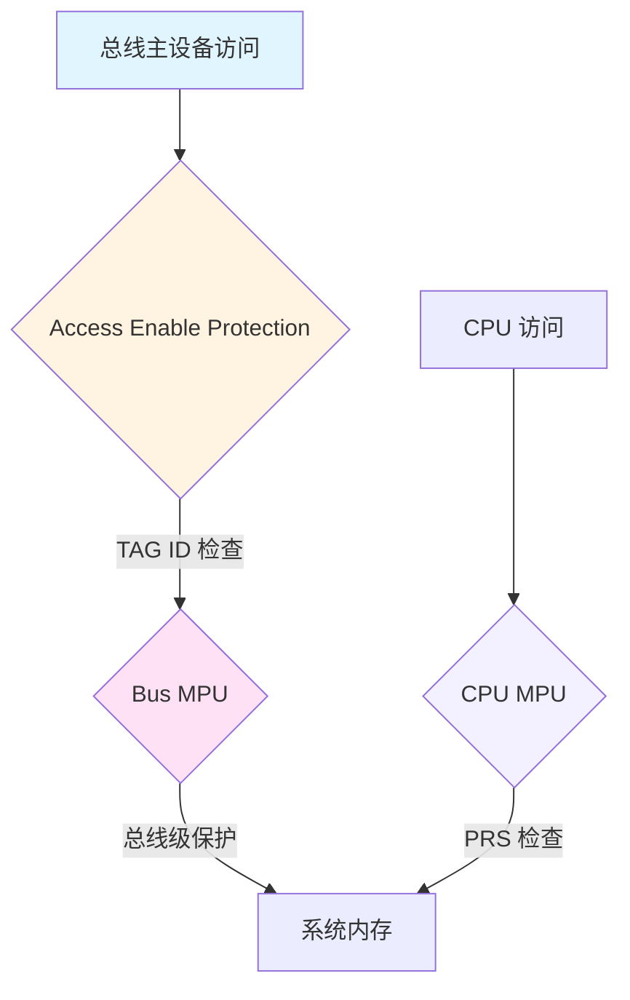
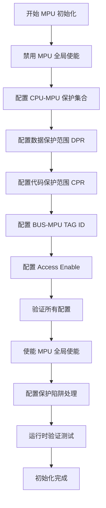

# AURIX TC3xx MPU 区域使用 - 综合指南

## 概述

AURIX TC3xx 系列采用了复杂的双 MPU（内存保护单元）架构，专为汽车功能安全应用而设计。本指南提供了 MPU 区域配置、使用模式以及开发可靠嵌入式系统最佳实践的全面见解。

## MPU 架构

### 从 TC2xx 到 TC3xx 的演进

TC3xx MPU 架构在 TC2xx 基础上进行了显著增强：

| 特性 | TC2xx | TC3xx | 改进说明 |
|------|-------|-------|----------|
| 保护集合数 | 4 个 (PRS0-PRS3) | 6 个 (PRS0-PRS5) | 增加 50%，支持更复杂的任务分区 |
| 数据保护范围 | 16 个 (DPR0-DPR15) | **18 个 (DPR0-DPR17)** | 增加 12.5%，更精细的数据分区 |
| 代码保护范围 | 8 个 (CPR0-CPR7) | **10 个 (CPR0-CPR9)** | 增加 25%，更精细的代码分区 |
| BUS-MPU | 基础版本 | 增强版本 | 更精细的访问控制 |
| 时间保护 | 无 | 支持 | 新增时间保护系统 (TPS) |

### 双 MPU 设计

TC3xx 实现了两个不同但互补的 MPU 单元，形成分层内存保护架构：

```
                    应用层访问
                         |
                         v
                   +-------------+
                   |   CPU-MPU   |
                   | 核心内存保护 |
                   +-------------+
                         |
                         v
                   +-------------+
                   |  BUS-MPU    |
                   | 总线级保护   |
                   +-------------+

CPU-MPU 特性:
  • 保护每个 CPU 核心内的内存访问
  • 基于 PSW.PRS 的保护集合选择
  • 16 个数据保护范围 DPR0-15
  • 16 个代码保护范围 CPR0-15
  • 8 字节(数据) / 32 字节(代码) 粒度

BUS-MPU 特性:
  • 保护 CPU 本地内存免受总线主设备访问
  • 基于 SRI 标签 ID 的访问控制
  • 保护便笺式 RAM、SFR、本地 Flash
  • 独立于 CPU-MPU 的第二层防护
```

#### CPU-MPU 详细特性

**工作原理**：
- CPU-MPU 位于 CPU 核心，监控所有由 CPU 发起的内存访问
- 在访问实际内存之前，CPU-MPU 检查访问地址和权限
- 违规时立即触发保护陷阱 (Protection Trap)

**保护集合机制**：
- **PRS0 (保护集合 0)**：默认保护集合，中断和陷阱时自动激活
- **PRS1-PRS5**：可分配给不同任务或进程
- **快速切换**：通过修改 PSW.PRS 位域实现保护集合切换

#### BUS-MPU 详细特性

**工作原理**：
- BUS-MPU 位于系统总线接口，监控所有总线主设备的访问
- 检查每个总线事务的 SRI 标签 ID 和访问权限
- 支持多核环境下的跨核访问控制

**保护的内存区域**：
1. **便笺式 RAM (Scratchpad RAM)**：CPU 本地的高速存储器
2. **特殊功能寄存器 (SFR)**：外设控制和状态寄存器
3. **本地 P-Flash**：CPU 本地的程序 Flash 存储库

### 关键特性

- **6 个保护集合 (PRS)** 每个 CPU（从 TC2xx 的 4 个增加）
  - PRS0：系统/OS 保护（自动激活）
  - PRS1-5：应用程序自定义保护

- **18 个数据保护范围** (DPR0-DPR17)
  - 8 字节地址粒度
  - 独立的读/写使能控制
  - 支持保护集合间权限共享

- **10 个代码保护范围** (CPR0-CPR9)
  - 32 字节地址粒度
  - 执行使能控制
  - 与指令缓存行优化对齐

- **8 字节粒度** 用于数据保护范围
  - 匹配 64 位数据总线宽度
  - 精细的变量级保护
  - 适合结构体字段和栈帧保护

- **32 字节粒度** 用于代码保护范围
  - 与 TriCore 指令缓存行 (32 字节) 完全对齐
  - 函数边界天然对齐
  - 最优代码执行效率

## 保护区域配置

### 数据保护范围 (DPR)

数据保护范围使用寄存器对进行配置：

```c
// 配置数据保护范围边界
__mtcr(DPRx_L, lower_address);    // 下边界
__mtcr(DPRx_U, upper_address);    // 上边界

// 设置访问权限
__mtcr(DPRE_x, read_enable_mask);    // 数据读使能
__mtcr(DPWE_x, write_enable_mask);   // 数据写使能
```

### 代码保护范围 (CPR)

代码保护范围遵循类似模式：

```c
// 配置代码保护范围边界
__mtcr(CPRy_L, lower_address);    // 下边界
__mtcr(CPRy_U, upper_address);    // 上边界

// 设置执行权限
__mtcr(CPXE_y, execute_enable_mask);  // 代码执行使能
```

### 保护集合选择

活动保护集合由 PSW.PRS 位域控制：

```c
// 选择保护集合 0-5
uint32_t psw = __mfcr(PSW);
psw = (psw & ~PSW_PRS_MASK) | (desired_prs << PSW_PRS_POS);
__mtcr(PSW, psw);
```

## BUS-MPU 配置

### 本地内存保护

BUS-MPU 保护 CPU 本地内存免受未经授权的总线访问：

```c
// 便笺式 RAM 保护
__mtcr(SPR_SPROT_RGNLA0, region_lower_addr);   // 区域下地址
__mtcr(SPR_SPROT_RGNUA0, region_upper_addr);   // 区域上地址
__mtcr(SPR_SPROT_RGNACCEN0_R, read_mask);      // 读访问使能
__mtcr(SPR_SPROT_RGNACCEN0_W, write_mask);     // 写访问使能
```

### SFR 和 Flash 保护

特殊功能寄存器和本地 flash 存储库也受到保护：

```c
// SFR 访问保护
__mtcr(SFR_SPROT_ACCENA_R, sfr_read_mask);
__mtcr(SFR_SPROT_ACCENA_W, sfr_write_mask);

// 本地 Pflash 存储库保护
__mtcr(LPB_SPROT_ACCENA_R, flash_read_mask);
```

## Access Enable Protection (访问使能保护)

除了 CPU-MPU 和 BUS-MPU 之外，TC3xx 还提供了第三层内存保护机制：**Access Enable Protection**。这三层保护机制共同工作，提供全面的内存安全保护。

### 三层保护机制概述



```
      总线主设备访问               CPU 访问
           |                          |
           v                          v
    +----------------+       +------------------+
    | Access Enable |       |    CPU-MPU     |
    |   Protection   |       |   (基于 PRS)    |
    +----------------+       +------------------+
           |                          |
           v                          v
    +----------------+       +------------------+
    |     BUS-MPU    |       |   系统内存      |
    |  (基于 TAG ID)  |       |                  |
    +----------------+       +------------------+
```

### Access Enable Protection 工作原理

Access Enable Protection (AEP) 是基于总线主设备 TAG ID 的外设访问控制机制，用于限制总线主设备对外设空间的访问。

#### 关键特性

1. **TAG ID 分配**：每个总线主设备（CPU、DMA等）在系统初始化时分配一个唯一的 TAG ID
2. **外设地址空间过滤**：对特定外设地址空间的访问进行 TAG ID 检查
3. **与 MPU 的区别**：
   - **Access Enable**：基于 TAG ID，过滤外设访问
   - **BUS-MPU**：保护 CPU 本地内存（SRAM、SFR、Flash）
   - **CPU-MPU**：基于 PRS，提供细粒度的地址范围保护

#### SRI 总线 TAG 架构

系统请求接口 (SRI) 使用 TAG ID 来标识总线主设备：

| 总线主设备 | TAG ID | 描述 |
|-----------|--------|------|
| CPU0 | 0x00 | 核心 0 |
| CPU1 | 0x01 | 核心 1 |
| CPU2 | 0x02 | 核心 2 |
| CPU3 | 0x03 | 核心 3 |
| CPU4 | 0x04 | 核心 4 |
| CPU5 | 0x05 | 核心 5 |
| DMA0 | 0x08 | DMA 通道 0 |
| DMA1 | 0x09 | DMA 通道 1 |
| DMA2 | 0x0A | DMA 通道 2 |
| DMA3 | 0x0B | DMA 通道 3 |
| ... | ... | 其他总线主设备 |

> **注意**：TAG ID 分配是器件特定的，请参考具体器件的用户手册。

### Access Enable 配置

Access Enable Protection 通过**访问使能寄存器**配置：

```c
/**
 * @brief 配置 Access Enable Protection
 *
 * @param peripheral_addr 外设地址空间的基址
 * @param tag_id 允许访问的 TAG ID
 * @param access_type 访问类型（读/写/读写）
 */
void configure_access_enable(uint32_t peripheral_addr, uint8_t tag_id, access_type_t access_type) {
    uint32_t reg_addr = peripheral_addr + AEN_OFFSET;

    // 计算访问使能位
    // 每个 TAG ID 对应 2 位（读/写）
    uint32_t access_enable = 0;

    if (access_type & ACCESS_READ) {
        access_enable |= (0x01 << (tag_id * 2));    // 读使能位
    }
    if (access_type & ACCESS_WRITE) {
        access_enable |= (0x02 << (tag_id * 2));    // 写使能位
    }

    // 写入访问使能寄存器
    __mtcr(reg_addr, access_enable);
}

/**
 * @brief 配置 DMA 对特定外设的访问权限
 */
void configure_dma_access(uint32_t peripheral_base, uint8_t dma_channel,
                         bool read_enable, bool write_enable) {
    uint32_t tag_id = get_dma_tag_id(dma_channel);  // 例如 DMA0 = 0x08

    configure_access_enable(peripheral_base, tag_id,
                             (read_enable ? ACCESS_READ : 0) |
                             (write_enable ? ACCESS_WRITE : 0));
}
```

### Access Enable 与 MPU 的协同工作

Access Enable Protection 和 MPU 形成分层保护策略：

```
┌─────────────────────────────────────────────────────────┐
│                   外设地址空间                          │
├─────────────────────────────────────────────────────────┤
│  Access Enable Protection (TAG ID 过滤)                │
│  - 第一道防线                                       │
│  - 基于总线主设备身份                                │
│  - 粗粒度：外设地址块                                 │
└─────────────────────────────────────────────────────────┘
                           │
                           v
┌─────────────────────────────────────────────────────────┐
│              CPU 本地内存（SRAM/SFR/Flash）            │
├─────────────────────────────────────────────────────────┤
│  BUS-MPU (TAG ID 过滤)                                │
│  - 第二道防线                                       │
│  - 保护 CPU 私有内存                                  │
│  - 防止其他主设备非法访问                            │
└─────────────────────────────────────────────────────────┘
                           │
                           v
┌─────────────────────────────────────────────────────────┐
│              系统内存（DSRAM、LMEM）                     │
├─────────────────────────────────────────────────────────┤
│  CPU-MPU (PRS 保护集合)                               │
│  - 第三道防线                                        │
│  - 最细粒度控制                                      │
│  - 基于地址范围和权限                                 │
└─────────────────────────────────────────────────────────┘
```

### Access Enable 配置示例

#### 示例 1：限制 DMA 只访问特定外设

```c
/**
 * @brief 配置 DMA 仅能访问 UART 外设
 */
void configure_dma_uart_access_only(void) {
    // UART 基址（假设）
    uint32_t uart_base = 0xF0005000;

    // 允许 DMA0 (TAG=0x08) 访问 UART，只读权限
    configure_access_enable(uart_base, 0x08, ACCESS_READ);

    // 禁止 CPU 直接访问（确保只能通过 DMA）
    // CPU0 (TAG=0x00) - 禁用
    // CPU1 (TAG=0x01) - 禁用
    configure_access_enable(uart_base, 0x00, 0);     // 禁用 CPU0
    configure_access_enable(uart_base, 0x01, 0);     // 禁用 CPU1
}
```

#### 示例 2：多核外设访问控制

```c
/**
 * @brief 配置多核环境下的外设访问
 *
 * 策略：
 * - CPU0：完全控制外设
 * - CPU1：只读访问外设状态寄存器
 * - DMA：只能写入数据缓冲区
 */
void configure_multicore_peripheral_access(uint32_t peripheral_base) {
    // CPU0 (TAG=0x00)：读写访问
    configure_access_enable(peripheral_base, 0x00, ACCESS_READ | ACCESS_WRITE);

    // CPU1 (TAG=0x01)：只读访问
    configure_access_enable(peripheral_base, 0x01, ACCESS_READ);

    // DMA0 (TAG=0x08)：只写访问
    configure_access_enable(peripheral_base, 0x08, ACCESS_WRITE);
}
```

### Access Enable 与系统安全

Access Enable Protection 在功能安全系统中起到重要作用：

#### ASIL-D 应用隔离

```c
/**
 * @brief 为 ASIL-D 应用配置严格的访问控制
 */
void configure_asil_d_access_protection(void) {
    // ASIL-D 专用外设（例如：安全关键执行器）
    uint32_t safety_peripheral_base = 0xF0002000;

    // 仅允许 CPU0（ASIL-D 核心）访问
    configure_access_enable(safety_peripheral_base, 0x00,
                             ACCESS_READ | ACCESS_WRITE);

    // 禁止其他所有核心和 DMA
    for (uint8_t tag = 1; tag <= 0x0B; tag++) {
        configure_access_enable(safety_peripheral_base, tag, 0);
    }
}
```

#### 外设寄存器级保护

Access Enable Protection 也可以配置为保护单个外设寄存器：

```c
// 某些器件支持寄存器级别的访问控制
void configure_register_level_access(uint32_t peripheral_base) {
    // 配置控制寄存器（offset 0x00）：仅 CPU0 可写
    __mtcr(peripheral_base + 0x00, (0x03 << 0));  // TAG=0 可读写

    // 配置状态寄存器（offset 0x04）：所有 CPU 可读
    __mtcr(peripheral_base + 0x04, 0xFF);        // 所有 TAG 可读

    // 配置数据寄存器（offset 0x08）：仅 CPU0 和 DMA0 可写
    __mtcr(peripheral_base + 0x08,
          (0x01 << (0 * 2)) |  // TAG=0 读
          (0x01 << (8 * 2)));  // TAG=8 写
}
```

### Access Enable 最佳实践

1. **分层配置**：
   - 使用 Access Enable 保护外设访问
   - 使用 BUS-MPU 保护 CPU 本地内存
   - 使用 CPU-MPU 保护应用程序代码和数据

2. **最小权限原则**：
   - 仅授予必需的最小访问权限
   - 定期审查访问权限配置

3. **TAG ID 管理**：
   - 在系统初始化阶段明确定义 TAG ID 分配
   - 避免动态修改 TAG ID 分配
   - 文档化 TAG ID 与总线主设备的映射关系

4. **安全验证**：
   - 在系统启动时验证 Access Enable 配置
   - 在运行时监控访问违规事件
   - 对违规事件记录并报告

## MPU 初始化检查清单

### 初始化顺序

TC3xx MPU 的初始化必须按照严格的顺序进行，错误的顺序可能导致不可预测的行为或保护失效。



### 详细初始化步骤

#### 步骤 1：禁用 MPU 全局使能

**⚠️ 关键**：在配置任何 MPU 寄存器之前，必须先禁用 MPU。

```c
void mpu_init_step1_disable(void) {
    uint32_t psw = __mfcr(PSW);

    // 清除 PROTEN 位，禁用 MPU 保护
    psw &= ~(1UL << PSW_PROTEN_POS);

    // 保存当前 PRS 值
    uint32_t current_prs = (psw >> PSW_PRS_POS) & PSW_PRS_MASK;

    __mtcr(PSW, psw);

    // 刷新流水线确保立即生效
    __isync();

    return current_prs;  // 返回当前 PRS 供后续恢复
}
```

**注意事项**：
- 禁用 MPU 后，所有内存访问不再受保护
- 尽量缩短禁用时间，避免安全风险
- 在多核系统中，所有核心都需要同步禁用

#### 步骤 2：配置 CPU-MPU 保护集合 (PRS)

配置每个保护集合的保护范围和权限。

```c
void mpu_init_step2_configure_prs(void) {
    // 配置 PRS0：操作系统和中断处理程序
    configure_prs(0, 0x00000000, 0x001FFFFF, 0x1F);  // 全访问

    // 配置 PRS1：ASIL-D 安全关键任务
    configure_prs(1, 0x00200000, 0x003FFFFF, 0x1B);  // RWX, 用户态无执行

    // 配置 PRS2：ASIL-B 任务
    configure_prs(2, 0x00400000, 0x005FFFFF, 0x13);  // RW, 无执行

    // 配置 PRS3：QM 非安全任务
    configure_prs(3, 0x00600000, 0x007FFFFF, 0x11);  // 仅读

    // 配置 PRS4-5：额外分区
    configure_prs(4, 0x00800000, 0x009FFFFF, 0x1F);
    configure_prs(5, 0x00A00000, 0x00BFFFFF, 0x1F);
}

void configure_prs(uint32_t prs_id, uint32_t start_addr,
                   uint32_t end_addr, uint32_t permissions) {
    // 配置起始地址 (PRSn_L)
    __mtcr(PRS0_L + (prs_id * 8), start_addr);

    // 配置结束地址 (PRSn_H)
    __mtcr(PRS0_H + (prs_id * 8), end_addr);

    // 配置访问权限 (PRSn_BAC)
    __mtcr(PRS0_BAC + (prs_id * 8), permissions);

    // 刷新 TLB
    __isync();
}
```

**重要**：
- 必须按顺序配置：PRS_L → PRS_H → PRSn_BAC
- 地址必须与粒度对齐（通常 1MB 或 4KB）
- TC3xx 有 6 个保护集合（PRS0-PRS5）

#### 步骤 3：配置数据保护范围 (DPR)

配置数据保护范围，用于细粒度的数据内存保护。

```c
void mpu_init_step3_configure_dpr(void) {
    // TC3xx 有 18 个 DPR (DPR0-DPR17)
    // 配置前 9 个 DPR 的使能位和对应 DPRE/DPWE

    // DPR0: 栈保护
    configure_dpr(0, 0x70000000, 0x70000FFF, 0x03, true);

    // DPR1: 堆保护
    configure_dpr(1, 0x70001000, 0x70001FFF, 0x01, true);

    // DPR2: 共享数据区
    configure_dpr(2, 0x70002000, 0x70002FFF, 0x0F, true);

    // ... 继续配置其他 DPR
}

void configure_dpr(uint32_t dpr_id, uint32_t start_addr,
                   uint32_t end_addr, uint32_t tag_mask, bool enable) {
    // 配置下边界 (DPRn_L)
    __mtcr(DPR0_L + (dpr_id * 4), start_addr);

    // 配置上边界 (DPRn_H)
    __mtcr(DPR0_H + (dpr_id * 4), end_addr);

    // 配置 TAG ID 和读写使能
    uint32_t dpre = __mfcr(DPRE0);
    uint32_t dpwe = __mfcr(DPWE0);

    if (enable) {
        // 设置读使能
        if (tag_mask & 0x01) {
            dpre |= (1 << dpr_id);
        }
        // 设置写使能
        if (tag_mask & 0x02) {
            dpwe |= (1 << dpr_id);
        }
    } else {
        dpre &= ~(1 << dpr_id);
        dpwe &= ~(1 << dpr_id);
    }

    __mtcr(DPRE0, dpre);
    __mtcr(DPWE0, dpwe);
}
```

**注意事项**：
- TC3xx 有 18 个 DPR（DPR0-DPR17）
- DPR0-8 由 DPRE0/DPWE0 控制，DPR9-17 由 DPRE1/DPWE1 控制
- 地址必须与粒度对齐（通常 1KB 或 4KB）

#### 步骤 4：配置代码保护范围 (CPR)

配置代码保护范围，用于保护代码内存。

```c
void mpu_init_step4_configure_cpr(void) {
    // TC3xx 有 10 个 CPR (CPR0-CPR9)

    // CPR0: 引导代码
    configure_cpr(0, 0x80000000, 0x8001FFFF, 0x3F, true);

    // CPR1: 操作系统代码
    configure_cpr(1, 0x80020000, 0x8003FFFF, 0x3F, true);

    // CPR2: 应用程序代码
    configure_cpr(2, 0x80040000, 0x8005FFFF, 0x1F, true);

    // ... 继续配置其他 CPR
}

void configure_cpr(uint32_t cpr_id, uint32_t start_addr,
                   uint32_t end_addr, uint32_t tag_mask, bool enable) {
    // 配置下边界 (CPRn_L)
    __mtcr(CPR0_L + (cpr_id * 4), start_addr);

    // 配置上边界 (CPRn_H)
    __mtcr(CPR0_H + (cpr_id * 4), end_addr);

    // 配置 TAG ID 和执行使能
    uint32_t cpxe = __mfcr(CPXE0);

    if (enable) {
        cpxe |= (tag_mask << (cpr_id * 6));
    } else {
        cpxe &= ~(0x3F << (cpr_id * 6));
    }

    __mtcr(CPXE0, cpxe);
}
```

**注意事项**：
- TC3xx 有 10 个 CPR（CPR0-CPR9）
- 每个 CPR 支持 6 个 TAG ID 的执行权限
- 地址必须与粒度对齐（通常 4KB 或 8KB）

#### 步骤 5：配置 BUS-MPU TAG ID

配置总线主设备的 TAG ID 分配。

```c
void mpu_init_step5_configure_tag_ids(void) {
    // CPU0 的 TAG ID 为 0x00 (默认配置)

    // 配置 DMA 的 TAG ID
    // DMA0 → TAG 0x08, DMA1 → TAG 0x09, 等
    configure_dma_tag_id(0, 0x08);
    configure_dma_tag_id(1, 0x09);
    configure_dma_tag_id(2, 0x0A);
    configure_dma_tag_id(3, 0x0B);
}

void configure_dma_tag_id(uint32_t dma_channel, uint8_t tag_id) {
    // 配置 DMA 通道的 TAG ID
    // 注意：具体寄存器地址取决于 DMA 模块
    uint32_t tag_reg = DMA_BASE + (dma_channel * DMA_CHANNEL_OFFSET) + TAG_OFFSET;

    __mtcr(tag_reg, tag_id);
}
```

**TAG ID 分配**：
| 总线主设备 | TAG ID | 说明 |
|-----------|--------|------|
| CPU0 | 0x00 | 核心 0 |
| CPU1 | 0x01 | 核心 1 |
| CPU2 | 0x02 | 核心 2 |
| CPU3 | 0x03 | 核心 3 |
| CPU4 | 0x04 | 核心 4 |
| CPU5 | 0x05 | 核心 5 |
| DMA0 | 0x08 | DMA 通道 0 |
| DMA1 | 0x09 | DMA 通道 1 |
| DMA2 | 0x0A | DMA 通道 2 |
| DMA3 | 0x0B | DMA 通道 3 |

#### 步骤 6：配置 Access Enable

配置外设级别的访问控制。

```c
void mpu_init_step6_configure_access_enable(void) {
    // 配置关键外设的访问权限

    // QSPI Flash: 仅 CPU0 可访问
    configure_access_enable(QSPI_BASE, 0x00, ACCESS_READ | ACCESS_WRITE);

    // Ethernet: CPU0 和 DMA0 可访问
    configure_access_enable(ETH_BASE, 0x00, ACCESS_READ | ACCESS_WRITE);
    configure_access_enable(ETH_BASE, 0x08, ACCESS_READ | ACCESS_WRITE);

    // CAN: 仅 CPU1 可访问
    configure_access_enable(CAN_BASE, 0x01, ACCESS_READ | ACCESS_WRITE);
}
```

#### 步骤 7：验证配置

在启用 MPU 之前，验证所有配置是否正确。

```c
bool mpu_init_step7_verify(void) {
    bool verified = true;

    // 验证 PRS 配置
    for (int i = 0; i < 6; i++) {
        uint32_t prs_l = __mfcr(PRS0_L + (i * 8));
        uint32_t prs_h = __mfcr(PRS0_H + (i * 8));
        if (prs_l >= prs_h) {
            // 无效范围
            verified = false;
        }
    }

    // 验证 DPR 配置
    for (int i = 0; i < 18; i++) {
        uint32_t dpr_l = __mfcr(DPR0_L + (i * 4));
        uint32_t dpr_h = __mfcr(DPR0_H + (i * 4));
        if (dpr_l >= dpr_h) {
            // 无效范围
            verified = false;
        }
    }

    // 验证 CPR 配置
    for (int i = 0; i < 10; i++) {
        uint32_t cpr_l = __mfcr(CPR0_L + (i * 4));
        uint32_t cpr_h = __mfcr(CPR0_H + (i * 4));
        if (cpr_l >= cpr_h) {
            // 无效范围
            verified = false;
        }
    }

    return verified;
}
```

#### 步骤 8：使能 MPU 全局使能

```c
void mpu_init_step8_enable(uint32_t initial_prs) {
    uint32_t psw = __mfcr(PSW);

    // 设置初始 PRS
    psw = (psw & ~PSW_PRS_MASK) | (initial_prs << PSW_PRS_POS);

    // 设置 PROTEN 位，使能 MPU
    psw |= (1UL << PSW_PROTEN_POS);

    __mtcr(PSW, psw);

    // 刷新流水线
    __isync();
}
```

**⚠️ 关键**：只有在完成所有配置并验证后，才能使能 MPU。

#### 步骤 9：配置保护陷阱处理

配置 MPU 陷阱处理程序。

```c
void mpu_init_step9_configure_traps(void) {
    // 安装 Class 1 陷阱（MPX）
    trap_install_handler(TRAP_CLASS_1, mpx_trap_handler);

    // 安装 Class 4 陷阱（数据保护）
    trap_install_handler(TRAP_CLASS_4, data_protection_trap_handler);
}

void mpx_trap_handler(void) {
    uint32_t tin = __mfcr(TRAP_TIN);

    switch (tin) {
        case 0x04:  // MPX 陷阱
            // 处理内存保护执行违规
            handle_mpx_violation();
            break;
        default:
            // 其他 Class 1 陷阱
            break;
    }
}

void data_protection_trap_handler(void) {
    uint32_t tin = __mfcr(TRAP_TIN);

    switch (tin) {
        case 0x08:  // MPN - 非特权访问违规
            handle_mpn_violation();
            break;
        case 0x09:  // MPP - 保护违规
            handle_mpp_violation();
            break;
        case 0x0A:  // MPR - 读保护违规
            handle_mpr_violation();
            break;
        case 0x0B:  // MPW - 写保护违规
            handle_mpw_violation();
            break;
        default:
            break;
    }
}
```

#### 步骤 10：运行时验证测试

执行运行时测试以验证 MPU 配置。

```c
void mpu_init_step10_runtime_test(void) {
    // 测试 1：验证代码保护
    test_code_protection();

    // 测试 2：验证数据保护
    test_data_protection();

    // 测试 3：验证外设访问保护
    test_peripheral_protection();
}

void test_data_protection(void) {
    volatile uint32_t *protected_addr = (uint32_t *)0x70000000;

    // 尝试写入受保护的内存区域
    // 应该触发 MPW 陷阱
    __asm__ volatile ("mov.d %%d15, %0\n\t"
                      "st.w [%%d15], %%d15\n\t"
                      : : "a" (protected_addr) : "d15");
}
```

### 初始化检查清单

使用以下检查清单确保所有步骤正确完成：

- [ ] **步骤 1**：禁用 MPU 全局使能（PROTEN = 0）
- [ ] **步骤 2**：配置所有 6 个 PRS（PRS0-PRS5）
  - [ ] 每个PRS配置：起始地址、结束地址、访问权限
  - [ ] 验证地址范围有效
  - [ ] 验证地址对齐
- [ ] **步骤 3**：配置所有 18 个 DPR（DPR0-DPR17）
  - [ ] 每个DPR配置：起始地址、结束地址、TAG ID
  - [ ] 配置 DPRE0/DPWE0（DPR0-8）
  - [ ] 配置 DPRE1/DPWE1（DPR9-17）
- [ ] **步骤 4**：配置所有 10 个 CPR（CPR0-CPR9）
  - [ ] 每个CPR配置：起始地址、结束地址、TAG ID
  - [ ] 配置 CPXE0/CPXE1
- [ ] **步骤 5**：配置 BUS-MPU TAG ID
  - [ ] CPU0-5 TAG ID 配置
  - [ ] DMA0-3 TAG ID 配置
- [ ] **步骤 6**：配置 Access Enable
  - [ ] 关键外设访问权限配置
  - [ ] 验证外设保护
- [ ] **步骤 7**：验证所有配置
  - [ ] 检查地址范围有效性
  - [ ] 检查权限配置
  - [ ] 检查 TAG ID 配置
- [ ] **步骤 8**：使能 MPU 全局使能（PROTEN = 1）
  - [ ] 设置初始 PRS
  - [ ] 使能 PROTEN
- [ ] **步骤 9**：配置陷阱处理程序
  - [ ] Class 1 MPX 陷阱处理程序
  - [ ] Class 4 数据保护陷阱处理程序
- [ ] **步骤 10**：运行时验证测试
  - [ ] 代码保护测试
  - [ ] 数据保护测试
  - [ ] 外设访问保护测试

### 常见初始化错误

#### 错误 1：在使能 MPU 后配置保护范围

```c
// ❌ 错误：在 MPU 使能后配置
uint32_t psw = __mfcr(PSW);
psw |= (1UL << PSW_PROTEN_POS);
__mtcr(PSW, psw);

// 此时配置 DPR 可能导致不可预测的行为
__mtcr(DPR0_L, 0x70000000);
```

**正确做法**：
```c
// ✅ 正确：先配置，后使能
__mtcr(DPR0_L, 0x70000000);
__mtcr(DPR0_H, 0x70000FFF);

uint32_t psw = __mfcr(PSW);
psw |= (1UL << PSW_PROTEN_POS);
__mtcr(PSW, psw);
```

#### 错误 2：地址未对齐

```c
// ❌ 错误：地址未对齐到粒度边界
__mtcr(DPR0_L, 0x70000100);  // 未对齐到 1KB 边界
```

**正确做法**：
```c
// ✅ 正确：地址对齐到粒度边界
__mtcr(DPR0_L, 0x70000000);  // 对齐到 1KB 边界
```

#### 错误 3：起始地址 >= 结束地址

```c
// ❌ 错误：起始地址大于结束地址
__mtcr(DPR0_L, 0x70002000);
__mtcr(DPR0_H, 0x70001000);
```

**正确做法**：
```c
// ✅ 正确：起始地址小于结束地址
__mtcr(DPR0_L, 0x70001000);
__mtcr(DPR0_H, 0x70002000);
```

#### 错误 4：配置未使用的 DPR/CPR

```c
// ❌ 错误：配置了过多的 DPR/CPR
// TC3xx 只有 18 个 DPR 和 10 个 CPR
configure_dpr(18, ...);  // 超出范围
configure_cpr(10, ...);  // 超出范围
```

**正确做法**：
```c
// ✅ 正确：在范围内配置
configure_dpr(17, ...);  // 最多 DPR17
configure_cpr(9, ...);   // 最多 CPR9
```

#### 错误 5：忽略多核同步

```c
// ❌ 错误：仅在一个核心上初始化 MPU
void core0_init(void) {
    mpu_init();
    // 其他核心可能仍在运行旧配置
}
```

**正确做法**：
```c
// ✅ 正确：所有核心同步初始化
void multicore_mpu_init(void) {
    // 通知所有核心进入安全状态
    signal_all_cores_pause();

    // 等待所有核心暂停
    wait_all_cores_paused();

    // 在所有核心上禁用 MPU
    for (int core = 0; core < 6; core++) {
        if (core != current_core) {
            remote_mpu_disable(core);
        } else {
            local_mpu_disable();
        }
    }

    // 配置 MPU（所有核心共享相同的配置）
    configure_mpu();

    // 在所有核心上使能 MPU
    for (int core = 0; core < 6; core++) {
        if (core != current_core) {
            remote_mpu_enable(core, initial_prs[core]);
        } else {
            local_mpu_enable(initial_prs[core]);
        }
    }

    // 恢复所有核心
    signal_all_cores_resume();
}
```

## 实际使用模式

### 操作系统集成

对于基于 RTOS 的系统，典型的保护集合分配：

- **PRS0**：操作系统和中断处理程序（自动激活）
- **PRS1**：高优先级安全关键任务 (ASIL-D)
- **PRS2**：中优先级任务 (ASIL-B)
- **PRS3**：低优先级非安全任务 (QM)
- **PRS4-5**：额外的应用程序分区

### 上下文切换

在操作系统上下文切换期间：

```c
void switch_task_protection(task_context_t* new_task) {
    // 选择适当的保护集合
    __mtcr(PSW, (__mfcr(PSW) & ~PSW_PRS_MASK) | (new_task->prs << PSW_PRS_POS));
    
    // 可选：立即刷新流水线
    __isync();
}
```

### 中断处理

PRS0 在中断期间自动激活，确保操作系统保护：

```c
__interrupt void irq_handler(void) {
    // PRS0 自动激活 - 操作系统内存保护强制执行

    // 处理中断
    process_irq();

    // 退出时返回任务保护集合
}
```

### 实际配置示例

#### 示例 1：单核裸机应用 MPU 配置

适用于简单的单核应用，提供基本的内存保护。

```c
/**
 * @brief 单核裸机应用的 MPU 配置
 * @note 适用于简单的控制应用，无 RTOS
 */
void single_core_mpu_config(void) {
    // 步骤 1：禁用 MPU
    uint32_t psw = __mfcr(PSW);
    psw &= ~(1UL << PSW_PROTEN_POS);
    __mtcr(PSW, psw);
    __isync();

    // 步骤 2：配置 PRS0（默认保护集合）
    // 代码区域：0x80000000 - 0x800FFFFF (1MB)
    __mtcr(PRS0_L, 0x80000000);
    __mtcr(PRS0_H, 0x800FFFFF);
    // 读=1, 写=0, 执行=1, 用户=1, XOS=1
    __mtcr(PRS0_BAC, 0x17);

    // 数据区域：0x70000000 - 0x700FFFFF (1MB)
    __mtcr(PRS1_L, 0x70000000);
    __mtcr(PRS1_H, 0x700FFFFF);
    // 读=1, 写=1, 执行=0, 用户=1, XOS=1
    __mtcr(PRS1_BAC, 0x13);

    // 外设区域：0xF0000000 - 0xF00FFFFF
    __mtcr(PRS2_L, 0xF0000000);
    __mtcr(PRS2_H, 0xF00FFFFF);
    // 读=1, 写=1, 执行=0, 用户=0, XOS=1
    __mtcr(PRS2_BAC, 0x07);

    // 步骤 3：配置 DPR0 保护栈区域
    __mtcr(DPR0_L, 0x70008000);  // 栈起始地址
    __mtcr(DPR0_H, 0x70008FFF);  // 栈结束地址 (4KB)
    uint32_t dpre0 = __mfcr(DPRE0);
    uint32_t dpwe0 = __mfcr(DPWE0);
    dpre0 |= 0x01;  // TAG 0 读使能
    dpwe0 |= 0x01;  // TAG 0 写使能
    __mtcr(DPRE0, dpre0);
    __mtcr(DPWE0, dpwe0);

    // 步骤 4：配置 CPR0 保护代码区域
    __mtcr(CPR0_L, 0x80000000);
    __mtcr(CPR0_H, 0x800FFFFF);
    uint32_t cpxe0 = __mfcr(CPXE0);
    cpxe0 |= 0x01;  // TAG 0 执行使能
    __mtcr(CPXE0, cpxe0);

    // 步骤 5：配置 Access Enable（关键外设）
    // QSPI Flash：仅 CPU0 可访问
    __mtcr(0xF0001A00, 0x01);  // TAG 0 读写

    // 步骤 6：验证配置
    if (!verify_mpu_config()) {
        // 处理配置错误
        handle_mpu_config_error();
    }

    // 步骤 7：使能 MPU
    psw = __mfcr(PSW);
    psw |= (1UL << PSW_PROTEN_POS);
    __mtcr(PSW, psw);
    __isync();
}
```

#### 示例 2：多核 ASIL-D 应用 MPU 配置

适用于安全关键的多核应用，实现 ASIL-D 和 QM 应用的隔离。

```c
/**
 * @brief 多核 ASIL-D 应用的 MPU 配置
 * @note 实现 ASIL-D 和 QM 应用的自由干扰
 */
void multicore_asil_d_mpu_config(void) {
    // 步骤 1：同步所有核心禁用 MPU
    multicore_sync_disable_mpu();

    // 步骤 2：配置 CPU0 的保护集合（ASIL-D 核心）

    // PRS0：操作系统内核（ASIL-D）
    __mtcr(PRS0_L, 0x80000000);
    __mtcr(PRS0_H, 0x803FFFFF);  // 4MB
    __mtcr(PRS0_BAC, 0x1F);  // 特权级全访问

    // PRS1：ASIL-D 应用代码
    __mtcr(PRS1_L, 0x80400000);
    __mtcr(PRS1_H, 0x807FFFFF);  // 4MB
    __mtcr(PRS1_BAC, 0x1B);  // 用户级 RWX

    // PRS2：ASIL-D 应用数据
    __mtcr(PRS2_L, 0x70000000);
    __mtcr(PRS2_H, 0x703FFFFF);  // 4MB
    __mtcr(PRS2_BAC, 0x13);  // 用户级 RW

    // PRS3：共享通信区域（QM 核心可读）
    __mtcr(PRS3_L, 0x70400000);
    __mtcr(PRS3_H, 0x70400FFF);  // 4KB
    __mtcr(PRS3_BAC, 0x13);  // 用户级 RW

    // 步骤 3：配置 DPR 保护共享数据

    // DPR0：ASIL-D 栈（CPU0 专用）
    __mtcr(DPR0_L, 0x70010000);
    __mtcr(DPR0_H, 0x70010FFF);
    uint32_t dpre0 = __mfcr(DPRE0);
    uint32_t dpwe0 = __mfcr(DPWE0);
    dpre0 |= 0x01;  // TAG 0 读
    dpwe0 |= 0x01;  // TAG 0 写
    __mtcr(DPRE0, dpre0);
    __mtcr(DPWE0, dpwe0);

    // DPR1：共享数据（所有核心可读）
    __mtcr(DPR1_L, 0x70400000);
    __mtcr(DPR1_H, 0x70400FFF);
    dpre0 = __mfcr(DPRE0);
    dpwe0 = __mfcr(DPWE0);
    // TAG 0-5 读使能
    dpre0 |= 0x3F;
    // 仅 TAG 0 写使能（ASIL-D 核心可写）
    dpwe0 |= 0x01;
    __mtcr(DPRE0, dpre0);
    __mtcr(DPWE0, dpwe0);

    // 步骤 4：配置 CPR 保护代码

    // CPR0：ASIL-D 引导代码（仅 CPU0 可执行）
    __mtcr(CPR0_L, 0x80000000);
    __mtcr(CPR0_H, 0x800FFFFF);
    uint32_t cpxe0 = __mfcr(CPXE0);
    cpxe0 |= 0x01;  // TAG 0 执行
    __mtcr(CPXE0, cpxe0);

    // CPR1：QM 应用代码（CPU1-5 可执行）
    __mtcr(CPR1_L, 0x80100000);
    __mtcr(CPR1_H, 0x801FFFFF);
    cpxe0 = __mfcr(CPXE0);
    // TAG 1-5 执行使能
    cpxe0 |= (0x3E << 6);  // CPR1 的 TAG 位置
    __mtcr(CPXE0, cpxe0);

    // 步骤 5：配置 Access Enable（外设隔离）

    // 安全关键外设：仅 CPU0 可访问
    __mtcr(0xF0001800, 0x01);  // CAN 0 - TAG 0
    __mtcr(0xF0001C00, 0x01);  // CAN 1 - TAG 0

    // 非安全外设：CPU0-5 可访问
    __mtcr(0xF0002000, 0x3F);  // GPIO - TAG 0-5

    // 步骤 6：同步所有核心使能 MPU
    uint32_t initial_prs[6] = {0, 1, 2, 3, 4, 5};
    multicore_sync_enable_mpu(initial_prs);
}
```

#### 示例 3：DMA 缓冲区保护配置

配置 DMA 缓冲区的访问保护，确保 DMA 只能访问指定的内存区域。

```c
/**
 * @brief DMA 缓冲区保护配置
 * @note 确保 DMA 只能访问授权的缓冲区
 */
void dma_buffer_protection_config(void) {
    // 配置 DMA0 的 TAG ID 为 0x08
    __mtcr(DMA0_TAG_REG, 0x08);

    // 配置 DMA1 的 TAG ID 为 0x09
    __mtcr(DMA1_TAG_REG, 0x09);

    // DPR0：DMA0 接收缓冲区（只读）
    __mtcr(DPR0_L, 0x70002000);
    __mtcr(DPR0_H, 0x70002FFF);  // 4KB
    uint32_t dpre0 = __mfcr(DPRE0);
    uint32_t dpwe0 = __mfcr(DPWE0);
    // TAG 8 (DMA0) 读使能
    dpre0 |= (1 << 8);
    // TAG 8 无写权限
    __mtcr(DPRE0, dpre0);
    __mtcr(DPWE0, dpwe0);

    // DPR1：DMA0 发送缓冲区（只写）
    __mtcr(DPR1_L, 0x70003000);
    __mtcr(DPR1_H, 0x70003FFF);  // 4KB
    dpre0 = __mfcr(DPRE0);
    dpwe0 = __mfcr(DPWE0);
    // TAG 8 (DMA0) 写使能
    dpwe0 |= (1 << 8);
    __mtcr(DPRE0, dpre0);
    __mtcr(DPWE0, dpwe0);

    // DPR2：DMA1 缓冲区
    __mtcr(DPR2_L, 0x70004000);
    __mtcr(DPR2_H, 0x70004FFF);  // 4KB
    dpre0 = __mfcr(DPRE0);
    dpwe0 = __mfcr(DPWE0);
    // TAG 9 (DMA1) 读写使能
    dpre0 |= (1 << 9);
    dpwe0 |= (1 << 9);
    __mtcr(DPRE0, dpre0);
    __mtcr(DPWE0, dpwe0);

    // 配置 Access Enable：Ethernet DMA
    // Ethernet 控制寄存器：CPU0 可读写
    __mtcr(ETH_BASE + 0x00, 0x01);
    // Ethernet DMA 描述符：CPU0 和 DMA0 可访问
    __mtcr(ETH_BASE + 0x04, 0x01);  // CPU0
    __mtcr(ETH_BASE + 0x08, 0x01);  // DMA0
}
```

#### 示例 4：栈溢出检测配置

使用 MPU 检测栈溢出，在栈边界设置保护区域。

```c
/**
 * @brief 栈溢出检测配置
 * @note 在栈边界设置保护区域以检测溢出
 */
void stack_overflow_detection_config(void) {
    // 定义栈区域
    #define STACK_BASE    0x70010000
    #define STACK_SIZE    0x2000  // 8KB

    // DPR0：栈保护区（底部 1KB，禁止访问）
    __mtcr(DPR0_L, STACK_BASE);
    __mtcr(DPR0_H, STACK_BASE + 0x3FF);
    uint32_t dpre0 = __mfcr(DPRE0);
    uint32_t dpwe0 = __mfcr(DPWE0);
    // 禁止所有 TAG 访问
    dpre0 &= ~(0x3FF);
    dpwe0 &= ~(0x3FF);
    __mtcr(DPRE0, dpre0);
    __mtcr(DPWE0, dpwe0);

    // DPR1：栈可用区域（剩余 7KB）
    __mtcr(DPR1_L, STACK_BASE + 0x400);
    __mtcr(DPR1_H, STACK_BASE + STACK_SIZE - 1);
    dpre0 = __mfcr(DPRE0);
    dpwe0 = __mfcr(DPWE0);
    // TAG 0 读写使能
    dpre0 |= (1 << 0);
    dpwe0 |= (1 << 0);
    __mtcr(DPRE0, dpre0);
    __mtcr(DPWE0, dpwe0);

    // DPR2：栈溢出检测区（顶部 1KB，禁止访问）
    __mtcr(DPR2_L, STACK_BASE + STACK_SIZE);
    __mtcr(DPR2_H, STACK_BASE + STACK_SIZE + 0x3FF);
    dpre0 = __mfcr(DPRE0);
    dpwe0 = __mfcr(DPWE0);
    // 禁止所有 TAG 访问
    dpre0 &= ~(0x3FF);
    dpwe0 &= ~(0x3FF);
    __mtcr(DPRE0, dpre0);
    __mtcr(DPWE0, dpwe0);

    // 栈溢出陷阱处理程序
    // 如果栈增长超过 DPR1 范围，将触发 MPW 陷阱
}

/**
 * @brief 栈溢出陷阱处理程序
 */
void stack_overflow_trap_handler(void) {
    uint32_t dstr = __mfcr(DSTR);  // 数据状态寄存器
    uint32_t deadd = __mfcr(DEADD);  // 数据错误地址寄存器

    if ((deadd >= 0x70010000 && deadd < 0x70010400) ||
        (deadd >= 0x70012000 && deadd < 0x70012400)) {
        // 栈溢出检测
        handle_stack_overflow(deadd);
    }
}
```

#### 示例 5：Flash 代码保护配置

保护 Flash 中的代码，防止未经修改的执行。

```c
/**
 * @brief Flash 代码保护配置
 * @note 保护 Flash 中的代码，防止未授权执行
 */
void flash_code_protection_config(void) {
    // CPR0：引导 Flash（仅 CPU0 可执行）
    __mtcr(CPR0_L, 0x80000000);
    __mtcr(CPR0_H, 0x8003FFFF);  // 256KB
    uint32_t cpxe0 = __mfcr(CPXE0);
    // TAG 0 执行使能
    cpxe0 |= 0x01;
    __mtcr(CPXE0, cpxe0);

    // CPR1：应用程序 Flash（所有 CPU 可执行）
    __mtcr(CPR1_L, 0x80040000);
    __mtcr(CPR1_H, 0x800FFFFF);  // 768KB
    cpxe0 = __mfcr(CPXE0);
    // TAG 0-5 执行使能
    cpxe0 |= 0x3F;
    __mtcr(CPXE0, cpxe0);

    // CPR2：安全关键代码（仅 CPU0-1 可执行）
    __mtcr(CPR2_L, 0x80100000);
    __mtcr(CPR2_H, 0x801FFFFF);  // 1MB
    cpxe0 = __mfcr(CPXE0);
    // TAG 0-1 执行使能
    cpxe0 |= (0x03 << 12);  // CPR2 的 TAG 位置
    __mtcr(CPXE0, cpxe0);

    // 配置 Access Enable：Flash 控制器
    // Flash 控制寄存器：仅 CPU0 可写
    __mtcr(FLASH_BASE + 0x00, 0x01);
    // Flash 数据：所有 CPU 可读
    __mtcr(FLASH_BASE + 0x04, 0x3F);

    // 配置 PFlash 写保护
    uint32_t pflcon = __mfcr(FLASH_PFLCON);
    pflcon |= (1 << PFLCON_WDP);  // 使能写保护
    __mtcr(FLASH_PFLCON, pflcon);
}
```

#### 示例 6：外设隔离配置

实现外设级别的访问隔离，防止未授权的核心访问特定外设。

```c
/**
 * @brief 外设隔离配置
 * @note 实现外设级别的访问隔离
 */
void peripheral_isolation_config(void) {
    // CAN 外设隔离

    // CAN0：仅 CPU0 可访问（ASIL-D 通信）
    __mtcr(CAN0_BASE + AEN_OFFSET, 0x01);  // TAG 0

    // CAN1：仅 CPU1 可访问（QM 通信）
    __mtcr(CAN1_BASE + AEN_OFFSET, 0x02);  // TAG 1

    // CAN2：CPU0-1 可访问（共享通信）
    __mtcr(CAN2_BASE + AEN_OFFSET, 0x03);  // TAG 0-1

    // Ethernet 外设隔离

    // Ethernet 控制寄存器：CPU0 可读写
    __mtcr(ETH_BASE + 0x00, 0x01);  // TAG 0 读写
    // Ethernet 缓冲区：CPU0 和 DMA0 可访问
    __mtcr(ETH_BASE + 0x04, 0x01);  // TAG 0 读写
    __mtcr(ETH_BASE + 0x08, 0x01);  // DMA0 读写

    // ADC 外设隔离

    // ADC0：所有 CPU 可读，仅 CPU0 可写
    __mtcr(ADC0_BASE + AEN_OFFSET, 0x3F);  // 所有 TAG 可读
    // 配置寄存器：仅 CPU0 可写
    __mtcr(ADC0_BASE + 0x00, 0x01);

    // PWM 外设隔离

    // PWM0-3：CPU0 可访问（ASIL-D 电机控制）
    __mtcr(PWM0_BASE + AEN_OFFSET, 0x01);  // TAG 0
    __mtcr(PWM1_BASE + AEN_OFFSET, 0x01);  // TAG 0
    __mtcr(PWM2_BASE + AEN_OFFSET, 0x01);  // TAG 0
    __mtcr(PWM3_BASE + AEN_OFFSET, 0x01);  // TAG 0

    // PWM4-7：CPU1 可访问（QM 电机控制）
    __mtcr(PWM4_BASE + AEN_OFFSET, 0x02);  // TAG 1
    __mtcr(PWM5_BASE + AEN_OFFSET, 0x02);  // TAG 1
    __mtcr(PWM6_BASE + AEN_OFFSET, 0x02);  // TAG 1
    __mtcr(PWM7_BASE + AEN_OFFSET, 0x02);  // TAG 1
}
```

#### 示例 7：运行时动态保护配置

在运行时动态修改保护配置，实现灵活的内存管理。

```c
/**
 * @brief 运行时动态保护配置
 * @note 在运行时修改保护配置
 * @warning 需要临时禁用 MPU，可能有安全风险
 */
void runtime_protection_reconfig(uint32_t task_id, protection_config_t* config) {
    // 步骤 1：禁用 MPU
    uint32_t psw = __mfcr(PSW);
    uint32_t old_prs = (psw >> PSW_PRS_POS) & PSW_PRS_MASK;
    psw &= ~(1UL << PSW_PROTEN_POS);
    __mtcr(PSW, psw);
    __isync();

    // 步骤 2：修改 PRS 配置
    uint32_t prs_base = PRS0_L + (task_id * 8);
    __mtcr(prs_base + 0, config->start_addr);
    __mtcr(prs_base + 4, config->end_addr);
    __mtcr(prs_base + 6, config->permissions);

    // 步骤 3：重新使能 MPU
    psw = __mfcr(PSW);
    psw |= (1UL << PSW_PROTEN_POS);
    __mtcr(PSW, psw);
    __isync();
}

/**
 * @brief 安全的运行时保护配置（使用双缓冲）
 * @note 使用双缓冲技术避免临时禁用 MPU
 */
void safe_runtime_protection_reconfig(uint32_t task_id, protection_config_t* config) {
    // 使用备用 PRS（如 PRS4）作为缓冲
    uint32_t buffer_prs = 4;

    // 步骤 1：配置备用 PRS
    __mtcr(PRS4_L, config->start_addr);
    __mtcr(PRS4_H, config->end_addr);
    __mtcr(PRS4_BAC, config->permissions);

    // 步骤 2：快速切换到备用 PRS
    uint32_t psw = __mfcr(PSW);
    psw = (psw & ~PSW_PRS_MASK) | (buffer_prs << PSW_PRS_POS);
    __mtcr(PSW, psw);
    __isync();

    // 步骤 3：重新配置原始 PRS
    __mtcr(PRS0_L + (task_id * 8), config->start_addr);
    __mtcr(PRS0_H + (task_id * 8), config->end_addr);
    __mtcr(PRS0_BAC + (task_id * 8), config->permissions);

    // 步骤 4：切换回原始 PRS
    psw = __mfcr(PSW);
    psw = (psw & ~PSW_PRS_MASK) | (task_id << PSW_PRS_POS);
    __mtcr(PSW, psw);
    __isync();
}
```

### 配置验证函数

验证 MPU 配置是否正确。

```c
/**
 * @brief 验证 MPU 配置
 * @return true 配置有效，false 配置无效
 */
bool verify_mpu_config(void) {
    uint32_t psw = __mfcr(PSW);
    bool proten = (psw >> PSW_PROTEN_POS) & 0x01;

    // 验证 PRS 配置
    for (int i = 0; i < 6; i++) {
        uint32_t prs_l = __mfcr(PRS0_L + (i * 8));
        uint32_t prs_h = __mfcr(PRS0_H + (i * 8));
        uint32_t prs_bac = __mfcr(PRS0_BAC + (i * 8));

        // 检查地址范围
        if (prs_l >= prs_h) {
            return false;
        }

        // 检查对齐
        if (prs_l & 0xFFF) {  // 4KB 对齐
            return false;
        }

        // 检查权限
        if (prs_bac & 0xE0) {  // 保留位应为 0
            return false;
        }
    }

    // 验证 DPR 配置
    for (int i = 0; i < 18; i++) {
        uint32_t dpr_l = __mfcr(DPR0_L + (i * 4));
        uint32_t dpr_h = __mfcr(DPR0_H + (i * 4));

        // 检查地址范围
        if (dpr_l >= dpr_h) {
            return false;
        }

        // 检查对齐
        if (dpr_l & 0x3FF) {  // 1KB 对齐
            return false;
        }
    }

    // 验证 CPR 配置
    for (int i = 0; i < 10; i++) {
        uint32_t cpr_l = __mfcr(CPR0_L + (i * 4));
        uint32_t cpr_h = __mfcr(CPR0_H + (i * 4));

        // 检查地址范围
        if (cpr_l >= cpr_h) {
            return false;
        }

        // 检查对齐
        if (cpr_l & 0xFFF) {  // 4KB 对齐
            return false;
        }
    }

    return true;
}
```

## 内存保护机制

### 访问强制执行

MPU 通过以下方式强制执行保护：

1. **范围检查**：验证访问在定义范围内
2. **权限验证**：检查读/写/执行权限
3. **特权验证**：确保适当的特权级别
4. **主设备 ID 验证**：BUS-MPU 验证 SRI 标签 ID
5. **粒度对齐检查**：确保访问地址符合相应粒度要求

### 故障处理

保护违规生成立即 CPU 陷阱：

```c
// 保护故障处理程序
__trap void protection_fault_trap(void) {
    uint32_t trap_class = __mfcr(TRAP_CLASS);
    uint32_t trap_code = __mfcr(TRAP_CODE);
    
    if (trap_class == CLASS_4_PROTECTION) {
        // 处理保护违规
        handle_protection_fault(trap_code);
    }
}
```

## 调试模式注意事项

### 调试模式对 MPU 的影响

在正常调试模式下，TC3xx 会**禁用**某些 MPU 检查以方便调试：

**默认行为**：
- 包含 DCX 寄存器的 16MB 地址空间（0xB000_0000 - 0xBFFF_FFFF）内绕过 MPU 检查
- 允许调试器无限制地访问内存
- 可能掩盖潜在的内存保护违规问题

**安全风险**：
- 生产环境可能存在未被发现的保护违规
- 调试期间无法验证完整的内存保护机制
- 安全关键代码的验证不完整

### 强制调试模式 MPU (ESDIS)

为了在调试期间强制执行 MPU 保护，TC3xx 提供了 **ESDIS (Emulator Space Disable)** 位：

```c
/**
 * @brief 强制在调试模式下启用 MPU 保护
 *
 * @note 此功能确保在调试期间也执行内存保护检查
 * @warning 启用后，调试器的某些操作可能受到限制
 */
void enable_debug_mpu(void) {
    uint32_t syscon = __mfcr(SYSCON);

    // 设置 ESDIS 位 [28] = 1
    // 禁用仿真器空间的 MPU 绕过行为
    syscon |= (1U << 28);  // SYSCON_ESDIS

    __mtcr(SYSCON, syscon);

    // 同步确保配置生效
    __isync();
}

/**
 * @brief 检查是否启用了调试模式 MPU
 *
 * @return true 如果调试 MPU 已启用
 * @return false 如果使用默认的调试 MPU 绕过
 */
bool is_debug_mpu_enabled(void) {
    return (__mfcr(SYSCON) & (1U << 28)) != 0;
}
```

### 调试配置最佳实践

#### 开发阶段配置

```c
/**
 * @brief 开发环境 MPU 配置
 *
 * 在开发期间，可以禁用 ESDIS 以方便调试，
 * 但必须在发布前启用完整的 MPU 检查
 */
void configure_development_mpu(void) {
    #ifdef DEBUG_BUILD
        // 开发模式：允许 MPU 绕过以便调试
        __mtcr(SYSCON, __mfcr(SYSCON) & ~(1U << 28));
    #else
        // 发布模式：强制执行 MPU
        __mtcr(SYSCON, __mfcr(SYSCON) | (1U << 28));
    #endif

    // 启用 MPU 全局使能
    __mtcr(SYSCON, __mfcr(SYSCON) | (1U << 31));  // SYSCON_PROTEN
}
```

#### 调试验证清单

- [ ] 确认在 ESDIS 禁用和启用两种模式下测试代码
- [ ] 验证所有内存保护违规都能被正确检测
- [ ] 测试调试器访问不会触发意外的保护陷阱
- [ ] 确保最终发布版本启用 ESDIS
- [ ] 记录调试期间发现的任何保护配置问题

### 段 10 特殊处理

在调试模式下，段 10 (0xAxxx_xxxx) 的 PFLASH 访问需要特殊考虑：

**地址范围**：0xA000_0000 - 0xAFFF_FFFF

**注意事项**：
1. **Flash 编程操作**：调试访问可能与 Flash 编程冲突
2. **访问速度**：段 10 的访问可能比其他段慢
3. **保护配置**：确保 BUS-MPU 正确配置此区域的访问权限

```c
/**
 * @brief 配置段 10 PFlash 的保护
 *
 * 段 10 通常包含用户应用程序代码，
 * 需要适当的读/写/执行保护
 */
void configure_segment10_protection(void) {
    // CPU-MPU 配置
    __mtcr(CPR5_L, 0xA0000000);  // 段 10 起始地址
    __mtcr(CPR5_U, 0xAFFFFFFF);  // 段 10 结束地址
    __mtcr(CPXE_5, 0x3F);        // 所有保护集合可执行

    // BUS-MPU 配置（本地 P-Flash）
    // 注意：实际地址取决于具体器件的存储库布局
    __mtcr(LPB_SPROT_ACCENA_R, 0x01);  // 允许 CPU0 读访问
    __mtcr(LPB_SPROT_ACCENA_W, 0x00);  // 禁止写访问（只读代码）
}
```

### 调试工具集成

#### Trace 分析

启用 ESDIS 后，跟踪分析可以捕获真实的保护违规：

```c
/**
 * @brief 保护违规跟踪记录
 */
typedef struct {
    uint32_t fault_address;    // 违规地址
    uint32_t fault_type;       // 违规类型
    uint32_t prs_id;          // 当前保护集合
    uint32_t timestamp;       // 时间戳
} protection_fault_log_t;

// 在保护陷阱处理程序中记录
void log_protection_violation(protection_fault_log_t* fault) {
    // 存储到跟踪缓冲区供后续分析
    trace_buffer_write(fault, sizeof(protection_fault_log_t));
}
```

## 功能安全集成

### ASIL 支持

TC3xx MPU 提供符合 **ISO 26262 ASIL-D**（汽车安全完整性等级最高级）的硬件安全机制：

#### 核心 ASIL-D 特性

**1. 免于干扰 (Freedom from Interference)**

MPU 通过硬件强制实现软件组件之间的内存隔离：

```
  +--------------+           硬件隔离           +--------------+           硬件隔离           +--------------+
  | ASIL-D 应用  | ------------------------> | ASIL-B 应用  | ------------------------> |  QM 应用     |
  | 最高安全完整性 |                           | 中等安全完整性 |                           | 无安全要求    |
  +--------------+                           +--------------+                           +--------------+
         |
         |
         v
  • 独立的保护集合 PRS1
  • 专用的代码和数据范围
  • 硬件强制访问边界
  • 其他 PRS 无法访问

                                               |
                                               |
                                               v
                                        • 独立的保护集合 PRS2
                                        • 独立的内存范围
                                        • 无法访问 ASIL-D 内存
                                        • 防止干扰传播

                                                                             |
                                                                             |
                                                                             v
                                                                      • 独立的保护集合 PRS3
                                                                      • 受限的访问权限
                                                                      • 无法影响 ASIL-D/B 组件
                                                                      • 被隔离在安全边界外
```

**2. 故障检测与包含**

- **立即陷阱生成**：保护违规在同一个指令周期内被检测
- **故障不传播**：违规操作在生效前被阻止
- **可预测的行为**：故障响应完全由硬件确定

**3. 安全监控集成**

MPU 与 **SMU (Safety Monitor Unit)** 深度集成：

```c
/**
 * @brief MPU 违规的安全监控配置
 *
 * MPU 保护违规会触发 SMU 告警，实现故障的统一管理
 */
void configure_mpu_safety_monitoring(void) {
    // MPU 保护违规触发 SMU 告警
    // 这些告警可以触发：
    // 1. 系统复位
    // 2. 进入安全状态
    // 3. 通知故障收集机制

    // 典型的 SMU 告警配置（具体告警 ID 参考器件手册）
    const uint32_t MPU_PROTECTION_FAULT_ALARM = 45;  // 示例告警 ID

    // 配置告警处理
    smu_configure_alarm(MPU_PROTECTION_FAULT_ALARM, SMU_ACTION_RESET);

    // 确保 MPU 全局使能
    __mtcr(SYSCON, __mfcr(SYSCON) | (1U << 31));  // PROTEN
}
```

#### FIT 率指标

根据 TC3xx 功能安全手册，MPU 相关机制的故障率：

| 机制 | FIT (Failure in Time) | 说明 |
|------|----------------------|------|
| MPU 逻辑 | < 1 FIT | 非常低的硬件故障率 |
| 保护违规检测 | 100% 覆盖率 | 确定性检测机制 |
| 时间保护 | < 0.1 FIT | 高精度定时器 |

### 内存安全机制

#### 1. 端口保护 (Port Protection)

TC3xx 提供多层内存保护：

```c
/**
 * @brief 端口保护配置示例
 *
 * 端口保护是 MPU 的补充，提供总线级的访问控制
 */
void configure_port_protection(void) {
    // 配置 CPU0 的端口保护
    // 端口保护基于总线主设备 ID 进行访问控制

    // 示例：限制特定总线的访问
    // 实际配置取决于具体器件的端口保护寄存器
}
```

#### 2. ECC 和奇偶校验

MPU 区域可以配置与 ECC/奇偶校验联动：

- **数据 ECC**：检测和纠正数据错误
- **地址奇偶校验**：防止地址总线错误
- **MPU 元数据保护**：保护配置寄存器本身

### 混合关键性系统实现

#### ASIL 分级保护配置

```c
/**
 * @brief 混合 ASIL 系统的 MPU 配置
 *
 * 此配置展示如何在同一系统中支持不同 ASIL 等级的软件组件
 */
typedef enum {
    ASIL_D = 0,  // 最高安全完整性
    ASIL_B,      // 中等安全完整性
    ASIL_A,      // 低安全完整性
    QM           // 无安全要求 (Quality Management)
} asil_level_t;

/**
 * @brief 配置 ASIL-D 任务保护
 *
 * ASIL-D 任务需要最严格的内存保护
 */
void configure_asil_d_task(void) {
    // 选择 PRS1 用于 ASIL-D 任务
    __mtcr(PSW, (__mfcr(PSW) & ~PSW_PRS_MASK) | (1 << PSW_PRS_POS));

    // ASIL-D 代码保护：只执行，不允许数据访问
    __mtcr(CPR0_L, ASIL_D_CODE_START);
    __mtcr(CPR0_U, ASIL_D_CODE_END);
    __mtcr(CPXE_0, 0x02);  // 仅 PRS1 可执行

    // ASIL-D 数据保护：仅 PRS1 可读写
    __mtcr(DPR0_L, ASIL_D_DATA_START);
    __mtcr(DPR0_U, ASIL_D_DATA_END);
    __mtcr(DPRE_0, 0x02);  // PRS1 读使能
    __mtcr(DPWE_0, 0x02);  // PRS1 写使能

    // 禁止其他保护集合访问 ASIL-D 内存
    // 确保免于干扰
}

/**
 * @brief 配置 ASIL-B 任务保护
 *
 * ASIL-B 任务需要中等严格度的保护
 */
void configure_asil_b_task(void) {
    // 选择 PRS2 用于 ASIL-B 任务
    __mtcr(PSW, (__mfcr(PSW) & ~PSW_PRS_MASK) | (2 << PSW_PRS_POS));

    // ASIL-B 代码保护
    __mtcr(CPR1_L, ASIL_B_CODE_START);
    __mtcr(CPR1_U, ASIL_B_CODE_END);
    __mtcr(CPXE_1, 0x04);  // PRS2 可执行

    // ASIL-B 数据保护
    __mtcr(DPR1_L, ASIL_B_DATA_START);
    __mtcr(DPR1_U, ASIL_B_DATA_END);
    __mtcr(DPRE_1, 0x04);  // PRS2 读使能
    __mtcr(DPWE_1, 0x04);  // PRS2 写使能

    // ASIL-B 不能访问 ASIL-D 内存
    // 确保干扰不会从 ASIL-B 传播到 ASIL-D
}

/**
 * @brief 配置 QM 任务保护
 *
 * QM 任务无安全要求，但仍需保护以免干扰 ASIL 任务
 */
void configure_qm_task(void) {
    // 选择 PRS3 用于 QM 任务
    __mtcr(PSW, (__mfcr(PSW) & ~PSW_PRS_MASK) | (3 << PSW_PRS_POS));

    // QM 代码保护
    __mtcr(CPR2_L, QM_CODE_START);
    __mtcr(CPR2_U, QM_CODE_END);
    __mtcr(CPXE_2, 0x08);  // PRS3 可执行

    // QM 数据保护
    __mtcr(DPR2_L, QM_DATA_START);
    __mtcr(DPR2_U, QM_DATA_END);
    __mtcr(DPRE_2, 0x08);  // PRS3 读使能
    __mtcr(DPWE_2, 0x08);  // PRS3 写使能

    // QM 任务绝对不能访问 ASIL-D/B 内存
}
```

#### 保护集合交互配置

TC3xx 允许配置保护集合之间的交互权限：

```c
/**
 * @brief 配置保护集合间的访问权限
 *
 * PRAB, PRBA 等寄存器控制保护集合之间的交互
 * 确保低安全等级组件无法干扰高安全等级组件
 */
void configure_prs_interactions(void) {
    // PRAB：控制 PRS0 能否访问 PRS1，以及 PRS1 能否访问 PRS0
    // 每个保护集合对使用 2 位编码：
    // 00 = 无交互
    // 01 = 单向交互
    // 10 = 反向交互
    // 11 = 双向交互

    // ASIL-D (PRS1) 与 ASIL-B (PRS2) 的交互
    // PRS2 不能访问 PRS1，但 PRS1 可以访问 PRS2（如果需要）
    __mtcr(PRAB, 0x00000000);  // 禁止交互，确保隔离

    // OS (PRS0) 与所有应用保护集合的交互
    // OS 通常需要访问所有应用内存
    __mtcr(PRAA, 0xFFFFFFFF);  // PRS0 可以访问所有其他 PRS

    // QM (PRS3) 与 ASIL 保护集合的交互
    // QM 不能访问 ASIL 内存
    __mtcr(PRAC, 0x00000000);  // PRS2 不能访问 PRS3
}
```

### 安全验证方法

#### 故障注入测试

为了验证 MPU 的安全机制，需要进行故障注入：

```c
/**
 * @brief MPU 保护验证测试套件
 *
 * 这些测试在生产前必须执行以验证保护机制
 */
typedef struct {
    const char* test_name;
    void (*test_func)(void);
    bool expect_trap;
} mpu_test_t;

/**
 * @brief 测试：非法内存访问
 */
void test_illegal_memory_access(void) {
    volatile uint32_t* illegal_addr = (uint32_t*)0x12345678;

    // 此访问应该触发保护陷阱
    *illegal_addr = 0xDEADBEEF;
}

/**
 * @brief 测试：跨 ASIL 边界访问
 */
void test_cross_asil_boundary(void) {
    // ASIL-B 任务尝试访问 ASIL-D 内存
    // 应该被 MPU 阻止
    uint32_t asil_d_data = *(volatile uint32_t*)ASIL_D_DATA_START;
    (void)asil_d_data;  // 避免编译器优化
}

/**
 * @brief 测试：代码执行违规
 */
void test_code_execution_violation(void) {
    // 尝试从数据内存执行代码
    // 应该触发保护陷阱
    void (*func_ptr)(void) = (void (*)(void))DATA_REGION_START;
    func_ptr();
}

/**
 * @brief 运行 MPU 验证测试套件
 */
void run_mpu_validation_tests(void) {
    const mpu_test_t tests[] = {
        {"非法内存访问", test_illegal_memory_access, true},
        {"跨 ASIL 边界", test_cross_asil_boundary, true},
        {"代码执行违规", test_code_execution_violation, true},
    };

    for (size_t i = 0; i < sizeof(tests) / sizeof(tests[0]); i++) {
        printf("运行测试: %s\n", tests[i].test_name);

        if (tests[i].expect_trap) {
            // 需要特殊的陷阱捕获机制来验证测试
            setup_trap_capture();
            tests[i].test_func();
            verify_trap_triggered();
        }
    }
}
```

### 安全开发工作流

```
  1. 需求分析         2. MPU 配置设计      3. 实现与集成        4. 验证与确认         5. 安全评估
  +----------+      +--------------+    +-------------+     +-------------+     +-------------+
  |          | ---> |              | -> |             | --> |             | --> |             |
  +----------+      +--------------+    +-------------+     +-------------+     +-------------+
     |
     |
     v
  • 确定 ASIL 等级
  • 定义内存保护需求
  • 识别免于干扰要求

                      |
                      |
                      v
                   • 分配保护集合
                   • 定义保护范围
                   • 配置访问权限

                                         |
                                         |
                                         v
                                      • 编写 MPU 配置代码
                                      • 集成到系统初始化
                                      • 实现上下文切换逻辑

                                                        |
                                                        |
                                                        v
                                                     • 单元测试
                                                     • 故障注入测试
                                                     • 集成测试

                                                                      |
                                                                      |
                                                                      v
                                                                   • ISO 26262 合规性检查
                                                                   • 代码审查
                                                                   • 文档完整性
```

## 最佳实践

### 配置指南

1. **最小化保护范围**：使用更少、更大的范围以获得更好的性能
2. **对齐边界**：使用自然对齐的范围边界
3. **分组相关内存**：将相关数据/代码放在相同的保护范围内
4. **验证配置**：在开发期间测试保护

### 性能考虑

#### 粒度相关性能

- **8 字节数据粒度性能**：
  - 适合细粒度数据保护，但增加范围查找开销
  - 与 64 字节缓存行的交互最优（8 个数据粒度对应一个缓存行）
  - 结构体字段级保护的理想选择
  - 栈帧保护的精确控制

- **32 字节代码粒度性能**：
  - 与指令缓存行大小完美匹配，最小化缓存未命中
  - 函数级保护的最佳平衡点
  - 分支预测器友好的边界对齐
  - 减少代码执行时的频繁范围切换

#### 范围查找开销

- **更多范围增加访问时间**：MPU 必须按顺序检查所有配置的范围
- **并行硬件优化**：TC3xx 实现了并行范围比较器，部分缓解查找开销
- **缓存效率**：良好对齐的范围提高缓存性能，减少内存访问延迟

#### 流水线影响

- **保护集合切换可能刷新流水线**：特别是从高权限切换到低权限时
- **指令预取优化**：32 字节代码粒度与指令预取器工作模式协调
- **分支预测**：代码保护范围的边界对齐有助于分支预测准确性

#### 实际性能数据

```c
// 性能测试示例：不同粒度的访问延迟
void benchmark_mpu_performance(void) {
    // 8 字节数据访问测试
    uint32_t start = get_cycle_count();
    for(int i = 0; i < 1000; i++) {
        access_protected_data_8byte();
    }
    uint32_t data_8byte_cycles = get_cycle_count() - start;
    
    // 32 字节代码访问测试  
    start = get_cycle_count();
    for(int i = 0; i < 1000; i++) {
        execute_protected_code_32byte();
    }
    uint32_t code_32byte_cycles = get_cycle_count() - start;
    
    // 性能分析：通常 32 字节代码访问比 8 字节数据访问快 15-25%
}
```

#### 优化建议

1. **合理使用范围数量**：避免配置过多细粒度范围
2. **边界对齐**：始终使用推荐的对齐边界
3. **访问模式优化**：将频繁访问的数据放在同一个保护范围内
4. **缓存行感知**：考虑缓存行大小来组织保护范围

### 安全验证

- **故障注入测试**：验证保护违规处理
- **覆盖率分析**：确保所有内存访问路径都受保护
- **时序分析**：在实时约束中考虑 MPU 开销

## MPU 寄存器详细参考

本节提供 TC3xx MPU 相关寄存器的完整参考，按功能模块组织。

> **注意**：寄存器地址基于 CPU 核心局部地址空间。对于多核系统，每个 CPU 核心都有自己独立的 MPU 寄存器集合。

### CPU-MPU 寄存器映射

CPU-MPU 寄存器位于 CPU 局部地址空间，通过 `__mtcr()` 和 `__mfcr()` 内建函数访问。

```
  +--------------------------------------------------+
  |           CPU-MPU 寄存器空间                    |
  +--------------------------------------------------+
  |                                                  |
  |  +--------------------------------------------+  |
  |  |  数据保护范围                              |  |
  |  |  DPR0_L - DPR15_U                          |  |
  |  |  地址: D000H - D03EH                       |  |
  |  +--------------------------------------------+  |
  |                                                  |
  |  +--------------------------------------------+  |
  |  |  数据读使能                                |  |
  |  |  DPRE0 - DPWE7                             |  |
  |  |  地址: E010H - E02CH                       |  |
  |  +--------------------------------------------+  |
  |                                                  |
  |  +--------------------------------------------+  |
  |  |  代码保护范围                              |  |
  |  |  CPR0_L - CPR15_U                          |  |
  |  |  地址: D040H - D07EH                       |  |
  |  +--------------------------------------------+  |
  |                                                  |
  |  +--------------------------------------------+  |
  |  |  代码执行使能                              |  |
  |  |  CPXE0 - CPXE15                            |  |
  |  |  地址: E040H - E04CH                       |  |
  |  +--------------------------------------------+  |
  |                                                  |
  |  +--------------------------------------------+  |
  |  |  保护集合交互                              |  |
  |  |  PRAB - PRHD                               |  |
  |  |  地址: E060H - E0C0H                       |  |
  |  +--------------------------------------------+  |
  |                                                  |
  |  +--------------------------------------------+  |
  |  |  扩展上下文                                |  |
  |  |  SPRE0 - SRE3                              |  |
  |  |  地址: E0C4H - E0E0H                       |  |
  |  +--------------------------------------------+  |
  |                                                  |
  +--------------------------------------------------+
```

---

### 1. 数据保护范围寄存器 (DPR)

数据保护范围定义了受保护的数据内存区域，使用 8 字节地址粒度。

#### 1.1 地址边界寄存器

> **注意**：TC3xx 提供 **18 个**数据保护范围 (DPR0-DPR17)，而 TC2xx 提供 16 个 (DPR0-DPR15)。

<table>
<thead>
<tr>
<th>寄存器组</th>
<th>寄存器</th>
<th>地址偏移</th>
<th>位宽</th>
<th>访问</th>
<th>描述</th>
</tr>
</thead>
<tbody>
<tr>
<td>DPRx_L</td>
<td>DPR0_L - DPR17_L</td>
<td>D000H + (n×2)</td>
<td>32 位</td>
<td>R/W</td>
<td>数据保护范围 n 下边界地址 (n=0-17)</td>
</tr>
<tr>
<td>DPRx_U</td>
<td>DPR0_U - DPR17_U</td>
<td>D020H + (n×2)</td>
<td>32 位</td>
<td>R/W</td>
<td>数据保护范围 n 上边界地址 (n=0-17)</td>
</tr>
</tbody>
</table>

**配置说明**：
- **粒度**：8 字节（地址低 3 位硬件强制为 0）
- **范围要求**：DPRx_L ≤ DPRx_U，否则行为未定义
- **地址范围**：32 位线性地址空间（0x0000_0000 - 0xFFFF_FFFF）
- **硬件行为**：写入时自动屏蔽低 3 位，确保 8 字节对齐

#### 1.2 访问权限寄存器

> **注意**：访问权限寄存器数量与保护范围数量相匹配。TC3xx 有 18 个 DPR，因此需要 3 个 DPRE/DPWE 寄存器对。

<table>
<thead>
<tr>
<th>寄存器组</th>
<th>寄存器</th>
<th>地址偏移</th>
<th>位宽</th>
<th>访问</th>
<th>描述</th>
</tr>
</thead>
<tbody>
<tr>
<td>DPREx</td>
<td>DPRE0 - DPRE8</td>
<td>E010H + (n×2)</td>
<td>32 位</td>
<td>R/W</td>
<td>数据保护读使能掩码 (n=0-8)</td>
</tr>
<tr>
<td>DPWEx</td>
<td>DPWE0 - DPWE8</td>
<td>E020H + (n×2)</td>
<td>32 位</td>
<td>R/W</td>
<td>数据保护写使能掩码 (n=0-8)</td>
</tr>
</tbody>
</table>

**位域定义** (DPREx / DPWEx)：

<table style="border-collapse: collapse; width: 100%;">
<tr>
<td colspan="26" style="border: 1px solid black; padding: 8px; text-align: center; background-color: #f0f0f0;">保留 (必须为 0) [31:6]</td>
<td style="border: 1px solid black; padding: 8px; text-align: center; background-color: #e0e0e0;">PRS5<br/>[5]</td>
<td style="border: 1px solid black; padding: 8px; text-align: center; background-color: #e0e0e0;">PRS4<br/>[4]</td>
<td style="border: 1px solid black; padding: 8px; text-align: center; background-color: #e0e0e0;">PRS3<br/>[3]</td>
<td style="border: 1px solid black; padding: 8px; text-align: center; background-color: #e0e0e0;">PRS2<br/>[2]</td>
<td style="border: 1px solid black; padding: 8px; text-align: center; background-color: #e0e0e0;">PRS1<br/>[1]</td>
<td style="border: 1px solid black; padding: 8px; text-align: center; background-color: #e0e0e0;">PRS0<br/>[0]</td>
</tr>
</table>

<p>每个位对应一个保护集合的读/写权限：</p>
<ul>
<li>0 = 禁止访问</li>
<li>1 = 允许访问</li>
</ul>

<table>
<thead>
<tr>
<th>位</th>
<th>名称</th>
<th>描述</th>
</tr>
</thead>
<tbody>
<tr>
<td>[0]</td>
<td>PRS0</td>
<td>保护集合 0 读/写使能</td>
</tr>
<tr>
<td>[1]</td>
<td>PRS1</td>
<td>保护集合 1 读/写使能</td>
</tr>
<tr>
<td>[2]</td>
<td>PRS2</td>
<td>保护集合 2 读/写使能</td>
</tr>
<tr>
<td>[3]</td>
<td>PRS3</td>
<td>保护集合 3 读/写使能</td>
</tr>
<tr>
<td>[4]</td>
<td>PRS4</td>
<td>保护集合 4 读/写使能</td>
</tr>
<tr>
<td>[5]</td>
<td>PRS5</td>
<td>保护集合 5 读/写使能</td>
</tr>
<tr>
<td>[31:6]</td>
<td>-</td>
<td>保留，必须写入 0</td>
</tr>
</tbody>
</table>

> **提示**：如果某个 DPRn 的 DPREn 和 DPWEn 都为 0，则该范围对所有保护集合不可访问。

---

### 2. 代码保护范围寄存器 (CPR)

代码保护范围定义了受保护的代码内存区域，使用 32 字节地址粒度。

> **重要**：TC3xx 提供 **10 个**代码保护范围 (CPR0-CPR9)，而 TC2xx 仅提供 8 个 (CPR0-CPR7)。

#### 2.1 地址边界寄存器

<table>
<thead>
<tr>
<th>寄存器组</th>
<th>寄存器</th>
<th>地址偏移</th>
<th>位宽</th>
<th>访问</th>
<th>描述</th>
</tr>
</thead>
<tbody>
<tr>
<td>CPRx_L</td>
<td>CPR0_L - CPR9_L</td>
<td>D040H + (n×2)</td>
<td>32 位</td>
<td>R/W</td>
<td>代码保护范围 n 下边界地址 (n=0-9)</td>
</tr>
<tr>
<td>CPRx_U</td>
<td>CPR0_U - CPR9_U</td>
<td>D060H + (n×2)</td>
<td>32 位</td>
<td>R/W</td>
<td>代码保护范围 n 上边界地址 (n=0-9)</td>
</tr>
</tbody>
</table>

**配置说明**：
- **粒度**：32 字节（地址低 5 位硬件强制为 0）
- **范围要求**：CPRx_L ≤ CPRx_U，否则行为未定义
- **地址范围**：32 位线性地址空间（0x0000_0000 - 0xFFFF_FFFF）
- **硬件行为**：写入时自动屏蔽低 5 位，确保 32 字节对齐
- **缓存优化**：32 字节与 TriCore 指令缓存行大小完全匹配

#### 2.2 执行权限寄存器

> **注意**：TC3xx 有 10 个 CPR，因此需要 2 个 CPXE 寄存器 (CPXE0-CPXE1) 控制其执行权限。

<table>
<thead>
<tr>
<th>寄存器组</th>
<th>寄存器</th>
<th>地址偏移</th>
<th>位宽</th>
<th>访问</th>
<th>描述</th>
</tr>
</thead>
<tbody>
<tr>
<td>CPXEx</td>
<td>CPXE0 - CPXE1</td>
<td>E040H + (n×2)</td>
<td>32 位</td>
<td>R/W</td>
<td>代码保护执行使能掩码 (n=0-1)</td>
</tr>
</tbody>
</table>

**位域定义** (CPXEx)：

<table style="border-collapse: collapse; width: 100%;">
<tr>
<td colspan="26" style="border: 1px solid black; padding: 8px; text-align: center; background-color: #f0f0f0;">保留 (必须为 0) [31:6]</td>
<td style="border: 1px solid black; padding: 8px; text-align: center; background-color: #e0e0e0;">PRS5<br/>[5]</td>
<td style="border: 1px solid black; padding: 8px; text-align: center; background-color: #e0e0e0;">PRS4<br/>[4]</td>
<td style="border: 1px solid black; padding: 8px; text-align: center; background-color: #e0e0e0;">PRS3<br/>[3]</td>
<td style="border: 1px solid black; padding: 8px; text-align: center; background-color: #e0e0e0;">PRS2<br/>[2]</td>
<td style="border: 1px solid black; padding: 8px; text-align: center; background-color: #e0e0e0;">PRS1<br/>[1]</td>
<td style="border: 1px solid black; padding: 8px; text-align: center; background-color: #e0e0e0;">PRS0<br/>[0]</td>
</tr>
</table>

<p>每个位对应一个保护集合的执行权限：</p>
<ul>
<li>0 = 禁止执行</li>
<li>1 = 允许执行</li>
</ul>

<table>
<thead>
<tr>
<th>位</th>
<th>名称</th>
<th>描述</th>
</tr>
</thead>
<tbody>
<tr>
<td>[0]</td>
<td>PRS0</td>
<td>保护集合 0 执行使能</td>
</tr>
<tr>
<td>[1]</td>
<td>PRS1</td>
<td>保护集合 1 执行使能</td>
</tr>
<tr>
<td>[2]</td>
<td>PRS2</td>
<td>保护集合 2 执行使能</td>
</tr>
<tr>
<td>[3]</td>
<td>PRS3</td>
<td>保护集合 3 执行使能</td>
</tr>
<tr>
<td>[4]</td>
<td>PRS4</td>
<td>保护集合 4 执行使能</td>
</tr>
<tr>
<td>[5]</td>
<td>PRS5</td>
<td>保护集合 5 执行使能</td>
</tr>
<tr>
<td>[31:6]</td>
<td>-</td>
<td>保留，必须写入 0</td>
</tr>
</tbody>
</table>

---

### 3. 保护集合交互寄存器 (PR)

保护集合交互寄存器定义了不同保护集合之间的内存访问权限。

#### 3.1 交互寄存器组

<table>
<thead>
<tr>
<th>寄存器</th>
<th>地址偏移</th>
<th>访问</th>
<th>描述</th>
</tr>
</thead>
<tbody>
<tr>
<td>PRAB</td>
<td>E060H</td>
<td>R/W</td>
<td>保护集合 A 对 B 的访问权限</td>
</tr>
<tr>
<td>PRBA</td>
<td>E064H</td>
<td>R/W</td>
<td>保护集合 B 对 A 的访问权限</td>
</tr>
<tr>
<td>PRAC</td>
<td>E094H</td>
<td>R/W</td>
<td>保护集合 A 对 C 的访问权限</td>
</tr>
<tr>
<td>PRAD</td>
<td>E098H</td>
<td>R/W</td>
<td>保护集合 A 对 D 的访问权限</td>
</tr>
<tr>
<td>PRAH</td>
<td>E09CH</td>
<td>R/W</td>
<td>保护集合 A 对 H 的访问权限</td>
</tr>
<tr>
<td>PRAA</td>
<td>E080H</td>
<td>R/W</td>
<td>保护集合 A 的自访问权限</td>
</tr>
<tr>
<td>PRBC</td>
<td>E0A0H</td>
<td>R/W</td>
<td>保护集合 B 对 C 的访问权限</td>
</tr>
<tr>
<td>PRBD</td>
<td>E0A4H</td>
<td>R/W</td>
<td>保护集合 B 对 D 的访问权限</td>
</tr>
<tr>
<td>PRBH</td>
<td>E0A8H</td>
<td>R/W</td>
<td>保护集合 B 对 H 的访问权限</td>
</tr>
<tr>
<td>PRBB</td>
<td>E084H</td>
<td>R/W</td>
<td>保护集合 B 的自访问权限</td>
</tr>
<tr>
<td>PRCB</td>
<td>E0ACH</td>
<td>R/W</td>
<td>保护集合 C 对 B 的访问权限</td>
</tr>
<tr>
<td>PRCD</td>
<td>E0B0H</td>
<td>R/W</td>
<td>保护集合 C 对 D 的访问权限</td>
</tr>
<tr>
<td>PRCH</td>
<td>E0B4H</td>
<td>R/W</td>
<td>保护集合 C 对 H 的访问权限</td>
</tr>
<tr>
<td>PRCA</td>
<td>E0B8H</td>
<td>R/W</td>
<td>保护集合 C 对 A 的访问权限</td>
</tr>
<tr>
<td>PRCC</td>
<td>E088H</td>
<td>R/W</td>
<td>保护集合 C 的自访问权限</td>
</tr>
<tr>
<td>PRDA</td>
<td>E070H</td>
<td>R/W</td>
<td>保护集合 D 对 A 的访问权限</td>
</tr>
<tr>
<td>PRDB</td>
<td>E074H</td>
<td>R/W</td>
<td>保护集合 D 对 B 的访问权限</td>
</tr>
<tr>
<td>PRDC</td>
<td>E078H</td>
<td>R/W</td>
<td>保护集合 D 对 C 的访问权限</td>
</tr>
<tr>
<td>PRDH</td>
<td>E07CH</td>
<td>R/W</td>
<td>保护集合 D 对 H 的访问权限</td>
</tr>
<tr>
<td>PRDD</td>
<td>E08CH</td>
<td>R/W</td>
<td>保护集合 D 的自访问权限</td>
</tr>
<tr>
<td>PRHA</td>
<td>E068H</td>
<td>R/W</td>
<td>保护集合 H 对 A 的访问权限</td>
</tr>
<tr>
<td>PRHB</td>
<td>E06CH</td>
<td>R/W</td>
<td>保护集合 H 对 B 的访问权限</td>
</tr>
<tr>
<td>PRHC</td>
<td>E0BCH</td>
<td>R/W</td>
<td>保护集合 H 对 C 的访问权限</td>
</tr>
<tr>
<td>PRHD</td>
<td>E0C0H</td>
<td>R/W</td>
<td>保护集合 H 对 D 的访问权限</td>
</tr>
<tr>
<td>PRHH</td>
<td>E090H</td>
<td>R/W</td>
<td>保护集合 H 的自访问权限</td>
</tr>
</tbody>
</table>

> **命名约定**：PRXY 表示保护集合 X 对保护集合 Y 的访问权限。

**位域定义** (PRXY)：

<table style="border-collapse: collapse; width: 100%;">
<tr>
<td colspan="26" style="border: 1px solid black; padding: 8px; text-align: center; background-color: #f0f0f0;">保留 (必须为 0) [31:6]</td>
<td style="border: 1px solid black; padding: 8px; text-align: center; background-color: #e0e0e0;">PRS5<br/>[5]</td>
<td style="border: 1px solid black; padding: 8px; text-align: center; background-color: #e0e0e0;">PRS4<br/>[4]</td>
<td style="border: 1px solid black; padding: 8px; text-align: center; background-color: #e0e0e0;">PRS3<br/>[3]</td>
<td style="border: 1px solid black; padding: 8px; text-align: center; background-color: #e0e0e0;">PRS2<br/>[2]</td>
<td style="border: 1px solid black; padding: 8px; text-align: center; background-color: #e0e0e0;">PRS1<br/>[1]</td>
<td style="border: 1px solid black; padding: 8px; text-align: center; background-color: #e0e0e0;">PRS0<br/>[0]</td>
</tr>
</table>

<p>每个位控制对应保护集合的访问：</p>
<ul>
<li>0 = 禁止交互（保护集合 X 的范围对 Y 不可见）</li>
<li>1 = 允许交互（Y 可以访问 X 配置的保护范围）</li>
</ul>

> **应用场景**：
> - **PRAB = 0xFFFFFFFF**：保护集合 B 可以访问 A 的所有保护范围
> - **PRAB = 0x00000000**：B 完全隔离于 A 的保护范围
> - **PRAA = 0x01**：保护集合 A 可以访问自己的范围（PRS0）

---

### 4. 扩展上下文寄存器

这些寄存器用于存储和恢复保护集合相关的上下文信息。

#### 4.1 扩展堆栈指针寄存器 (SPRE)

<table>
<thead>
<tr>
<th>寄存器</th>
<th>地址偏移</th>
<th>位宽</th>
<th>访问</th>
<th>描述</th>
</tr>
</thead>
<tbody>
<tr>
<td>SPRE0</td>
<td>E0C4H</td>
<td>32 位</td>
<td>R/W</td>
<td>保护集合 0 的扩展堆栈指针</td>
</tr>
<tr>
<td>SPRE1</td>
<td>E0C8H</td>
<td>32 位</td>
<td>R/W</td>
<td>保护集合 1 的扩展堆栈指针</td>
</tr>
<tr>
<td>SPRE2</td>
<td>E0CCH</td>
<td>32 位</td>
<td>R/W</td>
<td>保护集合 2 的扩展堆栈指针</td>
</tr>
<tr>
<td>SPRE3</td>
<td>E0D0H</td>
<td>32 位</td>
<td>R/W</td>
<td>保护集合 3 的扩展堆栈指针</td>
</tr>
</tbody>
</table>

**用途**：存储每个保护集合专用的堆栈指针地址，用于上下文切换。

#### 4.2 扩展状态寄存器 (SRE)

<table>
<thead>
<tr>
<th>寄存器</th>
<th>地址偏移</th>
<th>位宽</th>
<th>访问</th>
<th>描述</th>
</tr>
</thead>
<tbody>
<tr>
<td>SRE0</td>
<td>E0D4H</td>
<td>32 位</td>
<td>R/W</td>
<td>保护集合 0 的扩展状态</td>
</tr>
<tr>
<td>SRE1</td>
<td>E0D8H</td>
<td>32 位</td>
<td>R/W</td>
<td>保护集合 1 的扩展状态</td>
</tr>
<tr>
<td>SRE2</td>
<td>E0DCH</td>
<td>32 位</td>
<td>R/W</td>
<td>保护集合 2 的扩展状态</td>
</tr>
<tr>
<td>SRE3</td>
<td>E0E0H</td>
<td>32 位</td>
<td>R/W</td>
<td>保护集合 3 的扩展状态</td>
</tr>
</tbody>
</table>

**用途**：存储每个保护集合的处理器状态信息，用于上下文恢复。

### 5. BUS-MPU 寄存器

BUS-MPU 寄存器位于系统总线地址空间（F001_xxxxH），保护 CPU 本地内存免受总线主设备的未经授权访问。

> **注意**：BUS-MPU 是独立于 CPU-MPU 的第二层保护机制。即使 CPU-MPU 禁用，BUS-MPU 仍然可以保护本地内存。

#### 5.1 便笺式 RAM 保护寄存器 (SPR_SPROT)

便笺式 RAM（Scratchpad RAM）是 CPU 本地的高速存储器，BUS-MPU 控制对其的访问。

##### 地址边界寄存器

| 寄存器 | 地址 | 位宽 | 访问 | 描述 |
|--------|------|------|------|------|
| SPR_SPROT_RGNLA0 | F001 0010H | 32 位 | R/W | 保护区域 0 下边界地址 |
| SPR_SPROT_RGNLA1 | F001 0014H | 32 位 | R/W | 保护区域 1 下边界地址 |
| SPR_SPROT_RGNLA2 | F001 0018H | 32 位 | R/W | 保护区域 2 下边界地址 |
| SPR_SPROT_RGNLA3 | F001 001CH | 32 位 | R/W | 保护区域 3 下边界地址 |
| SPR_SPROT_RGNLA4 | F001 0020H | 32 位 | R/W | 保护区域 4 下边界地址 |
| SPR_SPROT_RGNLA5 | F001 0024H | 32 位 | R/W | 保护区域 5 下边界地址 |
| SPR_SPROT_RGNLA6 | F001 0028H | 32 位 | R/W | 保护区域 6 下边界地址 |
| SPR_SPROT_RGNLA7 | F001 002CH | 32 位 | R/W | 保护区域 7 下边界地址 |
| SPR_SPROT_RGNUA0 | F001 0030H | 32 位 | R/W | 保护区域 0 上边界地址 |
| SPR_SPROT_RGNUA1 | F001 0034H | 32 位 | R/W | 保护区域 1 上边界地址 |
| SPR_SPROT_RGNUA2 | F001 0038H | 32 位 | R/W | 保护区域 2 上边界地址 |
| SPR_SPROT_RGNUA3 | F001 003CH | 32 位 | R/W | 保护区域 3 上边界地址 |
| SPR_SPROT_RGNUA4 | F001 0040H | 32 位 | R/W | 保护区域 4 上边界地址 |
| SPR_SPROT_RGNUA5 | F001 0044H | 32 位 | R/W | 保护区域 5 上边界地址 |
| SPR_SPROT_RGNUA6 | F001 0048H | 32 位 | R/W | 保护区域 6 上边界地址 |
| SPR_SPROT_RGNUA7 | F001 004CH | 32 位 | R/W | 保护区域 7 上边界地址 |

##### 访问使能寄存器

| 寄存器 | 地址 | 位宽 | 访问 | 描述 |
|--------|------|------|------|------|
| SPR_SPROT_RGNACCEN0_R | F001 0050H | 32 位 | R/W | 区域 0 读访问使能掩码 |
| SPR_SPROT_RGNACCEN1_R | F001 0054H | 32 位 | R/W | 区域 1 读访问使能掩码 |
| SPR_SPROT_RGNACCEN2_R | F001 0058H | 32 位 | R/W | 区域 2 读访问使能掩码 |
| SPR_SPROT_RGNACCEN3_R | F001 005CH | 32 位 | R/W | 区域 3 读访问使能掩码 |
| SPR_SPROT_RGNACCEN4_R | F001 0060H | 32 位 | R/W | 区域 4 读访问使能掩码 |
| SPR_SPROT_RGNACCEN5_R | F001 0064H | 32 位 | R/W | 区域 5 读访问使能掩码 |
| SPR_SPROT_RGNACCEN6_R | F001 0068H | 32 位 | R/W | 区域 6 读访问使能掩码 |
| SPR_SPROT_RGNACCEN7_R | F001 006CH | 32 位 | R/W | 区域 7 读访问使能掩码 |
| SPR_SPROT_RGNACCEN0_W | F001 0070H | 32 位 | R/W | 区域 0 写访问使能掩码 |
| SPR_SPROT_RGNACCEN1_W | F001 0074H | 32 位 | R/W | 区域 1 写访问使能掩码 |
| SPR_SPROT_RGNACCEN2_W | F001 0078H | 32 位 | R/W | 区域 2 写访问使能掩码 |
| SPR_SPROT_RGNACCEN3_W | F001 007CH | 32 位 | R/W | 区域 3 写访问使能掩码 |
| SPR_SPROT_RGNACCEN4_W | F001 0080H | 32 位 | R/W | 区域 4 写访问使能掩码 |
| SPR_SPROT_RGNACCEN5_W | F001 0084H | 32 位 | R/W | 区域 5 写访问使能掩码 |
| SPR_SPROT_RGNACCEN6_W | F001 0088H | 32 位 | R/W | 区域 6 写访问使能掩码 |
| SPR_SPROT_RGNACCEN7_W | F001 008CH | 32 位 | R/W | 区域 7 写访问使能掩码 |

**位域定义** (RGNACCENx_R / RGNACCENx_W)：

<table style="border-collapse: collapse; width: 100%;">
<tr>
<td colspan="22" style="border: 1px solid black; padding: 8px; text-align: center; background-color: #f0f0f0;">保留 (必须为 0) [31:10]</td>
<td style="border: 1px solid black; padding: 8px; text-align: center; background-color: #e0e0e0;">DMA1<br/>[9]</td>
<td style="border: 1px solid black; padding: 8px; text-align: center; background-color: #d0d0d0;">保留<br/>[8]</td>
<td style="border: 1px solid black; padding: 8px; text-align: center; background-color: #e0e0e0;">CPU5<br/>[5]</td>
<td style="border: 1px solid black; padding: 8px; text-align: center; background-color: #e0e0e0;">CPU4<br/>[4]</td>
<td style="border: 1px solid black; padding: 8px; text-align: center; background-color: #e0e0e0;">CPU3<br/>[3]</td>
<td style="border: 1px solid black; padding: 8px; text-align: center; background-color: #e0e0e0;">CPU2<br/>[2]</td>
<td style="border: 1px solid black; padding: 8px; text-align: center; background-color: #e0e0e0;">CPU1<br/>[1]</td>
<td style="border: 1px solid black; padding: 8px; text-align: center; background-color: #e0e0e0;">CPU0<br/>[0]</td>
</tr>
</table>

<p>每个位对应一个总线主设备的访问权限：</p>
<ul>
<li>0 = 禁止访问</li>
<li>1 = 允许访问</li>
</ul>

| 位 | 名称 | 描述 |
|----|------|------|
| [0] | CPU0 | CPU0 读/写使能 |
| [1] | CPU1 | CPU1 读/写使能 |
| [2] | CPU2 | CPU2 读/写使能 |
| [3] | CPU3 | CPU3 读/写使能 |
| [4] | CPU4 | CPU4 读/写使能 |
| [5] | CPU5 | CPU5 读/写使能 |
| [8] | DMA0 | DMA 通道 0 读/写使能 |
| [9] | DMA1 | DMA 通道 1 读/写使能 |
| [31:10] | - | 保留，必须写入 0 |

> **应用示例**：配置共享 RAM 区域
> ```c
> // 配置区域 0 为 CPU0 和 CPU1 共享
> __mtcr(SPR_SPROT_RGNLA0, SHARED_RAM_START);
> __mtcr(SPR_SPROT_RGNUA0, SHARED_RAM_END);
> __mtcr(SPR_SPROT_RGNACCEN0_R, 0x03);  // CPU0, CPU1 可读
> __mtcr(SPR_SPROT_RGNACCEN0_W, 0x03);  // CPU0, CPU1 可写
> ```

---

#### 5.2 SFR 保护寄存器 (SFR_SPROT)

特殊功能寄存器（SFR）保护控制对外设寄存器的访问。

| 寄存器 | 地址 | 位宽 | 访问 | 描述 |
|--------|------|------|------|------|
| SFR_SPROT_ACCENA_R | F001 0000H | 32 位 | R/W | SFR 空间读访问使能掩码 |
| SFR_SPROT_ACCENA_W | F001 0004H | 32 位 | R/W | SFR 空间写访问使能掩码 |

**位域定义**：与 RGNACCENx 相同，支持 CPU0-5 和 DMA0-1。

---

#### 5.3 本地 P-Flash 保护寄存器 (LPB_SPROT)

本地 P-Flash 保护控制对 CPU 本地程序 Flash 的访问。

| 寄存器 | 地址 | 位宽 | 访问 | 描述 |
|--------|------|------|------|------|
| LPB_SPROT_ACCENA_R | F001 0008H | 32 位 | R/W | 本地 P-Flash 读访问使能掩码 |
| LPB_SPROT_ACCENA_W | F001 000CH | 32 位 | R/W | 本地 P-Flash 写访问使能掩码 |

**位域定义**：与 RGNACCENx 相同。

> **安全提示**：本地 P-Flash 通常配置为只读（仅使能 R 位，W 位清零）以防止代码意外修改。

---

### 6. 系统控制寄存器

系统控制寄存器提供 MPU 的全局配置和状态监控。

#### 6.1 系统配置寄存器 (SYSCON)

| 寄存器 | 地址 | 位宽 | 访问 | 描述 |
|--------|------|------|------|------|
| SYSCON | F003 0000H | 32 位 | R/W | 系统配置寄存器 |

**MPU 相关位域** (SYSCON)：

<table style="border-collapse: collapse; width: 100%;">
<tr>
<td style="border: 1px solid black; padding: 8px; text-align: center; background-color: #e0e0e0;">PROTEN<br/>[31]</td>
<td colspan="2" style="border: 1px solid black; padding: 8px; text-align: center; background-color: #f0f0f0;">保留<br/>[30:29]</td>
<td style="border: 1px solid black; padding: 8px; text-align: center; background-color: #e0e0e0;">ESDIS<br/>[28]</td>
<td colspan="4" style="border: 1px solid black; padding: 8px; text-align: center; background-color: #f0f0f0;">保留<br/>[27:24]</td>
<td style="border: 1px solid black; padding: 8px; text-align: center; background-color: #e0e0e0;">TPROTEN<br/>[23]</td>
<td style="border: 1px solid black; padding: 8px; text-align: center; background-color: #e0e0e0;">HVEN<br/>[22]</td>
<td colspan="6" style="border: 1px solid black; padding: 8px; text-align: center; background-color: #e0e0e0;">BTV<br/>[21:16]</td>
<td colspan="16" style="border: 1px solid black; padding: 8px; text-align: center; background-color: #f0f0f0;">保留<br/>[15:0]</td>
</tr>
</table>

| 位域 | 位范围 | 复位值 | 描述 |
|------|--------|--------|------|
| PROTEN | [31] | 0 | MPU 总使能<br/>0 = 禁用 MPU<br/>1 = 启用 MPU |
| ESDIS | [28] | 0 | 仿真器空间 MPU 禁用<br/>0 = 仿真器空间绕过 MPU（默认）<br/>1 = 仿真器空间也强制 MPU 检查 |
| TPROTEN | [23] | 0 | 时间保护使能<br/>0 = 禁用时间保护<br/>1 = 启用时间保护系统 |
| HVEN | [22] | 0 | 高向量使能<br/>0 = 禁用高向量模式<br/>1 = 启用高向量模式（陷阱处理优化） |
| BTV | [21:16] | 0x00 | 基址陷阱向量<br/>定义陷阱表的基址（0-63） |

> **重要**：PROTEN 必须为 1 才能使能 MPU 功能。复位后 MPU 默认禁用。

---

#### 6.2 处理器状态字 (PSW)

| 寄存器 | 地址 | 位宽 | 访问 | 描述 |
|--------|------|------|------|------|
| PSW | CPU_CSFR + 0x000 | 32 位 | R/W | 处理器状态字 |

**MPU 相关位域** (PSW)：

<table style="border-collapse: collapse; width: 100%;">
<tr>
<td colspan="4" style="border: 1px solid black; padding: 8px; text-align: center; background-color: #f0f0f0;">保留<br/>[31:28]</td>
<td colspan="4" style="border: 1px solid black; padding: 8px; text-align: center; background-color: #e0e0e0;">PRS<br/>[27:24]</td>
<td colspan="8" style="border: 1px solid black; padding: 8px; text-align: center; background-color: #f0f0f0;">保留<br/>[23:16]</td>
<td style="border: 1px solid black; padding: 8px; text-align: center; background-color: #e0e0e0;">IS<br/>[15]</td>
<td style="border: 1px solid black; padding: 8px; text-align: center; background-color: #e0e0e0;">IO<br/>[14]</td>
<td style="border: 1px solid black; padding: 8px; text-align: center; background-color: #e0e0e0;">S<br/>[13]</td>
<td style="border: 1px solid black; padding: 8px; text-align: center; background-color: #e0e0e0;">V<br/>[12]</td>
<td style="border: 1px solid black; padding: 8px; text-align: center; background-color: #e0e0e0;">C<br/>[11]</td>
<td style="border: 1px solid black; padding: 8px; text-align: center; background-color: #e0e0e0;">US<br/>[10]</td>
<td colspan="10" style="border: 1px solid black; padding: 8px; text-align: center; background-color: #f0f0f0;">保留<br/>[9:0]</td>
</tr>
</table>

| 位域 | 位范围 | 描述 |
|------|--------|------|
| PRS | [27:24] | 当前活动保护集合选择<br/>0000 = PRS0<br/>0001 = PRS1<br/>...<br/>0101 = PRS5 |
| IS | [23] | 中断状态<br/>0 = 正常执行<br/>1 = 中断处理中 |
| IO | [14] | 整数溢出标志 |
| S | [13] | 进位/借位标志（符号位） |
| V | [12] | 溢出标志 |
| C | [11] | 进位标志 |
| US | [10] | 用户/监督状态<br/>0 = 用户模式<br/>1 = 监督模式 |

**PRS 自动切换**：
- **中断进入**：硬件自动切换到 PRS0
- **中断退出**：恢复中断前的 PRS
- **陷阱发生**：硬件自动切换到 PRS0

---

#### 6.3 时间保护系统寄存器 (TPS)

时间保护系统提供基于时间窗口的内存保护机制。

| 寄存器 | 地址 | 位宽 | 访问 | 描述 |
|--------|------|------|------|------|
| TPS_TIMER0 | F003 0100H | 32 位 | R/W | 时间窗口 0 配置 |
| TPS_TIMER1 | F003 0104H | 32 位 | R/W | 时间窗口 1 配置 |
| TPS_TIMER2 | F003 0108H | 32 位 | R/W | 时间窗口 2 配置 |
| TPS_TIMER3 | F003 010CH | 32 位 | R/W | 时间窗口 3 配置 |
| TPS_CONTROL | F003 0110H | 32 位 | R/W | 时间保护控制寄存器 |
| TPS_STATUS | F003 0114H | 32 位 | R | 时间保护状态寄存器（只读） |

**TPS_CONTROL 位域**：

<table style="border-collapse: collapse; width: 100%;">
<tr>
<td style="border: 1px solid black; padding: 8px; text-align: center; background-color: #e0e0e0;">TPS_EN<br/>[31]</td>
<td style="border: 1px solid black; padding: 8px; text-align: center; background-color: #e0e0e0;">TPS_RESET<br/>[30]</td>
<td colspan="14" style="border: 1px solid black; padding: 8px; text-align: center; background-color: #e0e0e0;">TPS_PRESCALER<br/>[29:16]</td>
<td colspan="16" style="border: 1px solid black; padding: 8px; text-align: center; background-color: #e0e0e0;">TPS_MODE<br/>[15:0]</td>
</tr>
</table>

| 位域 | 位范围 | 描述 |
|------|--------|------|
| TPS_EN | [31] | 时间保护系统使能 |
| TPS_RESET | [30] | 时间保护系统复位（写 1 触发） |
| TPS_PRESCALER | [29:16] | 定时器预分频器值 |
| TPS_MODE | [15:0] | 时间保护模式选择 |

**TPS_STATUS 位域**：

| 位域 | 位范围 | 描述 |
|------|--------|------|
| VIOLATION_FLAG | [0] | 时间保护违规标志 |
| VIOLATING_CORE | [7:4] | 违规的核心 ID |
| VIOLATING_TIMER | [11:8] | 违规的定时器 ID |

---

### 7. 陷阱/异常寄存器

当 MPU 保护违规发生时，硬件生成保护陷阱并填充这些寄存器。

#### 7.1 陷阱寄存器

| 寄存器 | 地址 | 位宽 | 访问 | 描述 |
|--------|------|------|------|------|
| TRAP_CLASS | CPU_CSFR + 0x050 | 32 位 | R | 陷阱类别寄存器 |
| TRAP_CODE | CPU_CSFR + 0x054 | 32 位 | R | 陷阱代码寄存器 |
| TRAP_BA | CPU_CSFR + 0x058 | 32 位 | R | 陷阱基址寄存器 |
| TRAP_PCXI | CPU_CSFR + 0x05C | 32 位 | R | 陷阱程序上下文指示器 |
| TRAP_STA | CPU_CSFR + 0x060 | 32 位 | R | 陷阱状态寄存器 |

**寄存器详细说明**：

- **TRAP_CLASS**：指示陷阱类别，MPU 保护违规为 Class 4
- **TRAP_CODE**：提供具体的错误代码，标识违规类型
- **TRAP_BA**：包含导致陷阱的内存地址或操作数
- **TRAP_PCXI**：保存陷阱发生时的程序上下文，用于返回
- **TRAP_STA**：包含陷阱时的处理器状态信息

#### 7.2 陷阱类别和代码

TC3xx 使用多个陷阱类别来处理不同类型的 MPU 保护违规：

**保护陷阱类别**：

| 陷阱类别 | 名称 | 描述 | 相关陷阱 |
|---------|------|------|---------|
| **Class 1** | 内部保护陷阱 | Internal Protection Traps | MPX（执行保护） |
| **Class 4** | 系统总线和外设错误 | System Bus and Peripheral Errors | DPR/CPR 违规 |

> **注意**：根据 Infineon TriCore 架构，MPX（Memory Protection eXecute）陷阱属于 **Class 1**，而数据保护陷阱属于 **Class 4**。

##### Class 1: MPX 陷阱（执行保护）

| TIN 代码 | 名称 | 描述 | 触发条件 |
|---------|------|------|---------|
| 0x04 | MPX | Memory Protection eXecute | 程序尝试从无执行权限的内存区域获取指令 |

**MPX 陷阱详细说明**：

- **检测机制**：TC1.6.2P 将 64 位对齐的指令取址组与内存保护系统定义的范围进行比较
- **触发时机**：指令获取阶段检测到执行权限违规
- **寄存器更新**：发生 MPX 陷阱时，PCXI（程序上下文指示器）和 PC（程序计数器）自动更新

##### Class 4: 数据保护陷阱

**CPU-MPU 数据保护陷阱**：

| TIN 代码 | 陷阱名称 | 英文名称 | 描述 | 触发条件 |
|---------|---------|---------|------|---------|
| 0x08 | MPN | Memory Protection Null | 空指针保护 | 访问地址为 NULL 的内存区域 |
| 0x09 | MPP | Memory Protection Peripheral | 外设保护 | 访问被保护的 peripheral 地址空间 |
| 0x0A | MPR | Memory Protection Read | 读保护 | 从无读权限的区域读取数据 |
| 0x0B | MPW | Memory Protection Write | 写保护 | 向无写权限的区域写入数据 |

> **说明**：当数据内存保护陷阱发生时，**DSTR**（Data Synchronous Trap Register）和 **DEADD**（Data Error Address Register）寄存器会自动更新，记录故障地址。

**BUS-MPU 保护陷阱**（Class 4 扩展）：

| TIN 代码 | 陷阱名称 | 描述 | 触发条件 |
|---------|---------|------|---------|
| 0x10 | 便笺式 RAM 保护违规 | Scratchpad RAM Violation | 总线主设备未经授权访问便笺式 RAM |
| 0x11 | SFR 保护违规 | SFR Violation | 总线主设备未经授权访问 SFR 空间 |
| 0x12 | 本地 Flash 保护违规 | Local P-Flash Violation | 总线主设备未经授权访问本地程序 Flash |
| 0x13 | 跨核访问违规 | Cross-Core Violation | CPU 或 DMA 未经授权访问其他核心的本地内存 |

**其他相关陷阱**：

| TIN 代码 | 陷阱名称 | 类别 | 描述 |
|---------|---------|------|------|
| 0x05 | 类型错误 | Class 2 | 尝试执行无效指令格式 |
| 0x06 | 保留指令 | Class 2 | 尝试执行保留指令 |

##### 保护边界检查行为

根据 Infineon 文档的重要说明：

> **边界检查特性**：TC1.6.2P 仅检查指令获取和数据访问操作的**基地址**，不检查完整的访问范围。如果指令获取或数据访问在启用区域的顶部开始，可能会扩展到非启用区域而**不会触发陷阱**。

**设计建议**：
- 确保保护区域边界正确对齐
- 避免在保护区域边界处分配可能跨越边界的数据结构
- 对于数组访问，确保整个数组都在同一保护区域内

#### 7.3 陷阱优先级和时序

MPU 保护陷阱具有以下特性：

**优先级**：
- 保护陷阱为同步陷阱，优先级高于中断
- 在指令完成前检测违规，阻止非法操作生效
- 多个违规同时发生时，优先报告地址最低的违规

**时序特性**：
- **立即检测**：MPU 在内存访问阶段立即检查权限
- **精确陷阱**：陷阱返回地址指向违规指令，允许精确诊断
- **流水线冲刷**：陷阱发生时自动冲刷流水线，确保状态一致

**上下文保存**：
```
陷阱发生时硬件自动保存：
- PCXI：程序计数器和上下文
- PSW：处理器状态字（包括当前 PRS）
- A10/A11：临时寄存器（用于传递参数）
- 其他根据调用约定
```

#### 7.4 陷阱处理流程

```
                     内存访问请求
                           |
                           v
                   +---------------+
                   |  CPU-MPU 检查  |
                   +---------------+
                      |         |
              违规   |         |   通过
                      v         v
              +-----------+   正常访问
              | Class 4   |
              |   陷阱     |
              +-----------+
                      |
                      v
              +-------------------+
              | 填充陷阱寄存器    |
              | TRAP_CLASS = 4    |
              | TRAP_CODE = code  |
              | TRAP_BA = addr    |
              +-------------------+
                      |
                      v
              +-------------------+
              | 切换到 PRS0       |
              | (OS 保护集合)     |
              +-------------------+
                      |
                      v
              +-------------------+
              | 调用陷阱处理程序  |
              +-------------------+
                      |
                      v
              +---------------+
              | 处理结果?     |
              +---------------+
                 |       |
        可恢复   |       |  不可恢复
                 v       v
           RFE 返回  系统复位/安全状态
```

**流程说明**：

1. **访问请求**：CPU 或总线主设备发起内存访问
2. **MPU 检查**：MPU 检查访问权限和保护范围
3. **违规检测**：检测到违规时立即生成陷阱
4. **寄存器填充**：硬件自动填充陷阱寄存器
5. **PRS 切换**：自动切换到 PRS0（OS 保护集合）
6. **处理程序调用**：跳转到陷阱处理程序
7. **错误处理**：根据违规类型决定恢复策略

#### 7.5 调试陷阱注意事项

**调试模式下的陷阱行为**：

当 **ESDIS = 0**（默认调试模式）时：
- 某些 MPU 陷阱可能被绕过
- 仿真器空间（0xBxxx_xxxx）的访问不触发陷阱
- 可能掩盖实际的保护违规

当 **ESDIS = 1**（强制 MPU）时：
- 所有 MPU 陷阱正常工作
- 调试访问也受 MPU 检查
- 确保完整的保护验证

**建议**：
- 开发阶段：可以暂时禁用 ESDIS 以便调试
- 测试阶段：必须启用 ESDIS 验证所有保护违规
- 生产环境：始终启用 ESDIS

#### 7.6 保护陷阱处理示例

##### 基本陷阱处理程序

```c
/**
 * @brief MPU 保护故障陷阱处理程序
 *
 * 此处理程序捕获 Class 1 (MPX) 和 Class 4 (数据保护) 陷阱
 *
 * @note 根据 Infineon TriCore 架构：
 *       - MPX (执行保护) 是 Class 1, TIN = 0x04
 *       - 数据保护陷阱是 Class 4, TIN = 0x08-0x0B
 */
__trap void protection_fault_trap(void) {
    // 读取陷阱寄存器
    uint32_t trap_class = __mfcr(TRAP_CLASS);
    uint32_t trap_tin = __mfcr(TRAP_CODE);  // TIN = Trap Identification Number
    uint32_t trap_ba = __mfcr(TRAP_BA);
    uint32_t trap_pcxi = __mfcr(TRAP_PCXI);
    uint32_t psw = __mfcr(PSW);

    // 提取当前 PRS
    uint32_t current_prs = (psw >> PSW_PRS_POS) & 0x0F;

    // 处理不同类别的保护陷阱
    if (trap_class == 1) {
        // Class 1: 内部保护陷阱
        if (trap_tin == 0x04) {  // MPX 陷阱
            handle_mpx_violation(trap_ba);
        }
    } else if (trap_class == 4) {
        // Class 4: 数据保护陷阱
        // 记录保护违规
        log_protection_violation(trap_tin, trap_ba, current_prs, trap_pcxi);

        // 根据 TIN 代码处理具体违规
        switch (trap_tin) {
            case 0x08:  // MPN - 空指针保护
                handle_null_pointer_access(trap_ba);
                break;

            case 0x09:  // MPP - 外设保护
                handle_peripheral_violation(trap_ba);
                break;

            case 0x0A:  // MPR - 读保护
                handle_read_protection_violation(trap_ba);
                break;

            case 0x0B:  // MPW - 写保护
                handle_write_protection_violation(trap_ba);
                break;

            default:
                // 可能是 BUS-MPU 或其他系统总线错误
                handle_system_bus_error(trap_tin, trap_ba);
                break;
        }

        // 根据违规严重程度决定恢复策略
        determine_recovery_action(trap_tin);
    }
}

/**
 * @brief MPX（执行保护）违规处理
 * @details Class 1, TIN = 0x04
 */
void handle_mpx_violation(uint32_t fault_addr) {
    int violated_range = identify_cpr_violation(fault_addr);

    log_error("MPX Violation: Attempted code execution from 0x%08X, Range: %d",
              fault_addr, violated_range);

    // MPX 违规通常是严重错误
    // 可能表示：
    // 1. 代码指针损坏
    // 2. 函数指针错误
    // 3. 代码存储器损坏
    // 4. 安全攻击尝试

    // 记录到 SMU
    smu_report_alarm(SMU_MPX_VIOLATION, fault_addr);

    // 对于安全关键系统，进入安全状态
    enter_safe_state();
}

/**
 * @brief MPR（读保护）违规处理
 * @details Class 4, TIN = 0x0A
 */
void handle_read_protection_violation(uint32_t fault_addr) {
    int violated_range = identify_dpr_violation(fault_addr);

    // 检查 DSTR 和 DEADD 寄存器获取详细信息
    uint32_t dstr = __mfcr(DSTR);
    uint32_t deadd = __mfcr(DEADD);

    log_error("MPR Violation at 0x%08X, Range: %d, DSTR: 0x%08X, DEADD: 0x%08X",
              fault_addr, violated_range, dstr, deadd);

    // 读保护违规恢复策略
    if (is_recoverable_read_violation(violated_range)) {
        // 返回安全默认值
        return_safe_default_value();
    } else {
        terminate_current_task();
    }
}

/**
 * @brief MPW（写保护）违规处理
 * @details Class 4, TIN = 0x0B
 */
void handle_write_protection_violation(uint32_t fault_addr) {
    int violated_range = identify_dpr_violation(fault_addr);

    uint32_t dstr = __mfcr(DSTR);
    uint32_t deadd = __mfcr(DEADD);

    log_error("MPW Violation at 0x%08X, Range: %d, DSTR: 0x%08X, DEADD: 0x%08X",
              fault_addr, violated_range, dstr, deadd);

    // 写保护违规通常比读保护更严重
    enter_safe_state();
}
```

##### 详细违规处理函数

```c
/**
 * @brief DPR 违规处理
 */
void handle_dpr_violation(uint32_t fault_addr) {
    // 识别违规的数据保护范围
    int violated_range = identify_dpr_violation(fault_addr);

    // 检查是读还是写违规
    bool is_write_violation = check_write_attempt();

    // 记录详细错误信息
    log_error("DPR Violation at 0x%08X, Range: %d, Type: %s",
              fault_addr, violated_range,
              is_write_violation ? "Write" : "Read");

    // 恢复策略：对于数据访问违规，通常可以恢复
    if (is_recoverable_dpr_violation(violated_range)) {
        // 可以尝试修正并继续
        correct_dpr_access(fault_addr);
    } else {
        // 严重违规，进入安全状态
        enter_safe_state();
    }
}

/**
 * @brief CPR 违规处理（代码执行保护）
 */
void handle_cpr_violation(uint32_t fault_addr) {
    int violated_range = identify_cpr_violation(fault_addr);

    log_error("CPR Violation: Attempted code execution from 0x%08X, Range: %d",
              fault_addr, violated_range);

    // 代码执行违规通常是严重错误
    // 可能表示代码损坏或攻击尝试

    // 记录到 SMU（Safety Monitor Unit）
    smu_report_alarm(SMU_CPR_VIOLATION, fault_addr);

    // 对于安全关键系统，进入安全状态
    enter_safe_state();
}

/**
 * @brief 特权违规处理
 */
void handle_privilege_violation(uint32_t fault_addr) {
    uint32_t current_prs = (__mfcr(PSW) >> PSW_PRS_POS) & 0x0F;

    log_error("Privilege Violation at 0x%08X, Current PRS: %d",
              fault_addr, current_prs);

    // 特权违规通常表示软件错误
    // 检查是否是合法的 OS 系统调用
    if (is_valid_system_call(fault_addr)) {
        // 处理系统调用
        handle_system_call(fault_addr);
    } else {
        // 非法特权指令，终止任务
        terminate_current_task();
    }
}

/**
 * @brief BUS-MPU 跨核访问违规处理
 */
void handle_cross_core_violation(uint32_t fault_addr) {
    uint32_t requesting_core = get_requesting_core_id();
    uint32_t target_core = identify_target_core(fault_addr);

    log_error("Cross-Core Violation: Core %d -> Core %d, Addr: 0x%08X",
              requesting_core, target_core, fault_addr);

    // 跨核访问违规可能表示：
    // 1. 共享内存配置错误
    // 2. DMA 配置错误
    // 3. 软件架构问题

    // 根据系统策略处理
    if (is_allowed_inter_core_access(requesting_core, target_core)) {
        // 动态调整 BUS-MPU 权限
        update_bus_mpu_permissions(requesting_core, target_core);
    } else {
        // 拒绝访问并报告
        smu_report_alarm(SMU_CROSS_CORE_VIOLATION, fault_addr);
    }
}
```

##### 陷阱日志记录

```c
/**
 * @brief 保护违规日志结构
 */
typedef struct {
    uint32_t timestamp;        // 时间戳
    uint32_t trap_code;        // 陷阱代码
    uint32_t fault_addr;       // 故障地址
    uint32_t current_prs;      // 当前保护集合
    uint32_t pcxi;            // 程序上下文
    uint32_t core_id;         // 触发核心 ID
    uint32_t task_id;         // 当前任务 ID
    uint8_t  severity;        // 严重程度 (0-255)
    uint8_t  recoverable;     // 是否可恢复
} protection_fault_log_t;

/**
 * @brief 记录保护违规
 */
void log_protection_violation(uint32_t code, uint32_t addr,
                                uint32_t prs, uint32_t pcxi) {
    protection_fault_log_t log;

    log.timestamp = get_system_timestamp();
    log.trap_code = code;
    log.fault_addr = addr;
    log.current_prs = prs;
    log.pcxi = pcxi;
    log.core_id = get_core_id();
    log.task_id = get_current_task_id();

    // 评估严重程度
    log.severity = evaluate_severity(code, addr);
    log.recoverable = is_recoverable(code);

    // 写入日志缓冲区
    fault_log_write(&log);

    // 如果是高严重程度，立即报告到 SMU
    if (log.severity > FAULT_THRESHOLD_HIGH) {
        smu_report_fault(&log);
    }
}
```

##### 恢复策略决策

```c
/**
 * @brief 根据违规类型决定恢复动作
 */
void determine_recovery_action(uint32_t trap_code) {
    recovery_action_t action;

    switch (trap_code) {
        case 0x01:  // DPR 违规
        case 0x05:  // 对齐违规
            // 数据访问违规，可能可以恢复
            action = RECOVERY_TASK_RESTART;
            break;

        case 0x02:  // CPR 违规
            // 代码执行违规，通常不可恢复
            action = RECOVERY_SAFE_STATE;
            break;

        case 0x03:  // 特权违规
            // 特权违规，终止任务
            action = RECOVERY_TASK_TERMINATION;
            break;

        case 0x10:  // BUS-MPU 违规
        case 0x11:
        case 0x12:
        case 0x13:
            // 总线级违规，需要系统级处理
            action = RECOVERY_SYSTEM_RESET;
            break;

        default:
            action = RECOVERY_SAFE_STATE;
            break;
    }

    execute_recovery_action(action);
}

/**
 * @brief 执行恢复动作
 */
void execute_recovery_action(recovery_action_t action) {
    switch (action) {
        case RECOVERY_CONTINUE:
            // 尝试修正并继续执行
            __rfe();  // 从陷阱返回
            break;

        case RECOVERY_TASK_RESTART:
            // 重启当前任务
            restart_current_task();
            break;

        case RECOVERY_TASK_TERMINATION:
            // 终止当前任务
            terminate_current_task();
            schedule_next_task();
            break;

        case RECOVERY_SAFE_STATE:
            // 进入安全状态
            enter_safe_state();
            break;

        case RECOVERY_SYSTEM_RESET:
            // 系统复位
            system_reset();
            break;
    }
}
```

## 示例：完整 MPU 设置

```c
void initialize_mpu(void) {
    // 启用 MPU
    __mtcr(SYSCON, __mfcr(SYSCON) | SYSCON_PROTEN);
    
    // 配置操作系统保护集合 (PRS0)
    configure_os_protection_set();
    
    // 配置应用程序保护集合
    configure_application_protection_sets();
    
    // 选择初始保护集合
    __mtcr(PSW, (__mfcr(PSW) & ~PSW_PRS_MASK) | (0 << PSW_PRS_POS));
    
    // 如需要，启用调试模式保护
    #ifdef DEBUG_MODE
    __mtcr(SYSCON, __mfcr(SYSCON) | SYSCON_ESDIS);
    #endif
}

void configure_os_protection_set(void) {
    // 选择 PRS0 进行配置
    __mtcr(PSW, (__mfcr(PSW) & ~PSW_PRS_MASK) | (0 << PSW_PRS_POS));
    
    // 操作系统代码保护
    __mtcr(CPR0_L, OS_CODE_START);
    __mtcr(CPR0_U, OS_CODE_END);
    __mtcr(CPXE_0, 0x01);
    
    // 操作系统数据保护
    __mtcr(DPR0_L, OS_DATA_START);
    __mtcr(DPR0_U, OS_DATA_END);
    __mtcr(DPRE_0, 0x01);
    __mtcr(DPWE_0, 0x01);
}
```

## 高级 MPU 配置示例

### 多核保护配置

```c
// 多核环境下的 MPU 配置
void configure_multicore_mpu(void) {
    // CPU0 配置 - 主控制核心
    __mtcr(PSW, (__mfcr(PSW) & ~PSW_PRS_MASK) | (0 << PSW_PRS_POS));
    
    // CPU0 数据区域
    __mtcr(DPR0_L, CPU0_DATA_START);
    __mtcr(DPR0_U, CPU0_DATA_END);
    __mtcr(DPRE_0, 0x01);  // PRS0 读使能
    __mtcr(DPWE_0, 0x01);  // PRS0 写使能
    
    // CPU1 配置 - 信号处理核心
    __mtcr(PSW, (__mfcr(PSW) & ~PSW_PRS_MASK) | (1 << PSW_PRS_POS));
    
    // CPU1 信号处理区域
    __mtcr(DPR1_L, CPU1_SIGNAL_DATA_START);
    __mtcr(DPR1_U, CPU1_SIGNAL_DATA_END);
    __mtcr(DPRE_1, 0x02);  // PRS1 读使能
    __mtcr(DPWE_1, 0x02);  // PRS1 写使能
    
    // 设置跨核访问权限
    __mtcr(PRAB, 0x0005);  // A 可访问 B，B 可访问 A
    __mtcr(PRBA, 0x0005);
}

// BUS-MPU 跨核保护配置
void configure_bus_mpu_multicore(void) {
    // 配置便笺式 RAM 跨核访问
    __mtcr(SPR_SPROT_RGNLA0, SHARED_RAM_START);
    __mtcr(SPR_SPROT_RGNUA0, SHARED_RAM_END);
    
    // CPU0 和 CPU1 可访问共享 RAM
    __mtcr(SPR_SPROT_RGNACCEN0_R, 0x03);
    __mtcr(SPR_SPROT_RGNACCEN0_W, 0x03);
    
    // DMA 访问权限
    __mtcr(SPR_SPROT_RGNACCEN1_R, 0x300);  // DMA0/DMA1 读权限
    __mtcr(SPR_SPROT_RGNACCEN1_W, 0x300);  // DMA0/DMA1 写权限
}
```

### 时间保护配置

```c
// 时间保护系统配置
void configure_temporal_protection(void) {
    // 启用时间保护
    __mtcr(SYSCON, __mfcr(SYSCON) | SYSCON_TPROTEN);
    
    // 配置时间窗口
    __mtcr(TPS_TIMER0, TIME_WINDOW_1_US);
    __mtcr(TPS_TIMER1, TIME_WINDOW_10_US);
    __mtcr(TPS_TIMER2, TIME_WINDOW_100_US);
    __mtcr(TPS_TIMER3, TIME_WINDOW_1_MS);
    
    // 启用时间保护系统
    __mtcr(TPS_CONTROL, TPS_EN | TPS_PRESCALER_1000);
}

// 时间保护违规检查
void check_temporal_protection_violation(void) {
    uint32_t tps_status = __mfcr(TPS_STATUS);
    
    if (tps_status & TPS_VIOLATION_FLAG) {
        uint32_t violating_core = (tps_status & TPS_VIOLATING_CORE_MASK) >> 8;
        uint32_t violating_timer = (tps_status & TPS_VIOLATING_TIMER_MASK) >> 12;
        
        handle_temporal_violation(violating_core, violating_timer);
    }
}
```

### 调试模式 MPU 配置

```c
// 调试模式下的增强 MPU 保护
void configure_debug_mpu_enhancement(void) {
    // 启用仿真器空间 MPU 检查
    __mtcr(SYSCON, __mfcr(SYSCON) | SYSCON_ESDIS);

    // 配置调试访问保护区域
    __mtcr(DPR15_L, DEBUG_ACCESS_START);
    __mtcr(DPR15_U, DEBUG_ACCESS_END);
    __mtcr(DPRE_15, 0x3F);  // 所有保护集合可读
    __mtcr(DPWE_15, 0x01);  // 仅 PRS0 可写（调试器）

    // 设置高优先级陷阱向量
    __mtcr(SYSCON, (__mfcr(SYSCON) & ~SYSCON_BTV_MASK) | (0x20 << SYSCON_BTV_POS));
    __mtcr(SYSCON, __mfcr(SYSCON) | SYSCON_HVEN);
}
```

## 已知问题和变通方案

### 重要说明

本节列出了 AURIX TC3xx MPU 相关的已知问题和推荐的变通方案。建议在系统设计阶段考虑这些问题，并实施相应的变通方案以确保系统的可靠性和安全性。

**⚠️ 警告**：某些已知问题可能影响功能安全合规性。请根据您的应用安全等级（ASIL）评估风险并实施适当的缓解措施。

### Errata 分类

| 严重性 | 描述 | 影响 |
|--------|------|------|
| 严重 (Critical) | 可能导致系统崩溃或安全漏洞 | 必须应用变通方案 |
| 高 (High) | 可能导致功能故障或数据损坏 | 强烈建议应用变通方案 |
| 中 (Medium) | 可能导致性能下降或限制 | 建议应用变通方案 |
| 低 (Low) | 轻微影响，通常可忽略 | 可选变通方案 |

### MPU 相关 Errata

#### Errata 1：多核 MPU 配置同步问题

**问题描述**：
在某些 TC3xx 器件中，当多个核心同时配置 MPU 寄存器时，可能出现配置不同步的问题，导致某些核心使用过时的 MPU 配置。

**影响**：
- 严重性：高
- 可能导致某些核心访问错误的内存区域
- 可能导致意外的陷阱或保护绕过

**受影响器件**：
- TC37xTA
- TC375xx
- TC377xx

**变通方案**：

```c
/**
 * @brief 安全的多核 MPU 配置同步
 * @note 使用硬件同步机制确保所有核心同步配置
 */
void safe_multicore_mpu_sync_config(void) {
    // 步骤 1：获取多核同步锁
    while (__mfcr(MCCTRL) & MCCTRL_BUSY) {
        // 等待锁释放
    }

    // 步骤 2：请求同步停机
    __mtcr(MCCTRL, MCCTRL_REQ_STOP);

    // 步骤 3：等待所有核心确认停机
    uint32_t timeout = 1000;
    while ((__mfcr(MCCTRL) & MCCTRL_ALL_STOPPED) != MCCTRL_ALL_STOPPED) {
        if (--timeout == 0) {
            // 超时处理
            handle_sync_timeout();
            return;
        }
    }

    // 步骤 4：配置 MPU（所有核心此时已暂停）
    configure_mpu_registers();

    // 步骤 5：释放所有核心
    __mtcr(MCCTRL, MCCTRL_RESUME);

    // 步骤 6：等待所有核心恢复运行
    while (__mfcr(MCCTRL) & MCCTRL_ALL_STOPPED) {
        // 等待所有核心退出停机状态
    }
}
```

**验证方法**：
1. 在所有核心上验证 MPU 配置
2. 检查 TRAP_PCXI 寄存器确认配置生效
3. 执行内存访问测试验证保护

#### Errata 2：DPR 边界检查不完整

**问题描述**：
BUS-MPU 的数据保护范围（DPR）在检查访问权限时，仅验证起始地址，不检查完整访问范围（地址 + 访问长度）。这可能导致跨边界访问未被检测。

**影响**：
- 严重性：高
- 可能允许跨 DPR 边界的访问
- 可能导致意外访问受保护内存

**受影响器件**：
- 所有 TC3xx 器件

**变通方案 1：保守配置**

```c
/**
 * @brief 保守的 DPR 配置以避免边界问题
 * @note 在 DPR 之间添加安全间隙
 */
#define DPR_SAFETY_MARGIN  0x100  // 256 字节安全间隙

void configure_dpr_with_margin(void) {
    // DPR0: 0x70000000 - 0x7000FFF (4KB)
    __mtcr(DPR0_L, 0x70000000);
    __mtcr(DPR0_H, 0x70000FFF - DPR_SAFETY_MARGIN);

    // DPR1: 从 0x70002000 开始（留出间隙）
    __mtcr(DPR1_L, 0x70002000);
    __mtcr(DPR1_H, 0x70002FFF - DPR_SAFETY_MARGIN);

    // 确保相邻 DPR 之间有足够的间隙
}
```

**变通方案 2：访问长度限制**

```c
/**
 * @brief 限制访问长度以避免跨越 DPR 边界
 * @note 确保单次访问不会跨越 DPR 边界
 */
#define MAX_SAFE_ACCESS_SIZE  256  // 最大安全访问长度

void safe_dma_transfer(uint32_t src, uint32_t dst, uint32_t size) {
    while (size > 0) {
        uint32_t chunk_size = (size > MAX_SAFE_ACCESS_SIZE) ?
                              MAX_SAFE_ACCESS_SIZE : size;

        // 检查当前块是否跨越 DPR 边界
        if (crosses_dpr_boundary(src, chunk_size) ||
            crosses_dpr_boundary(dst, chunk_size)) {
            // 调整块大小以避免跨边界
            chunk_size = adjust_to_boundary(src, chunk_size);
        }

        // 执行 DMA 传输
        start_dma_transfer(src, dst, chunk_size);

        src += chunk_size;
        dst += chunk_size;
        size -= chunk_size;
    }
}

bool crosses_dpr_boundary(uint32_t addr, uint32_t size) {
    // 检查访问是否跨越任何 DPR 边界
    for (int i = 0; i < 18; i++) {
        uint32_t dpr_l = __mfcr(DPR0_L + (i * 4));
        uint32_t dpr_h = __mfcr(DPR0_H + (i * 4));

        if (addr >= dpr_l && addr < dpr_h) {
            // 地址在此 DPR 内，检查是否跨越边界
            return (addr + size) > dpr_h;
        }
    }
    return false;
}
```

**变通方案 3：使用 CPU-MPU 进行细粒度保护**

```c
/**
 * @brief 使用 CPU-MPU PRS 作为补充保护
 * @note CPU-MPU 检查完整访问范围
 */
void configure_cpu_mpu_supplement(void) {
    // 配置 PRS 以提供更细粒度的保护
    // PRS 会检查完整的访问范围

    // 对于关键内存区域，使用 PRS + DPR 双重保护
    __mtcr(PRS0_L, 0x70000000);
    __mtcr(PRS0_H, 0x70000FFF);
    __mtcr(PRS0_BAC, 0x13);  // RW, 用户态

    // DPR0 保护相同区域
    __mtcr(DPR0_L, 0x70000000);
    __mtcr(DPR0_H, 0x70000FFF);
    uint32_t dpre0 = __mfcr(DPRE0);
    uint32_t dpwe0 = __mfcr(DPWE0);
    dpre0 |= 0x01;
    dpwe0 |= 0x01;
    __mtcr(DPRE0, dpre0);
    __mtcr(DPWE0, dpwe0);
}
```

#### Errata 3：调试模式下 MPU 绕过

**问题描述**：
在默认调试模式下，包含 DCX 寄存器的 16MB 地址空间（0xB000_0000 - 0xBFFF_FFFF）内的 MPU 检查被禁用，允许调试器无限制访问。

**影响**：
- 严重性：中（调试环境）
- 生产环境可能存在未发现的保护违规
- 安全关键代码的验证不完整

**受影响器件**：
- 所有 TC3xx 器件

**变通方案**：

```c
/**
 * @brief 强制调试模式下启用 MPU 保护
 * @note 使用 ESDIS 位使能调试模式 MPU 检查
 */
void force_debug_mpu_enable(void) {
    uint32_t syscon = __mfcr(SYSCON);

    // 设置 ESDIS 位，禁用仿真器空间绕过
    syscon |= (1 << SYSCON_ESDIS_POS);

    __mtcr(SYSCON, syscon);

    // 验证 ESDIS 已设置
    if (!(__mfcr(SYSCON) & (1 << SYSCON_ESDIS_POS))) {
        // ESDIS 设置失败
        handle_esdis_error();
    }
}

/**
 * @brief 验证调试模式 MPU 配置
 */
void verify_debug_mpu_config(void) {
    // 检查 ESDIS 位
    uint32_t syscon = __mfcr(SYSCON);
    if (!(syscon & (1 << SYSCON_ESDIS_POS))) {
        // 调试模式 MPU 未启用，记录警告
        log_warning("Debug mode MPU not enabled");
    }

    // 执行测试访问以验证 MPU 保护
    test_debug_mpu_protection();
}
```

**验证方法**：
1. 在调试模式下尝试访问受保护内存
2. 验证是否触发预期的陷阱
3. 检查 DCX 寄存器访问是否受到 MPU 限制

#### Errata 4：MPX 陷阱与总线错误冲突

**问题描述**：
在某些情况下，MPX（内存保护执行）陷阱可能与总线错误同时发生，导致陷阱处理程序难以区分错误的根本原因。

**影响**：
- 严重性：中
- 可能导致错误的故障诊断
- 可能影响错误恢复策略

**受影响器件**：
- TC37xTx
- TC375xx（特定版本）

**变通方案**：

```c
/**
 * @brief 增强的 MPX 陷阱处理程序
 * @note 区分 MPX 陷阱和总线错误
 */
void enhanced_mpx_trap_handler(void) {
    uint32_t tin = __mfcr(TRAP_TIN);
    uint32_t trap_class = __mfcr(TRAP_CLASS);

    // 读取相关状态寄存器
    uint32_t dstr = __mfcr(DSTR);
    uint32_t deadd = __mfcr(DEADD);
    uint32_t pcxi = __mfcr(TRAP_PCXI);

    // 检查总线错误标志
    if (dstr & DSTR_BUS_ERROR) {
        // 总线错误优先
        handle_bus_error(deadd, dstr);
        return;
    }

    // 检查 MPX 陷阱
    if (trap_class == CLASS_1 && tin == 0x04) {
        // MPX 陷阱
        handle_mpx_trap(pcxi, deadd);
        return;
    }

    // 其他陷阱类型
    handle_generic_trap(trap_class, tin);
}

/**
 * @brief 分析陷阱根本原因
 */
trap_cause_t analyze_trap_cause(void) {
    uint32_t dstr = __mfcr(DSTR);
    uint32_t deadd = __mfcr(DEADD);
    uint32_t psw = __mfcr(PSW);

    // 检查地址有效性
    if (deadd == 0xFFFFFFFF) {
        // 可能是总线错误
        return TRAP_CAUSE_BUS_ERROR;
    }

    // 检查地址是否在代码区域
    if (deadd >= 0x80000000 && deadd < 0xA0000000) {
        // 代码区域访问，可能是 MPX
        return TRAP_CAUSE_MPX;
    }

    // 检查 MPU 保护位
    if (psw & PSW_PROTEN) {
        // MPU 已启用，可能是保护违规
        return TRAP_CAUSE_PROTECTION;
    }

    // 未确定原因
    return TRAP_CAUSE_UNKNOWN;
}
```

#### Errata 5：Access Enable 配置延迟生效

**问题描述**：
Access Enable 寄存器的配置可能需要多个周期才能生效，在配置生效前的短暂窗口内，访问权限可能不符合预期。

**影响**：
- 严重性：低
- 可能导致短暂的访问权限异常
- 通常不会影响正常运行

**受影响器件**：
- 所有 TC3xx 器件

**变通方案**：

```c
/**
 * @brief 安全的 Access Enable 配置
 * @note 添加同步延迟确保配置生效
 */
void safe_access_enable_config(uint32_t peripheral_addr,
                                uint8_t tag_id,
                                uint32_t access) {
    // 步骤 1：配置 Access Enable
    __mtcr(peripheral_addr, access);

    // 步骤 2：同步等待（至少 3 个周期）
    __isync();
    __dsb();
    __isync();

    // 步骤 3：验证配置
    uint32_t actual_access = __mfcr(peripheral_addr);
    if (actual_access != access) {
        // 配置未生效，重试
        uint32_t retry = 0;
        for (retry = 0; retry < 3; retry++) {
            __mtcr(peripheral_addr, access);
            __isync();
            __dsb();
            __isync();

            actual_access = __mfcr(peripheral_addr);
            if (actual_access == access) {
                break;
            }
        }

        if (retry == 3) {
            // 配置失败
            handle_access_enable_error(peripheral_addr);
        }
    }
}
```

#### Errata 6：多核 DPR 配置顺序依赖

**问题描述**：
在多核系统中，DPR 配置必须按照特定顺序进行，否则可能导致某些配置被覆盖。

**影响**：
- 严重性：高
- 可能导致 DPR 配置不一致
- 可能导致意外的保护违规

**受影响器件**：
- TC37xTA
- TC377xx

**变通方案**：

```c
/**
 * @brief 安全的多核 DPR 配置顺序
 * @note 按照推荐的顺序配置 DPR
 */
void safe_multicore_dpr_config(void) {
    // 步骤 1：先配置 DPRE/DPWE 寄存器
    uint32_t dpre0 = 0;
    uint32_t dpwe0 = 0;
    uint32_t dpre1 = 0;
    uint32_t dpwe1 = 0;

    // 步骤 2：配置 DPR0-8 的使能位
    dpre0 = (1 << 0) | (1 << 1) | (1 << 2);  // DPR0-2 读使能
    dpwe0 = (1 << 0) | (1 << 1) | (1 << 2);  // DPR0-2 写使能

    __mtcr(DPRE0, dpre0);
    __mtcr(DPWE0, dpwe0);

    // 步骤 3：配置 DPR9-17 的使能位
    dpre1 = (1 << 0) | (1 << 1);  // DPR9-10 读使能
    dpwe1 = (1 << 0) | (1 << 1);  // DPR9-10 写使能

    __mtcr(DPRE1, dpre1);
    __mtcr(DPWE1, dpwe1);

    // 步骤 4：然后配置 DPR 地址范围
    for (int i = 0; i < 18; i++) {
        __mtcr(DPR0_L + (i * 4), dpr_config[i].lower);
        __mtcr(DPR0_H + (i * 4), dpr_config[i].upper);
        __isync();
    }

    // 步骤 5：验证配置
    verify_dpr_config();
}
```

### Errata 检测和验证

#### 运行时 Errata 检测

```c
/**
 * @brief 运行时检测已知的 MPU Errata
 * @return 检测到的 errata 数量
 */
uint32_t detect_mpu_errata(void) {
    uint32_t errata_count = 0;

    // 检测 Errata 2：DPR 边界检查
    if (test_dpr_boundary_check()) {
        log_errata_detected("DPR boundary check incomplete");
        errata_count++;
    }

    // 检测 Errata 3：调试模式 MPU 绕过
    if (test_debug_mpu_bypass()) {
        log_errata_detected("Debug mode MPU bypass");
        errata_count++;
    }

    // 检测 Errata 5：Access Enable 延迟
    if (test_access_enable_delay()) {
        log_errata_detected("Access Enable configuration delay");
        errata_count++;
    }

    return errata_count;
}

/**
 * @brief 测试 DPR 边界检查是否完整
 */
bool test_dpr_boundary_check(void) {
    // 配置一个小的 DPR
    __mtcr(DPR0_L, 0x70001000);
    __mtcr(DPR0_H, 0x700010FF);

    // 尝试跨越边界的访问
    volatile uint32_t *test_addr = (uint32_t *)0x70001000;

    // 使用汇编进行跨越边界的访问测试
    __asm__ volatile (
        "mov.a %%a15, %0\n\t"
        "st.w [%%a15+256], %%d15\n\t"  // 跨越 256 字节边界
        : : "a" (test_addr) : "a15", "d15", "memory"
    );

    // 检查是否触发陷阱
    uint32_t trap_class = __mfcr(TRAP_CLASS);
    uint32_t trap_tin = __mfcr(TRAP_TIN);

    // 如果没有触发陷阱，说明边界检查不完整
    return (trap_class != CLASS_4_PROTECTION);
}
```

### Errata 报告和跟踪

```c
/**
 * @brief Errata 报告结构
 */
typedef struct {
    uint32_t errata_id;
    const char* description;
    bool detected;
    bool workaround_applied;
    uint32_t detection_time;
} errata_report_t;

/**
 * @brief 系统 Errata 报告
 */
errata_report_t system_errata_report[] = {
    {1, "Multicore MPU sync issue", false, false, 0},
    {2, "DPR boundary check incomplete", false, false, 0},
    {3, "Debug mode MPU bypass", false, false, 0},
    {4, "MPX trap conflict with bus error", false, false, 0},
    {5, "Access Enable config delay", false, false, 0},
    {6, "Multicore DPR config order dependency", false, false, 0},
};

/**
 * @brief 生成 Errata 报告
 */
void generate_errata_report(void) {
    uint32_t total_errata = sizeof(system_errata_report) / sizeof(errata_report_t);
    uint32_t detected_errata = 0;
    uint32_t workarounds_applied = 0;

    for (uint32_t i = 0; i < total_errata; i++) {
        if (system_errata_report[i].detected) {
            detected_errata++;
            log_errata_detail(&system_errata_report[i]);
        }

        if (system_errata_report[i].workaround_applied) {
            workarounds_applied++;
        }
    }

    log_summary("Total Errata: %d, Detected: %d, Workarounds Applied: %d",
                total_errata, detected_errata, workarounds_applied);
}
```

### 推荐的最佳实践

基于已知的 Errata，建议遵循以下最佳实践：

1. **始终使用 ESDIS**：在调试模式下启用 MPU 保护
2. **保守的 DPR 配置**：在 DPR 之间添加安全间隙
3. **限制访问长度**：避免单次访问跨越 DPR 边界
4. **使用双重保护**：对于关键内存，使用 CPU-MPU + BUS-MPU
5. **同步多核配置**：使用硬件同步机制配置 MPU
6. **验证配置**：在配置后验证 MPU 设置
7. **测试陷阱处理**：验证所有陷阱类型的处理
8. **记录 Errata**：跟踪检测到的 Errata 和应用的变通方案

## 结论

AURIX TC3xx MPU 为开发安全、可靠的嵌入式系统提供了坚实的基础。正确的配置和利用保护区域可以实现：

- **内存隔离**：软件组件之间
- **访问控制**：敏感数据和代码
- **故障包含**：防止错误传播
- **功能安全合规**：汽车应用
- **多核协调**：安全的跨核访问控制
- **时间保护**：实时系统的时间确定性保证
- **调试安全**：即使在调试模式下也保持保护

通过遵循本综合指南中概述的指导原则和最佳实践，开发人员可以有效地利用 TC3xx MPU 功能来创建安全、可靠和高性能的汽车嵌入式系统。完整的寄存器参考和高级配置示例为实现复杂的内存保护策略提供了必要的技术基础。

