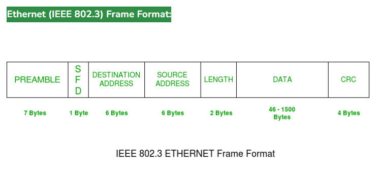
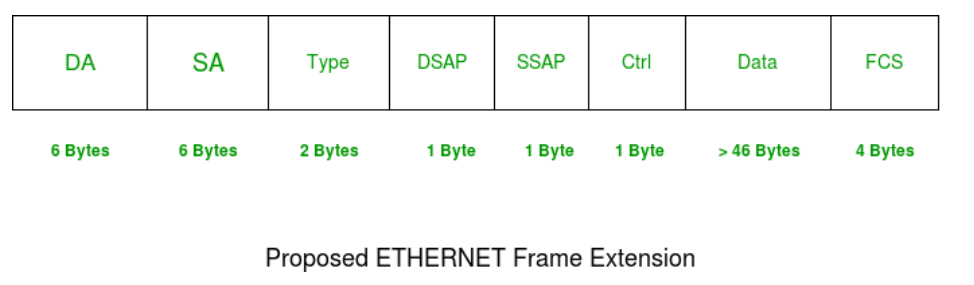

<section id="title">以太网帧格式</section>

# 1. 简介

**IEEE 802.3** 标准中定义了所有 **MAC** 实现所需的基本帧格式。尽管有几种可选格式被用来扩展协议的基本功能。以太网帧以 **Preamble** 和 **SFD** 开头，两者都工作在物理层。以太网报头包含**源MAC地址** 和 **目标MAC地址**，接着是帧的有效负载。最后一个字段是 **CRC**，用于检测错误。

# 2. 以太网 (IEEE 802.3) 帧格式:

1. 前导码（**PREAMBLE**）: 以太网帧以 **7字节** 的前导码开始。它是一种**0**和**1**交替的模式（典型值为0xAA），指示帧的开始，并允许发送方和接收方建立位同步。最初引入前导码（**PREAMBLE**）是为了允许由于信号延迟而丢失一些比特。但当今的高速以太网不需要前导码来保护帧位。前导码向接收器指示帧即将到来，并允许接收器在实际帧开始之前锁定数据流。
2. 帧开始定界符**SFD** (**Start of frame delimiter**) : 这是一个**1**字节字段，始终设置为**10101011**（即：0xAB）。**SFD** 指示即将到来的位将开始帧，即：目标地址。有时**SFD**被认为是**PRE**的一部分，这就是前导码在许多地方被描述为 **8字节的** 原因。**SFD**警告一个或多个站点，这是最后的同步机会。
3. 目标地址（**Destination Address**）：这是一个 **6字节** 的字段，包含数据**目标设备**的 **MAC地址**。
4. 源地址（**Source Address**）：这是一个 **6字节** 的字段，包含**源设备**的 **MAC地址**。由于源地址始终是单个地址（单播），因此第一个字节的最低有效位始终为**0**。
5. 长度（**Length**）：长度是一个 **2字节** 的字段，指示整个以太网帧的长度。这个16位字段可以容纳0到65534之间的长度值，但由于以太网自身的一些限制，长度不能大于**1500**字节。
6. 数据（**Data**）：这是插入实际数据的地方，也称为有效负载（**Payload**）。如果通过以太网使用TCP/IP协议，**IP标头**和数据都将插入此处。存在的最大数据可能长达**1500**字节。如果数据长度小于最小长度，即**46**字节，则添加填充**0**以满足最小可能长度。
7. 循环冗余校验 (**CRC**) ：**CRC** 是一个**4字节**的字段。该字段包含数据的**32位**的哈希码，该哈希码是通过目标地址、源地址、长度和数据字段计算生成的。如果目的地计算的校验和与发送的校验和值不同，则接收到的数据被损坏。
8. VLAN标记（**VLAN Tagging**）：以太网帧还可以包含虚拟局域网VLAN（**Virtual Local Area Network**）标记，它是插入在源地址之后、以太网类型字段之前的 **4字节** 的字段。该标签允许网络管理员在逻辑上将物理网络划分为多个虚拟网络，每个虚拟网络都有自己的 **VLAN ID**。
9. 巨型帧（**Jumbo Frames**） – 除了 **1518字节** 的标准以太网帧大小之外，某些网络设备还支持巨型帧，即有效负载大于 1500 字节的帧。巨型帧可以通过减少与传输大量小帧相关的开销来提高网络吞吐量。
10. 以太网类型字段（**Ether Type Field**）：以太网帧头中的以太网类型字段标识帧有效负载中携带的协议。例如，值为0x0800表示负载为IP报文，值为0x0806表示负载为ARP（地址解析协议）报文。
11. 组播和广播帧（**Multicast and Broadcast Frames**）：除了单播帧（发送到特定目标 MAC 地址）之外，以太网还支持组播和广播帧。组播帧被发送到已加入组播组的特定设备组，而广播帧被发送到网络上的所有设备。
12. 冲突检测（**Collision Detection**）：在半双工以太网中，当两个设备尝试同时传输数据时，可能会发生冲突。 为了检测冲突，以太网使用带有冲突检测功能的载波侦听多路访问 (CSMA/CD) 协议，该协议在传输数据之前侦听网络上的活动，并在检测到冲突时退出。

# 3. 扩展以太网帧（以太网 II 帧）：

* DA [目标 MAC 地址]：6 字节 
* SA [源 MAC 地址]：6 字节 
* 类型 [0x8870（以太网类型）]：2 字节 
* DSAP [802.2 目标服务接入点]：1 字节 
* SSAP [802.2 源服务接入点]：1 字节 
* Ctrl [802.2 控制字段] : 1 字节 
* 数据 [协议数据] : > 46 字节 
* FCS [帧校验和]: 4 字节 
  
尽管以太网 II 帧中缺少长度字段，但通过网络接口所接受的帧长度可知。

# 4. 参考文献

1. [Ethernet Frame Format](https://www.geeksforgeeks.org/ethernet-frame-format/)