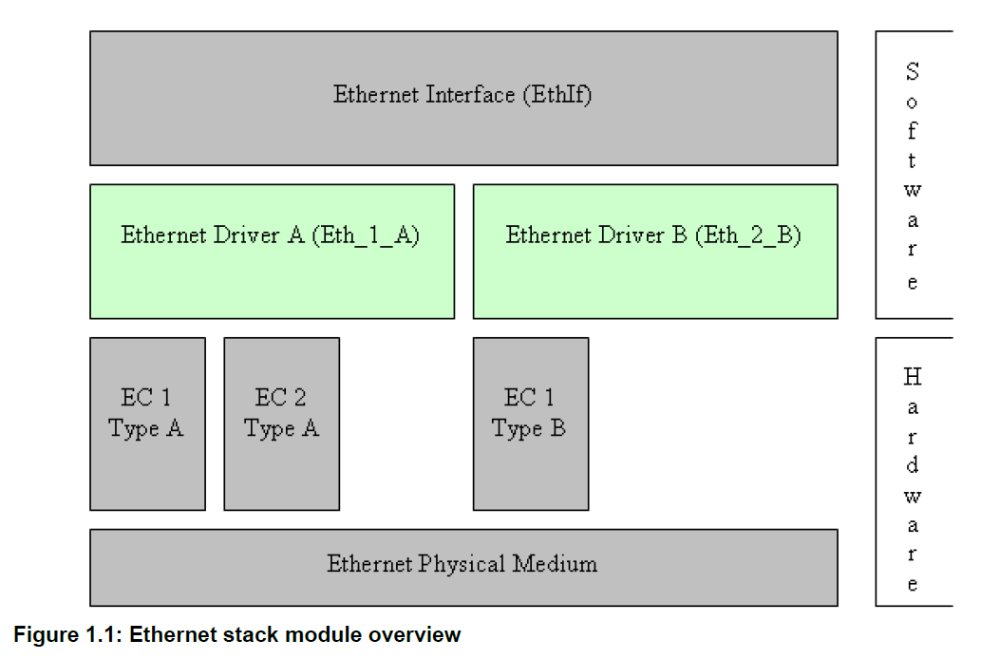
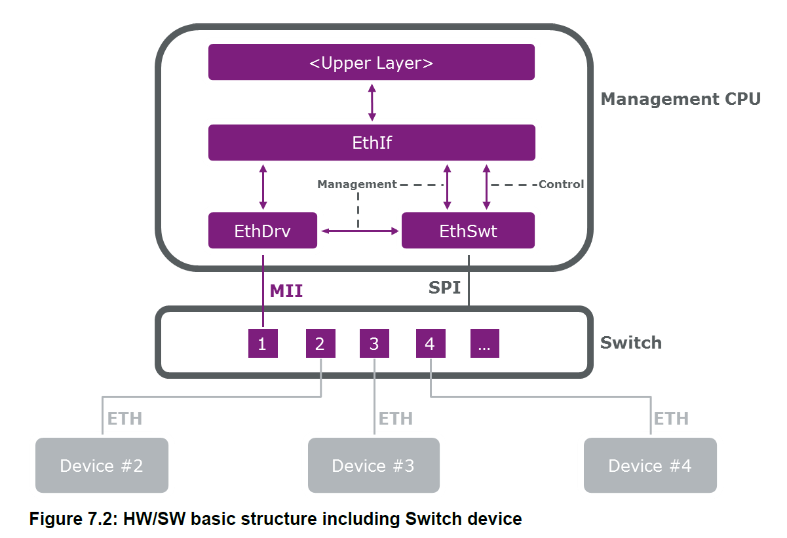
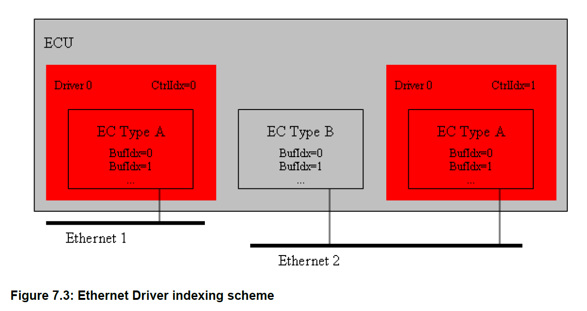

<section id="title">AUTOSAR Ethernet Driver（以太网驱动程序）</section>

# 1. 简介和功能概述

本文介绍了**AUTOSAR**基本软件模块以太网驱动程序（**Ethernet Driver**）的功能、API和配置。

在AUTOSAR分层软件架构中，以太网驱动程序属于微控制器抽象层（**Microcontroller Abstraction Layer**），或者更准确地说，属于通信驱动程序（**Communication Driver**）。

这表明了以太网驱动程序的主要任务:

向上层以太网接口（**Ethernet Interface**）提供一个硬件独立的接口，该接口由多个相等的控制器组成。该接口应适用于所有控制器。这样，上层以太网接口可以通过统一的方式访问底层总线系统。该接口提供了初始化、配置和数据传输功能。然而，以太网驱动程序的配置是总线特定的，因为它需要考虑到了通信控制器的特定特性。

单个以太网驱动程序（**Ethernet Driver**）模块只支持一种类型的控制器硬件，但可以支持多个相同类型的控制器。此外如果在托管模式（**a managed mode**），以太网驱动程序必须能够与交换机驱动（**Switch Driver**）程序互相协作的。在这种情况下，可能需要对以太网帧进行特殊处理，以适应交换机设备。以太网驱动程序的前缀需要一个唯一的名称空间。通过这个前缀以太网接口（**Ethernet Interface**）可以使用不同的以太网驱动程序来访问不同的控制器类型。可以通过以太网接口的配置参数来决定使用哪个驱动程序访问某个特定的控制器。

图1.1描述了以太网堆栈的下半部分。一个以太网接口使用一个或多个以太网驱动程序访问多个控制器。



**注意:**

以太网驱动程序是允许代码模块的通过目标代码交付的（**object code delivery**），遵循**one-fits-all**的原则，即以太网接口（**Ethernet Interface**）的整个配置可以在不修改任何源代码的情况下进行。因此，以太网驱动程序的配置可以在很大程度上无需对以太网驱动程序软件有详细的了解进行。

# 2. 首字母缩写词和缩写词

| 首字母缩写词和缩写词 | 含义                                 |
| -------------------- | ------------------------------------ |
| EC                   | Ethernet controller                  |
| Eth                  | Ethernet Driver (AUTOSAR BSW module) |
|EthIf|Ethernet Interface (AUTOSAR BSW module)|
|EthTrcv| Ethernet Transceiver Driver (AUTOSAR BSW module)|
|ISR | Interrupt Service Routine|
|MCG | Module Configuration Generator|
|MII | Media Independent Interface (standardized Interface provided by Ethernet controllers to access Ethernet transceivers)|
|TCP |Transmission Control Protocol |
|UDP | User Datagram Protocol|

# 3. 相关的文档

## 3.1. 输入文档

1. List of Basic Software Modules
    > AUTOSAR_TR_BSWModuleList.pdf
2. Layered Software Architecture
    > AUTOSAR_EXP_LayeredSoftwareArchitecture.pdf
3. AUTOSAR General Requirements on Basic Software Modules
    > AUTOSAR_SRS_BSWGeneral.pdf
4. Specification of Communication
    > AUTOSAR_SWS_COM.pdf
5. Requirements on Ethernet Support in AUTOSAR
    > AUTOSAR_SRS_Ethernet.pdf
6. Specification of Ethernet Interface
    > AUTOSAR_SWS_EthernetInterface.pdf
7.  Specification of Ethernet State Manager
    > AUTOSAR_SWS_EthernetStateManager.pdf
8.  Specification of Ethernet Transceiver Driver
    > AUTOSAR_SWS_EthernetTransceiver.pdf
9. Specification of Socket Adapter
    > AUTOSAR_SWS_SocketAdapter.pdf
10. Specification of UDP Network Management
    > AUTOSAR_SWS_UDPNetworkManagement.pdf
11.  Specification of PDU Router
     > AUTOSAR_SWS_PDURouter.pdf
12. BSW Scheduler Specification
    > AUTOSAR_SWS_Scheduler.pdf
13. Specification of ECU Configuration
    > AUTOSAR_TPS_ECUConfiguration.pdf
14. Specification of Memory Mapping
    > AUTOSAR_SWS_MemoryMapping.pdf
15. Specification of Standard Types
    > AUTOSAR_SWS_StandardTypes.pdf
16. Specification of Default Error Tracer
    > AUTOSAR_SWS_DefaultErrorTracer.pdf
17. Specification of Diagnostics Event Manager
    > AUTOSAR_SWS_DiagnosticEventManager
18. Specification of ECU State Manager
    > AUTOSAR_SWS_ECUStateManager.pdf
19. General Specification of Basic Software Modules
    > AUTOSAR_SWS_BSWGeneral.pdf    

## 3.2. 相关标准及规范

20. IEEE 802.3-2006
21. IEC 7498-1 The Basic Model, IEC Norm, 1994
22. IETF RFC 2819
23. IEEE Standard 802.1AS™- 30 of March 2011
    > http://standards.ieee.org/getieee802/download/802.1AS-2011.pdf

## 3.3. 相关的规范

AUTOSAR提供了基础软件模块[19](SWS BSW General)的通用规范，它也适用于以太网驱动程序。因此，AUTOSAR_SWS_BSWGeneral应该被认为是以太网驱动程序的附加和必需的规范。

# 4. 约束和假设

## 4.1. 限制

以太网驱动程序模块只能处理单个执行线程。执行本身不能被抢先执行。以太网驱动程序模块也无法传输超过所使用控制器的可用缓冲区大小的数据。更长的数据必须使用Internet协议（**IP**）或传输控制协议（**TCP**）传输。

根据以太网硬件的不同，实现可能有必要在异步/同步行为方面偏离API规范。

## 4.2. 对汽车领域的适用性

以太网的基础软件模块堆栈旨在用于需要高数据速率但不需要硬性的实时场景。当然它也可以用于要求较低的用例（即：低数据速率）。

# 5. 对其他模块的依赖关系

本章节列出了与以太网驱动程序（**Ethernet Driver**）模块交互的模块。

## 5.1. 使用以太网驱动模块的模块:

* 以太网接口（**EthIf**）
* 以太网收发器驱动（**EthTrcv**）

## 5.2. 以太网驱动模块需要使用的模块:

* 基础软件调度器机制（**BSW Scheduler mechanism**），用于数据一致性和主函数处理。

## 5.3. 其他模块相关模块:

* 在某些系统上，以太网控制器可能与其他组件（如：**MCU**，**Port**）共享资源，并可能依赖于它们的配置。如果这些资源在其他模块的范围内（例如：PLL配置，内存映射等），以太网驱动模块不负责配置这些组件，但需要它们的前期初始化。

# 6. 功能规范

## 6.1. 以太网基础软件堆栈（Ethernet BSW stack）

根据【图7.1】所示，以太网基础软件模块作为AUTOSAR分层软件架构的一部分，也构成了分层软件堆栈。图7.1描述了以太网基础软件堆栈的基本结构。以太网接口模块通过以太网驱动层访问多个控制器，以太网驱动层可以由多个以太网驱动模块组成。


此外，交换设备（**Switch device**）可能被连接到以太网驱动程序的专用控制器上。这个场景导致了交换机驱动程序和以太网驱动程序之间的额外交互【图7.2】。以太网驱动程序要求交换机驱动程序进行特殊处理，以确保当前的以太网帧可以稍后在交换机中被管理。



### 6.1.1. 索引方案

以太网驱动程序的用户使用如【图7.3】所示的索引方案来识别控制器资源。

以太网驱动程序使用一个从零开始的索引来抽象上层软件层的访问。配置中的参数**Eth_CtrlIdx**对应于API中使用的参数**CtrlIdx**。

缓冲区索引（**BufIdx**）标识由以太网驱动程序API函数处理的以太网缓冲区。每个控制器的缓冲区由**0**到（**n-1**）的缓冲区索引标识，其中**n**是对应控制器处理的缓冲区的数量。缓冲区索引仅在元组（**tuple**）<**ctrlidx**, **bufidx**>内有效。**BufIdx**唯一标识用于以太网驱动程序的缓冲区。



## 6.2. Offloading

### 6.2.1. 协议校验和的计算

对于传输，以太网控制器应根据以下配置使能计算协议校验和（卸载）的硬件能力:
1. 对于**IPv4**帧，如果**EthCtrlEnableOffloadChecksumIPv4**设置为**TRUE**。
2. 对于**ICMP**帧，如果**EthCtrlEnableOffloadChecksumICMP**设置为**TRUE**。
3. 对于**TCP**帧，如果**EthCtrlEnableOffloadChecksumTCP**设置为**TRUE**。
4. 对于**UDP**帧，如果**EthCtrlEnableOffloadChecksumUDP**设置为**TRUE**。

在所有其他情况下，以太网控制器不应操作校验和字段（**checksum field**）。

### 6.2.2. 丢弃帧

对于接收，以太网控制器根据以下配置使能丢弃协议校验和不匹配的帧（卸载）的硬件能力:
1. 对于**IPv4**帧，如果**EthCtrlEnableOffloadChecksumIPv4**设置为**TRUE**。
2. 对于**ICMP**帧，如果**EthCtrlEnableOffloadChecksumICMP**设置为**TRUE**。
3. 对于**TCP**帧，如果**EthCtrlEnableOffloadChecksumTCP**设置为**TRUE**。
4. 对于**UDP**帧，如果**EthCtrlEnableOffloadChecksumUDP**设置为**TRUE**。
   
在所有其他情况下，以太网控制器不应考虑协议校验和字段的验证。

## 6.3. 时间同步

全局时间接口可以用来实现时间同步功能（参见文档[23]）。

## 6.4. 发送数据

以下的情况，以太网软件驱动应该调用**EthIf_TxConfirmation**函数, 并将结果设置为**E_OK**来表示传输成功：
* 从中断例程（在中断模式下）。
* 从轮询模式下的**Eth_TxConfirmation**例程中（如果启用了通知）。

以太网软件驱动调用**EthIf_TxConfirmation**函数，并将结果设置为**E_NOT_OK** 来表示传输失败。调用**EthIf_TxConfirmation**，并将结果设置为**E_NOT_OK**需要允许上层实现一个简单的锁定方案（**simple locking scheme**）。它可以依赖于这样一个事实,每次调用**Eth_Transmit**时，**EthIf_TxConfirmation**将随后被调用。

## 6.5. 接收数据

以下的情况，以太网软件驱动应该调用**EthIf_RxIndication**来指示一个成功的接收：
* 从中断例程（在中断模式下）。
* 从Eth_Receive例程在轮询模式下。

## 6.6. 交换机驱动程序管理API

以下函数需使用来通知交换机驱动程序，关于交换机管理需要的特殊处理（参见文档AUTOSAR_SWS_EthernetInterface）：
* EthSwt_EthRxProcessFrame()
* EthSwt_EthRxFinishedIndication()
* EthSwt_EthTxPrepareFrame()
* EthSwt_EthTxAdaptBufferLength()
* EthSwt_EthTxProcessFrame()
* EthSwt_EthTxFinishedIndication()

# 7. API规范

## 7.1. Eth_Init

```C
void Eth_Init( 
    const Eth_ConfigType* CfgPtr )
```

## 7.2. Eth_SetControllerMode

```C
Std_ReturnType Eth_SetControllerMode( 
    uint8 CtrlIdx, 
    Eth_ModeType CtrlMode )
```
## 7.3. Eth_GetControllerMode

```C
Std_ReturnType Eth_GetControllerMode( 
    uint8 CtrlIdx, 
    Eth_ModeType* CtrlModePtr )
```
## 7.4. Eth_GetPhysAddr

```C
void Eth_GetPhysAddr( uint8 CtrlIdx, uint8* PhysAddrPtr )
```

## 7.5. Eth_SetPhysAddr

```C
void Eth_SetPhysAddr( uint8 CtrlIdx, const uint8* PhysAddrPtr )
```

## 7.6. Eth_UpdatePhysAddrFilter

```C
Std_ReturnType Eth_UpdatePhysAddrFilter( 
    uint8 CtrlIdx, 
    const uint8* PhysAddrPtr, 
    Eth_FilterActionType Action )
```
## 7.7. Eth_WriteMii

```C
Std_ReturnType Eth_WriteMii( 
    uint8 CtrlIdx, 
    uint8 TrcvIdx, 
    uint8 RegIdx, 
    uint16 RegVal )
```

## 7.8. Eth_ReadMii

```C
Std_ReturnType Eth_ReadMii( 
    uint8 CtrlIdx, 
    uint8 TrcvIdx, 
    uint8 RegIdx, 
    uint16* RegValPtr )
```

## 7.9. Eth_GetCounterValues

```C
Std_ReturnType Eth_GetCounterValues( 
    uint8 CtrlIdx, 
    Eth_CounterType* CounterPtr )
```

## 7.10. Eth_GetRxStats

```C
Std_ReturnType Eth_GetRxStats( uint8 CtrlIdx, Eth_RxStatsType* RxStats )
```

## 7.11. Eth_GetTxStats

```C
Std_ReturnType Eth_GetTxStats( uint8 CtrlIdx, Eth_TxStatsType* TxStats )
```

## 7.12. Eth_GetTxErrorCounterValues

```C
Std_ReturnType Eth_GetTxErrorCounterValues(
    uint8 CtrlIdx, 
    Eth_TxErrorCounterValuesType* TxErrorCounterValues ) 
```

## 7.13. Eth_GetCurrentTime

```C
Std_ReturnType Eth_GetCurrentTime( 
    uint8 CtrlIdx, 
    Eth_TimeStampQualType* timeQualPtr, 
    Eth_TimeStampType* timeStampPtr )
```

## 7.14. Eth_EnableEgressTimeStamp

```C
void Eth_EnableEgressTimeStamp( uint8 CtrlIdx, Eth_BufIdxType BufIdx )
```

## 7.15. Eth_GetEgressTimeStamp

```C
void Eth_GetEgressTimeStamp( 
    uint8 CtrlIdx, 
    Eth_BufIdxType BufIdx, 
    Eth_TimeStampQualType* timeQualPtr, 
    Eth_TimeStampType* timeStampPtr )
```

## 7.16. Eth_GetIngressTimeStamp

```C
void Eth_GetIngressTimeStamp( 
    uint8 CtrlIdx, 
    const Eth_DataType* DataPtr, 
    Eth_TimeStampQualType* timeQualPtr, 
    Eth_TimeStampType* timeStampPtr )
```

## 7.17. Eth_ProvideTxBuffer

```C
BufReq_ReturnType Eth_ProvideTxBuffer( 
    uint8 CtrlIdx, 
    uint8 Priority, 
    Eth_BufIdxType* BufIdxPtr, 
    uint8** BufPtr, 
    uint16* LenBytePtr )
```

## 7.18. Eth_Transmit

```C
Std_ReturnType Eth_Transmit( 
    uint8 CtrlIdx, Eth_BufIdxType BufIdx, 
    Eth_FrameType FrameType, 
    boolean TxConfirmation, 
    uint16 LenByte, 
    const uint8* PhysAddrPtr )
```

## 7.19. Eth_Receive

```C
void Eth_Receive( 
    uint8 CtrlIdx, 
    uint8 FifoIdx, 
    Eth_RxStatusType* RxStatusPtr )
```

## 7.20. Eth_TxConfirmation

```C
void Eth_TxConfirmation( uint8 CtrlIdx )
```

## 7.21. Eth_GetVersionInfo

```C
void Eth_GetVersionInfo( Std_VersionInfoType* VersionInfoPtr )
```


