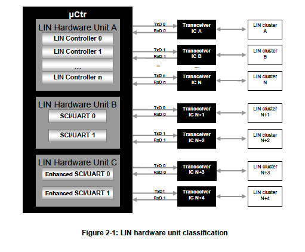
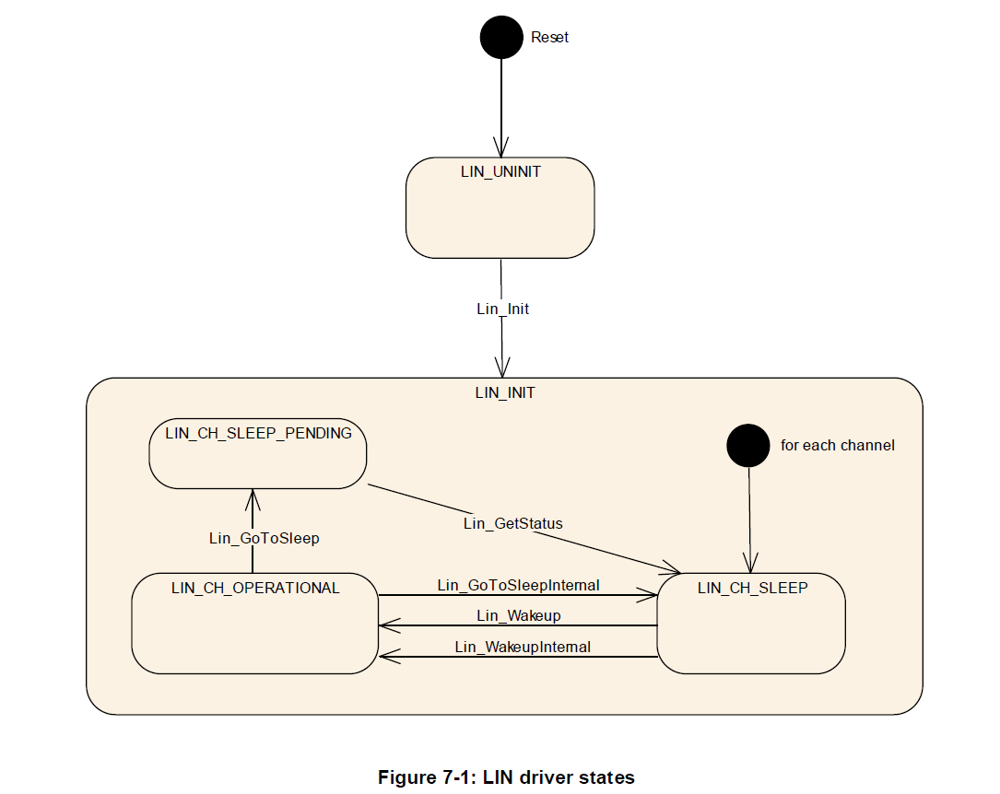
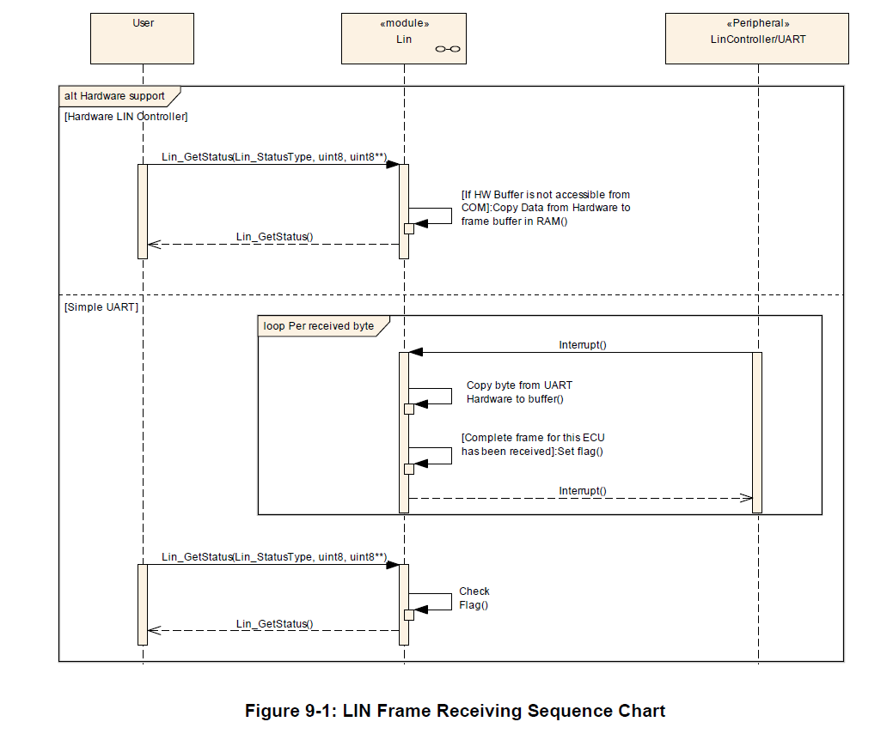

<section id="title">AUTOSAR LIN Driver</section>

# 1. 简介和功能概述

本文介绍了AUTOSAR基础软件模块LIN驱动程序的功能、API和配置。

本文的基础是**ISO 17987**规范[16]。本文并不会再次描述**ISO 17987**规范中已有的LIN功能，而只会对AUTOSAR相关内容进行介绍。

LIN驱动适用于**ISO 17987**规范中主节点（**master node**）和从节点（**slave node**）。AUTOSAR中的LIN实现可能与ISO 17987规范中描述的LIN驱动程序有偏差，但LIN总线上的行为不会发生变化。它的目的是能够让所有现有的LIN节点在AUTOSAR LIN上重用。

LIN驱动模块的目的是支持从简单的SCI/UART到复杂LIN硬件控制器（**LIN hardware controller**）的全部LIN硬件。SW-UART不在此模块定义的范畴。

## 1.1. 体系结构概述

LIN驱动模块属于微控制器抽象层（**MCAL**）的一部分，它主要实现了执行硬件访问，并为上层模块提供一个硬件独立的API。唯一能够访问LIN驱动程序的上层是LIN接口（LINIf）模块。

LIN驱动模块可以支持多个通道。这意味着LIN驱动模块可以处理一个或多个LIN通道，只要它们属于同一个LIN硬件单元。

在下面的例子中，三个不同的LIN驱动程序被连接到一个LIN接口（**LIN interface**）。然而单个LIN驱动是最常见的配置。


# 2. 缩略语和术语表

## 2.1. 缩略语

| 缩略语 | 说明                                                                   |
| ------ | ---------------------------------------------------------------------- |
| ISR    | Interrupt Service Routine                                              |
| LIN    | Local Interconnect Network                                             |
| MCAL   | MicroController Abstraction Layer                                      |
| PDU    | Protocol Data Unit. Consists of Identifier, data length and Data (SDU) |
| PID    | Protected ID                                                           |
| PLL    | Phase-Locked Loop                                                      |
| RX     | Reception                                                              |
| SCI    | Serial Communication Interface                                         |
| SDU    | Service Data Unit. Data that is transported inside the PDU             |
| SFR    | Special Function Register                                              |
| SPAL   | Standard Peripheral Abstraction Layer                                  |
| TP     | Transport Layer                                                        |
| TX     | Transmission                                                           |
| UART   | Universal Asynchronous Receiver Transmitter                            |

## 2.2. 术语表

| 术语        | 英文参考            | 说明                                                                                                                                                                                    |
| ----------- | ------------------- | --------------------------------------------------------------------------------------------------------------------------------------------------------------------------------------- |
| LIN通       | LIN Channel         | LIN通道实体在物理上连接LIN集群的ECU。如果一个ECU包含一个LIN控制器，并且与LIN集群上的一个LIN通道相连，那么ECU就是这个LIN集群上的一部分。一个ECU只能通过一个通道连接到一个特定的LIN集群。 |
| LIN集群     | LIN cluster         | 一个集群是LIN总线加上线上所有的节点。                                                                                                                                                   |
| LIN控制器   | LIN controller      | 一个专用的LIN硬件，带有一个构建Frame处理状态机。能够连接到多个LIN集群的硬件应该被视为多个LIN控制器。                                                                                    |
| LIN帧       | LIN frame           | 所有信息以帧的形式发送。一个帧由报头和响应部分组成。                                                                                                                                    |
| LIN帧处理器 | LIN frame processor | 帧处理意味着完整的LIN帧处理。实现可以是软件仿真解决方案或一个专用LIN控制器。                                                                                                          |
| LIN硬件单元 | LIN hardware unit   | LIN硬件单元可以驱动一个或多个LIN通道来控制一个或多个LIN集群。                                                                                                                           |
| LIN报头     | LIN header          | 报头是帧的第一部分，总是通过主节点来发送。                                                                                                                                              |
| LIN节点     | LIN node            | 简单地说，一个节点就是一个ECU。但是单个ECU可以连接到多个LIN集群。                                                                                                                         |
| LIN响应     | LIN response        | LIN帧由报头和响应组成，因此LIN响应也被称为帧响应。                                                                                                                                      |

## 2.3. LIN硬件单元分类

片载的LIN硬件单元由一个或几个LIN通道组成。

下图是连接到多个LIN物理通道的不同LIN硬件类型的分类:



# 3. 相关的文档

## 3.1. 输入文档

[1] List of Basic Software Modules 
> AUTOSAR_TR_BSWModuleList.pdf

[2] Layered Software Architecture 
> AUTOSAR_EXP_LayeredSoftwareArchitecture.pdf

[3] General Requirements on Basic Software Modules 
> AUTOSAR_SRS_BSWGeneral.pdf

[4] Specification of Standard Types
> AUTOSAR_SWS_StandardTypes.pdf

[5] Specification of Default Error Tracer
> AUTOSAR_SWS_DefaultErrorTracer.pdf

[6] General Requirements on SPAL 
> AUTOSAR_SRS_SPALGeneral.pdf

[7] Requirements on LIN 
> AUTOSAR_SRS_LIN.pdf

[8] Specification of LIN Interface 
> AUTOSAR_SWS_LINInterface.pdf

[9] Specification of ECU Configuration 
> AUTOSAR_TPS_ECUConfiguration.pdf

[10] Specification of MCU driver 
> AUTOSAR_SWS_MCUDriver.pdf

[11] Specification of Diagnostic Event Manager 
> AUTOSAR_SWS_DiagnosticEventManager.pdf

[12] Specification of ECU State Manager 
> AUTOSAR_SWS_ECUStateManager.pdf

[13] Basic Software Module Description Template
> AUTOSAR_TPS_BSWModuleDescriptionTemplate.pdf

[14] Specification of LIN Transceiver Driver
> AUTOSAR_SWS_LINTransceiverDriver.pdf

[15] General Specification of Basic Software Modules
> AUTOSAR_SWS_BSWGeneral.pdf

## 3.2. 相关标准及规范

[16] LIN Specification Package Revision 2.1, November 24, 2006 
> http://www.lin-subbus.org/

## 3.3. 相关的规范

AUTOSAR提供了基础软件模块[15]的通用规范，它也适用于LIN驱动模块。因此，AUTOSAR_SWS_BSWGeneral.pdf通用规范应被视为LIN驱动模块的附加和必需的规范。

# 4. 约束和假设

## 4.1. 限制

一个ECU只能有一个LIN通道连接到特定的LIN集群。除非ECU中有未使用（即：未连接）的通道，否则LIN通道数等于LIN集群的数量。

一个LIN驱动程序提供对一个LIN硬件单元类型（简单的**UART**或专用LIN硬件）的访问，但这个LIN硬件单元却可能由几个LIN通道组成。对于不同的LIN硬件单元，需要实现一个单独的LIN驱动程序。并由实现者来调整驱动程序以适应类似LIN通道的不同实例。

如果在一个ECU中，实现了几个LIN驱动程序实例（来自相同或不同的供应商），那么文件名、API名称和发布的参数必须进行修改，以达到不会生成两个具有相同名称的定义。名称应带有一个Vendor Id（将不同厂商区的LIN驱动程序区分开来）和一个Vendor特定名称（将同一个厂商实现的不同硬件单元区分开来）。格式如下:\<**Module abbreviation**\>\_\<**Vendor Id**\>\_\<**Vendor specific name**\>。同时LIN接口负责调用正确的函数。

## 4.2. 对汽车领域的适用性

此规范适用于所有使用LIN的汽车领域。

# 5. 对其他模块的依赖关系

## 5.1. MCU

LIN内部硬件单元的硬件取决于系统时钟（**system clock**）、预分频器（**prescaler**）和锁相环（**PLL**）。因此LIN发送每条帧时间长度取决于模块MCU的时钟设置。

LIN驱动模块不会在它的初始化函数中负责配置时钟、预分频器和PLL的寄存器（例如打开/关闭PLL）。MCU模块必须做到这一点。

## 5.2. Port

端口（**Port**）驱动程序用于配置LIN驱动程序所需的输入、输出的端口引脚。因此在使用LIN函数之前，必须先初始化Port驱动程序。否则LIN驱动函数将表现出未定义的行为。

## 5.3. DET（**Default Error Tracer**）

在开发模式下，Lin模块通过模块**DET**的**Det_ReportError**函数报告开发错误。

## 5.4. DEM（**Diagnostic Event Manager**）

Lin模块向诊断事件管理器（**DEM**）报告生产错误。

## 5.5. OS（**Operating System**）

LIN驱动程序使用中断，因此依赖于配置中断源的操作系统。

## 5.6. LIN驱动程序用户

LIN接口（由[8]定义）是LIN驱动服务的唯一用户。

# 6. 功能规范

LIN驱动程序模块需要通过连接到驱动程序所在节点的任何LIN集群来管理通信的硬件相关方面。这包括接收传输到总线上的报头数据、传输的响应帧数据、以及取回报头信息和节点的响应帧数据。
节点和集群都需要睡眠模式管理。这意味着检测和产生**LIN 2.1**规范中定义的唤醒脉冲（**wake-up pulse**）的能力。如果底层硬件支持低功耗模式，则也包括进入和退出低功耗模式的状态。

## 6.1. 一般需求

LIN模块是一个基本软件模块，它可以直接访问硬件资源。

LIN模块应符合[16]中规定的Lin 2.1协议规范。它只适用于**LIN 2.1**主节点。作为从节点运行超出了AUTOSAR LIN驱动程序规范的范围。

LIN模块应实现所有LIN硬件单元中断所需的ISR，确保所有未使用的中断都被禁用。LIN模块也需要在ISR结束时，重置中断标志（如果不是由硬件自动完成的话）。

## 6.2. LIN驱动程序和通道初始化

在LIN总线上开始通信之前，LIN驱动程序和相关的LIN通道都必须初始化。

LIN驱动程序初始化（参见**Lin_Init**）通过LIN硬件单元，负责对所有LIN通道相关的方方面面进行初始化。这可能包含对所有LIN通道的任何静态变量或硬件寄存器设置。此外，每个通道也必须根据提供的配置进行初始化。例如：包括（但不限于）总线上的波特率值。

LIN驱动程序必须至少有一个静态定义的配置集可用。当EcuM调用初始化函数时，它必须提供一个特定的指针，指向它希望使用的配置。

Lin模块不应该初始化或配置没有被使用Lin通道。同时Lin模块也应该允许在运行期间，选择不同的静态配置数据。

Lin模块的配置应包括数据通信速率（**data communication rate**）设置的静态配置数据。Lin模块的用于硬件寄存器的配置数据，应该作为硬件特定的数据结构存储在ROM中。

每个LIN的PID应该与一个校验和模型相关联，要么是增强的（**enhanced**），即PID包含在校验和中，要么是经典的（**classic**），即仅对响应数据进行校验和。每个LIN的PID应该与响应数据字节长度相关联。

## 6.3. 状态图

LIN驱动程序的状态机如图7-1所示。



| 状态       | 含义及此状态下活动                                                  |
| ---------- | ------------------------------------------------------------------- |
| LIN_UNINIT | **LIN_UNINIT**状态表明Lin模块还没有初始化，暂时不能使用。           |
| LIN_INIT   | **LIN_INIT**状态表明LIN驱动程序已经初始化，每个可用通道都可以使用。 |

1. **Reset** -> **LIN_UNINIT**：复位后，Lin模块将其状态设置为LIN_UNINIT.
2. **LIN_UNINIT** -> **LIN_INIT**：当**Lin_Init**函数被调用时，Lin模块从LIN_UNINIT过渡到LIN_INIT。同时LIN模块的环境在运行时只允许调用**Lin_Init**函数一次。

| 通道状态           | 含义及此状态下活动                                                            |
| ------------------ | ----------------------------------------------------------------------------- |
| LIN_CH_OPERATIONAL | 单个通道已经被初始化（至少一个静态配置的数据集已使用），并且能够参与LIN集群。 |
| LIN_CH_SLEEP       | 唤醒脉冲的检测被启用。如果LIN硬件提供低功耗模式，则LIN硬件进入低功耗模式      |

1. 在进入状态**LIN_INIT**时，Lin模块需要将每个通道设置为状态**LIN_CH_SLEEP**，开启唤醒检测（依赖配置字**LinChannelWakeupSupport**）。如果硬件支持低功耗，并可选择将Lin硬件单元设置为低功耗运行模式。
2. **LIN_CH_OPERATIONAL** -> **LIN_CH_SLEEP_PENDING**（**Lin_GoToSleep**）：如果LIN接口请求go to sleep, LIN模块应确保LIN集群的其他部分也都进入sleep状态。这是通过在进入LIN_CH_SLEEP_PENDING状态之前在总线上发出一个go-to-sleep-command来实现的。
3. **LIN_CH_SLEEP_PENDING** -> **LIN_CH_SLEEP**：当调用**Lin_GetStatus**时，LIN驱动将直接进入**LIN_CH_SLEEP**状态，即使go-to-sleep命令还没有发送。
4. **LIN_CH_OPERATIONAL** -> **LIN_CH_SLEEP**（**Lin_GoToSleepInternal**）：如果LIN接口请求内部go to sleep, LIN驱动将直接进入**LIN_CH_SLEEP**状态。
5. **LIN_CH_SLEEP** -> **LIN_CH_OPERATIONAL**（**Lin_Wakeup**）： 如果LIN通道处于**LIN_CH_SLEEP**状态，则调用**Lin_Wakeup**函数将使LIN通道置于**LIN_CH_OPERATIONAL**状态。
6. **LIN_CH_SLEEP** -> **LIN_CH_OPERATIONAL**（**Lin_WakeupInternal**）： 如果LIN通道处于**LIN_CH_SLEEP**状态，则调用**Lin_WakeupInternal**函数将使LIN通道置于**LIN_CH_OPERATIONAL**状态。
7. **Lin_Wakeup**：在状态从**LIN_CH_SLEEP**过渡到**LIN_CH_OPERATIONAL**期间，LIN驱动程序应确保集群的其余部分处于唤醒状态。这是通过发出唤醒请求来实现的，迫使总线在250μs到5ms的时间内处于显性电平状态。
8. 允许切换到当前模式的模式切换请求（**mode switch request**），且不应导致错误，即使DET已启用。

## 6.4. 帧处理

### 6.4.1. 背景和理论基础

从LIN驱动模块的角度来看，数据传输由两个动作组成：LIN报头的传输以及响应的传输。只有LIN的主节点才能发送LIN报头，但是无论是主节点还是从节点都可以发送响应数据。

驱动程序还必须能够访问关于每个LIN的PID的校验和模型（**checksum model**）和数据长度等数据。与**LIN1.3**标志相比，**LIN 2.1**有一个不同的校验和模型，但是**LIN 2.1**主节点应该能够同时与**LIN1.3**和**LIN 2.1**从节点通信。

校验和是响应的一部分。根据PID的校验和模型，它可能包括PID，也可能不包括PID。但LIN ID为60 (0x3c)到63 (0x3f)的帧，必须始终使用经典的（classic）校验和模型，即校验和仅包含响应数据部分。

LIN驱动模块使用LIN帧作为其基本数据块构件。这意味着LIN接口层必须在其调度程序的一个时隙中（**scheduler time-slots**）才能请求发送特定的帧。任何来自帧的响应都应该在下一帧被发送之前确保是可用的。

在主节点也负责发送帧响应的情况下，在请求发送报头的同时会给出一个指示（**PduInfoPtr->Drc=LIN_MASTER_RESPONSE**）。响应本身的传输必须随后由另一个函数调用触发。

LIN驱动模块必须能够从响应中获取数据，并使其可用于LIN接口模块。它必须在不阻塞的情况下从响应中获取所有数据。

### 6.4.2. 需求

LIN驱动程序将使用PID来做提供的标识符。然后在LIN报头中按提供的方式传输标识符。（参见：**Lin_SendFrame**）

LIN驱动程序应该能够发送LIN的报头。它由同步间隔域（**Break Field**）、同步域（**Sync Byte Field**）和受保护ID域（**Protected Identifier Field**）组成，详细信息见[16]。（参见：**Lin_SendFrame**）。

LIN驱动应该能够发送LIN报头和响应。同时LIN驱动程序应该能够计算经典的（**classic**）或增强的（**enhanced**）两种校验和，这取决于当前LIN PDU的校验和模型。

如果LIN接口请求一个新的帧传输时，正在传输的帧可能仍在进行中或者未能成功完成传送，LIN驱动程序应该中止当前的帧传输。

**Lin_GetStatus**函数需返回当前信道帧传输请求的状态。

LIN驱动程序应使接收到的数据对LIN接口模块可用。成功接收整个LIN帧后，将接收到的数据准备好，并提供给LIN接口的函数调用。

LIN驱动程序需能发送由LIN接口模块提供的响应数据（参见：**Lin_SendFrame**）。

如果LIN硬件单元不能为传输或接收数据缓存到排队中（例如：简单的UART实现），LIN驱动程序应该提供一个临时通信缓冲区。

LIN驱动程序应该在不阻塞的情况下开始传输，包括只有在成功接收到前一个字节后才检查下一个字节的传输情况(receive-back)。LIN驱动器在接收数据时也不应该被阻塞。



### 6.4.3. 发送数据的一致性

LIN驱动程序应该直接从上层缓冲区复制数据。LIN驱动的上层模块必须保持缓冲区数据的一致性，直到函数调用返回。

### 6.4.4. 接收数据的一致性

完整的LIN帧接收处理（包括复制到目标层）可以在ISR中实现。在成功接收到下一个LIN帧或LIN通道状态发生改变之前，接收到的数据应该是一致的。

完整的LIN帧接收处理（包括复制到目标层）也可以在**Lin_GetStatus**函数中实现。在成功接收到下一个LIN帧或LIN通道状态发生改变之前，接收到的数据应该是一致的。

只要保证**ISR**和**Lin_GetStatus**都不能被自己中断，LIN的硬件缓冲区或者镜像缓冲区（**shadow buffer**）总是一致的。因为它是在一个函数中按顺序写入和读取的，只需这个函数永远不会被自己打断。

对于LIN响应接收，SDU缓冲区需分配一块连续递增的内存地址空间。LIN帧数据长度信息也定义了SDU缓冲区的最小长度。

### 6.4.5. 数据字节映射

内存和LIN帧之间的数据映射如下:
* 数组元素0包含LSB（首先发送/接收的数据字节）。
* 数组元素n-1包含MSB（最后发送/接收的数据字节）。

## 6.5. 睡眠和唤醒

主节点可以被一个从节点产生的唤醒信号唤醒，也可以被上层模块（LIN接口）的请求唤醒。LIN接口模块控制消息调度表，因此必须能够指示LIN驱动程序将硬件单元置于睡眠状态，或者唤醒硬件单元。所以LIN驱动程序需提供了将LIN通道置于其LIN_CH_SLEEP状态的函数供调用。

在睡眠或唤醒时，主节点必须将状态变化与网络的其他节点进行通信。

当LIN通道进入睡眠模式时，如果LIN硬件单元的低功耗模式，则LIN驱动程序需执行LIN硬件单元的低功耗模式转换。同时每个LIN通道应该能够独立于其他通道状态接受一个睡眠请求（参见：**Lin_GoToSleep**/**Lin_GoToSleepInternal**）

当LIN通道处于**LIN_CH_SLEEP**状态，并且配置参数**LinChannelWakeupSupport**支持唤醒检测时，LIN硬件单元应该监控总线以获取该通道上的唤醒请求。

如果LIN驱动程序收到LIN接口模块的唤醒请求，被请求的通道将向LIN总线发送唤醒脉冲。（参见：**Lin_Wakeup**）

如果LIN驱动程序收到LIN接口模块的内部唤醒请求，则被请求的通道不向LIN总线发送唤醒脉冲。（参见：**Lin_WakeupInternal**）

函数**Lin_GetStatus**返回给定LIN通道的当前状态。

# 7. API规范

## 7.1. 函数定义

### 7.1.1. Lin_Init

**说明**: 初始化LIN模块。

```C
void Lin_Init( const Lin_ConfigType* Config )
```

### 7.1.2. Lin_CheckWakeup

**说明**: 这个函数检查在指定的LIN通道上是否发生了唤醒。

```C
Std_ReturnType Lin_CheckWakeup( uint8 Channel )
```

### 7.1.3. Lin_GetVersionInfo

**说明**: 返回此模块的版本信息。

```C
void Lin_GetVersionInfo( Std_VersionInfoType* versioninfo )
```

### 7.1.4. Lin_SendFrame

**说明**: 如果需要发送LIN报头和LIN响应。帧响应的方向：主节点响应、从节点响应、从节点和从节点的通信，由PduInfoPtr提供。

```C
Std_ReturnType Lin_SendFrame( uint8 Channel, const Lin_PduType* PduInfoPtr )
```

### 7.1.5. Lin_GoToSleep

**说明**: 该服务指示驱动程序在指定的LIN通道上发送一个“进入休眠”命令。

```C
Std_ReturnType Lin_GoToSleep( uint8 Channel )
```

### 7.1.6. Lin_GoToSleepInternal

**说明**: 将通道状态设置为LIN_CH_SLEEP，启用唤醒检测，并可选择将LIN硬件单元设置为降低功耗的运行模式（如果HW支持）。

```C
Std_ReturnType Lin_GoToSleepInternal( uint8 Channel )
```

### 7.1.7. Lin_Wakeup

**说明**: 生成一个唤醒脉冲并将通道状态设置为LIN_CH_OPERATIONAL。

```C
Std_ReturnType Lin_Wakeup( uint8 Channel )
```

### 7.1.8. LIN_WakeupInternal

**说明**: 将通道状态设置为LIN_CH_OPERATIONAL，而不产生唤醒脉冲。

```C
Std_ReturnType Lin_WakeupInternal( uint8 Channel )
```

### 7.1.9. Lin_GetStatus

**说明**: 获取LIN驱动程序的状态。

```C
Lin_StatusType Lin_GetStatus( uint8 Channel, uint8** Lin_SduPtr )
```

# 微信扫一扫，获取更多及时资讯

