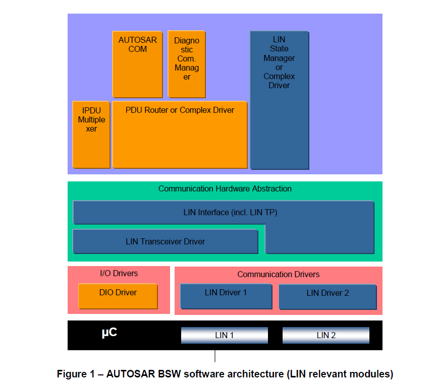

<section id="title">AUTOSAR LinIf (LIN Interface)<section>

# 1. 简介和功能概述

本文介绍了AUTOSAR基本软件模块LIN接口（**LinIf**）和LIN传输协议（**LinTp**）的功能、API和配置。其中LIN TP属于LIN接口的一部分。

唤醒功能包含在LIN接口（**LIN Interface**），LIN驱动（**LIN Driver**）和LIN收发器驱动（**LIN Transceiver Driver**）中。

本文档基于ISO 17987规范[19]，同时文档将不会再次描述**ISO 17987**中的LIN功能。

LIN接口模块适用于ISO 17987主节点（**master node**）和从节点（**slave node**），兼容LIN 2.2和LIN 2.1主节点。AUTOSAR中的LIN实现可能和ISO 17987规范有部分出入，但LIN总线上的行为不会发生变化。它的目的是能够让所有现有的LIN节点在AUTOSAR LIN上重用。

LIN接口被设计成硬件独立的。并明确定义了于上层模块（**PDU Router**）和下层模块（**LIN Driver**）模块之间的接口定义。

LIN接口可以处理多个LIN驱动程序。LIN驱动可以支持多个通道。这意味着LIN驱动程序可以处理一个或多个LIN通道。

## 1.1. 体系结构概述

根据分层软件体系结构[2]，LIN接口位于基础软件体系结构中，如图1所示。本例中，LIN接口连接到两个LIN驱动程序。然而单个的LIN驱动程序是最常见的配置。

## 1.2. 功能概述

LIN接口模块负责实现**ISO 17987**中定义的LIN功能。包含以下功能:
* 执行ECU连接到的每个LIN总线当前选择的调度表（**schedule**）。
* 作为一个主节点，发送报头，并且发送和接收响应。
* 按上层模块的请求，切换主节点的调度表。
* 接受来自上层模块的帧发送请求，并在适当的LIN帧内发送数据作为响应。
* 在适当的帧内收到相应的响应时，为上层提供帧接收通知。
* 睡眠和唤醒服务。
* 错误处理。
* 诊断传输层服务。
* 从节点配置和识别服务。

# 2. 缩写词和术语

## 2.1. 缩写词

| 缩写   | 全称                 | 含义                                                     |
| ------ | -------------------- | --------------------------------------------------------- |
| CF     | Continuous Frame     | LIN TP 中的连续帧  |
| FF     | First Frame          | LIN TP 中的第一帧 |
| LDF    | LIN Description File | LIN 描述文件   |
| LIN TP |                      | LIN 传输协议（LIN 接口的一部分）  |
| MRF    | Master Request Frame | 主节点请求帧     |
| NAD    | Node Address         | 节点地址。LIN中的每个从节点都必须具有唯一的 NAD。                         |
| NC     | Node Configuration   | 节点配置                                                                  |
| N_As   |  | 发送端发送LIN帧（任何 N-PDU）的时间（见 ISO 17987-2 [19]）。              |
| N_Cr   |  | 直到接收到下一个连续帧 N-PDU 的时间（见 ISO 17987-2 [19]）。              |
| N_Cs   |  | 直到传输下一个连续帧 N-PDU 的时间（见 ISO 17987-2 [19]）。                |
| P2     |  | 在LIN总线上接收到诊断请求的最后一帧与从节点能够提供响应数据之间的时间。 |
| P2*    | | 从发送响应挂起帧 (0x78) 到 LIN 从设备能够为响应提供数据之间的时间。|
|PID|Protected ID| 受保护的ID|
|RX| Reception | 接收|
|SID| Service Identifier| 服务标识符（节点配置服务）|
|SF| Single Frame | LIN TP中的单帧 |
|SRF|Slave Response Frame| 从节点的响应帧|
|TX|Transmission|传送|

## 2.2. 术语

|术语|含义|
|--|--|
|Slot Delay|  调度表中帧开始之间的时间。单位是特定集群的时基数。|
|Jitter|最长延迟和最短延迟之间的差异（例如，最坏情况执行时间 - 最佳情况执行时间）|
|Maximum frame length|最大帧长度是 ISO 17987-3 [19] 中定义的 TFRAME_MAX（即标称帧长度加上 40 %）。|
|Schedule entry is due|这意味着LIN接口已到达调度表中的新条目，并且将启动一个帧（接收或发送）。|
|Slave-to-slave|从LIN主节点的角度来看，LIN总线上存在3种不同方向的帧：主节点发送的响应、主节点接收的响应和一个从节点发送并由另一个从节点接收的响应。slave-to-slave描述的是最后一个。这在ISO1798 规范中没有明确描述，但在ISO 17987-3中的图14中提到：三个无条件帧传输。|
|Irrelevant frame|从LIN从节点的角度来看，LIN 总线上存在3种不同方向的帧：从节点发送的响应、从节点接收的响应和从节点忽略的响应（即主节点与另一个从节点之间或另外两个从节点之间的通信）。这些被忽略的帧在本规范中被称为无关帧。这在ISO 17987规范中没有明确描述|
|Relevant frame|从LIN从节点的角度来看，从节点发送或接收的帧。 与无关帧相对。|
|Sporadic frame|这是附加到sporadic slot的一种无条件帧。|
|Sporadic slot|这是偶发帧的占位符。将其命名为slot的原因是它没有LIN帧的ID。|
|Tick|Tick是处理所有通道上的通信的最小时间实体。|
|Bus idle timeout| 总线没有活动所持续流逝的时长|

# 3. 相关的文档

## 3.1. 输入文件

[1] List of Basic Software Modules
> AUTOSAR_TR_BSWModuleList.pdf

[2] Layered Software Architecture 
> AUTOSAR_EXP_LayeredSoftwareArchitecture.pdf

[3] General Requirements on Basic Software Modules
> AUTOSAR_SRS_BSWGeneral.pdf

[4] Specification of Standard Types
> AUTOSAR_SWS_StandardTypes.pdf

[5] Specification of Default Error Tracer 
> AUTOSAR_SWS_DefaultErrorTracer.pdf

[6] Requirements on LIN 
> AUTOSAR_SRS_LIN.pdf

[7] Specification of LIN Driver 
> AUTOSAR_SWS_LINDriver.pdf

[8] Specification of ECU Configuration
> AUTOSAR_TPS_ECUConfiguration.pdf

[9] Specification of ECU State Manager
> AUTOSAR_SWS_ECUStateManager.pdf

[10] Specification of LIN State Manager
> AUTOSAR_SWS_LINStateManager.pdf

[11] Basic Software Module Description Template
> AUTOSAR_TPS_BSWModuleDescriptionTemplate.pdf

[12] Specification of LIN Transceiver Driver
> AUTOSAR_SWS_LINTransceiverDriver.pdf

[13] Specification of PDU Router
> AUTOSAR_SWS_PDURouter.pdf

[14] Specification of Communication Stack Types
> AUTOSAR_SWS_CommunicationStackTypes.pdf

[15] Specification of Basic Software Mode Manager
> AUTOSAR_SWS_BSWModeManager.pdf

[16] General Specification of Basic Software Modules
> AUTOSAR_SWS_BSWGeneral.pdf

## 3.2. 相关标准和规范
[17] LIN Specification Package Revision 2.1, November 24, 2006 
> http://www.lin-subbus.org

[18] SAE J2602-1 (2012-11), LIN Network for Vehicle Applications

[19] ISO 17987:2016 (all parts), Road vehicles – Local Interconnect Network (LIN)

# 4. 约束和假设

## 4.1. 限制

LIN接口模块可用作LIN集群中的LIN主节点或者LIN从节点。每个ECU中只有一个LIN接口实例。如果底层LIN驱动程序支持多个通道，则LIN接口作用于多个集群。

假设所有连接的LIN总线上的ECU，在它们已经运行时都可以接收到唤醒帧（也就是说LIN ECU以**LINIF_CHANNEL_SLEEP**状态开始）。

LIN 接口模块不支持以下功能：
* ConditionalChangeNAD（SID 0xB3，在LIN 2.1规范中定义；在ISO 17987-3中已过时）
* DataDump（SID 0xB4，在ISO 17987-3 中可选）

**注意：**

在**LIN 2.2A**之前，**ConditionalChangeNAD**的定义没有对否定响应进行定义，并且在**ISO 17987-3**中被设置为过时，没有任何响应行为的定义。 所以**ConditionalChangeNAD**不支持时，在**ISO 17987**和LIN规范中都没有定义响应行为。 然而假定澄清从节点永远都不应该发送否定响应，ISO 17987-3中的**AssignNAD**也适用于**ConditionalChangeNAD**。

对于从节点，LIN接口模块不支持:
* 标识符不等于**0**和**2**的**ReadByIdentifier**（SID 0xB2，ISO 17987-3中强制要求）
* 序列号（在ISO 17987-3第6.2.2条中定义）。这意味着没有相应的配置，也没有访问序列号的API
* **AutoAddressingSlave**（SID 0xB8，ISO 17987-3中可选
* 从节点位置检测（**Slave node position detection**）（SID 0xB5，LIN 2.x 规范中可选）

对于主节点，LIN接口模块不支持：
* **ReadByIdentifier**（SID 0xB2，ISO 17987-3 强制要求）

**注意：**

ReadByIdentifier不被视为节点配置。它更多地被视为一种身份识别服务。因此支持ReadByIdentifier服务作为调度表命令是没有意义的。诊断层负责支持ReadByIdentifier的功能。

在一个通道上具有主节点的 ECU 也可以是另一个通道上的从节点。

LIN接口模块不支持保留帧（**Reserved Frame**）的传输（在LIN 2.1规范中定义）

LIN接口模块支持Post-Build Variant，但不直接采用ISO 17987-3第6.3条从节点模型中定义的方式。

如果**LinTpScheduleChangeDiag**设置为**TRUE**，则必须避免同时来自**LinTp**和非LinTp（BswM 或 CDD）的调度表切换请求，以防止诊断连接过早终止。此问题将在会在以后的版本中修复。

# 5. 对其他模块的依赖关系

为了能够使LIN接口运行，需要连接以下模块：
* 默认错误跟踪器 – DET
* ECU状态管理器 – EcuM
* PDU路由器 – PduR
* LIN状态管理器 – LinSM
* BSW模式管理器 – BswM
* AUTOSAR COM – Com
* LIN 驱动程序 – Lin
* LIN 收发器驱动程序 – LinTrcv

## 5.1. 上层模块

### 5.1.1. PDU路由器和复杂驱动程序（PDU Router and CDD）

LIN接口连接到PDU路由器或者其他替代模块（例如：复杂驱动程序）以传输和接收帧。这里假设这些模块会负责复制用于接收和发送的帧的数据。在TP的情况下，PDU路由器是唯一上层的模块，它将TP消息缓冲区作为完整消息或分段消息处理。

### 5.1.2. 总线镜像（Mirroring）

LIN接口还连接到总线镜像模块。如果启用镜像，将报告所有接收和发送的LIN帧的内容。TP消息不会报告给总线镜像模块。

### 5.1.3. LIN状态管理器（LIN State Manager）

LIN接口连接到LIN状态管理器，LIN状态管理器主要负责整个LIN通讯栈的控制流。所以关于LIN接口，它有以下用途：
1. 对于主节点，状态管理器将调度表请求转发到LIN接口。
2. 状态管理器请求发送唤醒命令。以及对于主节点，请求发送休眠命令。

### 5.1.4. BSW模式管理器（BSW Mode Manager）

LIN TP作为LIN接口一部分，连接到BSW模式管理器。当上层请求LIN TP操作时，请求更改调度表。

### 5.1.5. AUTOSAR COM

作为LIN从节点，LIN接口连接到COM，以便更新response_error信号的值。

## 5.2. 下层模块

### 5.2.1. LIN驱动程序（LIN Driver）

LIN接口依赖于文档AUTOSAR_SWS_LINDriver[7]中指定的下层LIN驱动程序的服务。

LIN接口假定LIN驱动程序提供以下基本服务：

* 为LIN主节点，传输帧头和响应部分（参见：**Lin_SendFrame**）。假设这个服务还告诉帧的响应的方向（发送、接收或从节点到从节点的通信）。
* 为LIN主节点传输**go-to-sleep**命令（参见：**Lin_GoToSleep**）。
* 将LIN通道设置为状态**LIN_CH_SLEEP**，而不发送**go-to-sleep**命令（参见：**Lin_GoToSleepInternal**）。
* 唤醒命令（**Lin_Wakeup**）的传输。
* 将LIN通道设置为状态**LIN_CH_OPERATIONAL**而不发送唤醒命令（参见：**Lin_WakeupInternal**）。
* 查询LIN主节点的传输状态和接收帧的响应部分（参见：**Lin_GetStatus**）。 包含了以下几种情况：
  * 成功接收/传输（**Successful reception/transmission**）。
  * 没有接收（**No reception**）。
  * 错误的接收/传输（**Erroneous reception/transmission**）：帧错误、位错误、校验和错误。
  * 持续接收（**Ongoing reception**）：至少已接收到一个响应字节，但尚未接收到校验和字节
  * 持续传输（**Ongoing transmission**）。
  * 睡眠中的频道（**Channel In sleep**）（go-to-sleep命令已成功传输）。

对于LIN的从节点，LIN接口假定LIN驱动程序也会另外提供以下基本服务：

* 已接收到帧头的指示（**Indication of a received header**）（参见：**LinIf_HeaderIndication**）。假设这个服务还告诉帧响应的方向（发送、接收或从节点到从节点的通信）。
* 收到响应的指示（**Indication of a received response**）（参见：**LinIf_RxIndication**）。
* 已发送响应的确认（参见：**LinIf_TxConfirmation**）。
* 指示检测到的通信错误事件（参见：**LinIf_LinErrorIndication**），并能区分以下几种情况：
  * 报头接收错误（**Error during header reception**）
  * 响应中的帧错误（**Framing error in response**）
  * 校验和错误（**Checksum error**）
  * 响应传输过程中的位错误（**Bit error during response transmission**）
  * 不完整的回应（**Incomplete response**）
  * 没有回应（**No response**）

LIN接口应该使用以上列出的LIN驱动程序提供的接口，而不是直接地使用或者访问相关地LIN硬件。

### 5.2.2. LIN收发器驱动程序（LIN Transceiver Driver）

LIN接口需要可能需要使用由AUTOSAR_SWS_LINTransceiverDriver[12]所定义的底层LIN收发器驱动程序的服务。

LIN接口将所有底层LIN收发器驱动程序的以下服务映射到一个唯一接口。
* 独特的LIN收发器驱动程序模式请求和读取服务，用于管理每个底层LIN收发器设备的操作模式。
* 支持LIN收发器唤醒原因的读取服务。
* 启用/禁用/清除每个使用的LIN收发器的唤醒事件状态的模式请求服务。

LIN接口应该使用以上列出的LIN收发器驱动程序提供的接口，而不是直接地使用或者访问相关地LIN硬件。
s
# 6. 功能规范

本章节不会对**ISO 17987**规范[19]中已经规定的要求再做额外的说明。只会关注在AUTOSAR中的没有被充分指定或缺失的特定细节。

LIN接口应该支持**ISO 17987**规范中定义的主从行为。上述也就是意味着来自ISO 17987节点和LIN接口节点的通信是相等的。LIN接口应该实现LIN行为，能确保现有的LIN节点可以被重用。

LIN接口应该能够处理一个或多个LIN通道。

## 6.1. 帧传输

LIN接口能支持**ISO 17987**规范中定义的以下帧类型:

* 无条件帧（**Unconditional frame**）
* 事件触发帧（**Event-triggered frame**）
* 零星帧（**Sporadic frame**）
* 诊断帧MRF和SRF（**Diagnostic frames MRF and SRF**）
* 保留帧（**Reserved frames**）

### 6.1.1. 无条件帧的传输

这是LIN集群中使用的普通帧类型。它在总线上的传输严格按照调度表进行。

### 6.1.2. 事件触发帧的传输

事件触发帧用于从节点的偶发传输。这种类型的帧通常用于非时间关键函数中。根据实现的节点类型，主节点和从节点的需求是不同的。

#### 6.1.2.1. 主节点中的事件触发帧的传输

由于多个从节点可能会响应一个同一个事件触发的帧报头，所以可能会发生冲突。发送的从节点需要检测到这冲突并退出通信。

如果在事件触发的帧响应中发生冲突，则LIN接口将切换到相应的冲突解决调度表。当检测到冲突后，LIN接口将在当前帧间隙（**Frame Slot**）的末尾切换到给定的冲突解决调度表。冲突解决调度表由LIN接口配置参数**LinIfCollisionResolvingRef**定义给出。

#### 6.1.2.2. 从节点中的事件触发帧的传输

上层模块决定了事件触发帧响应何时传输。因此，相关API调用可以用来设置事件触发的帧响应等待（**response pending**）传输。LIN接口应该保持一个标志来保持每个事件触发帧响应的传输状态。分配给事件触发帧的无条件帧响应的第一个数据字节需要被保留给无条件帧的PID。

如果接收到事件触发帧的报头，并处于响应等待的状态，LIN接口将在响应数据的第一个字节发送无条件帧的PID。无条件帧响应的有效载荷将保存在响应数据的紧接着的字节内容中传输。事件触发帧响应一旦成功传输，LIN接口将清除该帧响应的挂起标志。这也适用于响应作为无条件帧成功传输的情况。

### 6.1.3. 零星帧的传输（只支持主节点）

零星帧仅适用于LIN的主节点。对于LIN的从节点来说，接收到的零星帧与接收到的无条件帧没有区别。

**ISO 17987**规范定义了零星帧。在这里需要对零星帧进行更精确的定义：

* 零星槽（**Sporadic slot**） : 零星帧的占位符。将它命名为**slot**的原因是它没有LIN帧ID。
* 零星帧（**Sporadic frame**）: 附加在零星槽上的无条件帧。

只有主节点允许发送零星帧。只有零星帧应才能分配到零星槽中。上层模块决定了零星帧的传输。因此必须提供API来设置零星帧的传输等待。LIN接口应对特定传输的零星帧进行标记。

LIN接口需要根据零星帧的优先级在相关的零星槽中传输特定的零星帧。零星帧的优先级是这些零星帧在LDF中被列出的顺序，不适用LDF的优先级机制。分配给同一个调度槽的零星帧的优先级由配置参数**LinIfFramePriority**定义。

### 6.1.4. 诊断框架MRF和SRF的传输

MRF（**Master Request Frame**）和SRF（**Slave Response Frame**）是用于传输**ISO 17987**节点配置服务（**node configuration services**）和TP消息（TP messages）的固定ID的帧。

#### 6.1.4.1. 诊断框架MRF和SRF的传输（只支持主节点）

如果TP传输正在进行时LIN接口可以发送MRF。当调度表条目到期，数据会被发送。

**注意：**
节点配置机制也使用MRF，但上述需求只在调度表中遇到MRF时适用。节点配置应使用特殊调度条目。

对于从节点的响应帧，主节点只需发送报文头。通常情况，因为主节点不知道从节点在帧的响应部分是否有数据要发送，所以响应帧总是会被发送。唯一例外的情况是，主节点因为没有缓冲区来存储数据，所以希望在TP帧序列期间防止接收这样的响应帧。

当调度表条目到期时，LIN接口需要发送SRF报头。当TP层表示上层模块暂时无法提供接收缓冲区时，需要停止发送SRF报头。

### 6.1.5. 保留帧的传输

参照ISO 17987规范，LIN接口模块不支持保留帧的传输。

## 6.2. 帧接收

### 6.2.1. 主节点的帧接收

LIN主节点负责调度表的调度，启动总线上的所有帧。

以下的内容适用于被主节点调度并等待运输的所有接收到的帧类型。

#### 6.2.1.1. 报头

当一个新的帧接收调度表条目到期时，LIN接口应该调用LIN驱动模块（**LIN Driver**）的**Lin_SendFrame**函数。

#### 6.2.1.2. 响应

在报头发送后，LIN驱动程序将自动设置为接收状态。

#### 6.2.1.3. 状态检查

LIN接口需要最早在最大帧长度，最迟在下一个调度条目到期时，调用函数**Lin_GetStatus**确定LIN驱动模块的状态。

LIN接口模块的实现者需要找到一种有效的方法来确定LIN驱动程序的状态检查。正常的实现是在最大帧长度过去后在每个LinIf_MainFunction_<LinIfChannel.ShortName>函数调用中检查状态。 在这种情况下，帧传输仍在继续（忙）状态确定应在下一次LinIf_MainFunction_<LinIfChannel.ShortName> 函数调用中再次检查（如果当前 LinIf_MainFunction_<LinIfChannel.ShortName> 当然没有开始新帧 ）。

