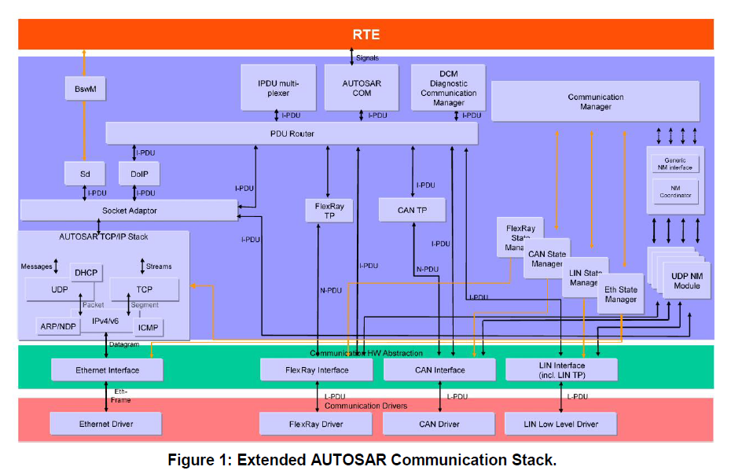
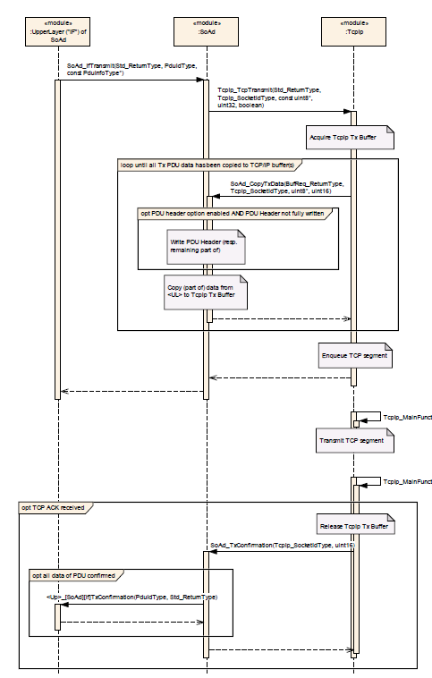
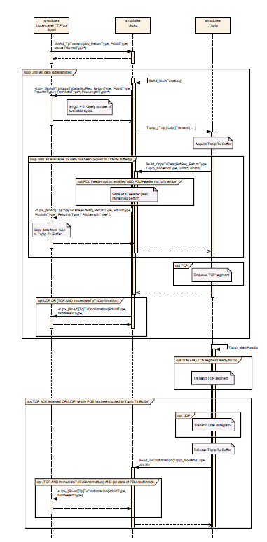
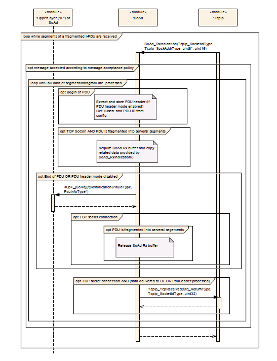
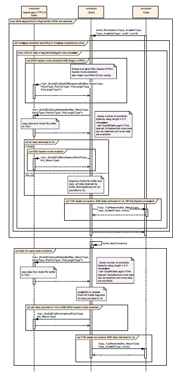

<section id="title">AUTOSAR SoAd (Socket Adaptor)</section>

# 1. 简介和功能概述

本文档说明了AUTOSAR基本软件模块Socket Adaptor（**SoAd**）的功能、API和配置。

数据传输的TCP/IP概念，特别是使用以太网作为物理层，已经成为计算和电信环境中的事实上的标准。应用程序的寻址、端点的逻辑寻址和物理寻址都覆盖在一套分层的协议和数字分配中。动态配置和路由是实现这些概念的核心。

AUTOSAR遵循静态通信关系（**static communication relations**）的概念，该概念在编译时预先确定，在运行时严格执行。传输的数据被认为与它需要往返的源和接收一样是预先确定的。

**Socket Adaptor**模块旨在弥合这两个概念之间的差距。通过建立一个包含AUTOSAR所需信息的预先确定的配置，并保留一些项，以便在运行时进行更新，就可以利用相互冲突的概念。此外，SoAd将基于回调（**call-back based**）的软件体系结构与TCP/IP世界中的基于套接字（**socket** based）的通信处理解耦。

SoAd模块的主要目的是在使用PDU（如：**PDU Router**）的AUTOSAR通信服务模块和基于**socket**的TCP/IP堆栈之间创建一个接口。它将**I-PDU** ID映射到插座连接，反之亦然。**TCP/IP**协议栈在TcpIp SWS中指定，如图1所示。为了便于了解，本文略示了**TCP/IP**堆栈的内部功能结构。

SoAd模块，以及以太网通信栈，首先在AUTOSAR R4.0.1中引入，在AUTOSAR R4.0.3和AUTOSAR R4.1.1之间有一些主要的概念并不相同。



# 2. 相关的文档

## 2.1. 输入文档

1. Layered Software Architecture 
   > AUTOSAR_EXP_LayeredSoftwareArchitecture.pdf
2. General Requirements on Basic Software Modules 
   > AUTOSAR_SRS_BSWGeneral.pdf
3. Specification of Communication Stack Types
   > AUTOSAR_SWS_CommunicationStackTypes.pdf
4. Specification of ECU Configuration 
   > AUTOSAR_TPS_ECUConfiguration.pdf
5. Specification of BSW Scheduler
   > AUTOSAR_SWS_BSW_Scheduler.pdf
6. Specification of Default Error Tracer
   > AUTOSAR_SWS_DefaultErrorTracer.pdf
7. Basic Software Module Description Template
   > AUTOSAR_TPS_BSWModuleDescriptionTemplate.pdf
8. Specification of UDP Network Management
   > AUTOSAR_SWS_UDPNetworkManagement.pdf
9.  Requirements on Ethernet 
    > AUTOSAR_SRS_Ethernet.pdf
10. List of Basic Software Modules 
    > AUTOSAR_TR_BSWModuleList
11. Specification of Service Discovery 
    > AUTOSAR_SWS_ServiceDiscovery.pdf
12. Specification of PDU Router 
    > AUTOSAR_SWS_PDURouter.pdf
13. Specification of TCP/IP Stack 
    > AUTOSAR_SWS_TCPIP.pdf
14. Specification of Module XCP 
    > AUTOSAR_SWS_XCP.pdf
15. Specification of Diagnostics over IP 
    > AUTOSAR_SWS_DoIP.pdf
16. General Specification of Basic Software Modules
    > AUTOSAR_SWS_BSWGeneral.pdf

## 2.2. 相关标准及规范

1. IETF RFC 4702
   > http://tools.ietf.org/html/rfc4702
2. IETF RFC 4704
   > http://tools.ietf.org/html/rfc4704

# 3. 约束和假设

在以太网上使用TCP/IP传输数据需要大约60字节的报头信息（**header information**）。这意味着对于小消息，头开销可能达到一个无法接受的高百分比。

为了避免进一步的协议开销，这里描述了对每个PDU使用单个socket连接。然而，这种解决方案是非常耗费资源的，特别是在要传输许多小型PDU的情况下。这里描述的一种解决方案是添加一个包含ID和长度信息的小PDU头（**PDU header**）。这样可以通过一个插座连接来传输多个PDU。此外，AUTOSAR规范还包括一个资源保护方案作为一个可选项。

AUTOSAR规范不涉及**UDP**或**TCP**端口号（**Port numbers**）的分配。**IANA**分配的号码范围内没有预留空间。每个实现者负责管理使用的端口号。

**SoAd**标准文档也不涉及IP地址的管理。这可以是动态的，例如使用**DHCP**，也可以是静态的。它是实现者的责任，以防止地址冲突和实现符合IANA地址分配。

# 4. 对其他模块的依赖关系

## 4.1. AUTOSAR TCP/IP Stack

TcpIp模块实现了TCP/IP协议族中的主要协议（TCP、UDP、IPv4、ARP、ICMP、DHCP、IPv6、NDP、ICMPv6、DHCPv6），并通过以太网提供了基于socket的动态通信。SoAd模块是TcpIp模块可能的上层模块之一。

## 4.2. 通用的上层

**SoAd**模块提供了通用的上层支持，即SoAd向任何符合SoAd通用上层API/配置的上层提供服务。SoAd的每个上层可以指定它想要使用的服务类型。

在AUTOSAR体系结构中，已经定义了许多**SoAd**上层模块。以下列表指定了这些模块，并提供了所使用的SoAd服务的大致描述:

* **PduR**（PDU Router）: IF-PDU和TP-PDU API
* **UdpNm**（UDP Network Management ）: IF-PDU API
* **XCP**（XCP on Ethernet）: IF-PDU API
* **Sd**（Service Discovery）: IF-PDU API, Control API 
* **DoIP**（Diagnostics over IP ）: IF-PDU和TP-PDU API, Control API

# 5. 功能规范

**SoAd**通过TCP/IP网络实现基于PDU（**PDU-Based**）的通信。因此，**AUTOSAR I-PDU**被映射到由SoAd配置和维护的套接字连接（**socket connections**）。当多个I-PDU使用Socket连接时，可以在每个I-PDU的前面添加一个SoAd PDU头（**SoAd PDU Header**）。消息接受策略（**A message acceptance policy**）用来定义如何接受远程节点（**Remote nodes**）的TCP连接和UDP数据报文。套接字连接可以通过来自上层的请求自动或手动打开。同时也定义了对于套接字连接的断开和恢复的策略。SoAd的上层可以使用IF-API和TP-API的接口来进行PDU的传输和接收。SoAd的上层可以通过定义PDU路由组（**PDU routing groups**）有选择地使能或者禁止socket连接进出的PDU报文的路由。一个IF-PDU也可以转发给多个套接字连接。或者从一个套接字连接收到的消息可以作为不同的IF-PDU转发给同一或不同的SoAd上层（**PDU Fan-out**）。

注意:SoAd模块不提供任何方法来调整PDU中的位或字节顺序（**Endianness**）。

## 5.1. 套接字连接（Socket Connections）

TCP/IP通信是基于Internet套接字（**Internet socket**）的。Internet套接字是通信链路的端点（**endpoint**），由元组IP地址和端口标识。根据传输协议，套接字可被分为UDP套接字（**UDP sockets**）和TCP套接字（**TCP sockets**）。在UDP套接字中，用于通过UDP-用户数据报协议（**User Datagram Protocol**）进行无连接通信。而TCP套接字则用于通过TCP-传输控制协议（**Transmission Control Protocol**）进行面向连接的通信。TCP基于点对点（**point-to-point**）的通信关系。广播或多播在TCP中是不可能的。TCP要求一方建立连接，另一方接受传入的请求。两个站（**stations**）之间可以建立多个连接，每个连接将由不同的套接字处理，至少需要连接使用一个不同的端口号。在TCP中，所有从源发送到接收器的消息都被认为是一个按顺序的连续字节流。TCP的确认方案（**acknowledgement scheme**）可以保证跨消息的字节顺序的正确性。如果接收器在一定时间内没有确认接收，则消息由源重新传输。TCP保证了数据的完整性（通过校验和的方式）、字节顺序和完整性。

为了抽象TCP/IP通信，SoAd定义了套接字连接。SoAd套接字连接定义了连接的本地套接字（即本地地址标识符和本地端口）和一个远程的套接字（即远程IP地址和端口）信息，以及其他的连接参数：如传输协议；SoAd PDU头的使用；缓冲需求；连接设置；传输协议等相关参数。每个套接字连接可以由一个唯一的标识符（**SoConId**）来标识。每个本地套接字为了能同时支持多个通信伙伴，可以将具有相同连接参数的套接字分组成套接字连接分组（**socket connection groups**）。

当**SoAd_OpenSoCon**函数和**SoAd_CloseSoCon**函数分别调用时，**SoAd**应该存储一个打开或关闭套接字连接的请求。但根据连接设置和关闭策略，仅在**SoAd_MainFunction**函数中处理该请求。

### 5.1.1. 套接字连接打开

在**SoAd_MainFunction**中，SoAd应该尝试打开每个满足以下所有准则的套接字连接:
1. 没有分配**TcpIp Socket**的套接字连接。
2. **SoAdSocketAutomaticSoConSetup**为**TRUE**的隐性的请求，或者先前被**SoAd_OpenSoCon**函数调用的显式地请求，而该调用还没有被随后的**SoAd_CloseSoCon**函数调用撤销。
3. 设置了远程地址（**remote address is set**），通过配置指定或通过调用函数**SoAd_SetRemoteAddr**函数。
4. 分配本地IP地址（**local IP address is assigned**），即调用了**SoAd_LocalIpAddrAssignmentChg**函数，相关的**LocalAddrId**和**TCPIP_IPADDR_STATE_ASSIGNED**作为状态。

TODO: to be continue

## 5.2. PDU传输（PDU Transmission）

当上层模块的PDU通过UDP或TCP套接字传输时，SoAd配置指定了一条与套接字连接（**Socket Connection**）相连的PDU路由。一个PDU路由（**SoAdPduRoute**或者**SoAdPduRouteDest**）用来描述如何从SoAd的上层模块到TcpIp堆栈中的套接字连接（**Socket connection**）的路由定义。该套接字连接（**Socket connection**）的定义通过**SoAdSocketConnection**或者**SoAdSocketConnectionGroup**进行定义。SoAd的上层模块可以使用**Interface (IF)** API或**Transport Protocol (TP)** API分别用于传输请求和数据提供。

### 5.2.1. 通过IF-API传输PDU

如果使用**IF-API**传输上层请求的PDU，则**SoAd**需要完成以下操作：

1. 使用**SoAd_IfTransmit**()提供的**TxPduId**来识别相关的socket连接和PDU路由
2. 如果PDU长度> 0或SoAdPduHeaderEnable为TRUE，则根据连接类型调用相应的TcpIp传输函数，否则SoAd跳过进一步处理，返回**E_NOT_OK**。



### 5.2.2. 通过TP-API传输PDU

如果使用**TP-API**传输上层请求的PDU，则**SoAd**需要完成以下操作：

1. 如果PDU长度为0，跳过进一步处理，返回E_NOT_OK。
2. 使用**SoAd_TpTransmit**()提供的TxPduId来识别相关的socket连接和PDU路由。
3. 将TP传输请求保存在**SoAd_MainFunction**()中，以便进一步处理。

在**SoAd_MainFunction**()中，SoAd将检查等待中的TP传输请求，并按照如下规定处理等待中的请求:

1. 通过**PduInfoType.SduLength = 0**调用可配置回调函数**\<up\>_[SoAd][Tp]CopyTxData**()，查询上层可用数据量。
2. 根据连接类型：检索数据并调用相应的TcpIp传输函数。



**注意**：
**TxPduId**在**SoAd**配置中用来标识**SoAdPduRoute**，它包含一个或多个**SoAdPduRouteDest**容器。以及此**SoAdPduRouteDest**容器所使用的**SoAdSocketConnection**。

## 5.3. PDU接收（PDU Reception）

当使用UDP或TCP套接字接收PDU时, **SoAd**需配置一个引用套接字连接的套接字路由。套接字路由（**Socket route**）通过**SoAdSocketRoute**或者**SoAdSocketRouteDest**来描述了从TcpIp栈到SoAd的相关上层模块的路由。UDP或TCP套接字通过**SoAdSocketConnection**或者**SoAdSocketConnectionGroup**进行描述。SoAd的上层模块可以使用**Interface (IF)** API或**Transport Protocol (TP)** API来接收**PDU**。

对于接收来自UDP或TCP套接字的消息，SoAd将接收到的数据作为PDU转发给相应的上层。SoAd需要完成以下操作：

1. 使用**SoAd_RxIndication**()提供的SocketId识别相关的套接字连接（**socket connection**）和套接字路由（**socket routes**）
2. 根据消息接收策略对消息进行过滤。
3. 将消息转换为**PDU**。
4. 如果**PDU**长度为**0**且**SoAdPduHeaderEnable**为**FALSE**或**SoAdRxUpperLayerType**为**TP**，则跳过进一步处理。
5. 根据**SocketRouteDest**配置中的**SoAdRxUpperLayerType**调用配置的上层模块的上层类型相关的接收函数。
   




## 5.4. TP PDU取消

可以通过调用**SoAd_TpCancelReceive**()和**SoAd_TpCancelTransmit**()发送TP取消请求。最终的请求会在**SoAd_MainFunction**()中被处理

## 5.5. 路由组（Routing Groups）

为了有选择地启用/禁用经过套接字连接的PDU路由，可以定义路由组（**routing groups**），同时可以由SoAd的上层模块控制。

如果**SoAd_IfTransmit**()被调用时，参数**TxPduId**指向的一个**SoAdPduRouteDest**属于无效**RoutingGroups** , **SoAd**需要跳过这个**SoAdPduRouteDest**的传输和任务传输成功。只有指向的所有**SoAdPduRouteDest**属于无效**RoutingGroups**时，**SoAd**才需返回错误**E_NOT_OK**。

如果**SoAd_TpTransmit**()被调用时，参数x**TxPduId**指向的一个**SoAdPduRouteDest**属于无效**RoutingGroups**, **SoAd**需要跳过这个**SoAdPduRouteDest**的传输和任务传输成功。只有指向的所有**SoAdPduRouteDest**属于无效**RoutingGroups**时，**SoAd**才需返回错误**E_NOT_OK**。

如果接收到的PDU指向的**SoAdSocketRouteDest**属于未激活的**RoutingGroups**, **SoAd**需要直接丢弃该**PDU**。

# 6. API规范

## 6.1. 函数定义

### 6.1.1. SoAd_GetVersionInfo

```C
void SoAd_GetVersionInfo( 
    Std_VersionInfoType* versioninfo 
)
```

### 6.1.2. SoAd_Init

```C
void SoAd_Init( 
    const SoAd_ConfigType* SoAdConfigPtr 
)
```

### 6.1.3. SoAd_IfTransmit

```C
Std_ReturnType SoAd_IfTransmit( 
    PduIdType TxPduId, 
    const PduInfoType* PduInfoPtr 
)
```

### 6.1.4. SoAd_IfRoutingGroupTransmit

```C
Std_ReturnType SoAd_IfRoutingGroupTransmit( 
    SoAd_RoutingGroupIdType id 
)
```

### 6.1.5. SoAd_IfSpecificRoutingGroupTransmit

```C
Std_ReturnType SoAd_IfSpecificRoutingGroupTransmit(         
    SoAd_RoutingGroupIdType id, SoAd_SoConIdType SoConId 
)
```

### 6.1.6. SoAd_TpTransmit

```C
Std_ReturnType SoAd_TpTransmit( 
    PduIdType TxPduId, 
    const PduInfoType* PduInfoPtr
)
```

### 6.1.7. SoAd_TpCancelTransmit

```C
Std_ReturnType SoAd_TpCancelTransmit( 
    PduIdType TxPduId
)
```

### 6.1.8. SoAd_TpCancelReceive

```C
Std_ReturnType SoAd_TpCancelReceive(
    PduIdType RxPduId
)
```

### 6.1.9. SoAd_GetSoConId

```C
Std_ReturnType SoAd_GetSoConId( 
    PduIdType TxPduId, 
    SoAd_SoConIdType* SoConIdPtr
)
```

### 6.1.10. SoAd_OpenSoCon

```C
Std_ReturnType SoAd_OpenSoCon( 
    SoAd_SoConIdType SoConId
)
```

### 6.1.11. SoAd_CloseSoCon

```C
Std_ReturnType SoAd_CloseSoCon( 
    SoAd_SoConIdType SoConId, 
    boolean abort
)
```

### 6.1.12. SoAd_GetSoConMode

```C
void SoAd_GetSoConMode(
    SoAd_SoConIdType SoConId, 
    SoAd_SoConModeType* ModePtr)
```

### 6.1.13. SoAd_RequestIpAddrAssignment

```C
Std_ReturnType SoAd_RequestIpAddrAssignment( 
    SoAd_SoConIdType SoConId, 
    TcpIp_IpAddrAssignmentType Type, 
    const TcpIp_SockAddrType* LocalIpAddrPtr, 
    uint8 Netmask, 
    const TcpIp_SockAddrType* DefaultRouterPtr
)
```

### 6.1.14. SoAd_ReleaseIpAddrAssignment

```C
Std_ReturnType SoAd_ReleaseIpAddrAssignment( 
    SoAd_SoConIdType SoConId
)
```

### 6.1.15. SoAd_GetLocalAddr

```C
Std_ReturnType SoAd_GetLocalAddr( 
    SoAd_SoConIdType SoConId, 
    TcpIp_SockAddrType* LocalAddrPtr, 
    uint8* NetmaskPtr, 
    TcpIp_SockAddrType* DefaultRouterPtr 
)
```

### 6.1.16. SoAd_GetPhysAddr

```C
Std_ReturnType SoAd_GetPhysAddr( 
    SoAd_SoConIdType SoConId, 
    uint8* PhysAddrPtr
)
```

### 6.1.17. SoAd_GetRemoteAddr

```C
Std_ReturnType SoAd_GetRemoteAddr( 
    SoAd_SoConIdType SoConId, 
    TcpIp_SockAddrType* IpAddrPtr 
)
```

### 6.1.18. SoAd_EnableRouting

```C
Std_ReturnType SoAd_EnableRouting(
    SoAd_RoutingGroupIdType id
)
```

### 6.1.19. SoAd_EnableSpecificRouting

```C
Std_ReturnType SoAd_EnableSpecificRouting( 
    SoAd_RoutingGroupIdType id, 
    SoAd_SoConIdType SoConId
)
```

### 6.1.20. SoAd_DisableRouting

```C
Std_ReturnType SoAd_DisableRouting( 
    SoAd_RoutingGroupIdType id
)
```

### 6.1.21. SoAd_DisableSpecificRouting

```C
Std_ReturnType SoAd_DisableSpecificRouting( 
    SoAd_RoutingGroupIdType id, 
    SoAd_SoConIdType SoConId 
)
```

### 6.1.22. SoAd_SetRemoteAddr

```C
Std_ReturnType SoAd_SetRemoteAddr( 
    SoAd_SoConIdType SoConId, 
    const TcpIp_SockAddrType* RemoteAddrPtr
)
```

### 6.1.23. SoAd_SetUniqueRemoteAddr

```C
Std_ReturnType SoAd_SetUniqueRemoteAddr( 
    SoAd_SoConIdType SoConId, 
    const TcpIp_SockAddrType* RemoteAddrPtr, 
    SoAd_SoConIdType* AssignedSoConIdPtr
)
```

### 6.1.24. SoAd_ReleaseRemoteAddr

```C
void SoAd_ReleaseRemoteAddr( 
    SoAd_SoConIdType SoConId
)
```

### 6.1.25. SoAd_TpChangeParameter

```C
Std_ReturnType SoAd_TpChangeParameter( 
    PduIdType id, 
    TPParameterType parameter, 
    uint16 value
)
```

### 6.1.26. SoAd_ReadDhcpHostNameOption

```C
Std_ReturnType SoAd_ReadDhcpHostNameOption( 
    SoAd_SoConIdType SoConId, 
    uint8* length, 
    uint8* data
)
```

### 6.1.27. SoAd_WriteDhcpHostNameOption

```C
Std_ReturnType SoAd_WriteDhcpHostNameOption( 
    SoAd_SoConIdType SoConId, 
    uint8 length, 
    const uint8* data
)
```

### 6.1.28. SoAd_GetAndResetMeasurementData

```C
Std_ReturnType SoAd_GetAndResetMeasurementData( 
    SoAd_MeasurementIdxType MeasurementIdx, 
    boolean MeasurementResetNeeded, 
    uint32* MeasurementDataPtr
)
```

<section id="wechat">

<h4>微信扫一扫，获取更多及时资讯</h4>


</section>