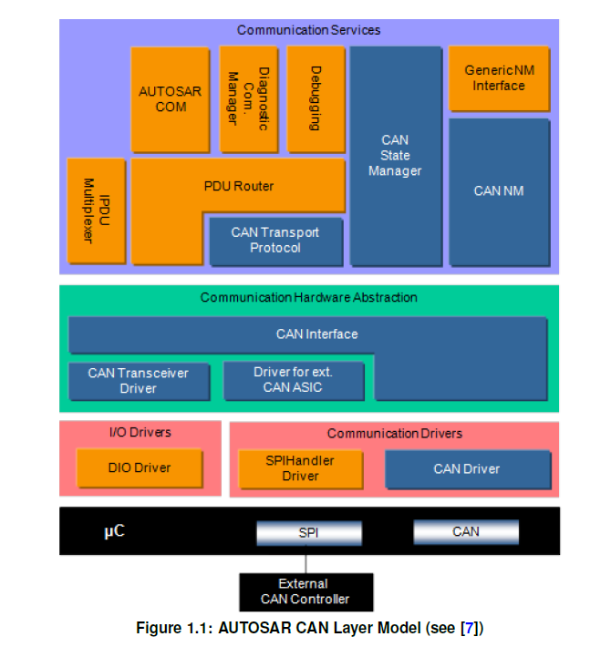

<section id="title">AUTOSAR CAN Interface</section>

# 1. 简介和功能概述

本文描述了AUTOSAR基础软件模块CAN接口（**CAN Interface**）的功能、API和配置。

如图1.1所示，CAN接口模块位于下层CAN设备驱动程序（CAN驱动程序[1]和收发器驱动程序 [2]）和上层通信服务层（即CAN状态管理器[3]、CAN网络管理[4]、CAN传输协议[5]、PDU路由器[6]）。它提供上层通信层的CAN驱动程序服务的接口。

CAN接口模块通过提供了唯一的接口，来管理不同的CAN硬件设备类型：CAN控制器（**CAN Controllers**）和CAN收发器（**CAN Transceivers**）。因此CAN状态管理器模块（**CAN State Managers**）可以基于物理CAN通道相关视图，来控制底层的多个内部和外部CAN控制器及CAN收发器。

CAN接口模块完成所有与硬件无关的CAN任务，这些任务原属于相应ECU的CAN通讯设备驱动程序。这些功只能在CAN接口模块中实现一次，从而底层CAN设备驱动程序只需关心如何对特定的CAN硬件设备的访问和控制。

**CanIf**实现了PDU路由器（**PDU Router**）和AUTOSAR COM堆栈的上层通信模块的所需的控制流和数据流要求，包括：
* 发送请求处理（**transmit request processing**）
* 发送确认/接收指示/错误通知（**transmit confirmation / receive indication / error notification**）
* CAN控制器的启动/停止（**start / stop of a CAN Controller**）
* 唤醒/参与网络（**waking up / participating on a network**）

它的数据处理和通知API是基于CAN的**L-SDU**，然而对于用于控制和模式处理相关的API提供了与CAN控制器相关的接口。

在传输请求的情况下，**CanIf**使用相应的参数完成**L-PDU**传输，并通过适当的 Can驱动程序将CAN的**L-PDU**转发到CAN控制器。 在接收时，CanIf将接收到的 **L-PDU**作为**L-SDU**分发给上层。具体接收到的**L-SDU**分发到哪个上层模块是静态配置的。在传输确认时，**CanIf**负责通知上层模块传输成功。

CAN接口模块为CAN通信提供了对CAN驱动程序和CAN收发器驱动程序服务的抽象访问。CAN接口模块实现了控制和监督CAN网络。CAN接口模块将来自CAN状态管理器的状态更改请求，向下转发到下层CAN设备驱动程序。同时向上将CAN驱动程序或者CAN收发器驱动程序的事件转发到上层模块（例如：对应的NM模块）。

# 2. 缩略语

**CAN L-PDU**
> CAN协议数据单元（**CAN Protocol Data Unit**）。由CAN驱动程序可见的标识符（**identifier**）、数据长度和数据（**SDU**）组成。

**CAN L-SDU**
> CAN服务数据单元（**Service Data Unit**）。CAN的L-PDU内的传输数据。对CAN接口的上层可见（例如：PDU路由器）。

**CanDrv**

# 3. 相关文档

# 4. 约束和假设

## 4.1. 限制

CAN接口只能用于CAN通信，并且专门设计用于与一个或多个底层CAN驱动程序（**CAN Drivers**）和CAN收发器驱动程序（**CAN Transceiver Drivers**）一起运行。不同CAN硬件单元的多个CAN驱动模块仅通过通用的CAN驱动规范[1]定义。 同样，不同CAN收发器设备的多个CAN收发器驱动模块也仅通过通用的CAN收发器驱动规范[2]定义。

不支持CAN以外的其他协议（如：**LIN**或**FlexRay**）。

请注意，被激活的**PnTxFilter**确保了总线上的第一条消息是**CanIfTxPduPnFilterPdu**。如果**CanIfTxPduPnFilterPdu**是**NM-PDU**，COM堆栈启动会注意禁用**PduGroup**，直到成功传输该**PDU**。但是在发送配置的**PDU**之前，其他PDU的传输请求将被拒绝。如最初启动的PDU（**Initially started PDU**）、TP-PDU、XCP-PDU等。只有第一个发起网络唤醒的PDU必须是**CanIfTxPduPnFilterPdu**。 如果通信正在进行并且在启用**PnTxFilter**的情况下成功接收帧，则应禁用**PnTxFilter**。在这种情况下不需要**PnTxFilter**，因为Ack将由已经激活的节点提供。

## 4.2. 对汽车领域的适用性

CAN接口可用于使用CAN协议的所有应用。

# 5. 对其他模块的依赖

# 6. 功能规格

## 6.1. 概述

**CanIf 支持的服务主要分为以下几类：**

* 初始化（Initialization）
* 传输请求服务（Transmit request services）
* 传输确认服务（Transmit confirmation services）
* 接收指示服务（Reception indication services）
* 控制器模式控制服务（Controller mode control services）
* PDU模式控制服务（PDU mode control services）

**CanIf 可能会采用以下的模式：中断模式、轮询方式和混合模式。**

### 6.1.1. 中断模式（**Interrupt Mode**）
**CanDrv** 处理由CAN控制器（**CAN Controller**）触发的中断。**CanIf** 是基于事件的，当事件发生时会收到通知。在这种情况下，相关的 **CanIf** 服务在 **CanDrv** 中的相应 **ISR** 中被调用。

### 6.1.2. 轮询方式（**Polling Mode**）
**CanDrv** 由 **SchM** 触发并执行的后续流程。在这种情况下，必须在定义的时间间隔内**Can_MainFunction_Write**/**Can_MainFunction_Read**/**Can_MainFunction_BusOff**/**Can_MainFunction_Wakeup**/**Can_MainFunction_Transceiver**会被定期调用。当某个CAN控制器（**CAN Controller**）发生了接收、传输、Bus Off或者超时事件，**CanDrv** 会通知 **CanIf**模块。这等同于中断驱动操作模式。**CanDrv**负责更新CAN控制器（**CAN Controller**）中发生的事件对应的信息，例如：接收一个**L-PDU**。

### 6.1.3. 混合模式（**Mixed Mode**）：中断和轮询驱动CanDrv
根据使用的CAN控制器（**CAN Controller**），功能可分为：中断驱动和轮询驱动操作模式。例如：通过轮询模式驱动的**FullCAN**的接收，通过中断模式驱动**BasicCAN**的接收；轮询模式驱动发送和中断模式驱动接收等。

CanIf 模块提供了一个唯一的接口，它对所有三种类型的操作模式都有效。总而言之，CanIf 以相同的方式工作，无论事件是在中断、周期任务还是混合模式中处理。唯一的区别是调用的上下文和可能的通知中断方式：抢先的（**pre-emptive**）或协同的（**co-operative**）。所有服务都按照配置执行。

## 6.2. 硬件对象句柄（HOH）

HOH硬件对象句柄（**Hardware Object Handles**）表示对**CAN Mailbox**结构的一种抽象引用。它可分为：用于传输的**HTH**和用于接收的**HRH**。它包含了CAN相关的一些参数，例如：**CanId**、**DLC**和数据（**data**）。基于CAN硬件缓冲区抽象，每个硬件对象（**Hardware Object**）在**CanIf**中引用，独立于CAN硬件缓冲区布局。**HOH**用做在调用**CanDrv**的接口服务中的参数，由**CanDrv**的配置提供，并由**CanDrv** 用作**CAN Mailbox**的通信缓冲区的标识符。

**CanIf**仅充当硬件对象句柄的使用者，但不根据硬件特定信息对其进行解释。因此保证了**CanIf**模块独立于硬件。

**CanIf**应避免直接访问特定于硬件的通信缓冲区，只能通过调用**CanDrv**接口服务来访问它，这样保证了**CanIf**独立于硬件。通过使用**HOH**作为参数调用**CanDrv**接口，从而这些参数从具体的**CAN**硬件缓冲区属性中抽象出来。
每个CAN控制器（**CAN Controller**）可以在**CAN Mailbox**中提供多个CAN传输硬件对象（**CAN Transmit Hardware Objects**）。这些可以逻辑链接到一个完整的硬件对象池（多路复用硬件对象），并通过一个**HTH**寻址定位。

**CanIf**可以使用两种类型的**HOH**来启用对**CanDrv**的访问：
* 硬件发送句柄 (**HTH**)
* 硬件接收句柄 (**HRH**)。

### 6.2.1. 硬件接收句柄 (**HRH**)

HRH是一个引用CAN控制器邮箱（**CAN Controller mailbox**）的逻辑硬件接收对象（**Hardware Receive Object**）的句柄。

**HRH**使**CanIf**能够通过**BasicCAN**或**FullCAN**接收方法来引用接收数据单元，并把接收到的**L-SDU**通知到目标的上层模块。

## 6.3. 静态 L-PDU

## 6.4. 动态 L-PDU

## 6.5. 物理通道视图

## 6.6. CAN硬件单元

## 6.7. BasicCAN 和 FullCAN 接收

**CanIf**区分 BasicCAN 和 FullCAN 处理以激活软件接受过滤。
用于 FullCAN 操作的 CAN 邮箱（硬件对象）仅启用单个 CanId 的传输或接收。 因此，一个硬件对象的 BasicCAN 操作能够发送或接收一系列 CanId。
用于配置的 BasicCAN 接收的硬件接收对象能够接收一系列 CanId，这些 CanId 通过其硬件接受过滤器。 此范围可能超出此 HRH 将接收的预定义 Rx L-PDU 列表。 因此，CanIf 随后应执行软件过滤以仅将预定义的 Rx L-PDU 列表传递给相应的上层模块。 更多详细信息请参见第 7.20 节“软件接收过滤器”。