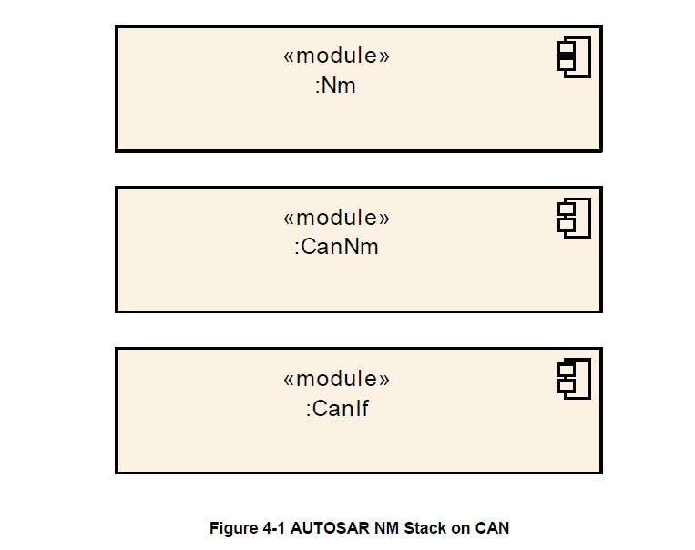

<section id="title">AUTOSAR CAN NM</section>

# 1. 简介和功能概述

本文档描述了AUTOSAR CAN网络管理 (**CanNm**) 的概念、核心功能、可配置特性、接口和配置问题。

AUTOSAR CAN网络管理是一个独立于硬件的协议，只能在**CAN**上使用（有关限制，请参阅[章节4.1](#41-限制)）。其主要目的是协调网络正常运行和总线睡眠模式之间的转换。

除了核心功能外，还提供了可配置的功能，例如：实现一个服务来检测所有当前节点或检测所有其他节点是否准备好休眠。

CAN网络管理 (**CanNm**) 功能提供网络管理接口 (**NmIf**) 和 CAN接口 (**CanIf**) 模块之间的适配。有关AUTOSAR网络管理功能的一般理解，请参阅[7]。

# 2. 缩略语

## 2.1. 首字母缩写

下面的词汇表包括与**CanNm**模块相关的首字母缩略词和缩写词，它们未包含在**AUTOSAR**词汇表中。

**CanIf**
> CAN接口（**CAN Interface**）的缩写

**CanNm**
> CAN网络管理（**CAN Network Management**）的缩写

**CBV**
> 控制位向量（Control Bit Vector）

**CWU**
> 整车唤醒（**Car Wakeup**）

**ERA**
> 外部请求数组（**External Request Array**）

**EIRA**
> 外部和内部请求数组（**External and Internal Request Array**）

**NM**
> 网络管理（**Network Management**）

**PNC**
> 部分网络集群（**Partial Network Cluster**）

**PNI**
> 部分网络信息（**Partial Network Information**）

**PNL**
> 部分网络学习（**Partial Network Learning**）

**SNI**
> 源节点标识符（**Source Node Identifier**）

## 2.2. 术语 

**PDU传输能力被禁用**（**PDU transmission ability is disabled**）
> 这意味着网络管理**PDU**传输已被服务**CanNm_DisableCommunication**禁用。

**重复消息请求位指示**（**Repeat Message Request Bit Indication**）
> **CanNm_RxIndication**在收到的网络管理**PDU**的控制位向量中找到**RptMsgRequest**集。

PN过滤遮罩（**PN filter mask**）
> 由配置容器定义的过滤器掩码字节向量**CanNmPnFilterMaskByte**。

**顶级PNC协调员**（**Top-level PNC coordinator**）
> 顶级PNC协调器是一个**ECU**，它充当网络中的PNC网关，并在所有分配的通道上主动协调处理至少一个PNC。如果启用了同步PNC关闭，如果网络中没有其他ECU请求它们，顶级PNC协调器将为这些PNC触发关闭。

**中间PNC协调器**（**Intermediate PNC coordinator**）
> 中间PNC协调器是一个**ECU**，它充当网络中的PNC网关，并在至少一个分配的通道上将至少一个PNC处理为被动协调。如果启用了同步PNC关闭，它会将收到的这些PNC的关闭请求转发到相应的主动协调通道，并相应地启动它们的关闭。

**PNC叶节点**（**PNC leaf node**）
> PNC叶节点是一个**ECU**，在网络中根本不充当PNC协调器。它像通常的NM消息一样处理PN关闭消息。

**PN关闭消息**（**PN shutdown message**）
> 顶级PNC协调器发送PN关闭消息以指示跨PN拓扑的同步PNC关闭。PN关闭消息是作为**NM**消息，它在控制位向量中具有**PNSR**位，并且所有被指示用于同步关闭的PNC都设置为**1**

# 3. 相关文档

## 3.1. 输入文件

[1] General Requirements on Basic Software Modules
> AUTOSAR_SRS_BSWGeneral.pdf

[2] Specification of the AUTOSAR Network Management Protocol
> AUTOSAR_PRS_NetworkManagementProtocol.pdf

[3] Requirements on Network Management
> AUTOSAR_RS_NetworkManagement.pdf

[4] Specification of CAN Interface
> AUTOSAR_SWS_CANInterface.pdf

[5] Specification of Communication Stack Types
> AUTOSAR_SWS_CommunicationStackTypes.pdf

[6] Specification of ECU Configuration
> AUTOSAR_TPS_ECUConfiguration.pdf

[7] Specification of Generic Network Management Interface
> AUTOSAR_SWS_NetworkManagementInterface.pdf

[8] Specification of Communication Manager
> AUTOSAR_SWS_ComManager.pdf

[9] Specification of Standard Types
> AUTOSAR_SWS_StandardTypes.pdf

[10] General Specification of Basic Software Modules 
> AUTOSAR_SWS_BSWGeneral.pdf

[11] Specification of SystemTemplate 
> AUTOSAR_TPS_SystemTemplate

## 3.2. 相关规范

AUTOSAR 提供了基础软件模块的通用规范 [10] (**General Specification of Basic Software Modules**)，它也适用于**CAN**网络管理。

因此，规范基础软件模块的通用规范应被视为**CAN**网络管理的附加和必需规范。

# 4. 约束和假设

## 4.1. 限制

1. **CanNm**的一个通道只关联一个网络中的一个网络管理集群（**network management cluster**）。
2. 一个网络管理集群的一个节点只能有一个**CanNm**通道。
3. **CanNm**的一个通道只关联同一个ECU内的一个网络。
4. **CanNm**仅适用于**CAN**系统。

图4-1展示了一个示例**ECU**中的**AUTOSAR**网络管理堆栈，该示例**ECU**至少包含一个**CanNm**集群。

## 4.2. 适用于汽车领域

**CanNm**模块可以在上述限制下应用于任何汽车领域。

# 5. 对其他模块的依赖

CAN网络管理（**CanNm**）主要使用CAN接口（**CanIf**[4]）的服务，并为通用网络管理接口（**NmIf**[7]）提供服务。

# 6. 功能规格

## 6.1. 协调算法

**AUTOSAR CanNm**基于分散的直接网络管理策略，这意味着每个网络节点仅根据在通信系统内接收或传输的网络管理**PDU**执行自给自足的活动。

### 6.1.1. 概念

**AUTOSAR CanNm**算法基于周期性的网络管理**PDU**，集群中的所有节点通过广播传输接收这些**PDU**。网络管理**PDU**的接收表明发送节点希望保持网络管理集群处于唤醒状态。如果任何节点准备好进入总线睡眠（**Bus-Sleep**）模式，它就会停止发送网络管理**PDU**，但只要收到来自其他节点的网络管理**PDU**，节点就需推迟转换到总线睡眠模式。最后，如果由于不再接收到网络管理**PDU**而导致专用计时器超时，则每个节点都会启动到总线睡眠模式的转换。

如果网络管理集群中的任何节点需要总线通信，它可以通过发送网管**PDU**将网络管理集群从总线睡眠模式唤醒。有关唤醒过程本身的更多详细信息，请参阅通讯管理器规格[8]。

**AUTOSAR CanNm**算法的主要概念可以通过以下两个关键要求来定义：**CanNm**集群中的每个网络节点只要需要总线通信，就应该定期发送网络管理**PDU**；否则它将无需发送网络管理**PDU**。

如果**CanNmStayInPbsEnabled**被禁用，并且**CanNm**集群中的总线通信被释放，并且在可配置的（CanNmTimeoutTime + CanNmWaitBusSleepTime）时间里，总线上没有任何网络管理**PDU**，则需执行转换到总线睡眠模式。

### 6.1.2. 状态机

**AUTOSAR CanNm**算法的整体状态机可以定义如下：

**AUTOSAR CanNm**状态机应包含从网络管理集群中单个节点的角度来看的**AUTOSAR CanNm**算法所需的状态、转换和触发器。

**注意：**

状态转换必须在下一个主函数中最晚执行。

## 6.2. 操作模式

以下章节将详细介绍**AUTOSAR CanNm**算法的操作模式。

**AUTOSAR CanNm**应包含在模块接口上可见的三种操作模式：

* 网络模式（**Network Mode**）
* 准备总线休眠模式（**Prepare Bus-Sleep Mode**）
* 总线睡眠模式（**Bus-Sleep Mode**）

**AUTOSAR CanNm**操作模式的变化需通过回调函数通知上层。当**CanNm_GetState**被调用时，**CanNm**将返回当前的**NM**状态和模式。

### 6.2.1. 网络模式

网络模式应包括三个内部状态：

* 重复报文状态（**Repeat Message State**）
* 正常运行状态（**Normal Operation State**）
* 就绪休眠状态（**Ready Sleep State**)

当从总线睡眠模式（**Bus-Sleep Mode**）进入网络模式（**Network Mode**）时，**CanNm**模块需默认进入重复报文状态（**Repeat Message State**）。

当从准备总线休眠模式（**Prepare Bus-Sleep Mode**）进入网络模式（**Network Mode**）时，**CanNm**模块需默认进入重复报文状态（**Repeat Message State**）。

当进入网络模式时，**CanNm**模块需启动**NM-Timeout Timer**，同时通过调用回调函数**Nm_NetworkMode**通知上层新的当前操作模式。

在网络模式下成功接收网络管理PDU（调用**CanNm_RxIndication**）后，如果启用了**PDU**传输能力，**CanNm**模块需重新启动**NM-Timeout Timer**。

在网络模式下成功传输网络管理PDU（使用**E_OK**调用**CanNm_TxConfirmation**）时，**CanNm**模块需重新启动**NM-Timeout Timer**。

**注意：**

如果启用**CanNmImmediateTxConfEnabled**，则假定每个网络管理**PDU**传输请求都会导致网络管理**PDU**传输成功。

**CanNm**模块需在每次启动或重启时，重置**NM-Timeout Timer**。

如果在网络模式下调用**CanNm_PassiveStartUp**，**CanNm**模块将不执行该服务并返回**E_NOT_OK**。

如果在**CanNmDynamicPncToChannelMappingEnabled**设置为**TRUE**，且**CanNm**处于网络模式的通道上调用函数**CanNm_PnLearningRequest**，则 **CanNm**模块需在该通道上将**CBV**中的重复消息位和部分网络学习（**Partial Network Learning**）位设置为**1**，并更改为或重新启动重复报文状态（**Repeat Message State**）。

如果在**CanNmDynamicPncToChannelMappingEnabled**设置为**TRUE**，且**CanNm**处于网络模式的通道上接收到的部分网络学习（**Partial Network Learning**）位和 **Repeat Message Request**位的值为**1**，则**CanNm**应在该通道上将**CBV**中的**Partial Network Learning Bit**设置为**1**，并更改或重新启动重复报文状态。

#### 6.2.1.1. 重复报文状态（Repeat Message State）

对于不处于被动模式的节点（请参阅[第6.9.3章节](#693-被动模式)），重复报文状态确保从总线睡眠或准备总线睡眠到网络模式的任何转换，对网络上的其他节点都是可见的。 此外它还确保任何节点在最短的时间内保持活动状态。它可用于存在节点的检测。

当进入重复报文状态时，**CanNm**模块需（重新）开始传输网络管理PDU，除非被动模式被启用或者通信被禁止。

当**NM-Timeout Timer**在重复报文状态中超时到期时，**CanNm**模块需（重新）启动**NM-Timeout Timer**，同时需向**DET**报告**CANNM_E_NETWORK_TIMEOUT**。

网络管理状态机应在由配置参数**CanNmRepeatMessageTime**确定的可配置时间量内保持在重复报文状态；在此时间后，**CanNm**模块需离开重复报文状态。

当离开重复报文状态时，如果网络已被请求，**CanNm**模块需进入正常运行状态（**Normal Operation State**）；如果网络已经被释放，则**CanNm**模块需进入就绪休眠状态（**Ready Sleep State**）。

如果**CanNmNodeDetectionEnabled**设置为**TRUE**，**CanNm**将在离开重复报文状态时，清除重复消息位。

如果在重复报文状态（**Repeat Message State**）、总线睡眠模式（**Prepare Bus-Sleep Mode**）或总线睡眠模式（**Bus-Sleep Mode**）中调用服务**CanNm_RepeatMessageRequest**，CanNm模块应不执行该服务并返回**E_NOT_OK**。

如果**CanNmDynamicPncToChannelMappingEnabled**设置为**TRUE**，**CanNm**将在离开重复报文状态时清除部分网络学习位。

#### 6.2.1.2. 正常运行状态

正常运行状态确保只要网络被请求，任何节点都可以保持网络管理集群处于唤醒状态。

当从就绪休眠状态（**Ready Sleep State**)进入正常运行状态（**Normal Operation State**）时，**CanNm**模块将开始传输网络管理**PDU**。

**注意：**

如果被动模式被启用或者网络管理PDU传输被禁用，则**NM PDU**不会被传输，所以无任何操作需被执行。

当**NM-Timeout Timer**在正常运行状态下超时到期，**CanNm**模块需（重新）启动 **NM-Timeout Timer**，同时需向**DET**报告**CANNM_E_NETWORK_TIMEOUT**。

当前状态为正常运行状态（**Normal Operation State**），如果网络被释放，则**CanNm**模块需进入就绪休眠状态（**Ready Sleep State**)。

如果**CanNmNodeDetectionEnabled**设置为**TRUE**，并且在正常运行状态（**Normal Operation State**）下接收到重复消息请求位，则**CanNm**模块需进入重复报文状态（**Repeat Message State**）。

如果**CanNmNodeDetectionEnabled**设置为**TRUE**，并且在正常运行状态（**Normal Operation State**）下调用函数**CanNm_RepeatMessageRequest**，则**CanNm**模块也需进入重复报文状态（**Repeat Message State**），并且CanNm模块需设置重复消息位（**Repeat Message Bit**）。

#### 6.2.1.3. 就绪休眠状态

就绪休眠状态（**Ready Sleep State**）确保只要有其他节点保持网络管理集群处于唤醒状态，网络管理集群中的任何节点就会等待进入准备总线休眠模式。

当从重复报文状态（**Repeat Message State**）或正常运行状态（**Normal Operation State**）进入就绪休眠状态（**Ready Sleep State**）时，**CanNm**模块将停止网络管理**PDU**的传输。

**注意：**

如果被动模式被启用，则**NM PDU**不会被传输，所以无任何操作需被执行。

在某些情况下，如果被动模式被禁用，则需要在就绪休眠状态（**Ready Sleep State**）下传输**NM PDU**，以保证网络同步关闭。例如：PN关闭消息（PN shutdown messages）的重新传输。

当**NM-Timeout Timer**在就绪休眠状态（**Ready Sleep State**）下超时到期，**CanNm**模块将进入准备总线休眠模式（**Prepare Bus-Sleep Mode**）。

当网络请求时，当前状态为就绪休眠状态（**Ready Sleep State**）时，**CanNm**模块需进入正常运行状态（**Normal Operation State**）。

如果**CanNmNodeDetectionEnabled**设置为**TRUE**，并且在就绪休眠状态（**Ready Sleep State**）下收到重复报文请求位，则**CanNm**模块进入重复报文状态（**Repeat Message State**）。

如果**CanNmNodeDetectionEnabled**设置为**TRUE**，并且在就绪休眠状态（**Ready Sleep State**）下调用**CanNm_RepeatMessageRequest**函数，则**CanNm**模块需进入重复报文状态（**Repeat Message State**），并且CanNm模块需设置重复消息位（**Repeat Message Bit**）。

### 6.2.2. 准备总线休眠模式

### 6.2.3. 总线睡眠模式

## 6.3. 网络状态

## 6.4. 初始化

## 6.5. 执行

### 6.5.1. 处理器架构

### 6.5.2. 时序参数

## 6.6. 网络管理PDU结构

## 6.7. 通信调度

### 6.7.1. 发送（Transmission）

### 6.7.2. 接收（Reception）

## 6.8. 总线减载机制

## 6.9. 附加的功能

### 6.9.1. 远程睡眠指示检测

### 6.9.2. 用户数据

### 6.9.3. 被动模式

### 6.9.4. 网络管理PDU的Rx指示

### 6.9.5. 状态变化通知

### 6.9.6. 通讯控制

### 6.9.7. 协调器同步支持

## 6.10. 整车唤醒

### 6.10.1. 接收路径

### 6.10.2. 发送路径

## 6.11. 部分联网

### 6.11.1. NM PDU的Rx处理

### 6.11.2. NM PDU的Tx处理

### 6.11.3. 内部请求的部分网络集群的处理

### 6.11.4. 网络管理PDU过滤算法（已过时）

### 6.11.5. 内部和外部请求的部分网络的聚合（过时）

### 6.11.6. 外部请求的部分网络的聚合（过时）

### 6.11.7. 通过CanNm_NetworkRequest自发传输NM PDU

## 6.12. 传输错误处理

## 6.13. CanNm API 的功能要求

## 6.14. 主函数调度

