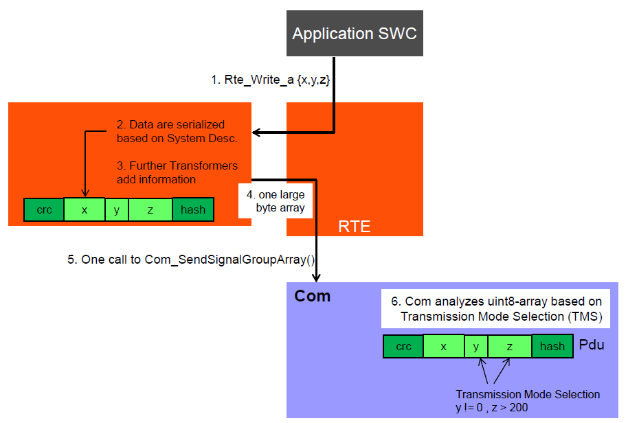
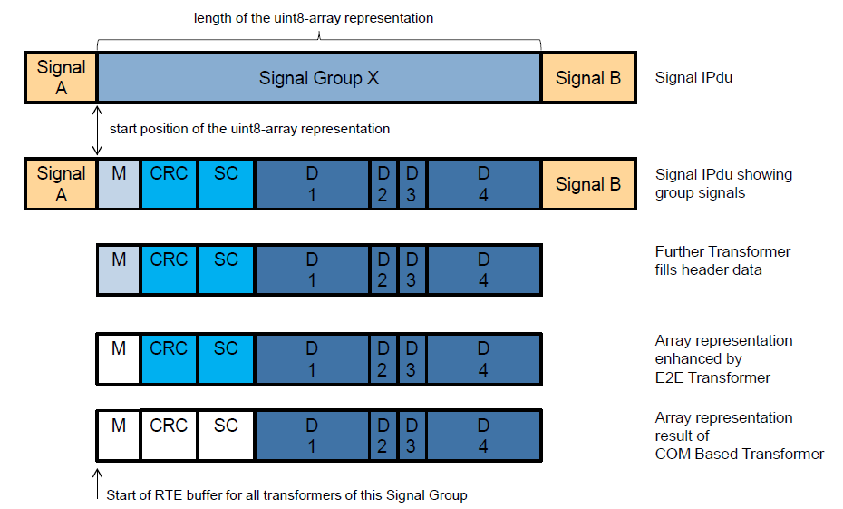
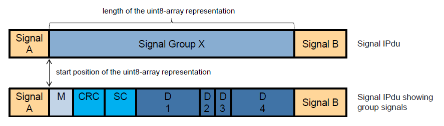
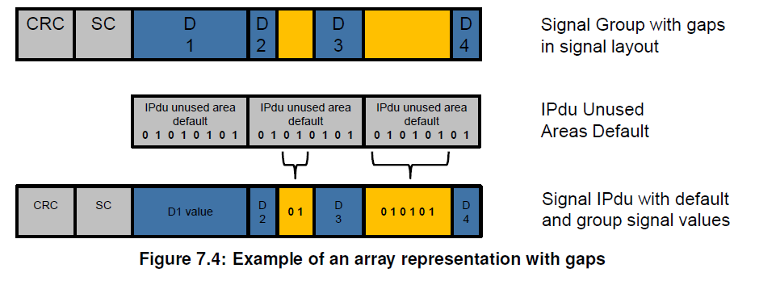

<section id="title">AUTOSAR COM Based Transformer</section>

# 1. 简介和功能概述

当在RTE中发送和接收数据时，转换器的特性提供了链接任意转换器的功能。当目标总线系统使用带有打包数据表示（**packed data representations**）的固定通信矩阵时，基于COM的转换器（**Transformer**）提供了这种功能。

# 2. 相关的文档

## 2.1. 输入文档

1. Glossary
    > AUTOSAR_TR_Glossary
2. General Specification of Transformers
    > AUTOSAR_ASWS_TransformerGeneral
3. Specification of RTE Software
    > AUTOSAR_SWS_RTE
4. Specification of Communication
    > AUTOSAR_SWS_COM
5. General Requirements on Basic Software Modules
    > AUTOSAR_SRS_BSWGeneral
6. Requirements on Transformer
    > AUTOSAR_SRS_Transformer
7. System Template
    > AUTOSAR_TPS_SystemTemplate
8. General Specification of Basic Software Modules
    > AUTOSAR_SWS_BSWGeneral

## 2.2. 相关的规范

AUTOSAR提供了转换器通用规范[2]，它也适用于基于COM的转换器。因此，AUTOSAR_ASWS_TransformerGeneral应被视为基于COM的转换器的必需和附加的规范。

# 3. 约束和假设

对于基于COM的转换器，所有通用转换器的限制（参见[2]）都适用。此外，以下限制也同样适用于基于COM的转换器。

1. 基于COM的转换器不支持客户端-服务器通信。
2. 基于COM的转换器不支持外部触发通信。
3. 基于COM的转换器只支持复合数据类型（即：来自COM的**Signal Group**）。
4. 基于COM的转换器只支持固定大小的数据类型。
5. 基于COM的转换器只支持字节对齐的信号组（**Signal Group**）。
6. 基于COM的转换器应支持所有组信号依次映射到**IPdu**的信号组（可能有间隙，在信号组布局中的位置没有定义相应的信号）。

如果约束3.出现了单一的原始数据元素必须使用基于COM的转换器处理的用例时（如：在序列化之后执行E2E的保护），那么可以把数据元素放在一个结构中。然后该结构将只包含这一个条目。

# 4. 功能规范

## 4.1. 功能概述

当SWC发起一个被配置为转换（**transformed**）的ECU之间的通信时，SWC将数据移交给RTE。RTE执行已配置的转换器链。其中可以包含基于COM的转换器。



基于COM转换器的发送端会首先序列化（**serializes**）SW-C的数据，并将数据按照通信矩阵描述的定义，转换成uint8的数组（**uint8-array**）来表示。再将数据转发到COM模块，并放置在各自的**IPdu**中。COM模块会分析提供的uint8-array数据并触发相应的传输模式（传输模式选择取决于TMS的配置）。**IPdu**通过总线上的通信栈发送给接收者。

接收端RTE以相反的顺序执行转换器链。接收机的基于COM的转换器将线性数据反序列化为原始数据结构。这些再移交给接收的SW-C。

从SWC的角度来看，无论数据是否被转换，它都是完全透明的。

COM的IPdu缓冲区和转换器缓冲区内的数据处理，如下图[2]所示：


**ISignalIPdu**由COM模块作为**ComIPdu**处理，可以包含多个部分（包括：信号和信号组）。COM中的信号组（**signal group**）由**ComSignalGroup**容器表示。

在System Template[7]中，可以定义需要基于COM的转换器处理信号组。对于一个特定的转换器链，基于COM的转换器的使用是由引用**comBasedSignalGroupTransformation**从**ISignalGroup**到**DataTransformation**定义的。可参见图[3]。


在COM模块的Ecu配置中，这样的**ComSignalGroups**定义了一个**ComSignalGroupArrayAccess=true**参数。

如果**ComSignalGroupArrayAccess=true**，那么它隐式定义了信号组的长度和信号组在**ComIPdu**中开始的位置。因此，也就是说在一个**ISignalIPdu**中可以定义多个信号（**signal**）和信号组（**signal groups**）。例如：“信号A”和“信号B”是**IPdu**的一部分，但不被基于COM的转换器的“信号组X”考虑。

在**Com**模块API中，**Com_SendSignalGroupArray**和**Com_ReceiveSignalGroupArray**根据在**ComIPdu**中定义的信号组的长度和起始位置将信号组用数组表示（**array representation**）。该数组表示包含属于该信号组的所有信号，无论应用软件是否定义了数据映射（**data mapping**）。

如下图所示，信号组X（**Signal Group X**）由信号（**M、CRC、SC、D1、D2、D3、D4**）组成。因此，RTE将基于该信号组的整个数组的表示和该信号组的长度与**COM**模块进行交互。



当RTE与基于COM的转换器进行交互时，也需要考虑所有其他潜在的转换器。以便于确定实际向每个转换器提供信号组的阵列表示的哪一部分，因为每个转换器都可能在发送过程中添加数据或在接收过程中删除数据。

例如，数组表示中包含**CRC**和**SC**信号的部分由E2E转换器（**E2E transformer**）处理，所以不会被基于COM的转换器（**COM Based Transformer**）考虑。信号**M**既不会被E2E转换器处理，也不会被基于COM的转换器处理。对于信号**M**，有另一个进一步的转换器负责。

RTE将为该信号组开始位置的所有转换器提供数据缓冲器，以用于基于COM的转换器、E2E转换器和任何一个进一步定义的转换器。

## 4.2. 基于COM的转换器规范

序列化描述了在网络上传输的协议数据单元（PDU）中表示数据的方式。对于基于COM的转换器，序列化是由使用系统模板[7]的通信矩阵定义的。通信矩阵信息会接管**COM**模块的**Ecu**配置。

序列化是基于COM模块的Ecu配置和：
* 软件组件（**Software Component**）的**PortPrototype**；
* 每个**SenderReceiverInterface**定义的**dataElement**列表；
* **SenderReceiverToSignalGroupMapping**；
* **SystemSignalGroup**的**ISignalToIPduMapping**。

基于COM的转换器只能作为转换器链中最上层（第一层）的转换器使用。基于COM的转换器将结构化数据序列化为线性形式。因此，它只能作为发送端第一个转换器和接收端最后一个转换器使用。

如果以下条件满足，基于COM的转换器将被定义为一个转换器使用：
* **TransformationTechnology**的**protocol**属性设置为**COMBased**；
* **TransformationTechnology**的**version**属性被设置为**1.0.0**
* **TransformationTechnology**的**transformerClass**属性被设置为**serializer**

基于COM的转换器应支持COM模块支持的所有基本数据类型，除了**UINT8_DYN**。

基于COM的转换器应该单独处理**SenderReceiverInterface**的每个**dataElement**。

正如COM模块[4]定义的那样，当COM模块Com_SendSignal、Com_ReceiveSignal被调用处理阴影信号（**shadow signal**）时，基于COM的转换器需要处理**SenderReceiverInterface**的每个**dataElement**。这定义了基于COM的转换器对COM模块同等地执行所有操作。包括字节顺序转换（**Endianess Conversion**）和符号扩展（**Sign Extension**）。

**COM**模块的配置隐式地定义了信号组的长度和信号组在**ComIPdu**中开始的起始位置。

如果信号组数组表示的信号布局包含间隙（**Gap**），则在传输过程中，这些间隙应设置为该信号组映射到的相应**ComTxIPdu**的**ComTxIPduUnusedAreasDefault**定义的值。

信号组数组表示可能会出现空白，因为布局没有完全打包，而且有些位（甚至字节）没有为其定义信号。如下图所示：



基于COM的转换器应考虑在**ISignalGroup**中定义的**ISignal**的头或尾，这些信号由进一步的转换器处理。

基于COM的转换器应该根据COM中的**ISignalGroup**的配置将序列化的数据元素放入数据缓冲区的指定位的位置（**bit position**）。为了允许迁移，反序列化应该能够接受更大的数组表示，并忽略附加在先前已知参数列表末尾的dataElements。这意味着:在序列化数据的末尾用于生成或参数化反序列化代码的接口规范中没有定义的数据元素将被反序列化忽略。

# 5. API规范

## 5.1. ComXf_\<transformerId\>
```
uint8 ComXf_<transformerId> (
    uint8* buffer,
    uint32* bufferLength,
    <paramtype> dataElement
)
```

## 5.2. ComXf_Inv_\<transformerId\>
```
uint8 ComXf_Inv_<transformerId> (
    const uint8* buffer,
    uint32 bufferLength,
    <type>* dataElement
)
```

## 5.3. ComXf_Init

```
void ComXf_Init (
    const ComXf_ConfigType* config
)
```

## 5.4. ComXf_DeInit

```
void ComXf_DeInit (
    void
)
```

## 5.5. ComXf_GetVersionInfo

```
void ComXf_GetVersionInfo (
    Std_VersionInfoType* VersionInfo
)
```


