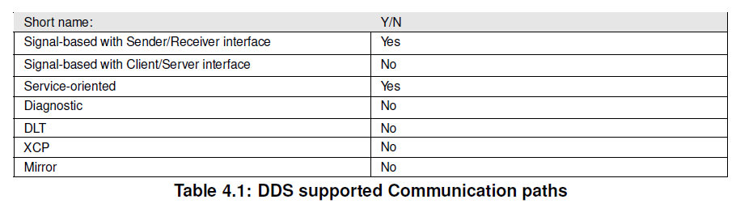
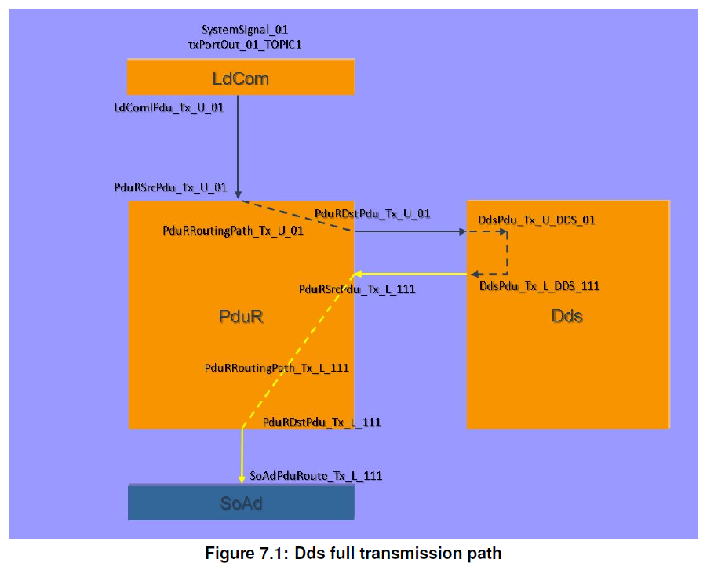
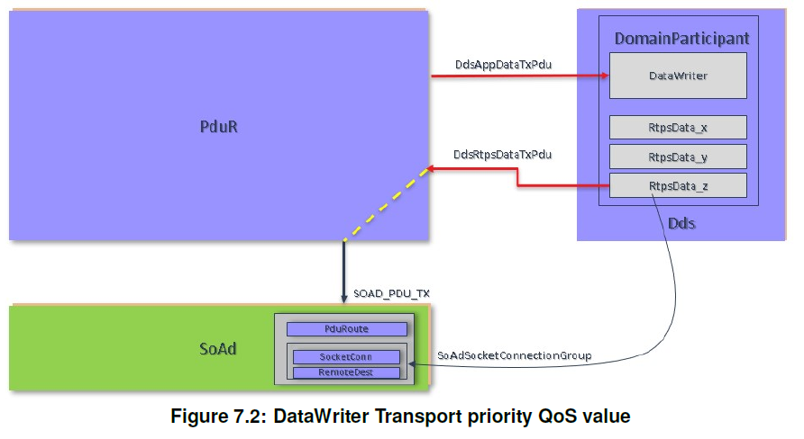
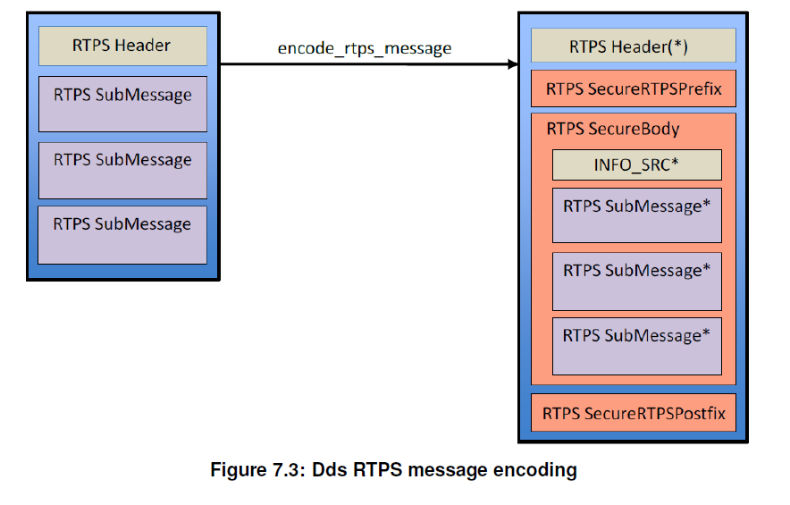

<section id="title">Data Distribution Service for Classic Platform（）</section>

# 1. 简介和功能概述

本规范规定了数据分发服务 **AUTOSAR** 基础软件模块 **DDS BSW** 的功能、**API** 和配置。

## 1.1. DDS协议概述

数据分发服务DDS（**Data Distribution Service**）是由对象管理组织（**OMG**）定义的中间件协议和**API**标准。

**DDS**的初步概述可以参见 **AUTOSAR_RS_DDS** 中的第4章，或者直接参考**OMG**的标准 [1]。

# 2. 缩略语

## 2.1. 缩略语

有关首字母缩写词和缩写词，请参阅 [2，AUTOSAR 术语表]。

## 2.2. 术语表

**DDS PDU** 和 **非DDS PDU**：包含或者不包含 DDS 数据的 PDU。例如：在 **DdsAppDataTxPduCollection** 或 **DdsAppDataRxPduCollection** 或 **DdsDomainParticipantUnicastRtpsPduCollection** 或 **DdsDomainParticipantMulticastRtpsPduCollection** 容器中列出或者未列出的 **PDU**）。

# 3. 相关的文档

## 3.1. 输入文档

1. Data Distribution Service (DDS), Version 1.4
> http://www.omg.org/spec/DDS/1.4

2. Glossary
> AUTOSAR_FO_TR_Glossary

3. General Specification of Basic Software Modules
> AUTOSAR_CP_SWS_BSWGeneral

4. Specification of RTE Software
> AUTOSAR_CP_SWS_RTE

5. Specification of PDU Router
>AUTOSAR_CP_SWS_PDURouter

6. DDS Interoperability Wire Protocol, Version 2.2
> http://www.omg.org/spec/DDSI-RTPS/2.2

7. Specification of Default Error Tracer
> AUTOSAR_CP_SWS_DefaultErrorTracer

8. Specification of Crypto Service Manager
> AUTOSAR_CP_SWS_CryptoServiceManager

9. Specification of CRC Routines
> AUTOSAR_CP_SWS_CRCLibrary

10. Requirements on Data Distribution Service
> AUTOSAR_FO_RS_DataDistributionService

11. DDS Security, Version 1.1
> https://www.omg.org/spec/DDS-SECURITY/1.1

12. ISO 26262:2018 (all parts) – Road vehicles – Functional Safety
> https://www.iso.org

13. Extensible and Dynamic Topic Types for DDS, Version 1.2
> https://www.omg.org/spec/DDS-XTypes/1.2

14. Specification of Platform Types for Classic Platform
> AUTOSAR_CP_SWS_PlatformTypes

## 3.2. 相关规格

因为AUTOSAR 提供了基本软件模块的通用规范 [3]，该规范对于**Dds BSW**也有效，所以 **SWS BSW General** 规范应被视为 **Dds** 的附加且必需的规范。

# 4. 约束和假设

## 4.1. 约束和假设

### 4.1.1. 假设

* **DDS PDU** 或者 **非DDS PDU** 串联，通过 **IpduM** 连接 **DDS PDU** 和 **非 DDS PDU** 超出了此概念的范围。

### 4.1.2. 局限性

以下列出功能在CP AUTOSAR 23R11中不支持

* **DDS** 动态发现（**DDS Dynamic Discovery**）[1]：不支持。
* 通过 **RPC通信** 实现 AP/CP 互操作性（**AP/CP Interoperability by means of RPC communication**）：不支持。
* **DDS/CAN** 数据网关：不支持
* 共享内存通信（**Shared-memory communication**）：不支持。
* 立即传输（**Immediate transmission**）：不支持。
* 立即接收（**Immediate reception**）：不支持。
* PDU元数据（**PDU Metadata**）：当前未使用。
* **Dds_Transmit** 和 **Dds_TriggerTransmit**：两个 **API** 始终可用，但必须仅使用其中之一。例如：仅当由下层调用时，才使用 **Dds_TriggerTransmit** 代替 **Dds_Transmit**。
* 软件集群连接层 SwCluC（**Software Cluster Connection Layer**）：不支持。
* 多核分布：假定 Dds 模块位于单个分区中并运行（每个分区没有多组 Tx/Rx 主要功能）。

通信用例：下表总结了支持的通信路径。

### 4.1.3. 约束

* **DDS** 相关的转换：由于DDS需要直接访问数据和数据类型，所以在 **RTE** 级别没有进行转换（具体可参阅[CP_SWS_DDS_CONST_CORNT_00725]）。同时也不存在**BSW**层用于**DDS通信堆栈转换**的**DDS Transformer**模块。
* **DDS** 与 **SOME/IP网络** 交互：由于 **DDS** 和 **SOME/IP** 共享相同的总线类型，所以实现中需提供一些机制，以确保以无任何干扰。该机制可以通过 **UDP** 端口选择来实现：**SOME/IP**和 **DDS** 永远不会共享同一个接收端口号。
* **DDS** 与 **SOME/IP SoAd** 资源共享：不得在同一套接字（**Socket**）连接上，混合 **DDS** 和 **SOME/IP**（或者任何其他潜在协议）的通信。仅为DDS保留单个套接字或者一组套接字。
* **DDS PDU** 和 **非DDS PDU** 串联：**DDS** 和 **SOME/IP** 不得共享相同的套接字连接。单个套接字或一组套接字需仅保留给 **DDS**。
* **UDP** 用法：根据 **OMG** 规范（参考文献[1]），**UDP/IP PSM** 需用于 **Inter-ECU** 通信。

## 4.2. 适用于汽车领域

此模块适用于需要和/或有益的 **DDS通信** 的所有领域。

# 5. 对其他模块的依赖

本节描述与 **AUTOSAR** 基本软件架构中其他模块和文件的关系。它包含 **Dds** 模块从其他模块需要的配置信息和服务的简要描述。

## 5.1. RTE (BSW Scheduler)

RTE BSW Scheduler（参考文献[4]）调用 **Dds BSW** 的主函数，这些函数对于 **Dds** 的周期处理函数是必需的。

## 5.2. PDU路由器

DDS模块使用PDU路由器（参考文献[5]）作为中间层模块。

## 5.3. StbM

**OMG** 标准规定，原始发送的每个 **RTPS消息** 都可以包含时间戳。（参考文献[6]8.3.2.2）。接收应用程序可以使用它来估计发送方和接收方的时钟之间的时间偏移（例如：在 **DESTINATION_ORDER QoS** 策略中处理）。 **StbM_GetCurrentTime API** 可用于保证所需的时间精度（参考文献[6]- 8.3.5.8、9.4.2.9）。

## 5.4. 默认错误跟踪器

为了能够报告开发或运行时错误，**Dds** 模块必须能够访问默认错误跟踪器（参考文献[7]）的错误挂钩。

## 5.5. 加密服务管理器

为了支持安全功能（例如：密钥管理、消息认证代码生成和验证），**Dds** 需使用加密服务模块 API（参考文献[8]）：

**Dds** 需要：
- MAC 生成接口 (Csm_MacGenerate)，用于生成要添加到要发送的消息中的 **MAC**。
- MAC 验证接口 (Csm_MacVerify)，用于检查接收到的消息中的 **MAC**。

## 5.6. 循环冗余校验

为了支持安全功能，**Dds** 需使用 **CRC库**（参考文献[9]）。**Dds** 需要 **Crc_CalculateCRC32** 或 **Crc_CalculateCRC64** API 来计算要添加到要发送的消息或检查接收的消息的 **CRC**。

# 6. 需求追溯

略

# 7. 功能规格

## 7.1. 概述

**DDS模块** 实现了 **DDS** 通信的所有接口逻辑（实体管理、QoS等）和 **DDSI-RTPS** 标准层（参考文献[6]）。它是一个成熟的中间件，由以下的功能组成：

* 序列化（**Serialization**）
* 反序列化（**Deserialization**）
* 数据过滤（**Data filtering**）
* 数据重新排序（**Data reordering**）
* 数据持久化（**Data persistency**）
* 数据重传（**Data re-transmission**）
* 安全（**Security**）
* 端到端保护（**E2E protection**）

从传输路径的角度来看，**DDS模块** 和 **PduR模块** 进行交互，为传入（例如：上层 PDU）和传出（例如：下层 PDU）的 **PDU** 提供基于 **PDU** 的接口。

基本上，在发送方，**DDS** 数据在应用层创建并直接传递到 **RTE**（作为非序列化数据），然后转发到 **LdCom** 和 **PduR**，然后 **Dds** 作为 **PDU** 进行转发，无需任何修改或转换。接收方也反之亦然。**RTE**、**LdCom** 和 **PduR**（作为上层）仅充当直通模块。序列化在 **Dds BSW** 内部执行，对 **AUTOSAR** 堆栈完全不透明。**Dds BSW** 需知道复制数据的确切数据类型。

**注意：**

即使对于复合数据类型，在 **RTE** 也不会执行任何转换或序列化：数据将被复制到在 **LdCom** 缓冲区中 **ISignal**，**PduR** 将信息从此处复制到 **DDS模块** ，数据到达时完全未做任何修改。

**DDS模块** 能够通过映射到 **PDU** 的类型来处理数据（参见 10.2）。下层 **PDU** 包含准备传送到传输层的 **DDSI-RTPS** 协议数据包。

传输层提供一组适合实现 **DDS** 通信的连接。例如：让我们考虑一个简单的发布的 **SW-C**，在某些 **DomainParticipants** 下使用一些发布者（**Publisher**）或者数据写入器（**DataWriter**）。如果本地 **DomainParticipant** 不支持动态发现，则必须为每个数据写入器（**DataWriter**）静态配置正确的远程数据读取器（**RemoteDataReader**）可访问性信息。类似的事情也会发生在接收端：本地数据读取器（**DataReader**）应该知道相关数据写入器（**Data Writer**）的可达性信息。该信息应用于正确配置底层传输协议。有关远程配置的详细信息，请参阅 **DdsRemoteDomainParticipant**。

### 7.1.1. QoS管理

**DDS BSW** 可以支持 **QoS** 策略的子集（甚至是空的）。没有强制实施的 QoS。实际支持哪种 **QoS** 策略是特定于供应商的。

每个实体都可以通过静态配置来定义自己的一组支持的 **QoS** 策略。

#### 7.1.1.1. TRANSPORT_PRIORITY QoS 映射

**DDS标准** 定义了特定数据写入器（**DataWriter**）的 **TRANSPORT_PRIORITY QoS**。其目的是允许应用程序利用能够发送具有不同优先级的消息的传输（可以选择 32 位有符号整数范围内的任何值；较高的值表示较高的优先级）。在 **AUTOSAR CP** 中，最接近传输优先级概念的信息是 SoAd 模块的 SoAdSocketConnectionGroup 父对象中定义的 SoAdSocketFramePriority 的值。这指定了为相关 SoAdConnectionGroup 拥有的所有 SoAdSocketConnection 处理的以太网帧的优先级。

不幸的是，**DDS模块** 的应用层（例如，上层 PDU 和 DdsDataWriter）与其传输层（例如，下层 PDU）之间没有直接链接。

换句话说：Dds 模块在运行时根据相应 DdsDataWriter 的配置选择下层 PDU。 如果有的话，Dds 模块应选择属于配置了所需 SoAdSocketFramePriority 的 SoAdSocketConnectionGroup 的 DdsRtpsDataTxPdu。

注意：TRANSPORT_PRIORITY QoS 被认为只是底层传输协议的提示。 该策略取决于底层传输为其发送的消息设置优先级的能力。

### 7.1.2. Security Mechanisms

Opening up a communication path between AP and CP, and even between CP and non-AUTOSAR platforms, could involve security risks, so it may require the usage of some security mechanisms.

The Dds BSW Module guarantees some security mechanism by the usage of DDS Security Specification [11]. The usage of this specification is necessary to guarantee the interoperability with other DDS systems, both with AP (where DDS- Security is already in use) and in non-AUTOSAR systems. Implementing this specification, however, could be really resource consuming. In particular, to be used on a slow microcontroller, these features would need hardware acceleration. To overcome this issue, a subset of DDSsecurity functionalities which guarantee a minimum security level has been selected. 

At this stage, implementing DDS-Security aims to guarantee message authentication, data integrity and group authentication. Security mechanism can be enabled or disabled at configuration time. If enabled, all security parameters must be statically configured at pre-compile time. For details on security parameters configuration, please refer to subparagraph 10.2.3.3.1.4.

If configured, a Message Authentication Code (MAC) of the entire RTPS message is added. The AUTOSAR CSM is used for key management and MAC calculation. Which algorithm to be used is configurable (choosing from supported ones).

The keys used for hash algorithms are symmetric keys shared between entities associated to a DomainParticipant, so authentication is done at DomainParticipant level (not of single Publisher/Subscriber, not of single DataWriter/DataReader). The symmetric key to be used for a specific DomainParticipant shall be managed directly by CSM, which should provide a handle to DDS to use its services.

For the above mentioned purposes, the DDS Cryptographic Plugin is used, which offers an interface to protect the whole RTPS message. The resulting RTPS message, after security is applied, is shown in the picture Figure 7.3 below.

### 7.1.3. Safety Mechanisms

According to ISO 26262, there is a set of faults that can be considered on communication link between senders and receivers executed in different software partitions or
ECUs.

The concept of end-to-end protection assumes that safety-related data exchange shall be protected at runtime against the effects of faults within the communication link.
The DDS Specification has intrinsic safety mechanisms (Counters, CRCs, QoS policies) that can be used to support a safety argument.

The following is a list of possible faults, as defined in [12], to be addressed in the pursuit of functional safety, and the mechanisms DDS offers to support them:

* **Repetition, loss, insertion, incorrect sequence, information from a sender received by only a subset of receivers, and blocking access to a communication channel:** submessage 64-bit sequence number, as defined in [6] section 8 3.5.4 "SequenceNumber", and additional SequenceNumber-typed fields in section 8.3.7 "RTPS Submessages". Those mechanisms can be useful only to detect losses at receiver side; if detection is required also to sender side, the RELIABILITY DDS QoS (defined in [1], section 2.2.3.14 "RELIABILITY") shall be used in conjunction. 
* **Delay of information and blocking access to a communication channel:** LATENCY_BUDGET, DEADLINE and LIFESPAN Quality of Service policies, as defined respectively in [1], 2.2.3.8 "LATENCY_BUDGET", 2.2.3.7 "DEADLINE" and 2.2.3.16 "LIFESPAN" sections.
* **Masquerade or incorrect addressing of information:** DDS Security authentication plugin, as defined in [11] section 8.3 "Authentication Plugin". In this concept, only Autentication at DomainParticipant level could be achieved, since all entities belonging to the same DomainParticipant level share the same symmetric key. This prevent entities external to DomainParticipant to have access to the DomainParticipant communication, but it does prevent to distinguish 2 different entities that are authorized to communicate inside the DomainParticipant.
* **Corruption of information, asymmetric information sent from a sender to multiple receivers (effective only for resulting invalid CRC):** rtpsMessageChecksum under HeaderExtension submessage ([RTPS 2.5 or higher]). In absence of this feature, [11] also provides message integrity verification built into its message authentication protocol. For CRC calculation, the AUTOSAR CRC library is used.
* **Notification of these fault conditions errors:** In case of any communication errors or faults (even timeout errors), the Dds BSW should notify the Det module. Specific safety-related error codes are detailed into subsection 7.2.3

## 7.2. General Requirements

Inside the same DDS Domain Participant, topic names shall be unique according to [1].

Topic name uniqueness: During validation of the configuration, a validation error shall be raised if different DdsTopics belonging to the same DdsDomainParticipant share the same name.

### 7.2.1. Communication requirements

#### 7.2.1.1. Serialization requirements

During transmission, the Dds BSW module receives data produced by an upper layer module as DdsAppDataTxPdu. The upper layer module forwards raw data (e.g. byte stream) to the Dds BSW module, i.e. no data serialization or data transformation is performed before the Dds BSW Module is invoked. The Dds BSW knows the exact data type of the received data, by means of the ImplementationDataType, and it performs a cast from raw data to ImplementationDataType, in order to have structured data. By using this structured data, the DDS performs its own processing, serializes resulting data into an RTPS packet and then saves the final RTPS packet into the lower PDU to be forwarded to the PduR.

