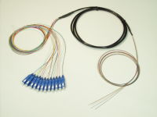
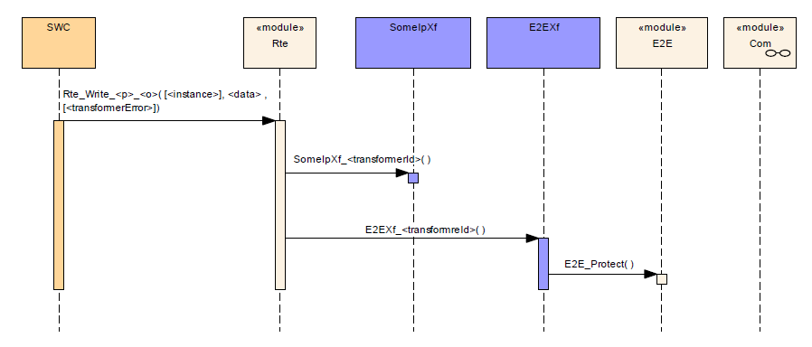
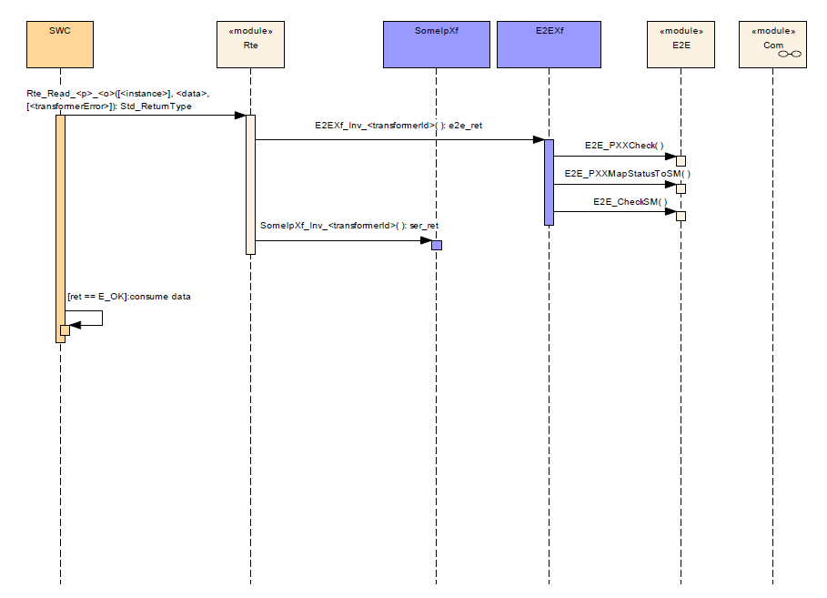

<section id="title">E2E Transformer (E2E转换器)</section>

# 1. 概述

本文介绍了AUTOSAR基本软件模块E2E Transformer的功能、API和配置。

根据SRS转换器通用标准，端到端（**E2E**）转换器属于“功能安全”（**Safety**）范畴。

E2E转换器保证通过QM通信栈I-signal也能正确的通信。通信堆栈被认为是“**black channel**”通信。

## 1.1. 一对一

数据元素（**data element**）和**I-signal**之间是一对一的关系，也就是说没有数据拆分/合并，即一个I-signal不会由多个数据元素组成的，一个数据元素也不会由多个I-signal组成的。

### 1.1.1. 发送端

一个数据元素（**data element**）精确地对应一个**I-signal**。

### 1.1.2. 接收端

一个或多个数据元素（**data element**）代表了整个接收到的**I-signal**（即接收端fan-out的场景）

## 1.2. 一对多

在接收端有一个扇出（**fan-out**）的**I-signal**到一个或多个数据元素。

### 1.2.1. 发送端

1. 一个数据元素（**data element**）序列化为一个**I-signal**，并使用一个端到端保护（**E2E protection**）进行保护。
2. 一个或多个**I-signal**放置在一个**I-PDU**中，每个**I-signal**有不同的端到端保护（**E2E protection**）。一些**I-signal**可能根本没有端到端保护。

### 1.2.2. 接收端

在接收端，一个**I-signal**可能:
1. 被检查一次，结果只有一个数据元素（即：没有扇出）
2. 被检查多次，具有相同的设置，但通过独立的函数（例如：通过与ASIL等级无关的SW-C接收器）。
3. 被检查多次，部分具有不同的设置（比如：相同的数据ID，但不同的计数器容错性）和不同的函数，最终导致每一个分开的数据元素可能有不同的E2E-check结果.
4. 被检查几次，启用或不启用端到端检查。（例如：如果一个接收端是功能安全相关的；另一个接收端是QM，所以并不需要端到端检查的结果）

E2E转换器负责根据特定数据元素（如：I-signal）的配置调用E2E库。

E2E转换器根据其配置，实例化端到端配置和端到端状态数据结构。所有的端到端配置文件都可以用来保护数据。

E2E转换器封装了端到端配置和处理的复杂性，并提供了标准的转换器接口。正因为这个原因，E2E转换器的调用方，不需要知道E2E内部结构。

E2E转换器被RTE调用，并且RTE调用是通过由软件组件调用RTE标志API（读、写、发送、接收）的结果。

# 2. 相关的文档

## 2.1. 输入文档

[1] AUTOSAR Layered Software Architecture
> AUTOSAR_EXP_LayeredSoftwareArchitecture.pdf

[2] AUTOSAR General Requirements on Basic Software Modules 
> AUTOSAR_SRS_BSWGeneral.pdf

[3] AUTOSAR General Specification for Basic Software Modules 
> AUTOSAR_SWS_BSWGeneral.pdf

[4] AUTOSAR Specification of SW-C End-to-End Communication Protection Library 
> AUTOSAR_SWS_E2ELibrary.pdf

[5] AUTOSAR Specification of RTE 
> AUTOSAR_SWS_RTE.pdf

[6] AUTOSAR Requirements on E2E 
> AUTOSAR_RS_E2E.pdf

[7] AUTOSAR E2E Protocol Specification 
> AUTOSAR_PRS_E2EProtocol.pdf

[8] System Template 
> AUTOSAR_TPS_SystemTemplate.pdf

[9] Specification of ECU Configuration 
> AUTOSAR_TPS_ECUConfiguration.pdf

[10] General Specification of Transformers 
> AUTOSAR_ASWS_TransformerGeneral.pdf

[11] AUTOSAR Glossary 
> AUTOSAR_TR_Glossary.pdf

[12] Software Component Template 
> AUTOSAR_TPS_SoftwareComponentTemplate.pdf

[13] SOME/IP Protocol Specification 
> AUTOSAR_PRS_SOMEIPProtocol.pdf

## 2.2. 相关的规范

AUTOSAR提供了转换器通用规范(AUTOSAR_ASWS_TransformerGeneral)[10]，它也适用于E2E转换器。

因此AUTOSAR_ASWS_TransformerGeneral[10]，应被视为E2E转换器的附加和必需的规格。

# 3. 对其他模块的依赖关系

E2E转换器依赖于E2E库。E2E库提供数据类型和无状态的函数。E2E转换器将配置和状态作为函数参数传递给E2E库例程，并执行E2E库。

# 4. 功能规范

E2E转换器负责保护与功能安全相关的数据元素。它由RTE调用。在发送端，E2E转换器通过E2E保护数据。在接收端，E2E转换器通过E2E检查数据，并通过RTE向SW-C提供E2E的检查结果。

如果接收端的SW-C不读取转换器的返回值，这对通信的SW-C来说都是完全透明的，无需关心数据在总线上是否受到E2E的保护。

所有算法都由E2E库提供，包括：保护（**protect**）、检查（**check**）、转发（**forward**）、状态机（**state machine**）。E2E转换器调用E2E库，提供配置和状态。

E2E转换器没有特定的ECU配置，因为它的整个配置是基于**E2ETransformationDescription**、**E2ETransformationISignalProps**和**E2ETransformationComSpecProps**的。因此参照AUTOSAR_ASWS_TransformerGeneral.pdf[10]文档的通用ECU配置就足够了。

具体的配置输入可在AUTOSAR_TPS_SystemTemplate.pdf[8]和AUTOSAR_TPS SoftwareComponentTemplate.pdf[12]中可以找到。

## 4.1. 支持的RTE接口

目前支持以下ECU间通信功能:
1. Rte_Write / Rte_Read
2. Rte_IWrite / Rte_IRead
3. Rte_Send / Rte_Receive
4. Rte_Call / Rte_Result

## 4.2. E2E保护的函数和数据的命名

E2E转换器函数和结构添加后缀<**transformerId**>。（<**transformerId**>为每个转换器函数定义一个唯一的ID）。

这个配置构建了转换器配置的三个阶段:
1. **EndToEndTransformationDescription**定义了E2E配置的Profile信息，对数个ISignal都有效。
2. **EndToEndTransformationISignalProps**定义了对特定引用的ISignal有效的配置选项。
3. **EndToEndTransformationComSpecProps**定义了属于ReceiverComSpec端口的覆盖配置选项。

软件组件（**SW-C**）可能有独立数接收从同一个**I-PDU**创建的数据元素的场景。如：
1. 一些软件组件有调整/特殊的配置值，与E2E状态机的容错性相关。例如：更大的容错性。为此，**EndToEndTransformationComSpecProps**的属性会被使用。
2. 一些QM软件组件可能不需要对数据进行E2E的检查，所以可以E2E的检查。为此,**EndToEndTransformationComSpecProps.disableEndToEndCheck**使用。

## 4.3. E2E保护

## 4.4. E2E检查

