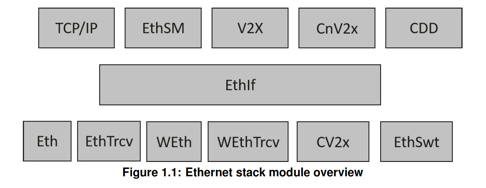
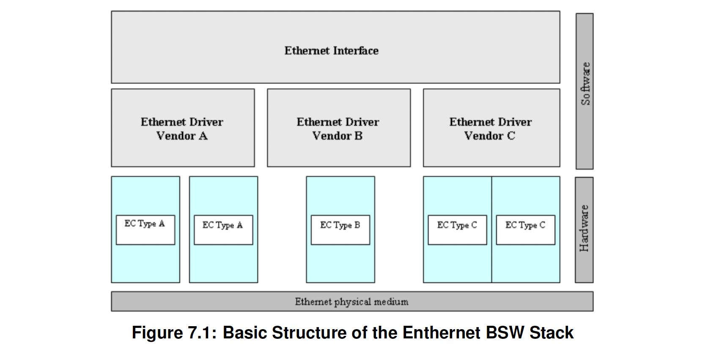
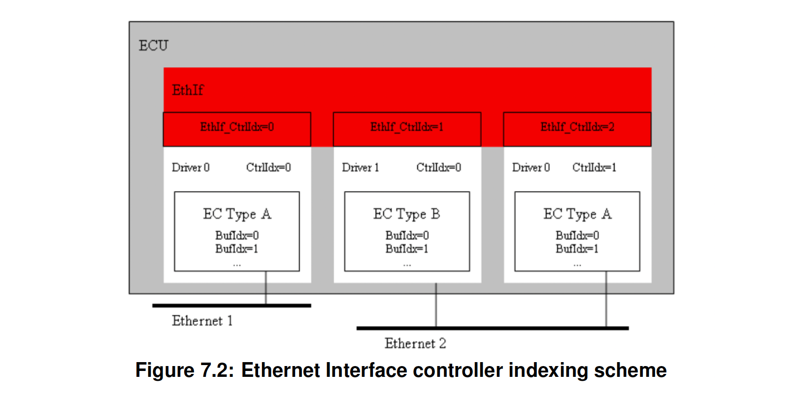

<section id="title">AUTOSAR Ethernet Interface（以太网接口）</section>

# 1. 简介和功能概述

此规范指定了 **AUTOSAR** 基本软件模块以太网接口的功能、API 和配置。

在AUTOSAR分层软件架构[1]中，以太网接口（EthIf）属于ECU抽象层。或者更准确地说，它属于通信硬件抽象。

这表示以太网接口的主要任务：

向上层提供以太网通信系统的硬件独立接口，包括多个不同的有线或无线以太网控制器和收发器。此接口对于所有以太网控制器和收发器以及蜂窝 V2X 控制器需被统一。因此上层模块（**TCP/IP** [2]、**EthSM** [3]、**CDD**、**V2x** 等模块）可以以统一的方式访问底层总线系统。

以太网接口不直接访问以太网硬件（包括：以太网通信控制器和以太网收发器），而是通过一个或多个特定于硬件的驱动程序模块。

为了访问以太网控制器（**Ethernet controller**），以太网接口需要使用一个或多个以太网驱动程序（**Ethernet Driver**）模块，并且这些模块需抽象出相应的以太网控制器的特定功能和接口。

为了访问以太网收发器（**Ethernet transceiver**），以太网接口需要使用一个或多个以太网收发器驱动程序（**Ethernet Transceiver Driver**）模块，并且这些模块需抽象出相应的以太网收发器的特定功能和接口。

为了访问以太网交换机（**Ethernet switch**），以太网接口需要使用一个或多个以太网交换机驱动程序（**Ethernet Switch Driver**）模块，并且这些模块抽象出相应以太网交换机的特定功能和接口。

因此，以太网接口的可执行代码（不包括：运行时使用的配置）需完全独立于以太网通信控制器（**Ethernet Communication Controller**）。

注意：因为以太网接口的指定方式允许代码模块的目标代码交付，遵循“一刀切”原则，即以太网接口的整个配置可以在不修改任何源代码的情况下进行。所以以太网接口的配置在很大程度上可以在不详细了解底层硬件的情况下进行。

# 2. 缩略语

**CBR**
> Channel Busy Ratio，通道繁忙比率。

**CIT** 
> Channel Idle Time，通道空闲时间。

**CV2x** 
> Cellular Vehicle to X driver，蜂窝车辆到X驱动程序。

**Eth** 
> Ethernet Controller Driver，以太网控制器驱动程序（AUTOSAR BSW 模块），

**EthIf** 
> Ethernet Interface， 以太网接口（AUTOSAR BSW 模块）。

**EthSM** 
> Ethernet State Manager，以太网状态管理器（AUTOSAR BSW 模块）。

**EthTrcv** 
> Ethernet Transceiver Driver，以太网收发器驱动程序（AUTOSAR BSW 模块）。

**IP** 
> Internet Protocol，网际协议。

**MCG** 
> Module Configuration Generator，模块配置生成器。

**MII** 
> Media Independent Interface，媒体独立接口（以太网控制器提供的用于访问以太网收发器的标准化接口）。

**RSSI** 
> Received Signal Strength Indicator，接收信号强度指示器。

**TCP** 
> Transmission Control Protocol，传输控制协议。

**TCP/IP Stack** 
> Ethernet communication stack，以太网通信栈。

**VLAN** 
> Virtual Local Area Network，虚拟局域网。

**WEth** 
> Wireless Ethernet Driver，无线以太网驱动程序。

**WEthTrcv** 
> Wireless Ethernet Transceiver Driver，无线以太网收发器驱动程序。

**OA TC10** 
> Open Alliance TC10，开放联盟 TC10 规格 [5]。

# 3. 相关文档

## 3.1. 输入文件

[1] Layered Software Architecture
> AUTOSAR_EXP_LayeredSoftwareArchitecture

[2] Specification of TCP/IP Stack
> AUTOSAR_SWS_TcpIp

[3] Specification of Ethernet State Manager
> AUTOSAR_SWS_EthernetStateManager

[4] Glossary
> AUTOSAR_TR_Glossary

[5] OPEN Sleep/Wake-up Specification for Automotive Ethernet
> http://www.opensig.org/Automotive-Ethernet-Specifications/

[6] General Specification of Basic Software Modules
> AUTOSAR_SWS_BSWGeneral

[7] Specification of Vehicle-2-X Geo Networking
> AUTOSAR_SWS_V2XGeoNetworking

[8] Specification of Chinese Vehicle-2-X Network
> AUTOSAR_SWS_ChineseV2XNetwork

[9] Specification of Chinese Vehicle-2-X Management
> AUTOSAR_SWS_ChineseV2XManagement

[10] Specification of Ethernet Driver
> AUTOSAR_SWS_EthernetDriver

[11] Specification of Ethernet Transceiver Driver
> AUTOSAR_SWS_EthernetTransceiverDriver

[12] General Requirements on Basic Software Modules
> AUTOSAR_SRS_BSWGeneral

[13] Requirements on Ethernet Support in AUTOSAR
> AUTOSAR_SRS_Ethernet

[14] Specification of Default Error Tracer
> AUTOSAR_SWS_DefaultErrorTracer

[15] Specification of Time Synchronization over Ethernet
> AUTOSAR_SWS_TimeSyncOverEthernet

[16] Specification of Wireless Ethernet Driver
> AUTOSAR_SWS_WirelessEthernetDriver

[17] Specification of Ethernet Switch Driver
> AUTOSAR_SWS_EthernetSwitchDriver

[18] Specification of Wireless Ethernet Transceiver Driver
> AUTOSAR_SWS_WirelessEthernetTransceiverDriver

[19] Specification of Cellular Vehicle-2-X Driver
> AUTOSAR_SWS_CellularV2XDriver

[20] IEEE Standard for Local and metropolitan area networks-Media Access Control (MAC) Security
> https://ieeexplore.ieee.org/document/8585421

## 3.2. 相关规格

**AUTOSAR** 提供了基本软件模块的一般规范[6，SWS BSW通用]，该规范也适用于以太网接口。

所以，SWS BSW 通用规范应被视为以太网接口的附加和必需规范。

# 4. 约束和假设

## 4.1. 局限性

以太网接口在概念上能够访问一个或多个以太网驱动程序和一个或多个以太网收发器驱动程序。

同时无法传输超过当前所用的以太网控制器的可用缓冲区大小的数据。更长的数据必须使用互联网协议（**IP**）或传输控制协议（**TCP**）进行传输。

## 4.2. 汽车领域的适用性

以太网BSW堆栈旨在用于需要高数据速率但不需要硬实时的场合。当然，它也可用于要求较低的用例，即：低数据速率。

# 5. 对其他模块的依赖关系

本章列出了与以太网接口模块交互的模块。

## 5.1. 使用以太网接口模块的模块：

* 以太网通信堆栈（TCP/IP Stack [2]）
* 以太网状态管理器（EthSM [3]）
* V2xGn [7]
* CnV2xNet [8]
* CnV2xM [9]

## 5.2. 对其他模块的依赖：

* 以太网接口模块不负责配置以太网驱动程序 [10]，但需要其前面的初始化和配置。
* 以太网接口模块不负责配置以太网收发器驱动程序 [11]，但需要其前面的初始化和配置。

# 6. 功能规范

## 6.1. 以太网 BSW 堆栈

作为 AUTOSAR 分层软件架构 [1] 的一部分，以太网 BSW 模块也形成了分层软件堆栈。图 7.1 描述了此以太网 BSW 堆栈的基本结构。以太网接口模块使用以太网驱动程序层访问多个以太网控制器，该层可由多个以太网驱动程序模块组成。

### 6.1.1. 以太网控制器的分度方案

如果用**CAN XL**作为物理介质，则配置需包含**EthIfEthCanXLCtrlRef**来替代**EthIfEthCtrlRef**，以及**EthIfCanXLTrcvRef**来替代**EthIfEthTrcvRef**在这种情况下，表示为**\<EthDrv\>_Xxx** 的 API 将会使用**CanXL_Xxx**被调用，而不是使用**Eth_Xxx**被调用。同样，表示为**\<EthTrcv\>_Yyy** 的 API 将会使用**CanXLTrcv_Yyy**被调用，而不是使用**EthTrcv_Yyy**比调用。

以太网接口的用户使用索引方案识别以太网控制器资源，如图 7.2 所示。

因为以太网接口使用索引（**EthIfCtrlIdx**），从以太网控制器和以太网收发器的底层通信系统中抽象出对 **VLAN** 的访问。所以以太网接口应实现从以太网接口控制器（**EthIfCtrlIdx**）到相应硬件资源控制器（**EthCtrlId** + **EthTrcvId**）的映射。

### 6.1.2. 以太网交换机的索引方案

由于**EthIf**不涉及属于单个以太网交换机的单个**EthSwtPorts**，所以**EthIf**中不需要**EthSwtPorts**的索引方案。任何与**EthSwtPorts**交互的BSW模块都可以直接引用**EthSwtPort**的ECU配置进行索引。

**EthIf** 应将 **EthIfSwitchIdx** 索引的所有访问分派到具有 **EthSwtIdx** 值的相应 **EthSwt** 驱动程序模块。

### 6.1.3. 以太网接口主函数

以太网接口需实现在轮询模式下用于帧传输确认和帧接收的主函数，并且主函数的调用周期可在系统配置时进行配置。

### 6.1.4. 需求

本章节列出了以太网接口模块需实现的需求。

以太网接口模块环境，包括了调用以太网接口模块接口的所有模块。

以太网接口模块应支持预编译时、链接时意见构建后（**Post-Build**）的配置。

头文件 EthIf.h 应包含软件和规范版本号。

以太网接口模块应根据相关代码文件和头文件的版本号的预处理检查，在代码文件和头文件之间执行一致性检查。

如果为以太网接口模块启用了开发错误检测：以太网接口模块应检查 **API** 参数有效性，并向 **DET** 模块报告检测到的错误。**DET API** 函数在 [参考文献 14 - 默认错误跟踪器规范] 中定义。

以太网接口模块应将以太网接口 SWS 指定的 API 函数实现为实际 C 代码函数，不得将 **API** 实现为以宏的方式进行目标代码交付。

任何以太网接口模块头文件都不应定义全局变量。

### 6.1.5. 配置说明

以太网接口模块应提供包含软件标识（应包含供应商标识、模块 ID 和软件版本信息）、配置和集成过程所需的数据的 **XML** 文件。此文件应描述供应商特定的配置参数，并应包含建议的配置参数值。

**MCG** 应读取以太网驱动程序和以太网接口模块的 **ECU** 配置说明。虽然与群集相关的配置参数包含在以太网接口模块配置说明中，但与以太网驱动程序相关的配置数据需包含在以太网驱动程序模块配置说明中。以太网接口模块特定配置工具需读取这两个 **ECU** 模块说明，以派生映射到以太网接口模块的所有以太网驱动程序的配置数据。

**MCG** 应确保生成的配置数据的一致性。

以太网接口模块的配置应在ECU配置时进行配置。运行时不得配置任何通信参数。

构建后配置数据的起始地址应在模块初始化期间传递。这些配置类分配给配置参数可以在第10章中找到。所有以太网接口相关配置参数的详细说明可在本文档的第 10 章中找到。此外，应针对以太网接口模块配置评估以太网驱动程序的配置说明。

### 6.1.6. 虚拟局域网（VLAN）支持

以太网接口应支持虚拟局域网（**VLAN**）。

以太网接口应将虚拟局域网（**VLAN**）封装到代表专用 **VLAN** 的虚拟控制器（以太网接口控制器）中。以太网接口上方的所有 **BSW** 模块都应基于这些虚拟控制器进行交互。以太网驱动程序和收发器仅处理实际控制器，并不知道虚拟控制器的存在。

警告：如果未设置 **VLAN ID**，则虚拟控制器表示未标记的 **VLAN**。

以太网接口应使用以太网驱动程序提供的缓冲区来支持 **VLAN**。如果使用**Can XL**，以太网接口应使用**Can XL**驱动程序提供的缓冲区。

### 6.1.7. 唤醒支持

以太网接口支持唤醒，具体取决于参数 **EthIfWakeUpSupport**。

注意：只有在底层 **EthTrcv** 支持也唤醒时，在 **EthIf** 中启用唤醒支持才有意义。

