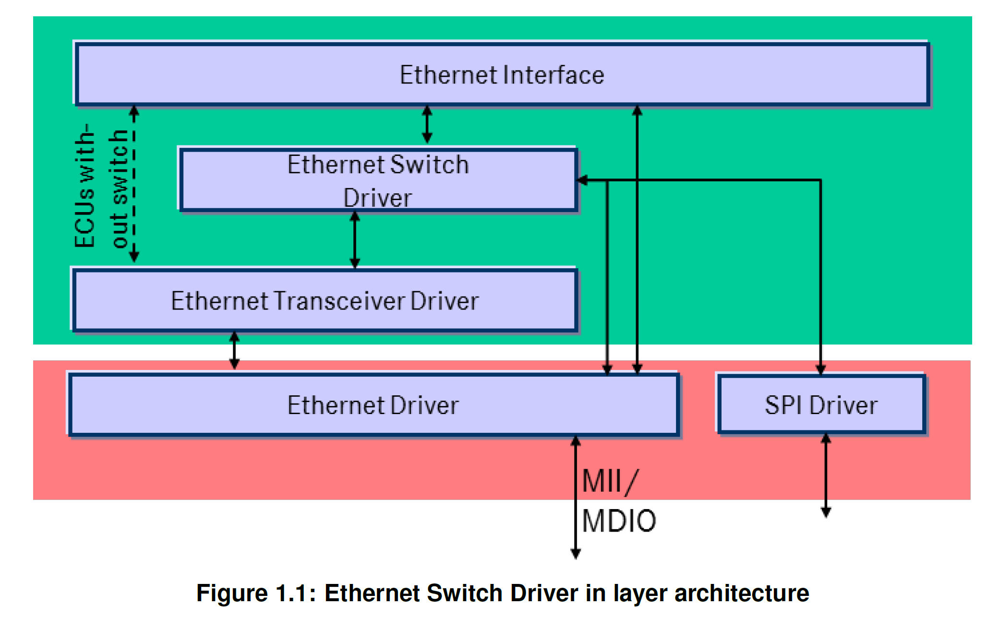

<section id="title">AUTOSAR Ethernet Switch Driver（以太网交换机驱动程序）</section>

# 介绍和功能概述

在 **AUTOSAR** 分层软件架构（**AUTOSAR Layered Software Architecture**）[1] 中，以太网交换机驱动程序属于通信硬件抽象。

这表明以太网交换机驱动程序的主要任务：

为如以太网接口（**Ethernet Interface**）[2] 的上层模块提供一个硬件独立接口，包括了一个带有多个端口的交换机。并且此接口对于所有以太网交换机都应该是统一的。因此上层可以通过统一的方式来访问底层通信技术。

单个以太网交换机驱动程序模块仅支持一种类型的交换机硬件。以太网物理层端口由以太网收发器驱动程序（**Ethernet Transceiver Driver**）[3] 配置。使用太网交换机驱动程序的前缀生成一个唯一的命名空间。以太网接口可以通过此前缀使用不同的以太网交换机驱动程序，来访问不同类型的以太网控制器。决定使用哪个驱动程序来访问特定收发器的是通过以太网接口的配置参数实现。

下图 1.1 描绘了以太网堆栈的底层结构。 通过 **SPI** 和 **MII/MDIO** 的硬件接口访问交换机特定配置或功能，是直接通过以太网驱动程序（**Ethernet Driver**）[4] 或 SPI 驱动程序（**SPI driver**）[5] 完成。

