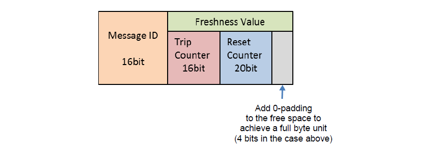

<section id="title">AUTOSAR FVM (Freshness Value Manager)</section>

# 1. 概述

新鲜度值（**freshness value**）可以通过**SW-C**或**CDD**的方式提供给**SecOC**模块。SecOC规范提供为了传输或接收受保护的I-PDU的获取新鲜度值所需的接口，以及发送传输或接收信息失败或成功的所需接口。其实有多种种方法可以跨ECU的构造和同步新鲜度值。

# 2. 基于单个新鲜度计数器的新鲜度值

软件组件新鲜度值管理器FVM（**Freshness Value Manager**）应向**SecOC**提供新鲜度值FV（**Freshness Value**）。新鲜度值的构造基于新鲜度计数器（**Freshness Counter**），通过单个消息计数器（**Message Counter**）实现。FVM应为每个配置的新鲜度值ID（参数：**SecOCFreshnessValueId**和**SecOCSecondaryFreshnessValueId**）提供一个新鲜度计数器。

## 2.1. 构建

当使用新鲜度计数器而不是时间戳时，在向接收端**SecOC提**供认证信息之前新鲜度计数器需要递增。为了保证新鲜度，通信通道（**communication channel**）两边的新鲜度计数器应同步增加。对于每条传出消息，新鲜度计数器必须递增，以便于在接收端被识别为独立的传入消息。在接收端，包括计数器更新在内，每一个接收到的消息的MAC验证必须恰好执行一次。

只有在**SecOC**通过调用PduR进行进一步路由，开始传输受保护的I-PDU（ **Secured I-PDU**）时，FVM才应将**SecOCFreshnessValueID**对应的新鲜度计数器增加1（**CNT ++**）。

如果之前受保护I-PDU的传输已经取消了，FVM不应该增加**SecOCFreshnessValueID**对应的新鲜度计数器。

**注意：**
当使用新鲜度计数器作为新鲜度值时，FVM可能允许使用第二次新鲜度值。

## 2.2. I-PDU的验证

**FVM**模块应构建新鲜度验证值（**Freshness Verify Value**）并提供给**SecOC**模块。当完整的新鲜度值（**Freshness Value**）在受保护的I-PDU已经被传输后，需要验证构造的**FreshnessVerifyValue**是否大于最后一个存储的新鲜度值（**Freshness Value**）。如果不大于最后存储的新鲜度值，FVM将停止验证并丢弃受保护的I-PDU。

验证计数器的构造定义如下面的伪代码所示。

```C
If (SecOCFreshnessValueTruncLength = FreshnessValueLength)
{
    FreshnessVerifyValue = FreshnessValue parsed from Secured I-PDU;
}
Else
{
    If (FreshnessValue parsed from Secured I-PDU > least significant bits  of FreshnessValue corresponding to SecOCFreshnessValueID)
    {
        Attempts = 0;
        FreshnessVerifyValue = most significant bits of FreshnessValue corresponding to SecOCFreshnessValueID | FreshnessValue parsed from Secured I-PDU;
    }
    Else
    {
        Attempts = 0;
        FreshnessVerifyValue = most significant bits of FreshnessValue corresponding to SecOCFreshnessValueID + 1 | FreshnessValue parsed from payload;
    }
}
```

# 3. 基于单个时间戳的新鲜度值

软件组件新鲜度值管理器FVM（**Freshness Value Manager**）应向**SecOC**提供新鲜度值FV（**Freshness Value**）。新鲜度值的构造主要基于时间戳（**Timestamps**）来实现新鲜度计数器（**Freshness Counters**）。

## 3.1. 全局时间值的来源

全局同步的时间可以作为新鲜度时间戳的基础。在发送方和所有接收方，全局同步时间具有相同的值。因此它的值可以用作新鲜度值。其优点是它不需要在受保护的**PDU**内传输，也不需要为每个发送方和接收方分别传输。

## 3.2. 全局时间值的分辨率和精度

FVM必须考虑所使用的全局时间值的分辨率和精度。

**注意：**
当新鲜度时间戳被用作FV时，FVM可以使用验收窗口机制（**Acceptance Window Mechanism**）。

## 3.3. I-PDU验证

SecOC模块应构建新鲜度验证值（**Freshness Verify Value**）并提供给SecOC模块。在完全传递新鲜度值的情况下，需要验证构造的**FreshnessVerifyValue****是否在SecOCRxAcceptanceWindow**定义的接受窗口内。若未在该窗口中，则**SecOC**模块停止验证，并丢弃已保护的I-PDU。

构造身份验证验证值的定义如下面的伪代码所示。

```C
If (SecOCFreshnessValueTruncLength = FreshnessValueLength)
{
    FreshnessVerifyValue = FreshnessValue parsed from Secured I-PDU;
}
Else
{
    If ((most significant bits of FreshnessValue corresponding to SecOCFreshnessValueID | FreshnessValue parsed from Secured I-PDU) < (max(0: (most significant bits of FreshnessValue corresponding to SecOCFreshnessValueID | least significant bits of FreshnessValue corresponding to SecOCFreshnessValueID) – SecOCRxAcceptanceWindow)))
    {
        Attempts = 0;
        FreshnessVerifyBaseValue = most significant bits of FreshnessValue corresponding to SecOCFreshnessValueID + 1;
    }
    Else
    {
        Attempts = 0;
        FreshnessVerifyBaseValue = most significant bits of FreshnessValue corresponding toSecOCFreshnessValueID;
    }
    FreshnessVerifyValue = FreshnessVerifyUpperValue = FreshnessVerifyLowerValue = FreshnessVerifyBaseValue | FreshnessValue parsed from Secured I-PDU;
}
```

# 4. 基于多个新鲜度计数器的新鲜度值（截断的）

从解耦计数器构造新鲜度值。新鲜度值管理器（**FVM**）向**SecOC**提供新鲜度值（**FV**）。**FVM**在保证更新值截断的前提下，支持FV的主从同步机制（**a master-slave synchronization mechanism**）。

FVM需要具有主从同步通信功能。

## 4.1. 单个新鲜度值管理主方法（Single FV management master method）

在此配置下，系统只有一个FV管理主ECU。单个新鲜度值管理主方法的系统配置和实体列表如下所示。下图中显示了FV管理主ECU（**发送**）和从ECU（**接收**）之间的关系。


### 4.1.1. Sender ECU（Sender）
发送受保护的I-PDU到接收ECU。从FV管理主ECU接收同步消息（**TripResetSyncMsg**），并构造发送受保护的I-PDU所需的新鲜度值。

### 4.1.2. Receiver ECU（Receiver）

接收受保护的I-PDU。从FV管理主ECU接收同步消息(**TripResetSyncMsg**)，并构造所需的新鲜值来验证收到受保护的I-PDU。

### 4.1.3. FV management master ECU（FvMaster）

将同步消息（**TripResetSyncMsg**）发送给所有发送方和接收方ECU。

## 4.2. 多个新鲜度值管理主方法（Multi FV management master method）

在此配置中，系统有多个和发送端ECU相同数量的FV管理主ECU。这意味着发送方ECU同时作为FV管理主实体ECU，用于发送方ECU管理的受保护的I-PDU。多个新鲜度值管理主方法的系统配置和实体列表如下所示。


### 4.2.1. Sender ECU and FV management master ECU (Sender&FvMaster)

发送受保护的I-PDU到接收ECU。发送同步消息（**TripResetSyncMsg**）到接收ECU。|

### 4.2.2. Receiver ECU (Receiver)

接收受保护的I-PDU。接收同步消息（**TripResetSyncMsg**）。|

**注意：**
接收端ECU从发送端ECU接收到同步消息，发送端ECU向接收端发送受保护的I-PDU。如果它收到来自多个发送方ECU的消息，那么它就会收到来自多个发送方ECU的同步消息。

## 4.3. 新鲜度值结构

软件组件FVM为SecOC提供FV，该FV由以下结构中的独立计数器构成:


新鲜度长度（SecOCFreshnessValueLength）不能超过64位，所以三个计数器（**Trip Counter**, **Reset Counter**, **Message Counter**）和**Reset flag**的长度必须分别采用，以匹配这一要求。即它们的总长度不超过64位。

### 4.3.1. Trip Counter (TripCnt)

这个计数器是由FV管理主ECU的行程单位增加的。

在单FV管理主方法中，FV管理主ECU发送一个新的TripCnt作为同步消息（**TripResetSyncMsg**）给发送方ECU和接收方ECU。所有的发送端和接收端ECU都保持这个值。

在多FV管理主方法中，发送端ECU向接收端ECU发送一个新的TripCnt作为同步消息。接收机ECU保持这个值。

### 4.3.2. Reset counter (ResetCnt)

该计数器由FV管理主ECU按**ResetCycle**配置的周期周期性增加。

在单FV管理主方法中，FV管理主ECU发送一个新的ResetCnt作为同步消息（**TripResetSyncMsg**）给发送端ECU和接收端ECU。所有的发送方和接收方ECU都保持这个值。

在多FV管理主方法中，发送端ECU向接收端ECU发送一个新的ResetCnt作为同步消息。接收器ECU保持这个值。

### 4.3.3. Message counter (MsgCnt)

此计数器随发送方ECU每次发送消息而增加。它由发送方ECU对每个安全消息进行管理。

“**MsgCntLower**”是指消息计数器传输的截断新鲜度值的范围（在**SecOCFreshnessValueTxLength**内）。

“**MsgCntUpper**”是指消息计数器传输的截断新鲜度值（**SecOCFreshnessValueTxLength之外**）中不包含的范围。

### 4.3.4. Reset Flag (ResetFlag)

此标志与重置计数器（**reset counter**）同步更新。它是来自重置计数器最低的ResetFlagLength(bit)的数值。

## 4.4. 新鲜度值计数器的构造规范


如图显示了一个例子，其中**ResetFlagLength**是2位，**MsgCntLower**是2位。

### 4.4.1. Trip counter (TripCnt)

对于主ECU（**Master ECU**）：Trip counter需初始化为1
对于从ECU（**Slave ECU**）: Trip counter需初始化为0

在以下情况下，Trip counter需要递增加1
* 当FV管理主ECU启动时
* 唤醒时（**On wakeup**）
* 重置时（**On reset**）
* 当电源状态改变时：**IG-OFF**⇒**IG-ON**

当**Trip counter**达到的最大值值，**Trip counter**需重新初始化为初始值。

长度由**TripCntLength**定义，最多24bit位。

### 4.4.2. Reset counter (ResetCnt)

对于主ECU（**Master ECU**）：Reset counter需初始化为1
对于从ECU（**Slave ECU**）: Reset counter需初始化为0

以固定时间间隔(ResetCycle)，Reset counter需要递增加1。

当**Trip counter**递增或初始化时，Reset counter需重新初始化为初始值。

长度由**ResetCntLength**定义，最多24bit位。

### 4.4.3. Message counter (MsgCnt)

对于从ECU（**Slave ECU**）: Message counter需初始化为0

每次消息传输后，Message counter需要递增加1。

当**Reset counter**递增或初始化时，Message counter需重新初始化为初始值。

长度由**MsgCntLength**定义，最多48bit位。

### 4.4.4. Reset Flag (ResetFlag)

通过从**Reset counter**中截取的最低几位的数值运算生成。

长度由**ResetFlagLength**定义，最多2bit位。

## 4.5. 重放攻击（Replay Attack）

为了防止重放之类的攻击（**replay attack**），在设计计数器值时要小心，确保它的最大值永远不会达到。

如果构成新鲜度值的每个计数器都达到最大值，则采取以下步骤。此外，从ECU通知上游模块消息计数器已达到最大值。

### 4.5.1. FV管理主ECU（FV management master ECU）

#### 4.5.1.1. 当Trip counter达到最大值

当**Trip counter**的增量条件遇到最大值时，**Trip counter**和**Reset counter**返回到它们的初始值。即使在**Trip counter**返回到初始值之后，同步消息也会被发送。

#### 4.5.1.2. 当Reset counter达到最大值
当**Reset counter**的增量条件遇到最大值时，**Reset counter**固定为最大值。即使是在**Reset counter**的最大值时，也会发送同步消息。尽管FV仍然溢出，通知到上层应用程序或诊断系统，但仍有一些用例需要在有限的情况下继续与其他ECU通信。

为了与从ECU（**Slave ECU**）同步，FV Master将计数器的值固定在上限，等待从ECU侧（**Slave ECU**）的重新同步，因此主ECU（Master ECU）周期性的尝试发送带有固定**RstCnt**的**TripResetSyncMsg**，直到重新同步成功。

### 4.5.2. 从ECU（Slave ECU）

#### 4.5.2.1. 当Trip counter达到最大值
如果以下的条件1和条件2都满足，则接收同步消息并执行验证者验证。如果验证结果为OK，则用收到的**Trip counter**和**Reset counter**的值来更新**Trip counter**和**Reset counter**的最新值。此外，每个计数器以前发送的值和以前接收的值将返回到初始值。

**条件1：**
“Maximum value of the trip counter” – “ClearAcceptanceWindow” ≤ “Latest value of the trip counter maintained by the slave ECU” ≤ “Maximum value of the trip counter” 

**条件2:**
“Initial value of the trip counter” ≤ “Trip counter value in the synchronization message” ≤ “Initial value of the trip counter” + “ClearAcceptanceWindow”

考虑到FV管理主ECU和从ECU的**Trip counter**在最大值附近彼此偏离的情况，所以提供一个允许的范围（**ClearAcceptanceWindow**）。条件2中**Trip counter**的初始值为FV管理主ECU的初始值。

#### 4.5.2.2. 当Reset counter达到最大值

发送方ECU通过将**Message counter**固定为最大值来生成验证器。
接收方ECU通过将**Message counter**覆盖为最大值来验证验证器。

#### 4.5.2.3. 当Message counter达到最大值

发送方ECU通过将**Message counter**固定为最大值来生成验证器。
接收方ECU通过将**Message counter**覆盖为最大值来验证验证器。

## 4.6. 同步消息格式

FV管理主ECU和从ECU分别处理如下格式的同步消息。

用于同步行程计数器（**Trip counter**）和复位计数器（**Reset counter**）的消息是从FV管理主ECU发送到从ECU的。对行程计数器和复位计数器同步建议使用同一条消息。


## 4.7. FV管理主ECU处理方式

### 4.7.1. 初始化

FV管理主ECU在ECU启动、唤醒或复位时需进行如下处理：
1. 获取保存在非易失存储器（**nonvolatile memory**）中的行程计数器（**trip counter**）值。如果是为第一次启动，则将行程计数器设置初始值。
2. 设置复位计数器（**reset counter**）为初始值。

当不能从非易失性内存中读取行程计数器值时，任何failsafe值都可以用作行程计数器和重置计数器，直到下次行程计数器更新。

当行程计数器增加时，FV管理主ECU将增加的值存储到非易失性内存中。最好将行程计数器存储在安全闪存中，以防止恶意操作，可使用RAM缓冲。但是无需实现将failsafe存储到非易失性存储器中。

**注意：**
即使行程计数器从最大值变为初始值，它也被视为一个增量，并存储在非易失性内存中。

### 4.7.2. 发送同步消息

FV管理主ECU周期性的（每个**ResetCycle**）将其管理的行程计数器和复位计数器发送给从ECU。但是，如果在启动时它们就可以被发送，则消息会立即被发送。


## 4.8. 从ECU（**Slave ECU**）处理

### 4.8.1. 初始化

从ECU（**Slave ECU**）在启动、唤醒或复位时进行如下处理：
1. 从非易失性内存中获取保存的行程计数器值，并将其设置为最新值。如果是为第一次启动，或无法从非易失性内存中读取时，则将行程计数器设置初始值。
2. 将复位计数器的最新值设置为初始值。
3. 将上一次发送的值和上一次接收的值都设置为初始值。

**注意：**
行程计数器的最新值已保存在非易失性内存中。易失性存储器中最新的和上一次的行程值都基于非易失性存储器中的行程计数器进行初始化。在这里，上一次的行程值是指发送方ECU之前发送的值，或者接收方ECU之前接收的值。

### 4.8.2. 同步消息的接收



收到同步消息后，从ECU（**Slave ECU**）执行以下步骤完成同步。
1. **SecOC**模块从**FVM**模块中获取新鲜度值进行验证。**FVM**比较新鲜度值，构造用于校验的新鲜度值，因为它假设同步消息（**TripResetSyncMsg**）中的行程计数器值和复位计数器值是全长度发送和接收的。
2. **SecOC**构造认证数据，由<消息ID | 新鲜度值>组成。
3. **SecOC**对验证器（authenticator ）进行验证，并将验证结果通知**FVM**。如果验证结果为OK，则**FVM**将接收到的行程计数器值和复位计数器值更新为最新值。**SecOC**还通知应用程序收到的行程计数器值和复位计数器值。
4. 如果验证失败(NG)，则不进行再次验证，而是通知应用程序，丢弃接收到的消息。

**注意:**
当行程计数器增加时，应用程序将增加的值存储到非易失性内存中。最好安全地存储该值。但是，无需实现存储failsafe值到非易失性存储器中。即使行程计数器从最大值变为初始值，它也被视为一个增量，并存储在非易失性内存中。

### 发送的新鲜度值的构建

当SecOC请求获取传输的新鲜度值时，FVM根据下表构造传输的新鲜度值。


当SecOC发送发送开始通知时，FVM将为传输构造的新鲜度值（Trip counter、Reset counter、Message counter）保持为之前发送的值。

### 接受的新鲜度值的构建

当SecOC请求获取待验证的新鲜度值时，FVM根据以下三个结果，按照表9构造待验证的新鲜度值。
1. 复位标志比较（**Reset flag comparison**）。
2. 行程计数器和复位计数器的比较。
3. 消息计数器低端（**lower end**）比较。

| Construction Format | Condition | Construction of freshness value for verification |
| ------------------- | --------- | ------------------------------------------------ | 
(1) Reset flag comparison
(2) Trip counter | reset counter comparison
(3) Message counter
(lower end) comparison (*3) Trip Counter Reset Counter Message Counter (Upper) (*1) Message Counter (Lower) (*2)
Format 1
Latest value =
Latest value =
Previously received value <
Previously
Previously
Previously
Received


# 5. 基于多个新鲜度计数器的新鲜度值（完整的）


<section id="wechat">

<h4>微信扫一扫，获取更多及时资讯</h4>


</section>