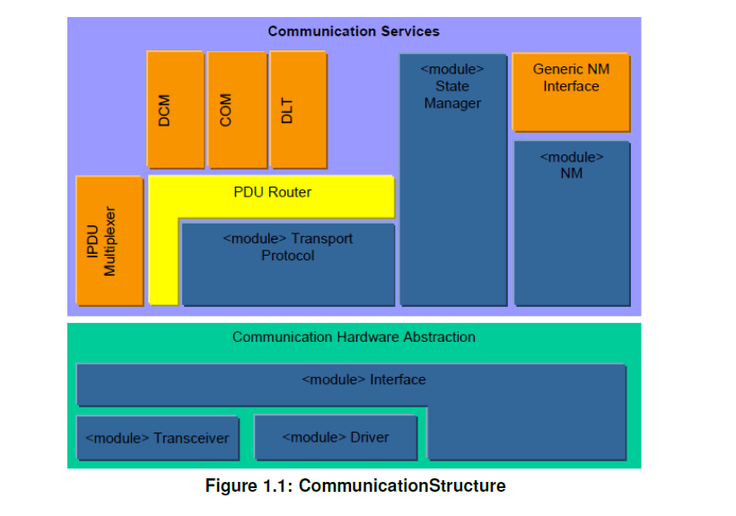
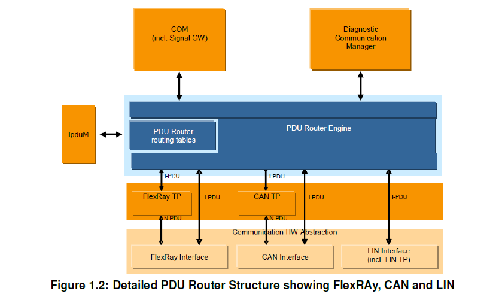
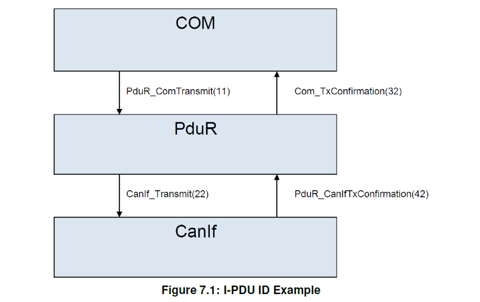

<section id="title">AUTOSAR PduR (PDU Router)</section>

# 1. 简介和功能概述

本文介绍了**AUTOSAR PDU 路由器模块** (**PduR**) 模块的功能和**API**。

**PDU**路由器模块（PDU Router）使用以下模块为**I-PDU**交互层协议数据单元（**Interaction Layer Protocol Data Units**）提供路由服务：

* 通信接口模块（**Communication interface modules**）：使用 \<Provider:Up\> 或 \<Provider:Lo\> API。例如：**Com**、**IPduM**、**LinIf**、**CanIf**、**CanNm**、**FrIf**和**FrNm**等模块。
* 传输协议模块（**Transport Protocol modules**）：使用 \<Provider:UpTp\> 或 \<Provider:LoTp\> API.例如：**J1939Tp**、**LinTp**、**CanTp**、**FrTp**、**Com**和**Dcm**等模块。

**I-PDU**路由的执行是基于静态定义的**I-PDU**标识符。不支持在运行时I-PDU的动态路由。例如：依据I-PDU的有效载荷。

相关联的模块可以是向上的（**upper**），例如：**Dlt**、**Dcm**、**Com**和**IpduM**等，也可以是向下的（**lower**），如：**CanIf**、**FrIf**、**LinTp**、**IpduM**、**CanNm**、**FrNm**等。

**注意：** 
因为**IpduM**有两个不同的角色，所以它既被归为上层模块，也可属于下层模块，例如：作为下层模块，**Com**模块和**IpduM**模块之间的通信；作为上层模块：**IpduM**模块和下层通信接口模块（**communication interface module**）之间的通信。

**PDU**路由器模块使用了基于接口模块的通用方法。相连接的模块是在**PDU**路由器模块配置中进行配置。前面段落中列出的模块只是一个示例，并非详尽的列表。**PDU**路由器可以通过轻松配置，以支持其他上层和下层模块。这种方法还允许将CDD复杂设备驱动程序 (**Complex Device Driver**) 集成为**PDU**路由器的上层或下层模块。

PDU路由器模块的用户列表并不固定。下面列出了最常见的上层和下层对组合：

* 诊断通信管理器 (**Dcm**) 和传输协议模块（**Transport Protocol modules**）。
* **Com**和通信接口模块（**Communication Interface modules**）、传输协议模块（**Transport Protocol modules**）或者**I-PDU**多路复用器（**I-PDU Multiplexer**）
* I-PDU多路复用器（**I-PDU Multiplexer**）和通信接口模块（**Communication Interface modules**）。

## 1.1. AUTOSAR 架构

PDU路由器模块是**AUTOSAR**通信结构[1]中的核心模块。图**1.1**概述了**AUTOSAR**通信结构。

## 1.2. PDU路由器模块功能概述

PDU路由器模块是AUTOSAR基础软件（**BSW**）的一部分，并且在每个**AUTOSAR ECU**中必须被实例化。

详细的PDU路由器模块结构如图**1.2**所示。

PDU Router模块主要由两部分组成：

**PDU路由器路由路径：**

描述每个需被路由的**I-PDU**的路由属性的静态路由路径。

路由路径可以（如果支持）更新:

* 可在ECU 的编程状态下**Post-build**加载。
* 在初始化PDU路由器时，通过**Post-build**进行Variant的选择。

**PDU路由器引擎：**

根据**PDU**路由器路由路径执行路由操作的实际代码。

PDU 路由器引擎必须处理：
* 将**I-PDU**从源路由到目的地。
* 将源**I-PDU ID**转换为目标**I-PDU ID**。例如：**PduR_Com Transmit**到**CanIf_Transmit**，**PduR_CanIfTxConfirmation**到**ComTxConfirmation**。

## 1.3. I-PDU处理

**I-PDU**通过静态的**I-PDU ID**标识。PDU路由器模块通过使用静态配置表中的**I-PDU ID**来确定**I-PDU**的目的地。**I-PDU**可用于与**PDU**路由器模块上方的模块进行直接的数据交换，例如：**Com**模块和**Dcm**模块。PDU路由器模块的路由操作不会修改**I-PDU**的内容，它只是将**I-PDU**转发到目的地的模块。在**TP**网关的情况下，可以在接收到完整的**I-PDU**之前，将**I-PDU**开始转发到目的地，，也被称作为实时网关（**on-the-fly gatewaying**）功能。

在配置中设置**I-PDU ID**同样用于实现的**API**中。这将允许在每个接收**I-PDU ID**的模块中，有效地实现查找表（**look-up tables**）功能。例如：PDU路由器模块的配置包含PduR_CanIfTxConfirmation的**I-PDU ID**，而**CanIf**模块的配置包含**CanIf_Transmit**的**I-PDU ID**。

以下列表总结了**PduR**的路由功能：

1. I-PDU转发（**I-PDU Forwarding**）
   1. 上层发送（**Transmission from upper layer**）
      1. 通讯接口（**Communication Interface**）
        * 单播 (1:1)：一个**I-PDU**从一个本地模块到一个通信接口模块。
        * 组播 (1:n)：一个**I-PDU**从一个本地模块到多个通信接口模块。
      2. 传输协议（**Transport Protocol**）
        * 单播 (1:1)：一个**I-PDU**从一个本地模块到一个传输协议模块（单帧和多帧）。
        * 组播 (1:n)：一个**I-PDU**从一个本地模块到多个传输协议模块（单帧和多帧）。
   2. 上层接收（**Reception to upper layer**）
      1. 通讯接口（**Communication Interface**）
        * 单播 (1:1)：一个**I-PDU**从一个通信接口模块到一个本地模块。
        * 组播 (1:n)：一个**I-PDU**从一个通信接口模块到多个本地模块。
        * 扇入 (n:1)：一个**I-PDU**从多个通信接口模块到一个本地模块。
      2. 传输协议（**Transport Protocol**）
        * 单播 (1:1)：一个**I-PDU**从一个传输协议模块到一个本地模块（单帧和多帧）。
        * 组播 (1:n)：一个**I-PDU**从一个传输协议模块到多个本地模块（单帧和多帧）。
2. I-PDU网关（I-PDU Gatewaying）
   1. 通讯接口（**Communication Interface**）
      * 网关 (1:1)：一个**I-PDU**从一个通信接口模块到一个使用last-is-best/FIFO/无缓冲区的通信接口模块。
      * 网关 (1:n)：一个**I-PDU**从一个通信接口模块到多个使用last-is-best/FIFO/无缓冲区的通信接口模块。
      * 网关 (n:1)：一个**I-PDU**从多个通信接口模块到一个使用last-is-best/FIFO/无缓冲区的通信接口模块，但一次只能启用一个源。
   2. 传输协议（**Transport Protocol**）
      * 网关 (1:1)：一个**I-PDU**从一个传输协议模块到一个使用缓冲区的传输协议模块。
      * 网关 (1:n)：一个**I-PDU**从一个传输协议模块到多个使用缓冲区的传输协议模块。
      * 网关 (n:1)：一个**I-PDU**从多个传输协议模块到一个使用缓冲区的传输协议模块，但一次只能启用一个源。
3. 组合**I-PDU**网关和**I-PDU**转发
   1. 通讯接口（**Communication Interface**）
      * 一个**I-PDU**可以被一个或多个上层模块接收，同时通过网关连接到一个或多个使用last-is-best/FIFO/无缓冲区的通信接口。 
   2. 传输协议（**Transport Protocol**）
      * 一个**I-PDU**（仅支持单帧）可以被一个或多个上层模块接收，同时通过网关连接到一个或多个使用缓冲区的传输协议模块。 

# 2. 缩略语

## 2.1. 术语

**上层模块(Up)（Upper Layer Modules）**
> PDU路由器模块的上方模块。该层通常包括**Com**和诊断通信管理器 (**Dcm**)。

**下层模块(Lo)（Lower Layer Modules）**
> PDU路由器模块的下方模块。该层可能包括**CAN**、**LIN**、**FlexRay**、以太网通信接口模块和相应的**TP**模块。

**PDU路由器（PDU Router）**
> 将**I-PDU**从一个模块传输到另一个模块的模块。PDU路由器模块可用于网关操作和内部路由目的。

**即时网关（on-the-fly gatewaying）**
> 网关的能力。两个TP 模块之间的路由，其中在接收到所有数据之前（达到指定阈值时）开始转发数据。如果在两个接口之间传输大量数据，则希望能够在从源网络接收所有数据之前在目标网络上开始传输。这样可以节省内存和时间。

**多播操作（multicast operation）**
> 将PDU同时传输到一组接收者，即：1:n路由。

**数据提供（data provision）**
> 向接口模块提供数据。(a)直接数据提供：需传输的数据直接在传输请求时提供。目标通信接口可能以两种方式运行：直接复制数据或将复制推迟到触发传输。(b)触发传输数据提供：需传输的数据不是在传输请求时提供，而是由通信接口模块通过回调函数获取。

**最后最好（last-is-best——缓冲**
> 最新值覆盖最后一个值的缓冲策略。

**先进先出（FIFO）缓冲**
> 缓冲区概念，采用先进先出策略。

## 2.2. 缩写

**I-PDU ID**
> **I-PDU**标识符

**I-PDU**
> 交互层**PDU**。 一个**I-PDU**由数据（缓冲区）、长度和**I-PDU ID**组成。PDU路由器将主要I-PDU进行路由，但即时网关（**on-the-fly gatewaying**）除外。

**N-PDU** 
> 网络层**PDU**。由传输协议模块用来对**I-PDU**进行分段。

**L-PDU** 
> 数据链路层 PDU。 一个或多个 I-PDU 被打包到一个 L-PDU 中。 L-PDU 是特定于总线的，例如 CAN 帧。

**SF** 
> 单帧，传输协议术语。

**FF** 
> 第一帧，传输协议术语。

**CF** 
> 连续帧，传输协议术语。

**PDU** 
> 协议数据单元.

**BSW** 
> 基础软件.

**\<SrcLo\>** 
> 下层通信接口模块，作为**I-PDU**的来源。**SrcLo**始终只有一个。

\<DstLo\> 
> 下层通信接口模块，作为**I-PDU**的目的地。**DstLo**可以是一对多的。

\<SrcLoTp\> 
> 下层传输协议模块，作为**I-PDU**的来源。**SrcLoTp**始终只有一个。

\<DstLoTp\> 
> 下层传输协议模块，作为**I-PDU**的目的地。**DstLoTp**可以是一对多的。

\<Lo\> 
> 下层通信接口模块。

\<Up\> 
> 上层通信接口和/或传输协议模块。

\<LoTp\> 
> 下层传输协议模块。

\<module\> 
> 任何类型的软件模块 <...>.

# 3. 相关文档

## 3.1. 输入文件及相关标准和规范

[1] Layered Software Architecture
> AUTOSAR_EXP_LayeredSoftwareArchitecture

[2] General Specification of Basic Software Modules
> AUTOSAR_SWS_BSWGeneral

[3] Requirements on Gateway
> AUTOSAR_SRS_Gateway

[4] Specification of I-PDU Multiplexer
> AUTOSAR_SWS_IPDUMultiplexer

[5] List of Basic Software Modules
> AUTOSAR_TR_BSWModuleList

[6] Specification of ECU Configuration
> AUTOSAR_TPS_ECUConfiguration

[7] Specification of Communication Stack Types
> AUTOSAR_SWS_CommunicationStackTypes

[8] Guide to BSW Distribution
> AUTOSAR_EXP_BSWDistributionGuide

## 3.2. 相关规范

AUTOSAR提供了基础软件模块的通用规范[2]，它也适用于**PDU**路由器。因此，规范**SWS BSW General**应被视为**PDU**路由器的附加和必需规范。

# 4. 约束和假设

## 4.1. 限制

**PDU**路由器模块不具备：

* 信号提取或转换的机制。
* 数据完整性检查机制，如：校验和。
* 更改或修改**I-PDU**。
* 做出任何**PDU**有效载荷相关的路由决策。
* 支持TP模块和通信接口模块之间的路由，反之亦然，
* 通过速率转换支持通信接口模块之间的**I-PDU**路由。但此功能可以与上层模块合作以获得支持，例如：**Com**模块。

## 4.2. 受支持功能的限制

**PDU**路由器模块支持从本地模块（例如：**Com**模块）传送到多个目的地的**I-PDU**扇出。如果将**I-PDU**传输到多个目的地（扇出 1：n；n>1），因为上层模块不知道有多少个目的地，则存在一些限制：

* 如果至少一个目标低层报告**E_OK**，则**PDU**路由器需向发出传输请求的上层模块报告**E_OK**。
* 当**PDU**路由器在接收到来自目标低层的最后一个发送确认（**TxConfirmation**）时，此时需向上层模块也发送一个发送确认（**TxConfirmation**）。
* PDU路由器仅在所有目标低层都返回**E_OK**时，才向上层模块请求的**CancelTransmit**返回**E_OK**。

如果**I-PDU**扇出由**PDU**路由器执行，这将也会对**Com**作为上层模块产生进一步的影响：

* 更新位（**Update bits**）将不起作用。
* 通信接口模块的**TxConfirmation**会在最后一个目的地确认发送后，通知本地模块的方式。这意味着会按最后一个**TxConfirmation**进行最后期限监控（**deadline monitoring**）。（即：所有**I-PDU**是否成功传输没有区别）。
* **I-PDU Group**的启动和停止会影响所有目的地。

**注意：**

因为上诉限制与**PduR**模块提供的功能无关，所以上述限制并未定义为需求。但是使用**PduR**模块的意味着会影响到这些功能。

如果**I-PDU**扇入由**PDU**路由器执行，更新位（**update bits**）和**I-PDU**序列计数器将无法与**Com**模块一起使用。

## 4.3. 适用于汽车领域

**PDU**路由器可用于所有需要进行通信的**ECU**。

因为**PDU**路由器模块未指定用于**MOST**通信网络。 所以多媒体（**multimedia**）和远程信息处理（**telematic**）汽车领域的适用性可能会受到限制。

# 5. 对其他模块的依赖

PDU路由器模块依赖于使用的通信硬件抽象层模块（**communication hardware abstraction layer modules**）和通信服务层模块（**communication service layer modules**）的API接口和能力。

基本上**PDU**路由器模块所需的API函数是：

## 5.1. 通讯接口模块

* \<Lo\>_Transmit。例如: CanIf_Transmit、FrIf_Transmit、LinIf_Transmit。
* \<Lo\>_CancelTransmit。例如: FrIf_CancelTransmit。

## 5.2. 传输协议模块：

* \<LoTp\>_Transmit。例如 CanTp_Transmit、FrTp_Transmit、LinTp_Transmit。
* \<LoTp\>_CancelTransmit。例如：CanTp_CancelTransmit、FrTp_CancelTransmit。
* \<LoTp\>_CancelReceive。例如：CanTp_CancelReceive、FrTp_CancelReceive。

## 5.3. 使用传输协议模块的上层模块：

* \<Up\>_StartOfReception。例如：Dcm_StartOfReception。
* \<Up\>_CopyRxData。例如：Dcm_CopyRxData。
* \<Up\>_CopyTxData。例如：Dcm_CopyTxData。
* \<Up\>_TpRxIndication。例如：Dcm_TpRxIndication。
* \<Up\>_TpTxConfirmation。例如：Dcm_TpTxConfirmation。

## 5.4. 处理来自通信接口模块的 I-PDU 的上层模块：
* \<Up\>_RxIndication。例如：Com_RxIndication。
* \<Up\>_TxConfirmation。例如：Com_TxConfirmation。
* \<Up\>_TriggerTransmit。例如：Com_TriggerTransmit。

# 6. 功能规格

**PDU**路由器模块是一个**I-PDU**的传输单元（**transfer unit**），模块位于通信接口和传输协议模块（下层模块）之上，**Com**和**Dcm**（上层模块）之下，具体可参见图1.1。

除了**PDU**路由器模块之外，还有**I-PDU**多路复用器 (**IpduM**) 模块[4]，**IpduM**提供了多路复用的**I-PDU**的支持。

当满足以下情况时，**IpduM**需被视为一个上层模块：

* 当**IpduM**调用**PDU**路由器模块以传输（**Transmit**）多路复用的I-PDU。
* 当**IpduM**模块被**PDU**路由器模块调用，为了对多路复用的I-PDU进行**RxIndication**或**TxConfirmation**，或者通过**TriggerTransmit**提供数据时。

当满足以下情况时，**IpduM**需被视为一个下层模块：

* 当**IpduM**调用**PDU**路由器模块将**TxConfirmation**或**RxIndication**转发到上层，例如：Com模块。
* 当**IpduM**被**PDU**路由器模块调用以更新属于多路复用**I-PDU**的**I-PDU**时。

从**ECU**的角度来看，**PDU**路由器模块可以执行三类不同的操作：

1. **PDU**接收到本地模块：从下层模块接收**I-PDU**并将它们转发给一个或多个上层模块。
2. 从本地模块传输**PDU**：根据上层模块的请求，将**I-PDU**传输到一个或多个下层模块。
3. PDU网关：
   1. 从通信接口模块接收**I-PDU**，并立即通过相同或其他通信接口模块发送**I-PDU**。
   2. 从传输协议模块接收**I-PDU**，并通过相同或其他传输协议模块发送**I-PDU**。

**PDU**接收和**PDU**网关的组合是被允许的。例如：**Com**模块接收**I-PDU**的同时，**I-PDU**通过网关连接到另一个较低层模块。

当**PDU**路由器模块检测到任何开发、运行时或瞬时错误时，**PDU**路由器模块需在调用**DET**模块时，使用调用模块的**moduleId**作为**instanceId**。

**注意：**

标准化模块**ID**可在基础软件模块列表文档[5]中找到。参数**PduRBswModuleRef**标识所使用的模块。使用此信息，可以在**BswModuleDescription.moduleId**中获得**moduleId**。

## 6.1. I-PDU 处理

**PDU**路由器模块应以一致的方式，将不加修改的**I-PDU**从源模块（**source module**）传输到目标模块（**destination module**）。

**I-PDU**可以通过**I-PDU ID**或者符号名称（即：I-PDU 容器的 SymbolicNameValue[6]）来标识。对于**Post-Build**，因为**I-PDU**必须在编译**PDU**路由器模块之后被识别 ，所以**I-PDU ID**也是必须的。如果**PDU**路由器模块是预编译的（即：在源代码中），则可以使用符号名称，具体请参阅文档[6]。

每个处理**I-PDU**并为**I-PDU**提供**API**的BSW模块，都必须包含一个**I-PDU ID**列表[6]。这意味着每个被调用模块都包含一个查找表（**look-up table**）来标识I-PDU。

**示例：**

如下图 7.1 所示，（仅显示**I-PDU ID**作为参数）：

1. **Com**模块调用**PduR_ComTransmit**，使用了**PDU**路由器模块配置中包含了**I-PDU ID**作为参数。
2. **PDU**路由器模块将调用**CanIf_Transmit**，使用了**CanIf**模块配置中包含**I-PDU ID**作为参数。
3. **CanIf**模块将调用**PduR_CanIfTxConfirmation**，使用了**PDU**路由器模块配置中包含**I-PDU ID**作为参数。
4. **PDU**路由器模块将调用**Com_TxConfirmation**，使用了**Com**模块配置中包含**I-PDU ID**作为参数。

**PDU**路由器模块需通过源模块**I-PDU ID**（位于**PDU**路由器配置中）和目标**I-PDU ID**（位于被调用的目标模块配置中）的组合来唯一标识路由路径。

**PDU**路由器模块需将**I-PDU ID**转换为传输路径和**TxConfirmation**/**RxIndication**路径的目标模块的**I-PDU ID**。

**示例1：** 

**Com**模块向**CanIf**和**LinIf**发送**I-PDU**。**PduR_Com Transmit**会被调用。**PDU**路由器模块会将源**I-PDU ID**（PDU路由器模块配置）转换为一个用于**LinIf**（LinIf模块配置）的**I-PDU ID**和一个用于**CanIf**（CanIf模块配置）的**I-PDU ID**。从**Com**模块接收到的**PduInfoType**值被复制到**CanIf**和**LinIf**模块而不做任何更改。

**示例2：**

**LinIf**将使用**I-PDU ID**调用**PduR_LinIfTxConfirmation**，并根据传输的成功，返回**E_OK**（成功传输）或**E_NOT_OK**（未成功传输）。然后**PDU**路由器模块将转换此**I-PDU ID**并使用**Com_TxConfirmation**将调用转发给**Com**以及转换后的**I-PDU ID**和接收到的结果。

**PDU**路由器模块需仅根据配置中给出的路由路径来对**I-PDU**进行路由。

**PduR**生成器（验证）需拒绝通过路由路径连接具有不同**MetaDataTypes**的**IPDU**的配置。

### 6.1.1. 缓冲概念

**PDU**路由器模块需能够缓冲**I-PDU**。当设置了相关的**PduRQueueDepth**时，此路由路径需能缓冲**I-PDU**。到目前为止，**I-PDU**缓冲仅适用于网关I-PDU 和从多个通信接口模块到本地模块的扇入接收。 在以下情况下，缓冲是强制性的：