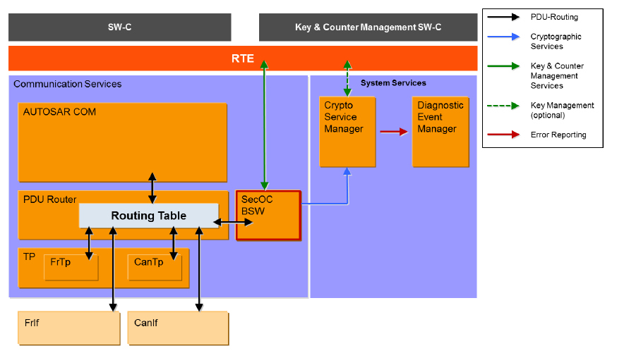
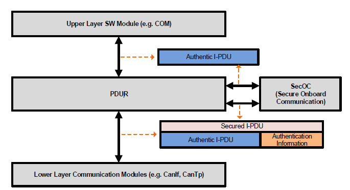
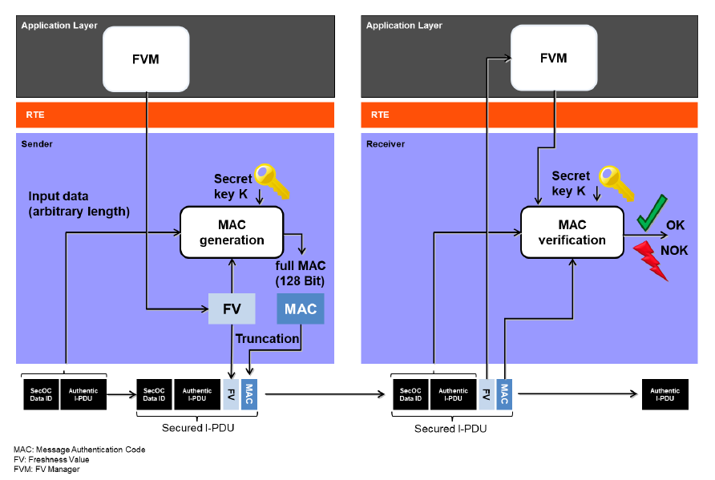
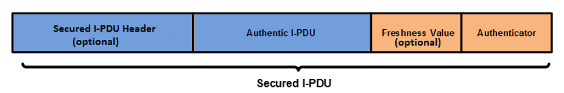
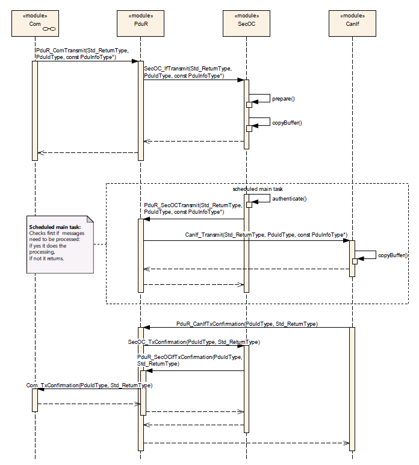
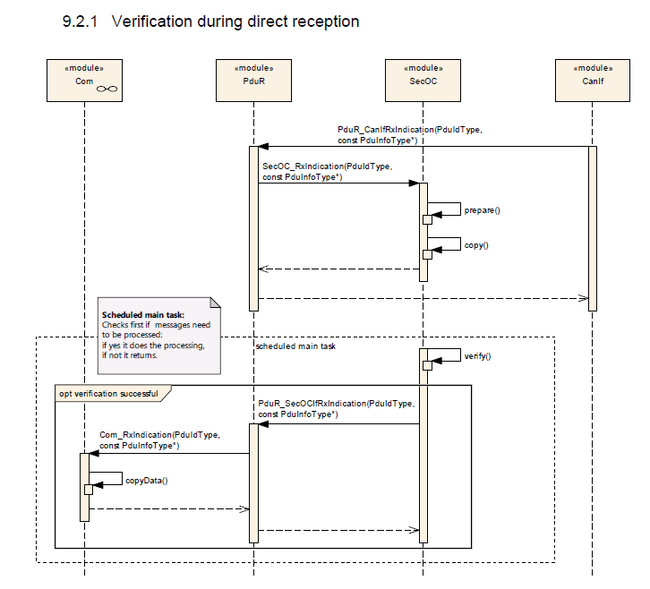

<section id="title">AUTOSAR SecOC (Secure Onboard Communication)</section>

# 1. 简介和功能概述

本文介绍了AUTOSAR安全板载通信模块（**SecOC**）软件规范。它描述了**AUTOSAR SecOC**模块的基本安全特性、功能和API。

**SecOC**模块旨在为PDU级别的关键数据提供资源高效和可行的认证机制。认证机制应该与当前的AUTOSAR通信系统无缝集成。对资源消耗的影响应该尽可能小，以便将保护作为遗留系统的附加组件。该规范基于这样一个假设，主要使用对称的身份（**symmetric authentication approach**）验证方法和消息身份验证码（**message authentication codes**）。它们用比非对称方法小得多的密钥实现了相同的安全级别，并且可以在软件和硬件中紧凑而高效地实现。同时本规范提供了必要的抽象级别，因此对称方法（**symmetric approaches**）和非对称身份验证（**asymmetric authentication approaches**）方法都是可以使用。

**SecOC**模块集成在**AUTOSAR PduR**级别。图中显示了**SecOC**模块集成为Autosar通信堆栈的一部分。

在该配置中，**PduR**负责将进出安全相关的**I-PDU**路由到**SecOC**模块。然后**SecOC**模块添加或处理安全相关信息，并将结果以**I-PDU**的形式传播回**PduR**。PduR负责进一步路由**I-PDU**。此外**SecOC**模块利用**CSM**提供的加密服务与**Rte**交互以允许密钥（**Key**）和计数器（**Counter**）管理。**SecOC**模块需要支持**PduR**支持的各种通信模式和原则，特别是组播通信（**Multicast communications**）、传输协议（**Transport Protocols**）和PduR网关（**PduR Gateway**）。

# 2. 首字母缩写词和缩写词

| Abbreviation / Acronym | 中文命名         | 解释说明                           |
| ---------------------- | ---------------- | ---------------------------------- |
| CSM                    | 加密服务管理模块 | The AUTOSAR Crypto Service Manager |
| SecOC                  | 安全板载通信     | Secure Onboard Communication       |
| MAC                    | 消息身份验证代码 | Message Authentication Code        |
| FV                     | 新鲜度值         | Freshness Value                    |
| FM                     | 新鲜度管理器     | Freshness Manager                  |

# 3. 约束和假设

## 3.1. 对汽车领域的适用性

SecOC模块用于所有需要安全通信的ECU。SecOC模块还没有被指定与**MOST**和**LIN**通信网络一起工作。由于**MOST**没有得到特别的支持，它对多媒体和车载通信领域的适用性可能会受到限制。

## 3.2. SomeIpTp约束

**SecOC**模块只能用于保护整个**SomeIpTp**消息，不能用于保护某个**SomeIpTp**消息的单个片段。

在数据传输时以下模块顺序是被允许:
**SecOC -> PduR -> SomeIpTp**

但以下模块顺序是不被允许的:
**SomeIpTp -> PduR -> SecOC**

**SecOC**不能用来保护**SomeIpTp**单个消息段的主要原因如下: 
>  **SomeIpTp**需要调用**SomeIpTp_TriggerTransmit**来创建**SomIpTp**头。**SecOC**不支持上层通过**TriggerTransmit**方式提供数据。

# 4. 对其他模块的依赖关系

## 4.1. PduR

**SecOC**模块依赖于**PduR**的API和功能。提供了**PDU Router**所需的上下两层API（**upper and lower layer API**）功能，即:
* 通信接口（**Communication Interface**）模块的API。
* 传输协议（**Transport Protocol**）模块的API。
* 使用传输协议（**Transport Protocol**）模块的上层模块的API。
* 处理通信接口（**Communication Interface**）模块发出的I-PDU的上层模块的API。

为了将安全处理的结果提供给**PduR**, **SecOC**模块需要**PduR**相关的API功能。

## 4.2. CSM

**SecOC**模块依赖于由**CSM**模块在AUTOSAR中提供的加密算法。**SecOC**模块需要API函数来生成和验证加密签名（**Cryptographic Signatures**）或消息验证码（**Message Authentication Codes**），即
* MAC生成接口（**Csm_MacGenerate**）。
* MAC验证接口（**Csm_MacVerify**）。
* 签名生成接口（**Csm_SignatureGenerate**）。
* 签名验证接口（**Csm_SignatureVerify**）。

## 4.3. RTE

SecOC模块提供了具有管理功能的API。这个API包含以下作为服务接口提供给RTE调用。
* **SecOC_VerificationStatus**
* **SecOC_VerifyStatusOverride**
* **SecOC_VerificationStatusIndication**

**Rte**包括**BSW-Scheduler**。**SecOC**模块依赖于**BSW-scheduler**在**SecOCMainFunctionPeriodRx**和**SecOCMainFunctionPeriodTx**中周期配置来调用函数**SecOC_MainFunctionRx**和**SecOC_MainFunctionTx**函数。

# 5. 功能规范

为了保护车辆系统的正确和安全功能，敏感数据的认证和完整性保护是必要的，这可以确保接收到的数据来自正确的ECU，具有正确的值。

**SecOC**模块的目标是在**PDU**级别上实现资源高效和实用的敏感数据认证机制。规范中提出的方法通常支持使用对称和非对称方法来保护真实性和完整性。这两种方法的目标大致相同，在概念上有很大的相似之处，但由于底层基元的技术属性不同，也存在一些差异。此外常用的身份验证器的术语是不同的。通常术语消息验证码（**Message Authentication Code, MAC**）用于对称方法，而术语签名或数字签名（**signature or digital signature**）指的是具有不同属性和约束的非对称方法。

## 5.1. 安全解决方案规格说明

本文中描述的SecOC模块提供了必要的功能，用于验证整车架构中ECU之间基于PDU的通信的真实性（**authenticity**）和新鲜度（**freshness**）。该方法需要发送的ECU和接收的ECU都实现**SecOC**模块。集成了的两个**SecOC**模块，提供发送端和接收端上、下两层**PduR**接口。两边的**SecOC**模块通常与**PduR**模块交互。

为了提供消息的新鲜度，发送和接收端的**SecOC**模块为每个唯一可识别的受保护的I-PDU（即每个安全通信链路），从外部的freshness Manager获取新鲜度。

在发送端，**SecOC**模块通过在发出的可信**I-PDU**上添加认证信息，创建一个受保护**I-PDU**。验证信息包括验证器（例如：消息验证码MAC）和可选的新鲜度值（**Freshness Value**）。无论在安全**I-PDU**负载中是否包含新鲜度值，在生成验证器时都需要考虑新鲜度值。当使用新鲜度计数器而不是时间戳时，在向接收方提供认证信息之前，新鲜度管理器需要对新鲜度计数器增1。

在接收端，**SecOC**模块通过验证发送端**SecOC**模块附加的认证信息来检测可信**I-PDU**的新鲜度和真实性。为了验证真实的**I-PDU**的真实性和新鲜度，提供给接收方的安全**I-PDU**应该与发送方的安全**I-PDU**相同，接收方的安全**I-PDU**应该知道发送方在创建验证器时使用的新鲜度值。

SecOC模块的主要目的是实现本规范中描述的安全功能。

### 5.1.1. 安全解决方案的基本实体

#### 5.1.1.1. 可信I-PDU和受保护的I-PDU

可信I-PDU（**Authentic I-PDU**）指的是需要保护的AUTOSAR I-PDU，以防止未经授权的操作和重放攻击。

受保护的I-PDU（**Secured I-PDU**）的负载由可信I-PDU（**Authentic I-PDU**）和验证器（如：**消息验证码MAC**）组成。受保护的I-PDU的有效负载可以选择地是否包含新鲜度值来用于创建验证器（如：MAC）的。受保护的I-PDU中内容的结构顺序符合如图。

在受保护的**I-PDU**中，可信的**I-PDU**的长度、新鲜度值和验证器可能会因为受保护的I-PDU唯一不确定性而不同。

验证器（**Authenticator**）是指通过使用密钥（**Key**）、受保护的I-PDU的数据标识符（**Data Identifier**）、可信负载（**Authentic Payload**）和新鲜度值（**Freshness Value**）而生成的唯一认证数据字符串。验证器提供了一个高度的可信度，即可信I-PDU中的数据是由合法源生成的，并在其预期的时间提供给接收ECU。

根据用于生成验证器的认证算法（参数：**SecOCTxAuthServiceConfigRef**或**SecOCRxAuthServiceConfigRef**），可能会截断由验证算法生成的最终结果（例如，在MAC的情况下）。当消息有效负载的长度受到限制并且没有足够的空间包含完整的验证器（**Authenticator**）时，可能需要截断。

安全认证I-PDU中包含的验证器长度（参数：**SecOCAuthInfoTruncLength**）与唯一可识别的安全认证I-PDU相关。通过提供每个受保护的I-PDU的MAC截断长度的细粒度配置，可以在整个系统中提供灵活性（例如：两个独立的、唯一的受保护的I-PDU的负载中可能包含不同的验证器长度）。

如果截断是可能的，验证器应该只被截断到由验证算法生成的结果验证器的最重要的位。下图显示了基于参数**SecOCFreshnessValueTruncLength**和**SecOCAuthInfoTruncLength**的验证器和新鲜度值的截断示例。

**注意**：
对于静态参与者嵌入的资源约束用例，我们建议使用消息认证码（**Message Authentication Codes**）作为认证的基础。（例如：基于AES的CMAC，具有足够的密钥长度）。

在使用MAC的情况下，可以只传输和比较部分MAC，这被称为MAC截断。然而这导致了较低的安全级别，至少能对单个MAC的伪造。虽然我们建议始终使用至少128位的密钥长度，但MAC截断可能是有益的。当然每个用例的MAC的实际长度必须谨慎选择。一般认为，64位及以上的MAC大小可以提供足够的保护，防止NIST的猜测攻击。根据用例，不同的MAC大小可能是合适的，但这需要安全专家的仔细判断。

#### 5.1.1.2. 验证者涵盖的数据

验证器（Authenticator）计算的数据由受保护的I-PDU的数据标识符（参数：**SecOCDataId**）、可信I-PDU数据和完整的新鲜值（**Complete Freshness Value**）组成。它们分别连接在一起，组成传递到身份验证器生成/验证的身份验证算法的bit array里。

DataToAuthenticator = 数据标识符（**Data Identifier**） | 可信I-PDU的安全部分 （**Secured part of the Authentic I-PDU**）| 完整的新鲜值（**Complete Freshness Value**）

**注意:**：符合“|”表示连接。

#### 5.1.1.3. 新鲜度值

每个受保护的I-PDU至少配置一个新鲜度值（**Freshness Value**）。新鲜度值是一种单调计数器，用于保证保护I-PDU的新鲜度。这种单调计数器可以通过称为新鲜度计数器（**Freshness Counter**）的单个消息计数器来实现，也可以通过称为新鲜度时间戳（**Freshness Timestamp**）的时间戳值来实现。新鲜度值来自于一个新鲜度管理器（**Freshness Manager**）。

通过身份验证的消息负载中包含的完整新鲜度值的比特数越大，就会导致接收端与发送端新鲜度值保持同步的窗口越大，而无需执行同步策略。

当在经过身份验证的消息有效负载中包含部分新鲜度值时，新鲜度值被称为两部分：最高有效位（**the most significant bits**）和最低有效位（**the least significant bits**）。包含在受保护的I-PDU负载中的计数器部分被称为新鲜度值的最低有效位，计数器的其余部分被称为新鲜度值的最有效位。

在允许重用现有的新鲜度值的情况下，这些值保证在一个新鲜度时间戳的有效期内是唯一的，例如一个4位E2E计数器。在这种情况下，SecOC不需要生成任何额外的计数器值。

新鲜度管理器（**Freshness Manager**）以字节数组的形式在接口函数中提供或接收新鲜度信息。新鲜度总是与数组中第一个字节的MSB对齐。第15位是第2字节的MSB，以此类推。新鲜度数组中未使用的位必须设置为0。相关的长度信息必须以位为单位给出。

**例子**：
10位新鲜度“001101011”（二进制）可以位于2字节数组中。应的值为:“35 80”（十六进制），长度为10。

#### 5.1.1.4. 新鲜度值构造

如果对于PDU配置为**SecOCQueryFreshnessValue = CFUNC**和**SecOCProvideTxTruncatedFreshnessValue = TRUE**，每当为相应的PDU构造**DataToAuthenticator**时，**SecOC**会调用接口函数**SecOC_GetTxFreshnessTruncData**来获取TX消息的当前新鲜度。

如果对于PDU配置为**SecOCQueryFreshnessValue = CFUNC**和**SecOCProvideTxTruncatedFreshnessValue = FALSE**，每当为相应的PDU构造**DataToAuthenticator**时，**SecOC**会调用接口函数**SecOC_GetTxFreshness**来获取TX消息的当前新鲜度。

如果对于PDU配置为**SecOCQueryFreshnessValue = RTE**和**SecOCProvideTxTruncatedFreshnessValue = TRUE**时，每当为相应的PDU构造**DataToAuthenticator**时，**SecOC**会调用服务操作**FreshnessManagement_GetTxFreshnessTruncData**来获取TX消息的当前新鲜度。

如果对于PDU配置为**SecOCQueryFreshnessValue = RTE**和**SecOCProvideTxTruncatedFreshnessValue = FALSE**，则每当为相应的PDU构造**DataToAuthenticator**时，**SecOC**会调用服务操作**FreshnessManagement_GetTxFreshness**来获取TX消息的当前新鲜度。

如果对于PDU配置，**SecOCQueryFreshnessValue = RTE**，**SecOC**通过调用业务操作**FreshnessManagement_SPduTxConfirmation**，表示受保护的I-PDU已成功发起传输。

如果对于PDU配置，**SecOCQueryFreshnessValue = RTE**, **SecOCUseAuthDataFreshness = TRUE**，且已完全接收到受保护的PDU，**SecOC**则调用RTE服务**FreshnessManagement_GetRxFreshnessAuthData**查询当前的新鲜度。接收到的一部分PDU数据，将根据**SecOCAuthDataFreshnessStartPosition**和**SecOCAuthDataFreshnessLen**配置做为参数传递给该服务操作。

如果对于PDU配置，**SecOCQueryFreshnessValue = CFUNC**, **SecOCUseAuthDataFreshness = TRUE**，且已完全收到受保护的PDU，**SecOC**则调用接口函数**SecOC_GetRxFreshnessAuthData**查询当前的新鲜度。接收到的一部分PDU数据，将根据**SecOCAuthDataFreshnessStartPosition**和**SecOCAuthDataFreshnessLen**配置做为参数传递给给该函数。

### 5.1.2. I-PDU的认证

受保护的I-PDU（**Secured I-PDU**）的创建和可信I-PDU（**Authentic I-PDU**）的认证包括以下6个步骤:
1. 受保护的I-PDU的准备 （**Prepare Secured I-PDU**）
2. 验证器数据的构建 （**Construct Data for Authenticator**）
3. 验证器的生成 （**Generate Authenticator**）
4. 受保护的I-PDU的构建 （**Construct Secured I-PDU**）
5. 新鲜计数器的累加 (**Increment Freshness Counter**)
6. 受保护的I-PDU的广播发送（**Broadcast Secured I-PDU**）

**SecOC**模块在准备受保护的I-PDU过程中，**SecOC**应分配必要的缓冲区来保存认证过程的中间和最终结果。**SecOC**模块需要构造**DataToAuthenticator**，即用于计算验证器的数据。**DataToAuthenticator**由16位的Data Id（参数：**SecOCDataId**）、可信I-PDU（**Authentic I-PDU**）的安全部分和SecOCFreshnessValueID对应的完整新鲜度值，按照给定的顺序连接而成。同时Data Id和新鲜度值（**Freshness Value**）应以大端字节顺序（**Big Endian byte order**）进行编码。

**SecOC**模块应通过将**DataToAuthenticator**、**DataToAuthenticator**的长度，传递到**SecOCTxAuthServiceConfigRef**对应的认证算法中来生成验证器（**Authenticator**）。

**SecOC**模块应将根据**SecOCAuthInfoTruncLength**的定义把验证器结果截短为指定的比特数。

**SecOC**模块应通过添加可信I-PDU头（可选）、新鲜度值（可选）和验证器到可信I-PDU，来构造受保护的I-PDU。

### 5.1.3. I-PDU的验证

受保护的I-PDU的验证包括以下6个步骤：
1. 解析可信I-PDU、新鲜度值和验证器（**Parse Authentic I-PDU, Freshness Value and Authenticator**）
1. 从新鲜度管理器获得新鲜度值（**Get Freshness Value from Freshness Manager**）
1. 构建认证数据（**Construct Data to Authentication**）
1. 验证鉴权信息（**Verify Authentication Information**）
1. 发送确认书给新鲜度经理（**Send Confirmation to Freshness Manager**）
1. 将可信的I-PDU传递给上层（**Pass Authentic I-PDU to upper layer**）

在收到一个受保护的I-PDU后，**SecOC**模块将解析可信的I-PDU、新鲜度值和验证器。

**SecOC**模块应构造用于在接收端计算验证器的数据（**DataToAuthenticator**）。该数据由**SecOCDataId** | **AuthenticIPDU** | **FreshnessVerifyValue**组成。

**SecOC**模块应通过将**DataToAuthenticator**、**DataToAuthenticator**的长度、从受保护的I-PDU解析出的验证器和**SecOCAuthInfoTruncLength**，都传递到与**SecOCRxAuthServiceConfigRef**对应的认证算法中来验证验证器。

如果使用**SecOC_VerifyStatusOverride**，则根据**overrideStatus**的值处理验证结果和I-PDU。

如果配置项**SecOCRxPduProcessing/SecOCVerificationStatusPropagationMode**设置为**BOTH**或**FAILURE_ONLY**，则根据当前配置，通过call out函数**SecOC_VerificationStatusCallout**和**SecOC_VerificationStatus**接口来传递验证状态。如果此项配置设置为**NONE**，则不提供报告。

如果配置项**SecOCRxPduProcessing/SecOCClientServerVerificationStatusPropagationMode**设置为**BOTH**或**FAILURE_ONLY**，则根据当前配置，通过服务接口**SecOC_VerificationStatusIndication**来来传递验证状态。如果此项配置设置为**NONE**，则不提供报告。

如果配置项**SecOCGeneral/SecOCPropagateOnlyFinalVerificationStatus**设置为**TRUE**，则只报告最终状态。如果此项配置设置为**FALSE**，则每一个单独的验证状态（最后的以及所有之前的失败）都应报告。

如果受保护的I-PDU验证成功或设置了状态覆盖，则**SecOC**模块需要通过PduR的下层接口（**the lower layer interfaces**），将可信I-PDU传递给上层通信模块（**the upper layer communication layer**）。

## 5.2. 初始化

**SecOC_Init**函数初始化所有内部全局变量，以及用于存储SecOC中I-PDUs和所有中间结果的缓冲区。在调用除**SecOC_GetVersionInfo**之外的任何SecOC模块的其他函数之前，SecOC模块的环境应该先调用SecOC_Init。

对于通过SecOC模块的I-PDU数据传输路径，在SecOC模块内部分配一个缓冲区。这个缓冲区需要被初始化，因为它可能在被底层通信模块的上层完全填充数据之前被传输。

## 5.3. 传出PDU的认证

认证（**authentication**）一词描述了通过在可信的I-PDU中添加认证信息来创建受保护的I-PDU。一般情况下，与PduR模块的交互以及对可信I-PDUs的认证按照以下方案组织:

1. 对于一个可信的I-PDU（**Authentic I-PDU**）的每一个传输请求，上层通信模块通过**PduR_\<up\>Transmit**调用**PduR**模块。
2. **PduR**将此请求路由到**SecOC**模块，并调用**SecOC_[If|Tp]Transmit**。
3. **SecOC**模块将可信I-PDU复制到自己的内存中，然后返回。
4. **SecOC**模块在下一次调度调用其main函数时，通过计算认证信息来创建受保护的I-PDU，并通过**PduR**模块通知相应的下层模块，发起受保护的I-PDU的传输。
5. 此后**SecOC**模块接替上层通信模块的角色，负责处理所有下层的请求，对受保护的I-PDU提供信息或复制数据。
6. 最后**SecOC**模块向上层通信模块提供受保护的I-PDU传输成功或失败的确认，作为可信I-PDU传输成功或失败的确认。

**注意：**

对于每个可信的I-PDU，上层通信模块应按照正常情况下直接传输请求的方式调用**PduR**模块。在这种情况下，上层通过**SecO**C模块与TriggerTransmit和TP行为解耦。

### 5.3.1. 直接传输过程中的认证
对于使用允许点对点（**ad-hoc transmission**）传输（如：**CanIf**）的总线接口传输可信I-PDU时，**PDU Router**模块触发**SecOC**模块对可信I-PDU的传输操作。在这种情况下，SecOC模块准备创建受保护的I-PDU。在可信I-PDU的基础上，分配内部缓冲区容量，并将可信I-PDU复制到本地缓冲区位置。然后从**SecOC_[If|Tp]Transmit**返回。

### 5.3.2. 触发传输过程中的认证

对于使用允许触发传输（**triggered transmission**）（例如：FrIf）的总线接口传输一个可信的I-PDU。上层模块调用**PduR**模块，就像通常调用直接传输（**direct transmission**）一样。因此，上层模块通过**PduR_<up>Transmit**提供所需的缓冲区信息，立即提供对可信I-PDU的访问。**PduR**通过调用**SecOC_IfTransmit**将这个传输请求转发给**SecOC**模块。在**SecOC**模块能够通过触发传输的接口向下层提供数据之前，至少需要先调用一次**SecOC_IfTransmit**。如果调用**SecOC_TriggerTransmit**后，并没有提供任何数据，返回**E_NOT_OK**。

**注意：**

只有在上层显式调用**PduR_<up>Transmit**发起传输时，才支持触发传输认证（**Authentication for triggered transmission**）。“AlwaysTransmit”模式下，触发传输不得使用。

受保护的I-PDU的实际创建是在调度的主函数的后续调用期间处理的。它包括计算认证信息，并将认证信息（即：验证器和可能被截断的新鲜度值）连续地添加到直接位于可信I-PDU后面的缓冲区位置。此后，**SecOC**模块通过在**PduR**模块中，调用**PduR_SecOCTransmit**函数，触发将受保护的I-PDU传输到目的底层模块。

### 5.3.3. 传输协议传输过程中的认证

当使用传输协议传输（**transport protocol transmission**）（如：**CanTP**、**FrTp**）传输可信的I-PDU时，**PDU Router**模块触发**SecOC**模块对可信的I-PDU进行传输操作。在这种情况下，SecOC模块在可信I-PDU的基础上，分配内部缓冲区容量，并将可信I-PDU复制到本地缓冲区位置，从而创建一个受保护的I-PDU。然后从**SecOC_[If|Tp]Transmit**返回。

受保护的I-PDU的实际创建将在后面一次调用预定的主函数时进行。它包括计算认证信息，并将认证信息（即：验证器和可能被截断的新鲜度值）连续地添加到直接位于可信I-PDU后面的缓冲区位置。

## 5.4. 输入PDU的验证

“验证”描述了将受保护的I-PDU中包含的认证信息与根据本地数据标识符、本地新鲜度值和受保护的I-PDU中包含的可信I-PDU计算出的认证信息进行比较的过程。

与PduR模块的整体交互和受保护的I-PDU的验证按照以下方案进行组织:
1. 对于来自下层总线接口或传输协议模块的每一个输入的受保护的I-PDU的指示（**indication**），**SecOC**模块接替上层通信模块的角色，为所有需要接收完整的受保护的I-PDU的下层请求提供服务。
2. SecOC模块将受保护的I-PDU复制到自己的内存中。
3. 当完整的受保护的I-PDU可用时，在**SecOC**模块的main函数的下一次预定调用中，验证受保护的I-PDU的内容。
4. 如果验证失败，且参数**SecOCIgnoreVerificationResult**被配置为**FALSE**，则SecOC模块丢弃此受保护的I-PDU。
5. 如果验证成功或失败，且配置参数**SecOCIgnoreVerificationResult**为**TRUE**，则SecOC模块作为底层通信模块，对可信I-PDU调用**PduR_SecOC[If|Tp]RxIndication**。
6. **SecOC**模块上报验证结果。

因此，**SecOC**解耦了上层模块和下层模块之间的交互。**SecOC**模块管理与下层模块的交互，直到它将完整的受保护的I-PDU复制到自己的缓冲区。这样做不会影响上层模块。验证I-PDU的内容后，根据验证结果向上层通信模块发送可信I-PDU。

### 5.4.1. 总线接口接收期间的验证

当通过底层总线接口（例如：**CanIf**、**FrIf**）接收到带保护的I-PDU时， **PduR**模块调用**SecOC_RxIndication**来通知**SecOC**模块每个收到的带保护的I-PDU。在**SecOC_RxIndication**处理过程中，**SecOC**模块将可信I-PDU复制到自己的缓冲区中。

当**SecOC_RxIndication**被调用的过程中，**SecOC**模块将根据该I-PDU接收到的最小长度和配置的长度将该I-PDU复制到相应的缓冲区中。复制的长度将用于所有进一步的接收处理。

此后，在下一次调用预定的主函数时，传入的带保护I-PDU才会被真正开始验证。**SecOC**模块从带保护的I-PDU中提取出可信的I-PDU，即认证信息。**SecOC**模块验证可信I-PDU的真实性和新鲜度。如果验证成功，则**SecOC**通过对可信I-PDU调用**PduR_SecOC[If|Tp]RxIndication**表示接收可信I-PDU。如果验证失败，则丢弃PDU，不调用**PduR_SecOC[If|Tp]RxIndication**。

### 5.4.2. 传输协议接收期间的验证

当通过底层传输协议接口（例如：**CanTp**、**FrTp**）接收到带保护的I-PDU时，PduR模块调用**SecOC_StartOfReception**，通知**SecOC**模块将开始接收相应的带保护的I-PDU。

当**SecOC_StartOfReception**被调用的时候，**SecOC**模块应提供足够的缓冲区来存储完整的带保护的I-PDU。此外，如果**SecOCPduType**配置为**SECOC_TPPDU**，它应该通过调用**PduR_SecOCTpStartOfReception**来转发**SecOC_StartOfReception**调用。

当**SecOC_CopyRxData**被调用的时候，**SecOC**模块将调用**SecOC_CopyRxData**将NPDU复制到自己的缓冲区中。最后从**SecOC_CopyRxData**中返回。

当**SecOC_TpRxIndication**被调用的时候，**SecOC**模块应从**SecOC_TpRxIndication**返回，而不进行任何进一步处理。接着**SecOC**模块应验证带保护的I-PDU的内容。

验证最终成功后，如果配置**SecOCPduType**为**SECOC_IFPDU**，**SecOC**模块调用**PduR_SecOCIfRxIndication**，并引用带保护I-PDU中包含的可信I-PDU。如果**SecOCPduType**配置为**SECOC_TPPDU**，则**SecOC**应先调用**PduR_SecOCTpCopyRxData**，然后再调用**PduR_SecOCTpRxIndication**，并引用带保护I-PDU中包含的可信I-PDU，将所有数据提前转发给上层。

当验证失败且**SecOCIgnoreVerificationResult**配置为**TRUE**时，**SecOC**仍然会引用带保护I-PDU中包含的可信I-PDU，将所有数据提前转发给上层。

