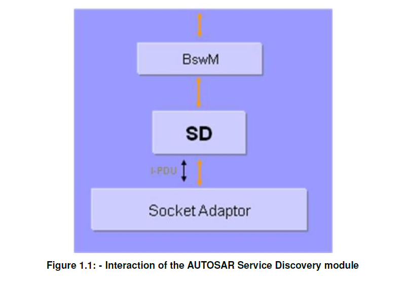

<section id="title">AUTOSAR SD (Service Discovery)</section>

# 1. 简介和功能概述

**AUTOSAR**服务发现（**Service Discovery**）模块提供了侦测（**detect**）和提供（**offer**）车辆网络内可用服务（即：功能实体）的功能。 为此，它使用了**IP**多播和所谓的**SOME/IP-SD**消息。

服务发现模块 (**Sd**) 位于AUTOSAR BSW模式管理器模块 (**BswM**) 和 AUTOSAR套接字适配器模块 (**SoAd**) 之间。

# 2. 缩略语和定义

## 缩写

