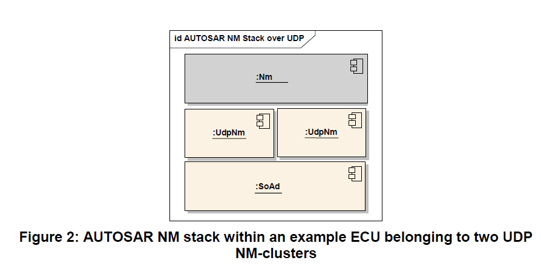
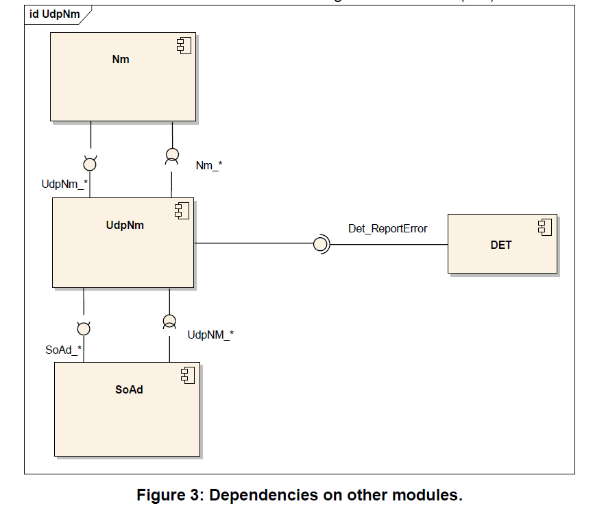
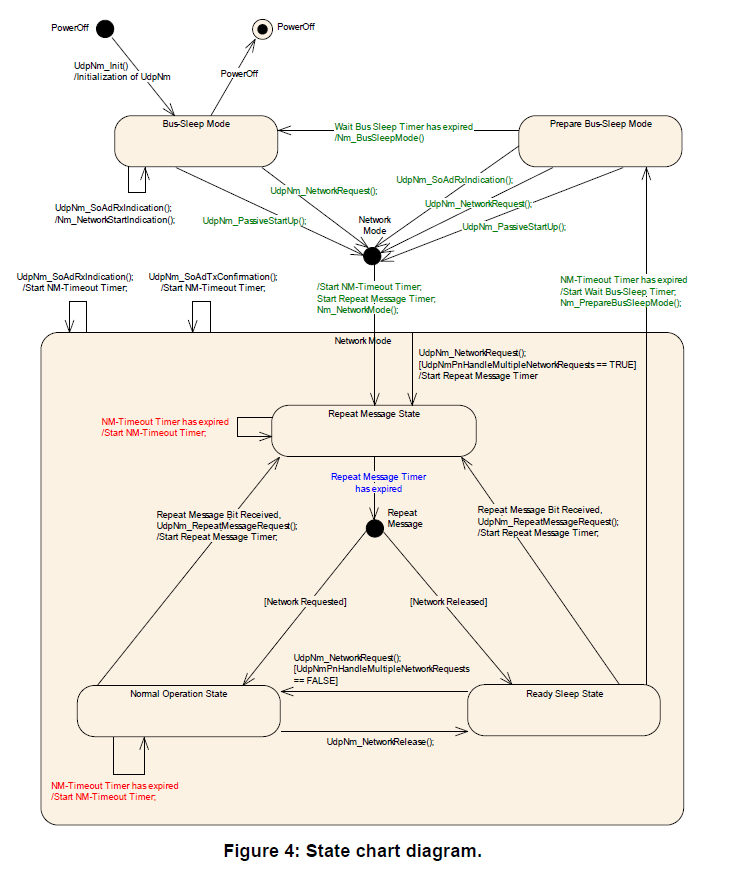

<section id="title">AUTOSAR UdpNm (UDP Network Management)</section>

# 1. 简介和功能概述

本文档描述了**AUTOSAR UDP**网络管理（**UdpNm**）的概念、核心功能、可选特性、接口和配置问题。 **UdpNm**主要设计成一个可选功能, 旨在与**TCP/IP**堆栈一起工作，独立于所使用的通信系统的物理层。**AUTOSAR UDP**网络管理是一个独立于硬件的协议，可用于基于**TCP/IP**的系统。其主要目的是协调网络正常运行和总线睡眠模式之间的转换。

除了核心功能之外，它还提供了一些可选功能，例如：实现一个服务来检测所有当前节点或检测所有其他节点是否准备好休眠。

UDP 网络管理（**UdpNm**）功能提供网络管理接口（**Nm**）和**TCP/IP**堆栈之间的适配。 有关AUTOSAR网络管理功能的一般理解，请参阅[9]。


# 2. 缩略语

## 2.1. 缩略语

| 缩略语 | 具体描述       |
| ------ | -------------- |
| CWU    | 车辆唤醒       |
| EthIf  | 以太网接口     |
| IP     | 互联网协议     |
| NM     | 网络管理       |
| PDU    | 协议数据单元   |
| PNL    | 部分网络学习   |
| SDU    | 服务数据单元   |
| TCP    | 传输控制协议   |
| UDP    | 用户数据报协议 |
| PNI    | 部分网络信息   |
| UdpNm  | UDP网络管理    |

## 2.2. 术语 

**PDU传输能力被禁用**（**PDU transmission ability is disabled**）
  > 这意味着**NM**消息传输已被可选服务**UdpNm_DisableCommunication**禁用。

**重复消息请求位指示**（**Repeat Message Request Bit Indication**）
  > 在接收到的**NM**消息时，**UdpNm_SoAdIfRxIndication**函数寻找**Control Bit Vector**的重复消息位。

**NM PDU** 
  > 指在数据包中传输的有效载荷。 它包含**NM**用户数据以及控制位向量和源节点标识符。
  
**NM Packet**
  > 指一个以太网帧，除了由NM在有效载荷部分传输的数据（**PDU**）之外，还包含一个**IP**和一个**UDP**报头。

**NM Message**
  > 抽象术语，指在NM算法的方法中传输的任何单个信息项。

**Bus-Off state**
  > 指没有电缆连接到以太网硬件的情况。

**顶级PNC协调员**（**Top-level PNC coordinator**）
  > 顶级PNC协调器是一个ECU，它充当网络中的PNC网关，并在所有分配的通道上主动协调处理至少一个PNC。如果启用了同步PNC关闭，如果网络中没有其他ECU请求它们，顶级PNC协调器将为这些PNC触发关闭。

**中间PNC协调器**（**Intermediate PNC coordinator**）
  > 中间PNC协调器是一个ECU，它充当网络中的PNC网关，并在至少一个分配的通道上将至少一个PNC处理为被动协调。如果启用了同步PNC关闭，它会将收到的这些PNC的关闭请求转发到相应的主动协调通道，并相应地启动它们的关闭。

**PNC叶节点**（**PNC leaf node**）
  > PNC叶节点是一个ECU，在网络中根本不充当PNC协调器。它像通常的NM消息一样处理PN关闭消息。

**PN关闭消息**（**PN shutdown message**）
  > 顶级PNC协调器发送PN关闭消息以指示跨PN拓扑的同步PNC关闭。PN关闭消息是作为**NM**消息，它在控制位向量中具有**PNSR**位，并且所有被指示用于同步关闭的PNC都设置为**1**。

# 3. 相关文档

## 3.1. 输入文件

[1] Layered Software Architecture 
> AUTOSAR_EXP_LayeredSoftwareArchitecture.pdf

[2] General Requirements on Basic Software Modules 
> AUTOSAR_SRS_BSWGeneral.pdf

[3] Requirements on Network Management 
> AUTOSAR_SRS_NetworkManagement.pdf

[4] Specification of Ethernet Interface 
> AUTOSAR_SWS_EthernetInterface.pdf

[5] Specification of FlexRay Network Management
> AUTOSAR_SWS_FlexRayNetworkManagement.pdf

[6] Specification of Communication Stack Types
> AUTOSAR_SWS_CommunicationStackTypes.pdf

[7] Specification of ECU Configuration
> AUTOSAR_TPS_ECUConfiguration.pdf

[8] Specification of BSW Scheduler 
> AUTOSAR_SWS_BSW_Scheduler.pdf

[9] Specification of Generic Network Management Interface
> AUTOSAR_SWS_NetworkManagementInterface.pdf

[10] Specification of Communication Manager
> AUTOSAR_SWS_ComManager.pdf

[11] Specification of ECU State Manager 
> AUTOSAR_SWS_ECUStateManager.pdf

[12] Specification of Operating System 
> AUTOSAR_SWS_OS.pdf

[13] Specification of Default Error Tracer 
> AUTOSAR_SWS_Default ErrorTracer.pdf

[14] Specification of Standard Types 
> AUTOSAR_SWS_StandardTypes.pdf

[15] Specification of Platform Types 
> AUTOSAR_SWS_PlatformTypes.pdf

[16] Specification of Compiler Abstraction 
> AUTOSAR_SWS_CompilerAbstraction.pdf

[17] Basic Software Module Description Template
> AUTOSAR_TPS_BSWModuleDescriptionTemplate.pdf

[18] Specification of Socket Adaptor 
> AUTOSAR_SWS_SocketAdaptor.pdf

[19] Requirements on Ethernet 
> AUTOSAR_SRS_Ethernet.pdf

[20] List of Basic Software Modules 
> AUTOSAR_TR_BSWModuleList.pdf

[21] General Specification of Basic Software Modules
> AUTOSAR_SWS_BSWGeneral.pdf

[22] Specification of the AUTOSAR Network Management Protocol 
> AUTOSAR_PRS_NetworkManagementProtocol.pdf

[23] Specification of SystemTemplate 
> AUTOSAR_TPS_SystemTemplate.pdf

## 3.2. 相关标准和规范

[24] IEEE 
> http://www.opengroup.org/onlinepubs/000095399/

[25] ISO 14229 Road Vehicles – Unified Diagnostic Services (UDS)

## 3.3. 相关规范

AUTOSAR提供了基础软件模块的通用规范[21]（**SWS BSW General**），它也适用于UDP网络管理。

因此，规范**SWS BSW General**应被视为UDP网络管理的附加和必需规范。

# 4. 约束和假设

## 4.1. 限制

1. 一个**UdpNm**实例只与一个网络中的一个NM集群（**NM-Cluster**）相关联。 一个NM集群在一个节点中只能有一个**UdpNm**实例。
2. **UdpNm**的一个实例仅与同一ECU内的一个网络相关联。
3. **UdpNm**仅适用于基于**TCP/IP**的系统。

下图展示了属于两个UDP NM集群的示例ECU内的AUTOSAR NM堆栈。



默认情况下AUTOSAR UdpNm算法应支持每个NM集群包含最多250个节点。

**注意**：AUTOSAR UdpNm算法可以支持每个NM集群任意数量的节点（如果需要：甚至超过每个集群默认250个节点的限制）。这只是配置问题，上限不是固定的，取决于为AUTOSAR UdpNm协调算法配置的响应时间、容错性和结果总线负载之间的权衡。 这可能取决于所使用的物理层。

# 5. 对其他模块的依赖

UDP网络管理（**UdpNm**）使用**TCP/IP**堆栈的服务，并向通用网络管理接口（**Nm**）提供服务。



# 6. 功能规格

## 6.1. 协调算法

**AUTOSAR UdpNm**基于去中心化（**decentralized**）的直接网络管理策略，这意味着每个网络节点仅根据通信系统内接收和/或传输的UD 数据包，执行自给自足的活动。

AUTOSAR UdpNm协调算法基于周期性的NM数据包（**Nm Packet**），通过广播传输被集群中的所有节点所接收。接收到NM数据包表明发送节点希望保持NM集群处于唤醒状态。如果任何节点准备好进入总线睡眠模式（**Bus-Sleep Mode**），它就会停止发送NM数据包。但只要收到来自其他节点的NM数据包，它就会推迟转换到总线睡眠模式。最后如果由于不再接收到NM数据包，而导致专用计时器超时，则每个节点都会启动到总线睡眠模式的转换。

如果NM集群（**NM-cluster**）中的任何节点需要总线通信，它可以通过发送NM数据包来保持 NM集群唤醒状态。有关唤醒过程本身的更多详细信息，可参阅[10]。

AUTOSAR UdpNm协调算法的主要概念，可以通过以下两个关键需求定义：
1. 只要需要总线通信，每个网络节点都应发送周期性的NM PDU。否则节点就不应发送NM PDU。
2. 如果**UdpNmStayInPbsEnabled**被禁用，UdpNm集群中的总线通信被释放，同时通过配置参数**UdpNmTimeoutTime** + **UdpNmWaitBusSleepTime**确定的可配置时间量内，总线上没有网络管理PDU，则节点应执行转换到总线睡眠模式。

从NM集群中单个节点的角度来看，AUTOSAR UdpNm状态机应包含AUTOSAR UdpNm协调算法所需的状态（**state**）、转换（**transition**）和触发（**trigger**）。



## 6.2. 操作模式

**AUTOSAR UdpNm**应包含以下的三种操作模式：

1. 网络模式（**Network Mode**）
2. 准备总线睡眠模式（**Prepare Bus-Sleep Mode**）
3. 总线睡眠模式（**Bus-Sleep Mode**）

**AUTOSAR UdpNm**操作模式的变化需要通过回调函数通知上层模块。

### 6.2.1. 网络模式（Network Mode）

网络模式应包括三个内部状态：

1. 重复消息状态（**Repeat Message State**） 
2. 正常运行状态（**Normal Operation State**）
3. 就绪睡眠状态（**Ready Sleep State**）

当从**Bus-Sleep Mode**或**Prepare Bus-Sleep Mode**进入**Network Mode**时，默认进入**Repeat Message State**，**NM-Timeout Timer**将被启动，同时**UdpNm**需要通过调用 **Nm_NetworkMode**通知上层模块。

在网络模式下，成功接收到**NM PDU**后（调用**UdpNm_SoAdIfRxIndication**），需要重新启动 **NM-Timeout Timer**。

在网络模式下，成功传输**NM PDU**后（使用E_OK调用UdpNm_SoAdIfTxConfirmation），也需要重新启动**NM-Timeout Timer**。

**注意：**
由于无法从**SoAd**或**TCP/IP**堆栈获得传输确认，因此假设每个网络管理**PDU**传输请求都是我网络管理PDU传输成功。

**NM-Timeout Timer**在每次启动或重新启动时，都需要被重置。

如果某通道的参数**UdpNmDynamicPncToChannelMappingEnabled**被设置为**TRUE**，且**UdpNm**也处于网络模式，同时在此通道上**UdpNm_PnLearningRequest**函数被调用，则 **UdpNm**模块需要将此通道上的**CBV**中的部分网络学习位（**Partial Network Learning Bit**）设置为**1**，同时一并设置重复消息位（**Repeat Message Bit**）。接着切换到**Repeat Message State**或者重新启动**Repeat Message State**。

如果某通道的参数**UdpNmDynamicPncToChannelMappingEnabled**被设置为**TRUE**，且 **UdpNm**也处于网络模式，同时在此通道上接收到的部分网络学习（**Partial Network Learning**）和重复消息（**Repeat Message**）的请求均为**1**时，则**UdpNm**模块需要将在此通道上的**CBV**中的部分网络学习位（**Partial Network Learning Bit**）设置为**1**，接着切换到**Repeat Message State**或者重新启动**Repeat Message State**。

**注意：**
在前面所述的，重新启动**Repeat Message State**意味着**UdpNm**已经处于**Repeat Message State**，然后必须执行一次重复消息状态的完全重新进入。

#### 6.2.1.1. 重复消息状态（Repeat Message State）

对于非被动模式（**Not in passive Mode**）的节点，重复消息状态确保从**Bus-Sleep**或**Prepare Bus-Sleep**到**Network Mode**的任何状态的转换，对于网络上的其他节点都是可见的。 此外，它还确保任何节点在最短的时间内保持活动状态 (**UdpNmRepeatMessageTime**)。 可选地，它可以用于检测当前的节点。

当从**Bus-Sleep Mode**、**Prepare-Bus-Sleep Mode**、正常操作状态（**Normal Operation State**）或**Ready Sleep State**进入**Repeat Message State**状态时，除非启用了被动模式，否则必须重新启动**NM**报文的传输。

当**NM-Timeout Timer**在**Repeat Message State**超时时，**NM-Timeout Timer**需要重新启动。

**NM**应在由配置参数**UdpNmRepeatMessageTime**确定的可配置时间量内，保持在重复消息状态。但在那之后需要离开**Repeat Message State**。

当离开**Repeat Message State**时：

* 如果网络又被请求，则应进入正常操作状态（**Normal Operation State**）。
* 如果网络已被释放，则应进入**Ready Sleep State**。

如果**UdpNmNodeDetectionEnabled**设置为**TRUE**,**UdpNm**需在离开**Repeat Message State**时，清除重复消息位（**Repeat Message Bit**）。

如果**UdpNmDynamicPncToChannelMappingSupport**设置为**TRUE**, **UdpNm**需在离开**Repeat Message State**时，清除部分网络学习位（**Partial Network Learning Bit**）。

#### 6.2.1.2. 正常运行状态（Normal Operation State）

正常操作状态（**Normal Operation State**）需确保任何节点在需要网络功能时，都能保持NM集群（NM-cluster）处于被唤醒状态。

当**Ready Sleep State**转换到正常操作状态（**Normal Operation State**），除非已启用被动模式或禁用NM报文的传输能力，否则**NM PDU**需立即开始传输。

在正常操作状态（**Normal Operation State**）下：

* 当**NM-Timeout Timer**超时后，需要重新启动**NM-Timeout Timer**。
* 如果网络被释放，则需要离开在正常操作状态（**Normal Operation State**），而进入**Ready Sleep state**状态。
* 如果**UdpNmNodeDetectionEnabled**设置为**TRUE**，并且接收到重复消息请求位（**Repeat Message Request bit**），则**UdpNm**需进入重复消息状态（**Repeat Message State**）。
* 如果**UdpNmNodeDetectionEnabled**设置为**TRUE**，并且函数**UdpNm_RepeatMessageRequest**被调用，则**UdpNm**需进入重复消息状态（**Repeat Message State**），并设置重复消息位（**Repeat Message Bit**）。

#### 6.2.1.3. 就绪睡眠状态（Ready Sleep State）

**Ready Sleep State**确保任意一个节点在等待转换到**Prepare Bus-Sleep Mode**时，其他节点需保持NM集群（**NM-cluster**）处于被唤醒状态。

当从**Repeat Message State**或**Normal Operation State**进入**Ready Sleep State**时，应停止**NM PDU**的传输。

**注意：**
如果启用了被动模式，由于**NM PDU**已经不被传输，所以无需执行任何操作。如果禁用了被动模式，在某些情况下，**NM PDU**必须在就绪睡眠状态（**Ready Sleep State**）下传输，以允许网络的同步关闭（**synchronized shutdown**），例如：重新传输PN关闭消息（**PN shutdown messages**）。

在就绪睡眠状态（**Ready Sleep State**）下：

* 如果**NM-Timeout Timer**超时后，应离开就绪睡眠状态（**Ready Sleep State**），并进入准备总线睡眠模式（**Prepare Bus-Sleep Mode**）。
* 如果收到网络请求时，应离开就绪睡眠状态（**Ready Sleep State**），并进入正常操作状态（**Normal Operation State**）。
* 如果**UdpNmNodeDetectionEnabled**设置为**TRUE**，并且接收到重复消息请求位（**Repeat Message Request bit**），则UdpNm应进入重复消息状态（**Repeat Message State**）。
* 如果**UdpNmNodeDetectionEnabled**设置为**TRUE**，并且函数**UdpNm_RepeatMessageRequest**被调用，则**UdpNm**需进入重复消息状态（**Repeat Message State**），并设置重复消息位（**Repeat Message Bit**）。

### 6.2.2. 准备总线睡眠模式（Prepare Bus-Sleep Mode）

准备总线睡眠（**Prepare Bus Sleep**）状态的目的是确保所有节点在进入总线睡眠（**Bus Sleep**）状态之前，都有时间停止其网络活动。 总线活动平静下来（即：队列中的消息已被传输以便清空所有Tx缓冲区），最后在准备总线睡眠模式（**Prepare Bus-Sleep Mode**）下总线上没有活动。

当进入准备总线睡眠模式（**Prepare Bus-Sleep Mode**）时，**UdpNm**应通过调用**Nm_PrepareBusSleepMode**通知上层模块。

如果**UdpNmStayInPbsEnabled**被禁用，UdpNm需在配置参数**UdpNmWaitBusSleepTime**确定的可配置时间内，保持在准备总线睡眠模式（**Prepare Bus-Sleep Mode**）。直到时间超时后，需离开准备总线睡眠模式（**Prepare Bus-Sleep Mode**），并进入总线睡眠模式（**Bus-Sleep Mode**）。

注意：
此需求隐含地包含了：如果启用了**UdpNmStayInPbsEnabled**，**UdpNm**将永远不会因为超时而离开，即**UdpNm**将停留在准备总线睡眠模式（**Prepare Bus-Sleep Mode**），直到 **ECU**进入电源关闭或任何原因的重新启动。

在准备总线睡眠模式（**Prepare Bus-Sleep Mode**）下：
* 如果成功接收到**NM PDU**后，应离开准备总线睡眠模式（**Prepare Bus-Sleep Mode**），进入网络模式（**Network Mode**）。 并进入重复消息状态（**Repeat Message State**）。
* 如果需要请求网络时，应离开准备总线睡眠模式（**Prepare Bus-Sleep Mode**），进入网络模式（**Network Mode**）。 并进入重复消息状态（**Repeat Message State**）。

在准备总线睡眠模式（**Prepare Bus-Sleep Mode**）下，网络被请求后，**UdpNm**模块已进入网络模式，如果配置参数**UdpNmImmediateRestartEnabled**为**TRUE**，则**UdpNm**模块应发送**NM PDU**。

**理由：**
因为集群中的其他节点仍处于准备总线睡眠模式（**Prepare Bus-Sleep Mode**），在上述异常情况下，应避免过渡到总线睡眠模式（**Bus-Sleep Mode**），并应尽快恢复总线通信。

由于**UdpNm**中**NM PDU**的传输存在偏移，第一个处于重复消息状态的网络管理PDU的传输可能会有明显的延迟。为了避免网络延迟重新启动，可以立即请求网络管理PDU的传输。

**注意：**
如果**UdpNmImmediateRestartEnabled**为**TRUE**，并且使用了唤醒线路，则如果所有网络节点都在准备总线睡眠模式下收到网络请求，则会发生网络管理PDU突发（**burst of Network Management PDUs**）。

### 6.2.3. 总线睡眠模式（**Bus-Sleep Mode**）

总线睡眠（**Bus-Sleep**）状态的目的是为了在没有消息交换时，降低节点中的功耗。

通信控制器切换到睡眠模式，激活相应的唤醒机制，最后在总线睡眠模式下将功耗降低到足够的水平。

如果禁用**UdpNmStayInPbsEnabled**，同时为网络管理集群中的所有节点配置相同的时间（由配置参数**UdpNmTimeoutTime** + **UdpNmWaitBusSleepTime**确定），则网络管理集群中使用**AUTOSAR NM**算法协调的所有节点会在差不多相同的时间转换到总线睡眠模式（**Bus-Sleep Mode**）。

**注意：**
参数**UdpNmTimeoutTime**和**UdpNmWaitBusSleepTime**在NM集群的所有网络节点中应该具有相同的值。根据具体实施，转换到总线睡眠模式大约同时发生。

此转换所经历的时间抖动取决于以下因素：
* 内部时钟精度（振荡器漂移）。
* NM-Task周期时间（如果任务未通过全局时间同步）。
* **NM PDU**在Tx队列中的等待时间（如果在发送请求后立即进行发送确认）。

对于最佳情况估计，在可配置的时间量内主要需要考虑振荡器漂移。

当进入总线睡眠模式（**Bus-Sleep Mode**）时，**UdpNm**应通过调用**Nm_BusSleepMode**通知上层模块。如果在初始化时默认进入总线睡眠模式，则不需考虑这场景。

在总线睡眠模式（**Bus-Sleep Mode**）下，当**UdpNm**模块成功接收到网络管理PDU（调用**UdpNm_SoAdIfRxIndication**）时，**UdpNm**模块将通过调用回调函数**Nm_NetworkStartIndication**通知上层模块。

**基本原理：**
为避免网络和模式管理（**Mode Management**）之间的竞争条件和状态不一致，**UdpNm**不会自动执行从总线睡眠模式（**Bus-Sleep Mode**）到网络模式（**Network Mode**）的转换。**UdpNm**只会通知必须做出唤醒决定的上层模块。总线睡眠模式（**Bus-Sleep Mode**）下的**NM**数据包接收，必须依据ECU关闭（**shutdown**）或启动（**startup**）过程的当前状态进行处理。

在总线睡眠模式（**Bus-Sleep Mode**）或准备总线睡眠模式（**Prepare Bus-Sleep Mode**）下，如果UdpNm_PassiveStartUp被调用，则**UdpNm**模块应进入网络模式（**Network Mode**），并进入重复消息状态（**Repeat Message State**）。

**注意：**
在准备总线睡眠模式（**Prepare Bus-Sleep Mode**）和总线睡眠模式（**Bus-Sleep Mode**）下，假定网络被释放，除非有明确的总线通信请求。

在总线睡眠模式（**Bus-Sleep Mode**）下，当网络被请求，**UdpNm**模块应进入网络模式； 并进入重复消息状态（**Repeat Message State**）。

## 6.3. 网络状态（Network states）

网络状态（**Network states**）包含“被请求”（**requested**）和“被释放”（**released**），它是**AUTOSAR UdpNm**状态机的两个附加状态，并与状态机并行存在。网络状态表示了，软件模块是否需要在总线上进行通信（即：网络状态为被请求），或者软件模块是否无需在总线上通信（即：总线网络状态为被释放）。请注意，即使网络被释放，一个ECU仍然可以通信，因为其他一些ECU仍然请求网络。

可调用函数**UdpNm_NetworkRequest**请求网络。 即：**UdpNm**模块应将网络状态更改为“被请求”。可调用函数**UdpNm_NetworkRelease**释放网络。 即：**UdpNm**模块应将网络状态更改为“被释放”。

## 6.4. 初始化

UdpNm模块应该在**SoAd**初始化之后，并且在任何其他网络管理服务被调用之前初始化。在成功初始化后，网络管理状态为BusSleep模式。

初始化后默认情况下，**UdpNm**模块应将网络状态设置为“已释放”（**released**），并且进入总线睡眠模式（**Bus-Sleep Mode**）。

如果**AUTOSAR UdpNm**模块未初始化，则不应禁止总线通信流（**bus traffic**）。

函数UdpNm_Init可通过传递的配置指针参数选择活动配置集。

初始化后，NM消息的传输将停止，用户数据字节（**user data byte**）的每个字节都应设置为0xFF，控制位向量（**Control Bit Vector**）应设置为0x00。

在初始化期间，如果**UdpNmPnEnabled**为**TRUE**，UdpNm模块应将PNC位向量（**PNC bit vector**）的每个字节设置为0x00。

一个NM集群中不同ECU上的所有UDP NM实例应使用相同的UDP接收端口。

## 6.5. 执行（Execution）

### 6.5.1. 处理器架构（Processor architecture）

**AUTOSAR UdpNm**协调算法应独立于处理器，这意味着它不应依赖于任何处理器的特定硬件支持，因此应可在AUTOSAR范围内的任何处理器架构上实现。

### 6.5.2. 时序参数（Timing parameters）

* 配置参数**UdpNmTimeoutTime**：定义了**UdpNm**的定时参数NM超时时间。
* 配置参数**UdpNmRepeatMessageTime**：定义了**UdpNm**定时参数重复消息时间。
* 配置参数**UdpNmWaitBusSleepTime**：定义了**UdpNm**定时参数等待总线睡眠的时间
* 可选配置参数**UdpNmRemoteSleepIndTime**：定义了**UdpNm**定时参数定时远程睡眠指示时间。

## 6.6. 通信调度

### 6.6.1. NM 消息传输

以下描述的传输机制仅在启用NM消息传输能力时才相关。

NM消息的传输应可通过**UdpNmPassiveModeEnabled**进行配置。被动节点不发送NM消息，即：它们不能主动影响关闭决策，但它们确实接收NM消息以便能够同步关闭。

**UdpNm**模块应提供周期性传输模式。在这种传输模式下，**UdpNm**模块将定期发送网络管理PDU。周期性传输模式可在“重复消息状态”（**Repeat Message State**）和“ 正常运行状态”（**Normal Operation State**）中使用。

如果未通过**UdpNm_NetworkRequest**进入重复消息状态或**UdpNmImmediateNmTransmissions**为**0**，则进入重复消息状态后，**NM PDU**的传输应延迟**UdpNmMsgCycleOffset**。

以上的情况也覆盖了，如果由于重复消息请求或重复消息位，状态从网络操作状态或就绪睡眠状态进入重复消息状态。这意味着在这种情况下不使用立即传输（即： **UdpNmImmediateNmTransmissions** > 0 并且独立于**UdpNmPnHandleMultipleNetworkRequests**的配置），**UdpNmMsgCycleOffset**将始终被应用 。这种机制可以防止NM消息的突发。

由于UdpNm_NetworkRequest()被调用（即：主动唤醒），状态从总线睡眠模式或准备总线睡眠模式进入重复消息状态时，如果**UdpNmImmediateNmTransmissions** > 0，则应使用 **UdpNmImmediateNmCycleTime**作为循环时间来发送**NM PDU**。 同时需要尽快地触发第一个**NM PDU**的传输。传输后，消息周期计时器（**Message Cycle Timer**）应重新加载**UdpNmImmediateNmCycleTime**。 在这种情况下不应使用参数**UdpNmMsgCycleOffset**。

**注意：**
在这种情况下，**UdpNmImmediateNmTransmissions**必须大于零，因为如果该值为零，则不发送立即的**NM PDU**。

如果**NM PDU**使用**UdpNmImmediateNmCycleTime**方式传输，则UdpNm应确保UdpNmImmediateNmTransmissions（包括第一次立即传输）在配置的时间内请求成功。如果对SoAd的传输请求失败（即：返回**E_NOT_OK**），**UdpNm**将在下一个主函数中重试传输请求。但之后**UdpNm**将继续使用**UdpNmMsgCycleTime**发送**NM PDU**。

**注意：**
当使用**UdpNmImmediateNmCycleTime**传输**NM PDU**时，不得传输其他**Nm PDU**（如：停止**UdpNmMsgCycleTime**传输周期）。

如果**NM PDU**的传输已经开始并且**UdpNm**消息周期计时器（**Message Cycle Timer**）超时，则应通过调用**SoAd_IfTransmit**，通过**SoAd**传输**NM PDU**。

如果**UdpNm**消息周期计时器超时，它应使用**UdpNmMsgCycleTime**重新启动。如果**NM PDU**的传输已停止，则应取消**UdpNm**消息周期计时器。

如果参数**UdpNmRetryFirstMessageRequest**为**TRUE**，并且如果从总线休眠到重复消息状态转换后的第一个传输请求未被**SoAd**接受，则应在下一个主函数中重复该消息请求，直到**SoAd**接受一个传输请求。

**注意：**
此功能可用于部分网络唤醒过滤器的情况，以避免在被动启动（**passive start-up**）的情况下阻塞所有消息，并且由于EthSM无法足够快地启用传输路径（例如：在异步收发器处理的情况）。

如果**UdpNm_SoAdIfTxConfirmation**调用结果为**E_NOT_OK**，UdpNm将调用函数**Nm_TxTimeoutException**。

### 6.6.2. 接收

如果成功接收到NM消息，**SoAd**模块将调用**UdpNm_SoAdIfRxIndication**。在调用**UdpNm_SoAdIfRxIndication**时，**UdpNm**模块应将函数参数中引用的网络管理PDU的数据复制到内部缓冲区。 

当接收到**NM PDU**时，如果**UdpNmPduRXIndicationEnabled**（配置参数）为**TRUE**，则应调用**Nm**函数**Nm_PduRxIndication**。

## 6.7. 附加的功能

### 6.7.1. 远程睡眠指示检测（可选）

“远程睡眠指示”（**Remote Sleep Indication**）表示以下的场景。其中处于正常操作状态的节点发现集群中的所有其他节点都准备好进入睡眠状态。仍然处于“正常操作状态”的节点将仍然使总线保持清醒。

远程睡眠指示的检测需使用**UdpNmRemoteSleepIndEnabled**开关（配置参数），进行静态配置。如果在由**UdpNmRemoteSleepIndTime**（配置参数）确定的可配置时间量内，在正常操作状态下没有收到**NM PDU**，则**NM**应通过调用**Nm_RemoteSleepIndication**通知通用网络管理接口（**Generic Network Management Interface**），集群中的所有其他节点都准备好进入睡眠状态（即：所谓的“远程睡眠指示”）。

如果先前已检测到远程睡眠指示，此时在正常操作状态（**Normal Operation State**）或就绪睡眠状态（**Ready Sleep State**）下再次接收到**NM PDU**，则NM需要通过调用 **Nm_RemoteSleepCancelation**通知通用网络管理接口（**Generic Network Management Interface**），集群中的某些节点已不再准备睡眠（**ready to sleep**）（即：所谓的“远程睡眠取消”）。

如果先前已检测到远程睡眠指示，此时从正常操作状态（**Normal Operation State**）进入重复消息状态（**Repeat Message State**），则NM也需要通过调用 **Nm_RemoteSleepCancelation**通知通用网络管理接口（**Generic Network Management Interface**），集群中的某些节点已不再睡眠就绪（**ready to sleep**）（即：所谓的“远程睡眠取消”）。

NM应拒绝在总线睡眠模式、准备总线睡眠模式和重复消息状态下对远程睡眠指示的检查，服务不被执行，并返回**E_NOT_OK**。

### 6.7.2. 用户数据（可选）

NM用户数据的支持需使用**UdpNmUserDataEnabled**开关（配置参数）进行静态配置。

通过调用**UdpNm_SetUserData**，可以实现对总线下一个发送的NM包里NM用户数据的设置。此函数会确保设置的Nm用户数据的一致性。

通过调用**UdpNm_GetUserData**，可以获取最近接收到的NM PDU的有效载荷中包含的NM用户数据。此函数会确保接收的Nm用户数据的一致性。

**注意:**
如果配置了Nm用户数据，它会在重复消息状态（**Repeat Message State**）下发送。但在就绪睡眠状态（**Ready Sleep State**），用户数据不会被发送。

如果启用了**UdpNmComUserDataSupport**，则函数**UdpNm_SetUserData**将不可用。

如果启用了**UdpNmComUserDataSupport**并且**NM-PDU**未配置为在 SoAd中触发传输（SoAdBswModules/SoAdIfTriggerTransmit = FALSE），则**UdpNm**会通过调用 **PduR_UdpNmTriggerTransmit**从引用的**NM I-PDU**中收集**NM**用户数据，并在每次请求传输相应的NM消息之前，把用户数据与NM的数据合并。

**注意：**
在触发传输的情况下，传输请求不需要数据，只需要长度。数据将在**UdpNm_TriggerTransmit**中收集。

如果启用了**UdpNmComUserDataSupport**，**UdpNm**处于重复消息状态（**Repeat Message State**）或 正常操作状态（**Normal Operation State**），并且调用了 **UdpNm_Transmit**，则**UdpNm**将请求使用当前用户数据的**NM PDU**的附加传输。

### 6.7.3. 被动模式（可选）

在被动模式下，节点只接收NM消息，但不发送任何NM消息。被动模式应可使用 **UdpNmPassiveModeEnabled**开关（配置参数）进行静态配置。被动模式应针对一个ECU 内的所有实例进行一致的静态配置。

如果使用被动模式（配置参数**UdpNmPassiveModeEnabled**），则不得使用以下选项：

* 总线同步（**Bus Synchronization**）。【配置参数：**UdpNmBusSynchronizationEnabled**】。
* 远程睡眠指示（**Remote Sleep Indication**）。【配置参数：**UdpNmRemoteSleepIndEnabled**】。
* 节点检测（**Node Detection**）。【配置参数：**UdpNmNodeDetectionEnabled**】。

### 6.7.4. 状态变化通知（可选）

如果回调**Nm_StateChangeNotification**被启用（配置参数：**UdpNmStateChangeIndEnabled**为**TRUE**），则AUTOSAR UdpNm状态的所有变化都需要通过调用**Nm_StateChangeNotification**通知上层模块。

### 6.7.5. 通讯控制（可选）

通信控制（**Communication Control**）需使用**UdpNmComControlEnabled**开关（配置参数）进行静态配置。

可选服务**UdpNm_DisableCommunication**可禁用**NM PDU**传输能力。

**注意：**
如果禁用**NM PDU**传输能力，**NM**协调算法将无法正常工作。 因此，必须确保即使**NM PDU**传输能力被禁用，**ECU**也不会关闭（**shutdown**）。

如果UdpNm_NetworkRelease被调用，并且**NM PDU**传输能力也已被禁用，则**ECU**将关闭。 这确保了**ECU**也可以在以下的情况下关闭：

* 竞争条件（例如：在启用通信之前不久离开诊断会话）
* 错误使用通信控制的。

如果当前模式不是网络模式，可选服务**UdpNm_DisableCommunication**应返回**E_NOT_OK**。

**当NM PDU传输能力被禁用时**：

* UdpNm模块需停止UdpNm消息周期定时器以停止**NM PDU**的传输。
* 需要停止NM超时定时器（**NM-Timeout Timer**）。
* 远程睡眠指示定时器（**Remote Sleep Indication Timer**）的检测将被暂停。
* 可选服务**UdpNm_RequestBusSynchronization**应返回**E_NOT_OK**。

**当NM PDU传输能力被启用时**：

* **NM PDU**的传输需最晚在下一个NM主函数中开始。
* 需重新启动NM超时定时器（**NM-Timeout Timer**）。
* 需恢复远程睡眠指示定时器（**Remote Sleep Indication Timer**）的检测。

### 6.7.6. NM 协调器同步支持（可选）

当有多个协调器连接到同一总线时，CBV中有一个特殊位，**NmCoordinatorSleepReady位**用于指示主协调器请求启动关闭序列。该算法的主要功能可参考Nm模块中的描述。

如果**UdpNm**调用**NM_CoordReadyToSleepIndication**，并且仍处于网络模式，它应在第一次接收到带有**NmCoordinatorSleepReady位**的NM消息时调用 **Nm_CoordReadyToSleepCancellation**通知Nm，将其设置为**0**。

如果**UdpNm**已进入网络模式或调用**Nm_CoordReadyToSleepCancellation**，则它应在第一次收到NM消息时，调用**Nm_CoordReadyToSleepIndication**通知NM，并且**NmCoordinatorSleepReady位**设置为**1**。

如果**UdpNmCoodinatorSyncSupport**设置为**TRUE**，并且API **UdpNm_SetSleepReadyBit**被调用，**UdpNm**应设置**NmCoordinatorSleepReady位**,并触发单个**NM PDU**。

仅当**UdpNmCoordinatorSyncSupport**设置为**TRUE**时，程序接口**UdpNm_SetSleepReadyBit** 和**Coordinated Bus Shutdown**功能才可用。

## 6.8. 部分联网（Partial Networking）

### 6.8.1. NM PDU的Rx处理

当**UdpNmPnEnabled**为**FALSE**，则**UdpNm**应执行正常的Rx指示处理，并且应禁用部分网络（**partial networking**）扩展。

当**UdpNmPnEnabled**为**TRUE**：
* 如果接收到的**NM-PDU**中的**PNI**位为**0**，并且**UdpNmAllNmMessagesKeepAwake**为**TRUE**，则**UdpNm**模块需执行正常的**Rx**指示处理，省略部分网络的扩展。
* 如果接收到的**NM-PDU**中的**PNI**位为**0**，并且**UdpNmAllNmMessagesKeepAwake**为**FALSE**，则**UdpNm**模块需忽略接收到的**NM-PDU**。
* 如果接收到的**NM-PDU**中的**PNI**位为**1**，则**UdpNm**模块需按照第6.8.3至6.8.5所述处理**NM-PDU**的部分网络信息。

### 6.8.2. NM PDU的Tx处理

如果**UdpNmPnEnabled**为**TRUE**，则**UdpNm**模块需将**CBV**中发送的**PNI**位的值设置为**1**。

如果**UdpNmPnEnabled**为**FALSE**，则**UdpNm**模块需将**CBV**中发送的**PNI**位的值始终设置为**0**。

**注意：**
如果使用部分网络，则必须使用CBV。

### 6.8.3. NM PDU过滤算法

接收到的**NM-PDU**中包含PN请求信息（**PN request information**）的范围，已字节位单位。它由**UdpNmPnInfoOffset**（字节）和**UdpNmPnInfoLength**（字节）定义。 此范围称为PN信息范围（**PN Info Range**）。

**例如:**

- UdpNmPnInfoOffset = 3
- UdpNmPnInfoLength = 2

表示NM消息中只有第3个字节和第4字节，包含PN请求信息。

PN信息范围的每一位代表一个部分网络（**Partial Network**）。如果该位设置为**1**，则请求部分网络。如果该位设置为**0**，则没有对该PN的请求。

通过配置参数**UdpNmPnFilterMaskByte**，UdpNm能够检测哪些**PN**与**ECU**相关，哪些不相关。**UdpNmPnFilterMaskByte**的每一位具有以下含义：

* 0：PN请求与ECU无关。即使在接收到的**NM-PDU**中设置了该位，ECU的通信堆栈也不会保持唤醒。
* 1：PN请求与ECU相关。如果在接收到的**NM-PDU**中设置了该位，则ECU的通信堆栈保持唤醒

每个PN过滤器掩码字节需按位与（**bitwise AND**）的方式映射到**NM**消息的PN信息范围内的相应字节。如果接收到的**NM-PDU**的PN信息范围内至少一位与NM过滤掩码中的一位匹配，则PN请求信息与ECU相关。

如果在接收到的**NM-PDU**中没有请求相关的PN，并且**UdpNmAllNmMessagesKeepAwake** 为**FALSE**，则UpdNm模块需丢弃该PDU。

如果在接收到的**NM-PDU**中没有请求相关的PN，并且**UdpNmAllNmMessagesKeepAwake**为**TRUE**，则UpdNm模块不应丢弃该**PDU**，并在进一步的Rx指示处理。

### 6.8.4. 内部和外部请求的部分网络的聚合

由于部分网络的活动，每个使用此功能**ECU**都必须切换**I-PDU Group**。 例如：为了防止错误超时）。如果内部或外部请求相应的**PN**，则需打开**I-PDU Group**。直到所有内部和外部对相应**PN**的请求都被释放后，**I-PDU Group**才会被关闭。

切换**I-PDU Group**的逻辑由**ComM**实现。**UdpNm**模块仅提供是否请求PN的信息，COM模块用于将数据传输到上层。

为了在所有直接连接的ECU上同步切换**I-PDU Group**，UdpNm需要实现每个ECU几乎在同一时刻，向上层提供请求更改的信息。这就是为什么每次收到和发送的NM消息都会重新启动重置计时器。

内部和外部请求PN的聚合状态，称为（**EIRA**）。即：外部内部请求聚合（**External Internal Requests Aggregated**）。

如果**UdpNmPnEiraCalcEnabled**为**TRUE**，则**UdpNm**应提供在所有相关通道（即：所有**UdpNmPnEnabled**为**TRUE**的**UdpNm**通道）上组合存储外部和内部请求PN的可能性。在初始化时，所有PN的值应设置为**0**（未请求）。

如果外部请求满足以下条件，**UdpNm**需存储这些PN的请求信息，并把PN的值设置为**1**

* **UdpNmPnEiraCalcEnabled**为**TRUE**
* 接收到**NM-PDU**
* PN在此消息中被请求（即：相关位都已经设置为**1**）
* 请求的PN在配置的PN过滤器掩码中设置也都为**1**

如果内部请求满足以下条件，**UdpNm**也需存储这些PN的请求信息，并把PN的值设置为**1**

* **UdpNmPnEiraCalcEnabled**为**TRUE**
* UdpNM正在请求发送**NM-PDU**
* 在此消息中请求PN（即：相关位都已经设置为**1**）
* 请求的PN在配置的PN过滤器掩码中设置也都为**1**

如果**UdpNmPnEiraCalcEnabled**为TRUE，并且此PN仍然在至少一个相关通道上被外部或内部请求，则**UdpNm**模块需提供监视每个PN的可能性。

**注意：**
这意味着只需要一个计时器来处理多个连接的物理通道上的一个PN。例如：只需要8个EIRA重置定时器（**reset timer**）来处理具有6个物理通道和8个部分网络的网关的请求。这主要因为PN的**PDU Group**的切换是为ECU全局完成的，而不依赖于任何物理通道。

如果**UdpNmPnEiraCalcEnabled**为TRUE，并且在消息接收或发送时请求PN，则应根据**UdpNmPnResetTime**重新开始对该PN的监视。

**注意：**
**UdpNmPnResetTime**需配置为大于**UdpNmMsgCycleTime**的值。如果将 **UdpNmPnResetTime**配置为小于**UdpNmMsgCycleTime**的值，并且只有一个ECU请求PN，则请求状态在**EIRA**中切换。因为请求状态在请求的ECU能够发送下一个NM消息之前已停止。

同时**UdpNmPnResetTime**应配置为小于**UdpNmTimeoutTime**的值，以避免在NM已更改为准备总线睡眠（**Prepare Bus Sleep**）后，定时器可能会超时。

如果**UdpNmPnEiraCalcEnabled**为**TRUE**，并且在**UdpNmPnResetTime**时间内未再次请求PN，则该PN的相应存储值应设置为**0**（未请求）。

如果**UdpNmPnEiraCalcEnabled**为**TRUE**，并且存储的PN值设置为已请求或返回为未请求，**UdpNm**需通过调用**PduR_UdpNmRxIndication**通知上层关于配置的**EIRA PDU**（更改的**EIRA**信息需要传递给COM）。

如果**UdpNmPnEiraCalcEnabled**为**TRUE**，并且**UdpNmPnEraCalcEnabled**为**TRUE**，则PN状态信息必须分别存储为两份：**EIRA**和**ERA**信息。

### 6.8.5. 外部请求的部分网络的聚合

此功能主要供网关（**gateway**）收集外部PN请求（**external PN request**）使用。外部PN请求被镜像回请求总线，并提供给中央网关的其他物理通道。

在子网关的情况下，请求位（**requests bit**）不得镜像回请求的物理通道，以避免中央网关和子网关之间的静态唤醒。 该逻辑应由**ComM**模块实现。

**UdpNm**模块提供是否从外部请求PN的信息。COM模块用于向上层传输数据。外部请求的PN的聚合状态称为ERA，即：外部请求聚合（**External Requests Aggregated**）。

如果**UdpNmPnEraCalcEnabled**为**TRUE**，则**UdpNM**应提供在每个相关通道上存储外部请求的**PN**的可能性。 在初始化时，所有PN的值应设置为**0**（未请求）。

如果以下条件满足，UdpNm 将存储这些PN的请求信息，并把PN的值设置为**1**。
* **UdpNmPnEraCalcEnabled**为**TRUE**。
* 接收到**NM-PDU**。
* 在此接收消息中请求PN（即：相关位都已经设置为**1**）。
* 请求的PN在配置的PN过滤器掩码中设置为**1**。

如果**UdpNmPnEraCalcEnabled**为**TRUE**，并且此PN仍然被外部请求，则**UdpNm**模块需提供监视每个相关通道和每个PN的可能性。

这意味着需要一个单独的计时器（**separate timer**）来处理多个物理通道上的一个PN。例如：需要48个ERA复位定时器来处理具有6个物理通道和8个部分网络的网关的请求。不能像 **EIRA**定时器那样组合复位定时器，因为外部请求不能通过子网关（**sub gateway**）镜像回请求总线。因此需要检测作为请求位源的物理通道。

如果**UdpNmPnEraCalcEnabled**为**TRUE**，并且消息接收请求PN，则应根据 **UdpNmPnResetTime**重新开始对该PN的监视。

**注意：**
**UdpNmPnResetTime**需配置为大于**UdpNmMsgCycleTime**的值。如果将 **UdpNmPnResetTime**配置为小于**UdpNmMsgCycleTime**的值，并且只有一个ECU请求PN，则请求状态在**ERA**中切换，因为请求状态在请求的ECU能够发送下一个**NM-PDU**之前已停止。

同时**UdpNmPnResetTime**应配置为小于**UdpNmTimeoutTime**的值，以避免在NM已更改为准备总线睡眠（**Prepare Bus Sleep**）后，定时器可能会超时。

如果**UdpNmPnEraCalcEnabled**为**TRUE**，并且在**UdpNmPnResetTime**时间内未再次请求PN，则该PN的相应存储值应设置为**0**（未请求）。

如果**UdpNmPnEraCalcEnabled**为**TRUE**，并且存储的PN值设置为已请求或返回为未请求，**UdpNm**需通过调用**PduR_UdpNmRxIndication**通知上层关于配置的**ERA PDU**（更改的**ERA**信息需要传递给COM）。

如果**UdpNmPnEiraCalcEnabled**为**TRUE**，并且**UdpNmPnEraCalcEnabled**为**TRUE**，则PN状态信息必须分别存储为两份：**EIRA**和**ERA**信息。

### 6.8.6. 通过UdpNm_NetworkRequest自发传输NM-PDU

如果**UdpNmPnHandleMultipleNetworkRequests**设置为**TRUE**，**UdpNm_NetworkRequest**接口被调用，并且**UdpNm**处于就绪睡眠状态（**Ready Sleep State**）、正常操作状态（**Normal Operation State**）或重复消息状态（**Repeat Message State**），则UdpNm将更改为或重新启动重复消息状态（**Repeat Message State**）。

**注意：**
如果**UdpNmPnHandleMultipleNetworkRequests**设置为**TRUE**，则**UdpNm**的立即传输（**Immediate Transmission**）功能是强制性的。

如果PN请求位发生变化，PN控制模块（例如：ComM）负责调用**UdpNm_NetworkRequest**。

## 6.9. 有效载荷（PDU）的结构

下图显示了n字节长度PDU的示例。


网络管理PDU的长度是由全局ECUC模块（**global ECUC module**）中的PduLength参数定义。（请参阅EcuC的规范）。启用系统的字节数和长度之间的差异是用户数据字节（**user data bytes**）的数量。

* 源节点标识符（**Source Node Identifier**）的位置应可通过**UDPNM_PDU_NID_POSITION**配置为**字节0**、**字节1**或**关闭**。默认为字节0。
* 控制位向量（**Control Bit Vector**）的位置应可通过**UDPNM_PDU_CBV_POSITION** 配置为**字节0**、**字节1**或**关闭**。默认为字节1。

NM包的长度不能超过底层物理传输层的MTU（**Maximum Transmission Unit**）。

### 6.9.1. 控制位向量（**Control Bit Vector**）

下图描述了控制位向量的格式：


控制位向量应包括：
* 位0：重复消息请求。
  * 0：未请求重复消息状态；
  * 1：请求重复消息状态。
* 位1：保留用于将来的扩展。默认为0。
* 位2：保留用于将来的扩展。默认为0。
* 位3：NM协调器休眠位。
  * 0：主协调器未请求启动同步关机。
  * 1：主协调器请求启动同步关机。
* 位4: 主动唤醒位。
  * 0：节点未唤醒网络（被动唤醒）。
  * 1：节点已唤醒网络（主动唤醒）。
* 位5：保留用于将来的扩展。默认为0。
* 位6：部分网络信息位 (PNI)。
  * 0：NM消息不包含部分网络（**Partial Network**）请求信息。
  * 1：NM消息包含部分网络（**Partial Network**）请求信息。
* 位7：保留用于将来的扩展。默认为0。

控制位向量在初始化为**0x00**。

除非**UDPNM_PDU_NID_POSITION**设置为关闭，否则源节点标识符应使用配置参数**UDPNM_NODE_ID**设置。

如果**UdpNmActiveWakeupBitEnabled**参数为**TRUE**:

1. **UdpNm**由于调用 **UdpNm_NetworkRequest**（即由于主动唤醒）而执行从**Bus Sleep**状态或 **Prepare Bus Sleep**状态到**Network Mode**状态更改，则**UdpNm**需在CBV中设置**Active Wakeup Bit**。
2. **UdpNm**模块离开**Network Mode**，则**UdpNm**模块应清除CBV中的**Active Wakeup Bit**。

## 6.10. 车辆唤醒

**NM-PDU**中车辆唤醒位（**Car Wakeup bit**）的位置由配置参数**UdpNmCarWakeUpBytePosition**和**UdpNmCarWakeUpBitPosition**定义。

针对无车辆唤醒过滤器的情况，如果满足下列的条件，**UdpNm**应调用**Nm_CarWakeUpIndication**，并执行标准接收指示处理。

* 接收到的任意**NM-PDU**中的车辆唤醒位为**1**，
* **UdpNmCarWakeUpRxEnabled**为**TRUE**，
* **UdpNmCarWakeUpFilterEnabled**为**FALSE**。

如果在**Nm_CarWakeUpIndication**的上下文中调用**UdpNm_GetPduData**，并且**UdpNmNodeDetectionEnabled**或者**UdpNmUserDataEnabled**或者 **UdpNmNodeIdEnabled**设置为**TRUE**，**UdpNm**应返回引起 **Nm_CarWakeUpIndication**调用的PDU的数据。

**注意：**
这是使ECU识别有关车辆唤醒请求发送者的详细信息所必需的。

针对包含车辆唤醒过滤器的情况，如果满足下列的条件，**UdpNm**应调用**Nm_CarWakeUpIndication**，并执行标准接收指示处理。

* **UdpNmCarWakeUpFilterEnabled**为**TRUE**，
* 接收到的任意NM-PDU中的车辆唤醒位为**1**，
* **UdpNmCarWakeUpRxEnabled**为**TRUE**，
* 接收到的**NM-PDU**中的节点ID等于**UdpNmCarWakeUpFilterNodeId** 

注意：车辆唤醒过滤器是实现子网关（**sub gateway**）所必需的，它只考虑中央网关的车辆唤醒，以避免错误唤醒。

# 7. API规范

## 7.1. 函数定义

### 7.1.1. UdpNm_Init

**说明**: 初始化完整的 **UdpNm** 模块，即：配置时激活的所有通道都被初始化。并通过**TCP/IP**堆栈设置**UDP**套接字。

```C
void UdpNm_Init( const UdpNm_ConfigType* UdpNmConfigPtr )
```

### 7.1.2. UdpNm_PassiveStartUp

**说明**: **AUTOSAR UdpNm**的被动启动。它触发从总线睡眠模式（Bus-Sleep Mode）或准备总线睡眠模式（Prepare Bus Sleep Mode）到重复消息状态（Repeat Message State）的网络模式（Network Mode）的转换。

```C
Std_ReturnType UdpNm_PassiveStartUp( NetworkHandleType nmChannelHandle )
```

### 7.1.3. UdpNm_NetworkRequest

**说明**: 请求网络，因为ECU需要在总线上通信。网络状态应更改为“已请求”。

```C
Std_ReturnType UdpNm_NetworkRequest( NetworkHandleType nmChannelHandle )
```

### 7.1.4. UdpNm_NetworkRelease

**说明**: 释放网络，因为ECU不必在总线上通信。网络状态应更改为“已释放”。

```C
Std_ReturnType UdpNm_NetworkRelease( NetworkHandleType nmChannelHandle )
```

### 7.1.5. UdpNm_DisableCommunication

**说明**: 由于 **ISO14229** 通信控制 (0x28) 服务而禁用 NM PDU 传输能力。（仅当 UdpNmComControlEnabled == true 时可用）

```C
Std_ReturnType UdpNm_DisableCommunication( NetworkHandleType nmChannelHandle )
```

### 7.1.6. UdpNm_EnableCommunication

**说明**: 由于 **ISO14229** 通信控制 (0x28) 服务而启用 NM PDU 传输能力。（仅当 UdpNmComControlEnabled == true 时可用）

```C
Std_ReturnType UdpNm_EnableCommunication( NetworkHandleType nmChannelHandle )
```

### 7.1.7. UdpNm_SetUserData

**说明**: 在此函数无错误返回后，为总线上传输的所有 NM 消息（**NM messages**）设置用户数据。

```C
Std_ReturnType UdpNm_SetUserData( 
  NetworkHandleType nmChannelHandle, const uint8* nmUserDataPtr )
```

### 7.1.8. UdpNm_GetUserData

**说明**: 从最近收到的 NM 消息（**NM messages**）中获取用户数据。

```C
Std_ReturnType UdpNm_GetUserData( 
  NetworkHandleType nmChannelHandle, uint8* nmUserDataPtr )
```

### 7.1.9. UdpNm_GetNodeIdentifier

**说明**: 从最近收到的 NM PDU 中获取节点标识符。

```C
Std_ReturnType UdpNm_GetNodeIdentifier( 
  NetworkHandleType nmChannelHandle, uint8* nmNodeIdPtr )
```

### 7.1.10. UdpNm_GetLocalNodeIdentifier

**说明**: 获取为本地节点（**local node**）配置的节点标识符。

```C
Std_ReturnType UdpNm_GetLocalNodeIdentifier( 
  NetworkHandleType nmChannelHandle, uint8* nmNodeIdPtr )
```

### 7.1.11. UdpNm_RepeatMessageRequest

**说明**: 在此函数无错误返回后，为总线上传输的所有NM消息设置重复消息请求位（**Repeat Message Request Bit**）。

```C
Std_ReturnType UdpNm_RepeatMessageRequest( 
  NetworkHandleType nmChannelHandle )
```

### 7.1.12. UdpNm_GetPduData

**说明**: 从最近收到的 NM 消息中获取整个 PDU 数据。

```C
Std_ReturnType UdpNm_GetPduData( 
  NetworkHandleType nmChannelHandle, uint8* nmPduDataPtr )
```

### 7.1.13. UdpNm_GetState

**说明**: 返回网络管理的状态和模式。

```C
Std_ReturnType UdpNm_GetState( 
  NetworkHandleType nmChannelHandle, 
  Nm_StateType* nmStatePtr, 
  Nm_ModeType* nmModePtr )
```

### 7.1.14. UdpNm_GetVersionInfo

**说明**: 该服务返回该模块的版本信息

```C
void UdpNm_GetVersionInfo( Std_VersionInfoType* versioninfo )
```

### 7.1.15. UdpNm_RequestBusSynchronization

**说明**: 请求总线同步。（仅当 UdpNmBusSynchronizationEnabled==true 和 UdpNmPassiveModeEnabled==false 时可用）。

```C
Std_ReturnType UdpNm_RequestBusSynchronization( NetworkHandleType nmChannelHandle )
```

### 7.1.16. UdpNm_CheckRemoteSleepIndication

**说明**: 检查远程睡眠指示是否发生。（仅当 UdpNmRemoteSleepIndEnabled == true 时可用）

```C
Std_ReturnType UdpNm_CheckRemoteSleepIndication( NetworkHandleType nmChannelHandle, boolean* NmRemoteSleepIndPtr )
```

### 7.1.17. UdpNm_SetSleepReadyBit

**说明**: 设置控制位向量（**CBV**）中的 NM 协调器睡眠就绪位

```C
Std_ReturnType UdpNm_SetSleepReadyBit( 
  NetworkHandleType nmChannelHandle, boolean nmSleepReadyBit )
```

### 7.1.18. UdpNm_Transmit

**说明**: 请求传输 PDU。

```C
Std_ReturnType UdpNm_Transmit( 
  PduIdType TxPduId, const PduInfoType* PduInfoPtr )
```

## 7.2. Call-back通知

### 7.2.1. UdpNm_SoAdIfTxConfirmation

**说明**: 下层通信接口模块确认PDU的传输，或者PDU的传输失败。

```C
void UdpNm_SoAdIfTxConfirmation( PduIdType TxPduId, Std_ReturnType result )
```

### 7.2.2. UdpNm_SoAdIfRxIndication

**说明**: 指示从较低层通信接口模块接收到的 PDU。

```C
void UdpNm_SoAdIfRxIndication( 
  PduIdType RxPduId, const PduInfoType* PduInfoPtr )
```

### 7.2.3. UdpNm_TriggerTransmit

**说明**: 在此API中，上层模块将检查可用数据是否适合**PduInfoPtr->SduLength**报告的缓冲区大小。 如果合适，它将其数据复制到**PduInfoPtr->SduDataPtr**提供的缓冲区中，并更新实际复制数据的长度到**PduInfoPtr->SduLength**中。 如果不是，则返回**E_NOT_OK**而不更改**PduInfoPtr**。

```C
Std_ReturnType UdpNm_TriggerTransmit( 
  PduIdType TxPduId, PduInfoType* PduInfoPtr )
```

## 7.3. 调度函数

### 7.3.1. UdpNm_MainFunction_\<Instance Id\>

**说明**: 处理本文档中描述的算法的**UdpNm**的主函数。
例如：
* **UdpNm_MainFunction_0()** 表示UDP通道**0**的**UdpNm**实例。
* **UdpNm_MainFunction_1()** 表示UDP通道**1**的**UdpNm**实例 ... 

```C
void UdpNm_MainFunction<Instance_Id>( void )
```

<section id="wechat">

# 微信扫一扫，获取更多及时资讯


</section>