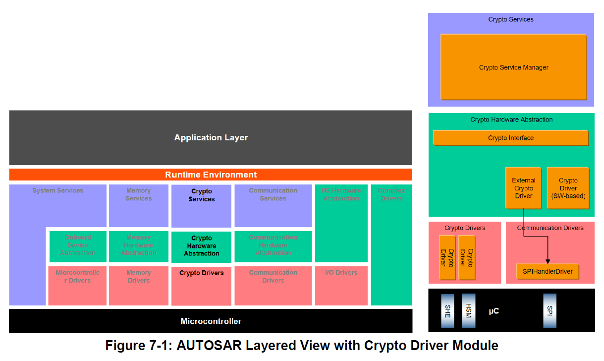

<section id="title">AUTOSAR Crypto Driver（加密驱动程序）</section>

# 1. 简介和功能概述

本规范介绍了 **AUTOSAR** 基础软件模块加密驱动程序的功能、API 和配置。

加密驱动程序位于微控制器抽象层中，该层位于加密硬件抽象层-加密接口（Crypto Interface）[4]和上层服务层-加密服务管理器（Crypto Service Manager）[5] 之下。 加密驱动程序是针对特定设备的驱动程序，它只是抽象硬件支持的功能。

加密驱动程序允许定义不同的加密驱动程序对象。如：AES 加速器、SW 组件等。这些对象可应用于不同缓冲区中的并发请求。对于每个硬件对象，应支持优先级相关的作业处理。加密软件解决方案（如：基于软件的CDD）可以定义与加密驱动程序相同的接口，用于与上层交互，并应为应用程序提供接口。

# 2. 缩略语

**CDD**
> Complex Device Driver：复杂设备驱动程序

**CSM**
> Crypto Service Manager：加密服务管理器

**CRYIF**
> Crypto Interface：加密接口

**CRYPTO**
> Crypto Driver：加密驱动程序

**DET**
> Default Error Tracer：默认错误跟踪器

**HSM**
> Hardware Security Module：硬件安全模块

**HW**
> Hardware：硬件

**SHE**
> Security Hardware Extension：安全硬件扩展

**SW**
> Software：软件

## 2.1. 专业术语

**加密驱动程序对象（Crypto Driver Object）**
> 加密驱动程序实现一个或多个加密驱动程序对象。加密驱动程序对象可以在硬件或软件中提供不同的加密原语。加密驱动程序的每个加密驱动程序对象彼此独立。每个加密驱动对象只有一个工作区（即：只能同时执行一个加密原语）加密驱动对象之间独立性的唯一例外是默认随机数生成器的使用（参见 [SWS_Crypto_00225]）。

**密钥（Key）**
> 密钥可以被 **Csm** 中的作业引用。在加密驱动程序中，每个密钥需要引用特定的密钥类型。

**密钥类型（Key Type）**
> 密钥类型由对密钥元素的引用组成。密钥类型通常由加密驱动程序的供应商预先配置。

**密钥元素（Key Element）**
> 密钥元素用于存储数据。该数据可以是例如 AES 加密所需的密钥材料或者 IV。它还可用于配置密钥管理功能的行为。

**通道（Channel）**
> 通道是从加密服务管理器队列通过加密接口到特定加密驱动程序对象的路径。

**Job**
> 作业是一个被配置的**CsmJob**。除此之外，它也可以是一个密钥、加密原语和参考通道。

**加密原语（Crypto Primitive）**
> 加密原语是在加密驱动程序对象中实现的已配置加密算法的实例。除此之外，它也可以理解为是 CSM 为应用程序提供的功能，具体强调了底层的算法家族。例如： AES、MD5、RSA 等。或者是底层的算法模式，例如：ECB、CBC 等。

**操作（Operation）**
> 一个加密原语的操作声明了应执行加密原语的哪一部分。
  
> 共有三种不同的操作模式：
* 开始（START）：此操作模式表示为一个新的加密原语请求，它应该取消之前所有相同作业和原语的请求。
* 更新（UPDATE）：此操作模式表示加密原语需要输入数据。
* 完成（FINISH）：此操作模式表示在此部分之后，所有数据都已完全馈入，加密原语可以开始完成计算。

> 通过连接操作模式参数的相应位，也可以一次执行多个操作。

**作业的优先级（Priority）**
> 作业的优先级定义了它的重要性。优先级（即：数值）越高，作业更需立即执行。加密作业的优先级属于配置的一部分。

**服务（Service）**
> 服务需按照 TR_Glossary 文档中的定义来理解：服务是一种具有已发布的接口和行为规范的操作，涉及功能提供者与潜在客户之间的合同。

# 3. 相关文档

## 3.1. 输入文件

[1] Layered Software Architecture 
> AUTOSAR_EXP_LayeredSoftwareArchitecture.pdf

[2] AUTOSAR General Requirements on Basic Software Modules 
> AUTOSAR_SRS_BSWGeneral.pdf

[3] AUTOSAR General Specification for Basic Software Modules 
> AUTOSAR_SWS_BSWGeneral.pdf

[4] AUTOSAR Specification of Crypto Interface 
> AUTOSAR_SWS_CryptoInterface.pdf

[5] AUTOSAR Specification of Crypto Service Manager 
> AUTOSAR_SWS_CryptoServiceManager.pdf

[6] AUTOSAR Requirements on Crypto Modules 
> AUTOSAR_SRS_CryptoStack.pdf

[7] AUTOSAR Specification of Secure Hardware Extension 
> AUTOSAR_TR_SecureHardwareExtension.pdf

[8] Glossary
> AUTOSAR_TR_Glossary 

[9] Specification of the 3GPP Confidentiality and Integrity Algorithms 128-EEA3 & 128-EIA3: 
> Document 1: 128-EEA3 and 128-EIA3 Specification, Version 1.7, 30th Dec 2011 

> Document 2: ZUC Specification, Version 1.6, 28th June 2011

[10] ISO/IEC 10118-3:2018 Part 3: 
> Dedicated hash-functions (SM3)

[11] ISO/IEC 14888-3:2018 IT Security techniques — Digital signatures with appendix
> Part 3: Discrete logarithm based mechanisms (SM2)

## 3.2. 相关标准规范

[12] IEC 7498-1 The Basic Model, IEC Norm, 1994

## 3.3. 相关规范

AUTOSAR 提供了基本软件通用规范（SWS BSW General）[3]，它对加密驱动程序也有效。因此，规范 SWS BSW General [3] 应被视为加密驱动程序的附加和必需规范。

# 4. 约束和假设

## 4.1. 限制
不适用

## 4.2. 适用于汽车领域

当信息安全功能被使能后，加密驱动程序模块可应用于所有域的应用程序。

# 5. 对其他模块的依赖

1. 如果使用片外加密硬件模块（例如：外部 HSM），则加密驱动程序可能需使用其他 MCAL 驱动程序（例如：SPI）的服务。

**提示：**

如果加密驱动程序使用其他 MCAL 驱动程序（例如：SPI）的服务，则必须确保在初始化加密驱动程序模块之前这些驱动程序已启动并运行。

2. 如果专用加密硬件支持，加密驱动程序应能够以非易失性方式存储密钥材料。

**注意：**

* 加密驱动程序由加密接口 (**CRYIF**) 调用，该接口根据加密接口规范 [4] 实现。
* 加密驱动程序访问底层硬件和软件对象，以使用其加密原语计算结果。结果应提交给 **CRYIF**。

# 6. 功能规格

加密驱动程序模块位于微控制器抽象层，位于**Crypto Interface**模块和**Crypto Service Manager**模块之下。它为同步和异步加密原语实现了一个通用接口。它还支持加密服务的密钥存储、密钥配置和密钥管理。

为了提供加密功能，ECU需要集成一个独特的加密服务管理器模块（**Crypto Service Manager**）和一个加密接口**Crypto Interface**。但是，加密接口可以访问多个加密驱动程序，每个驱动程序都根据底层加密驱动程序对象进行配置。

加密驱动程序对象表示独立加密硬件设备的实例（例如：AES加速器）。对于高优先级的作业，在 **HSM** 上可能有一个用于快速 **AES** 和 **CMAC** 计算的通道，它以加密驱动程序中的本机 AES 计算服务结束。但也有可能，加密驱动程序对象是一个软件，例如：用于 **RSA** 计算，其中作业能够加密、解密、签名或验证数据。加密驱动程序对象是加密通道的末端。

## 6.1. 预配置

加密驱动程序的供应商必须为代表加密驱动程序功能的加密驱动程序提供预配置。预配置需与加密驱动程序的 BSWMD 文件一起交付。

### 6.1.1. CryptoPrimitive 配置

加密驱动程序包含一个或多个加密驱动程序对象，每个对象都支持一种或多种加密原语服务。算法系列（**family**）和模式（**mode**）提供了有关如何操作加密原语服务的详细信息。例如：加密原语服务 **Encrypt** 支持系列 **AES** 和模式 **CBC**。需要通过设置次级系列值（**secondary family values**）来进一步改进。

加密驱动程序对象的 **CryptoPrimitive** 配置定义了加密原语服务的可能选项。从上面的示例中，驱动程序可以支持 **AES** 算法的 **CBC** 或 **ECB** 模式。有时这被称为特定加密原语服务的驱动程序的能力（capabilities），所以如果适用于加密服务原语，则 **CryptoPrimitive** 可以配置多个算法系列和模式值。

**CSM** 的作业配置包含对 **CsmPrimitive** 的引用。此 **CsmPrimitive** 的相应 **Config** 部分还定义了系列和模式，但其重复数设定为 1，以唯一标识作业应使用何种系列和模式组合。至少，关联的加密驱动程序对象必须包含支持配置的 **CryptoPrimitive**。 这应在配置级别确保并至少在运行时检查。

为了支持尚未在规范中建模的加密服务的新功能（在系列和模式的各种枚举中），可以在加密驱动程序中配置自定义特定算法系列和模式。**CryptoPrimitive** 引用这些自定义值以指示加密原语服务、（自定义）系列和（自定义）模式的组合是可能的。**CSM** 作业配置需要引用这些自定义配置项。

A crypto driver that supports algorithm families and algorithm modes beyond the pre-defined ones available in [ECUC_Crypto_00035], [ECUC_Crypto_00036] and/or [ECUC_Crypto_00037] shall define custom specific value algorithm families and algorithm modes through the containers CryptoPrimitiveAlgorithmFamilyCustom and CryptoPrimitiveAlgorithmModeCustom.