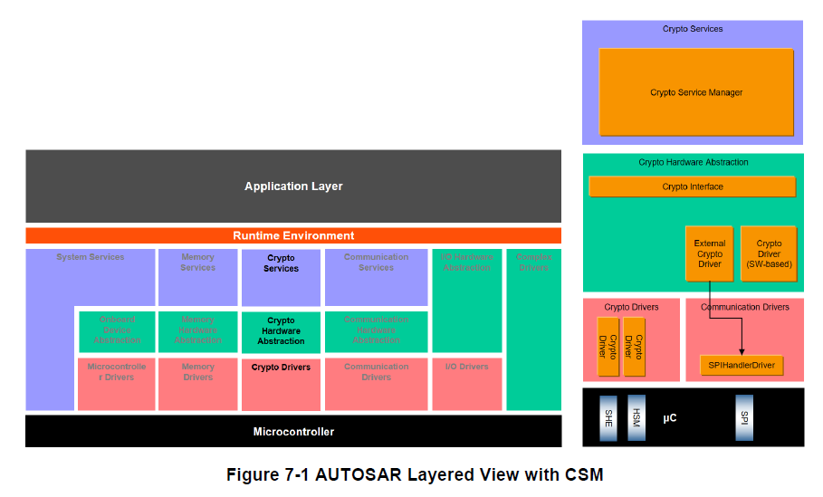
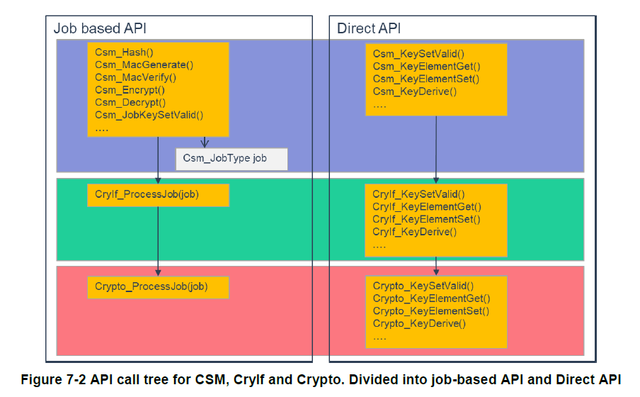
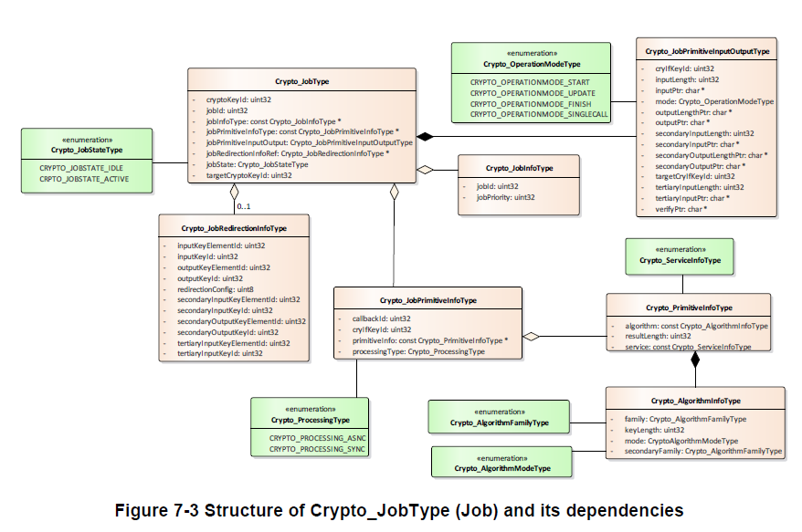
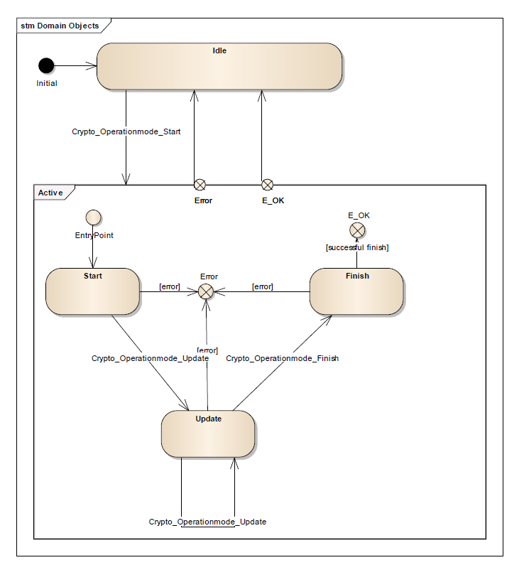
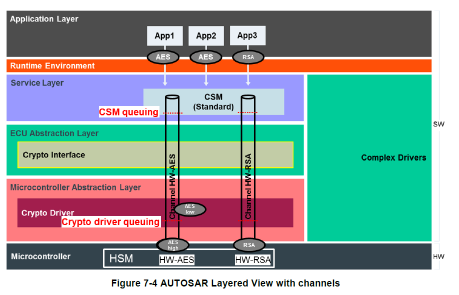
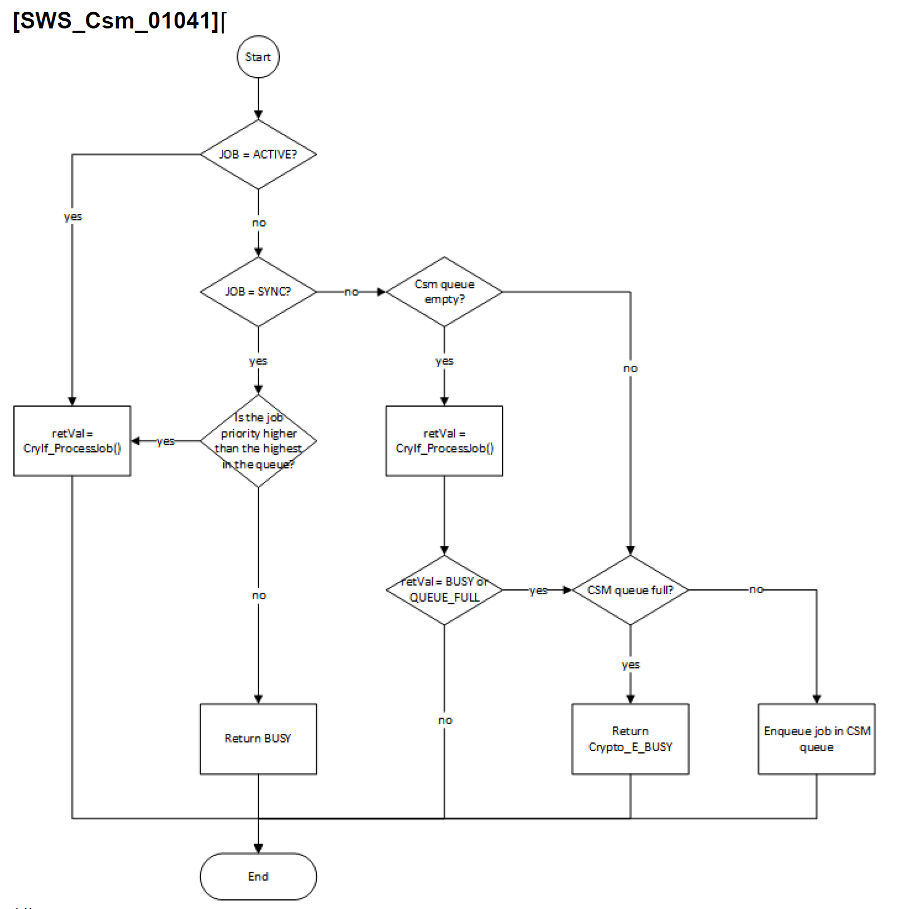

<section id="title">AUTOSAR Crypto Service Manager（加密服务管理器）</section>

# 1. 简介和功能概述

本文介绍了软件模块 **CSM** 加密服务管理器的功能、API 和配置，以对应 CSM 需求规范中的顶级要求。

**CSM** 需提供同步或异步服务，并实现对所有软件模块的基本加密功能的唯一访问。 **CSM** 提供一个抽象层，为上层的软件层提供标准化接口以访问这些加解密功能。

由于每个软件模块所需的功能可能不同于其他软件模块所需的功能，所以有可能需要为每个软件模块提供单独配置和初始化 **CSM** 的服务，同时配置还需包括对 **CSM** 服务的同步或异步处理的选择。

**CSM** 模块的构造方法遵循通用方法，当结构和接口的详细规范会限制 **CSM** 的可用性的范围时，接口和结构就会以通用方式定义。这能为将来的扩展提供了机会。

# 2. 缩略语

**AEAD**
> Authenticated Encryption with Associated Data，具有关联数据的经过身份验证的加密。

**CDD**
> Complex Device Driver，复杂设备驱动程序

**CSM**
> Crypto Service Manager，加密服务管理器

**CRYIF**
> Crypto Interface，加密接口

**CRYPTO**
> Crypto Driver，加密驱动程序

**DET**
> Default Error Tracer，默认错误跟踪器

**HSM**
> Hardware Security Module，硬件安全模块

**HW**
> Hardware，硬件

**SHE**
> Security Hardware Extension，安全硬件扩展

**SW**
> Software，软件

## 2.1. 专业术语

**加密驱动程序对象（Crypto Driver Object）**
> 加密驱动程序实现一个或多个加密驱动程序对象。加密驱动程序对象可以在硬件或软件中提供不同的加密原语。加密驱动程序的每个加密驱动程序对象彼此独立。每个加密驱动对象只有一个工作区（即：只能同时执行一个加密原语）加密驱动对象之间独立性的唯一例外是默认随机数生成器的使用（参见 [SWS_Crypto_00225]）。

**密钥（Key）**
> 密钥可以被 **Csm** 中的作业引用。在加密驱动程序中，每个密钥需要引用特定的密钥类型。

**密钥类型（Key Type）**
> 密钥类型由对密钥元素的引用组成。密钥类型通常由加密驱动程序的供应商预先配置。

**密钥元素（Key Element）**
> 密钥元素用于存储数据。该数据可以是例如 AES 加密所需的密钥材料或者 IV。它还可用于配置密钥管理功能的行为。

**通道（Channel）**
> 通道是从加密服务管理器队列通过加密接口到特定加密驱动程序对象的路径。

**Job**
> 作业是一个被配置的**CsmJob**。除此之外，它也可以是一个密钥、加密原语和参考通道。

**加密原语（Crypto Primitive）**
> 加密原语是在加密驱动程序对象中实现的已配置加密算法的实例。除此之外，它也可以理解为是 CSM 为应用程序提供的功能，具体强调了底层的算法家族。例如： AES、MD5、RSA 等。或者是底层的算法模式，例如：ECB、CBC 等。

**操作（Operation）**
> 一个加密原语的操作声明了应执行加密原语的哪一部分。
  
> 共有三种不同的操作模式：
* 开始（START）：此操作模式表示为一个新的加密原语请求，它应该取消之前所有相同作业和原语的请求。
* 更新（UPDATE）：此操作模式表示加密原语需要输入数据。
* 完成（FINISH）：此操作模式表示在此部分之后，所有数据都已完全馈入，加密原语可以开始完成计算。

> 通过连接操作模式参数的相应位，也可以一次执行多个操作。

**作业的优先级（Priority）**
> 作业的优先级定义了它的重要性。优先级（即：数值）越高，作业更需立即执行。加密作业的优先级属于配置的一部分。

**服务（Service）**
> 服务需按照 TR_Glossary 文档中的定义来理解：服务是一种具有已发布的接口和行为规范的操作，涉及功能提供者与潜在客户之间的合同。

# 3. 相关文档

## 3.1. 输入文件

[1] List of Basic Software Modules
> AUTOSAR_TR_BSWModuleList.pdf

[2] Layered Software Architecture
> AUTOSAR_EXP_LayeredSoftwareArchitecture.pdf

[3] General Requirements on Basic Software Modules
> AUTOSAR_SRS_BSWGeneral.pdf

[4] Specification of RTE Software
> AUTOSAR_SWS_RTE.pdf

[5] Specification of BSW Scheduler
> AUTOSAR_SWS_Scheduler.pdf

[6] Specification of ECU Configuration
> AUTOSAR_TPS_ECUConfiguration.pdf

[7] Specification of Memory Mapping
> AUTOSAR_SWS_MemoryMapping.pdf

[8] Specification of Default Error Tracer
> AUTOSAR_SWS_DefaultErrorTracer.doc.pdf

[9] Specification of Diagnostic Event Manager
> AUTOSAR_SWS_DiagnosticEventManager.pdf

[10] Specification of ECU State Manager
> AUTOSAR_SWS_ECUStateManager.pdf

[11] Specification of C Implementation Rules
> AUTOSAR_TR_CImplementationRules.pdf

[12] Specification of Standard Types
> AUTOSAR_SWS_StandardTypes.pdf

[13] AUTOSAR Glossary
> AUTOSAR_TR_Glossary.pdf

[14] Requirements on the Crypto Stack
> AUTOSAR_SRS_CryptoStack.pdf

[15] Specification of the Crypto Interface
> AUTOSAR_SWS_CryptoInterface.pdf

[16] Specification of the Crypto Driver
> AUTOSAR_SWS_CryptoDriver.pdf

[17] General Specification of Basic Software Modules
> AUTOSAR_SWS_BSWGeneral.pdf

## 3.2. 相关标准规范

[18] IEC 7498-1 The Basic Model, IEC Norm, 1994

[19] [IETF RFC5639](https://www.ietf.org/rfc/rfc5639.txt) Elliptic Curve Cryptography (ECC) Brainpool Standard Curves and Curve Generation, 2010

[20] [IETF RFC6637](https://www.rfc-editor.org/rfc/rfc6637) Elliptic Curve Cryptography (ECC) in OpenPGP, 2012

## 3.3. 相关规范

AUTOSAR 提供了基本软件模块的通用规范（SWS BSW General），对加密服务管理器也同样有效。所以 **SWS BSW General** 规范需被视为加密服务管理器的附加和必需规范。

# 4. 约束和假设

## 4.1. 限制

CSM 的某些类型定义以前缀 **CRYPTO_** 开头，这将违反 **SRS_BSW_00305**。这在 **4.3.1** 版中得到协调。尽管如此，由于 [constr_1050] 第1部分的限制，端口仍然被认为是兼容的。

## 4.2. 适用于汽车领域

N/A

## 4.3. 安全隐患

**CSM** 并未提供适当的用户管理，以防止未经授权访问 **CSM** 的任何服务。这意味着：如果需要任何访问保护，则必须由应用程序和为CSM服务加密库模块实现。访问权限的保护不属于 **CSM** 的范畴。

# 5. 对其他模块的依赖

**CSM** 需能够访问根据加密接口(**CRYIF**)规范实现的加密接口 。

**CSM** 模块应使用加密接口 (**CRYIF**) 与底层加密驱动程序 (**CRYPTO**) 的接口来计算加密服务的结果。

加密驱动程序的合并加密库模块或硬件扩展需提供一下的加密例程。例如：**SHA-1**、**RSA**、**AES**、**Diffie-Hellman** 密钥交换等。

# 6. 功能规格



## 6.1. 基础架构指南

**CSM** 模块设计是基于 **AUTOSAR** 分层软件架构（见图 7-1）。在AUTOSAR分层软件架构的基础上，对 **CSM** 模块架构的描述有助于理解后续章节中 **CSM** 模块的接口规范和功能。

**AUTOSAR** 的体系结构由几个层组成，如图 7-1 所示。服务层是基础软件的最高层。它的任务是为应用软件和基础软件模块提供基础服务，即为应用软件和基础软件模块提供最相关的功能。

**CSM** 是一种提供加密功能的服务，基于依赖于软件库或硬件模块的加密驱动程序。 此外，可以使用多个加密驱动程序进行混合设置。**CSM** 可通过加密接口 **CRYIF** 访问不同的加密驱动程序 **CryptoDriver**。

**CSM** 作为服务层，为 **SW-C** 或 **BSW** 提供密码操作的接口。**CSM** 的主要任务是对服务进行调度和优先级排序，并调用加密接口 (**CryIf**) 进行进一步操作。**CryIf** 将请求调度到加密驱动程序及其静态分配给此服务的加密驱动程序对象。

**CSM** 使用基于原语（**CsmPrimitives**）的静态配置来定义加密操作，然后将定义的原语分配给作业配置 (**CsmJob**)，该作业配置确定进一步的属性，如：优先级、异步或同步执行、以及操作需使用什么密钥。需注意的是，密钥始终位于加密驱动程序本身中，**CSM** 仅使用对它的引用。

密钥和原语的分离允许将用于加密操作（**cryptographic operation**）和密钥管理（**key management**）的 **API** 分开。此设计允许应用程序能够更专注于所需的加密操作，如：**MAC** 计算和验证。而密钥管理器在配置设置期间提供密钥。

**CSM** 的 **API** 大致可以分为两类：直接API（主要用于密钥管理）和基于作业的API（主要用于加解密操作）。

* 直接 API（**Direct API**）：直接对应于 **CryIf** 和加密驱动程序中的函数。这些函数只能同步调用。**CSM** 会将参数从应用程序直接传递给函数调用。 
* 基于作业的 API（**Job-based API**）：使用作业结构 **Crypto_JobType**，它包含静态和动态参数以及对结构的引用。此数据为加密驱动程序提供执行该作业所需的所有信息。每个使用作业的服务都将使用此结构。服务的所有必要参数将由 **CSM** 打包到结构的元素中，然后将调用 **CryIf**，而这又将调用配置的加密驱动程序。



根据静态配置，作业可以同步或异步运行。加密服务信息、加密算法系列和模式的参数确定了应在加密驱动程序中执行的确切加密算法。



如果配置参数 **CsmPrimitives** 中的 **AlgorithmFamily**、**AlgorithmMode** 或者 **SecondaryAlgorithmFamily** 设置为 **CRYPTO_ALGOFAM_CUSTOM** (0xFF)，则**CryptoPrimitiveAlgorithmFamilyCustom** / **CryptoPrimitiveAlgorithmFamilyCustomId** 或者 **CryptoPrimitiveAlgorithmModeCustom** / **CryptoPrimitiveAlgorithmModeCustomId** 需引用相关在加密驱动程序中的 **Crypto_AlgorithmInfoType** 中的字段 **Family**、**Mode** 或者 SecondaryFamily，而不是自定义（**0xFF**）值的本身。

## 6.2. 一般行为

作业是配置的加密原语的实例。对于每个作业，CSM 一次只能处理一个实例。

**CSM** 模块应允许并行处理不同的作业。

如果请求 **CSM** 模块的服务，同时相应的作业处于激活（**ACTIVE**）状态，则作业请求需调用 CryIf_ProcessJob() 并传递返回值。

如果请求 **CSM** 模块的服务，同时 **CSM** 作业需要排队，并且队列已满，则应拒绝作业请求，并返回错误 **CRYPTO_E_BUSY**。

如果配置了异步接口，CSM 模块应提供一个主函数 **Csm_MainFunction**()，该函数被循环调用以通过状态机控制作业的处理。

### 6.2.1. 普通操作

为了将单个调用函数和加密服务的流方法结合起来，可通过Mode参数来决定操作的模式。次服务操作是一个标志字段，用了表示操作方式：**START**、**UPDATE** 或**FINISH**。它明确声明需执行什么样的操作。这些操作模式可以混合，一次执行多个操作。下图表显示了此设计的作业的状态机。



**注意：**

状态的实际事务是在与这些状态一起工作的层中进行的，即：包含在加密驱动程序中。

**CSM** 加密服务需能通过一次调用处理来支持多种操作模式的输入。

如果设置了 **CRYPTO_OPERATIONMODE_START** 和 **CRYPTO_OPERATIONMODE_FINISH** 位并且未设置 **CRYPTO_OPERATIONMODE_UPDATE**，则 Csm_\<Service\>() 函数需返回 **E_NOT_OK**。

**注意：**

由于单一连贯的方法调用开销较少，所以可以提升性能。因为只需调用一次，而无需多次显式地调用 **API**，这种方法可用于需要快速处理的小数据输入。

但在使用流方法。如：**START**, **UPDATE**, **FINISH** 操作时。专用加密驱动程序对象会一直处于等待进一步的输入（UPDATE），直到切换到 **FINISH** 状态。在此期间 **Crypto Driver** 实例也无法同时处理其他的作业。

#### 6.2.1.1. 配置

每个加密原语配置都需实现为一个 **Crypto_PrimitiveInfoType** 类型的常量结构。

每个作业原语配置都需实现为一个 **Crypto_JobPrimitiveInfoType** 类型的常量结构。

**CSM** 配置应该可以为每个加密原语创建多个配置。

**CSM** 配置需支持一个原语对应一个作业。

当创建原语配置时，应该可以从底层加密驱动对象选择所有可用和允许的配置方案。

如果选择异步接口，每个作业原语配置需包含一个回调函数。

#### 6.2.1.2. 同步作业处理

当使用同步接口时，接口函数需在底层加密堆栈模块的支持下能够立即计算出结果。

如果发出同步作业并且优先级大于队列中可用的最高优先级，则 **CSM** 将会禁止再处理队列中的新作业，直到处理完当前作业后，轮到下一次主函数（**Main Function**）被调用。

**注意：**

1. 一个通道可能包含异步和同步处理类型的作业。如果是这样，虽然同步作业的优先级高于所有异步作业的优先级，但它可能不会被接受进行处理。
2. 由于底层加密驱动程序 **Crypto Driver** 可以有自己的队列，所以不能始终确保应用程序提供的最高优先级作业一定会被优先处理。

如果一个同步作业被发出并且优先级低于队列中可用的最高优先级，**CSM** 将返回 **CRYPTO_E_BUSY**。

**注意：**

如果同步作业具有较高的优先级，为了确保同步作业可以被连续地处理，而不必等待其间的异步作业，则可以通过暂停对 **CSM** 主函数（**Main Function**）的调用来实现。例如: 调用同步作业期间的访问 **critical sections**。 同时也需考虑在加密驱动程序对象中禁用队列排队，以确保同步作业能被快速处理。

如果从队列中加载异步作业不应被同步作业暂停，则同步作业的优先级必须小于异步作业。

#### 6.2.1.3. 异步作业处理

如果使用异步接口，接口函数只需将必要的信息转交给底层的加密栈模块处理即可。

当请求的加密服务被处理时，作业原语中所配置回调回调函数需被调用，**CSM** 的用户需得到相应地通知。

## 6.3. CSM模块启动

**Csm_Init**() 请求不负责触发底层 **CRYIF** 的初始化。假定底层 **CRYIF** 将由任何适当的实体（例如：BswM）初始化。

使用 **CSM** 模块的软件组件应负责检查 **CSM** 模块启动产生的全局错误和状态信息。

## 6.4. 加密服务

### 6.4.1. 6.4.1 CSM 加密服务的使用

**CSM** 加密服务需提供 Csm_\<Service\>() API。

应用程序需能够使用操作模式 **CRYPTO_OPERATIONMODE_START** 调用 Csm_\<Service\>()，以初始化加密计算。

应用程序需能够使用操作模式 **CRYPTO_OPERATIONMODE_UPDATE** 任意地（但至少一次）调用 Csm_\<Service\>()，以将输入数据提供给作业的加密原语。

应用程序需能够使用操作模式 **CRYPTO_OPERATIONMODE_FINISH** 调用 Csm_\<Service\>() 以完成加密计算。

以下服务操作需支持 API 指定的操作模式 START、UPDATE 和 FINISH：

* HASH
* MACGENERATE
* MACVERIFY
* ENCRYPT
* DECRYPT
* AEAD_ENCRYPT
* AEAD_DECRYPT
* SIGNATUREGENERATE
* SIGNATUREVERIFY 

对于所有其他服务操作，**CSM** 需将操作模式设置为 **CRYPTO_OPERATIONMODE_SINGLECALL**，即使 API 不提供操作模式。

**注意：**

Csm_\<Service\>() 会使用一个指向 **Crypto_JobType** 的指针，调用 CryIf_ProcessJob()，其中存储了处理作业所需的所有信息。

此 **Crypto_JobType** 的一部分是 **Crypto_JobPrimitiveInputOutputType**，其中存储了有关取决于服务的输入和输出参数的所有信息。从 Csm_\<Service\>() 的 **API** 参数到 **Crypto_JobPrimitiveInputOutputType** 的参数的映射定义，可以在加密驱动程序规范的 [SWS_Crypto_00073] 中找到。

如果 CSM 向加密接口发出服务 CRYPTO_MACGENERATE、CRYPTO_MACVERIFY、CRYPTO_ENCRYPT、CRYPTO_DECRYPT、CRYPTO_AEADENCRYPT、CRYPTO_AEADDECRYPT、 CRYPTO_RANDOMGENERATE、CRYPTO_SIGNATUREGENERATE 或者 CRYPTO_SIGNATUREVERIFY，它需要确保 **Crypto_JobType** 作业结构中的元素 jobPrimitiveInfo->cryIfKeyId 引用该作业的分配密钥。

Note: The CryIf is responsible to transform this ID to the corresponding key ID of the respective crypto driver.

If one of the primitive services CRYPTO_KEYSETVALID, CRYPTO_KEYSETINVALID, CRYPTO_RANDOMSEED, CRYPTO_KEYGENERATE, CRYPTO_KEYDERIVE, CRYPTO_KEYEXCHANGECALCPUBVAL or CRYPTO_KEYEXCHANGECALCSECRET are to be executed, the CSM shall fill in the elements of the structure Csm_JobType->jobPrimitiveInputOutput->cryIfKeyId and, if applicable, Csm_JobType->jobPrimitiveInputOutput->targetCryIfKeyId with the corresponding CryIf key ID.

Note: The CryIf is responsible to transform these IDs to the corresponding key IDs of the respective crypto driver.

**注意：**

**CryIf** 负责将这些 **ID** 转换为相应加密驱动程序的相应密钥 **ID**。

如果要执行原语服务 CRYPTO_KEYSETVALID、CRYPTO_KEYSETINVALID,、CRYPTO_RANDOMSEED,、CRYPTO_KEYGENERATE、CRYPTO_KEYDERIVE、CRYPTO_KEYEXCHANGECALCPUBVAL 或者 CRYPTO_KEYEXCHANGECALCSECRET ，**CSM** 需使用相应的 **CryIf** 密钥 ID 填充结构 Csm_JobType->jobPrimitiveInputOutput->cryIfKeyId 的元素。如果适用，Csm_JobType->jobPrimitiveInputOutput->targetCryIfKeyId 的元素。

**注意：**

**CryIf** 负责将这些 **ID** 转换为相应加密驱动程序的相应密钥 **ID**。

### 6.4.2. 队列

**CSM** 可能有多个队列，其中作业根据其优先级排列，以处理多个加密请求。从 **CSM** 队列通过 **CryIf** 到加密驱动程序对象的路径称为通道。**CSM** 的每个队列都映射到一个通道以访问加密驱动程序对象的加密原语。队列的大小是可配置的。

为了优化 **Crypto Driver Object** 的硬件使用，**Crypto Driver** 中也有一个可选的队列。

加密驱动程序对象表示独立加密设备的实例。包括：硬件或软件。例如：AES 加速器。对于高优先级作业，在 **HSM** 上可能有一个用于快速 **AES** 和 **CMAC** 计算的通道，该通道地终点为加密驱动程序中的本机 AES 计算服务。但也有可能，加密驱动程序对象是一个软件，例如：用户可以使用 **RSA** 算法加密、解密、签名或验证数据。



图 **7-4** 说明了带有通道的 **AUTOSAR** 分层视图。在此示例中包含一个 **HSM** 和两个加密驱动程序对象（**Crypto Driver Object**），包括 **HW-AES** 和 **HW-RSA**。同时每个对象都有自己的通道，每个通道都连接到一个 **CSM** 队列和一个加密驱动程序对象队列。

在这种情况下，两个加密驱动对象都在处理一个加密作业 **AES-high** 和 **RSA**，而加密驱动对象的队列又包含一个作业 **AES-low**。如果 **HSM** 的 **HW-AES** 完成了 **AES-high** 作业，**AES-low** 作业将作为下一个作业处理。

在此相同设置的场景下，未在处理中或者队列中的作业，具体推导如下：

* 应用程序有新的作业需要使用 **RSA** 算法。
* 如果 **RSA** 的加密驱动程序对象（**Crypto Driver Object**）不忙，将立即处理该作业。
* 如果 **RSA** 的加密驱动程序对象（**Crypto Driver Object**）繁忙，加密驱动程序对象的队列未满，则作业将按其优先级顺序列在该队列中。一旦加密驱动对象空闲，就会执行此加密驱动对象队列中优先级最高的作业。
* 如果 **RSA** 的加密驱动程序对象（**Crypto Driver Object**）繁忙，加密驱动程序对象的队列已满，则作业将按优先级顺序存储在 **CSM** 队列中。
* 如果 **RSA** 的加密驱动程序对象（**Crypto Driver Object**）繁忙，加密驱动程序对象的队列和 **CSM** 队列都满了，则 **CSM** 需拒绝请求。
* 如果 **RSA** 的加密驱动程序对象（**Crypto Driver Object**）处于活动状态（**active**），说明作业已在加密驱动程序中被启动，它处于等待更多数据处理指令（**UPDATE**）或者完成（**FINISH**）命令。

**CSM** 作业进行排队可以在配置参数 **CsmQueues** 进行配置。同时 **CsmQueues** 需根据配置的作业优先级对作业进行排序。作业优先级数值越大表明作业的优先级越高。

只有在保证作业结构的数据一致性的情况下，才能将服务操作加入队列。当将具有相同 jobID 的服务添加到队列时，应特别考虑这一点。例如：调用 Csm_SignatureVerify()，随后调用Csm_SaveContextJob()的情况。如果不能保证这一点，服务操作将返回 **E_BUSY**。

如果具有相同JobID的服务可以被添加到队列中，则这些服务的执行顺序应与传入服务操作请求的顺序相对应。即符合先进先出的顺序。

Csm_\<Service\>() 函数的行为需如下图所示。



因为对于同步作业处理来说，队列排队可能用途不大。所以如果选择了同步作业处理，则建议把队列大小设定为 **0**。 但是，如果通道同时支持同步和异步作业，则队列排队机制还是有使用的必要。在 **Csm_MainFunction**() 中，可以将排队的作业传递给给 **CRYIF** 模块。

如果当前作业的状态为活动状态，**CSM** 需假设映射的加密驱动程序实例当前正在处理该作业。当调用者希望继续操作（例如：使用 **UPDATE** 操作提供更多数据），加密驱动程序实例中必须执行合理性地检查（**plausibility check**）。

## 6.5. 密钥管理

属于密钥管理的服务需仅提供 Csm_\<Service\>() 函数。一个密钥（**Key**）可以包括一个或多个密钥元素（**Key Element**）组成。

密钥元素是密钥材料本身。如：

* 初始化向量（**initialization vector**）。
* 随机数生成的种子（**a seed for random number generation**）。
* 符合 **SHE** 标准的证明（**the proof of the SHE standard**）。

密钥是相应的密钥 ID 在配置中地一个给定的符号名称。Crypto Stack API 使用 **CSM** 模块中的以下密钥元素索引定义：

| Crypto Service | key element      | key element Name                   | key element ID |
| -------------- | ---------------- | ---------------------------------- | -------------- |
| MAC            | Key Material     | CRYPTO_KE_MAC_KEY                  | 1              |
| MAC            | Proof (SHE)      | CRYPTO_KE_MAC_PROOF                | 2              |
| MAC            | Seed             | CRYPTO_KE_KEYGENERATE_SEED         | 16             |
| Signature      | Key Material     | CRYPTO_KE_SIGNATURE_KEY            | 1              |
| Signature      | ECC curve type   | CRYPTO_KE_SIGNATURE_CURVETYPE      | 29             |
| Random         | Seed State       | CRYPTO_KE_RANDOM_SEED_STATE        | 3              |
| Random         | Algorithm        | CRYPTO_KE_RANDOM_ALGORITHM         | 4              |
| Cipher/AEAD    | Key Material     | CRYPTO_KE_CIPHER_KEY               | 1              |
| Cipher/AEAD    | Proof (SHE)      | CRYPTO_KE_CIPHER_PROOF             | 2              |
| Cipher/AEAD    | Init Vector      | CRYPTO_KE_CIPHER_IV                | 5              |
| Cipher/AEAD    | 2nd Key Material | CRYPTO_KE_CIPHER_2NDKEY            | 7              |
| Key Exchange   | Base             | CRYPTO_KE_KEYEXCHANGE_BASE         | 8              |
| Key Exchange   | Private Key      | CRYPTO_KE_KEYEXCHANGE_PRIVKEY      | 9              |
| Key Exchange   | Own Public Key   | CRYPTO_KE_KEYEXCHANGE_OWNPUBKEY    | 10             |
| Key Exchange   | Shared Value     | CRYPTO_KE_KEYEXCHANGE_SHAREDVALUE  | 1              |
| Key Exchange   | Algorithm        | CRYPTO_KE_KEYEXCHANGE_ALGORITHM    | 12             |
| Key Exchange   | ECC curve type   | CRYPTO_KE_KEYEXCHANGE_CURVETYPE    | 29             |
| Key Derivation | Password         | CRYPTO_KE_KEYDERIVATION_PASSWORD   | 1              |
| Key Derivation | Salt             | CRYPTO_KE_KEYDERIVATION_SALT       | 13             |
| Key Derivation | Iterations       | CRYPTO_KE_KEYDERIVATION_ITERATIONS | 14             |
| Key Derivation | Algorithm        | CRYPTO_KE_KEYDERIVATION_ALGORITHM  | 15             |
| Key Derivation | ECC curve type   | CRYPTO_KE_KEYDERIVATION_CURVETYPE  | 29             |
| Key Generate   | Key Material     | CRYPTO_KE_KEYGENERATE_KEY          | 1              |
| Key Generate   | Seed             | CRYPTO_KE_KEYGENERATE_SEED         | 16             |
| Key Generate   | Algorithm        | CRYPTO_KE_KEYGENERATE_ALGORITHM    | 17             |
| Key Generate   | ECC curve type   | CRYPTO_KE_KEYGENERATE_CURVETYPE    | 29             |

密钥元素索引可以由供应商进行扩展。

对于包含加密密钥材料的每个密钥元素，所提供密钥的格式应在用于数据交换的配置中指定。例如：对于 Csm_KeyElementGet() 或 Csm_KeyElementSet()。特定加密驱动程序支持的密钥格式是加密驱动程序附带的预配置信息的一部分。

可以使用以下密钥格式：

**CRYPTO_KE_FORMAT_BIN_OCTET**
> 密钥以二进制形式作为八位字节值提供。

**CRYPTO_KE_FORMAT_BIN_SHEKEYS**
> SHE 操作的组合输入/输出键（M1+M2+M3）和（M4+M5）。

**CRYPTO_KE_FORMAT_BIN_IDENT_PRIVATEKEY_PKCS8**
> 带有标识的 ASN.1 编码形式（BER 编码）的私钥材料。数据以二进制形式提供。

**CRYPTO_KE_FORMAT_BIN_IDENT_PUBLICKEY**
> 带有标识的 ASN.1 编码形式（BER 编码）的公钥材料。 数据以二进制形式提供。

**CRYPTO_KE_FORMAT_BIN_RSA_PRIVATEKEY**
> ASN.1 编码形式（BER 编码）的私钥材料。 密钥材料以二进制形式提供。

**CRYPTO_KE_FORMAT_BIN_RSA_PUBLICKEY**
> ASN.1 编码形式（BER 编码）的公钥材料。 密钥材料以二进制形式提供。


**基本原理：**

非对称密钥可以提供或不提供标识。该标识用于唯一标识提供的密钥本身，以便密钥解析器可以检查密钥材料是否合适。如果没有标识，密钥材料必须与为此密钥指定的格式相对应。按照 IETF 标准，密钥的标识作为对象标识符 (OID) 作为 ASN.1 描述的一部分提供。

供应商特定的 keyElementIds 应该从 1000 开始，以避免干扰加密堆栈的未来扩展版本。

**注意：**

密钥元素 CRYPTO_KE_\[…\]_ALGORITHM 用于配置密钥管理功能的行为。因为它们独立于作业，所以不能像原语那样配置。

如果密码原语使用椭圆曲线算法，但其算法族和算法模式不能充分指定具体的曲线参数，则应使用 **CRYPTO_KE_xxxxx_CURVETYPE** 类型的附加密钥元素来提供所需信息。此信息是在运行时通过密钥元素接口设置的。密钥元素的数据应按照[19]和[20]中定义的格式设置其对象标识符。

示例：用于签名生成的 ECC Brainpool 160 P1 密钥的定义。

```C
P2CONST(uint8, AUTOMATIC, MSN_CONST) EccKey = { 
    0x12, 0x23, 0x34, ... 
} ; // The required key value.

// According to RFC5639:
// {iso(1) identified-organization(3) teletrust(36) 
// algorithm(3) signatureAlgorithm(3) ecSign(2) 
// ecStdCurvesAndGeneration(8) ellipticCurve(1)}
// brainpoolP160r1(1)

P2CONST(uint8, AUTOMATIC, MSN_CONST) EccType =
{ 1, 3, 36, 3, 3, 2, 8, 1, 1 } ; //OID definition of ECC Brainpool 160 P1

Csm_KeyElementSet(MyEccKeyId, CRYPTO_KE_SIGNATURE_KEY, EccKey, sizeof(EccKey) );

Csm_KeyElementSet(MyEccKeyId, CRYPTO_KE_SIGNATURE_CURVETYPE, EccType, sizeof(EccType) );

Csm_KeySetValid(MyEccKeyId);
```

## 6.6. 加密作业输入和/或输出的重定向

作业的输入或输出数据可以重定向到密钥元素（**Key element**）。密钥及其密钥元素重定向到哪个输入输出值，只能编译时静态配置，在运行期间是不允许更改的。

如果作业的输入或输出数据被重定向到密钥元素，即 **CsmInOutRedirectionRef** 存在，并且相应的输入或输出长度值不为 **0**，则不应处理该作业并应返回 **E_NOT_OK**。

如果作业的输入或输出重定向并未用于作业元素（**Job Element**），即：**CsmInOutRedirectionRef** 不存在，则 **jobRedirectionInfoRef** 需被设置为 **NULL_PTR**。 如果使用重定向元素，即：**CsmInOutRedirectionRef** 存在，则**jobRedirectionInfoRef** 应指向 **Crypto_JobRedirectionInfoType** 结构。

结构 **Crypto_JobRedirectionInfoType** 包含哪些密钥元素将用于重定向的信息。提供了一个称为 **redirectionConfig** 的位字段，用于指示重定向哪个输入和/或输出值。

**redirectionConfig** 的值是一个位编码值，用于指示哪个输入和输出缓冲区被重定向。 如果 **redirectionConfig** 的最低有效位（第 1 位 或 0x01）被设置为主输入键并且它的元素被重定向，并且 **inputKeyId** 和 **inputKeyElementId** 的值必须指示用于输入缓冲区的元素而不是 **inputPtr** 及其长度。如果设置了第 **1** 位，则将 **secondaryInputBuffer** 重定向到已设置的辅助输入键，并且必须设置键和密钥元素。而第 **2** 位用于第三输入键。第 3 位保留供将来使用。

如果第 **4** 位被设置，则 outputPtr 被重定向到输出键的输出密钥元素。第 **5** 位表示将辅助输出缓冲区重定向到辅助键及其密钥元素。如果某个位设置为 0，则输入或输出不应重定向到相关的密钥元素。

示例：**00110001** 的 **redirectionConfig** 值表示应从 **inputKeyId** 的 **inputKeyElement** 收集输入，输出缓冲区和辅助输出缓冲区应重定向到 **outputKeyId** 的**outputKeyElement** 和 **secondaryOutputKeyId** 的 **secondaryOutputKeyElement**。

## 6.7. 作业上下文接口

作业的上下文接口允许为来自加密驱动程序的特定加密服务保存或恢复工作区的上下文数据。这允许将所有动态创建的数据存储在加密驱动程序中，以便稍后可以恢复它以在保存上下文快照的确切位置继续此前的操作。

同时密钥元素数据不受任何影响。也就是说密钥元素不属于上下文数据的一部分。而且在必要时必须由密钥元素接口进行单独的设置或读取。

在调用 **Csm_SaveContextJob**() 或 **Csm_RestoreContextJob**() 时，**CSM** 需检查相关作业当前是否处于活动状态。

* 如果作业处于活动状态，操作需按照规范继续下去。
* 如果作业处于空闲状态，函数需立即返回 **E_NOT_OK**。

在调用 **Csm_SaveContextJob**() 或 **Csm_RestoreContextJob**() 时，**CSM** 应检查相关作业当前是否正在积极处理数据。这意味着 **CSM** 已将与此作业相关的操作安排提交给了驱动程序，并正在等待处理响应。在这种情况下，函数需立即返回 **E_NOT_OK**。

在调用 **Csm_SaveContextJob**() 或 **Csm_RestoreContextJob**() 时，**CSM** 应检查作业是否引用 **CsmPrimitive**、**CsmHash**、**CsmEncrypt**、**CsmEncryptAEAD**、**CsmDecryptAEAD**、**CsmDecrypt**、**CsmMacGenerate**、**CsmMacVerify**、**CsmSignatureGenerate** 或 **CsmSignatureVerify**。 如果是，操作应按规定继续。否则，不应执行该操作，并且当 **CsmDevErrorDetect** 设定为 **true** 时，需将 **CSM_E_SERVICE_TYPE** 报告给 **DET**。

## 6.8. 多核系统

如果 Crypto-Stack 分布在多个分区中，**Csm** 应允许在不同分区中调用其 \<sevice\> API。

**CsmQueues** 需在通过 **CsmJobMainFunctionRef** 引用的 **MainFunction** 中进行处理。

**注意：**

如果 **CsmJob** 根本没有在 **MainFunction** 上下文中处理（如：同步接口），则 **MainFunction** （通过相应的 CsmQueue）分配到 **CsmJob** 所被分配到的分区。

**Csm** 模块需使用适当的机制，以允许从其 **CsmJobs** 分配到的分区里，调用 Csm_\<Service\>() API。

# 7. API规范

## 7.1. 通用接口

### 7.1.1. Csm_Init

**说明**: 初始化 **CSM** 模块。 在配置中 **Csm** 被分配给多个分区（即: **Csm_MainFunctions** 被映射到分区），**Csm** 可以为每个分区提供一个初始化函数。

```C
void Csm_Init ( 
    const Csm_ConfigType* configPtr 
)
```

### 7.1.2. Csm_GetVersionInfo

**说明**: 返回此模块的版本信息。

```C
void Csm_GetVersionInfo ( 
    Std_VersionInfoType* versioninfo 
)
```

## 7.2. 哈希接口

加密散列函数是一种确定性过程，它采用任意数据块并返回固定大小的位串，散列值。这样对数据的意外或有意更改将更改散列值。哈希函数的主要特性是无法找到具有给定哈希值的消息或找到具有相同哈希值的两个不同消息。

### 7.2.1. Csm_Hash

**说明**: 使用给定的数据执行哈希计算并存储哈希。

```C
Std_ReturnType Csm_Hash ( 
    uint32 jobId, 
    Crypto_OperationModeType mode, 
    const uint8* dataPtr, 
    uint32 dataLength, 
    uint8* resultPtr, 
    uint32* resultLengthPtr 
)
```

## 7.3. MAC接口

消息验证码MAC（**message authentication code**）是用于验证消息的一小段信息。MAC 算法接受密钥和要验证的任意长度消息作为输入，并最终输出 **MAC**。 **MAC** 值通过允许验证者（也拥有密钥）检测消息内容的任何更改来保护消息的数据完整性及其真实性。

### 7.3.1. Csm_MacGenerate

**说明**: 使用给定数据执行 **MAC** 生成并将 **MAC** 存储在 **MAC** 指针指向的内存位置。

```C
Std_ReturnType Csm_MacGenerate ( 
    uint32 jobId, 
    Crypto_OperationModeType mode, 
    const uint8* dataPtr, 
    uint32 dataLength, 
    uint8* macPtr, 
    uint32* macLengthPtr 
)
```

### 7.3.2. Csm_MacVerify

**说明**: 通过比较是否使用给定数据生成 **MAC** 来验证给定的 **MAC**。

```C
Std_ReturnType Csm_MacVerify ( 
    uint32 jobId, 
    Crypto_OperationModeType mode, 
    const uint8* dataPtr, 
    uint32 dataLength, 
    const uint8* macPtr, 
    const uint32 macLength, 
    Crypto_VerifyResultType* verifyPtr 
)
```

## 7.4. 加解密接口 

加解密接口（**Cipher Interface**）可用于对称和非对称加密或解密。此外，还可以将这些接口分别用于压缩和解压缩。

### 7.4.1. Csm_Encrypt

**说明**: 加密给定数据并将密文存储在结果指针指向的内存位置。

```C
Std_ReturnType Csm_Encrypt ( 
    uint32 jobId, 
    Crypto_OperationModeType mode, 
    const uint8* dataPtr, 
    uint32 dataLength, 
    uint8* resultPtr, 
    uint32* resultLengthPtr 
)
```

### 7.4.2. Csm_Decrypt

**说明**: 解密给定的加密数据，并将解密后的明文存储在结果指针指向的内存位置。

```C
Std_ReturnType Csm_Decrypt ( 
    uint32 jobId, 
    Crypto_OperationModeType mode, 
    const uint8* dataPtr, 
    uint32 dataLength, 
    uint8* resultPtr, 
    uint32* resultLengthPtr 
)
```

## 7.5. 带关联数据 (AEAD) 接口的认证加密

AEAD（也称为经过身份验证的加密）是一种块密码操作模式，它还允许进行完整性检查（例如：AES-GCM）。

### 7.5.1. Csm_AEADEncrypt

**说明**: 使用给定的输入数据执行 **AEAD** 加密，并将密文和 **MAC** 存储在密文指针和 **Tag** 指针指向的内存位置。

```C
Std_ReturnType Csm_AEADEncrypt ( 
    uint32 jobId, 
    Crypto_OperationModeType mode, 
    const uint8* plaintextPtr, 
    uint32 plaintextLength, 
    const uint8* associatedDataPtr, 
    uint32 associatedDataLength, 
    uint8* ciphertextPtr, 
    uint32* ciphertextLengthPtr, 
    uint8* tagPtr, 
    uint32* tagLengthPtr 
)
```

### 7.5.2. Csm_AEADDecrypt

**说明**: 使用给定数据执行 **AEAD** 加密，并将密文和 **MAC** 存储在密文指针和 **Tag** 指针指向的内存位置。

```C
Std_ReturnType Csm_AEADDecrypt ( 
    uint32 jobId, 
    Crypto_OperationModeType mode, 
    const uint8* ciphertextPtr, 
    uint32 ciphertextLength, 
    const uint8* associatedDataPtr, 
    uint32 associatedDataLength, 
    const uint8* tagPtr, 
    uint32 tagLength, 
    uint8* plaintextPtr, 
    uint32* plaintextLengthPtr, 
    Crypto_VerifyResultType* verifyPtr 
)
```

## 7.6. 签名接口

数字签名是一种非对称密码术。数字签名在许多方面等同于传统的手写签名。

数字签名可用于验证消息的来源以及证明签名消息的完整性。如果邮件经过数字签名，则签名后邮件中的任何更改都将使签名无效。此外，没有有效的方法来修改消息及其签名以生成具有有效签名的新消息。

### 7.6.1. Csm_SignatureGenerate

**说明**: 使用给定的数据进行签名计算，并将签名存储在结果指针指向的内存位置。

```C
Std_ReturnType Csm_SignatureGenerate ( 
    uint32 jobId, 
    Crypto_OperationModeType mode, 
    const uint8* dataPtr, 
    uint32 dataLength, 
    uint8* signaturePtr, 
    uint32* signatureLengthPtr 
)
```

### 7.6.2. Csm_SignatureVerify

**说明**: 通过比较是否使用给定数据生成签名来验证给定的 **MAC**。

```C
Std_ReturnType Csm_SignatureVerify ( 
    uint32 jobId, 
    Crypto_OperationModeType mode, 
    const uint8* dataPtr, 
    uint32 dataLength, 
    const uint8* signaturePtr, 
    uint32 signatureLength, 
    Crypto_VerifyResultType* verifyPtr
)
```

## 7.7. 随机数接口

随机数接口提供随机数的生成。随机数可以由物理设备（真随机数生成器）或计算算法（伪随机数生成器）生成。伪随机数发生器的随机性可以通过适当的种子选择来增加。

**注意：**

随机生成器的播种方式是项目特定的，超出了本规范的范围。如果适用，应在请求任何随机数之前执行适当的播种操作。建议使用 **ECU** 集中式熵生成来为随机数生成器提供种子。特别是如果硬件中没有真正的随机数生成器 (TRNG) 可用于生成随机数。

### 7.7.1. Csm_RandomGenerate

**说明**: 产生一个随机数，存放在结果指针指向的内存位置。

```C
Std_ReturnType Csm_RandomGenerate ( 
    uint32 jobId, 
    uint8* resultPtr, 
    uint32* resultLengthPtr
)
```

## 7.8. 密钥管理接口

以下接口用于密钥管理。基本上，一个密钥包含一个或多个密钥元素。 一个密钥元素可以是多个密钥的一部分。例如：允许从具有一个 **keyId** 的密码，派生出一个密钥元素，并使用这个派生的密钥元素与另一个 **keyId** 一起进行加密。

**注意：**

如果要修改的实际密钥元素直接映射到闪存，调用密钥管理函数（同步操作）时可能会有更大的延迟。

如果调用密钥管理函数，**CSM** 将禁止处理队列中的新作业，直到下一次调用主函数。

### 7.8.1. 密钥设置接口

#### 7.8.1.1. Csm_KeyElementSet

**说明**: 将给定的密钥元素字节设置为由 **keyId** 标识的键。

```C
Std_ReturnType Csm_KeyElementSet ( 
    uint32 keyId, 
    uint32 keyElementId, 
    const uint8* keyElementPtr, 
    uint32 keyElementLength
)
```

#### 7.8.1.2. Csm_KeySetValid

**说明**: 将由 **keyId** 标识的密钥的密钥状态设置为有效。

```C
Std_ReturnType Csm_KeySetValid ( 
    uint32 keyId 
)
```

#### 7.8.1.3. Csm_KeySetInvalid

**说明**: 将密钥状态设置为无效。密钥不能再用于加密操作，直到它再次被设置为有效状态。

```C
Std_ReturnType Csm_KeySetInvalid ( 
    uint32 keyId 
)
```

### 7.8.2. 密钥状态接口

#### 7.8.2.1. Csm_KeyGetStatus

**说明**: 返回由 **keyId** 标识的密钥的密钥状态。

```C
Std_ReturnType Csm_KeyGetStatus ( 
    uint32 keyId, 
    Crypto_KeyStatusType* keyStatusPtr
)
```

### 7.8.3. 密钥提取接口

#### 7.8.3.1. Csm_KeyElementGet

**说明**: 从由 **keyId** 标识的密钥的特定密钥元素中检索密钥元素字节，并将密钥元素存储在密钥指针指向的内存位置。

```C
Std_ReturnType Csm_KeyElementGet ( 
    uint32 keyId, 
    uint32 keyElementId, 
    uint8* keyElementPtr, 
    uint32* keyElementLengthPtr 
)
```

### 7.8.4. Key Copying Interface

#### 7.8.4.1. Csm_KeyElementCopy

**说明**: 此函数将密钥元素从一个密钥复制到目标键。

```C
Std_ReturnType Csm_KeyElementCopy ( 
    const uint32 keyId, 
    const uint32 keyElementId, 
    const uint32 targetKeyId, 
    const uint32 targetKeyElementId 
)
```

#### 7.8.4.2. Csm_KeyCopy

**说明**: 此函数将所有密钥元素从源密钥复制到目标密钥。
```C
Std_ReturnType Csm_KeyCopy ( 
    const uint32 keyId, 
    const uint32 targetKeyId 
)
```

#### 7.8.4.3. Csm_KeyElementCopyPartial

**说明**: 将一个密钥元素复制到同一加密驱动程序中的另一个密钥元素。 keyElementSourceOffset 和 keyElementCopyLength 允许仅将源密钥元素的一部分复制到目标中。目标键的偏移量也用这个函数指定。

```C
Std_ReturnType Csm_KeyElementCopyPartial ( 
    uint32 keyId, 
    uint32 keyElementId, 
    uint32 keyElementSourceOffset, 
    uint32 keyElementTargetOffset, 
    uint32 keyElementCopyLength, 
    uint32 targetKeyId, 
    uint32 targetKeyElementId 
)
```

### 7.8.5. 密钥生成接口

密钥生成接口用于根据密钥元素 **CRYPTO_KE_KEYGENERATE_ALGORITHM** 中定义的算法生成密钥到密钥元素 **CRYPTO_KE_KEYGENERATE_KEY** 中。

密钥将会通过位于密钥元素 **CRYPTO_KE_KEYGENERATE_SEED** 中的随机值生成。

例如：可以使用函数 **Csm_RandomGenerate**() 生成随机值，并且必须在触发密钥生成之前将其存储在 **CRYPTO_KE_KEYGENERATE_SEED** 中。

重要的是要检查随机性的质量及其种子的熵，这取决于所使用的硬件和软件协议栈。随机性对生成的密钥材料的质量有重大影响。

Id 为 **CRYPTO_KE_KEYGENERATE_ALGORITHM** 的密钥元素包含来自 **Crypto_AlgorithmFamilyType** 的类型。例如 **CRYPTO_ALGOFAM_AES**、**CRYPTO_ALGOFAM_RSA** 或 **CRYPTO_ALGOFAM_ED25519**，允许生成一个充分的密钥。作为反例：算法族类型 **CRYPTO_ALGOFAM_SHA2_256** 是不充分的，因为它没有提供应生成什么密钥的提示。

对于密钥元素 **CRYPTO_KE_KEYGENERATE_KEY**，密钥元素配置项 **CryptoKeyElement/CryptoKeyElementFormat** 表示生成密钥的格式。

#### 7.8.5.1. Csm_RandomSeed

**说明**: 为密钥元素 **CRYPTO_KE_RANDOM_SEED** 提供随机种子。

```C
Std_ReturnType Csm_RandomSeed ( 
    uint32 keyId, 
    const uint8* seedPtr, 
    uint32 seedLength 
)
```

#### 7.8.5.2. Csm_KeyGenerate

**说明**: 生成新的密钥材料并将其存储在由 keyId 标识的密钥中。

```C
Std_ReturnType Csm_KeyGenerate ( 
    uint32 keyId 
)
```

### 7.8.6. 密钥派生接口

在密码学中，密钥派生函数（或 KDF）是一种函数，它从秘密值（**secret value**）或者其他已知信息（例如：**passphrase** 或 **cryptographic key**）中派生出一个或多个秘密密钥（**secret key**）。

通过使用 **Csm_KeyDeriveKey** 接口可以实现受硬件保护的输入键的规范。

#### 7.8.6.1. Csm_KeyDerive

**说明**: 使用由 **keyId** 标识的给定密钥中的密钥元素派生新密钥。给定的密钥包含密码和盐的密钥元素。派生密钥存储在由 **targetCryptoKeyId** 标识的密钥的 **ID** 为 1 的密钥元素中。

```C
Std_ReturnType Csm_KeyDerive ( 
    uint32 keyId, 
    uint32 targetKeyId 
)
```

### 7.8.7. 密钥交换接口

各自拥有私人秘密（**private secret**）的两个用户可以使用密钥交换协议来获得公共秘密（**common secret**）。例如：对称密钥算法的密钥，无需告诉对方他们的私人秘密，也没有任何听众能够获得公共秘密或他们的私人秘密。

函数 **Csm_KeyExchangeCalcPubVal**() / **Csm_JobKeyExchangeCalcPubVal**() 和 **Csm_KeyExchangeCalcSecret**() / **Csm_JobKeyExchangeCalcSecret**() 用于支持 Diffie-Hellman (DH) 密钥交换。这允许两个伙伴 **Alice** 和 **Bob** 生成私钥和公钥材料（**private and public key material**），交换公共部分，以便双方最终可以生成一个公共共享秘密（**common shared secret**）。这个共享秘密可以被进一步使用，例如用于数据加密或者 **MAC** 生成的对称数据操作。公钥和私钥材料可以使用基于 **RSA** 或者椭圆曲线（**elliptic-curve diffie-hellman**）算法的基于质数的大数。

**CSM** 密钥交换功能需要一个带有密钥元素的密钥，在加密服务密钥交换行中。密钥元素 **CRYPTO_KE_KEYEXCHANGE_BASE**、**CRYPTO_KE_KEYEXCHANGE_PRIVKEY** 和 **CRYPTO_KE_KEYEXCHANGE_OWNPUBKEY** 用于保存公钥或者私钥材料。这些数值可以是预先定义，并由 **Csm_KeyElementSet**() 后跟 **Csm_KeySetValid**() 设置或生成。

例如：这些键值可以通过 **Csm_KeyGenerate**() 生成，然后调用 **Csm_KeyElementCopy**() 复制到相应的密钥元素，接着在调用 **Csm_KeySetValid**() 使其生效。

具体算法示例如下：

1. 首先 **Alice** 会调用 **Csm_KeyExchangeCalcPubVal**() / **Csm_JobKeyExchangeCalcPubVal**() 函数，并将生产的结果发送给 **Bob**。数据的交换可能需要被签名（**signed**）或者加密（**enncyrpted**），具体方案取决于协议的定义。需要注意，如果 **KeyExchangeCalcPubVal** 被调用时，并不存在有效的密钥材料（如：密钥无效或者基础密钥元素的长度为 0 的情况），**KeyExchangeCalcPubVal** 函数需生成必要的密钥材料并正常继续。
2. 如有需要，**Bob** 会把收到的 **Alice** 密钥材料保存到相应的密钥元素中。他还将调用 **Csm_KeyExchangeCalcPubVal**() 来生成他需要发送给 **Alice** 的共享值（**shared value**）。接着 **Bob** 可以调用 **Csm_KeyExchangeCalcSecret**() 来生成公共秘密（**common secret**），并将此数值保存到密钥元素 **CRYPTO_KE_KEYEXCHANGE_SHAREDVALUE** 中。
3. 当 **Alice** 收到 **Bob** 的公开值（**public value**）时，它会调用 **KeyExchangeCalcSecret**() ，并在函数的参数中提供 **Bob** 的值。公共共享秘密（**common shared secret**）通过此函数生成，并保存到密钥元素 **CRYPTO_KE_KEYEXCHANGE_SHAREDVALUE** 中。根据算法的不同，**Bob** 需要将密钥材料发送给 **Alice**，以允许她生成公共共享秘密。

密钥元素 **CRYPTO_KE_KEYEXCHANGE_ALGORITHM** 指定 **Diffie-Hellman** 算法。密钥元素值的类型为 **Crypto_AlgorithmFamily**，例如：基于模数的 DH 的 **CRYPTO_ALGOFAM_DH** 或者 基于 **ECDH(E)** 的 **CRYPTO_ALGOFAM_ED25519**。也可以使用附加密钥元素 **CRYPTO_KE_KEYEXCHANGE_CURVE** 指定附加椭圆曲线参数。

其他密钥元素含义如下：

|                                 | DH(E)          | ECDH(E)         |
| ------------------------------- | -------------- | --------------- |
| CRYPTO_KE_KEYEXCHANGE_BASE      | Modulo         | Generator point |
| CRYPTO_KE_KEYEXCHANGE_PRIVKEY   | Local exponent | Private key     |
| CRYPTO_KE_KEYEXCHANGE_OWNPUBKEY | Generator      | Public key      |

#### 7.8.7.1. Csm_KeyExchangeCalcPubVal

**说明**: 计算当前用户用于密钥交换的公钥，并将公钥存储在公钥指针指向的内存位置。

```C
Std_ReturnType Csm_KeyExchangeCalcPubVal ( 
    uint32 keyId, 
    uint8* publicValuePtr, 
    uint32* publicValueLengthPtr 
)
```

#### 7.8.7.2. Csm_KeyExchangeCalcSecret

**说明**: 计算共享密钥，用于与由keyId标识的密钥的密钥材料和伙伴公钥进行密钥交换。共享密钥存储为同一密钥中的密钥元素。

```C
Std_ReturnType Csm_KeyExchangeCalcSecret ( 
    uint32 keyId, 
    const uint8* partnerPublicValuePtr, 
    uint32 partnerPublicValueLength
)
```

## 7.9. 加密原语和方案

### 7.9.1. Csm_JobKeySetValid

**说明**: 必要时存储密钥，并将 **keyId** 标识的密钥的密钥状态设置为有效。

```C
Std_ReturnType Csm_JobKeySetValid ( 
    uint32 jobId 
)
```

### 7.9.2. Csm_JobKeySetInvalid

**说明**: 将密钥状态设置为无效。密钥不能再用于加密操作，直到它再次被设置为有效状态。

```C
Std_ReturnType Csm_JobKeySetInvalid ( 
    uint32 jobId
)
```

### 7.9.3. Csm_JobRandomSeed

**说明**: 为用于关联随机数生成器的指定密钥提供新种子。

```C
Std_ReturnType Csm_JobRandomSeed ( 
    uint32 jobId, 
    const uint8* seedPtr, 
    uint32 seedLength 
)
```

### 7.9.4. Csm_JobKeyGenerate

**说明**: 生成新的密钥材料并将其存储在由 **keyId** 标识的密钥中。

```C
Std_ReturnType Csm_JobKeyGenerate ( 
    uint32 jobId 
)
```

### 7.9.5. Csm_JobKeyDerive

**说明**: 使用由 keyId 标识的给定密钥中的密钥元素派生新密钥。给定的密钥包含password和Salt的密钥元素。派生密钥存储在由 **targetCryptoKeyId** 标识的密钥的 ID 为 1 的密钥元素中。

```C
Std_ReturnType Csm_JobKeyDerive ( 
    uint32 jobId, 
    uint32 targetKeyId 
)
```

### 7.9.6. Csm_JobKeyExchangeCalcPubVal

**说明**: 计算当前用户用于密钥交换的公钥，并将公钥存储在公钥指针指向的内存位置。

```C
Std_ReturnType Csm_JobKeyExchangeCalcPubVal ( 
    uint32 jobId, 
    uint8* publicValuePtr, 
    uint32* publicValueLengthPtr 
)
```

### 7.9.7. Csm_JobKeyExchangeCalcSecret

**说明**: 计算共享密钥，用于与由keyId标识的密钥的密钥材料和伙伴公钥进行密钥交换。共享密钥存储为同一密钥中的密钥元素。

```C
Std_ReturnType Csm_JobKeyExchangeCalcSecret ( 
    uint32 jobId, 
    const uint8* partnerPublicValuePtr, 
    uint32 partnerPublicValueLength 
)
```

## 7.10. 上下文保存和恢复

### 7.10.1. Csm_SaveContextJob

**说明**: 加密驱动程序将相应加密操作的内部上下文存储到 contextBuffer。

```C
Std_ReturnType Csm_SaveContextJob ( 
    uint32 jobId, 
    uint8* contextBufferPtr, 
    uint32* contextBufferLengthPtr 
)
```

### 7.10.2. Csm_RestoreContextJob

**说明**: 加密驱动程序从 contextBuffer 中提取上下文数据并恢复内部状态，以便此加密服务的进一步加密操作将在获取上下文的确切时间点继续。

```C
Std_ReturnType Csm_RestoreContextJob ( 
    uint32 jobId, 
    uint8* contextBufferPtr, 
    uint32 contextBufferLength 
)
```

## 7.11. 作业取消接口

### 7.11.1. Csm_RestoreContextJob

**说明**: 取消异步或流作业的作业处理。

```C
Std_ReturnType Csm_CancelJob ( 
    uint32 job, 
    Crypto_OperationModeType mode 
)
```

## 7.12. 回调通知

### 7.12.1. Csm_CallbackNotification

**说明**: 通知 CSM 作业已完成。 该函数由底层（CRYIF）使用。

```C
void Csm_CallbackNotification ( 
    Crypto_JobType* job, 
    Crypto_ResultType result 
)
```

## 7.12. Scheduled 函数

### 7.12.1. Csm_MainFunction

**说明**: 此 **API** 被周期性的调用以处理请求的作业。**Csm_MainFunction** 应检查作业队列以传递给底层 CRYIF。每个已配置的 **CsmMainFunction** 实例应实施一个 Csm_MainFunction_<shortName>。 其中<shortName>是ECU配置中CsmMainFunction配置容器的简称。

```C
void Csm_MainFunction ( 
    void 
)
```