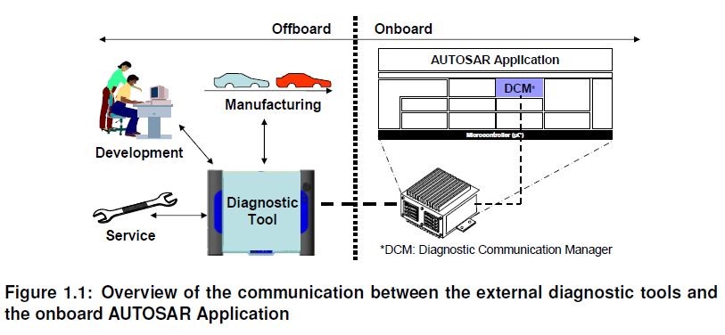
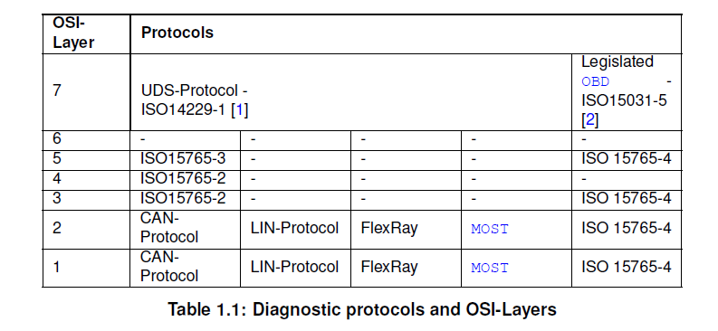
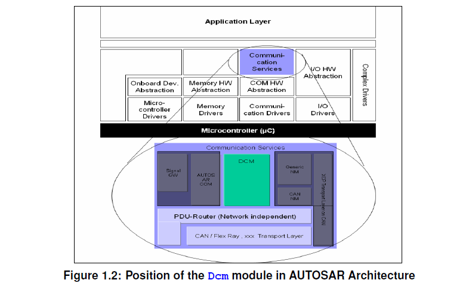

<section id="title">AUTOSAR Diagnostic Communication Manager（诊断通信管理器）</section>

# 1. 简介和功能概述

本文描述了**AUTOSAR**基础软件模块**Dcm**（诊断通信管理器）的功能、API 和配置。

**Dcm**模块为诊断服务提供了一个公共**API**。**Dcm**模块所提供的功能是为了**ECU**在开发、制造或服务期间，供外部诊断仪（**Tester**）所使用的。
​

**Dcm**模块确保诊断数据流和管理诊断状态，特别是诊断会话和安全状态的管理。此外**Dcm**模块会检查诊断服务请求是否被支持，以及服务是否可以在当前会话的状态被执行。**Dcm**模块提供表1中的**OSI-Layer 5 ~ 7**。

​
在**OSI**的第7层，**Dcm**模块提供广泛的**ISO14229-1**[1]的服务，此外**Dcm**模块也提供了在文件**SAE J1979**[3]和**ISO 15031-5**[2]中定义的**OBD**服务机制的$01 - $0A的支持。通过这些服务，**AUTOSAR** **OBD**功能能够满足全球所有轻量级的OBD法规（如：加州 **OBD II**、**EOBD**、日本**OBD**等)。

在**OSI**的第5层，**Dcm**模块处理以下规范的网络独立部分:

* **ISO15765-3**[4]: 统一诊断业务实现（**UDS on CAN**）。
* **ISO15765-4**[5]: 排放相关系统的需求。第五章“会话层”
  
在**AUTOSAR**体系结构中，诊断通信管理器位于通信服务(服务层)。
​

**Dcm**模块是与网络独立的。所有网络特定的功能（如：**CAN**、**LIN**、**FlexRay**或**MOST**等网络的特定功能）都是在**Dcm**模块之外处理的。**PduR**（**PDU Router**）模块为**Dcm**模块提供了独立的网络接口。**Dcm**模块只会收到**PduR**模块发来的诊断消息。Dcm模块处理并在内部检查诊断消息。作为处理请求的诊断服务的一部分，**Dcm**将与其他**BSW**模块或**SW-C**通过**RTE**进行交互，以获取请求的数据或执行请求的命令。通常**Dcm**将收集到的信息集合起来，并通过**PduR**模块发送一条回复消息。

# 2. 缩略语

**AddressAndLengthFormatIdentifier:**
> 地址和长度格式标识符。定义了请求消息中用于**memoryAddress**和**memorySize**参数的字节数。

**Application Layer：**
> 应用层。应用层位于**RTE**之上。在应用层内放置了**AUTOSAR**软件组件。

## 相关模块
AUTOSAR DCM与以下基本软件模块和SW-C有接口和依赖关系:
​

**Dem**
> DEM模块提供检索与故障内存相关的所有信息的功能，以便Dcm模块能够通过从故障内存中读取数据来响应测试者的请求。

PduR
PduR模块提供诊断数据的发送和接收功能。Dcm模块的正常运行，假设PduR接口支持诊断应用层和底层传输层之间为SAP (service Access Point)定义的所有服务原语(参见ISO14229-1[2]，第5章应用层服务)。

ComM
ComM模块提供了一些功能，如Dcm模块可以指示“活动”和“非活动”状态，以便进行诊断通信。Dcm模块提供了处理“Full-/ Silent-/ No-Communication”通信需求的功能。此外，如果ComM模块要求，Dcm模块提供启用和禁用诊断通信的功能。（UDS的0x28服务）

SW-C and RTE
Dcm模块能够分析接收到的诊断请求数据流。并处理与诊断通信相关的所有功能，如协议处理（protocol handling）和时序（timing）。基于请求的数据流分析结果，Dcm模块负责数据的响应并执行SW-C的例程或I/O的控制。
如果Dcm模块无法直接处理诊断数据请求时，Dcm会把通过以下方式来转发请求并获得结果数据：
通过SW-C的port-interface。
通过直接调用BSW模块函数。

BswM
如果Dcm的初始化是从引导加载程序跳转的结果，则Dcm通知BswM应用程序已被更新（UDS的0x11服务）。Dcm还向BswM表示通信模式的改变（UDS的0x28服务）。
文件结构
​

编辑

切换为居中
添加图片注释，不超过 140 字（可选）
Dcm错误分类
Dcm模块在运行过程中，可能需要处理以下的几类错误。此类错误已在ISO协议中定义，Dcm的错误通过ISO文档中的NRC直接处理。
Development Errors
错误码
数值
解释
DCM_E_INTERFACE_TIMEOUT
0x01
在与另一个模块交互期间发生超时
DCM_E_INTERFACE_RETURN_VALUE
0x02
接口返回值超出范围
DCM_E_INTERFACE_BUFFER_OVERFLOW
0x03
在与另一个模块交互期间，Dcm提供的缓冲区边界检查失败
DCM_E_UNINIT
0x05
Dcm没有初始化
DCM_E_PARAM
0x06
Dcm API函数输入参数无效
DCM_E_PARAM_POINTER
0x07
使用NULL指针作为参数调用的Dcm API服务
DCM_E_INIT_FAILED
0x08
Dcm初始化失败
DCM_E_SET_PROG_CONDITIONS_FAIL
0x09
存储ProgConditions失败
Runtime Errors
错误码
数值
解释
DCM_E_INVALID_VALUE
0x01
Dcm被一个无效的输入参数值调用，或者Dcm调用了一个函数，这个函数返回一个无效的输出参数或返回值。
Dcm中的子模块
​

编辑

切换为居中
添加图片注释，不超过 140 字（可选）
Dcm实现了ISO-14229的协议，功能上实现上还是非常复杂的，所以AUTOSAR对Dcm进行了分解设计，把Dcm模块分解成了以下子模块:
DSL（诊断会话层）子模块
DSL子模块负责确保与诊断请求和响应相关的数据流，监督和保证诊断协议中时间相关的问题，并管理诊断状态（特别是诊断会话和安全）。
详见：AUTOSAR Dcm之DSL（Diagnostic Session Layer）
DSD （诊断服务分发器）子模块
DSD子模块处理诊断数据流。
通过网络接收新的诊断请求，并将其转发给数据处理器。
当数据处理器(如：DSP子模块)触发时，通过网络发送诊断响应。
DSP（诊断服务处理）子模块
DSP子模块负责处理实际的诊断业务(分别为子业务)请求。
NRC （Negative Response Code）
负响应代码（NRC） 参照了UDS Services和OBD Services的标准中的NRC(negative response code)的定义。Dcm与其他BSW模块和SW-C之间的接口中使用了这些NRC。NRC的具体定义可参考数据类型Dcm_NegativeResponseCodeType [SWS_Dcm_00980]。
宏定义
数值
描述
DCM_POS_RESP
0x00
PR（正相应）
DCM_E_GENERALREJECT
0x10
GR
DCM_E_SERVICENOTSUPPORTED
0x11
SNS
DCM_E_SUBFUNCTIONNOTSUPPORTED
0x12
SFNS
...

