<section id="title">AUTOSAR ADC Driver（模数转换器驱动）</section>

# 1. 简介和功能概述

本文介绍了**AUTOSAR**基础软件模块**ADC**驱动程序的功能、**API**和配置。**ADC**驱动程序的目标是逐次逼近**ADC**硬件数值。但**Delta Sigma ADC**转换用例超出了AUTOSAR ADC驱动的范畴。

**ADC**驱动模块主要负责初始化和控制**MCU**内部的模数转换器单元（**Analogue Digital Converter Unit**）。为此**ADC**驱动模块提供了启动和停止转换服务，以实现启用和禁用ADC转换的触发。此外也提供通知机制（**notification mechanism**）以及查询转换状态和结果的服务。

**ADC**模块工作在**ADC**通道组（**ADC Channel Group**）上。这些**ADC**通道组是由多条**ADC**通道（**ADC Channel**）构成。**ADC**通道组将模拟输入引脚（即：ADC通道）、所需的ADC电路本身和转换结果寄存器组合成一个实体，实现可通过**ADC**模块独立的控制及访问。

# 2. 缩略语

**DET**
> 默认错误跟踪器（**Default Error Tracer**），实现报告开发错误的模块。

**DEM**
> 诊断事件管理器（**Diagnostic Event Manager**）。

**ADC**
> 模数转换器（**Analogue Digital Converter**）

**MCU**
> 微控制器单元（**Microcontroller Unit**）

**ADC HW Unit**
> 微控制器的输入电子设备，包括执行模拟到数字转换所需的所有部件。

**ADC Module**
> ADC的基础软件模块ADC驱动模块（**ADC Driver**）

**ADC Channel**
> **ADC**通道是指绑定到一个端口引脚的逻辑**ADC**实体。同时多个**ADC**实体也可以映射到同一个端口引脚。

**ADC Channel Group**
> **ADC**通道组是指由一组**ADC**通道链接到同一个**ADC**硬件单元（**ADC HW Unit**）。例如：一个采样点对应一个**A/D**转换器。整个组的转换由一个触发源触发。

**ADC Result Buffer**
> 也称为**ADC Streaming Buffer**或者**ADC Stream Buffer**。**ADC**驱动程序的用户必须为每个组提供一个缓冲区。如果选择流式访问模式（**streaming access mode**），此缓冲区可以保存同一组通道的多个样本。如果选择单一访问模式（），每个组通道的一个样本将保存在缓冲区中。

**Software Trigger**
> 软件触发是一个软件**API**调用，用于启动转换一个**ADC**通道组或一系列连续**ADC**通道组转换的。

**Hardware Trigger**
> 硬件触发是**ADC**内部触发信号，用于启动ADC通道组的一次转换。**ADC**硬件触发在ADC硬件内部生成（例如：基于**ADC**定时器或触发沿信号）。触发硬件是强耦合或者直接集成在**ADC**的硬件中。当检测到硬件触发后，无需软件即可启动**ADC**通道组转换。**注意：**即使**ADC**硬件不支持硬件触发，也可以通过软件触发结合**GPT/ICU**驱动程序来实现类似的行为。（例如：在GPT定时器通知函数中，启动软件触发的**ADC**通道组的转换）

**One-Shot Conversion Mode**
> One-Shot转换模式是指**ADC**通道组的转换在触发后执行一次，并将结果写入分配的结果缓冲区。触发可以是软件**API**调用或硬件事件。

**Continuous Conversion Mode**
> 连续转换模式是指**ADC**通道组的转换在软件**API**调用后连续执行，结果写入分配的结果缓冲区。转换本身是自动运行的（硬件/中断控制）。连续转换的停止可以通过软件**API**调用来实现。

**Sampling Time, Sample Time**
> 采样时间是指对模拟值进行采样的时间（例如：加载电容器，……）

**Conversion Time**
> 转换时间是指将采样的模拟值转换为数值所需的时间。

**Acquisition Time**
> 采集时间 = 采样时间（**Sample Time**）+ 转换时间（**Conversion Time**）

# 3. 相关文档

## 3.1. 输入文件

[1] General Requirements on Basic Software Modules
> AUTOSAR_SRS_BSWGeneral.pdf

[2] General Requirements on SPAL
> AUTOSAR_SRS_SPALGeneral.pdf

[3] Specification of Standard Types
> AUTOSAR_SWS_StandardTypes.pdf

[4] List of Basic Software Modules
> AUTOSAR_TR_BSWModuleList.pdf

[5] Specification of Diagnostic Event Manager
> AUTOSAR_SWS_DiagnosticEventManager.pdf

[6] Specification of Default Error Tracer
> AUTOSAR_SWS_DefaultErrorTracer.pdf

[7] Requirements on ADC Driver
> AUTOSAR_SRS_ADCDriver.pdf

[8] Specification of ECU Configuration
> AUTOSAR_TPS_ECUConfiguration.pdf

[9] Layered Software Architecture
> AUTOSAR_EXP_LayeredSoftwareArchitecture.pdf

[10] Specification of ECU State Manager
> AUTOSAR_SWS_ECUStateManager.pdf

[11] Specification of I/O Hardware Abstraction
> AUTOSAR_SWS_IOHardwareAbstraction.pdf

[12] Basic Software Module Description Template
> AUTOSAR_TPS_BSWModuleDescriptionTemplate.pdf

[13] General Specification of Basic Software Modules
> AUTOSAR_SWS_BSWGeneral.pdf

## 3.2. 相关规范

AUTOSAR 提供了基础软件模块的通用规范 [13] ，此文档也适用于**ADC**驱动程序。因此，规范基础软件模块的通用规范 [13] 应被视为**ADC**驱动器的附加和必需规范。

# 4. 约束和假设

## 4.1. 限制

仅当**MCAL**驱动程序拥有完整的底层硬件外围设备（即：硬件外围设备不被其他 **MCAL**模块访问）时，电源状态控制**API**才可被实现。

# 5. 对其他模块的依赖

## 5.1. MCU Driver

微控制器单元驱动（**MCU Driver**）主要负责初始化和控制芯片的内部时钟源和时钟预分频器。

时钟频率可能会影响：
* 触发频率（**Trigger frequency**）
* 转换时间（**Conversion time**）
* 采样时间（**Sampling time**）

## 5.2. PORT driver

**PORT**模块主要负责配置**ADC**模块使用的端口引脚。包括：模拟输入引脚（**analogue input pin**）和外部触发引脚（**external trigger pin**）。

# 6. 功能规格

## 6.1. 一般行为

**ADC**模块可以允许将一个或多个**ADC**通道（**ADC channel**）分组为所谓的**ADC**通道组（**ADC Channel group**）。也即是说**ADC**模块的配置应使得一个**ADC**通道组包含至少一个**ADC**通道。

如果启用了全局限制检查功能并且为**ADC**通道启用了特定于通道的限制检查，则 **ADC**模块的配置应使**ADC**通道组仅包含一个**ADC**通道。

**ADC**模块应允许将一个**ADC**通道分配给多个ADC通道组。

**ADC**模块的配置应使得包含在一个**ADC**通道组中的所有通道应属于同一个**ADC**硬件单元。

### 6.1.1. 初始化

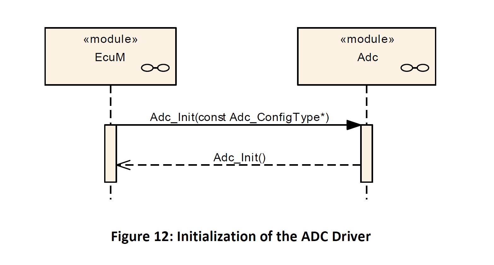

### 6.1.2. 去初始化

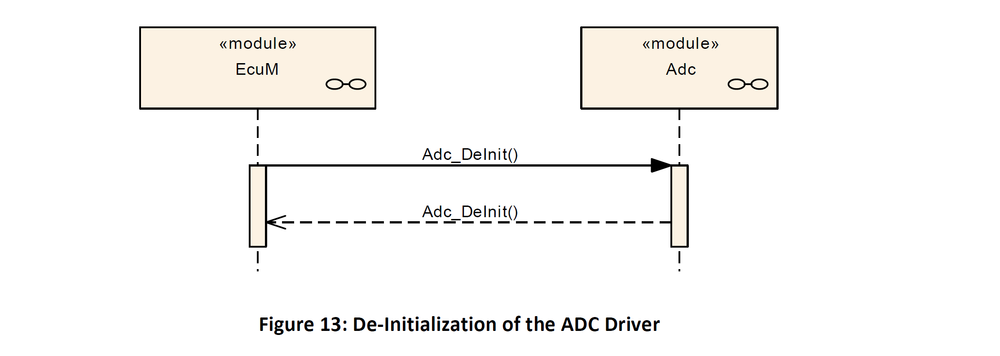

### 6.1.3. 转换模式

**ADC**模块支持以下转换模式：

1. **ADC**模块需为所有**ADC**通道组，提供一次性转换模式（**One-shot Conversion**）的支持。 一次性转换转换意味着为正在转换的组配置的每个通道都执行一次转换。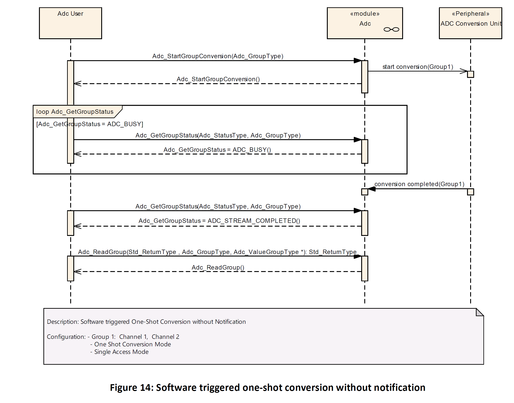
2. **ADC**模块需为所有带有触发源软件的**ADC**通道组，提供连续转换模式（**Continuous Conversion**）的支持。连续转换是指一次ADC转换完成后，一直重复整个**ADC**通道组的转换。组内各个**ADC**通道的转换以及整个**ADC**通道组的重复不需要执行任何额外的触发事件。根据硬件和软件功能，可以顺序或并行转换**ADC**通道组内的各个通道。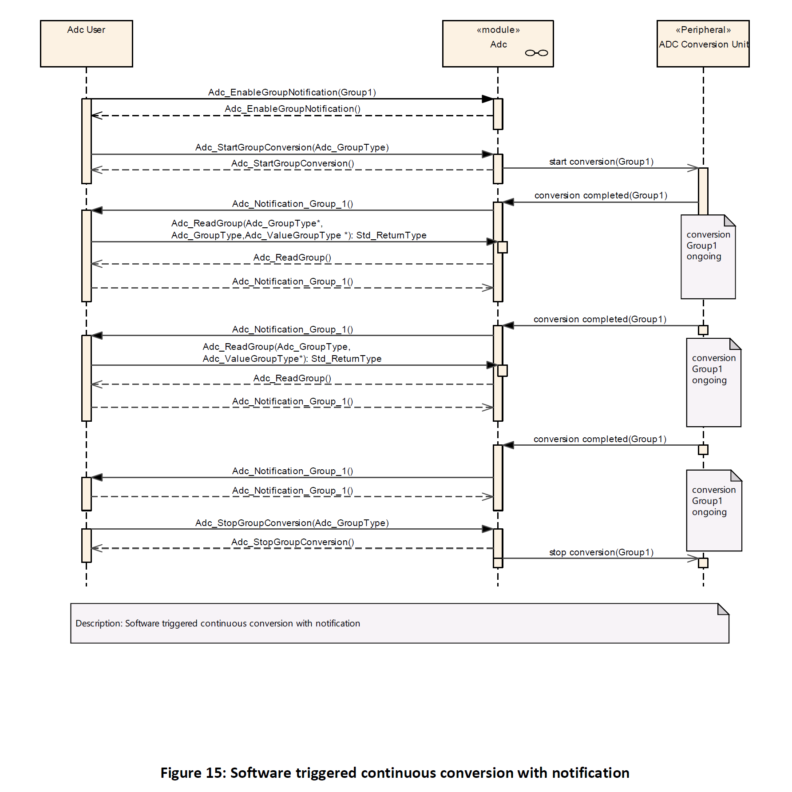

### 6.1.4. 触发源（Trigger Source）
**ADC**模块需支持以下启动条件或触发源：

* **ADC**模块需支持所有转换模式的启动条件的软件**API**调用（**Software API Call**）。触发源的软件API调用是指ADC通道组的转换由ADC模块提供的服务来启动或者停止。
* **ADC**模块需支持在**One-Shot**转换模式中配置的**ADC**通道组的启动条件的硬件事件（**Hardware Event**）。触发源的硬件事件意味着**ADC**通道组的转换可以由硬件事件启动。（例如：定时器的超时事件，或者输入线上检测到一个边沿跳变）

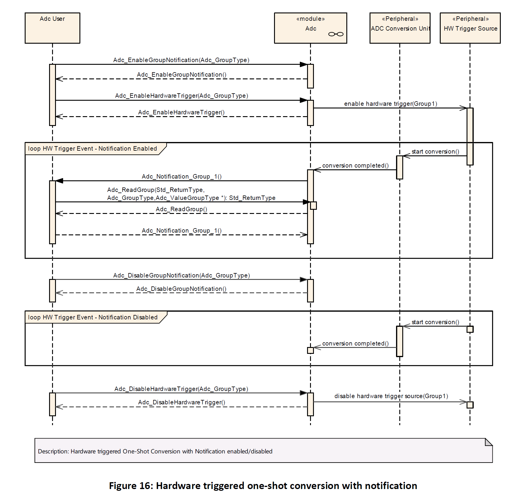

**ADC**模块应允许为每个**ADC**通道组配置一个触发源。

### 6.1.5. 数据访问模式

**ADC**模块需支持以下结果访问模式：

* **ADC**模块需支持使用API函数**Adc_GetStreamLastPointer**来访问结果。调用 **Adc_GetStreamLastPointer**会告知用户最新一轮的**ADC**通道组转换结果在结果缓冲区中的位置以及结果缓冲区中有效转换结果的数量。结果缓冲区是应用程序提供的外部缓冲区。此函数可用于**ADC**通道组的两种类型，通过配置**Streaming Access Mode**和**Single Access Mode**进行配置。同时**Single Access Mode**的处理等于**Streaming Access Mode**的**Streaming Counter**等于**1**的情况。
* 如果**API**函数的生成是静态配置的，**ADC**模块需支持使用API函数 **Adc_ReadGroup**来访问结果。调用**Adc_ReadGroup**将最近一轮转换的**ADC**通道组转换结果复制到应用程序缓冲区，其起始地址指定为**Adc_ReadGroup**的API参数。此函数可用于**ADC**通道组的两种类型，通过配置**Streaming Access Mode**和**Single Access Mode**进行配置。

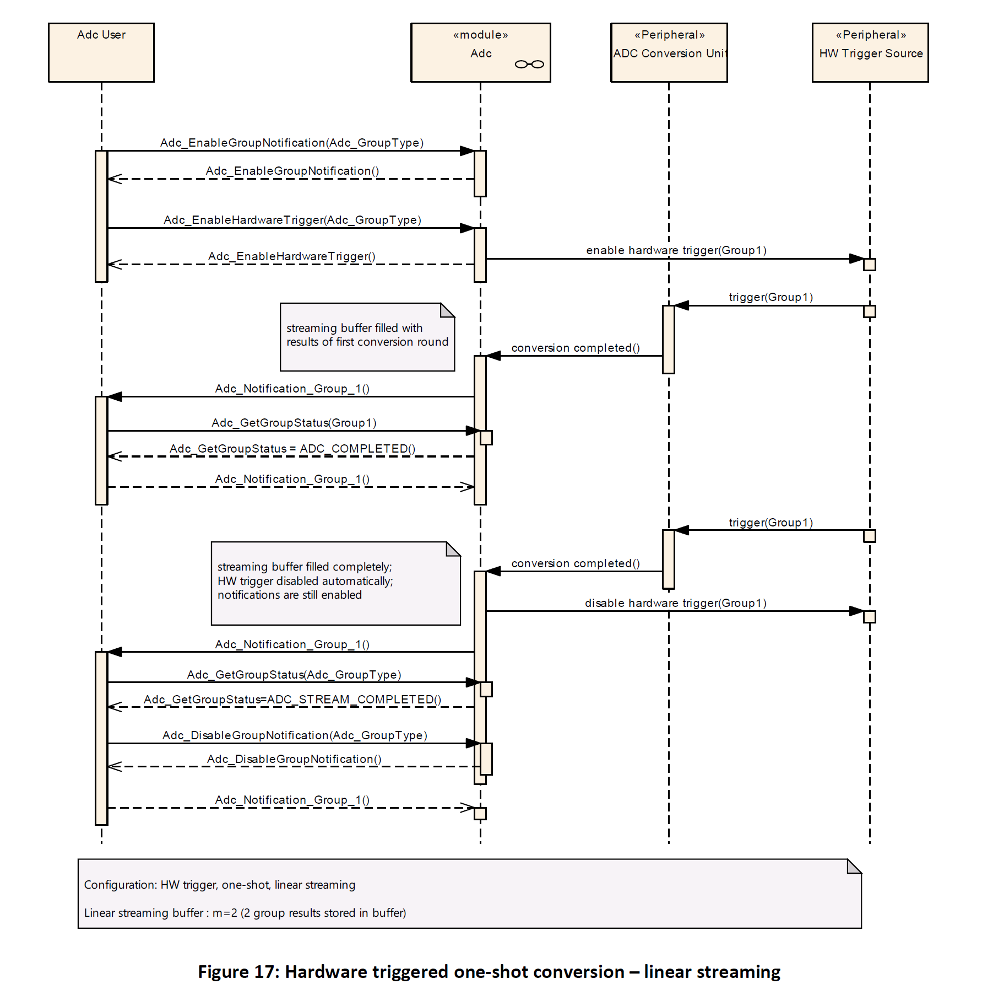

**ADC**模块需保证每次完成转换的返回结果值的一致性。

**注意：**

**ADC**通道组结果的一致性在应用端可以通过以下方法获得：

* 使用**ADC**通道组通知机制（**group notification mechanism**）
* 通过**API**函数**Adc_GetGroupStatus**轮询获取。

在任何情况下，新的结果数据都必须在被覆盖之前从结果缓冲区中读出（例如：通过 **Adc_ReadGroup**）。如果函数**Adc_GetGroupStatus**报告状态**ADC_STREAM_COMPLETED**, 并且同一**ADC**通道组的转换仍在进行中（因连续转换或硬件触发转换激活），则上层用户需负责在**ADC**驱动程序覆盖结果缓冲区之前，读取**ADC**通道组结果缓冲区中的结果。

**ADC**模块的环境应确保在请求转换结果之前，以及完成被请求的**ADC**通道组的转换。如果被请求的**ADC**通道组没有完成转换（例如：因为用户停止了**ADC**通道组的转换），ADC模块返回的值将是任意的。（如：**Adc_GetStreamLastPointer**将返回**0**并读取值为**NULL_PTR**，而**Adc_ReadGroup**将返回**E_NOT_OK**）。

### 6.1.6. 优先级

**ADC**模块需允许为每个**ADC**通道组配置优先级。这意味着优先级机制，在软件中实施，或者在可用的情况下由硬件支持。具有触发源硬件的**ADC**通道组，始终使用硬件优先级机制进行优先级排序。

**ADC**模块的优先级机制需允许中止和重新启动**ADC**通道组转换。**ADC**模块的优先级机制同时也应允许暂停和恢复**ADC**通道组转换。

**ADC**模块需允许**ADC**通道组特定配置，无论中止/重新启动或挂起/恢复机制是否用于中断的**ADC**通道组。与**ADC**通道组（**ADC channel group**）级别的软件控制的中止/重启或挂起/恢复机制相比，**ADC**硬件可以支持**ADC**通道（**ADC channel**）级别的中止/重启和挂起/恢复机制。这两种机制中的哪一个在通道级别上实现，取决于最终的代码实现。

**ADC**模块的优先级机制需允许对不同**ADC**通道组的请求进行排队。较高优先级的**ADC**通道组可以中止或挂起较低优先级的**ADC**通道组。在这种情况下，优先级处理程序应将中断的**ADC**通道组转换放入队列中，并且此**ADC**通道组的转换将在稍后重新启动或恢复。具体实现对用户来说是透明。

**ADC**模块的优先级机制需允许配置**256**个优先级（**0...255**）。最低优先级为**0**。

**ADC**模块需支持静态配置选项以禁用优先级机制。同时**ADC**模块需支持静态配置选项以启用**ADC_PRIORITY_HW_SW**优先级机制，即同时使用硬件和软件优先级机制。如果硬件不提供硬件优先级机制，则纯软件的优先级机制会被实施。

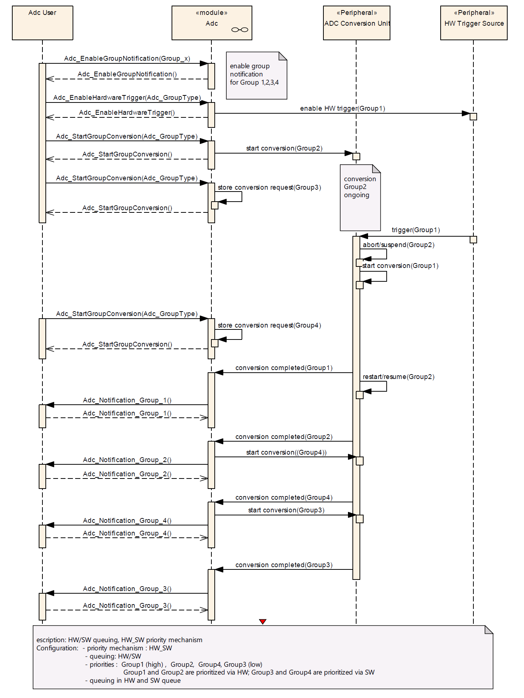

如果硬件支持优先级机制，**ADC**模块应支持静态配置选项**ADC_PRIORITY_HW**启用仅使用硬件优先级机制的优先级机制。如果选择了硬件优先机制，则具有软件触发源的**ADC**通道组也会使用硬件优先级机制中获得优先权配置。

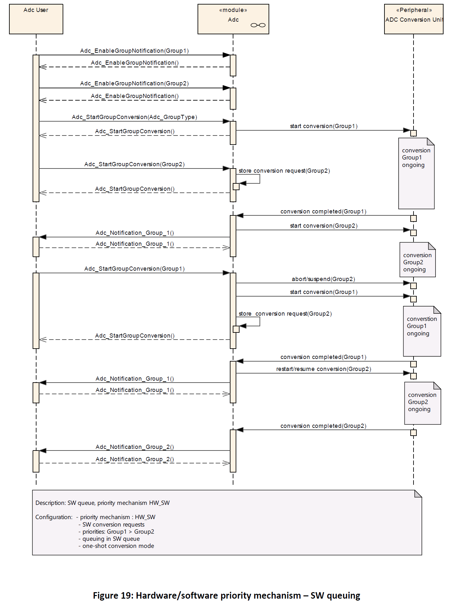

如果支持并选择了硬件优先级机制，**ADC**模块应允许将配置的优先级（**0-255**）映射到可用的硬件优先级。**ADC**模块的具体实现有关可用硬件优先级的限制以及可用硬件优先级到**ADC**通道组优先级的可能映射。

如果优先机制处于活动状态，**ADC**模块应支持转换请求的队列的功能：
1. 当较低优先级的**ADC**通道组转换正在进行时，收到更高优先级的**ADC**通道组转换请求，较低优先级的**ADC**通道组需放入队列中等待。
2. 因为更高优先级的**ADC**通道组转换正在进行中，较低优先级的**ADC**通道组转换请求将不能被立即处理时，较低优先级的**ADC**通道组转换请求也需要放入队列中等待。

如果优先级机制处于活动状态，则**ADC**模块会按照先到先服务（**first come first served**）的顺序，处理具有相同优先级的**ADC**通道组转换请求。

如果优先级机制未激活，并且静态配置参数**AdcEnableQueuing**设置为**ON**，则 **ADC**模块会支持转换请求的队列功能，并应以先到先服务（**first come first served**）的顺序为软件组提供服务。软件转换请求存储的队列中需由软件实现或由硬件支持。

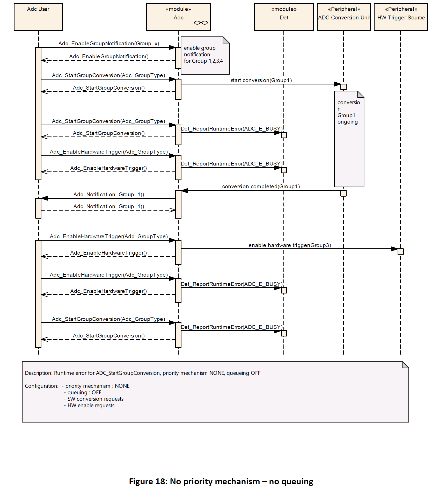

如果队列机制激活（优先机制激活或队列显式激活），**ADC**模块需为每个**ADC**通道组的每个软件转换请求，最多在软件队列中存储一次。**ADC**模块应仅存储每个**ADC**通道组的一个转换请求，而不是多个请求。原因就是避免高优先级长期转换阻塞硬件的情况。

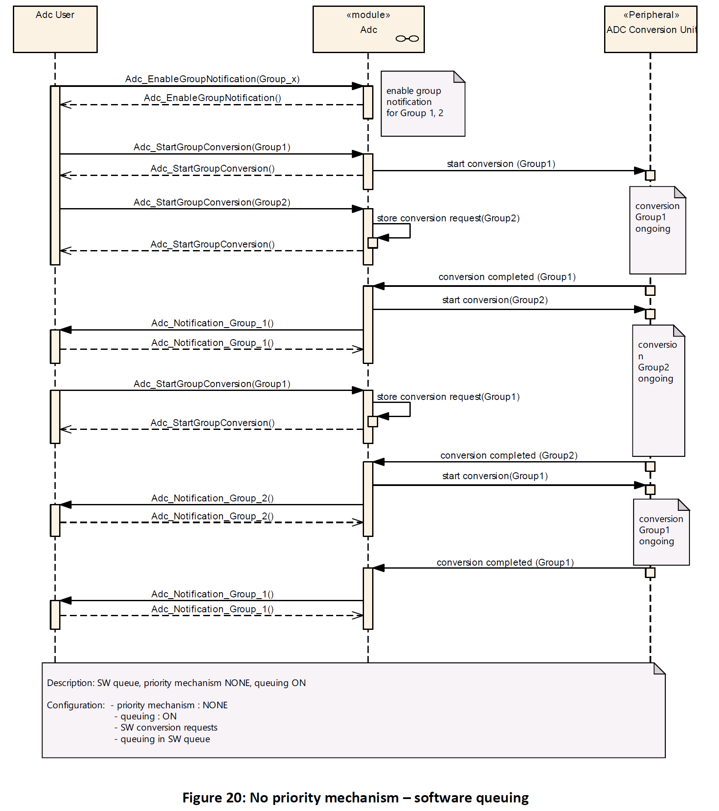

在启用硬件触发请求情况下，通过**API**函数**Adc_EnableHardwareTrigger**生成的请求不应存储在任何队列中。

在硬件触发转换请求的情况下，硬件优先级机制需被使用。

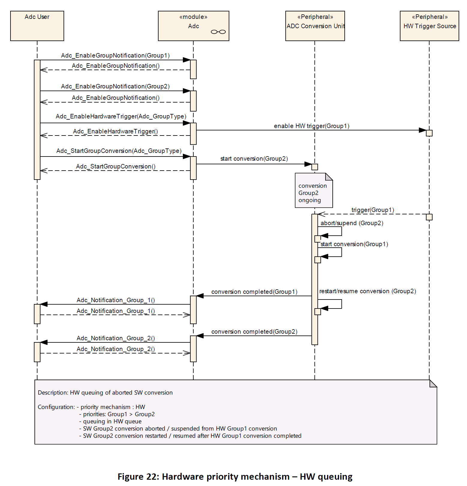

如果**ADC**通道组可以被隐式停止，当**ADC**通道组状态为**ADC_IDLE**或**ADC_STREAM_COMPLETED**，这时**ADC**模块则被允许存储同一**ADC**通道组的额外软件转换请求。

### 6.1.7. 通知（Notification）

如果通知功能被配置并启用，当被请求**ADC**通道组的所有通道的转换完成并且，**ADC**模块会调用此**ADC**通道组通知（**group notification**）函数。

### 6.1.8. 重入和完整性

对于不同的ADC通道组，**ADC**模块函数是可以支持可重入的。此要求应适用于除了以下的所有API函数：

* **Adc_Init**
* **Adc_DeInit**
* **Adc_GetVersionInfo**
* **Adc_SetPowerState**
* **Adc_GetTargetPowerState**
* **Adc_GetCurrentPowerState**
* **Adc_PreparePowerState**

**API**函数的可重入性，必须由调用者来关注是否同时使用了同一个**ADC**通道组的情况。

简单的读取调用，如**Adc_ReadGroup**和**Adc_GetGroupStatus**的实现，即使这些函数是为相同的**ADC**通道组调用，也需支持是可重入的。是否使用适当的保护机制（例如：禁用和启用中断）取决于代码实现。

**注意：**
调用**Adc_ReadGroup**可以隐式更改组状态。

在运行时，如果在不同的**Task**或者**ISR**中，对于同一个**ADC**通道组的多次调用，则**ADC**模块无需检查数据的完整性，但**ADC**模块的用户需确保数据的完整性。

### 6.1.9. 限制检查

**ADC**模块需允许为**ADC**通道配置限制检查。

如果**ADC**通道的限制检查（**limit checking**）处于被活动状态，则只有在配置范围内的**ADC**转换结果，才会被考虑用于更新用户指定的**ADC**结果缓冲区，并用于触发**ADC**通道组状态转换（**state transitions**）。

如果选择了带软件触发源的一次性（**one-shot**）转换模式，并且对**ADC**的通道启用 了限制检查，则 **ADC**驱动模块需忽略不在配置范围内的**ADC**转换结果，并且包含此**ADC**通道的**ADC**通道组，需仍旧保持**ADC_BUSY**的状态。

在重新发出新的一次性（**one-shot**）转换软件触发之前，必须使用**Adc_StopGroupConversion()**将**ADC**通道组状态设置为**ADC_IDLE**。

如果选择了带硬件触发源的一次性（**one-shot**）转换模式，并且对**ADC**的通道启用了限制检查，则**ADC**驱动模块需忽略不在配置范围内的**ADC**转换结果，并等待硬件触发源再次发出下一次的转换。

## 6.2. 转换处理和交互

**ADC**模块一次只能转换每个**ADC**硬件单元（**ADC HW Unit**）的一个**ADC**通道组。**ADC**模块不支持在同一个**ADC**硬件单元上，不同的**ADC**通道组的同时转换。

**注意：**

根据硬件的能力，不同**ADC**硬件单元上的**ADC**通道组的并发转换是可能的。如果硬件支持，也可以同时转换一个通道组内的个别通道。

如果一个通道需要在不同的转换模式下使用（例如：正常操作期间的连续转换模式和在特定时间点进行特殊转换的一次性转换模式），则该通道应分配到具有各自的不同转换模式配置的**ADC**通道组上。

为了请求转换两个组之间共享的通道，**ADC**用户必须停止包含指定通道的第一组的转换，然后才能开始包含指定通道的第二组的转换。

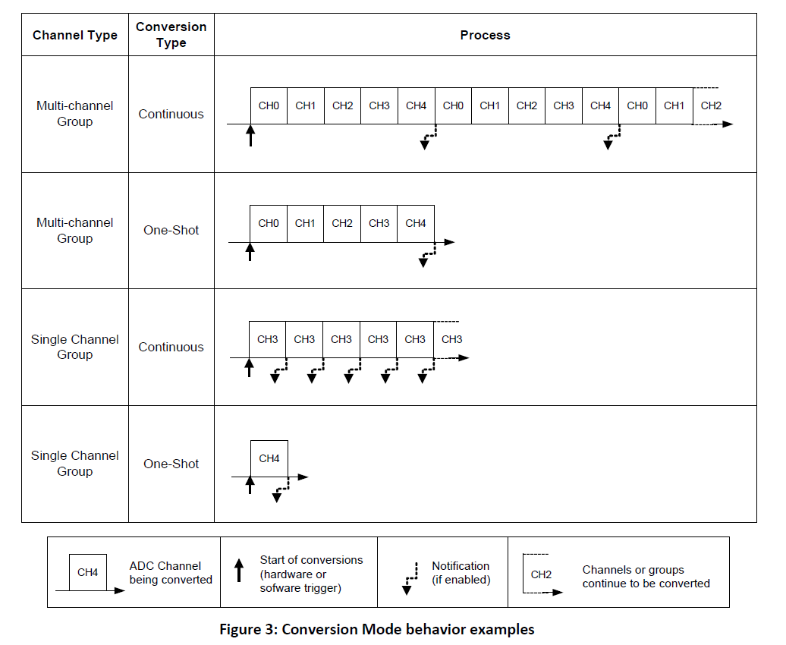

### 6.2.1. 示例1（多通道/连续转换）

**ADC**通道组包含通道（**CH0**、**CH1**、**CH2**、**CH3** 和 **CH4**），并配置为连续转换模式。当完成每次扫描后，会调用通知（如果启用）。 然后自动开始新一轮扫描。

### 6.2.2. 示例2（多通道/One-Shot）

**ADC**通道组包含通道（**CH0**、**CH1**、**CH2**、**CH3** 和 **CH4**），并配置为**One-Shot**转换模式。当完成扫描后，会调用通知（如果启用）。

### 6.2.3. 示例3（单通道/连续转换）

**ADC**通道组包含通道（**CH3**）并配置为连续转换模式。当完成每次扫描后，将调用通知（如果启用）。然后自动开始新一轮的扫描。

### 6.2.4. 示例4（单通道/One-Shot）

**ADC**通道组包含通道（**CH4**）并配置为**One-Shot**转换模式。当完成扫描后，会调用通知（如果启用）。

## 6.3. ADC 缓冲区访问模式示例

### 6.3.1. 配置

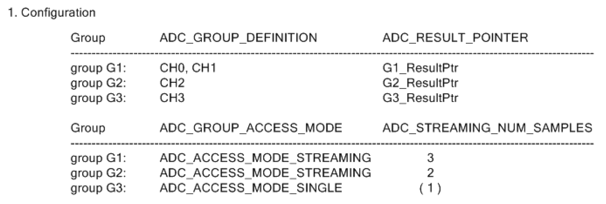

* 示例配置由三个**ADC**通道组组成。第1个**ADC**通道组由2个通道组成，第2个**ADC**通道组和第3个**ADC**通道组各由一个通道组成。
* 对于组1和组2，配置了组访问模式**ADC_ACCESS_MODE_STREAMING**。组3的组访问模式配置为**ADC_ACCESS_MODE_SINGLE**。
* **ADC**驱动程序将组1到组3的转换结果存储在三个应用程序缓冲区中，通过三个配置的 **ADC_RESULT_POINTER**访问：包括**G1_ResultPtr**、**G2_ResultPtr**和**G3_ResultPtr**。

### 6.3.2. 初始化

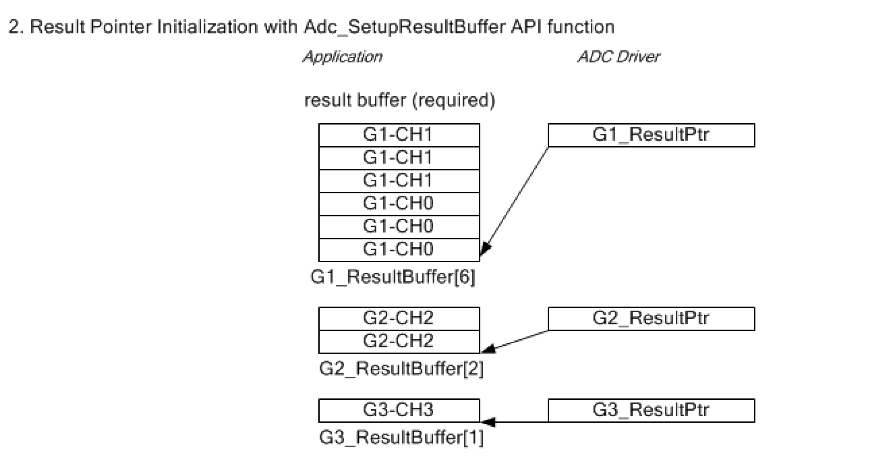

用户必须为**ADC**通道组结果提供应用程序结果缓冲区。每组都需要一个缓冲区。如果选择流模式（**ADC_ACCESS_MODE_STREAMING**）的访问模式，缓冲区大小取决于组通道的数量、组访问模式以及流模式采样的数量。在开始**ADC**通道组转换之前，用户必须使用**API**函数 **Adc_SetupResultBuffer**初始化**ADC**通道组结果指针，该函数将**ADC**通道组结果指针初始化为指向特定的应用程序结果缓冲区。

### 6.3.3. Adc_GetStreamLastPointer的用法

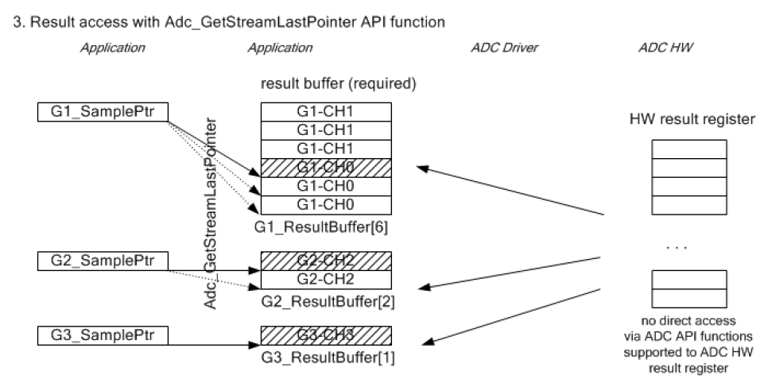

**ADC**驱动程序将**ADC**通道组**G1**、**G2**和**G3**的转换结果存储在相应的结果缓冲区数组**G1_ResultBuffer**、**G2_ResultBuffer**和**G3_ResultBuffer**中。**ADC**驱动程序并不支持通过**ADC**的**API**函数直接访问**ADC**硬件结果寄存器。

**ADC**用户定义了三个指针**G1_SamplePtr**、**G2_SamplePtr**和**G3_SamplePtr**。在调用**Adc_GetStreamLastPointer**后，这些指针分别指向 **ADC**应用程序结果缓冲区。

准确地说，指针**G1_SamplePtr**在调用**Adc_GetStreamLastPointer**后，指向最新完成的一轮AD转换后的最新的**G1_CH0**的结果（其中**G1_CH0**是**G1**组定义中的第一个通道）。应用程序结果缓冲区布局如上图所示。组1的应用程序结果缓冲区中保存了3份**G1_CH0**的流结果（**streaming result**），也保存了3份**G1_CH1** 的流结果。了解应用程序结果缓冲区布局后，用户可以访问最新一轮转换的所有**ADC**通道组的组内通道的结果。

**G2_SamplePtr**和**G3_SamplePtr**也对齐，在调用**Adc_GetStreamLastPointer**后，指向对应**ADC**通道组的的第一个组通道的最新结果。因为这两个**ADC**通道组只有一个频道。**G2_SamplePtr**指向**G2_CH2**结果之一（即：最新结果）。**ADC**通道组，因为配置为单一访问模式，所以**G3_SamplePtr**始终指向**G3_CH3**。


**Adc_GetStreamLastPointer**会返回存储在应用程序结果缓冲区中，每个通道的有效采样数（即：完整的组转换次数）。如果返回值等于配置参数流采样个数（**number of streaming samples**），则流缓冲区中的所有转换结果都有效。如果返回值为 0，则流缓冲区中没有可用的转换结果（采样数据的指针将对齐为**NULL**）。

为了使**Adc_GetStreamLastPointer**将采样数据指针（**G1_SamplePtr**、**G2_SamplePtr**和**G3_SamplePtr**）指向最新的通道结果，**API**被定义为将指针传递给结果指针而不是结果指针本身。

### 6.3.4. Adc_ReadGroup的用法

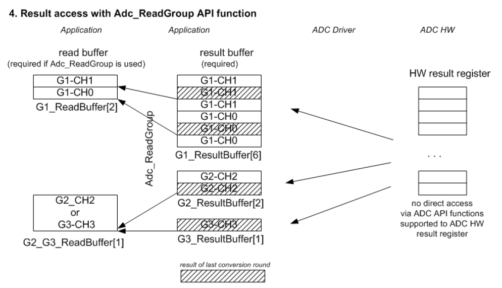

如果可选的API函数**Adc_ReadGroup**被启用，则用户必须为每个选定的**ADC**通道组提供额外的缓冲区，这些缓冲区可以保存一轮**ADC**通道组转换的结果。调用**Adc_ReadGroup**将最新结果从应用程序结果缓冲区复制到应用程序读取组缓冲区。 在示例中，一个应用程序读取缓冲区（**G2_G3_ReadBuffer**）被用于**ADC**通道组**G2**和**G3**。


## 6.4. 运行时错误

**ADC_E_BUSY**
> API在被调用时，另一个转换已在运行，硬件触发器已启用，请求已存储在队列中。

**ADC_E_IDLE**
> API在被调用时，**ADC**通道组处于**ADC_IDLE**状态，或这未被启用。

**ADC_E_NOT_DISENGAGED**
> API在被调用时，一个或多个**ADC**通道组未处于空闲状态时。

**ADC_E_TRANSITION_NOT_POSSIBLE**
> 无法达到请求的电源状态。

# 7. API规范

## 7.1. 函数定义

### 7.1.1. Adc_Init

**说明**: 初始化 ADC 硬件单元和驱动程序。

```C
void Adc_Init ( const Adc_ConfigType* ConfigPtr )
```

### 7.1.2. Adc_SetupResultBuffer

**说明**: 初始化**ADC**驱动程序，为特定的**ADC**通道组转换结果存储的缓冲区指定起始地址。应用程序必须确保**DataBufferPtr**指向的应用程序缓冲区可以保存指定**ADC**通道组的所有转换结果。重置后需要使用**Adc_SetupResultBuffer**进行初始化，然后才能开始组转换。

```C
Std_ReturnType Adc_SetupResultBuffer ( 
    Adc_GroupType Group, Adc_ValueGroupType* DataBufferPtr )
```

### 7.1.3. Adc_DeInit

**说明**: 将所有**ADC**硬件单元返回到与其上电复位状态相当的状态。

```C
void Adc_DeInit ( void )
```

### 7.1.4. Adc_StartGroupConversion

**说明**: 开始转换请求的**ADC**通道组的所有通道。

```C
void Adc_StartGroupConversion ( Adc_GroupType Group )
```

### 7.1.5. Adc_StopGroupConversion

**说明**: 停止请求的**ADC**通道组的转换。

```C
void Adc_StopGroupConversion ( Adc_GroupType Group )
```

### 7.1.6. Adc_ReadGroup

**说明**: 读取请求组的最后一次完成转换的组转换结果，并把通道数值保存到 DataBufferPtr指向的开始地址中。**ADC**通道组的通道值按通道编号升序存储（与配置了流式访问的结果缓冲区的存储布局相反）。

```C
Std_ReturnType Adc_ReadGroup ( 
    Adc_GroupType Group, Adc_ValueGroupType* DataBufferPtr )
```

### 7.1.7. Adc_EnableHardwareTrigger

**说明**: 启用请求的**ADC**通道组的硬件触发。

```C
void Adc_EnableHardwareTrigger ( Adc_GroupType Group )
```

### 7.1.8. Adc_DisableHardwareTrigger

**说明**: 禁用请求的**ADC**通道组的硬件触发。

```C
void Adc_DisableHardwareTrigger ( Adc_GroupType Group )
```

### 7.1.9. Adc_EnableGroupNotification

**说明**: 启用请求的**ADC**通道组的通知机制。

```C
void Adc_EnableGroupNotification ( Adc_GroupType Group )
```

### 7.1.10. Adc_DisableGroupNotification

**说明**: 禁用请求的**ADC**通道组的通知机制。

```C
void Adc_DisableGroupNotification ( Adc_GroupType Group )
```

### 7.1.11. Adc_GetGroupStatus

**说明**: 返回请求的**ADC**通道组的转换状态。

```C
Adc_StatusType Adc_GetGroupStatus ( Adc_GroupType Group )
```

### 7.1.12. Adc_GetStreamLastPointer

**说明**: 返回每个通道存储在结果缓冲区中的有效采样数。 读取一个指针，指向**ADC**通道组结果缓冲区中的一个位置。通过指针位置，可以访问上一轮完成转换的所有组通道的结果。使用指针和返回值，可以访问所有有效的组转换结果（用户必须了解结果缓冲区的布局）。

```C
Adc_StreamNumSampleType Adc_GetStreamLastPointer ( 
    Adc_GroupType Group, Adc_ValueGroupType** PtrToSamplePtr )
```

### 7.1.13. Adc_GetVersionInfo

**说明**: 返回此模块的版本信息。

```C
void Adc_GetVersionInfo ( Std_VersionInfoType* versioninfo )
```

### 7.1.14. Adc_SetPowerState

**说明**: 配置ADC模块，使其进入已准备好的电源状态，在一组预定义的已配置状态之间进行选择。

```C
Std_ReturnType Adc_SetPowerState ( 
    Adc_PowerStateRequestResultType* Result )
```

### 7.1.15. Adc_GetCurrentPowerState

**说明**: 返回**ADC**硬件单元的当前电源状态。

```C
Std_ReturnType Adc_GetCurrentPowerState ( 
    Adc_PowerStateType* CurrentPowerState, 
    Adc_PowerStateRequestResultType* Result )
```

### 7.1.16. Adc_GetTargetPowerState

**说明**: 返回**ADC**硬件单元的目标电源状态。

```C
Std_ReturnType Adc_GetTargetPowerState ( 
    Adc_PowerStateType* TargetPowerState, 
    Adc_PowerStateRequestResultType* Result )
```

### 7.1.17. Adc_PreparePowerState

**说明**: 初始化**ADC**硬件单元和驱动程序。

```C
Std_ReturnType Adc_PreparePowerState ( 
    Adc_PowerStateType PowerState, 
    Adc_PowerStateRequestResultType* Result )
```
## 7.2. 可配置的接口

### 7.2.1. IoHwAb_AdcNotification<#groupID>

**说明**: 当**ADC**通道组<#groupID>转换完成后，**ADC**驱动程序会调用此函数。


```C
void IoHwAb_AdcNotification<#groupID> ( void )
```

### 7.2.1. IoHwAb_Adc_NotifyReadyForPowerState<#Mode>

**说明**: 当模式**<#Mode>**请求的电源状态准备完成时，**ADC**驱动程序会调用此函数。

```C
void IoHwAb_Adc_NotifyReadyForPowerState<#Mode> ( void )
```

<section id="wechat">

<h4>微信扫一扫，获取更多及时资讯</h4>


</section>


