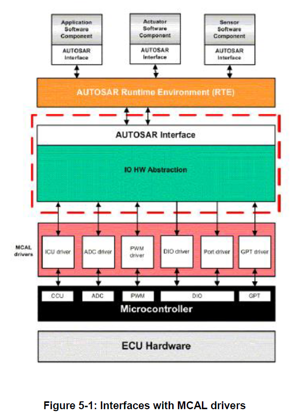
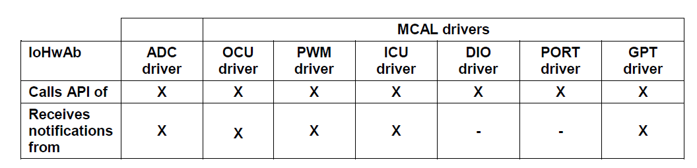
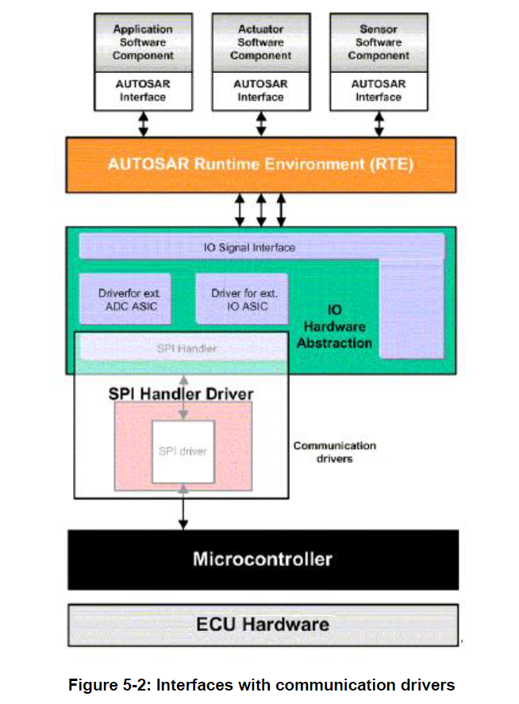
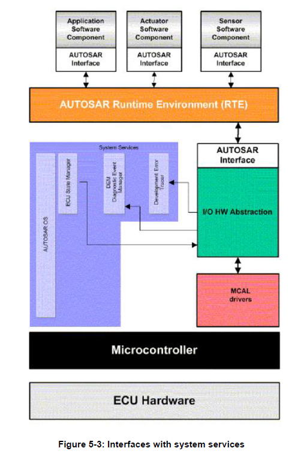
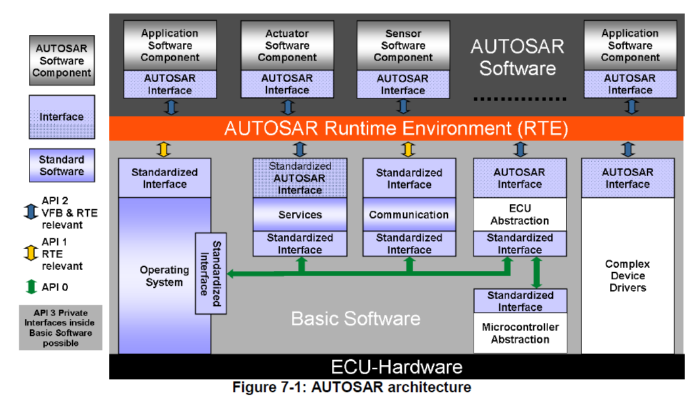
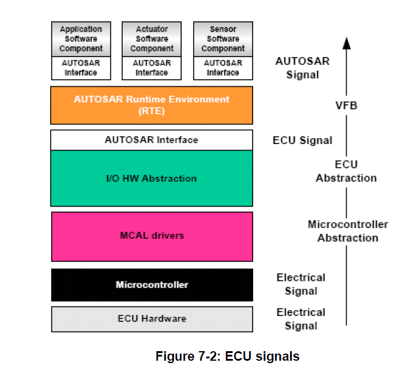

<section id="title">AUTOSAR I/O Hardware Abstraction（I/O 硬件抽象）</section>

# 1. 简介和功能概述

本文介绍了**AUTOSAR**基础软件**I/O**硬件抽象（**I/O Hardware Abstraction**）的功能和配置。**I/O**硬件抽象是**ECU**抽象层（**ECU Abstraction Layer**）的一部分。

**I/O**硬件抽象不应被视为单个模块，实现上此模块可以被实现为多个模块。 **AUTOSAR**的**I/O**硬件抽象标准并未为了实现模块或模块组的标准化。 相反标准的主要是为实现和其他模块的功能之间接口的指南。

**I/O**硬件抽象的目的是通过将**I/O**硬件抽象端口映射到**ECU**信号来提供对**MCAL**驱动程序的访问。提供给软件组件的数据可以完全从物理层中抽象出来。因此，软件组件设计人员不再需要详细了解**MCAL**驱动程序的**API**和物理层数据值的单位。

**I/O**硬件抽象始终针对**ECU**的特定实现，软件组件（**software component**）对基础软件（**basic software**）的需求必须适用具体**MCAL**实现的特征。

**I/O**硬件抽象需提供初始化整个**I/O**硬件抽象的服务。

在**AUTOSAR**的**I/O**硬件抽象指南中包含：

* 在定义**I/O**硬件抽象时，应使用软件组件模板（**Software Component template**）的哪一部分。
* 解释如何定义用于**ECU**信号映射的通用端口的方式。

在**AUTOSAR**的**I/O**硬件抽象指南中不包含：

* 提供**C**语言的**API**的定义
* 为每个**ECU**信号提供特定的形式化。此信息可在（车身域、动力总成、底盘域）的标准化的通过功能数据中找到。 

# 2. 缩略语及术语

## 2.1. 缩略语

**BSW**
> 基础软件（**Basic SoftWare**）

**BSWMD**
> 基本软件模块说明（**Basic SoftWare Module Description**）

**DET**
> 默认错误跟踪器（**Default Error Tracer**）

**IoHwAb**
> 输入/输出硬件抽象（**Input/Output Hardware Abstraction**）

**ISR**
> 中断服务程序（**Interrupt Service Routine**）

**MCAL**
> 微控制器抽象层（MicroController Abstraction Layer）

**SWC**
> 软件组件（**SoftWare Component**）

## 2.2. 术语

**Callback**
> 术语回调函数（**Callback**）主要用于**API**服务，实现通知其他**BSW**模块。

**Callout**
> **Callout**是一种函数**Stub**。主要在配置时进行填写，目的是向提供**Callout**函数的模块添加功能。

**Class**
> 一个类（**Class**）代表一组具有相似电气特性的信号。如：模拟类（**Analogue class**）

**Client-Server communication**
> 客户端-服务器通信（**Client-Server communication**）涉及两个实体。客户端是要求服务的一方，服务器是提供服务的一方。客户端发起通信，请求服务器执行服务，必要时传输参数集合。服务器以**RTE**的形式，等待来自客户端的传入通信请求，执行请求的服务并发送对客户端请求的响应。因此服务启动的方向是用来对**AUTOSAR**软件组件是客户端还是服务器分类的主要标识。

**Sender-receiver communication**
> 发送方-接收方通信涉及原子数据元素组成的信号的发送和接收，这些原子数据元素由一个组件发送给另一个或多个组件。发送方-接收方接口可以包含多个数据元素。发送方-接收方通信是单向的 接收方发送的任何回复都可以视为一个单独的发送方-接收方通信。接收方组件的端口可以读取接口描述定义的数据元素，而提供方组件的端口可以按照接口描述定义写入数据元素。

**Electrical Signal**
> 电信号（**Electrical Signal**）代表**ECU**引脚上的物理信号。

**ECU pin**
> ECU引脚（**ECU pin**）是**ECU**与电子系统其余部分的电气硬件连接。

**ECU Signal**
> ECU信号（**ECU Signal**）是电信号的软件表示。一个**ECU**信号具有一些属性（**Attribute**）和一个符号名称（**Symbolic name**）。

**ECU Signal Group**
> ECU信号组（**ECU Signal Group**）是一组电信号的软件表示。

**Attributes**
> 属性（**Attributes**）是**ECU**中存在的每个**ECU**信号所包含的软件或者硬件特性。一些属性是固定的，由端口定义决定。还有一些属性是可以在**I/O**硬件抽象中进行配置的。

**Symbolic name**
> ECU信号的符号名称（**Symbolic name**）在**I/O**硬件抽象模块中是用来建立链接的。（包括：功能、引脚等）

## 2.3. ECU信号属性

**Range**
> 范围（**Range**）在这里是一个功能范围（**functional range**），而不是电气范围（**electrical range**）。所有范围都用于功能的需要或者诊断的检测。对于模拟**ECU**信号，可以定义上下限值 [lowerLimit...upperLimit]（电压、电流）。对于电阻信号和时序信号（周期）的特殊情况，下限值（**lowerLimit**）不能为负。

**Resolution**

> 分辨率（**Resolution**）属性适用于依赖于范围和数据类型的许多类别。如：(upperLimit - lowerLimit) / (2datatypelength -1)。 对于其他类别，它可能是已知和被定义的。如：[-12 Volts…+12Volts]，数据类型: 16 bits，**Resolution** 为 24 / 65535。

**Accuracy**

> 精度（**Accuracy**）取决于用于采样或者生成的硬件外围设备。如：**ADC**转换器可以是 8/10/12/16 位转换器

**Inversion**
> 物理值与逻辑值的反转（**Inversion**）。此属性不可见，但可以由**I/O**硬件抽象来实现，并向用户传递预期值。

**Sampling rate**
> 采样率（**Sampling rate**）是获得信号值所需的时间段。

# 3. 相关文档

## 3.1. 输入文件

[1] List of Basic Software Modules
> AUTOSAR_TR_BSWModuleList.pdf

[2] Layered Software Architecture
> AUTOSAR_EXP_LayeredSoftwareArchitecture.pdf

[3] General Requirements on Basic Software Modules
> AUTOSAR_SRS_BSWGeneral.pdf

[4] Specification of ECU Configuration
> AUTOSAR_TPS_ECUConfiguration.pdf

[5] Glossary
> AUTOSAR_TR_Glossary.pdf

[6] General Requirements on SPA
> AUTOSAR_SRS_SPALGeneral.pdf

[7] Requirements on I/O Hardware Abstraction
> AUTOSAR_SRS_IOHWAbstraction.pdf

[8] Software Component Template
> AUTOSAR_TPS_SoftwareComponentTemplate.pdf

[9] Specification of RTE Software
> AUTOSAR_SWS_RTE.pdf

[10] Specification of ECU State Manager
> AUTOSAR_SWS_ECUStateManager.pdf

[11] Specification of ECU Resource Template
> AUTOSAR_TPS_ECUResourceTemplate.pdf

[12] Specification of ADC Driver
> AUTOSAR_SWS_ADCDriver.pdf

[13] Specification of DIO Driver
> AUTOSAR_SWS_DIODriver.pdf

[14] Specification of ICU Driver
> AUTOSAR_SWS_ICUDriver.pdf

[15] Specification of PWM Driver
> AUTOSAR_SWS_PWMDriver.pdf

[16] Specification of PORT Driver
> AUTOSAR_SWS_PORTDriver.pdf

[17] Specification of GPT Driver
> AUTOSAR_SWS_GPTDriver.pdf

[18] Specification of SPI Handler/Driver
> AUTOSAR_SWS_SPIHandlerDriver.pdf

[19] Basic Software Module Description Template
> AUTOSAR_TPS_BSWModuleDescriptionTemplate.pdf

[20] Specification of Standard Types
> AUTOSAR_SWS_StandardTypes.pdf

[21] General Specification of Basic Software Modules
> AUTOSAR_SWS_BSWGeneral.pdf

[22] Specification of OCU Driver
> AUTOSAR_SWS_OCUDriver.doc

## 3.2. 相关规范

**AUTOSAR**标准提供了基础软件模块的通用规范 [21]，此文档也适用于**IO** 硬件抽象模块。因此规范[21]也应被视为**IO**硬件抽象的附加和必需的规范。

# 4. 对其他模块的依赖

## 4.1. 与MCAL驱动程序的接口

### 4.1.1. 概述

下图显示了**I/O**硬件抽象模块。它位于**MCAL**驱动程序之上。这意味着**I/O**硬件抽象模块将调用驱动程序的**API**来管理片载设备。**MCAL**驱动程序的配置取决于**SWC**所需的**ECU**信号的质量。例如：当引脚电平发生相关变化（上升沿、下降沿）时，可能需要发出通知。系统设计人员必须配置**MCAL**驱动程序以允许通知给定信号。 通知由**MCAL**驱动程序生成并在**I/O**硬件抽象模块中处理。

注意，**I/O**硬件抽象模块并非为了抽象**GPT**功能，而是使用**GPT**功能来执行自己的功能。下图显示了**I/O**硬件抽象模块与**GPT**驱动程序的接口，**GPT**驱动程序是**MCAL**的一部分。

### 4.1.2. 与MCAL驱动程序的接口摘要

* **I/O**硬件抽象调用**ADC**驱动程序的**API**
* **I/O**硬件抽象接收来自**ADC**驱动程序的通知。
* **I/O**硬件抽象不接收来自**DIO**驱动程序的通知。

## 4.2. 与通信驱动程序的接口

如果对板载设备进行管理，**I/O**硬件抽象实现需为软件组件提供对通信驱动程序的访问（例如：通过**SPI**通讯）。

下图显示了**I/O**硬件抽象，其中：

* 接受一些来自**SPI**处理程序的信号。
* 使用**SPI**处理程序进行设置。
 
根据分层软件架构（**Layered Software Architecture**）[2] (**ID03-16**)，I/O 硬件抽象包含专用驱动程序来管理外部设备，例如：

* 通过**SPI**连接外部**ADC**驱动程序。
* 通过**SPI**连接在ASIC设备上的**I/O**驱动程序。

## 4.3. 与系统服务的接口

**I/O**硬件抽象模块需与以下系统服务进行交互：

* **ECU**状态管理器（初始化功能）
* **DET**：默认错误跟踪器
* **BSW**调度程序

## 4.4. 与DCM的接口

**I/O**硬件抽象模块需提供与**DCM**的接口，为软件组件提供功能诊断。**DCM**将使用功能诊断来读取和控制已实现的**ECU**信号。
提供给**DCM**的接口原型，应在每个**ServiceComponent**的头文件IoHwAb_<ServiceComponentName_>Dcm.h中定义。

# 5. 功能规格

## 5.1. 集成代码

**I/O**硬件抽象作为**ECU**抽象的一部分，被定义为集成代码。

根据**AUTOSAR**词汇表[5]，集成代码是**ECU**原理图相关的软件，位于**AUTOSAR RTE**下方。

集成代码通常意味着该软件是为了适应特定的**ECU**硬件Layout。所有保护硬件的策略都应包含在此软件包中。

硬件保护意味着，当在某个输出上检测到故障时，**I/O**硬件抽象模块需切断输出信号。故障包括：接地短路、电源短路、过热、过载等。

**I/O**硬件抽象模块不需包含故障恢复策略。故障恢复操作应由负责的**SWC**决定。

**I/O**硬件抽象的内部行为是项目特定的，所以无法标准化。**I/O**硬件抽象模块不包含可扩展性。**SWC**定义需要什么信号已经信号质量，而**I/O**硬件抽象模块提供相关服务。

## 5.2. ECU信号概念

**I/O**硬件抽象模块并不会为**AUTOSAR SW-C**提供标准化的**AUTOSAR**接口，因为它与上层SW-C的接口强烈依赖于信号的采集链。但**I/O**硬件抽象模块会提供**AUTOSAR**接口。这些**AUTOSAR**接口用来表示来自**ECU**输入的电信号或者定位到**ECU**输出的电信号的抽象。

同时，这些电信号也可以来自其他**ECU**或被定位到其他的**ECU**（例如：通过**CAN**网络）。

端口（**Port**）是**AUTOSAR**组件的入口点。端口由**AUTOSAR**接口（AUTOSAR interface）来表示。这些接口对应于每个**ECU**信号。

ECU信号的概念来自于保证硬件平台互换性（**interchangeability of hardware platforms**）的必要性。

**I/O**硬件抽象模块处理直接连接到**ECU**的所有输入和输出，但不包含那些具有专用驱动程序的输入和输出。（如:**CAN**驱动）。它所包括的所有输入和输出，会直接映射到微控制器端口或一个板载外围设备上。所有微控制器和外围设备之间的通信（但不包括传感器、执行器以及由复杂驱动程序管理的外围设备）都需被**I/O**硬件抽象模块隐藏，并提供相应的访问接口（**interfaces**）。

**ECU**通过网络以及输入和输出引脚连接到系统的其余部分。但网络并不包含在**I/O**硬件抽象模块的范围内。

一个**ECU**信号代表一个电信号，这意味着至少代表了一个输入或输出的ECU引脚。

在该层中实现的软件需对**ECU**引脚进行抽象化。通过使用示波器观测，输入和输出只不过是一个电信号，所以**I/O**硬件抽象模块定义的所有内容都与电信号的概念有关。对这个概念的一个扩展是诊断（如：电气故障状态）。通过**ECU**连接器（**connectors**）诊断并不可见，但**I/O**硬件抽象模块会提供相关服务。

具有类似行为的电信号可以形成一个类别。 因此通过软件表示的电信号的**ECU**信号，可能与某个特定于实现的类相关联。

## 5.3. 属性

尽管每个**ECU**信号的大部分特性都是由**SW-C**定义的，但必须为每个信号添加一些属性以实现**SW-C**期望的信号质量。

为了详细说明信号采集链，需定义了一个属性列表来识别**ECU**信号的可配置特征。

## 过滤/去抖动属性

所有**ECU**信号都应具有过滤（**Filtering**）/去抖动（**Debounce**）的属性。以便于所捕获的原始值（**raw value**）在传递到上层之前可以被过滤或去抖动。此属性仅对输入信号有效。它会影响信号值采集和访问的具体实现。

## 年龄属性（Age Attribute）

由**I/O**硬件抽象模块处理的所有**ECU**信号都取决于**ECU**硬件设计。这意味着设置**ECU**输出信号的时间和获取**ECU**输入信号的时间，可能每个信号都是不同的。因此为了保证所有类型的**ECU**信号（输入/输出）的模板行为，定义了一个通用的年龄属性，并且需为每个**ECU**信号配置它。

所有**ECU**信号都应具有年龄属性。根据**ECU**信号的方向（如：输入或者输出），年龄属性有两个特定的名称。但无论如何它总是包含一个最大时间值。 

下面的描述解释了该属性对每种**ECU**信号的含义:

* **ECU**输入信号：该属性的具体功能是限制信号的寿命。该值定义了此信号数据的最大允许年龄。如果生命周期为**0**，则必须立即从物理寄存器中检索信号。如果生命周期大于**0**，则信号在指定时间内有效。
* **ECU**输出信号：此属性的具体功能是将信号输出限制为最大延迟。该值定义了实际设置此信号之前的最大允许时间。如果延迟为**0**，则必须立即将信号设置到物理寄存器。如果延迟大于**0**，则可以直到配置的时间到了，才去设置信号。

