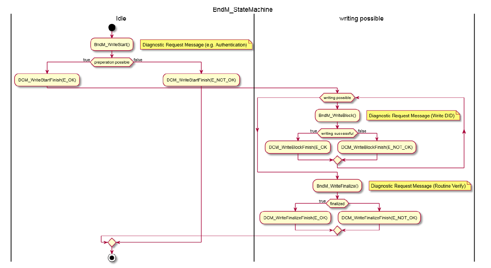

<section id="title">AUTOSAR BndM（非易失性大容量数据管理器）</section>

# 1. 介绍和功能概述

本规范描述了 **AUTOSAR** 基础软件模块 **BulkNvDataManager** 的功能、API 和配置。

对于变体编码（**variant-coding**）等用例场景，对于非易失性大容量数据的需求正在增加。此类数据经常使用，但很少更新。与 **NvM** 相比，**BulkNvDataManager** 提供了一个 API 来直接从闪存中读取数据。带来的好处就是避免了 **RAM** 镜像，但缺点就是数据的写入会更加复杂。

变体编码（**Variant coding**）是车辆特定的数据集，它在每辆车的生产过程中计算并生成，当然也在生产过程中保存。

**注意事项：**

**AUTOSAR Classic Platform** 中的整个内存堆栈将在即将发布的 20/11 版本中进行系统审查。这可能会导致架构发生变化，例如将 **BndM** 功能集成到 **NvM** 中。

# 2. 缩略语

下面的词汇表包括与 BulkNvDataManager 相关的首字母缩写词和缩写词，它们未包含在 AUTOSAR 词汇表[1]中。

# 3. 相关文档

## 3.1. 输入文件及相关标准规范

**[1] Glossary**
> AUTOSAR_TR_Glossary

**[2] General Specification of Basic Software Modules**
> AUTOSAR_SWS_BSWGeneral

## 3.2. 相关规范

因为 **AUTOSAR** 提供了一个关于基础软件模块的通用规范 SWS BSW General[2]，它对 **BulkNvDataManager** 也有效，所以，规范 SWS BSW General 应被视为 **BulkNvDataManager** 的附加和必需规范。

# 4. 约束和假设

## 4.1. 限制

对底层闪存驱动程序（例如：**FlashEEPROMEmulation**）潜在的并行访问的同步不是此 **AUTOSAR** 版本的一部分。

目前仅支持高端微控制器中，使用 **A/B** 扇区开关的 **PFlash** 写入。 这限制了 **BndM** 对支持此功能的架构的适用性。

# 5. 对其他模块的依赖

该模块依赖于底层闪存驱动程序的功能。

# 6. 功能规格

一般来说，**BndM** 将如何管理其闪存的概念是特定于供应商的。

基本思想是对数据块进行 **A/B**分区切换。这意味着完整的非易失性大容量数据（**Bulk NvData**）将存储在分区 **A** 中。当写入动作开始时（BndM_WriteStart），需要擦除 **B** 分区。更新的数据块（**BndM_WriteBlock**）将写入到分区 **B**。最终确定阶段（**BndM_WriteFinalize**）将使分区 B 保持一致，例如：通过将未更新的块复制到分区 B，并将活动分区切换到 B，即：进一步调用 **BndM_GetBlockPtr** 将指向分区B中的数据。尽管如此，供应商解决方案可以考虑替代解决方案，例如：通过 **FlashBootloader** 进行更新。

**BndM** 需在可直接访问的内存（即：通过指针）中管理其 **BndM** 块（**BndMBlockDescriptor**）。

**BndM_GetBlockPtr** 的调用应将基指针传递给当前活动分区中相应的 **BndM** 块（**BndMBlockDescriptor**）。

**BndM_WriteStart** 的调用将触发第二个（空闲）分区的准备。

**注意：**

根据实现的策略，准备工作可能需要更多时间。这可以在 **BndM_MainFunction** 中进行协调。注意：如果对闪存进行直接写访问，则需要擦除闪存页面。

**警告：**

根据硬件的不同，无法对代码闪存进行并行读写访问。在这种情况下，整个 **ECU** 需要处于写入模式。例如：**FlashBootloader** 上下文或所有其他任务都被中断/停止。

在成功完成第二个（空闲）分区的准备后,可以写入第二个分区，需在 **BndM_MainFunction** 的上下文中调用回调函数 **Xxx_BndMWriteStartFinish**， 并将结果设置为 **E_OK** 。

如果 **BndM_WriteStart** 调用处于活动写入阶段，即：**BndM_WriteStart** 和 **BndM_WriteFinalize** 之间的阶段，则 **BndM_WriteStart** 的调用将会被拒绝，并错误代码会被设置为 **E_NOT_OK**。

**BndM_WriteBlock** 的调用需触发将数据写入第二个（未使用的）分区。数据（ImplementationDataType）不允许通过指针访问并被修改。
****
在第二个（空闲）分区的写入完成后，需在 **BndM_MainFunction** 的上下文中调用回调函数 **Xxx_BndMWriteBlockFinish**，并将结果设置为 **E_OK** 。

在以下的情况下，调用 **BndM_WriteBlock** 函数，**BndM_WriteBlock**函数的调用需被拒绝，并将错误代码设置为 **E_NOT_OK**：

1. 在先前 **BndM_WriteStart** 函数未曾调用的情况下。
2. 同一块或另一个块数据，正在进行另一次写入中。
3. 调用发生在 **BndM** 的终结模式下。

**BndM_WriteFinalize** 的调用将触发第二个（未使用的）分区的最终化工作（**finalization**）。在后台，**BndM** 需通过将所有未更改的 **BndMBlockDescriptor** 复制到第二个（未使用的）分区来使第二个（未使用的）分区的数据保持一致。

如果最终确定成功，**BndM** 需将第二个（未使用的）分区设为活动分区，并调用回调函数 **Xxx_BndMWriteFinalizeFinish**，并将结果设置为 **E_OK**

**注意：**

在最终确定成功后，对 **BndM_GetBlockPtr** 的进一步调用将指向第二个（现在活动的）分区中的数据。

如果最终确定不成功，即：因为第二个分区数据不一致，所以数据不能使用。**BndM** 应将当前活动分区保持为活动分区，并触发回调 **Xxx_BndMWriteFinalizeFinish**，并将结果设置为 **E_NOT_OK**。

在没有先前 **BndM_WriteStart** 函数未被调用的情况下，或者 **BndM** 已经在最终化模式（**finalization mode**）中，当 **BndM_WriteFinalize** 函数被调用，**BndM_WriteFinalize** 需抛出一个 **BndM_E_WRONG_SEQUENCE** 的 **DET** 错误。



# 7. API规范

## 7.1. 函数定义
 
### 7.1.1. BndM_Init

**说明**: 初始化或重新初始化此模块。

```C
void BndM_Init (
    const BndM_ConfigType* ConfigPtr
)
```

### 7.1.2. BndM_GetVersionInfo

**说明**: 返回此模块的版本信息。**API** 可用性：此 **API** 仅在 (BndM/BndMGeneral.BndMVersionInfoApi) == true 时可用）

```C
void BndM_GetVersionInfo (
Std_VersionInfoType* versioninfo
)
```

### 7.1.3. BndM_GetBlockPtr_<BlockId.Shortname>

**说明**: 

```C
Std_ReturnType BndM_GetBlockPtr_<BlockId.Shortname> (
    BndM_BlockIdType BlockId,
    BndM_Block{BlockId.Shortname}Type** BndM_BlockPtr
)
```

### 7.1.4. BndM_WriteStart

**说明**: 将触发写入阶段的开始。 异步处理完成会触发回调 xxx_BndMWriteStartFinish 包括本次操作的结果。

```C
Std_ReturnType BndM_WriteStart (
    void
)
```

### 7.1.5. BndM_WriteBlock_<BlockId.Shortname>

**说明**: 将数据保存在闪存中，以后可以通过 **BndM_GetBlockPtr** API 直接访问。写入需要一段时间，在成功回调 **xxx_BndMWriteBlockFinish** 后完成。

```C
Std_ReturnType BndM_WriteBlock_<BlockId.Shortname> (
    BndM_BlockIdType BlockId,
    const BndM_Block{BlockId.Shortname}Type* BndM_SrcPtr
)
```

### 7.1.6. BndM_WriteFinalize

**说明**: Reentrant 完成写作。成功回调 **xxx_BndMWriteFinalizeFinish** 后完成完成。即：新存储的数据可用。

```C
Std_ReturnType BndM_WriteFinalize (
    void
)
```

### 7.1.7. BndM_WriteCancel

**说明**: 取消写入。

```C
void BndM_WriteCancel (
    void
)
```

## 7.2. 回调通知

这是为 FLS 模块提供的函数列表。

### 7.2.1. BndM_JobEndNotification

**说明**: 当 FLS 作业完成并获得肯定结果时调用此回调函数。

```C
void BndM_JobEndNotification (
    void
)
```

### 7.2.2. BndM_JobErrorNotification

**说明**: 当 FLS 作业已被取消或以负面结果完成时，将调用此回调函数。

```C
void BndM_JobErrorNotification (
    void
)
```

## 调度函数

这些函数由 Basic Software Scheduler 直接调用。 以下函数应没有返回值和参数。所有函数均不可重入。

### 7.2.1. BndM_MainFunction

**说明**: 后台处理的调度函数。

```C
void BndM_MainFunction (
    void
)
```


<section id="wechat">

<h4>微信扫一扫，获取更多及时资讯</h4>


</section>

