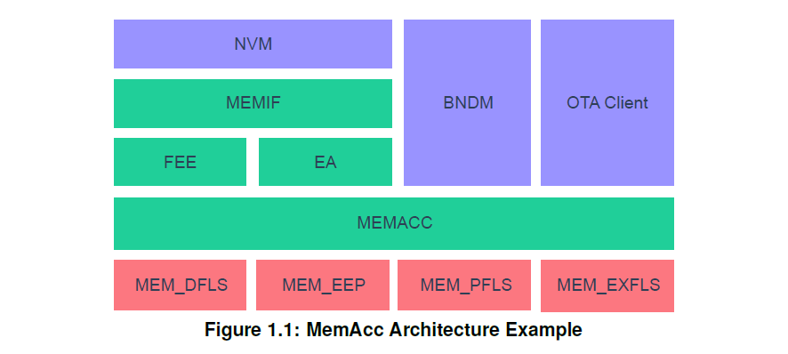
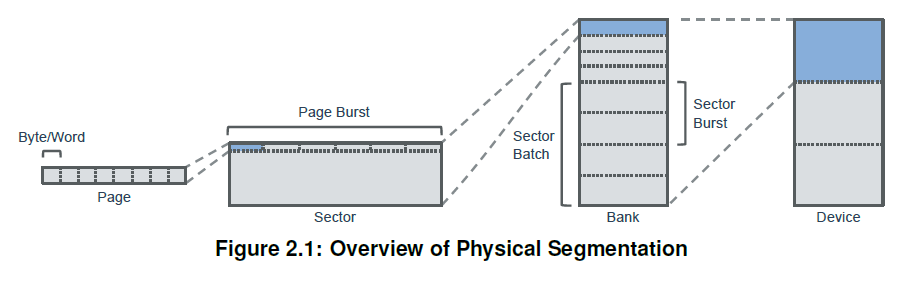
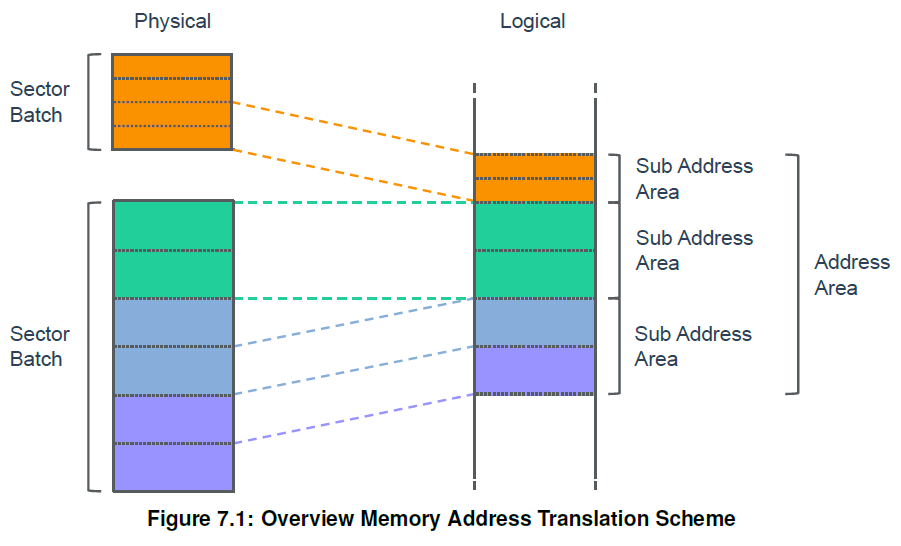

<section id="title">AUTOSAR Memory Access（存储访问）</section>

# 1. 介绍和功能概述

本文介绍了 **AUTOSAR** 基本软件模块存储访问 (**MemAcc**) 的功能、API 和配置。

存储访问模块通过基于地址（**address-based**）的 API 提供对不同存储技术设备的访问。

存储访问模块总是通过一个或者多个存储驱动程序 (Mem) 来补充。存储访问模块与存储设备技术无关，可用于多种典型的存储设备，例如：闪存、EEPROM、RAM 或者相变存储器（**phase change memory**）。

**Memory Access** 模块和 **Memory Driver**模块，与 **Fls** 和 **Eep** 驱动一样，处于 **AUTOSAR** 架构的同一层次。但是把这些模块分为两大部分：独立于硬件的部分（**MemAcc**）和硬件相关的部分（**Mem**）。

下图显示了具有不同存储驱动程序和上层的示例架构概览：

## 1.1. 支持的使用用例

**MemAcc** 模块和 **Mem** 驱动程序的组合支持以下用例场景：

* 使用 **NvM** 和 **Fee** 或 **Ea** 进行数据存储的基于块的非易失性存储访问。
* OTA软件更新。
* 一般基于地址的存储访问，例如：用于 **BndM** 或闪存引导加载程序（**flash bootloader**）的使用。

也支持以上这些用例的组合使用。

因为 **MemAcc** 模块和 **Mem** 驱动程序还涵盖了非易失性数据存储的 **Fls** 和 **Eep** 用例，所以 **Fls** 和 **Eep** 在未来会过时。

# 2. 缩略语

下面的词汇表包括与 **MemAcc** 模块相关的首字母缩写词和缩写词，它们均未包含在 **AUTOSAR** 词汇表[1]中。

## 2.1. 缩写/首字母缩略词

**BndM**
> 大容量非易失性数据管理器（**Bulk Non-Volatile Data Manager**）

**ECC**
> 纠错码（**Error Correction Code**）

**FOTA**
> 固件远程升级（**Firmware Over The Air**），使用无线通信进行固件远程更新

**HSM** 
> 硬件安全模块（**Hardware Security Module**），专用安全 **MCU**内核

**OTA** 
> 远程升级（**Over The Air**），OEM 后台（**backend**）与车辆之间无线通信的总称。

**RWW**
> 并行读写（**Read While Write**）， 存储设备在一个存储体中执行读取操作，同时在另一个存储体中进行写入/擦除操作的能力。

**SOTA**
> 软件远程升级（**Software Over The Air**），使用无线通信进行软件远程更新。

## 2.2. 术语

**Address Area**
> 地址区（Address Area）是指逻辑地址空间中连续的存储区域。通常多个物理存储扇区组合到一个逻辑地址区域。

**Bank** 
> **Bank** 是指一组扇区批次（**Section Batch**）. 如果存储器技术被分段成扇区，则 **Bank** 是扇区批处理组的一个实例，其中不允许进行边写边读操作。在闪存设备的情况下，这通常映射到单独的闪存控制器。

**Job Request**
> 作业请求（**Job Request**）是指上层模块对地址区的存储访问请求。

**Memory Device**  
> 存储设备（**Memory Device**）是指一组 **bank**。

**Page Burst** 
> 存储页面的聚合访问以提高性能。在存储设备技术具有物理分段（**physical segmentation**）的情况下，一些存储设备提供优化的访问方法，支持一次读取或写入多个页面。页面突发（**Page Burst**）表示用于访问优化的存储页面的聚合。

**Read Page** 
> 读取页面（**Read Page**）是指存储设备的最小可读单位（以字节为单位）。因为一些存储设备技术的访问必须考虑到物理分段（**physical segmentation**）,所以并非所有存储设备技术都可以按字节访问。该术语定义了一次访问中需要读取页面最小的大小。

**Sector** 
> 扇区（**Sector**）是指最小的可擦除存储单元（以字节为单位）。某些存储设备技术需要在写入存储之前进行明确的物理擦除操作。扇区定义了这种擦除单元的最小大小。根据存储设备的不同，扇区可以是统一大小的或可变大小的。

**Sector Batch** 
> 扇区批次（**Sector Batch**）是指具有统一大小的扇区的集合。具有相同大小的连续扇区的逻辑集合。

**Sector Burst** 
> 扇区突发（**Sector Burst**）是指聚合扇区以提高擦除性能。如果存储技术需要物理擦除操作，一些设备通过一步擦除扇区集合来提供擦除性能优化。

**Sub Address Area** 
> 子地址区（**Sub Address Area**）是指逻辑地址空间中的连续存储区域映射到一个存储设备的一个扇区批次（**Sector Batch**）。

**Write Page**
> 写入页面（**Write Page**）是指存储设备的最小可写单元（以字节为单位）。因为一些存储设备技术的访问必须考虑到物理分段，所以并非所有存储设备技术都可以按字节访问。该术语定义了一次访问中需要写入页面最小的大小。

## 2.3. 物理分段（**physical segmentation**）

下图 2.1 概述了物理分段和相应的技术术语：

# 3. 相关文档

## 3.1. 输入文件及相关标准规范

[1] Glossary
> AUTOSAR_TR_Glossary

[2] General Specification of Basic Software Modules
> AUTOSAR_SWS_BSWGeneral

[3] Requirements on Memory Hardware Abstraction Layer
> AUTOSAR_SRS_MemoryHWAbstractionLayer

[4] General Requirements on Basic Software Modules
> AUTOSAR_SRS_BSWGeneral

[5] Requirements on AUTOSAR Features
> AUTOSAR_RS_Features

# 4. 约束和假设

为了能够控制和协调共享存储资源的访问，所有存储上层模块都需要使用 **MemAcc** 模块来访问这些共享存储资源。此约束的唯一例外是在离散时间点的独占存储访问。

## 4.1. 限制

### 4.1.1. 一般限制

**MemAcc** 模块用于基于地址的存储访问。不考虑基于文件的访问。 同时基于块的存储设备，如果需要显式的坏块管理的 **NAND** 闪存设备，也不在本规范的范围内。

### 4.1.2. 存储映射访问

因为不可能同时对共享存储资源（**shared memory resource**）执行存储映射访问，所以 **AUTOSAR** 存储栈提供了在共享存储资源上执行访问的机制。

此限制适用于闪存（**flash**）或 **EEPROM** 等存储器设备，存储器必须置于特殊的编程模式下，在该模式下无法进行并发的读取访问。此限制适用于内部和外部共享存储设备，也会影响基于硬件的闪存 **EEPROM** 仿真。

如果需要存储映射访问，则必须在应用程序级别实现 **MemAcc** 协调。由应用程序必须确保没有对共享存储执行并发的访问。

## 4.2. 适用于汽车领域

**MemAcc** 模块可用于任何需要 **MemAcc** 来存储数据或执行软件更新的域应用程序。

# 5. 对其他模块的依赖

**MemAcc** 模块依赖 闪存 EEPROM 仿真 (**Fee**)、EEPROM 抽象 (**Ea**)、大容量 Nv 数据管理器 (**BndM**)、存储驱动程序 (**Mem**)、默认错误跟踪器 (**DET**) 的接口 。如果作为 **OTA** 软件的更新客户端，也依赖到复杂设备驱动程序 (**CDD**)。

**MemAcc** 模块包括 **DET** 和 **MemMap** 的头文件。

# 6. 功能规格

本章描述了 **MemAcc** 模块的行为。

## 6.1. 概述

**MemAcc** 模块为不同的上层模块提供与存储设备无关的基于地址的存储访问。它实现了所有高级功能，如：作业管理、访问协调和根据物理分段分配内存驱动程序访问请求，因为内存驱动程序期望所有存储访问与物理段对齐。

## 6.2. 关键方面

* **Fee**、**Ea**、**OTA** 软件更新客户端等不同上层访问协调。
* 内存技术设备不可知，通过 **API** 支持各种内存，甚至包括：代码内存。
* 协调 **CPU** 的不同内核，如：主核和 **HSM** 内核。 
* 存储访问作业管理
* 内存区域的虚拟化，以支持非连续区域的映射以及跨不同存储设备的跨越区域。
* 内存位置到存储设备的映射。
* 根据闪存的页面和扇区等物理段拆分内存驱动程序访问请求。

## 6.3. 功能元素

### 6.3.1. 内存地址转换

**MemAcc** 模块将 **Mem** 驱动的物理内存寻址方案通过逻辑地址空间的方式抽象给上层。

图 7.1 提供了内存地址转换/映射方案的概览：

所有 **MemAcc** 服务，即：擦除、读取和写入，都应支持基于逻辑/物理内存映射跨越存储设备边界的访问请求。

#### 6.3.1.1. 内存映射约束

一个地址区只能分配给一个上层模块。由于每个地址区域只允许一个内存作业，所以地址区域和上层之间存在 **1:1** 的关系。

在一个子地址（**sub-address**）区域内，只允许统一扇区的大小（**uniform sector size**）。

**注意：**

一个子地址区域映射到一个扇区批次。

地址区的起始地址和长度应与物理扇区对齐。

**注意：**

存储访问的起始地址和长度必须与物理分段对齐。

### 6.3.2. 存储访问协调