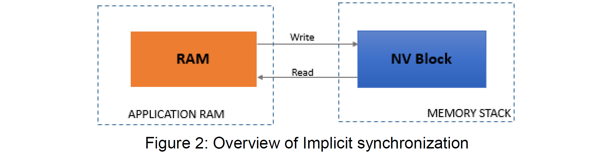

<section id="title">NV数据处理指南</section>

# 1. 简介和功能概述

本文档本规范描述了**AUTOSAR**基础软件模块 NVRAM Manager (NvM) 的功能、API 和配置。，以及应用软件组件（**application software components**）可用的各种访问机制。

本文在[第4章节](#4-总体机制和概念)中先简要介绍了非易失性内存概念，接着在[第5章节](#5-用例总结)中介绍了从应用程序（即：最终用户）访问非易失性内存的各种用例。

# 2. 缩略语

**NvM**
> NVRAM管理器（**NVRAM Manager**）

**NV**
> 非易失性（**Non-volatile**）

**NVRAM**
> 非易失性随机存取存储器（**Non-volatile Random Access Memory**）

**NVRAM Block**
> **NVRAM**块（**NVRAM Block**）是管理和存储**NV**数据块所需的整个结构。

**NV Block**
> **NV**块（**NV Block**）是一个基本存储对象。用来表示驻留在**NV内存**中的那部分**NVRAM**块。

**RAM Block**
> **RAM Block**是一个基本存储对象。用来表示驻留在**RAM**中的那部分**NVRAM**块。

**RAM Mirror**
> **RAM镜像**是**NvM**内部缓冲区。当NvMBlockUseSyncMechanism设置为TRUE时，用于操作读取和写入的NVRAM Block数据的**RAM Block**。

**ROM Block**
> **ROM Block**是一个基本存储对象。用来表示驻留在**ROM**中的那部分**NVRAM**块。

**ROM**
> 只读存储器（**Read-Only Memory**）

**RTE**
> 运行环境（**Runtime Environment**）

**SW-C**
> 软件组件（**Software Component**）

# 3. 相关文档

[1] AUTOSAR Specification for Runtime Environment 
> AUTOSAR_SWS_RTE.pdf

[2] AUTOSAR Template Specification of Software Component 
> AUTOSAR_TPS_SoftwareComponentTemplate.pdf

[3] AUTOSAR Specification for NVRAM Manager 
> AUTOSAR_SWS_NVRAMManager.pdf

[4] AUTOSAR Guide on Mode Management 
> AUTOSAR_EXP_ModeManagementGuide.pdf

# 4. 总体机制和概念

## 4.1. NVM及其特点

易变性（**Changeability**）和持久性（**durability**）是**ECU**内部数据所具有的相关属性。为了在不同的上电周期里数据都是可用的，变化的数据需要保存在非易失性存储器（**Non-volatile memory**）中。保存在非易失性存储器（**Non-volatile memory**）中的数据被称为**NV**数据。在**AUTOSAR**中，应用程序只能通过NVRAM管理器 (**NvM**) 访问非易失性存储器。**NvM**模块为数据的管理和维护提供所需的同步及异步服务。

下图1显示了应用程序（**Application**）和内存堆栈（**Memory Stack**）之间的交互以及所涉及的模块。

接着的章节将概述**NvM**模块提供的不同概念和功能。有关更详细信息请参阅文档[3]。

## 4.2. 基本存储对象

基本存储对象（**Basic Storage Object**）是**NVRAM**块的最小实体。若干个基本存储对象的组合可以用来构建**NVRAM**块。

基本存储对象可以驻留在不同的内存位置：

* RAM
* ROM
* NV内存

### 4.2.1. RAM块

RAM块（**RAM Block**）是一种基本存储对象，它用来表示驻留在**RAM**中的那部分**NVRAM**块。

RAM块由用户数据（**user data**）和可选的CRC值和可选**NV Block header**组成，用来保存实时数据（**live data**），是**NVRAM**块的可选部分（**optional part**）。

#### 4.2.1.1. ROM块

ROM块（**ROM Block**）也是一种基本存储对象，它用来表示驻留在**ROM**中那部分**NVRAM**块。**ROM Block**也是**NVRAM**块的可选部分（**optional part**）。

ROM块的内容具有持久性(**persistent nature**）的特性。同时在程序执行期间，其内容是无法被修改的。它驻留在**ROM/Flash**中。当**NV Block**为空或者损坏的情况下，**ROM Block**提供默认数据（**default data**）。

### 4.2.2. NV块

NV块（**NV Block**）也是一种基本存储对象。它用来表示驻留在NV内存中那部分**NVRAM**块。**NV**块是**NVRAM**块的必不可少的部分。

NV块的内容也具有持久性的特性，但在程序执行期间，其内容是可以被修改。它驻留在**Flash**中。 

NV块由用户数据（**user data**）和可选的CRC值和可选**NV Block header**组成。它用于保存定期的或者根据请求需要存储的实时数据。

### 4.2.3. 管理块

管理块（**Administrative Block**）也是一种基本存储对象。它驻留在**RAM**中。管理块也是**NVRAM**块中必不可少的部分。

管理块的内容也具有非持久性的特性，驻留在**RAM**中。 

管理块主要用于保存相应**NVRAM**块的属性/错误/状态信息，以及专用于数据集（**Dataset**）类型的NVRAM Block的块索引。

## 4.3. 块管理类型

**NvM**模块支持以下**NVRAM**块管理类型：

### 4.3.1. 原生NVRAM块

原生NVRAM块（**Native NVRAM Block**）是最简单的块管理类型。它允许以最小的开销存储数据到**NV**内存中，同时从**NV**内存中取回数据。

**NVM_BLOCK_NATIVE**类型的**NVRAM**存储由以下基本存储对象组成：

* **NV**块：1个
* **RAM**块：1个
* **ROM**块：0..1个
* 管理块：1个

### 4.3.2. 冗余NVRAM块

除了原生**NVRAM**块外，冗余**NVRAM**块（**Redundant NVRAM block**）提供了增强的容错性（**fault tolerance**）、可靠性（**reliability**）和可用性（**availability**）。它增加了对数据损坏的抵抗力。冗余**NVRAM**块由两个**NV**块、一个**RAM**块和一个管理块组成。

例如在读取期间，如果与冗余**NVRAM**块关联的**NV**块被视为无效，**NvM**模块会尝试使用来自未损坏**NV**块的数据来恢复**NV**块。

**NVM_BLOCK_REDUNDANT**类型的**NVRAM**存储由以下基本存储对象组成：

* **NV**块：2个
* **RAM**块：1个
* **ROM**块：0..1个
* 管理块：1个

### 4.3.3. 数据集NVRAM块

数据集NVRAM块（**Dataset NVRAM block**）是大小相等的数据块阵列。应用程序可以一次性访问该数据块中的某一个数据。

**NVM_BLOCK_DATASET**类型的**NVRAM**存储由以下基本存储对象组成：

* **NV**块：1..NvMNvBlockNum个
* **RAM**块：1个
* **ROM**块：0..NvMRomBlockNum个
* 管理块：1个

被配置数据集（NV+ROM 块）的总数必须在**1..255**的范围内。

通过使用**NvM_SetDataIndex**的API函数可以设置相应的索引来访问特定的数据集元素。索引从**0**到**NvMNvBlockNum - 1**的元素表示**NV**块，而索引从 **NvMNvBlockNum**到**NvMNvBlockNum + NvMRomBlockNum - 1**的元素表示**ROM**块。**NVRAM**块用户必须确保在访问数据元素之前选择了有效的数据集索引。

## 4.4. 支持同步机制

在对**NvM**模块的**RAM**镜像（**RAM mirror**）数据进行访问时，NvM模块支持两种类型的同步机制。

### 4.4.1. 隐式同步

在隐式同步（**Implicit synchronization**）中，应用程序和**NvM**可以同时访问一个公共**RAM**块。应用程序通过调用**NvM API**将数据写入**RAM**，或者从**RAM**读取数据。

在这种情况下，**RAM**块映射到一个**SW-C**，不建议共享**RAM**块。 每当**SW-C**通过**RAM**块（临时/永久）访问**NVRAM**时，**SW-C**必须确保**RAM**块数据的一致性，直到**NvM**完成正在进行的操作。

使用隐式同步时，以下步骤需要被考虑到：

**单块写入请求（NvM_WriteBlock 和 NvM_WritePRAMBlock）：**

1. 应用程序需提供了一个**RAM**块包含了将要写入的数据。
2. 应用程序调用**NvM_WriteBlock**或者**NvM_WritePRAMBlock**发出写入请求，并将控制权移交给**NvM**模块。
3. 应用程序在发出写入请求后，在请求结束之前不得修改**RAM**块的内容，但可以读取**RAM**块。
4. 应用程序可以使用轮询来获取写入请求的处理状态，也可以通过设置回调函数让**NvM**模块异步通知应用程序。
5. **NvM**模块操作完成后，**RAM**块可重用于修改。

**单块读取请求（NvM_ReadBlock, NvM_ReadPRAMBlock, NvM_RestoreBlockDefaults, NvM_RestorePRAMBlockDefaults）：**

1. 应用程序需提供了一个**RAM**块，用于保存将被填充的**NVRAM**数据。
2. 应用程序调用**NvM**模块接口向**NvM**模块发出读取/恢复请求。
3. 应用程序在发出读取/恢复请求后，在请求结束前不得修改**RAM**块的内容。

**多块写入请求（NvM_WriteAll）：**

1. 应用程序需提供了一个**RAM**块包含了将要写入的数据。
2. **NvM_WriteAll**由E**cuM**在关机期间发出。
3. 启动关机程序后，应用程序不得再修改**RAM**块的内容。

**多块读取请求（NvM_ReadAll）：**

1. 应用程序需提供了一个**RAM**块，用于保存将被填充的**NVRAM**数据。
2. **NvM_ReadAll**由**EcuM**在启动期间发出。
3. 启动程序启动后，应用程序不得修改**RAM**块的内容，直到**NvM_ReadAll**处理完成。

### 4.4.2. 显式同步

在显式同步（**Explicit synchronization**）中，**NvM**定义了一个**RAM**镜像（**RAM Mirror**），用于与应用程序的**RAM**块交换数据。应用程序将数据写入**RAM**块并调用**NvM**写入API。**NvM**调用**API**读取**RAM**镜像，把数据从**RAM**镜像复制到**RAM**块中，最后写入到**NV**块中。应用程序通过**NvM**模块调用的回调例程双向传输数据。

优点是应用程序可以有效地控制他们的**RAM**块。他们负责使用**ReadRamBlockFromNvM** / **WriteRamBlockToNvM**从**NvM**模块的**RAM**镜像中复制一致性的数据。 应用程序需确保向/从RAM镜像复制数据时，**RAM**块的数据的完整性。

缺点是需要额外的与使用这种机制的最大**NVRAM**块具有相同的大小的**RAM**，以及每次操作都需要在两个**RAM**位置之间进行额外的数据复制。

如果有一个模块（例如：**NvBlockSwComponentType**）可以同步这些应用程序，并且此模块从**NvM**模块的角度来看是**NVRAM**块的所有者，那么这种机制可以支持不同应用程序共享**NVRAM**块。

使用显式同步时，以下步骤需要被考虑到：

**单块写入请求（NvM_WriteBlock 和 NvM_WritePRAMBlock）：**

1. 应用程序需提供了一个**RAM**块包含了将要写入的数据。
2. 应用程序调用**NvM_WriteBlock**或者**NvM_WritePRAMBlock**发出写入请求。
3. 发出写入请求后一直到回调例程被调用期间，**RAM**块允许被修改。
4. **NvM**模块会调用通过**NvMWriteRamBlockToNvCallback**配置的例程，以便将应用程序数据与**NvM**的内部缓冲区进行同步。
5. 应用程序可以通过回调函数的返回值向**NvM**模块发送数据是否复制成功的信号。如果用户自定义回调函数的返回值为**E_NOT_OK**，**NvM**模块会重新尝试配置参数**NvMRepeatMirrorOperations**次的操作。
6. 直到数据被同步到**NvM**模块后，应用程序才可以再次读取和写入**RAM**块。
7. 应用程序可以使用轮询来获取写入请求的处理状态，也可以通过设置回调函数让**NvM**模块异步通知应用程序。

**单块读取请求（NvM_ReadBlock, NvM_ReadPRAMBlock, NvM_RestoreBlockDefaults, NvM_RestorePRAMBlockDefaults）：**

1. 应用程序需提供了一个**RAM**块，用于保存将被填充的**NVRAM**数据。
2. 应用程序调用**NvM**模块接口向**NvM**模块发出读取/恢复请求。
3. 发出读取/恢复请求一直到回调例程被调用期间，**RAM**块允许被修改。
4. **NvM**模块调用通过**NvMReadRamBlockFromNvCallback**配置的例程，以便将应用程序数据与**NvM**的内部缓冲区进行同步。
5. 应用程序可以通过回调函数的返回值向**NvM**模块发送数据是否复制成功的信号。如果用户自定义回调函数的返回值为**E_NOT_OK**，**NvM**模块会重新尝试配置参数**NvMRepeatMirrorOperations**次的操作。

**多块写入请求（NvM_WriteAll）：**

1. 应用程序需提供了一个**RAM**块包含了将要写入的数据。
2. **NvM_WriteAll**由E**EcuM**在关机期间发出。
3. 在关机序列一直到回调例程被调用期间，应用程序可以修改**RAM**块。
4. 当回调例程被调用时，**NvM_WriteAll**开始处理数据块。
5. **NvM**模块调用通过**NvMReadRamBlockFromNvCallback**配置的例程，以便将应用程序数据与**NvM**的内部缓冲区进行同步。
6. 应用程序可以通过回调函数的返回值向**NvM**模块发送数据是否复制成功的信号。如果用户自定义回调函数的返回值为**E_NOT_OK**，**NvM**模块会重新尝试配置参数**NvMRepeatMirrorOperations**次的操作。

**多块读取请求（NvM_ReadAll）：**

1. 应用程序需提供了一个**RAM**块，用于保存将被填充的**NVRAM**数据。
2. **NvM_ReadAll**由**EcuM**在启动期间发出。
3. 启动程序启动一直到回调例程被调用期间，应用程序可以修改**RAM**块。
4. 当回调例程被调用时，**NvM_ReadAll**开始处理数据块。
5. **NvM**模块调用通过**NvMReadRamBlockFromNvCallback**配置的例程，以便将应用程序数据与**NvM**的内部缓冲区进行同步。
6. 应用程序可以通过回调函数的返回值向**NvM**模块发送数据是否复制成功的信号。如果用户自定义回调函数的返回值为**E_NOT_OK**，**NvM**模块会重新尝试配置参数**NvMRepeatMirrorOperations**次的操作。

# 5. 用例总结