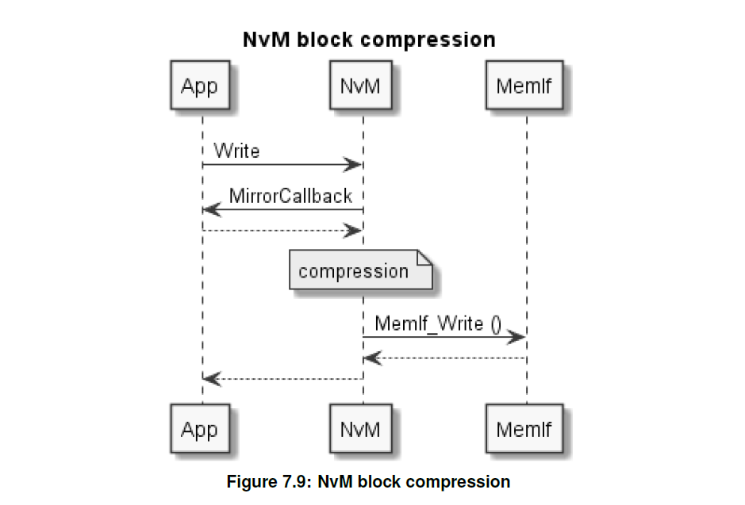

<section id="title">AUTOSAR NVM（非易失性存储管理器）</section>

# 1. 简介和功能概述

本文档介绍了 **AUTOSAR** 基础软件模块 **NVRAM Manager** (**NvM**) 的功能、API以及配置。

**NvM** 模块需根据汽车环境中的个性化需求，提供确保 **NV** (**non volatile**) 即非易失性数据进行数据存储和维护的服务。**NvM** 模块应能够管理 **EEPROM** 和 **FLASH EEPROM** 仿真设备的 **NV** 数据。

**NvM** 模块需为NV数据的管理和维护，包括：初始化、读、写、控制，提供所需的同步或者异步服务。

不同块之间的关系可以如下图所示：

# 2. 缩略语

**基本存储对象（Basic Storage Object）**
> “基本存储对象” 是 **NVRAM** 块的最小实体。多个基本存储对象可用于构建 **NVRAM** 块。“基本存储对象”可以驻留在不同的内存位置，包括：**RAM**、**ROM**、NV内存（**NV memory**）中。

**NVRAM块（NVRAM Block）**
> “NVRAM块” 是管理和存储 NV 数据块所需的整个结构。

**NV数据（NV data）**
> “NV数据” 是指要存储在非易失性存储器中的数据。

**块管理类型（Block Management Type）**
> NVRAM块的类型。它取决于 NVRAM 块在不同强制/可选基本存储对象块中的（可配置）单独组合以及此 NVRAM 块的后续处理。

**RAM块（RAM Block）**
> “RAM块” 是 “基本存储对象”。它代表驻留在 **RAM** 中的 “NVRAM块” 的一部分。

**ROM块（ROM Block）** 
> “ROM块”是“基本存储对象”。它代表驻留在 **ROM** 中的 “NVRAM块” 的一部分。“**ROM块**”是“**NVRAM块**”的可选部分。

**NV块（NV Block）**
> “NV块”是“基本存储对象”。它代表驻留在 **NV内存** 中的 “NVRAM块” 的一部分。“**NV块**”是“**NVRAM块**”的强制性部分。

**NV块标头（NV Block Header）**
> 如果启用 “**静态块ID**” 机制，则**NV块**中包含的附加信息。

**管理块（Administrative Block）** 
> “管理块”是“基本存储对象”。它驻留在 **RAM** 中。“**管理块**”是“**NVRAM块**”的强制部分。

**默认错误跟踪器（DET）** 
> 默认错误跟踪器（**Default Error Tracer**）报告开发错误的模块。

**诊断事件管理器（DEM）** 
> 诊断事件管理器（**Diagnostic Event Manager**） 接受报告的相关错误的模块 

**非易失性（NV）** 
> 非易失性（**Non volatile**）

**FEE** 
> 闪存 EEPROM 仿真（Flash EEPROM Emulation）

**EA** 
> EEPROM 抽象（EEPROM Abstraction）

**FCFS** 
> 先到先服务（First come first served）

# 3. 相关文档

## 3.1. 输入文件及相关标准规范

[1] 词汇表 Glossary
> AUTOSAR_TR_Glossary

[2] 基础软件模块通用规范 (General Specification of Basic Software Modules)
> AUTOSAR_SWS_BSWGeneral

[3] 分层软件架构（Layered Software Architecture）
> AUTOSAR_EXP_LayeredSoftwareArchitecture

[4] EEPROM 抽象规范（Specification of EEPROM Abstraction）
> AUTOSAR_SWS_EEPROMAbstraction

[5] Flash EEPROM 仿真规范（Specification of Flash EEPROM Emulation）
> AUTOSAR_SWS_FlashEEPROMEmulation

[6] 内存抽象接口规范（Specification of Memory Abstraction Interface）
> AUTOSAR_SWS_MemoryAbstractionInterface

[7] CRC 例程规范（Specification of CRC Routines）
> AUTOSAR_SWS_CRCLibrary

[8] EEPROM驱动程序规格（Specification of EEPROM Driver）
> AUTOSAR_SWS_EEPROMDriver

[9] Flash驱动程序规格（Specification of Flash Driver）
> AUTOSAR_SWS_FlashDriver

[10] I/O 硬件抽象需求（Requirements on I/O Hardware Abstraction）
> AUTOSAR_SRS_IOHWAbstraction

[11] 内存服务需求（Requirements on Memory Services）
> AUTOSAR_SRS_MemoryServices

[12] 基本软件模块的一般需求（General Requirements on Basic Software Modules）
> AUTOSAR_SRS_BSWGeneral

[13] 软件组件模板需求（Requirements on Software Component Template）
> AUTOSAR_RS_SoftwareComponentTemplate

[14] RTE软件规格（Specification of RTE Software）
> AUTOSAR_SWS_RTE

## 3.2. 相关规格

**AUTOSAR** 提供了基本软件模块的通用规范 [2，SWS BSW General]，该规范对于 NvM 模块也适用。所以基本软件模块的通用规范应被视为 NvM 的附加且必需的规范。

# 4. 约束和假设

## 4.1. 限制

限制主要在于块管理类型（**Block Management Types**）的有限数量及其对**NV数据**的单独处理。这些限制可以通过增强的用户自定义管理信息（**user defined management information**）来降低，用户自定义管理信息信息可以作为存储真实**NV数据**的结构化部分。在这种情况下，用户定义的管理信息至少必须由应用程序解释和处理。

## 4.2. 汽车领域的适用性

无限制。

## 4.3. 冲突

NvM 可配置为，使用其他软件模块或者集成代码的功能。如：使用 **Csm** 模块进行块数据的加解密。以及块数据的压缩。集成工程师有责任确保：

* NvM 在使用此功能时，所需的功能可用。例如：被调用的 Csm 已经初始化 [或尚未取消初始化]；被调用模块中所需的主函数被执行；等等。
* NvM 在使用此功能时，所需的时间可用。例如：加密算法可能需要一些时间，因此对于需要加密/解密的块，NvM的读/写功能可能需要更长的时间。

# 5. 对其他模块的依赖

本节描述与NvM模块和基础软件中其他模块的关系。

## 5.1. 文件结构

### 5.1.1. 头文件结构

包含文件结构需符合如下要求：

* **NvM**模块应包括**NvM.h**、**Dem.h**、**MemIf.h**。
* **NvM**模块的**上层模块**（**upper layer**）需仅包含 **NvM.h**。

## 5.2. 内存抽象模块

内存抽象模块（**memory abstraction modules**）从依赖于硬件的从属驱动程序中抽象出 **NvM** 模块 （参见：参考文档[3]）。内存抽象模块提供由 **NvM** 模块发起的每个块访问的运行时转换，以选择对于所有配置的 **EEPROM** 或闪存存储设备来说唯一的相应驱动程序功能。内存抽象模块是通过为每个 **NVRAM块** 配置的 **NVRAM块** 设备ID 来选择的。NvM通过内存抽象接口模块**Mem If**访问内存抽象模块。（参见：参考文档[4]、[5]、[6]）

## 5.3. CRC 模块

**NvM** 模块使用 **CRC** 生成例程（8/16/32 位）来检查并生成 **NVRAM** 块的 CRC，作为可配置选项。**CRC** 例程必须由外部提供。（参见：参考文档 [7]）

## 5.4. 底层驱动的能力

必须为每个配置的 **NVRAM** 设备，例如：内部或者外部EEPROM、闪存设备，提供一组底层驱动程序功能。每组驱动程序函数内的唯一驱动程序函数在运行时通过内存硬件抽象模块进行选择（参见：第5.2 章）。一组驱动程序功能必须包括写入、读取或维护（例如：擦除）配置的 NVRAM 设备所需的所有功能。 （参见：参考文档[8]、[9]）

# 6. 需求追踪

略

# 7. 功能说明

## 7.1. 基本架构指南

### 7.1.1. 分层软件架构

下图展示了NvM模块的通信交互。

### 7.1.2. 内存硬件抽象的寻址方案

内存抽象接口（**MemIf**）、底层闪存 EEPROM 仿真（**FEE**）和 EEPROM 抽象层（**EA**）为 **NvM** 模块提供虚拟线性 **32** 位地址空间，该空间由 **16** 位块号和 **16** 位块地址偏移组成。

提示：**NvM** 模块理论上允许最大 **65536** 个逻辑块，每个逻辑块的最大大小为 **64** KB。

同时**NvM** 模块需将 **16bit** Fee/Ea 区块号进一步细分为以下部分：

* 位宽为（**16 - NVM_DATASET_SELECTION_BITS**）的 NV块基数（**NV block base number**）（**NVM_NV_BLOCK_BASE_NUMBER**）
* 位宽为（**NVM_DATASET_SELECTION_BITS**）的数据索引（**Data index**）

冗余NVRAM块（**Redundant NVRAM blocks**）对内存硬件抽象进行的处理和寻址，需以和数据集NVRAM块（**Dataset NVRAM blocks**）采用相同的方式。即：冗余NV块需通过使用配置参数 **NvMDatasetSelectionBits** 进行管理。

NV块基数（**NVM_NV_BLOCK_BASE_NUMBER**）需位于Fee/Ea块号的最高有效位中。

配置工具需能进行块标识符（**block identifiers**）配置，**NvM**模块不应修改配置的块标识符。

#### 7.1.2.1. 示例

为了阐明前面描述的用于 NvM <-> 内存硬件抽象交互的寻址方案，以下示例将有助于理解：**NvM** 端的配置参数 **NvMNvBlockBase Number**、**NvMDatasetSelectionBits** 和 内存硬件抽象上的 **EA_BLOCK_NUMBER** / **FEE_BLOCK_NUMBER** 之间的相关性。

对于给定的示例A和B，使用了一个简单的公式：

FEE/EA_BLOCK_NUMBER = (NvMNvBlockBaseNumber << NvMDatasetSelectionBits) + DataIndex。

**示例 A:**

当把 **NvMDatasetSelectionBits** 配置参数配置为**2**。

* **14Bit位** 可用作配置参数 **NvMNvBlockBaseNumber** 的范围，即**NvMNvBlockBaseNumber** 范围：**0x1** .. **0x3FFE**
* 数据索引（**DataIndex**）范围：**0x0** .. **0x3**，其中 2ˆNvMDatasetSelectionBits - 1 = 3。
* FEE_BLOCK_NUMBER / EA_BLOCK_NUMBER 的范围：**0x4** .. **0xFFFB**

通过此配置，使用前面提到的公式计算的 FEE/EA_BLOCK_NUMBER 应如下例所示：

对于 **NvMNvBlockBaseNumber = 2** 的原生NVRAM块（**Native NVRAM block**），

* NV块通过 FEE/EA_BLOCK_NUMBER = 8 ( 2 * 2 ˆ NvMDatasetSelectionBits + 0) 进行访问。
 
对于 **NvMNvBlockBaseNumber = 3** 的冗余NVRAM块（**Redundant NVRAM block**）：

* 数据索引（**DataIndex**）为 0 的第一个 NV 块通过 FEE/EA_BLOCK_NUMBER = 12 （3 * 2 ˆ NvMDatasetSelectionBits + 0）进行访问。
* 数据索引（**DataIndex**）为 1 的第二个 NV 块通过 FEE/EA_BLOCK_NUMBER = 13 （3 * 2 ˆ NvMDatasetSelectionBits + 1）进行访问。
  
对于 **NvMNvBlockBaseNumber = 4**，且 **NvMNvBlockNum = 3** 的数据集NVRAM块（**Dataset NVRAM block**）：

* 具有数据索引 0 的 NV 块 #0 通过 FEE/EA_BLOCK_NUMBER = 16 进行访问
* 具有数据索引 1 的 NV 块 #1 通过 FEE/EA_BLOCK_NUMBER = 17 进行访问
* 具有数据索引 2 的 NV 块 #2 通过 FEE/EA_BLOCK_NUMBER = 18 进行访问
  
**示例 B:**

当把 **NvMDatasetSelectionBits** 配置参数配置为**4**。

* **12Bit位** 可用作配置参数 **NvMNvBlockBaseNumber** 的范围。
* **NvMNvBlockBaseNumber** 范围：0x1 .. 0xFFE
* 数据索引（**DataIndex**）范围：0x0 .. 0xF，其中 2ˆNvMDatasetSelectionBits-1 = 7。
* FEE_BLOCK_NUMBER / EA_BLOCK_NUMBER 的范围：0x10 .. 0xFFEF

### 7.1.3. 基本存储对象（Basic storage objects）

#### 7.1.3.1. NV块（NV block）

NV块是基本存储对象，表现为 NV用户数据、可选的CRC值、可选NV块标头组成的存储区域。

注意：上图并未显示**NV块**的物理内存布局。仅显示逻辑结构。

#### 7.1.3.2. RAM块（RAM block）

RAM块是基本存储对象，表现为一块RAM区域， 其中包含了：用户数据、可选CRC值、可选NV块标头。

RAM块上CRC使用的限制。仅当相应的NV块也具有CRC时，CRC才可用。CRC的类型必须与相应NV块的类型相同。

注意：有关 CRC 配置的更多信息，请参阅第 10.2.3 章。

RAM块的用户数据区域可以分配到与RAM块状态不同的RAM地址位置（全局数据部分）。

RAM块的数据区域需可被NvM和应用程序访问。数据可以和相应的NV块间进行数据交换。

注意：该图未显示**RAM块**的物理内存布局。 仅显示逻辑结构。

由于**NvM**模块不支持对齐，但是它可以通过配置来管理实现，即可以通过添加填充来扩大块长度以满足对齐要求。

**RAM块**数据需包含永久或临时分配的用户数据。对于永久分配的用户数据，**RAM块**数据的地址在配置期间是已知的；对于临时分配的用户数据，**RAM块**数据的地址在配置期间未知，并将在运行时传递到 **NvM** 模块。

因此可以在全局 RAM 区域中（**Global RAM area**）分配每个 **RAM块**，而不受地址的限制。 配置的**RAM块**的总数并不需要位于连续的地址空间中。

#### 7.1.3.3. ROM块（ROM block）

**ROM块**是基本存储对象，驻留在ROM中，用于在**NV块**为空或损坏的情况下提供默认数据。

#### 7.1.3.4. 管理块（Administrative block）

管理块应位于 **RAM** 中，并应包含与**数据集NV块**关联使用的块索引。此外，还应包含相应 **NVRAM** 块的属性、错误、状态信息。

在显式同步（无效/有效）的情况下，**NvM** 模块需使用**永久RAM块**或 **NvM** 模块中**RAM镜像**的状态信息来确定**永久RAM块**用户数据的有效性。

RAM块状态的“**无效**”表示相应**RAM块**的数据区域是无效的。RAM块状态的“**有效**”表示相应RAM块的数据区域是有效的。“无效”的值应当由除“有效”之外的所有其他值来表示。

管理块对于应用程序来说是不可见的，并且由 **NvM** 模块专门用于 **RAM块** 和 **NVRAM块** 本身的安全和管理目的。

**NvM** 模块需使用属性字段来管理 **NV块**的写保护，以便保护/取消保护**NV块数据字段**。

**NvM** 模块需使用错误、状态字段来管理上次请求的错误以及状态值。

#### 7.1.3.5. NV块标头（**NV Block Header**）

如果启用了静态块ID（**Static Block ID**）机制，则 NV块标头需包含在NV块的首部。

### 7.1.4. 块管理类型

#### 7.1.4.1. 块管理类型概述

**NvM** 模块实现需支持以下类型的 **NVRAM** 存储：

* NVM_BLOCK_NATIVE
* NVM_BLOCK_REDUNDANT
* NVM_BLOCK_DATASET

**NVM_BLOCK_NATIVE** 原生类型的**NVRAM**存储需由以下基本存储对象组成：

* 1 个 NV块（**NV Block**）
* 1 个 RAM块（**RAM Block**）
* 0 到 1 个 ROM块（**ROM Block**）
* 1 个 管理块（**Administrative Block**）

**NVM_BLOCK_REDUNDANT** 冗余类型的**NVRAM**存储需由以下基本存储对象组成：

* 2 个 NV块（**NV Block**）
* 1 个 RAM块（**RAM Block**）
* 0 到 1 个 ROM块（**ROM Block**）
* 1 个 管理块（**Administrative Block**）

**NVM_BLOCK_DATASET** 数据集类型的**NVRAM**存储需由以下基本存储对象组成：

* 1 到 m 个 NV块（**NV Block**）
* 1 个 RAM块（**RAM Block**）
* 0 到 n 个 ROM块（**ROM Block**）
* 1 个 管理块（**Administrative Block**） NV 块

注意：m和n的最大值为**255**，同时m和n定义的数据集数量也取决于**NvMDatasetSelectionBits**配置参数。

#### 7.1.4.2. NVRAM块结构

**NVRAM块**组成包括了强制的基本存储对象：NV块、RAM块和管理块。但基本存储对象ROM块是可选的。

任何**NVRAM块**的组成在配置期间，通过相应的**NVRAM块描述符**（**NVRAM block descriptor**）固化了。

所有地址偏移量都是相对于NVRAM块描述符中 **RAM** 或 **ROM**的起始地址给出的。假设起始地址为零。

提示：如果需要，相应的设备驱动程序将添加设备特定的基地址或偏移量。有关**NVRAM块描述符**的详细信息，请参阅第 7.1.4.3 章节。

#### 7.1.4.3. NVRAM块描述符表（NVRAM block descriptor table）

要处理的每个**NVRAM块**，可由随后分配的**Block ID**，通过 **NvM** 模块 **API** 进行选择。

所有与**NVRAM块描述符表**及其在 ROM（闪存）中的地址相关的结构信息，都必须在 **NvM** 模块配置期间生成。

#### 7.1.4.4. 原生NVRAM块（Native NVRAM block）

**原生NVRAM块**是最简单的块管理类型。它允许以最小的开销存储到**NV内存**中，或者从**NV内存**检索并获取。

**原生NVRAM块**由单个的**NV块**、**RAM块**和**管理块**组成。

#### 7.1.4.5. 冗余NVRAM块（Redundant NVRAM block）

除了**原生NVRAM块**提供的功能之外，**冗余NVRAM块**还提供增强的容错性、可靠性和可用性。它增强了对数据损坏的抵抗力。

**冗余NVRAM块**由两个**NV块**、一个**RAM块**和一个**管理块**组成。

下图反映了**冗余NV块**的内部结构：

注意：该图未显示**冗余NVRAM块**的物理NV内存布局。仅显示逻辑结构。

如果与**冗余NVRAM块**关联的一个NV块被视为无效，例如：在读取期间。则应尝试使用来自未损坏**NV块**的数据来恢复此**NV块**。如果恢复失败，则需使用代码 **NVM_E_LOSS_OF_REDUNDANCY** 向 **DEM**模块报告此情况。

注意：恢复表示冗余的重新建立。这通常意味着将恢复的数据写回**NV块**。

#### 7.1.4.6. 数据集NVRAM块（Dataset NVRAM block）

**数据集NVRAM块**是大小相等的数据块 (NV/ROM) 的阵列数组（**array**）。应用程序可以在任意时刻访问其中的某个元素。

**数据集NVRAM块**由多个**NV用户数据**、可选的**CRC区域**、可选的**NV块标头**、**RAM块**和**管理块**组成。

**数据集NVRAM块**的索引位置（**index position**）是通过相应的管理块中的单独字段来标识的。

**NvM** 模块应能够读取所有被分配的**NV块**。当且仅当写保护被禁用时，**NVM** 模块才能够写入所有被分配的**NV块**。

如果选择基本存储对象ROM块作为可选部分，则通常选择数据集的索引范围被扩展到ROM，使得可以选择ROM块而不是NV块。该索引涵盖了可以构建**数据集NVRAM块**的所有 **NV/ROM** 块。

**NvM** 模块应只能读取可选**ROM块**，即：默认数据集。NvM 模块需将写入**ROM块**的操作视为写入受保护的**NV块**。

配置数据集（NV+ROM 块）的总数应在 **1..255** 范围内。对于可选**ROM块**，索引从**0**到**NvMNvBlockNum - 1**的数据区域，表示了**NV块**以及在**NV存储器**中的**CRC**。索引从 **NvMNvBlockNum** 到 **NvMNvBlockNum + NvMRomBlockNum - 1** 的数据区域表示**ROM块**。

注意：该图未显示**数据集NVRAM块**的物理NV内存布局。 仅显示逻辑结构。

#### 7.1.4.7. 7.1.4.7.**NvM**模块 API 配置类

为了能够使 **NvM** 模块适应有限的硬件资源，**NvM** 模块能支持三个不同的 **API** 配置类：

* API配置类3：所有指定的 API 调用都可用。支持最多的功能。
* API配置类2：一组中间的 API 调用可用。
* API配置类1：特别是对于硬件资源非常有限的匹配系统设计，此 **API** 配置类仅提供在任何情况下都需要的最少 **API** 调用集。

**API配置类3**需包含以下**API**：

* Type 1:
  * NvM_SetDataIndex(...)
  * NvM_GetDataIndex(...)
  * NvM_SetBlockProtection(...)
  * NvM_GetErrorStatus(...)
  * NvM_SetRamBlockStatus(...)
  * NvM_SetBlockLockStatus()
* Type 2:
  * NvM_ReadBlock(...)
  * NvM_WriteBlock(...)
  * NvM_RestoreBlockDefaults(...)
  * NvM_EraseNvBlock(...)
  * NvM_InvalidateNvBlock(...)
  * NvM_CancelJobs(...)
  * NvM_ReadPRAMBlock(...)
  * NvM_WritePRAMBlock(...)
  * NvM_RestorePRAMBlockDefaults(...)
* Type 3:
  * NvM_ReadAll(...)
  * NvM_WriteAll(...)
  * NvM_CancelWriteAll(...)
  * NvM_ValidateAll(...)
  * NvM_FirstInitAll(...)
* Type 4:
  * NvM_Init(...)

**API配置类2**需包含以下**API**：
* Type 1:
  * NvM_SetDataIndex(...)
  * NvM_GetDataIndex(...)
  * NvM_GetErrorStatus(...)
  * NvM_SetRamBlockStatus(...)
  * NvM_SetBlockLockStatus(...)
* Type 2:
  * NvM_ReadBlock(...)
  * NvM_WriteBlock(...)
  * NvM_RestoreBlockDefaults(...)
  * NvM_CancelJobs(...)
  * NvM_ReadPRAMBlock(...)
  * NvM_WritePRAMBlock(...)
  * NvM_RestorePRAMBlockDefaults(...)
* Type 3:
  * NvM_ReadAll(...)
  * NvM_WriteAll(...)
  * NvM_CancelWriteAll(...)
  * NvM_ValidatedAll(...)
* Type 4:
  * NvM_Init(...)

**API配置类1**应包含以下**API**：
* Type 1:
  * NvM_GetErrorStatus(...)
  * NvM_SetRamBlockStatus(...)
  * NvM_SetBlockLockStatus(...)
* Type 2:
  * –
* Type 3:
  * NvM_ReadAll(...)
  * NvM_WriteAll(...)
  * NvM_CancelWriteAll(...)
* Type 4:
  * NvM_Init(...)

**注意：**

对于**API配置类1**，无需队列支持，同时无法写入即时数据。此外，API调用**NvM_SetRamBlockStatus**仅在由**NvMSetRamBlockStatusApi**配置时才可用。

在**API配置类1**中，不支持块管理类型**NVM_BLOCK_DATASET**。有关类型1..4定义的信息可参阅第8.6章节。

**NvM** 模块应仅包含处理配置的块类型所需的代码。

### 7.1.5. 扫描顺序/优先方案

**NvM** 模块应支持基于优先级的作业处理。通过配置参数 **NvMJobPrioritization**，可启用/禁用基于优先级的作业处理。

**注意：**

有关参数 **NvMJobPrioritization** 的更多信息，请参阅第 10.2.2 章节。

在基于优先级的作业处理顺序的情况下，**NvM** 模块需使用两个队列：

* 用于立即写入（**Immediate Write**）作业。如：碰撞数据（**Crash data**）
* 另一个用于所有其他作业，包括：立即读取/擦除作业等。

如果通过配置禁用基于优先级的作业处理，则 **NvM** 模块不需支持立即写入作业。在这种情况下，**NvM**模块按 **FCFS** 顺序处理所有作业。

对于任何 **NvM_ReadAll**、**NvM_ValidateAll**、**NvM_FirstInitAll** 和 **NvM_WriteAll** API 的多块请求（**multi block requests**）的作业队列长度都为 1，即仅排队一个多块作业。

**NvM** 模块不得通过其他请求中断源于 **NvM_ReadAll** 请求的作业。

**注意：**

该规则的唯一例外是具有立即优先级的写入作业，它将抢占正在运行的读/写作业。抢占的作业随后需由 **NvM** 模块恢复或者重启。

**NvM** 模块不得通过其他请求中断源于 **NvM_WriteAll** 请求的作业。

**NvM** 模块需对以下的请求进行排队，以便随后执行它们：

* NvM 模块应该对正在进行的 **NvM_ReadAll** 请求期间请求的读取作业进行排队，并随后执行它们。
* NvM 模块应该对正在进行的 **NvM_WriteAll** 请求期间请求的写入作业进行排队，并随后执行它们。
* NvM 模块应该对正在进行的 **NvM_ReadAll** 请求期间请求的写入作业进行排队，并随后执行它们。
* NvM 模块应该对正在进行的 **NvM_WriteAll** 请求期间请求的读取作业进行排队，并随后执行它们。

**注意：**

可以通过调用 **NvM_CancelWriteAll** 来中止 **NvM_WriteAll** 请求。在这种情况下，当前块需被完全处理完成，接着不再有其他块被写入。

**提示：**

如果请求因相关 **NVRAM** 块的完成而变得过时，则应允许将请求出列。

抢占的作业随后应由 **NvM** 模块恢复或者重启，此行为适用于单块请求以及多块请求。

## 7.2. 一般的行为

对于每次异步请求，作业完成后调用方的通知是一个可配置的选项。**NvM** 模块应提供一个回调接口（**callback interface**）。

**提示：**

**NvM** 模块的环境需仅通过 **NvM** 模块来访问非易失性存储器（**non-volatile memory**）。除了**NvM**模块外，其他任何模块不允许直接访问非易失性存储器。

**NvM** 模块仅提供访问 **NVRAM** 和共享内存（**Shared memory**）**RAM** 中的块的隐式方式。这也就意味着 **NvM** 模块将一个或多个块从 **NVRAM** 复制到 **RAM**，反之亦然。应用程序根据给定的限制来直接访问 **RAM** 数据，例如：同步的方式来访问。

如果具有特定 ID 的块尚未排队或当前正在进行中（多任务的限制），**NvM** 模块需将所有异步单块（**single block**）读、写、控制的请求排入队列。

只要不发生队列溢出，**NvM** 模块就可以接受多个异步单块（**single block**）请求。**NvM** 模块应从队列中获取最高优先级请求并按序列化顺序进行处理。

**NvM** 模块需实现隐式机制（**implicit mechanisms**），对 **NV内存**中保存的数据进行一致性/完整性检查。

根据存储软件栈的实现，由**NvM**模块提供的和被调用的回调例程（**callback routines**），可以在中断上下文中调用。

**提示：**

因此 **NvM** 模块中，提供在中断上下文中被调用的例程（**routines**），必须确保其运行时间足够短。

如果在配置时没有可用的默认 **ROM** 数据，或者 **NvMInitBlockCallback** 没有定义回调函数，则应用程序应负责提供默认初始化数据。

**注意：**

在这种情况下，应用程序必须使用 **NvM_GetErrorStatus()** 才能区分首次初始化（**first initialization**）和损坏的数据（**corrupted data**）。具体请参阅 10.2.3 章节。

在处理 **NvM_ReadAll** 期间，**NvM** 模块应能够通过执行校验计算（**a checksum calculation**）来检测损坏的 **RAM数据**。

在处理 **NvM_ReadAll** 期间，**NvM** 模块应能够通过测试管理块（**administrative block**）内数据的有效性（**the validity of a data**）来检测无效 **RAM数据**。

在 **NvM_ReadAll** 的启动阶段（**startup phase**）和正常操作（**normal operation**）期间，如果 **NvM** 模块在 **NV块** 内检测到不可恢复的错误，则 **NvM** 模块应将默认数据（如果已配置）复制到相应的 **RAM块**。

为了使用 **OS服务**（**OS services**），**NvM** 模块需仅使用**BSW调度器**（**BSW scheduler**），而不是直接使用 **OS对象** 和相关 **OS服务**。

**NvM** 模块需为配置有**永久RAM**（**permanent RAM**）或通过API参数传递的RAM的**NVRAM块**的 **RAM块**的所有读取和写入的操作，使用内部镜像作缓冲区。其中RAM的起始地址未与 **NvMBufferAlignmentValue** 对齐。

### 7.2.1. NvM 启动

**NvM_Init** 需由 **BSW模式管理器**（**BSW Mode Manager**）负责调用。

由于 **ECU** 启动时间的严格限制，**NvM_Init** 请求无需包含已配置的 **NVRAM块** 的初始化。

**NvM_Init** 请求不负责触发底层驱动程序和内存硬件抽象层的初始化。这些初始化也需由 **BSW模式管理器** 处理。

**RAM数据块** 的初始化需由另一个 **NvM** 的请求完成，即 **NvM_ReadAll**。**NvM_ReadAll** 也需由 **BSW模式管理器** 负责调用。

使用 **NvM** 模块的软件模块需负责检查 **NvM模块** 启动时产生的全局错误和状态信息下（**global error/status information**）。**BSW模式管理器** 可使用轮询方式 **NvM_GetErrorStatus**（保留块 ID 0），或者通过可配置选项 NvM_MultiBlockCallback 回调函数通知，来获取启动时产生的全局错误和状态信息。如果使用轮询，则需通过全局错误和状态 **NVM_REQ_OK** 或 **NVM_REQ_NOT_OK**（启动期间：**NVM_REQ_PENDING**）检测 **NVRAM** 启动过程的结束。如果选择回调函数进行通知，已分配的 **NVRAM块**处理，则应自动通知软件组件。

**注意 1：**

如果为 **NvM_ReadAll** 中处理的每个 **NVRAM块** 都配置了回调函数，则这些回调函数可以被**RTE**启动。例如：**SW-C** 在较早的时间点处理。

**注意 2：**

为了确保 **DEM** 在早期完全运行，即：能将其 **NV数据** 能迅速地恢复到 **RAM**中，需将 **DEM** 相关的 **NVRAM块** 配置为低ID（**low ID**），以便于在 **NvM_ReadAll** 中首先进行处理。

**注意 3：**

有关 **NvM_MultiBlockCallback** 的更多信息，请参阅第 10.2.2 章节。

**NvM** 模块不需要以持久的方式（**in a persistent way**）自动存储当前使用的数据集（**Dataset**）的索引。

软件模块负责的它所负责的所有块的特定错误/状态的检查，可以使用 **NvM_GetErrorStatus** 和特定的 **Block ID** 来进行检查，并确定相应 **RAM块** 的有效性。

对于块管理类型为**NVRAM数据集**的所有块，软件模块需负责通过 **NvM_SetDataIndex** 来设置正确的索引位置。例如：当前索引位置可以由软件模块存储/维护在唯一的 **NVRAM块** 中。 软件模块可使用 **NvM_GetDataIndex** 调用，来获取**数据集块**的当前索引位置。

### 7.2.2. NvM 关机

基础的关机流程需通过请求 **NvM_WriteAll** 来完成。

**提示：**

**NvM_WriteAll** 需由 **BSW模式管理器**（**BSW Mode Manager**）调用。

### 7.2.3. 对 NvM 模块的类并行写访问（**Quasi parallel write access**）

**NvM** 模块应使用排队机制（**queuing mechanism**）通过异步接口接收请求。**NvM** 模块应根据请求的优先级串行处理所有请求。

### 7.2.4. NVRAM块一致性检查

**NvM** 模块需提供隐式技术（**implicit techniques**）来检查 **NVRAM块** 的数据一致性。

**NVRAM块**的数据一致性检查需通过其相应 **NV块**的CRC数值重新计算来实现。

数据一致性检查的隐式方式应由内部函数的可配置选项提供。隐式一致性检查应可针对每个**NVRAM块**进行配置，并取决于可配置参数 **NvMBlockUseCrc** 和 **NvMCalcRamBlockCrc**。

**注意：**

有关 **NvMBlockUseCrc** 和 **NvMCalcRamBlockCrc** 的更多信息，请参阅第 10.2.3 章节。

对于 **NvMWriteBlockOnce = TRUE** 的 **NVRAM块**，需启用 **NvMBlockUseCrc**。 对于 **NvMWriteBlockOnce = TRUE** 的 **NVRAM块**，需禁用 **NvMBlockWriteProt**，以便用户能够在 **CRC** 检查失败的情况下将数据写入 **NVRAM块**。

根据可配置参数 **NvMBlockUseCrc** 和 **NvMCalcRamBlockCrc**，**NvM** 模块需为使用的最大的 **CRC** 分配足够的内存。

**提示：**

**NVM** 用户不应该也不需要了解 **RAM块**中数据的CRC内存信息。例如：大小、位置等。

### 7.2.5. 错误恢复

**NvM** 模块需提供错误恢复机制。错误恢复取决于 **NVRAM块管理类型**（**NVRAM block management type**）。

**NvM** 模块需通过加载默认值的方式，为每类 **NVRAM块管理类型**的读取操作提供错误恢复。

**NvM** 模块需通过为 **RAM块** 加载默认值的方式，来为块管理类型 **NVM_BLOCK_REDUNDANT** 的 **NVRAM块** 读取操作提供错误恢复。

无论是何种 **NVRAM块管理类型** ，**NvM** 模块都需通过执行写入重试，来为写入操作提供错误恢复。

在 **RAM块** 的重新验证失败的情况下，**NvM** 模块需在启动时为具有配置的了 **RAM块** CRC 的所有 **NVRAM块** 读取操作提供错误恢复。

### 7.2.6. 使用ROM数据恢复RAM块

**NvM** 模块应提供隐式和显式恢复技术，以便于在 **NV块** 出现不可恢复的数据不一致的情况下, 将 **ROM数据** 恢复到其相应的 **RAM块**。

### 7.2.7. 使用ROM默认数据隐式恢复RAM块

相应NV块的数据内容在隐式恢复期间需保持不变。

当未配置默认数据（即：通过参数 **NvMRomBlockDataAddress** 或 **NvMInitBlockCallback**）时，启动期间（**NvM_ReadAll** 的一部分）**NvM**模块不应通过 **NvM_ReadBlock** 或 **NvM_ReadPRAMBlock** ，为每个 **NVRAM块** 提供隐式恢复。

在以下情况下，在启动期间（**NvM_ReadAll** 的一部分），**NvM_ReadBlock** 和 **NvM_ReadPRAMBlock** 均不需为每个 **NVRAM块** 提供隐式恢复（**implicit recovery**）：

* 配置默认数据，即：通过配置参数 **NvMRomBlockDataAddress** 或 **NvMInitBlockCallback**。
* **NvM** 模块中的 **永久RAM块**（**Permanent RAM block**）或 **RAM镜像**（**RAM mirror**）的内容（显式同步的情况下）状态有效，且CRC（数据）一致。

在以下情况下，在启动期间（**NvM_ReadAll** 的一部分），**NvM_ReadBlock** 和 **NvM_ReadPRAMBlock** 均不需为每个 **NVRAM块** 提供隐式恢复（**implicit recovery**）：

* 配置默认数据，即：通过配置参数 **NvMRomBlockDataAddress** 或 **NvMInitBlockCallback**。
* **NvM** 模块中的 **永久RAM块**（**Permanent RAM block**）或 **RAM镜像**（**RAM mirror**）的内容（显式同步的情况下）状态无效，且CRC（数据）不一致。
* 但从NV中读取尝试成功。

对于以下条件，在启动期间（**NvM_ReadAll** 的一部分），**NvM_ReadBlock** 或 **NvM_ReadPRAMBlock** 需为每个 **NVRAM块** 提供隐式恢复：

* 配置默认数据，即：通过配置参数 **NvMRomBlockDataAddress** 或 **NvMInitBlockCallback**。
* **NvM** 模块中的 **永久RAM块**（**Permanent RAM block**）或 **RAM镜像**（**RAM mirror**）的内容（显式同步的情况下）状态无效，且CRC（数据）不一致。
* 从NV中读取尝试依然失败。

在 **NvM_ReadBlock** 或 **NvM_ReadPRAMBlock** 请求 **NVM_BLOCK_NATIVE** 和 **NVM_BLOCK_REDUNDANT** 类型的 **NVRAM块** 期间，需提供隐式恢复。

### 7.2.8. 使用ROM默认数据显式恢复RAM块

对于使用 **ROM块** 数据进行显式恢复，**NvM** 模块需提供函数 **NvM_RestoreBlockDefaults** 和 **NvM_RestorePRAMBlockDefaults** 以便将 **ROM数据** 恢复到其相应的 **RAM 块**。

函数 **NvM_RestoreBlockDefaults** 和 **NvM_RestorePRAMBlockDefaults** 应保持相应 **NV块** 的数据内容不变。

**提示：**

应用程序应在每次需要时使用 **NvM_RestoreBlockDefaults** 或 **NvM_RestorePRAMBlockDefaults** 函数，将 **ROM数据** 恢复到相应的 **RAM块**。

### 7.2.9. 检测到NV块的不完整写入操作

对**NV块**的不完整写入操作的检测，超出了 **NvM** 模块的范围。这部分错误通过内存硬件抽象模块（**memory hardware abstraction**）来处理和检测的。如果引用的 **NV块** 无效或不一致，并且在请求时无法读取，**NvM** 模块期望从内存硬件抽象模块获取信息。**SW-C** 可以使用 **NvM_InvalidateNvBlock** 防止低层模块来传递旧数据。

### 7.2.10. 单个块请求的终止（Termination of a single block request）

NvM 模块提供的所有除了**NvM_CancelWriteAll**外的异步请求，需在相应 **管理块** 中指定的错误/状态字段（**designated error/status field**）中，指示其结果。

可选的配置参数 **NvMSingleBlockCallback** 可通过配置回调函数（**callback**）来通知一个异步单块请求（包括：**NvM_ReadAll**）的终止（**the termination of an asynchronous block request**）。

**注意：**

在与应用程序 **SW-C** 通信时，ECUC 配置参数 **NvMSingleBlockCallback** 需配置为相应的 **Rte_call_\<p\>_\<o\>** API。有关 **NvMSingleBlockCallback** 的更多信息，请参阅第 10.2.3 章节。

### 7.2.11. 多个块请求的终止（Termination of a multi block request）

**NvM** 模块需使用单独的变量来存储异步多块请求的结果，如：**NvM_ReadAll**、**NvM_WriteAll**，包括 **NvM_CancelWriteAll**、**NvM_ValidateAll**。

函数 **NvM_GetErrorStatus** 可通过ID值为0保留块（**a reserved block ID value of 0**），返回异步多块请求（包括：**NvM_CancelWriteAll**）的最新的错误或者状态信息。

多块请求的结果需仅表示公共的错误或者状态信息。

**NvM** 模块提供的多块请求需在每个受影响**管理块**的指定错误或者状态字段中，指示其详细错误或者状态信息。

可选的配置参数 **NvMMultiBlockCallback** 可通过配置回调函数（**callback**）来通知一个异步多块请求的终止。

**注意：**

有关 **NvMMultiBlockCallback** 的更多信息，请参阅第 10.2.2 章节。

### 7.2.12. 异步请求和作业处理的一般处理机制

在每次异步请求中，进行 **CRC** 计算时，如果引用的 **NVRAM块** 长度超过参数 **NvMCrcNumOfBytes** 配置的字节数，**NvM** 模块将分多个步骤来计算 **CRC**。

对于 **CRC** 计算，**NvM** 模块需使用 **CRC** 模块发布的初始值。

多个并发的单块请求需进行排队。

**NvM** 模块需中断异步请求/作业处理，以支持具有立即写优先级（**immediate priority**）的作业（如：碰撞数据）。

如果 **NvM** 模块接受的异步函数调用导致作业队列溢出，则该函数应返回 **E_NOT_OK**。

成功将请求排队后，**NvM** 模块需将相应 **NVRAM块** 的请求结果设置为 **NVM_REQ_PENDING**。

如果 **NvM** 模块已成功处理作业，则应返回 **NVM_REQ_OK** 作为请求结果。

### 7.2.13. NVRAM 块写保护

**NvM** 模块需提供不同类型的可配置写保护。每种写保护只与**NVRAM块**的**NV部分**相关，即：**RAM块**数据可以修改但不能写入NV存储器。

当 **NvMWriteBlockOnce** 为 **FALSE** 时，无论 **NvMBlockWriteProt** 配置的值为 **True** 或者 **False**，都可以使用 **NvM_SetBlockProtection** 函数来启用或者禁用写保护。

当 **NvMWriteBlockOnce** 为 **TRUE** 时，无论 **NvMBlockWriteProt** 配置的值为 **True** 或者 **False**，都不允许使用 **NvM_SetBlockProtection** 函数启用/禁用写保护。

对于配置为 **NvMBlockWriteProt = TRUE** 的所有 **NVRAM块**，**NvM** 模块需启用默认写保护。

**NvM** 模块的环境可以使用 **NvM_SetBlockProtection** 函数来显式的禁用写保护。

对于配置为 **NvMWriteBlockOnce == TRUE** 的 **NVRAM块**，**NvM** 模块只能向关联的 **NV内存** 写入一次，即：在空白的NV设备的情况下。

对于配置为 **NvMWriteBlockOnce == TRUE** 的 **NVRAM块**，**NvM** 模块不允许使用 **NvM_SetBlockProtection** 函数显式的禁用写保护。

对于配置了 **NvMWriteBlockOnce == TRUE** 的 **NVRAM块**，**NvM** 模块需拒绝在第一个读取请求之前，发出任何写入、擦除、数据无效的请求。

**注意：**

如果发生复位，则来自 **NvM管理块**的配置有 **NvMWriteBlockOnce == TRUE** 的块的写保护标志将被清除。为了重新激活保护，必须在处理第一个写入、擦除、数据无效请求之前读取该块，以便仅针对有效且一致的块进行设置写保护。第一个读取请求可以作为单个块请求，或者作为 **NvM_ReadAll** 的一部分来完成。

### 7.2.14. RAM块数据的验证和修改

本节介绍有关**NvM** 模块的状态位（**status bits**）的内部处理机制的信息。根据不同的 **API** 调用，描述了对**RAM块**状态的影响。下图描述了**RAM块**的状态转换。

由于进入和保存状态可以根据多种条件来完成，将它们全部放在上图中会很难理解，所以在下面的子章节中会提供了更详细的解释。因为如上图所示，**INVALID/CHANGED**状态是永远无法进入，所以此状态没有进行任何说明。

初始化后，**RAM块**处于**INVALID/UNCHANGED**状态，直到通过 **NvM_ReadAll** 进行了更新后。更新后状态会转换到**VALID/UNCHANGED**。在这种状态下，**WriteAll**的操作是不被允许的。如果调用 **NvM_SetRamBlockStatus**，则会离开此状态。如果发生**CRC错误**，**RAM块**会被再次更改为**INVALID**状态，然后可以通过隐式或显式错误恢复机制离开此状态。错误恢复后，由于**RAM块**的内容与**NVRAM块**的内容已经不同，此时**RAM块**处于**VALID/CHANGED**状态。

如果在配置中，用于修改**RAM块**状态的 API（如：**NvMSetRamBlockStatusApi** 或 **NvMBlockUseSetRamBlockStatus**）被禁用：

1. 当在把数据写入到相应**NV块**中时，**NvM** 模块需将 **NvM** 模块中的**RAM块**或**RAM镜像**（在显式同步的情况下）视为有效并更改（**VALID/CHANGED**），并。即在 **NvM_WriteAll** 期间，**NvM** 模块需将每个永久 **RAM块**写入到**NVRAM块**。
2. 当从**NV块**读取数据时，**NvM** 模块需将**RAM块**视为无效（**INVALID**）。即在 **NvM_ReadAll** 期间，**NvM** 模块需将每个进行了相应配置的 **NVRAM块** 加载到 **RAM块**。

如果块读取尝试不成功，应用程序有责任在下一次写入尝试之前提供有效数据。

如果 **RAM块** 成功复制到NV存储器，则**RAM块**状态随后需被设置为**VALID/UNCHANGED**。

#### 7.2.14.1. 有效/未变更 VALID/UNCHANGED 状态

在以下情况下，**RAM块**处于**VALID/UNCHANGED**状态：

1. **RAM块** 的内容与相应 **NVRAM块** 的内容相同。
2. 虽然应用程序已经访问了**RAM块**，但并未指示 **RAM块** 可能发生变化。
3. 对于 **数据集NVRAM块**，这些条件适用于上次被处理的实例的 RAM内容。此外，最后一个块操作成功，并且该块没有因请求而失效。

要进入 **VALID/UNCHANGED** 的状态，至少必须发生以下其中一种情况：

1. **NvM_ReadAll** 成功读取块。
2. **NvM_ReadBlock** 已成功完成该块。
3. **NvM_WriteBlock** 已成功完成该块。
4. **NvM_WriteAll** 成功写入块。

在满足以下情况时，**VALID/UNCHANGED** 状态会被继续保留：

1. BlockID的最后一次读取或写入成功（没有错误并且没有检索默认数据）。
2. 自上次读取或写入以来，应用程序并未指示 **RAM块** 可能发生变化。

#### 7.2.14.2. 有效/已变更 VALID/CHANGED 状态

在以下情况下，**RAM块**处于**VALID/CHANGED**状态：

1. **RAM块** 的内容可能与相应  **NVRAM块** 的内容不同。 
2. 对于 **数据集NVRAM块**，这些条件适用于上次处理的实例的 RAM 内容。 此外，该块的最后一个操作是成功的，并且该块没有根据请求而失效。 
3. 块所有者（**Block owner**）可以发出信号通知该块的潜在 RAM 内容已更改，从而导致块状态变为 **VALID/CHANGED**。

要进入 **VALID/CHANGED** 状态，至少必须发生以下的某一种情况：

1. 使用 **TRUE** 为参数，调用了 **NvM_SetRamBlockStatus**。
2. 调用了 **NvM_WriteBlock**。
3. 调用了 **NvM_WriteAll** 并会处理了此**RAM块**。
4. 调用了 **NvM_ReadBlock** 给出默认数据。
5. 调用了 **NvM_RestoreBlockDefaults** 成功完成，
6. 调用了 **NvM_ReadAll** 在处理块时，给出默认数据。
7. 调用了 **NvM_ValidateAll** 成功处理了此**RAM块**

在满足以下情况时，**VALID/CHANGED** 状态会被继续保留：

* **RAM块** 所有者已表明 **RAM块** 可能发生变化。
* 上次 **RAM块** 数据读取时，无理是采用隐式或者显式（**implicitly or explicitly**），块数据已经恢复为默认值。

#### 7.2.14.3. 无效/未更改 INVALID/UNCHANGED 状态

对于一般的 **NV块** 来说，此状态代表当前数据无效。对于 **DATASET块** 来说，此状态代表着 **NV块** 中最后处理的实例数据无效。

要进入 **INVALID/UNCHANGED** 状态，至少必须发生以下的某一种情况：

1. 使用 **FALSE** 为参数，调用 **NvM_SetRamBlockStatus**。
2. 调用了**NvM_ReadBlock**后，返回用户请求的数据已失效。
3. 调用了**NvM_ReadBlock**后，由于**CRC**数据校验失败，提示块数据已损坏。
4. 调用了**NvM_ReadBlock**后，指示块的**StaticID**错误（如果已配置）。
5. 调用了**NvM_WriteBlock**, 未能执行成功。
6. 调用了**NvM_WriteAll**，块写入不成功。
7. 调用了**NvM_InvalidateNvBlock**，并执行成功。
8. 调用了**NvM_EraseNvBlock**，并执行成功。

在满足以下情况时，**INVALID/UNCHANGED** 状态会被继续保留：

* 当时块状态未知（早期初始化，直到 ReadAll 或对给定块请求的第一个操作）。
* 该块被检测为损坏或具有错误的**StaticID**。
* 对该块的最后一次成功操作是失效。
* 当前读取失败且无默认数据。
* 对块的最后一次成功操作是擦除。

### 7.2.15. 应用程序和NvM模块之间的通信和隐式同步（implicit synchronization）

为了最大限度地减少锁定/解锁开销或者使用其他同步方法，应用程序和**NvM**模块之间的通信必须遵循本章节所描述的严格的步骤顺序。这样可以确保了应用程序和**NvM**模块之间的可靠通信，避免**RAM块**中的数据损坏，并保证正确的同步。

此访问模型假设**RAM块**的通信涉及两方：应用程序和**NvM**模块。

如果多个应用程序使用相同的**RAM块**，则**RAM块**的数据完整性并不属于**NvM**模块的工作范畴。在这种情况下，应用程序必须同步其对**RAM块**的访问，并且必须保证在NVRAM操作期间不会发生对**RAM块**的不适当的访问（详细信息见下文）。特别是如果多个应用程序通过使用（不同的）临时**RAM块**共享**NVRAM块**，则应用程序之间的同步会变得更加复杂，并且**NvM**模块也不会处理此问题。如果使用回调作为通知方法，可能会发生以下情况： 尽管该应用程序尚未发起请求，但该应用程序会收到通知。

所有应用程序都必须遵守以下规则。

#### 7.2.15.1. 写入请求（NvM_WriteBlock 或 NvM_WritePRAMBlock）

应用程序在写入请求期间必须遵守以下规则，以实现应用程序和**NVRAM**管理器之间的隐式同步：

1. 应用程序需由**NvM**模块负责数据填充到**RAM块**的写入。
2. 应用程序需发出**NvM_WriteBlock**或**NvM_WritePRAMBlock**请求后，并将控制权转移到**NvM**模块。
3. 从这时刻开始，应用程序不应修改**RAM块**，直到收到回调函数的通知或通过轮询得出请求的成功或失败为止。但同时可以读取**RAM块**的内容。
4. 应用程序可以使用轮询来获取请求的状态，也可以通过异步回调函数获取通知。
5. **NvM**模块操作完成后，**RAM块**可被再次使用以进行数据的修改。

#### 7.2.15.2. 读取请求（NvM_ReadBlock 或 NvM_ReadPRAMBlock）

应用程序在读取请求期间必须遵守以下规则，以实现应用程序和**NVRAM**管理器之间的隐式同步：

1. 应用程序需提供一个**RAM块**，并由**NvM**模块负责**NVRAM数据**填充此**RAM块**中。
2. 应用程序发出**NvM_ReadBlock**请求后，并将控制权转移到**NvM**模块。
3. 从这时刻开始，应用程序不应读取或写入**RAM块**，直到收到回调函数的通知或通过轮询得出请求的成功或失败为止。
4. 应用程序可以使用轮询来获取请求的状态，也可以通过回调函数获取通知。
5. **NvM**模块操作完成后，**RAM块**中包含有新数据可供应用程序使用。

#### 7.2.15.3. 恢复默认请求（NvM_RestoreBlockDefaults 和 NvM_RestorePRAMBlockDefaults）

应用程序在恢复默认请求期间必须遵守以下规则，以实现应用程序和**NVRAM**管理器之间的隐式同步：

1. 应用程序需提供一个**RAM块**，并由**NvM**模块负责把**ROM数据**填充此**RAM块**中。
2. 应用程序发出**NvM_RestoreBlockDefaults**或**NvM_RestorePRAMBlockDefaults**请求后，并将控制权转移到**NvM**模块。
3. 从这时刻开始，应用程序不应读取或写入**RAM**块，直到收到回调函数的通知或通过轮询得出请求的成功或失败为止。
4. 应用程序可以使用轮询来获取请求的状态，也可以通过回调函数获取通知。
5. **NvM**模块操作完成后，**RAM块**会被恢复为**ROM数据**，并可供应用程序使用。

#### 7.2.15.4. 多块读取请求（NvM_ReadAll）

此请求只能在系统启动时，由**BSW模式管理器**（**BswM**）模块触发。该请求将使用启动所需的数据填充所有已配置的**永久RAM块**。

如果请求失败或请求仅部分成功处理，**NvM**会向**DEM**发送此情况信号，并向**BSW模式管理器**返回错误。**DEM**和**BSW模式管理器**必须决定必须采取的进一步措施。这些步骤超出了**NvM**模块的范畴，会在**DEM**和**BSW模式管理器**的规范中定义。

应用程序在多块读取请求期间必须遵守以下规则，以实现应用程序和**NVRAM**管理器之间的隐式同步：

1. 由**BSW模式管理器**发出**NvM_ReadAll**请求后，并将控制权转移到**NvM**模块。
2. **BSW模式管理器**可以使用轮询来获取请求的状态，也可以通过回调函数获取通知。
3. 在**NvM_ReadAll**期间，已配置的单块通知回调函数（**single block callback**）将会在**NVRAM块**被完全处理后被调用。这些回调函数使**RTE**能够单独启动每个**SW-C**。

#### 7.2.15.5. 多块写入请求（NvM_WriteAll）

此请求只能在系统关闭时，由**BSW模式管理器**触发。此请求会将所有已修改的**永久RAM块**的内容写入到**NV存储器**。通过仅在**ECU**关闭期间调用此请求，**BSW模式管理器**可以确保在操作结束之前没有任何软件模块能够修改**RAM块**中的数据。这些措施超出了**NvM**模块的范畴，会在**BSW模式管理器**的规范中定义。

应用程序在多块写入请求期间必须遵守以下规则，以实现应用程序和**NVRAM**管理器之间的隐式同步：

1. 由**BSW模式管理器**发出**NvM_WriteAll**请求，并将控制权转移到**NvM**模块。
2. **BSW模式管理器**可以使用轮询来获取请求的状态，或者可以通过回调函数获取通知。

#### 7.2.15.6. 取消操作 (NvM_CancelWriteAll)

此请求取消待处理的**NvM_WriteAll**请求。此请求是一个异步请求，可以调用它来终止一个挂起（**pending**）的**NvM_WriteAll**请求。

**NvM_CancelWriteAll** 请求只能由**BSW模式管理器**使用。

#### 7.2.15.7. 管理块的修改

出于管理目的，管理块是属于每个配置的**NVRAM块**的一部分（参见第 7.1.3.4 节）。

如果**NVRAM块**有挂起（**pending**）的单块操作，则应用程序不允许调用任何修改管理块的操作，例如：**NvM_SetDataIndex**、**NvM_SetBlockProtection**、**NvM_SetRamBlockStatus**，直到挂起的作业完成。

### 7.2.16. NVRAM 块的正常和扩展运行时准备

本子章节提供了一份简短摘要说明**NVRAM块**的正常和扩展运行时的准备。有关启动期间，**NVRAM块**处理的详细行为在第8.3.3.1章节中指定。

根据两个配置参数**NvMDynamicConfiguration** 和**NvMResistantToChangedSw**，NVRAM管理器在启动期间（即处理请求 NvM_ReadAll() 时）应以不同的方式运行。

如果**NvMDynamicConfiguration**设置为**FALSE**，则**NVRAM**管理器需忽略存储的**配置ID**，并继续**NVRAM块**的正常运行时准备。在这种情况下，需检查**RAM块**的有效性（**validity**）。如果检测到**RAM块**的内容无效（**invalid**），则应检查**NV块**的有效性（**validity**）。检测到有效的**NV块**需被复制到其指定的**RAM块**。如果检测到无效的**NV块**，则需加载默认数据。

如果**NvMDynamicConfiguration**设置为**TRUE**，并且检测到**配置ID**不匹配时，则需对使用**NvMResistantToChangedSw**配置为**FALSE**的那些**NVRAM**块执行扩展运行时的准备。即：在这种情况下，默认数据的加载需与分配的**RAM块**或**NV块**的有效性无关。

### 7.2.17. 应用程序和NvM模块之间的通信和显式同步（explicit synchronization）

与应用程序和 NvM 模块之间的隐式同步[参见第7.2.2.15节](#7215-应用程序和-nvram-管理器之间的通信和隐式同步implicit-synchronization)相反，可以使用一种可选的（即：可配置的）显式同步机制（**explicit synchronization mechanism**）。它是通过NvM模块中的**RAM镜像**（**RAM mirror**）来实现的。应用程序通过**NvM**模块调用的回调例程双向传输数据。

下面简单分析一下这个机制：

主要优点就是应用程序可以更好地控制其数据。因为应用程序负责将一致的数据复制到**NvM**模块的**RAM镜像**中，或者从**NvM**模块的**RAM镜像**读回，所以应用程序知道这时间点。**RAM块**永远不会因为并发访问，而处于不一致状态。

缺点是需要与使用此机制的最大**NVRAM块**具有相同的大小的额外的**RAM**，并且每次操作都需要在两个RAM空间之间进行额外的复制。

如果有一个软件模块可以同步这些应用程序，并且从**NvM**模块的角度来看，它是此**NVRAM块**的所有者，则该机制尤其可以实现不同应用程序之间共享**NVRAM块**。

对于每个**NVRAM块**，都可以通过参数**NvMBlockUseSyncMechanism**配置显式同步机制（**explicit synchronization mechanism**）的使用。

如果没有块配置为使用显式同步机制，**NvM**模块无需分配**RAM镜像**。

如果至少一个块配置为使用显式同步机制，则**NvM**模块需仅分配一个**RAM镜像**。此**RAM镜像**不应超过配置为使用显式同步机制的最长**NVRAM块**的大小。

**NvM**模块需使用内部镜像作为所有读取和写入**NvMBlockUseSyncMechanism == TRUE**的**NVRAM块**的**RAM块**的操作的缓冲区。该缓冲区不应用于其他**NVRAM块**。

**NvM**模块需调用例程**NvMWriteRamBlockToNvCallback**，以便将数据从**RAM块**复制到**NvMBlockUseSyncMechanism == TRUE**的所有**NVRAM块**的镜像。该例程不得用于其他**NVRAM块**。

**NvM**模块需调用例程**NvMReadRamBlockFromNvCallback**，以便将数据从镜像复制到 **NvMBlockUseSyncMechanism == TRUE** 的所有**NVRAM块**的**RAM块**。该例程不得用于其他**NVRAM块**。

在单个块请求期间，如果例程**NvMReadRamBlockFromNvCallback**返回**E_NOT_OK**，则**NvM**模块需重试例程调用**NvMRepeatMirrorOperations**次。此后，单块读取作业应将块特定请求结果设置为**NVM_REQ_NOT_OK**，并向**DEM**报告**NVM_E_REQ_FAILED**。

如果**NvMReadRamBlockFromNvCallback**例程返回**E_NOT_OK**，**NvM**模块需在**NvM_MainFunction**的下一次调用中重试例程调用。

在单个块请求期间，如果例程**NvMWriteRamBlockToNvCallback**返回**E_NOT_OK**，则**NvM**模块需重试例程调用**NvMRepeatMirrorOperations**次。 此后，单块写入作业应将块特定请求结果设置为**NVM_REQ_NOT_OK**，并向**DEM**报告**NVM_E_REQ_FAILED**。

如果**NvMWriteRamBlockToNvCallback**例程返回**E_NOT_OK**，**NvM**模块应在**NvM_MainFunction**的下一次调用中重试例程调用。

在多块请求 (**NvM_WriteAll**) 期间，如果例程**NvMWriteRamBlockToNvCallback**返回**E_NOT_OK**，则**NvM**模块需重试例程调用**NvMRepeatMirrorOperations**次。 此后，函数**NvM_WriteAll**的作业需将块特定请求结果设置为**NVM_REQ_NOT_OK**，并向**DEM**报告**NVM_E_REQ_FAILED**。

在多块请求 (**NvM_ReadAll**) 期间，如果例程**NvMReadRamBlockFromNvCallback**返回**E_NOT_OK**，则**NvM**模块需重试例程调用**NvMRepeatMirrorOperations**次。 此后，函数 **NvM_ReadAll**的作业应将块特定请求结果设置为**NVM_REQ_NOT_OK**，并向**DEM**报告**NVM_E_REQ_FAILED**。

如果块配置了显式同步，则它不应配置**永久RAM映像**（**Permanent RAM image**）。

以下两节阐明了使用显式同步机制时的差异。

####  7.2.17.1. 写入请求（NvM_WriteBlock 或 NvM_WritePRAMBlock）

应用程序在写入请求期间必须遵守以下规则，以实现应用程序和**NVRAM**管理器之间的显式同步：

1. 应用程序需由**NvM**模块负责数据填充到**RAM块**的写入。
2. 应用程序发出**NvM_WriteBlock**或**NvM_WritePRAMBlock**请求。
3. 应用程序可以也可能会修改**RAM块**内容，直到**NvM**模块调用例程**NvMWriteRamBlockToNvCallback**。
4. 如果**NvM**模块调用例程**NvMWriteRamBlockToNvCallback**，则应用程序必须提供**RAM**块的一致的数据副本，并复制到**NvM**模块请求的目的地址。应用程序可以使用返回值**E_NOT_OK**，来表明数据的不一致。**NvM**模块需接受此错误值，并重试**NvMRepeatMirrorOperations**次。如果依然失败，需推迟此请求，并在下一次请求中继续。
5. 仅当数据被复制到**NvM**模块时才继续：
6. 从这个时刻开始，应用程序可以再次读写**RAM块**。
7. 应用程序可以使用轮询来获取请求的状态，也可以通过异步回调例程获取通知。
   
**注意：**

如果请求了**NvM_WriteBlock**或**NvM_WritePRAMBlock**，但尚未由**NvM**模块处理，则应用程序可以将多个写入请求合并到一个**RAM块**中的不同位置。如果回调例程 **NvMWriteRamBlockToNvCallback**未被调用，则请求还未被处理。

#### 7.2.17.2. 读取请求（NvM_ReadBlock 或 NvM_ReadPRAMBlock）

应用程序在读取请求期间必须遵守以下规则，以实现应用程序和**NVRAM**管理器之间的显式同步：

1. 应用程序需提供一个**RAM块**，并由**NvM**模块负责**NVRAM数据**填充此**RAM块**中。
2. 应用程序发出**NvM_ReadBlock**或**NvM_ReadPRAMBlock**请求。
3. 应用程序可以也可能会修改**RAM块**内容，直到**NvM**模块调用例程**NvMReadRamBlockFromNvCallback**。
4. 如果**NvM**模块调用例程**NvMReadRamBlockFromNvCallback**，则应用程序需将数据从**NvM**模块指定的目标地址复制到**RAM块**中。应用程序可以使用返回值**E_NOT_OK**来指示数据未被复制，则**NvM**模块将接受此状况，并重试**NvMRepeatMirrorOperations**次。如果情况依然如此，则可推迟此请求，并在下一次请求继续。
5. 仅当数据已经从**NvM**模块被复制后才继续：
6. 从这个时刻开始，应用程序可在**RAM块**中查找**NV块**的值。
7. 应用程序可以使用轮询来获取请求的状态，也可以通过回调例程获取通知。

**注意：**

如果请求了**NvM_ReadBlock**或**NvM_ReadPRAMBlock**，但尚未由**NvM**模块处理，则应用程序可以将多个读取请求组合到一个**NV块**中的不同位置。如果回调例程 **NvMReadRamBlockFromNvCallback**未被调用，则请求不会被处理。

**注意：**

**NvM_RestoreBlockDefaults**和 **NvM_RestorePRAMBlockDefaults**的工作方式与**NvM_ReadBlock**类似。

#### 7.2.17.3. 多块读取请求（NvM_ReadAll）

此请求只能在系统启动时，由**BSW模式管理器**触发。此请求将使用启动所需的数据填充所有已配置的**永久RAM块**。如果请求失败或请求仅部分成功处理，**NvM**会向**DEM**发送此情况信号，并向**BSW模式管理器**返回错误。**DEM**和**BSW模式管理器**必须决定必须采取的进一步措施。这些步骤超出了**NvM**模块的范畴，会在**DEM**和**BSW模式管理器**的规范中定义。

**正常操作：**

1. **BSW模式管理器**发出**NvM_ReadAll**。
2. **BSW模式管理器**可以使用轮询来获取请求的状态，或者可以通过回调函数获取通知。
3. 在**NvM_ReadAll**作业期间，如果**Nv块**配置了同步回调**NvM_ReadRamBlockFromNvm**，则**NvM**模块将会调用此回调函数。在此回调函数中，应用程序需将数据从**NvM**模块指定的目标复制到**RAM块**。应用程序可以使用返回值**E_NOT_OK**来表示数据未复制。**NvM**模块将接受此状况，并重试**NvMRepeatMirrorOperations**次，如果情况依然如此，报告读取操作失败。
4. 从这个时刻开始，如果读取操作成功，应用程序可以在**RAM块**中查找**NV块**值。
5. 在**NvM_ReadAll**期间，已配置的单块通知回调函数（**single block callback**）将会在**NVRAM块**被完全处理后被调用。这些回调函数使**RTE**能够单独启动每个**SW-C**。
6. 处理完最后一个块并调用其已配置的单块通知回调函数后，配置的多块通知回调函数（**multi block callback**）将会被调用。

#### 7.2.17.4. 多块写入请求（NvM_WriteAll）

此请求只能在系统关闭时，由**BSW模式管理器**触发。此请求会将所有已修改的**永久RAM块**的内容写入到**NV存储器**。通过仅在**ECU**关闭期间调用此请求，**BSW模式管理器**可以确保在操作结束之前没有任何软件模块能够修改**RAM块**中的数据。这些措施超出了**NvM**模块的范畴，会在**BSW模式管理器**的规范中定义。

**正常操作：**

1. **BSW模式管理器**发出**NvM_WriteAll**请求，将控制权转移到**NvM**模块。
2. 在**NvM_WriteAll**作业期间，如果**Nv块**配置了同步回调**NvM_WriteRamBlockToNvM**，则**NvM**模块将调用此回调函数。在此回调函数中，应用程序需提供**RAM**块的一致的数据副本，并复制到**NvM**模块请求的目的地址。应用程序可以使用返回值**E_NOT_OK**来表明数据不一致。**NvM**模块将此状况，并重试**NvMRepeatMirrorOperations**次。如果情况依然如此，则报告写入操作失败。
3. 从这个时刻开始，应用程序可以再次读写**RAM块**。
4. **BSW模式管理器**可以使用轮询来获取请求的状态，或者可以通过回调函数获取通知。

### 7.2.18. 静态块ID检查

**注意：**

每次将块写入**NV**内存时，**NvM**模块都会存储**NV块**的标头，包括**NV块**中的**静态块ID**（**Static Block ID**）。读取块时，会将其静态块ID与请求的**Block ID**进行比较。这允许检测导致读取错误块的硬件故障。

每次将块写入**NV**内存时，**NvM**模块需存储**块标头**的**静态块ID**字段。

每次从**NV**存储器读取块时，**NvM**模块需检查块标头。

如果**静态块ID**检查失败，则向**DEM**报告故障**NVM_E_WRONG_BLOCK_ID**。

如果**静态块ID** 检查失败，则启动读取错误恢复。

**提示：**

配置期间应进行检查，以确保所有**静态块ID**都是唯一的。

### 7.2.19. 读取重试

如果**NvM**模块在从**NV**内存读取操作期间，检测到**CRC错误**，则应根据**NVM_MAX_NUM_OF_READ_RETRIES**配置，进行一次或多次额外的读取尝试，然后再继续读取**冗余NV块**。

如果**NvM**模块在从**NV**内存读取操作期间，检测到**CRC错误**，则应根据**NVM_MAX_NUM_OF_READ_RETRIES**配置，进行一次或多次额外的读取尝试，然后再继续读取**ROM块**。

如果**NvM**模块在从**NV**内存读取操作期间，检测到**静态块ID**故障，然后按照**NVM_MAX_NUM_OF_READ_RETRIES**配置，进行一次或多次额外的读取尝试，然后再继续读取**冗余NV块**。

如果**NvM**模块在从**NV**内存读取操作期间，检测到**静态块ID**故障，然后根据**NVM_MAX_NUM_OF_READ_RETRIES**配置，进行一次或多次额外的读取尝试，然后再继续读取**ROM块**。

### 7.2.20. 写入验证

当**RAM块**写入**NV**内存时，如果配置了**NVM_WRITE_VERIFICATION**行为，则需立即回读**NV**块并与**RAM块**中的原始内容进行比较。

**RAM块**中的原始内容与回读的块之间的比较需分步进行，以便读取和比较的字节数不大于配置参数**NVM_WRITE_VERIFICATION_DATA_SIZE**指定的值。

如果**RAM块**中的原始内容与回读的内容不同，则需向**DEM**报告生产代码错误**NVM_E_VERIFY_FAILED**。

如果**RAM块**中的原始内容与回读的内容不同，则需按照文档中的规定执行写入重试。

如果回读操作失败，则不应执行读重试。

如果**RAM块**中的原始内容与回读的内容不同，则对于初始写入尝试以及所有配置的重试后依然失败，**NvM**需设置为请求结果**NVM_REQ_NOT_OK**。

### 7.2.21. 比较 NvM 中的 NV 数据

为了避免**NV**存储器中不必要的写入操作，如果特定**RAM块**的**NV**数据在运行时未更新，**NvM**模块提供基于**CRC**的比较机制，可在处理写入作业时应用此机制。

**NvM**模块需提供一个选项，通过实现基于**CRC**的比较机制来跳过未更改数据的写入。

**注意：**

一般来说，存在以下风险：**RAM块**的某些更改内容会导致与初始内容相同的**CRC**，所以如果使用此选项，更新可能会丢失。此选项应仅用于可以容忍此风险的区块。

对于每个**NVRAM块**，如果参数**NvMBlockUseCrc**设置为**true**，则可以通过参数**NvMBlockUseCRCCompMechanism**配置基于**CRC**的比较机制的使用。

### 7.2.22. NvM和BswM交互

当**NvM**需要通知**BswM**有关多块请求状态更改时，需使用 **BswM**的接口函数**BswM_NvM_CurrentJobMode**。

如果**NvMBswMMultiBlockJobStatusInformation**为**true**，则**NvM**无需调用所配置的多块通知回调函数（**multi block callback**）。

当**NvM**需要通知**BswM**有关单个块请求接受（如：待处理）和结果时，需使用**BswM**的接口函数**BswM_NvM_CurrentBlockMode**。

如果**NvMBswMMultiBlockJobStatusInformation**为**true**，则当**NvM**接受了多块操作时，**NvM**需通过使用相关的**多块请求类型**和**NVM_REQ_PENDING模式**为参数，调用 **BswM_NvM_CurrentJobMode**，来通知**BswM**已接受了多块操作，并当前处于待处理状态。

如果**NvMBswMMultiBlockJobStatusInformation**为**true**，则当多块操作完成或取消时，**NvM**需通过使用相关的**多块请求类型**和**多块操作结果**为参数，调用**BswM_NvM_CurrentJobMode**，来通知**BswM**最终的多块操作的执行结果。

如果**NvMBswMBlockStatusInformation**为**true**，则当**NvM**接受单块操作时，**NvM**需通过使用相关的**Block ID**和**NVM_REQ_PENDING模式**为参数，调用 **BswM_NvM_CurrentBlockMode**，来通知**BswM**已接受了单块操作，并当前处于待处理状态。

如果**NvMBswMBlockStatusInformation**为**true**，则当单块操作完成或取消时，**NvM**需通过使用相关**Block ID**和**单块操作结果**为参数，调用**BswM_NvM_CurrentBlockMode**，来通知**BswM**有关单块操作的执行结果。

如果**NvMBswMBlockStatusInformation**为**true**，并且**NvM**正在进行多块操作，则对于由于多块操作而被处理的每个单块，**NvM**需通过使用相关**Block ID**和**NVM_REQ_PENDING模式**为参数，调用 **BswM_NvM_CurrentBlockMode**，来通知**BswM**已开始处理该单块时，并且当前单该块处于挂起状态。

如果**NvMBswMBlockStatusInformation**为**true**，并且**NvM**正在进行多块操作，则对于由于多块操作而被处理的每个单块，**NvM**需在单块完成处理时，通过使用相关**Block ID**和**单块操作结果**为参数，调用**BswM_NvM_CurrentBlockMode**, 来通知**BswM**有关单块操作的执行结果。

### 7.2.23. 块锁定时的NvM的行为

因为**NvM_SetBlockLockStatus** API服务只能由**BSW**组件使用，它不会在**SWC**描述中作为服务发布，所以此服务无法通过**RTE**进行访问。

如果使用参数**BlockLocked**为**TRUE**，调用函数**NvM_SetBlockLockStatus**，则**NvM**需保证与**BlockId**标识的**NVRAM**块关联的**NV内容**不会被任何请求修改。如在**NvM_WriteAll** 期间需略过该块。其他请求，如：**NvM_WriteBlock**、**NvM_WritePRAMBlock**、**NvM_InvalidateNvBlock**、**NvM_EraseNvBlock**需被拒绝。

如果使用参数**BlockLocked**为**TRUE**，调用函数**NvM_SetBlockLockStatus**，则**NvM**需保证在下次启动时，在处理**NvM_ReadBlock**或**NvM_ReadPRAMBlock**期间，应从**NV存储器**加载此**NVRAM块**。

如果使用参数**BlockLocked**为**FALSE**，调用函数**NvM_SetBlockLockStatus**，则**NvM**需保证按照**AUTOSAR**的规定正常处理该**NVRAM块**。

使用函数**NvM_SetBlockLockStatus**进行的**BlockLocked**设置，不允许被**NvM_SetRamBlockStatus**或**NvM_SetBlockProtection**更改。

#### 7.2.23.1. 使用案例

通过诊断服务将**NVRAM块**的新数据保存到**NV**内存中。这些数据应在下次**ECU**启动时可供**SW-C**使用，即：它们既不会被来自**SW-C**的请求覆盖，也不会在关闭期间被**永久RAM块**的数据覆盖，如：**NvM_WriteAll**服务。

#### 7.2.23.2. 使用情况（通过 DCM）：

1. **DCM**模块请求**NvM_SetBlockLockStatus**(\<BlockId\>, FALSE)，以便重新启用对此块的写入。（之前执行此过程可能会被锁定）。
2. **DCM**模块请求**NvM_WriteBlock**(\<blockId\>, \<DataBuffer\>)。
3. **DCM**模块通过使用**NvM_GetErrorStatus**，轮询写入请求是否完成。
4. 接受到成功响应 (**NVM_REQ_OK**) 后，**DCM**模块发出**NvM_SetBlockLockStatus**(\<BlockId\>, TRUE)。

### 7.2.24. Block Compression

The block data is compressed before it is written to NV memory. The type of compression (block split, compression, delta) is vendor-specific.

The use-case is for larger data blocks with changes of only smaller junks (like drive cycle logging). The goal is that not the whole block needs to be written to NV memory to reduce the overall write-cycles.

The block split would divide the block in multiple sub-blocks and only the changed subblocks would be written. Alternatively, only the changed delta could be written. Anyway, any data compression algorithm could be used.

The drawback is always a higher runtime for writing or reading the data.

In case the NvMBlockUseCompression is set to true, the NvM shall compress the stored data in NV memory.

### 7.2.25. Block Ciphering

For security purposes NvM supports synchronous encryption and decryption via CSM module using symmetric 16 byte aligned algorithms, e.g. AES128.

The user always works with plain data, the NV RAM stores the ciphered data: 

* Write data: NvM encrypts the plain user data and then forwards the ciphered data to the device.
* Read data: NvM reads the ciphered data from device, decrypts the data and finally provides the plain data to the user.

To check the integrity of the ciphered data a CRC can be configured (as usual). NvM will then calculate the CRC over encrypted data and recalculate and check the CRC before decryption: the CRC always matches the ciphered data. 

In case NvMBlockCipheringRef is given, the NvM shall before forwarding the write request to MemIf encrypt the plain data using Csm_Encrypt() with the CSM job given in NvMCsmEncryptionJobReference.

The CRC calculation (if configured) shall be done over the encrypted data.

In case Csm_Encrypt() returns a CRYPTO_E_BUSY, the NvM shall retry to redo the job. After NvMCsmRetryCounter times of retry the NvM shall abort the write job and set the NvM result to NVM_REQ_NOT_OK and signal an error via NvM_JobErrorNotification().

In case Csm_Encrypt() returns any other error than CRYPTO_E_BUSY or CRYPTO_E_OK, the NvM shall abort the write job and set the NvM result to NVM_REQ_NOT_OK and signal an error via NvM_JobErrorNotification().

In case Csm_Encrypt() returns successfully with CRYPTO_E_OK, the NvM shall continue the write job (e.g. with the CRC calculation) with the new length given in NvMNvBlockNVRAMDataLength.

In case of the returned length in resultLengthPtr is different to the NvMNvBlockNVRAMDataLength the development error NVM_E_BLOCK_CHIPHER_LENGTH_MISSMATCH shall be triggerd.

In case NvMBlockCipheringRef is given, the NvM shall before forwarding the read request to application decrypt the stored data using Csm_Decrypt() with the CSM job given in NvMCsmDecryptionJobReference. The CRC check (if configured) shall be done over the encrypted data. If the CRC does not match, NvM will not decrypt the data but abort the job with NVM_REQ_INTEGRITY_FAILED.

In case Csm_Decrypt() returns a CRYPTO_E_BUSY, the NvM shall retry to redo the job. After NvMCsmRetryCounter times of retry the NvM shall abort the read job and set the NvM result to NVM_REQ_NOT_OK and signal an error via NvM_JobErrorNotification().

In case Csm_Decrypt() returns any other error than CRYPTO_E_BUSY or CRYPTO_E_OK, the NvM shall abort the read job and set the NvM result to NVM_REQ_NOT_OK and signal an error via NvM_JobErrorNotification().

In case Csm_Decrypt() returns successfully with CRYPTO_E_OK, the NvM shall continue the read job with the new length given in NvMNvBlock Length.

In case of the returned length in resultLengthPtr is different to the NvMNvBlockLength the development error NVM_E_BLOCK_CHIPHER_LENGTH_MISSMATCH shall be
triggerd.
    