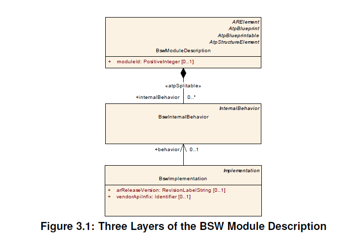

<section id="title">AUTOSAR BSWMDT（基础软件模块描述模板）</section>

# 1. 一般信息

## 1.1. 文档范围

本文介绍了基本软件模块描述模板 BSWMDT (**the template for the Basic Software Module Description**) 。

**BSWMD** 是属于某个 BSW 工件，如：BSW模块（**BSW module**） 或 BSW集群（**BSW cluster**），以及该工件的实现的所有信息的正式符号。这种描述有几种可能的用例，详情请参见 3.1。

**BSWMDT** 是用于 **BSWMD** 的模板，它是 **AUTOSAR** 中必须用于此部分描述的标准化格式。该模板在 **UML** 中表示为整个 **AUTOSAR** 元模型的一部分，并且是从该元模型生成的 **XML** 模式的一部分。本文档描述了属于该模板的所有元素。

这些元素在 **AUTOSAR** 元模型的两个不同包中维护：

* **BswModuleTemplate** 包中包含了 **BSWMDT** 专用的所有元素。
* **BSWMDT** 的一些元素，例如：用于描述实现方面和资源消耗的元素，也在软件组件模板 (**SWCT**) 中使用。这些元素属于元模型的 **CommonStructure** 包，也在本文中进行了描述。

为了清楚起见，请注意元模型的 **GenericStructure** 包中包含了一些基本的基础设施的元类和文档[1]中描述的通用模式。这些元素也在 **BswModuleTemplate** 中使用，但有关详细信息，请参阅[1]。

通用结构（**Generic Structure**）提供有关的详细信息：

* AUTOSAR顶层结构
* 常用的元类和原语
* 变体处理
* 文档

本文档适用于需要更深入了解元模型的 **BSWMDT** 部分的人员，例如：工具开发人员和维护元模型的人员。它不打算作为必须提供实际 **BSWMD** 的 **BSW** 开发人员的指南，即：必须填写（fill out）模板的人员。有关本文档总体目标的更多信息，请参阅相关要求文档，参见[2]。

由于元模型的复杂性，本文档中某些类图中的文本太小，无法在正常尺寸的打印纸上阅读。如果需要，建议使用电子文档并在计算机屏幕上放大这些图表。

## 1.2. 输入文件

以下输入文档已用于开发 BSWMDT：

* Generic Structure Template [1]
* Requirements on BSW Module Description Template [2]
* General Requirements on Basic Software Modules [3]
* AUTOSAR Methodology [4]
* AUTOSAR Glossary [5]
* Software Component Template [6]
* System Template [7]
* XML Schema Production Rules [8]

## 1.3. 约束的施加时间

在本文档的上下文中，只有一个强制时间适用：“在 **BSW** 模块配置完成时”。

## 1.4. Abbreviations

The following table contains a list of abbreviations used in the scope of this document along with the spelled-out meaning of each of the abbreviations.

**BSW** 
> Basic Software

**BSWMD** 
> Basic Software Module Description

**BSWMDT** 
> Basic Software Module Description Template

**DEM** 
> Diagnostic Event Manager

**ECU** 
> Electronic Control Unit

**ECUC** 
> ECU Configuration

**ICC1, ICC2, ICC3** 
> AUTOSAR Implementation Conformance Class 1...3

**ISR** 
> Interrupt Service Routine

**ICS** 
> Implementation Conformance Statement

**IOC** 
> Inter OS-Application Communication

**MC** 
> Measurement and Calibration

**MSR** 
> Manufacturer Supplier Relationship

**NvM** 
> Non Volatile Memory

**NVRAM** 
> Non Volatile RAM

**OS** 
> Operating System

**RAM** 
> Random Access Memory

**ROM** 
> Read-only Memory

**SWC** 
> Software Component

**SWS** 
> Software Specification

**SWCT** 
> Software Component Template

**UML** 
> Unified Modeling Language

**ARXML** 
> AUTOSAR XML

**XML** 
> Extensible Markup Language

# 2. 用例和建模方法

## 2.1. 用例

**BSWMDT** 有几种可能的用例。以下用例可应用于 **BSW** 模块（ICC3 一致性等级）或 **BSW** 集群（ICC2 一致性等级）和库。为了方便起见，我们经常在本文档中使用模块（**module**）一词作为所有三种工件的同义词。

库（**Library**）可以看作是一种特殊的模块，它提供在基础或应用软件中使用的服务，并通过直接函数调用访问，所以以下用例也可以应用于库。库和普通的 BSW 模块之间的主要区别在于，库服务可以直接从应用程序 **SWC** 调用，而无需通过 **RTE**。所以可用于库的模型元素将受到某些限制，例如：库不应该有预定的（scheduled）功能。 但是，这些限制目前尚未正式确定。

* **BSWMDT** 可用于在实际实现之前根据接口和依赖项，指定 **BSW** 模块或集群（即：一组**BSW** 模块）。在此用例中，内部行为和实现的详细信息未被填写。由于 **BSWMDT** 包含变体点（**variation points**），BSW 模块或集群的多个变体可以由单个规范描述）。根据方法论[4]，作为设计基础软件（**Design Basic Software**）活动的结果，此级别的工件作为 **BSW** 设计包（**BSW Design Bundle**）交付。
* **BSWMDT** 可用作一致性测试的输入，测试产品（模块、集群或库）与 **AUTOSAR** 标准的一致性。换句话说，这意味着对于一致性测试，**BSWMD** 应可用作 ICS（实施一致性声明）。根据方法论，此级别的工件作为 **BSW** 模块 **ICS** 捆绑包交付。请注意，此交付必须与以下交付（BSW 模块交付捆绑包）区分开来，因为一致性测试需要完全配置的软件。
* **BSWMDT** 可用于描述交付给 **AUTOSAR ECU** 集成商的实际实现的 **BSW** 模块或集群。它将包含内部行为、实现和约束 w.r.t. 的详细信息。规范，特别是，可能有不止一种实现（例如针对不同的处理器）具有相同的规范。根据方法论，此级别的工件是 **BSW** 模块交付包（**BSW Module Delivered Bundle**）的一部分，作为开发 BSW 模块（**Develop BSW Module**）活动的结果（相同的交付也包含代码，因为它不是在集成期间生成的）。
* **BSWMDT** 不仅用作上游（**upstream**）模板（如：作为在 ECU 配置时间之前提供的信息的格式），而且集成商可以使用 **BSWMD** 的某些部分来添加更多信息或调整当模块的交付时间时不可用的信息。在方法论中，此级别的工件是 BSW 模块集成包（**BSW Module Integration Bundle**）的一部分，它们是在 ECU 集成软件（**Integrate Software for ECU**）活动期间创建或完善的。此用例包括：例如添加有关实际资源消耗的文档，以及添加信息以响应集成在 ECU 上的软件组件和其他 BSW 模块的需求。
* 与最后一种情况类似，**BSWMDT** 允许添加从上游描述生成的数据，以支持测量和校准工具。
* 实现 **RTE** 和 **BSW** 调度程序（**BSW Scheduler**）的源代码，通常在 **ECU** 集成期间完全生成。因此记录此代码实现的 **BSWMD** 部分（例如：版本信息、内存部分、用于校准支持的数据结构）应由 **RTE** 生成器（**RTE generator**）生成或更新。

不同用例的工作流程细节不在本文档的范围内，但在这些不同步骤中提供的信息会影响 **BSWMDT** 的元模型。

**BSWMDT** 根据 **ICC1** 一致性等级描述软件的用途有限。因为在这种情况下，**ECU** 上的完整 **BSW**（包括 RTE）由一个单独的集群组成，所以 **BSW** 内的接口或依赖项无法通过这个模板来被描述，这也意味着模板的相关部分将是空的。然而即使在这种情况下，**BSWMDT** 也可用于记录实现方面（例如：所需的编译器、资源消耗或供应商特定配置参数）。

## 2.2. 三层方法

BSWMDT 的元模型由三个类似于 SWCT 的抽象层组成。这种方法允许能够更好地重用更抽象部分的描述。概览如下图 3.1 所示。

上层 **BswModuleDescription** 包含了所有提供和需要的接口（**provided and required interfaces**）的规范，包括对其他模块的依赖性。

中间层 **BswInternalBehavior** 包含模块内部一些基本活动的模型。该模型定义了模块对操作系统（**OS**）和 BSW 调度程序（**BSW Scheduler**）配置的要求。可能有多个基于相同的 **BswModuleDescription** 的不同的 **BswInternalBehavior** 实例，甚至在相同的 **CPU** 上。例如：多个驱动程序遵循相同的 **BswModuleDescription**。 术语行为（**behavior**）的选择类似于 **SWCT** 中的类似术语。注意这里只限于调度行为，不描述模块或集群的算法行为。

底层 **BswImplementation** 包含有关各个代码的信息。同样，同一个 **BswInternalBehavior** 可能有多个 **BswImplementation** 实例。

## 2.3. 可拆分聚合的使用（The usage of splitable aggregations）

这些层之间的引用不是普通聚合，允许 **XML** 工件中的更多灵活性。例如：如果 **BswInternalBehavior** 将聚合 **BswImplementation**，则必须为 **BswImplementation** 的每个实例复制 **BswInternalBehavior** 的具体 **XML** 工件。通过使用可拆分的聚合和引用，层可以保存在单独的文件中，并且可以在以后的项目阶段修改较低的层。这类似于在 C 源文件中包含头文件：多个实现文件可以共享同一个头文件，该头文件通常将更抽象的东西声明为函数原型等。从 **BswModuleDescription** 到 **BswInternalBehavior** 的关系是一个可拆分的聚合，而不是 **SWCT** 出于语义原因和类比的引用。

## 2.4. 同一个 BSW模块或 BSW 集群的几种实现

根据三层方法，元类 **BswModuleDescription** 和聚合的 **BswInternalBehavior** 描述了一种 **BSW** 模块或集群，可能存在不同的实现，由不同的 **BswImplementations** 表示。请注意元类 **BswModuleDescription** 的名称在这里具有误导性，因为此元类不包含模块或集群的完整描述。

如果 **BSW** 模块或集群的不同实现是为不同的 **CPU** 编译的，则相应的 **BSWMD** 可以被视为单独的工件，它们可以共享 **BswModuleDescription** 和 **BswInternalBehavior**。

如果实现是为同一个 **CPU** 编译的，即集成在同一个 **ECU** 并且在同一个地址空间上。例如：多个 **CAN** 通道的 **CAN** 驱动程序。它们的 **BSWMD** 仍然应该共享 **BswModuleDescription** 和 相等的 **BswInternalBehavior** ，但必须有一种机制来确保从 **BswModuleDescription** 和 **BswInternalBehavior** 派生的全局可见的 C 符号是唯一的。这是通过 **BSWMDT** 的实现部分中定义的中缀（**infixes**）来处理的。

## 2.5. 与 SwComponentType 的关系

一些 **BSW** 模块或集群，不仅具有与其他 **BSW** 模块或集群的接口，而且还具有通过 **RTE** 从应用程序 **SW-C** 访问的更多抽象接口。这些 **BSW** 模块或集群可以是 **AUTOSAR** 服务（**AUTOSAR Services**）、**ECU** 抽象（**ECU Abstraction**）的一部分，或者是复杂驱动程序（Complex Drivers）。

这里需要的更抽象的接口称为 **AUTOSAR** 接口（参见 [6] 和 [5]）。

这些 **AUTOSAR** 接口通过软件组件模板 (**SWCT**) 进行描述，它们由端口（**ports**）、端口接口（**port interfaces**）及其进一步详细信息组成。用于为 **BSW** 模块描述这些元素的 **SWCT** 的根类是 **ServiceSwComponentType**、**EcuAbstractionSwComponentType** 和 **ComplexDeviceDriverSwComponentType**（参见 [6]），它们都派生自 **AtomicSwComponentType**。

此外，从 **RTE** 到这些 **BSW** 模块的函数调用，需建模为同样包含在 **SWCT** 中的 **RunnableEntity-s**。 用于描述 **RunnableEntity-s**（以及其他一些东西）的 **SWCT** 的根类称为 **SwcInternalBehavior**。

## 2.6. 具有 AUTOSAR 接口的 BSW 模块

对于可以通过 **AUTOSAR** 接口访问的 **BSW** 模块或集群，除了 **BSWMD** 之外，还应该有一个定义 **AtomicSwComponentType** 和 **SwcInternalBehavior** 的 XML 工件。

生成 **RTE** 需要这些额外的描述。请注意，在 **AUTOSAR** 服务的情况下，这些附加描述的内容在不同的 **ECU** 之间可能会有所不同。例如：由于 **RTE** 必须为 **AUTOSAR** 服务创建的端口数量，所以必须为每个 **ECU** 创建。参加 [6] 中描述了创建这些工件的详细步骤。

为了跟踪这些额外的 **SWCT** 描述和关联的 **BSWMD** 之间的依赖关系，在 **SwcInternalBehavior** 类和 **BswInternalBehavior** 类之间存在映射，详情请参阅第 6.11 章。

由于使用了两种不同的模板来描述上述模块，即：那些具有用于连接到应用软件的端口的模板，所以如何描述调度（**scheduling**）存在一定的歧义：

1. 使用在 **BSWMDT** 中定义的事件模型 （请参阅本文档的BSW Beahvior）。
2. 使用在 **SWCT** 的 **SwcInternalBehavior** 中定义的事件模型。

两种不同的事件模型导致针对 **RTE** 的不同接口。BSW 调度程序（**BSW-Scheduler**）风格的 C 接口和 SWC 风格的 C 接口都在 RTE 合同阶段（**RTE contract phase**）生成。 对于到目前为止定义的标准化 **AUTOSAR** 服务，SWC 样式的接口仅用于与通过端口进行通信直接相关的函数调用。而例如BSW 调度程序（**BSW-Scheduler**）的接口需使用周期的事件。 请注意，对于未标准化的 **BSW** 部件，如：ECU 抽象和复杂驱动程序，则没有这样的规则。

另一种特殊情况，当 BSW 调度程序（**BSW Scheduler**）或中断例程（**interrupt routine**）触发周期函数时，接着必须通过调用 **RTE** 才能访问 **SWC**。为了使用当前 **SWCT** 的方式生成 **RTE API**，在这种情况下需要指定一个 **RunnableEntity**，即使它不是由RTE事件触发的。

