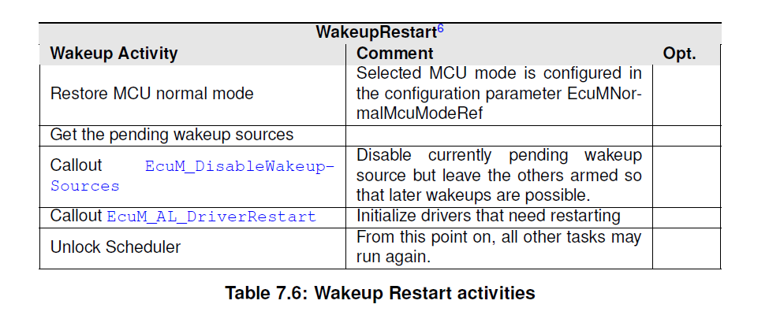
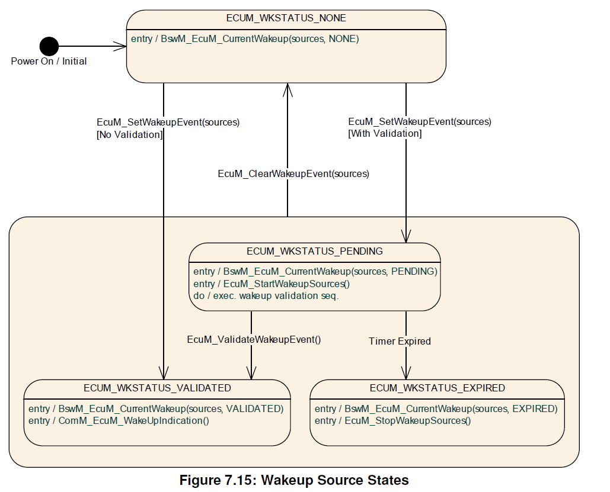
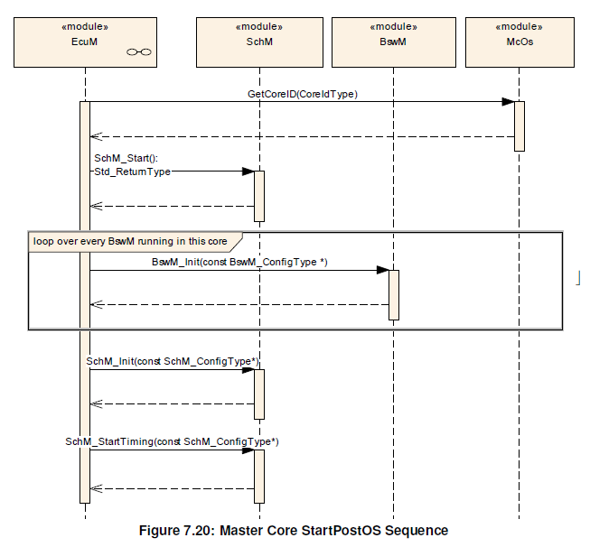
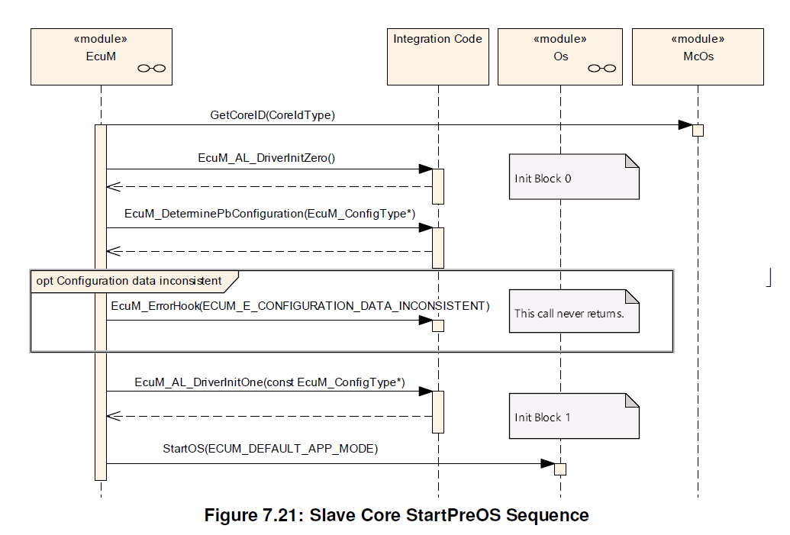

<section id="title">AUTOSAR ECU State Manager（ECU状态管理器）</section>

# 1. 简介和功能概述

ECU管理器模块（**ECU Manager**）是管理**ECU**状态的基础软件模块。具体来说，ECU管理器模块负责：

* 初始化和去初始化**OS**、**SchM**和**BswM**以及一些基础软件驱动模块。
* 将**ECU**配置为**SLEEP**和**SHUTDOWN**状态。
* 管理**ECU**上的所有唤醒事件（**wakeup events**）。

**ECU**管理器模块提供唤醒验证协议（**Wakeup validation protocol**），以区分真实（**real**）和不稳定（**erratic**）唤醒事件。

此外，**ECU**管理模块还负责：

* 提供部分或快速启动（**Partial or fast startup**）机制。也就是说**ECU**以有限的功能启动，接着由应用程序确定，并一步步继续完成启动过程。
* 提供交错启动（**Interleaved startup**）机制。ECU以最低限度地启动，然后启动**RTE**以实现**SW-C**能尽快地执行功能。接着ECU继续启动其他的**BSW**和**SW-C**，从而将**BSW**和应用程序功能能够交错运行。
* 分拆**RUN**状态到多个运行子状态（**operational states**）。**ECU**管理模块将一系列**SLEEP**状态的概念细化为多个**RUN**状态。从经典的**RUN**（完全运行）状态到最深的**SLEEP**（处理器停止）状态，转换为多个连续运行子状态。
* 支持多核**ECU**：启动、关机、睡眠和唤醒能在**ECU**的所有内核上进行协调。

灵活的**ECU**管理采用以下模块提供的通用模式管理工具：

* **RTE**和**BSW**调度器模块[2]现在合并为一个模块：该模块支持可自由配置的**BSW**和应用程序模式及其模式切换工具。
* **BSW**模式管理器模块[3]：该模块实施可配置的规则和操作列表，以评估切换**ECU**模式的条件并实施必要的操作。

因此，通过灵活的**ECU**管理，大多数**ECU**状态已经不在**ECU**管理器模块中实现。通常来说，当通用模式管理工具在以下情况下不可用时，**ECU**管理器模块会接管控制：

* 早期启动阶段（**Early STARTUP phases**）
* 后期关闭阶段（**Late SHUTDOWN phases**）
* 设施被调度程序锁定的睡眠阶段。

在**ECU**管理器模块的**UP**阶段，**BSW**模式管理器负责进一步的操作。然而，**ECU**管理器模块会对来自**SW-C**的**RUN**和**POST_RUN**请求进行仲裁，并通知**BswM**有关的模式状态。

如果进行了相应的配置，灵活的**ECU**管理模块可以向后兼容以前的ECU管理模块的版本。有关兼容性配置的更多信息，可参阅模式管理指南（**Guide to Mode Management**）[4]。

# 2. 定义和缩写

## 2.1. 定义

**Callout**
> **Callout**是指系统设计人员使用代码替换的一种Stub函数。通常在配置时，为**ECU**管理器模块提供一些附件功能。**Callout**分为两类。一类是作为硬件抽象层向**ECU**管理器模块提供强制性的功能或服务。另一个类是提供一些可选功能。

**Mode**
> 模式（**Mode**）是指在车辆中运行过程中各种状态机的某组特定的状态。它不只和**ECU**管理器模块相关。同时并与特定实体、应用程序或整个车辆相关。

**Passive Wakeup**
> 被动唤醒（**Passive Wakeup**）是指由连接的总线（**Attached bus**）引起的一种唤醒。它不属于由定时器或传感器活动等内部事件引起的唤醒。

**Phase**
> 阶段（**Phase**）是指和ECU管理器的动作及事件相关的逻辑或时间组合，例如：**STARTUP**、**UP**、**SHUTDOWN**、**SLEEP**等。阶段可以由通常称为序列的子阶段组成。

**Shutdown Target**
> **ECU**必须在进入睡眠状态、关闭电源或复位之前被关闭。 因此**SLEEP**、**OFF**和**RESET**是有效的关机目标（**Shutdown Target**）。通过选择关机目标，应用程序可以在下次关闭后，将其对**ECU**行为的愿望传达给**ECU**管理器模块。

**State**
> 状态（**State**）存在于它们各自的**BSW**组件内部，对应用程序是不可见。所以它们只被**BSW**的内部状态机使用。**ECU**管理器模块的状态，负责构建阶段（**Phase**）并处理相关模式（**Mode**）。

**Wakeup Event**
> 唤醒事件（**Wakeup Event**）是指导致唤醒的物理事件。例如：**CAN**消息或**IO**输入的跳变都可以是唤醒事件。

**Wakeup Reason**
> 唤醒原因（**Wakeup Reason**）是指作为上次唤醒的实际原因的唤醒事件。

**Wakeup Source**
> 处理唤醒事件的外围设备或**ECU**组件称为唤醒源（**Wakeup Source**）。

## 2.2. 缩写

**BswM**
> 基础软件模式管理器（Basic Software Mode Manager）

**Dem** 
> Diagnostic Event Manager

**Det** 
> Default Error Tracer

**EcuM** 
> ECU Manager

**Gpt** 
> General Purpose Timer

**Icu** 
> Input Capture Unit

**ISR** 
> Interrupt Service Routine

**Mcu** 
> Microcontroller Unit

**NVRAM** 
> Non-volatile random access memory

**Os** 
> Operating System

**Rte** 
> Runtime Environment

**VFB** 
> Virtual Function Bus

# 3. 相关文档

## 3.1. 输入文件

[1] List of Basic Software Modules
> AUTOSAR_TR_BSWModuleList

[2] Specification of RTE Software
> AUTOSAR_SWS_RTE

[3] Specification of Basic Software Mode Manager
> AUTOSAR_SWS_BSWModeManager

[4] Guide to Mode Management
> AUTOSAR_EXP_ModeManagementGuide

[5] Glossary
> AUTOSAR_TR_Glossary

[6] General Specification of Basic Software Modules
> AUTOSAR_SWS_BSWGeneral

[7] Virtual Functional Bus
> AUTOSAR_EXP_VFB

[8] General Requirements on Basic Software Modules
> AUTOSAR_SRS_BSWGeneral

[9] Requirements on Mode Management
> AUTOSAR_SRS_ModeManagement

[10] Specification of ECU State Manager
> AUTOSAR_SWS_ECUStateManager

[11] Specification of MCU Driver
> AUTOSAR_SWS_MCUDriver

[12] Specification of CAN Transceiver Driver
> AUTOSAR_SWS_CANTransceiverDriver

# 4. 约束和假设

## 4.1. 限制

**ECU**不能总是关闭，即：零功耗（**zero power consumption**）。
**理由**：关机目标**OFF**只能通过**ECU**特殊硬件来达到。例如：电源保持电路（**a power hold circuit**）。如果此硬件不存在，则AUTOSAR规范建议改为发出复位（**reset**）指令。 但是其他默认行为被允许的。

# 5. 对其他模块的依赖

以下部分概述了与其他模块的重要关系。它们还包含这些模块必须满足的一些要求才能与**ECU**管理器模块正确协作。如果将数据指针传递给**BSW**模块，则地址需要指向内存空间共享部分中的位置。

## 5.1. SPAL 模块

### 5.1.1. MCU 驱动

**MCU**驱动是**ECU**管理器模块初始化的第一个基础软件模块。 但是当**MCU_Init**返回时，**MCU**模块和**MCU**驱动程序模块不一定已经完全初始化，可能需要额外的**MCU**模块特定步骤来完成初始化。**ECU**管理器模块提供了两个**Callout**，可以放置相关附加代码。有关详细信息，可参阅**StartPreOS**序列中的活动。

### 5.1.2. 驱动程序依赖和初始化顺序

**BSW**驱动程序可能相互依赖。一个典型的例子是看门狗驱动，它需要**SPI**驱动来访问外部看门狗。这意味着一方面，驱动程序可能是堆叠的，与**ECU**管理器模块无关。另一方面，一些被调用模块必须在调用模块的初始化之前已被初始化。

系统设计者需负责在配置时，在**EcuMDriverInitListZero**、**EcuMDriverInitListOne**、**EcuMDriverRestartList**和**EcuMDriverInitListBswM**中定义初始化顺序。

## 5.2. 具有唤醒功能的外设

唤醒源必须由驱动程序处理和封装。

这些驱动程序必须遵循**AUTOSAR** **ECU**管理器模块中提出的协议和要求，以确保无缝集成到**AUTOSAR**的基础软件中。

基本上协议如下：

驱动程序必须调用**EcuM_SetWakeupEvent**来通知**ECU**管理器模块，已检测到挂起的唤醒事件。驱动程序不仅需要在**ECU**在睡眠阶段，等待唤醒事件时调用**EcuM_SetWakeupEvent**，同时在驱动程序初始化阶段以及**EcuM_MainFunction**运行的正常操作期间，也是同样需要调用**EcuM_SetWakeupEvent**。

驱动程序必须提供一个显式函数来使唤醒源进入睡眠状态。此功能应将唤醒源置于节能（**energy saving**），进入惰性操作模式，并重新启用唤醒通知机制。

如果唤醒源能够产生虚假事件，则以下模块必须为唤醒事件提供验证调用，或者调用**ECU**管理器模块的验证函数。 

* 驱动程序
* 使用驱动程序的软件堆栈
* 另一个合适的 BSW 模块

如果不需要验证，则此需求不适用于相应的唤醒源。

## 5.3. 操作系统

**ECU**管理器模块负责启动和关闭**AUTOSAR**操作系统。**ECU**管理器模块会定义了在操作系统启动之前如何处理控制以及在操作系统关闭之后如何处理控制的协议。

## 5.4. BSW 调度程序

**ECU**管理器模块负责初始化**BSW**调度程序。同时**ECU**管理器模块会提供**EcuM_MainFunction**，此接口函数会被定期调度，用于评估唤醒请求并且更新闹钟。

## 5.5. BSW 模式管理器

**ECU**状态通过**AUTOSAR**模式来实现，**BSW**模式管理器负责监控**ECU**中的变化，并酌情影响**ECU**状态机的相应变化。

* 有关**AUTOSAR**模式管理的讨论，请参阅虚拟功能总线规范（**Specification of the Virtual Function Bus**）[7]，
* 有关**ECU**状态机实现细节的指南，以及如何通过配置**BSW**模式管理器以实现**ECU**的状态机，请参阅模式管理指南（**Guide to Mode Management**）[4]，

**BSW**模式管理器只能在模式管理运行后才能管理**ECU**的状态机。也就是说，在**SchM**被初始化之后，直到**SchM**被去初始化或者停止。**ECU**管理器模块会在 
**BSW**模式管理器不工作后接管**ECU**的控制。

**ECU**管理器模块在**ECU**启动后立刻进行控制，并在初始化**SchM**和**BswM**后将控制权委托给**BSW**模式管理器。

**BswM**会将**ECU**的控制权交还给**ECU**管理器模块，以达到锁定操作系统并处理唤醒事件。

**BswM**也会在操作系统关闭停止前，将控制权立刻交还给**ECU**管理器。

在验证唤醒源时，**ECU**管理器模块通过模式切换请求向**BswM**指示唤醒源状态更改。

## 5.6. 软件组件

ECU 管理器模块需处理以下**ECU**范围的属性：

* 关机目标（**Shutdown targets**）。

在AUTOSAR规范中，假定**SW-C**通过**AUTOSAR**的端口来设置这些关机目标的属性，通常通过**SW-C**的某些**ECU**的特定部件。**ECU**管理器不会阻止**SW-C**覆盖**SW-C**所做的设置。这些策略必须在更高级别来定义。

以下措施可能有助于解决此问题：

* **SW-C**模板可能会包含某个字段来表示**SW-C**是否设置关机目标。
* 生成工具可能只允许有一个**SW-C**访问关机目标的配置。

# 6. 功能规格

新的AUTOSAR标准中已经引入了新的、更灵活的**ECU**状态管理方法。然而，这种灵活性（**flexibility**）是以责任（**responsibility**）为代价的。所以并没有标准的**ECU**模式或状态。**ECU**的集成商必须决定需要哪些状态并对其进行配置。

当使用**ECU**模式处理时，标准状态**RUN**和**POST_RUN**由**RUN**请求协议（**RUN Request Protocol**）经仲裁后，传播到**BswM**模块。系统设计人员在通过**BswM actions**设置**EcuM**模式时，必须确保各个状态的先决条件已被满足。请注意**BSW**和**SW-C**都不能依赖某些**ECU**模式或者状态，尽管以前版本的**BSW**在很大程度上不依赖它们。

本文档仅指定保留在**ECU**管理器模块中的功能。有关**ECU**状态管理的完整图片，可参阅其他相关模块的规范，如：**RTE**和**BSW**调度器模块[2]和**BSW**模式管理器模块[3]。有关**ECU**状态和相关**BSW**模块之间交互的一些示例用例，可参阅模式管理指南[4]。

ECU管理器模块采用与过去相同的方式来管理唤醒源（**wakeup sources**）的状态。 设置/清除/验证唤醒事件的**API**接口保持不变，但显着区别是这些API采用回调的方式。

唤醒源处理不仅发生在唤醒期间，而且持续地与所有其他**EcuM**活动并行进行。这个功能现在通过模式请求（**mode requests**）与ECU管理的其余部分完全解耦。

## 6.1. ECU管理模块的阶段

以前版本的ECU管理模块规范已经区分了ECU状态和ECU模式。

**ECU**模式是一种持续时间较长的操作**ECU**活动，这些活动对应用程序可见并为它们提供方向，例如：启动（**starting up**）、关闭（**shutting down**）、休眠（**going to sleep**）和唤醒（**waking up**）。

**ECU**管理器状态通常是**ECU**管理器模块操作的连续序列，通过等待直到外部条件满足而终止。例如：**Startup1**包含操作系统启动之前的所有**BSW**初始化，并在操作系统将控制权返回给**ECU**管理器模块时终止。

对于当前的灵活的ECU管理器（**Flexible ECU Manager**），状态、模式和阶段的定义可参考定义和首字母缩略词（**Definitions and Acronyms**）章节中。

在这里**ECU**状态机在**BSW**模式管理器模块的控制下作为通用模式实现。这就产生了一个术语问题。因为旧的ECU状态（**State**）现在变成了通过**RTE_Mode**端口接口可见的模式（**Mode**），而旧的ECU模式（**Mode**）变成了阶段（**Phase**）。由于通过**VFB**定义并在**RTE**中使用的模式（**Mode**）仅在**UP**阶段可用，即ECU管理器处于被动状态，所以有必要将术语从模式（**Mode**）更改为阶段（**Phas**e）。

图 7.1 显示了灵活的ECU管理器模块各阶段的概览。

**STARTUP**阶段一直需持续到模式管理设施（Mode Management Facilities）正常运行。基本上**STARTUP**阶段包括启动模式管理所需的最少活动：初始化低级驱动程序、启动操作系统和初始化**BSW**调度程序和**BSW**模式管理器模块。类似地**SHUTDOWN**阶段与**STARTUP**阶段相反，是模式管理被去初始化（**de-initialized**）的阶段。

**UP**阶段由所有未突出显示的状态组成。在该阶段**ECU**按照**integrator**定义的状态机要求，从一个状态转换到另一个状态，从一个模式转换到另一个模式。

在使用ECU模式处理（**ECU Mode Handling**）的情况下，**UP**阶段包含默认模式。这些模式之间的转换是通过**ECU**状态管理器模块和**BSW**模式管理器模块之间的合作完成的。

**注意:**
**UP**阶段包含一些以前的睡眠状态。从**OS**调度程序被锁定以防止其他任务在睡眠中运行的点，到使**ECU**进入睡眠状态的**MCU**模式已经退出的点。此时，模式管理设施不运行，ECU 管理器模块提供了唤醒处理的支持。

### 6.1.1. STARTUP阶段

**STARTUP**阶段的目的是将基础软件模块初始化到通用模式管理设施（**Generic Mode Management facilities**）可操作的点。 有关初始化的更多详细信息，可参见第**6.3**章。

### 6.1.2. UP阶段

本质上，**UP**阶段开始于**BSW**调度程序启动并调用了**BswM_Init**函数。此时内存管理（**memory management**）尚未初始化，没有通信堆栈（**communication stacks**），没有 **SW-C** 支持（**RTE**）并且**SW-C**尚未启动。处理以特定的模式启动（在**STARTUP**之后配置的下一个模式），并具有相应的可运行项，如：BSW主程序（**BSW MainFunctions**），并继续作为模式更改的任意组合，导致**BswM**执行操作，同时触发和禁用相应的可运行项。

然而从**ECU**管理器模块的角度来看，ECU是已启动的。接着**BSW**模式管理器模块启动模式仲裁和所有进一步的**BSW**的初始化，启动**RTE**和隐式的启动**SW-C**成为在BswM的操作列表中被执行的代码，或由依赖模式的调度驱动，有效地在**integrator**的控制下。

接着初始化**NvM**模块并调用**NvM_Readall**，使其也成为集成代码的一部分。这也意味着**integrator**需负责在**NvM_ReadAll**结束时，触发**Com**、**DEM**和**FIM**的初始化。当**NvM_ReadAll**完成时，**NvM**将通知**BswM**。

**注意：**
**RTE**可以在**NvM**和**COM**被初始化之后启动。同时通信堆栈无需在**COM**模块被初始化之前被完全初始化（**fully initialized**）。

这些更改将初始化**BSW**模块，并以任意顺序启动**SW-C**，直到**ECU**达到满负荷，并且这些更改也将继续决定**ECU**的功能。最终模式开关停止**SW-C**，并对BSW进行去初始化，以便在**ECU**达到可以关闭电源的状态时，**UP**阶段结束。

因此就**ECU**管理器模块而言，**BSW**和**SW-C**会一直运行，直到它们准备好，让**ECU**关闭或进入睡眠状态。

有关如何设计模式驱动的**ECU**管理以及相应地配置**BSW**模式管理器的指导，可参阅模式管理指南[4]。

### 6.1.3. SHUTDOWN阶段

**SHUTDOWN**阶段处理基础软件模块的受控关闭，最终导致选定的关机目标：关闭（**OFF**）或者复位（**RESET**)。

### 6.1.4. SLEEP阶段

**ECU**在**SLEEP**阶段保持节能（**saves energy**）状态。通常不执行任何代码，但依旧会提供供电。如果进行了相应配置，则**ECU**在此状态下是可被唤醒的。**ECU**管理器模块提供了一组可配置的（硬件）睡眠模式，这些模式通常是在功耗和重启**ECU**所需时间之间进行权衡。

**ECU**管理器模块唤醒**ECU**，以响应预期或非预期的唤醒事件。由于非预期的唤醒事件需要被忽略，**ECU**管理器模块提供了一个协议来验证唤醒事件。该协议指定了处理唤醒源的驱动程序和**ECU**管理器之间的协作过程（可参见第**6.6.4**节）。

### 6.1.5. OFF阶段

下电时，**ECU**的状态为**OFF**状态。在此状态下**ECU**可能是可以被唤醒的，但仅适用于具有集成电源控制的唤醒源。在任何情况下，**ECU**都必须是可启动的。例如：通过复位事件（**reset event**）。

## 6.2. ECU管理器的结构描述

图7.2说明了ECU 管理器模块与其他基础软件模块接口的关系。在大多数情况下，**ECU**管理器模块只负责初始化。 然而有些模块与ECU管理器模块具有功能关联，这将在以下段落中进行详细解释。

### 6.2.1. 标准化AUTOSAR软件模块

一些基础软件的驱动程序模块会在被**ECU**管理器模块唤醒时被初始化（**initialized**）、关闭（**shut down**）和重新初始化（**re-initialized**）。

操作系统也需经过**ECU**管理器模块进行初始化和关闭。在操作系统初始化之后，**ECU**管理器模块在将控制权交给**BswM**之前，一些额外的初始化步骤需被执行。在操作系统关闭之前，**BswM**将执行控制权交还给**ECU**管理器模块。详细信息可参考章节6.3启动（**STARTUP**）和 6.4 关闭（**SHUTDOWN**）。

### 6.2.2. 软件组件

软件组件（**SW-Components**）包含了**AUTOSAR ECU**的应用程序代码。**SW-C**通过使用**AUTOSAR**的端口与**ECU**管理器模块进行交互。

## 6.3. STARTUP阶段

有关**STARTUP**阶段的概述说明，可参见章节**6.1.1**。

图**7.3**显示了**ECU**的启动行为。当**EcuM_Init**被调用后，**ECU**管理器模块开始控制**ECU**启动过程。通过调用**StartOS**，**ECU**管理器模块暂时放弃控制。为了重新获得控制权，**Integrator**需要实现一个自启动的操作系统任务（**OS task**），并调用**EcuM_StartupTwo**作为此任务（**Task**）的第一个操作。

### 6.3.1. EcuM_Init之前的活动

**ECU**管理器模块在调用**EcuM_Init**之前，假定**MCU**的最小化的初始化过程已经完成。也就是说堆栈已被设置，并且代码已经可以被执行，同时C语言中所有变量的初始化也已经被执行。

### 6.3.2. StartPreOS 序列中的活动

下列**StartPreOS Sequence**的表格，显示了在**StartPreOS**序列中的所有活动，以及它们在**EcuM_Init**中应被执行的顺序。

**注意：**

可选列（Opt.），所有可选的活动都可以通过配置来被激活或关闭。

**ECU**管理器模块需记住复位原因转换产生的唤醒源，可参见**StartPreOS Sequence**表格。同时唤醒源必须由**EcuM_MainFunction**进行验证，可参见章节**6.6.4**的 **WakeupValidation**序列中的活动。

当功能通过**EcuM_Init**被激活时，**ECU**管理器模块会执行**StartPreOS**序列中的操作，详情可参见**StartPreOS Sequence**表格）。

**StartPreOS**序列旨在让**ECU**为初始化**OS**做好准备，所以执行时间应尽可能短。驱动程序应尽可能在**UP**阶段初始化，并且Callout函数也应保持简短。在此序列期间，中断不应被使用。如果必须使用中断，则**StartPreOS**序列中只允许使用I类（**category I**）的中断。

驱动程序和硬件抽象模块的初始化不是由**ECU**管理器来严格定义的。但**ECU**管理器提供了两个Callout函数**EcuM_AL_DriverInitZero**和**EcuM_AL_DriverInitOne**来定义初始化块 **0**和**1**。这些初始化块包含了与**StartPreOS**序列相关的初始化活动。

**MCU_Init**并不提供完整的**MCU**的初始化。此外与硬件相关的步骤必须被执行，并且必须在系统设计时被定义。这些步骤应该在**EcuM_AL_DriverInitZero**或者**EcuM_AL_DriverInitOne**两个Callout函数中进行。详细信息可在MCU驱动程序规范[11]中找到。

**ECU**管理器模块需使用配置的默认关机目标（通过**EcuMDefaultShutdownTarget**配置）来调用**EcuM_GetValidatedWakeupEvents**接口。具体内容可参阅章节**6.7**关机目标（**Shutdown Targets**）的内容。

**StartPreOS**序列需为启动操作系统，初始化所需的所有基础软件模块。

### 6.3.3. StartPostOS序列中的活动

当功能通过**EcuM_StartupTwo**被激活时，**ECU**管理器模块需执行**StartPostOS**序列中的操作，具体内容可参见表7.2。

**注意：**

可选列（Opt.），所有可选的活动都可以通过配置来被激活或关闭。

### 6.3.4. 驱动程序初始化

驱动程序在初始化过程中的位置很大程度上取决于其实现和目标硬件设计。

驱动程序可以在**STARTUP**阶段的初始化块0（**Init Block 0**）或初始化块1（**Init Block 1**）Callout函数中，被**ECU**管理器模块初始化，或者在**WakeupRestart Sequence**的 **EcuM_AL_DriverRestart**的Callout函数中重新被初始化。驱动程序也可以在**UP**阶段，由**BswM**初始化或重新初始化。

本章节适用于那些**AUTOSAR**基础软件的驱动程序，不包括**SchM**和**BswM**，他们的初始化和重新初始化都是由**ECU**管理器模块处理，而不是**BswM**模块处理的。

**ECU**管理器模块的配置需指定**init block 0**和**init block 1**内的初始化调用顺序。具体参见**EcuMDriverInitListZero**和**EcuMDriverInitListOne**。

**ECU**管理器模块需使用从驱动程序的**EcuMModuleService**配置容器中派生的参数，来调用每个驱动程序的初始化（**init**）函数。

对于**WakeupRestart**期间的重新初始化，integrator需使用**EcuMDriverRestartList**，将重新启动块（**restart block**）集成到**EcuM_AL_DriverRestart**的集成代码中。

**EcuMDriverRestartList**接口可能包含用作唤醒源的驱动程序。**EcuM_AL_DriverRestart**需重新启动这些驱动程序唤醒检测（**wakeup detected**）回调函数的触发机制。可参阅章节[6.5.5](#655-wakeuprestart序列中的活动)的**WakeupRestart**序列中的活动。

**ECU**管理器模块需按照与**init block 0**和**init block 1**的组合列表相同的顺序初始化**EcuMDriverRestartList**中的驱动程序。通常**EcuMDriverRestartList**只会包含**init block 0**和**init block 1**驱动程序组合列表的子集。

表7.3显示了**init block 0**和**init block 1**的一种可能和推荐的活动序列。根据硬件和软件配置，可以添加或移除相关的基础软件模块，当然也可以使用其他活动序列。

### 6.3.5. BSW 初始化

其余的**BSW**模块由**BSW**模式管理器初始化，通过使用配置的（**EcuMDriverInitListBswM**）初始化函数列表，创建的**ECU**管理器的配置函数（**EcuMDriverInitCalloutName**）。

**ECU**管理器模块的配置应指定**BSW**初始化函数中的初始化调用顺序（可参见：**EcuMDriverInitListBswM**）。

## 6.4. SHUTDOWN阶段

有关**SHUTDOWN**阶段的概念，请参阅章节[6.1.3 **SHUTDOWN** 阶段](#613-shutdown阶段)。通过使用关机目标**RESET**或**OFF**调用**EcuM_GoDownHaltPoll**来启动**SHUTDOWN**阶段。

如果在关机阶段发生唤醒事件时，ECU管理器模块应完成关机并在此后立即重新启动。

### 6.4.1. OffPreOS序列中的活动

在**OffPreOS**序列期间，如果配置参数**EcuMIgnoreWakeupEvValOffPreOS**设置为**true**，只需考虑那些不需要验证的唤醒事件，所有其他的唤醒事件可以忽略。如果配置参数**EcuMIgnoreWakeupEvValOffPreOS**设置为**false**时，不需要验证的唤醒事件和需要验证的挂起唤醒事件都需被考虑到。

**注意：**

因为在**OffPreOS**序列期间，**SchM**已经去初始化，周期性执行的函数以及不被执行，所以不再可能验证唤醒源。在**OffPreOS**期间中，唤醒事件是否需要被考虑，取决于**EcuMIgnoreWakeupEvValOffPreOS**的配置。

作为**OffPreOS**期间的最后一项活动，**ECU**管理器模块需调用**ShutdownOS**函数。操作系统会在关机结束时，调用关机钩子（hook）函数。关闭钩子函数会调用**EcuM_Shutdown**来结束关机过程。 **EcuM_Shutdown**不应返回，而是直接关闭ECU或发起复位动作。

### 6.4.2. OffPostOS序列中的活动

**OffPostOS**序列执行了在操作系统关闭后，达到关机目标的最后步骤。由**EcuM_Shutdown**函数发起此序列。关机目标可以是**ECUM_SHUTDOWN_TARGET_RESET**或**ECUM_SHUTDOWN_TARGET_OFF**，具体的复位方式由复位模式决定。有关详细信息，可参阅章节[6.7关机目标](#67-关机目标)

当关机目标为**RESET**时，**ECU**管理器模块需调用**EcuM_AL_Reset**的Callout函数。当关机目标为**OFF**时，**ECU**管理器模块需调用**EcuM_AL_SwitchOff**的**Callout**函数。

## 6.5. SLEEP阶段

有关**SLEEP**阶段的概述，可参阅章节[6.1.4 SLEEP阶段](#614-sleep阶段)。可以通过**SLEEP**作为关机目标，调用**EcuM_GoDownHaltPoll**函数来启动**SLEEP**阶段。

使用**SLEEP**作为关机目标的**EcuM_GoDownHaltPoll**函数会启动两种控制流。具体哪种控制流取决于**EcuMSleepModeSuspend**参数所配置的睡眠模式。它们在实现睡眠的机制上的结构是不同。但是它们在准备睡眠和从睡眠恢复过程的顺序却是相同的。

同时存在另一个模块，可能是**BswM**，虽然它也可能是另一个**SW-C**。这个模块必须确保在调用**EcuM_GoDownHaltPoll**之前，以及选择了适当的**ECUM_STATE_SLEEP**的关机目标。

### 6.5.1. GoSleep序列中的活动

在**GoSleep**的序列中，**ECU**管理器模块需为即将到来的睡眠阶段进行相关的硬件配置，同时为下一个唤醒事件设置**ECU**。

**ECU**管理器模块为了接着的睡眠模式，需进行唤醒源的配置。**ECU**管理器模块会通过在**EcuM_EnableWakeupSources**的Callout函数中，依次为每个在**EcuMWakeupSourceMask**中配置的唤醒源执行相关的设置工作。

与**SHUTDOWN**阶段相比，**ECU**管理器模块在进入**SLEEP**阶段时，不应关闭操作系统。睡眠模式，即**EcuM**的**SLEEP**阶段和**MCU**模式的组合，对操作系统来说应该是透明的。

当在多核的**ECU**上运行时，**EcuM**需要为每个内核保留一个专用资源（**RES_AUTOSAR_ECUM**）。该资源会在进入休眠（**Go Sleep**）期间分配。

### 6.5.2. 停止序列中的活动

**ECU**管理器模块需在停止微控制器的睡眠模式下执行停止序列（**Halt Sequence**）。在这睡眠模式下，**ECU**管理器模块不执行任何代码。

**ECU**管理器模块应在停止微控制器之前，调用**EcuM_GenerateRamHash**的Callout函数。然后当处理器从停止状态返回后，调用**EcuM_CheckRamHash**的Callout函数。

如果存在多核的情况，且存在从属（**Slave**）的**EcuM**，则此检查动作仅只需在主（**Master**）的**EcuM**上执行。 主**EcuM**从其范围内的所有数据中生成散列。从属**EcuM**的私有数据不在此范围内。

**逻辑依据：**

当**ECU**长时间处于睡眠模式时，**RAM**内存可能会损坏。 因此需检查**RAM**存储器的完整性，以防意外行为的发生。系统设计者可以选择适当的校验和算法来执行检查。

**ECU**管理器模块应调用**EcuM_GenerateRamHash**，系统设计人员可以在此Callout函数中进行**RAM**完整性地检查。

### 6.5.3. 轮询序列中的活动

睡眠模式下的轮询序列（**Poll Sequence**）可用于检查唤醒源。在轮询序列中，**EcuMWakeupSourcePolling**设置为**True**，**EcuM**需在一个阻塞循环中（**blocking loop**），调用**EcuM_SleepActivity**和**EcuM_CheckWakeupHook**函数，直到有待定（**pending**）或者已验证（**validated**）的唤醒事件被报告。

### 6.5.4. 离开停止或轮询

如果当**ECU**处于停止（**Halt**）或轮询（**Poll**）状态时，发生唤醒了事件。

* 唤醒硬线发生翻转变化（**toggling a wakeup line**）
* CAN总线上有通讯信号（**communication on a CAN bus**）等
  
则**ECU**管理器模块需重新获得控制权，并通过执行唤醒重启序列（**WakeupRestart sequence**）退出睡眠阶段。

可以调用**ISR**来处理唤醒事件，但这取决于硬件和驱动程序的实现。具体可参考章节[6.5.5WakeupRestart序列中的活动](#655-wakeuprestart序列中的活动)

如果**ECU**处于**Halt**或者**Poll**时，发生了不规则事件（**Irregular Events**）

* 硬件复位（**hardware reset**）
* 电源循环（**power cycle**）
  
则**ECU**管理器模块需在**STARTUP**阶段，重新启动**ECU**。

### 6.5.5. WakeupRestart序列中的活动

**ECU**管理器模块需调用用于重新初始化驱动程序的**EcuM_AL_DriverRestart**的Callout函数。其中具有唤醒源的驱动程序通常需要重新初始化。有关驱动程序初始化的更多详细信息，可参考章节[6.3.4驱动程序初始化](#634-驱动程序初始化)。

在重新初始化（**re-initialization**）期间，驱动程序必须检查其一个分配的唤醒源是否是先前被唤醒的原因。如果该测试为真，驱动程序必须调用唤醒被检测到（**wakeup detected**）的回调函数。例如：参见**CAN** 收发器驱动程序规范[12]。而后者必须再调用**EcuM_SetWakeupEvent**函数。

驱动程序的实现应该只调用一次唤醒回调。此后它不应再次调用唤醒回调，直到它被显式函数调用重置（**re-armed**）。所以驱动程序必须重置后了，才能再次触发回调。

如果在**WakeupRestart**序列完成时，**ECU**管理器模块具有候选唤醒源的列表，则**ECU**管理器模块应在**EcuM_MainFunction**中验证这些候选唤醒源。可参阅章节[6.6.4 WakeupValidation序列中的活动](#664-wakeupvalidation序列中的活动)

如果报告了**WakeupEvent**，**EcuM**需退出睡眠模式。如果所有**WakeupSource**的**CheckWakeupTimer**都已超时，则**EcuM**需转换到**GoSleep**状态，并再次开始让**EcuM**进入睡眠状态（暂停或轮询）。

**注意：**

当**EcuM**由异步**WakeupSource**恢复（**resume**）时，**EcuM**必须执行**WakeRestart**序列，以重新启动主功能，以便建立与使用的硬件（例如：**SPI**）的异步通信。

如果在信号唤醒后，并且相应的**CheckWakeupTimer**也已经超时，没有任何唤醒事件被设置，则**EcuM**需报告运行时错误**ECUM_E_WAKEUP_TIMEOUT**。

## 6.6. UP阶段

在**UP**阶段，**EcuM_MainFunction**会被定期执行。它主要具有三个功能：

* 检查唤醒源是否被唤醒，并在必要时启动唤醒验证。可参阅章节[6.6.4 WakeupValidation序列中的活动](#664-wakeupvalidation序列中的活动)
* 更新闹钟定时器（**Alarm Clock timer**）
* 仲裁**RUN**和**POST_RUN**的请求和释放。

### 6.6.1. 闹钟处理

请参阅章节[6.8.2 节 UP阶段的EcuM 时钟时间](#682-ecum时钟时间)，了解更多实现的细节。

当闹钟服务存在时（可参见参数**EcuMAlarmClockPresent**），**EcuM_MainFunction**需更新闹钟定时器。

### 6.6.2. 唤醒源状态处理

唤醒源不仅需在唤醒期间处理，而且与所有其他**EcuM**活动并行处理。相关功能在**EcuM_MainFunction**中运行，通过模式请求（**mode requests**）与**ECU**管理的其余部分完全分离。

唤醒源可以处于以下状态：

| 状态      | 描述                         |
| --------- | ---------------------------- |
| NONE      | 唤醒事件未被检测到或已被清除 |
| PENDING   | 检测到唤醒事件但尚未验证     |
| VALIDATED | 检测到唤醒事件并成功验证     |
| EXPIRED   | 检测到唤醒事件但验证失败     |

下图说明了唤醒源状态和引起状态变化的条件函数之间的关系。此处仅显示两个超级状态**Disabled**和**Validation**以进行说明和更好地理解。

当**ECU**管理器动作导致唤醒源的状态改变时，**ECU**管理器模块应向**BswM**发出模式请求（**mode request**），以将唤醒源的模式更改为新的唤醒源状态。对于这些唤醒源状态的通信，主要使用 **EcuM_WakeupStatusType**类型。

当**ECU**管理器模块处于**UP**阶段时，唤醒事件通常不会触发状态更改，但是它们会触发停止（**Halt**）和轮询（**Poll**）子阶段的结束。接着**ECU**管理器模块自动执行**WakeupRestart** 序列后，并随后返回到**UP**阶段。此行为需由集成商（**integrator**）在**BswM**中配置规则，以便**ECU**对唤醒事件做出正确反应。因为此反应完全取决于当前**ECU**的状态。

如果唤醒源有效，则**BswM**将**ECU**返回到运行（**RUN**）状态。如果所有唤醒事件都返回到**NONE**或**EXPIRED**，则**BswM**再次为基础软件模块准备**SLEEP**或**OFF**并调用**EcuM_GoDownHaltPoll**。

**总结：**

每个未决事件（**pending event**）都被独立验证（如果已配置），**EcuM**将结果作为模式请求发布到**BswM**，这反过来可以触发**EcuM**中的状态更改。

### 6.6.3. 唤醒状态的内部表示

### 6.6.4. WakeupValidation序列中的活动

#### 6.6.4.1. Wakeup of Communication Channels

#### 6.6.4.2. Interaction of Wakeup Sources and the ECU Manager

#### 6.6.4.3. Wakeup Validation Timeout

#### 6.6.4.4. Requirements for Drivers with Wakeup Sources

### 6.6.5. Requirements for Wakeup Validation

### 6.6.6. Wakeup Sources and Reset Reason

### 6.6.7. Wakeup Sources with Integrated Power Control

## 6.7. 关机目标

### 6.7.1. Sleep

### 6.7.2. Reset

## 6.8. Alarm Clock

### 6.8.1. Alarm Clocks and Users

### 6.8.2. EcuM时钟时间

#### 6.8.2.1. EcuM Clock Time in the UP Phase

#### 6.8.2.2. EcuM Clock Time in the Sleep Phase

## 6.9. MultiCore

### 6.9.1. Master Core

### 6.9.2. Slave Core

### 6.9.3. Master Core - Slave Core Signalling

#### 6.9.3.1. BSW Level

#### 6.9.3.2. Example for Shutdown Synchronization

### 6.9.4. UP Phase

### 6.9.5. STARTUP Phase

#### 6.9.5.1. Master Core STARTUP

#### 6.9.5.2. Slave Core STARTUP

### 6.9.6. SHUTDOWN Phase

#### 6.9.6.1. Master Core SHUTDOWN

#### 6.9.6.2. Slave Core SHUTDOWN

### 6.9.7. SLEEP Phase

#### 6.9.7.1. Master Core SLEEP

#### 6.9.7.2. Slave Core SLEEP

### 6.9.8. Runnables and Entry points

#### 6.9.8.1. Internal behavior

## 6.10. EcuM Mode Handling

## 6.11. Advanced Topics

### 6.11.1. Relation to Bootloader

### 6.11.2. Relation to Complex Drivers

### 6.11.3. Handling Errors during Startup and Shutdown

## 6.12. ErrorHook
