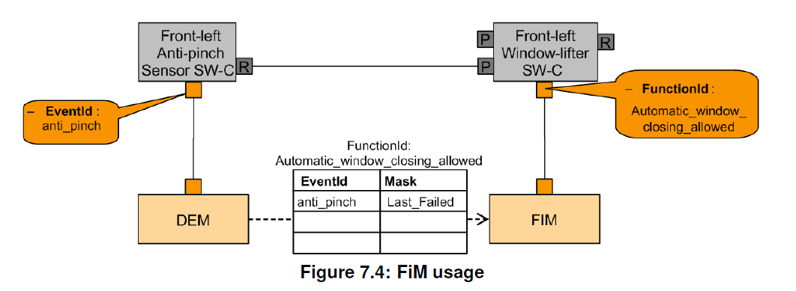

<section id="title">AUTOSAR FiM（功能禁止管理器）</section>

# 1. 简介和功能概述

功能禁止管理器（**Function Inhibition Manager**）负责为软件组件及其功能提供控制机制。在这种情况下，功能组（**Functionality**）可以是由具有相同允许/禁止条件集的一个、几个或部分可运行实体（**runnable entities**）的内容构成。 通过**FiM**可以通过配置禁止这些功能组，甚至在运行时修改这些功能组使能或禁止。

功能组（**Functionality**）和可运行实体（**Runnable Entities**）是不同且独立的分类类型。可运行实体的主要特点是它们的调度要求。与此相反，功能组按其抑制条件分类（**Inhibit Conditions**）。**FiM**的服务专注于**SW-C**中的功能组，但是它们不仅限于这些功能组。**BSW**的功能组也可以使用**FiM**服务。

功能组可以被分配给一个标识符FID（**Function Identifier**），以及包含此特定标识符的禁止条件。功能组在执行前会通过各自**FID**来轮询许可状态。如果此特定标识符的禁止条件为真，则相应的功能组将不再被执行。

由于诊断事件及其它相关的状态信息可以用来支持这些禁止条件，所以**FiM**与**Dem**模块之间密切相关。在发生故障时，相关功能组会被停止运行。例如：特定标识符来标识的某种传感器，当它检测到故障，并将此故障事件（**Event**）报告给**Dem**，则**FiM**会禁止此**FID**，从而禁止相关的功能。

为了处理功能组之间的关系以及相关的事件，在配置过程中功能组的标识符和禁止条件被引入到**SW-C**模板中（BSW也类似）。通过这种方式，相关的数据结构会被建立起来，用来处理针对某些事件标识符的数据敏感性。 

为了一些事件可以轻松配置，软件模块可以作为一个事件的集合被集成到一个新的环境中。 此外，当出现诸如“如果检测到特定事件时禁止哪些功能组？”之类的问题出现时，系统分析也能得到相关支持。**FiM**的数据基础，可用作事件和要禁止的**SW-C**之间配置关系的文档。

在**AUTOSAR**中，**RTE**根据已定义的接口和调度要求来处理**SW-C**。与此相反，**FiM**注意处理禁止条件，并提供相关支持机制实现通过相应的标识符（**FID**）来实现功能的控制。 因此**FiM** 模块的概念和**RTE**模块的概念其实是互不干扰的。

**FiM**规范的基本目标包括：

* API标准化
* 介绍可能的实施方法
* 提供**OEM**和供应商通用方法的能力

# 2. 缩略语

**活动状态（Activity state）**
> 活动状态是正在执行的软件组件的状态。活动状态也来自作为前提条件的许可状态d和物理启用条件。它不是由**FiM**模块计算的，也不能作为状态变量使用。它只能从软件组件内的本地信息中获得。

**Dem**
> Diagnostic Event Manager

**FID**
> 功能标识符（**Function Identifier**）

**FiM**
> 功能禁止管理器（**Function Inhibition Manager**）

**Functionality**
> 功能组（**Functionality**）包括系统用户可见和用户不可见的功能（**Function**）方面[2]。除此之外，在**FiM**上下文中， 功能组可以由具有相同允许/禁止条件集的一个、几个或部分可运行实体的内容构建。 通过**FiM**，这些功能组的抑制可以通过标定（**calibration**）进行配置甚至修改。每个功能组都由一个唯一的**FunctionId**表示。 与具有特定调度条件的可运行实体相比，功能组的特征在于一组特定的禁止条件。

**Inhibition Condition**
> 禁止条件（Inhibition Condition）是指由一个**FID**、一个禁止掩码（**Inhibition Mask**）和一个Dem事件（**Dem event**）/ 组件（**Component**）的状态之间的关系。（参见**FiMInhibitionConfiguration**）

**MIL**
> 故障指示灯（**Malfunction Indication Light**）

**Monitoring function**
> 软件组件的一部分。一种监测并最终检测某个传感器或者执行器故障的机制，也可以是一种合理性检查。它报告SW-C的内部处理的事件状态，或者其他基础软件模块（BSW）的返回值的进一步处理的事件状态。（参见 AUTOSAR_SWS_DiagnosticEventManager[3]）

**NVRAM**
> 非易失性存储器（**Non volatile Memory**）

**OBD**
> 车载诊断（**On-board Diagnostics**）

**OBDII**
> 排放相关车载诊断（**Emission-related On-board Diagnostics**）

**OEM**
> 原始设备制造商（**Original Equipment Manufacturer**）

**Permission state**
> 许可状态（**Permission State**）包含了由**FID**表示的功能组是否可以执行或是否不应该运行的信息。状态根据报告的事件由**FiM**控制。

**Runnable entity**
> 可运行实体（**Runnable entity**）是原子软件组件（**Atomic Software-Component**）的一部分，它独立于该原子软件组件的其他可运行实体的执行和调度。 它被描述为由**RTE**启动的一系列指令序列。每个可运行实体与一个**EntryPoint**相关联。

**UDS**
> 统一诊断服务（**Unified Diagnostic Services**）

**WP**
> Autosar 工作包（**Work Package**）

# 3. 相关文档

## 3.1. 输入文件

[1] General Specification of Basic Software Modules
> AUTOSAR_SWS_BSWGeneral

[2] Glossary
> AUTOSAR_TR_Glossary

[3] Specification of Diagnostic Event Manager
> AUTOSAR_SWS_DiagnosticEventManager

[4] Requirements on Function Inhibition Manager
> AUTOSAR_SRS_FunctionInhibitionManager

[5] Virtual Functional Bus
> AUTOSAR_EXP_VFB

[6] Software Component Template
> AUTOSAR_TPS_SoftwareComponentTemplate

## 3.2. 相关标准和规范

[13] IEC 7498-1 The Basic Model, IEC Norm, 1994

[14] D1.5-General Architecture; ITEA/EAST-EEA, Version 1.0; chapter 3, page 72 et
seq.

[15] D2.1-Embedded Basic Software Structure Requirements; ITEA/EAST-EEA, Version
1.0 or higher

[16] D2.2-Description of existing solutions; ITEA/EAST-EEA, Version 1.0 or higher.

## 3.3. 相关规范

AUTOSAR提供了基础软件模块的通用规范 [1]，也适用于功能禁止管理器。因此，规范[1]应被视为功能禁止管理器的附加和必需规范。

# 4. 约束和假设

**FiM**模块的每个**FID**编号必需是唯一的。由于软件组件和基础软件之间的通信仅限于一个**ECU**，因此**FiM**模块只能控制位于同一个**ECU**上的**FID**。同时请注意，**RTE**目前不支持位于不同**ECU**上的基础软件和软件组件之间的通信。

## 4.1. 限制

时序的约束必须考虑整个系统。值得注意的是过程和响应时间很大程度上需取决于**FiM**模块的实现。因此，如果明确需要**FiM**模块比周期任务（任务的时间片）有更快的响应，这些需求需要由FiM实现特别是受影响的应用程序来考虑。在AUTOSAR规范中，并未明确规定**FiM**必须实现的特殊措施。实现的未定义的原因如前所述。

**FiM**需独立于计算某个**FID**的允许权限，它不依赖于其他的**FID**状态。

**FiM**不支持**FID**之间的相互依赖性。这意味着一个**FID**不会影响另一个**FID**。

## 4.2. 汽车领域的适用性

FiM旨在满足当ECU检测到故障时对系统响应的集中处理的设计要求。例如：开路或者短路。 因此，**FiM**的直接适用领域目前是车身、底盘和动力总成的ECU。 当然，也不能理解为 **FiM**无法适用于其他汽车领域的ECU，例如：信息娱乐系统。

一个主要限制是仅**FiM**将无法处理以下的软件组件功能：

1. 时间攸关的：对于本地重新配置可能太慢（例如：无效信号的情况下快速备份反应）。
2. 物理交互的：可能不够灵活。
3. 安全攸关的：可能没有足够的软件完整性。

# 5. 对其他模块的依赖

功能禁止管理器（**FiM**）和诊断事件管理器（**Dem**）、具有**FID**接口的软件组件 （**SW-C**）、ECU状态管理器（**EcuM**）、**RTE**和支持被FiM抑制功能的BSW模块。

## 5.1. Dem

诊断事件管理器（**Dem**）负责处理检测到的故障。这些故障可以表示为事件并由监控功能报告。 **Dem**模块负责在监视的状态发生变化时，通知并更新功能禁止管理器（**FiM**），并根据分配的依赖关系来停止或释放相关功能组。

## 5.2. 具有FID接口的软件模块

这些软件模块需要通过**FID**标识在**FiM**模块查询相关功能组的执行权限。查询的**FID**需要由软件模块提供。

## 5.3. EcuM

ECU状态管理器（**EcuM**）负责BSW组件的基本初始化和去初始化。

## 5.4. BSW相关模块

被要求**FiM**禁止的BSW相关模块需要使用**FiM**接口请求允许。因此这些BSW模块必须也使用软件模块（**SW-Cs**）类似的模板，在实现配置时提供相应的配置数据（**EventID** - **FID** - **Inhibition Mask**之间的关系）。 BSW 模块的接口处理对应于 SW 组件的接口处理。

## 5.5. RTE

**RTE**实现了**BSW**的调度机制，例如：为**ECU**中所使用的每个**BSW**模块分配优先级和内存保护机制。

对于每个**ECU**来说，通常会使用一个**FiM**服务实例和多个使用该服务的原子软件组件（**Atomic Software Component**）实例。在AUTOSAR 规范中，这些原子软件组件被称为客户端（**client**）。

此外，还有一些基础软件（**BSW**），它们要么控制**FiM**（例如：用于初始化和关机的 ECU状态管理器），要么就是需要查询**FiM**以获取执行权限的信息。

# 6. 功能规范

## 6.1. 背景和理由

功能禁止管理器允许查询软件模块的允许/禁止状态以及此模块的功能组。在**FiM**上下文中，功能标识符**FID**（**function identifier**）用来标识应用程序功能组以及该特定标识符的相关的禁止条件。相关功能组在执行前会通过**FID**来轮询相关的权限状态。如果此标识符的禁止条件适用时，则相应的功能组就不被允许再执行了。此方式也同样适用BSW模块。通过**FiM**，功能组的抑制可以进行静态的配置，甚至还可以通过标定的方式进行动态的修改。**Dem**的事件及其状态信息作为禁止条件的输入。

为了处理功能组和相关联的影响事件之间的关系，功能标识符（**FID**）和禁止条件（事件）包含在软件模块模板中（BSW也相同）。在配置**FiM**期间，数据结构（即：禁止矩阵）的建立以用来处理标识符对某些事件的敏感性。

## 6.2. FiM核心变量

### 6.2.1. 诊断事件

诊断事件（**Diagnostic Event**）作为一种标识符，是为了**Dem**模块所提供的特定诊断监控功能用来报告错误的。

### 6.2.2. 监控状态

监控状态（**Monitor Status**）是**Dem**模块根据监控功能计算的报告状态。它可能的值由**Dem_MonitorStatusType**定义。

### 6.2.3. 受监控组件

受监控组件（**Monitored Component**）作为一种标识符，是**Dem**模块提供标识特定受监控的组件，包括：硬件组件或者信号。受监控组件的**FAILED**状态代表所有被分配的监控功能和从其他**Dem**模块继承的故障信息的结果。

### 6.2.4.  汇总事件

**FiM**配置可以支持汇总事件。汇总事件（**Summarized Event**）由多个单个诊断事件组成。

在配置过程中，一些单个事件可以组合成一个汇总事件（**ECUC_FiM_00037**）。汇总事件简化了对与此特定汇总事件相关联或由其表示的多个事件的处理。为了简化，SW-C模板可以使用此特定汇总事件作为禁止条件。

当与汇总事件相关联的某一个**Dem**事件被报告给**FiM**时，则**FiM**需要能够一并处理与该汇总事件相关联的所有**FID**的禁止条件。

因此特定的汇总事件只是作为多个诊断事件的代表。

例如：一个汇总事件可以用来表达某个传感器故障的所有错误条件的组合。

传感器X具有多个诊断功能。包括：短接到地、短接到电源和开路故障，分别用**X_SCG**、**X_SCB**和**X_OC**表示。当出现故障时，将禁用**FID_0**、**FID_1**、...、**FID_N**的功能。如果直接配置，则需要3 * N个**FiMInhibitionConfiguration**配置容器，包含**FIM_INH_EVENT_ID** = **X_SCG/SCB/OC**和**FIM_INH_FUNCTION_ID** = **FID_0/.../N**。

通过使用汇总事件配置（**FiMSummaryEvent**），可以将一组事件选择为**FiMInhSumRef**，并将其重用于多个抑制配置，最终以达到简化配置的目的。

### 6.2.5. 功能标识符

**Fim**实现了功能权限的计算。这些计算的对象包括了那些接收“授权访问”和“拒绝访问”信息的软件模块和逻辑单元。

要定位这些组件，必须在**FIM**中模块中配置这些组件，并分配一个功能标识符（**Function Identifier**）使可以通过接口来定位到它们。

配置过程应保证**FiM**的每个**FunctionId**是唯一的。对事件具有不同依赖性的两个不同功能组永远不会具有相同的**FunctionId**。

**FiM**模块的环境应使用**FunctionId**直接指向相关的功能组信息（权限状态等）

信息流从提供事件信息更改的**Dem**的**API**调用开始。信息被处理后，相关依赖的**FID**会被评估。最后，**FID**的权限状态通过通过**API**访问经过**RTE**层返回（图 7.1）。


每个**FID**的权限状态是根据分配给特定**FID**的**EventId**计算的。接着每个计算出的**FID**（例如：**FID_K**）的权限状态再进行一个与（**AND**）的运算，以确定最终的权限状态。 这意味着在实现时**FiM**会将**FID**的权限状态存储在**RAM**中。

**FiM**也可以轮询监视器状态，以重新计算权限状态。轮询可由请求权限状态的功能组（**SW-C**或**BSW**）触发，也可以在周期性任务中。在这种情况下，任何事件发生变化时，**FiM**模块都无需增加处理的工作量。

### 6.2.6. 功能标识符的许可状态

FID许可状态（**Function Identifier permission state**）包含由**FID**表示的功能组是否可以执行的信息。如果许可状态为**TRUE**，则允许执行与**FID**关联的功能组。 如果许可状态为**FALSE**，则不允许执行与**FID**关联的功能组。

许可状态基于**Dem**报告的事件。因此许可状态不直接考量那些物理条件（例如：温度、发动机转速……），但这些物理条件需报告给**Dem**模块，让Dem报告相关的事件（例如：传感器缺陷）。

除了许可状态作为先决条件的之外，活动状态（当前某功能是否处于活动状态）包括物理使能条件，才是真正表示功能组是否确实被执行了（即：状态活动与否）。

如上所述，一种可能的实现是在状态变量中提供许可状态。另一种方法是基于底层依赖关系，在查询时计算许可状态。

**提示：**
如果许可状态存储在状态变量中，它们对于每个**FID**是唯一的。SW组件可以通过**FiM_GetFunctionPermission**来获取状态。

如果实现是使用状态变量来获得**FID**的许可状态，则在ECU的开发阶段，为了跟踪目的，可以使用标定系统读取此状态变量。

## 6.3. FiM 核心功能组

### 6.3.1. 初始化

如果使用**Dem**事件状态信息，则**FiM**模块应在其初始化时，根据**Dem**的所有恢复的监视器状态信息（不仅是存储在故障存储器中的事件）计算所有**FID**的许可状态。

**FiM**被设计为即使在初始化期间，也需要Dem监视器状态。因此**Dem**需要确保在**FiM**初始化的那个点，**Dem**已准备好，并能通过**Dem_GetMonitorState**提供监控状态。由于一些事件可能被禁用，**Fim**无法检测到未初始化的**Dem**，此时需要忽略这些监控状态。

**Dem**和**Fim**的初始化应始终遵循以下顺序：
1. **Dem_PreInit**
2. 非易失性存储器（**Non-volatile memory**）数据必须可用。
3. **FiM_Init**完成设置内部变量。 在**FiM_Init**之后，其实**Fim**模块还未准备好可以使用。
4. **Dem_Init**：做内部DEM初始化，最后使用**FiM_DemInit**初始化**FIM**模块。

**注意：**
从第4步开始，**Dem**和**Fim**最终被初始化并准备好可以使用。

如果在**FiM**初始化之前，调用了**FiM_GetFunctionPermission**，则**FiM**会返回 **E_NOT_OK**。


### 6.3.2. **FiM**数据结构

**FiM**的配置过程需在**FiM**模块内创建存储禁止关系（**EventID** - **FID** - 禁止掩码）的数据结构。

任意数量的**EventId**和禁止掩码可以分配给某一个**FID**，但每个**FID**的 **EventId**和禁止掩码的数量必须匹配。以便每个配置的事件，必然会存在一个对应的禁止掩码。

禁止掩码包含**FID**的禁止条件，前提是关联的**EventId**具有特定状态（**Dem_EventStatusExtendedType**）。这些掩码定义了FID对事件的哪些状态敏感。然而掩码不仅仅是根据**Dem_EventStatusExtendedType**来定位某些Bit位置，同时它更是从 **Dem_EventStatusExtendedType**中选择一种算法来计算抑制条件的布尔值。

禁止矩阵（**Inhibit Matrix**）可表现为每个禁止源 （即：**EventId**）的标定值的数据块。这意味着对于每个**EventId**，都有一组**FID**和掩码列表对应，他们需要被此**EventId**禁止。采用这种配置的**FID**状态数组的结构可参考下图。


每个**FID**都分配有一个禁止掩码，并且两者都分配给特定的**EventId**。如果此事件具有特定状态，则如果事件状态与配置的掩码匹配，则**FID**的禁止变为激活状态。

**FiM**模块可以提供通过**Post-Build**配置方式，提供修改禁止条件的可能性。

根据实施情况，**Post-Build**配置可能无法实现功能：

* 添加新事件。
* 扩展每个事件的禁止**FID**的数量。
* 扩展有关事件数量、**FID**数量和连接数量的指定配置参数。

### 6.3.3. Dem和FiM之间的交互

**FiM**模块提供的服务可以实现通过**Dem**事件作为禁止条件来允许或者禁止**SW-C**的相关功能组。

功能禁止管理器需使用软件组件提供的**FID**-**EventID**-**Inhibition Masks**关系来确定所有已配置**FID**的许可状态。

在需报告事件的监控状态发生变化时，并启用了**DemTriggerFiMReports**，则**Dem**通过API函数**FiM_DemTriggerOnMonitorStatus**通知**FiM**监控状态已经变化。

在收到有关监视器状态（**Monitor Status**）更改的通知后，**FiM**模块可以通过API函数**Dem_GetMonitorStatus**重新计算功能禁止。

**注意：**
从功能实现的角度来说，禁止/释放条件的同步更新可以在**FiM_MainFunction**函数里或在其他函数中实现。

FiM模块的实现高度依赖于应用程序的要求（例如：时序上的要求）。如果应用程序需要快速响应，则**FiM**必须足够快地提供**FID**信息，以允许触发**limp-home**的功能。

**FiM_DemTriggerOnMonitorStatus**函数仅在每个**FID**的状态变量被保存时才相关。 当没有状态被保存时，并且每次权限状态被查询时都会计算，则**FiM_DemTriggerOnMonitorStatus**应无任何效果。

如下图所示，当单个**EventId**和**FID**关联计算时，首先左侧的监视器状态（**Dem_EventStatusExtendedType**）会由**Dem**模块负责报告，接着报告的状态需要和**EventId**配置的掩码的Bit位进行依次地比较。


每个**FID**会被分配一个禁止计数器（**Inhibition Counter**）。此禁止计数器包含当前禁止的**EventId**的数量。计算是周期性执行的（可通过**Dem_GetMonitorStatus**读取监控状态）。当状态和掩码匹配时，则禁止计数器会增加，否则禁止计数器不会更新。此算法同时适用于**FiM_GetFunctionPermission**函数（如果必须根据查询计算权限状态）和 **FiM_MainFunction**函数。

在监视器状态变化的触发中，当前禁止事件ID（**Inhibiting EventId**）存储的禁止计数器，将会被用于许可状态的计算。当**FiM_DemTriggerOnMonitorStatus**报告了监视器状态变化，需执行以下操作：
1. 如果**EventId**的状态变化导致释放状态（**released state**），即掩码与监视器状态不匹配，则禁止计数器需要递减。
2. 如果**EventId**的状态变化导致禁止状态（**inhibited state**），即掩码与监视器状态匹配，则禁止计数器需要递增。


如果禁止计数器大于0，则**FID**许可状态应设置为**FALSE**，否则**FID**许可状态应设置为**TRUE**。

**FiM**模块应根据禁止源（**inhibit source**）的实际状态和此禁止源的被标定掩码进行禁止状态的计算。如果监视器状态等于被标定掩码（包括：**Defect**、**Tested**、**NotTested**），**FiM**模块应禁止**FID**。

如果事件的掩码不再与被标定值匹配，则取消**FID**的禁止。测试状态可以被用于表示禁止条件。根据禁止条件，如果事件的状态为已测试（**Tested**）或未测试（**NotTested**），禁止则可以被激活。如果未选择测试值，则测试状态不相关。

状态标志的各种可用组合可以被分配给某个预定义值，诸如：**Tested**、**Not_Tested**或**Last_Failed**的表示。

功能禁止管理器应使用**FID** - **DemComponentId** - 禁止配置，来确定已配置**FID**的许可状态。当**Dem**模块的**FAILED**状态发生变化时，应重新计算功能状态。只要组件状态为**FAILED**（即：**ComponentFailedStatus = TRUE**），则**FID**就需被禁止。

如果**FIM**配置为周期性轮询状态，则**FIM**需调用**Dem_GetComponentFailed**来获取组件的当前**FAILED**状态。

如果**FIM**配置为基于**eventStatus**（即：**FiMCyclicEventEvaluation**）触发，则**FIM**应通过提供函数**FiM_DemTriggerOnComponentStatus**来接受**Dem**模块的状态变化信息。

### 6.3.4. 软件组件和FiM之间的交互

**FiM**模块需为每个**FID**禁止条件提供处理提供配置机制。并且使用软件组件模板内容的**FiM**的配置机制可以通过标定来进行修改。

具体的配置步骤如下：

1. 引入并分配**FID**。
2. 对于每个**FID**，软件组件应提供导致**FID**被禁止的事件列表以及相关掩码。

在配置过程中，相关数据结构会被建立起来。这数据结构可以是一个事件（**event**）到所有受影响的**FID**的映射。或者反之亦然，一个**FID**到影响它的所有事件的映射。软件模块通过AUTOSAR服务来查询**FID**的权限状态。

**FiM**模块需确保通过同步响应传入的权限查询能立即控制相关功能。**FiM**模块需通过将许可状态存储为状态变量，或者通过在权限查询时评估事件的状态。

如果使用接口**FiM_SetFunctionAvailable**将功能（即：FID）设置为不可用，则其权限状态**FiM_GetFunctionPermission**会始终返回**FALSE**。

### 6.3.5. FiM的应用示例



**FiM**的配置实际上建立在事件Id（**EventId**）和分配的功能Id（**FunctionId**）的关系之上。

所需考虑的信息包括：
* 对于每个**功能Id**的状态是否依赖于一个/多个**事件Id**的状态？
* 掩码决定了**事件Id**的状态和**功能Id**的禁止状态之间的关系。
* 如果一个**功能Id**依赖于多个**事件Id**，则把每行**事件Id**的结果进行一个“或”运算后，即可得出一个最终**功能Id**的结果。

## 6.4. OBD-功能

### 6.4.1. 使用中监视器性能比（IUMPR）支持

为了跟踪诊断功能在日常使用中的行为，特别是发现故障的能力，法规要求跟踪与标准化驾驶配置文件相关的性能。这被称为**IUMPR**使用中监控性能比（**In-Use Monitor Performance Ratio**）。它定义为可以发现故障的次数（作为分子）除以已满足标准化驾驶配置文件的次数（作为分母）。 相关数据记录基于**FID**和**EventID**分配到**Dem**模块中。

因此基于所引用**FID**的**FiM**配置可以，它可以用来评估是否需要停止**Ratio Id**的特定数据记录。特别是只要条目在服务$07中仍然可见，则**IUMPR**跟踪应被停止。

**Dem**模块可以通过以下的方式计算**IUMPR**:

* FiM配置。
* 使用指定**FID**来调用**FiM_GetFunctionPermission**函数。
  
**注意：**
**FiM**不提供特殊的**OBD II** 功能，但使用现有的**OBD II**机制。

# 7. API规范

## 7.1. 函数定义

### 7.1.1. FiM_Init

**说明**: 此服务初始化**FIM**。

```C
void FiM_Init (
    const FiM_ConfigType* FiMConfigPtr
)
```

### 7.1.2. FiM_GetFunctionPermission

**说明**: 此服务将权限状态报告给功能组。

```C
Std_ReturnType FiM_GetFunctionPermission (
    FiM_FunctionIdType FID,
    boolean* Permission
)
```

### 7.1.3. FiM_SetFunctionAvailable

**说明**: 该服务设置功能的可用性。 该功能仅在**FiMAvailabilitySupport**配置为 **True**时可用。

```C
Std_ReturnType FiM_SetFunctionAvailable (
    FiM_FunctionIdType FID,
    boolean Availability
)
```

### 7.1.4. FiM_DemTriggerOnMonitorStatus

**说明**: 该服务由**Dem**调用，以通知**Fim**监视器状态更改。

```C
void FiM_DemTriggerOnMonitorStatus (
    Dem_EventIdType EventId
)
```

### 7.1.5. FiM_DemTriggerOnComponentStatus

**说明**: 该服务触发组件失败状态的变化。

```C
void FiM_DemTriggerOnComponentStatus (
    Dem_ComponentIdType ComponentId,
    boolean ComponentFailedStatus
)
```

### 7.1.6. FiM_DemInit

**说明**: 此服务重新初始化**FIM**。

```C
void FiM_DemInit (
    void
)
```

### 7.1.7. FiM_GetVersionInfo

**说明**: 该服务返回该模块的版本信息。

```C
void FiM_GetVersionInfo (
    Std_VersionInfoType* versioninfo
)
```

### 7.1.8. FiM_MainFunction

**说明**: 该服务由基础软件模块调度程序直接调用。

```C
void FiM_MainFunction (
    void
)
```

<section id="wechat">

<h4>微信扫一扫，获取更多及时资讯</h4>


</section>