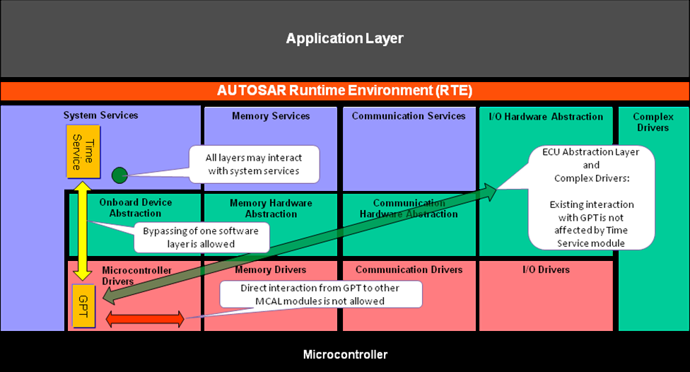
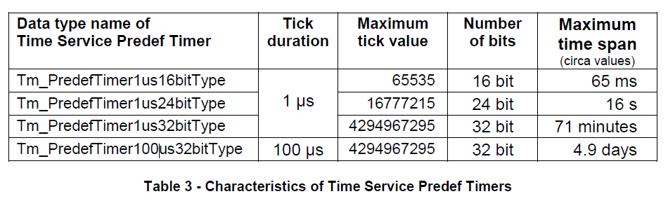
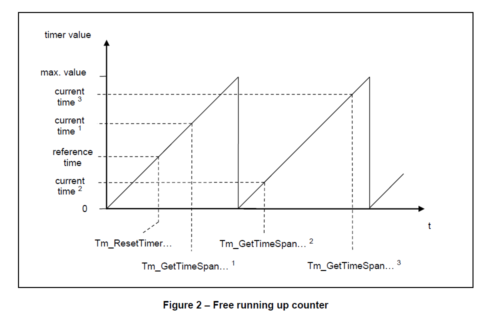
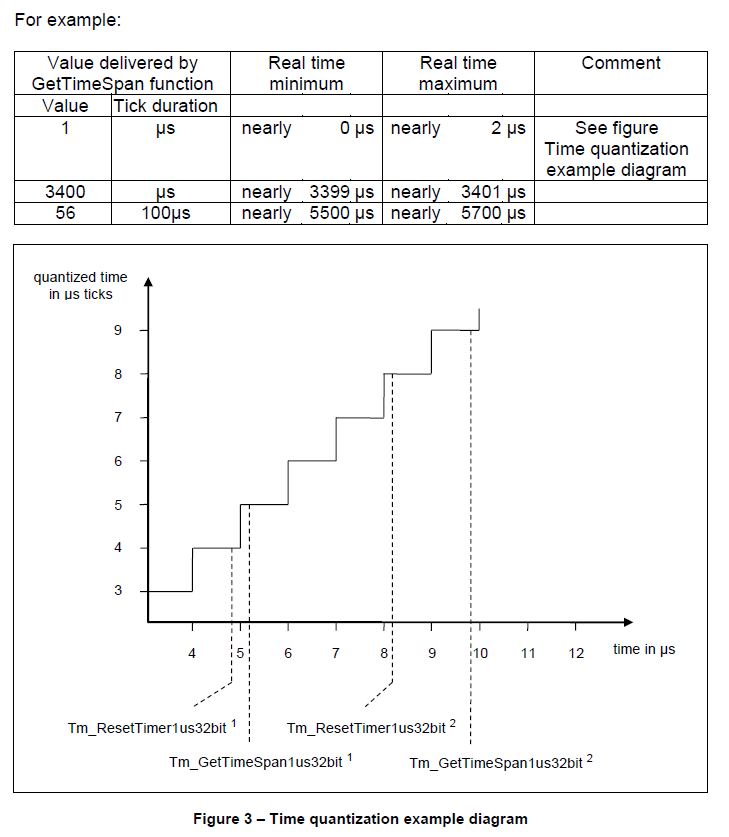
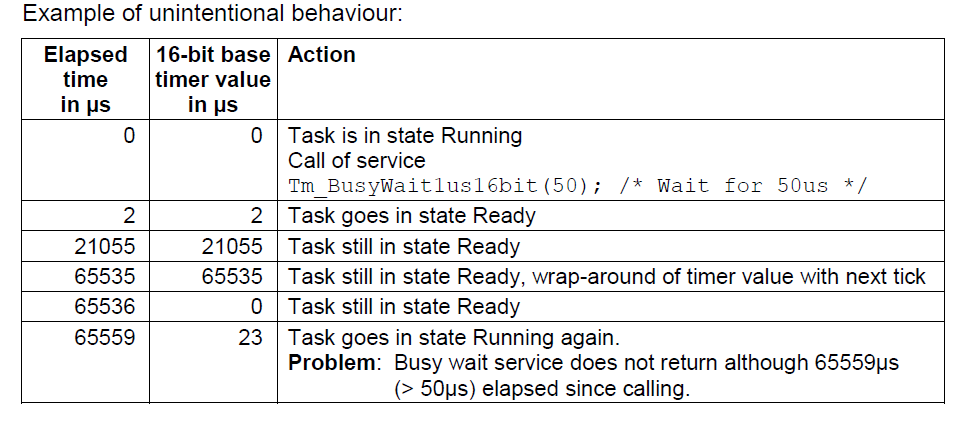
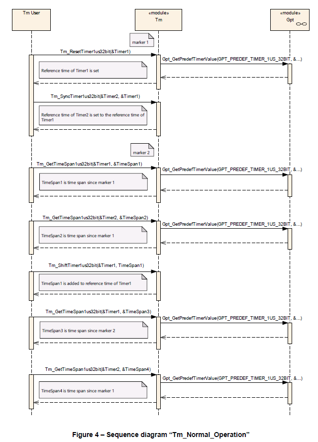

<section id="title">AUTOSAR Time Service（时间服务）</section>

# 1. 简介和功能概述

本规范规定了 **AUTOSAR** 基础软件模块时间服务（Time Service）的功能、API 和配置。

时间服务模块是服务层的一部分。该模块为基于时间的功能提供服务。使用的用例包括：

* 时间测量（**Time measurement**）
* 基于时间的状态机（**Time based state machine**）
* 超时监督（**Timeout supervision**）
* 繁忙等待（**Busy waiting**）



时间服务模块并不会使用和分发 **GPT** 驱动程序的所有功能。时间服务模块也并不是定时器栈（**Timer Stack**）的最顶层。

如果硬件支持并通过配置启用后，则可以使用多种定时器类型（**timer types**），即所谓的时间服务预定义定时器（**Time Service Predef Timers**）。

每个预定义定时器都包含一些预定义的：

* 滴答持续时间（物理时间单位）
* 预定义的位数（物理范围）。

这样确保了对于支持所需预定义计时器的所有平台并基于时间的功能的兼容性。

时间服务预定义定时器基于所谓的 **GPT** 预定义定时器，它们是由 **GPT** 驱动程序提供的并可自由运行的硬件定时器。

**AUTOSAR** 定义了以下的时间服务预定义定时器：

* Tm_PredefTimer1us16bitType
* Tm_PredefTimer1us24bitType
* Tm_PredefTimer1us32bitType
* Tm_PredefTimer100us32bitType

如果用户想要实现基于时间的功能，则不需要任何时间服务模块的用户特定配置。用户可以实例化任何计时器（仅受可用内存限制），并且可以完全独立地使用计时器实例。这样硬件计时器就可以被获得重用。

**AUTOSAR** 提供以下基于时间的服务（..表示了左侧扩展）：

* Tm_ResetTimer…
* Tm_GetTimeSpan…
* Tm_ShiftTimer…
* Tm_SyncTimer…
* Tm_BusyWait…

所有服务都由用户调用（轮询模式），不支持任何通知。

时间服务可用于：
* 初始化阶段（**Initialization phase**）
* Task任务（**Task**）
* Cat2 中断服务程序（**Cat2 interrupt service routines**）
* 操作系统挂钩（**OS hooks**）

对于时间服务模块的实现，不需要使用任何中断（**interrupts**）。

## 1.1. 用例

### 1.1.1. 时间测量

通过使用时间服务模块，可以测量代码的执行时间和周期时间，甚至可以测量以下代码的运行时间和周期时间：

* Task任务（**Tasks**）
* **Cat2**中断服务程序（**Cat2 interrupt service routines**）
* 普通函数（**Functions**）
* 软件代码片段（**Pieces of software**）

可以生成时间戳。

因为时间服务模块的服务可以在操作系统的 **PreTaskHook**和 **PostTaskHook** 中调用吗，所以这些服务可以用来测量**CPU**负载和Task任务的负载。

### 1.1.2. 基于时间的状态机

基于时间的状态机（Time base state machine）是指状态转换取决于时间。通过使用时间服务模块，可以实现基于时间的状态机，它几乎独立于调用任务的周期时间。由于时间信息是通过轮询方式查询的，用户软件必须确保与所需的时序行为相关Task任务的周期时间足够短。

### 1.1.3. 超时监督和忙等待

通过使用时间服务模块，可以通过应用预定义定时器而不是循环（**loops**）或nop空指令（**nop instructions**）来实现超时监督（**timeout supervision**）或繁忙等待（**busy waiting**），从而防止软件模块中的错误或者不确定的行为。

使用循环（**loops**）或nop空指令（**nop instructions**）是一种糟糕而关键的设计。因为以这种方式实现的时间间隔取决于：

* **CPU** 速度（**CPU speed**）
* 管道的影响（**Pipeline effects**）
* 缓存的影响（**Cache effects**）
* 内存访问时间（总线宽度，等待状态，...）
* 被中断服务程序的中断的影响。
* 编译器版本，编译器选项，以及编译器优化。

# 2. 首字母缩略词、缩略语和术语

此处仅列出了一些有助于理解本文档或具有本地范围的首字母缩略词和缩略语。 更多信息可以在官方 **AUTOSAR** 词汇表[8]中找到。

**nop**
> 无操作（**No Operation**）

**GPT Predef Timer**
> **GPT** 预定义定时器是 **GPT** 驱动程序提供的一种能够运行的计数器。具体哪些 **GPT** 预定义定时器可用完全取决于硬件和配置，如：时钟、硬件定时器、预分频器、定时器寄存器的宽度等。**GPT** 预定义定时器具有预定义的物理时间单位和范围。

**Time Service Predef Timer**
> 时间服务预定义定时器也是一种能够自由运行的计数器，具有预定义的物理时间单位和范围。硬件定时器的功能基于相应的**GPT** 预定义定时器。时间服务模块为每个 预定义定时器提供一组 **API** 服务。用户可以实例化任何计时器，仅受可用内存限制，并且可以完全独立地使用这些实例。

**Timer instance**
> 定时器实例是由 **API** 数据类型 **Tm_PredefTimer...bitType** 所对应的一个数据对象。这意味着它是用户软件级别上的时间服务预定义定时器的实例化。用户可以实例化任何计时器，仅受可用内存限制。通过 **API** 服务提供的方法，每个计时器实例完全可以被独立地使用。

**Reference time**
> 参考时间是为每个计时器实例存储的时间值。它是 **API** 数据类型 **Tm_PredefTimer...bitType** 所对应的实现特定元素。

# 3. 相关文档

## 3.1. 输入文件

[1] List of Basic Software Modules
> AUTOSAR_TR_BSWModuleList.pdf

[2] Layered Software Architecture
> AUTOSAR_EXP_LayeredSoftwareArchitecture.pdf

[3] General Requirements on Basic Software Modules
> AUTOSAR_SRS_BSWGeneral.pdf

[4] Specification of Standard Types
> AUTOSAR_SWS_StandardTypes.pdf

[5] Specification of Default Error Tracer
> AUTOSAR_SWS_ DefaultErrorTracer.pdf

[6] Specification of ECU Configuration
> AUTOSAR_TPS_ECUConfiguration.pdf

[7] Requirements on Time Service
> AUTOSAR_SRS_TimeService.pdf

[8] Glossary
> AUTOSAR_TR_Glossary.pdf

[9] Basic Software Module Description Template
> AUTOSAR_TPS_BSWModuleDescriptionTemplate.pdf

[10] General Specification of Basic Software Modules
> AUTOSAR_SWS_BSWGeneral.pdf

[11] Specification of GPT Driver
> AUTOSAR_SWS_GPTDriver.pdf

## 3.2. 相关标准和规范

[12] IEC 7498-1 The Basic Model, IEC Norm, 1994

## 3.3. 相关规范

AUTOSAR 提供了基本软件模块的通用规范 [10] (AUTOSAR_SWS_BSWGeneral)，它也适用于时间服务。

因此，规范**AUTOSAR_SWS_BSWGeneral**应被视为时间服务的附加和必需规范。

# 4. 约束和假设

## 4.1. 限制

### 4.1.1. 功能基于可能不可用的硬件计时器

时间服务模块的功能基于 **GPT** 驱动程序提供的硬件定时器（**GPT Predef Timers**）。

可以启用哪个 **GPT** 预定义定时器取决于时钟和可用的定时器硬件（预分频器、定时器寄存器的宽度）。建议启用所有 **GPT Predef Timers** 以确保所有平台的基于时间的功能的兼容性。

### 4.1.2. 没有标准化的 AUTOSAR 接口

在本规范中，没有定义标准化的 **AUTOSAR** 接口。这意味着位于 **RTE** 上方的 AUTOSAR 软件组件 (SW-C) 无法访问时间服务模块的服务。在进一步的步骤（未来的 AUTOSAR 版本/修订）中，可以将标准化的 AUTOSAR 接口添加到规范中。

### 4.1.3. 多分区支持

因为时间服务模块使用 **GPT** 模块来获取硬件计时器的当前时间，所以两个模块都应该在同一个 BSW 分区上运行。如果 **Time Service** 模块用于具有分布式 **BSW** 的系统中（例如在多核系统中），建议在每个 **BSW** 分区中使用具有 **Time Service** 和 GPT 模块的功能集群，以防止分区间通信。

由于性能原因主从服务方式（**A master/satellite approach**）在这里并不合适。即：在一个 **BSW** 分区中使用 GPT 和主时间服务，而在另一个 **BSW** 分区中使用从时间服务的方式。

# 5. 对其他模块的依赖

时间服务模块依赖于以下其他 **AUTOSAR** 模块： 

## 5.1. GPT。

时间服务模块的功能基于所谓的 **GPT** 预定义定时器。**GPT** 预定义定时器是 **GPT** 驱动程序提供的一种自由运行计数器，具体请参阅参考文档[11]（SWS GPT 驱动程序）。

# 6. 功能规格

## 6.1. 一般行为

### 6.1.1. GPT 预定义计时器（GPT Predef Timers）

时间服务模块的功能基于所谓的 **GPT** 预定义定时器，具体请参阅参考文档[11]（SWS GPT 驱动程序）。

### 6.1.2. 时间服务预定义定时器（Time Service Predef Timers）

时间服务预定义定时器是基于相应的 **GPT** 预定义定时器。

对应每个时间服务预定义定时器，都会定义了一个数据类型。



定时器实例可以通过定义时间服务预定义定时器数据类型的数据对象（RAM 数据）来创建。例如：

**Tm_PredefTimer1us32bitType** *Timer1*； /* 定义定时器实例 */

数据类型（以及计时器实例）包含一个所谓的参考时间（**reference time**）。此参考时间对于某些 API 服务是必需的。

因为结构元素不得在时间服务模块之外使用，所以数据类型的详细定义超出了本规范的范围。

数据类型 **Tm_PredefTimer1us32bitType** 的示例：

```
typedef struct {
    uint32 ui32RefTime； /* 定时器的参考时间 */
} Tm_PredefTimer1us32bitType;
```

由于性能原因，每个时间服务预定义定时器都有自己的 **API** 服务集，尤其是对于 1μs 计时器。这些服务提供了类似秒表的简单功能：

* ResetTimer（复位定时器）
* GetTimeSpan（获取时间跨度）
* ShiftTimer（改变定时器）
* SyncTime（同步时间）
* BusyWait（繁忙等待，仅适用于 1μs 定时器）

每个服务至少包含一个参数（如：TimerPtr），它是一个指向在用户软件级别定义的计时器实例的指针。

服务名称由两部分组成：

* 第一部分：做什么。例如：**Tm_ResetTimer**
* 第一部分：使用哪种预定义定时器类型。例如 **1us32bit**

具体服务名称如下：**Tm_ResetTimer1us32bit**

时间服务模块需使用 GPT 驱动服务 **Gpt_GetPredefTimerValue** 来获取所需预定义定时器的当前时间值。

如果需要时间基准：

1. **1us16bit**功能需使用定时器 **GPT_PREDEF_TIMER_1US_16BIT** 作为时间基准。
2. **1us24bit**功能需使用定时器 **GPT_PREDEF_TIMER_1US_24BIT** 作为时间基准。
3. **1us32bit**功能需使用定时器 **GPT_PREDEF_TIMER_1US_32BIT** 作为时间基准。
4. **100us32bit**功能需使用定时器 **GPT_PREDEF_TIMER_100US_32BIT** 作为时间基准。

如**1us16bit**函数名的示例是**Tm_ResetTimer1us16bit** 

### 6.1.3. 最大可测量时间跨度

本章是用户软件级别必须考虑。

可测量的时间跨度被限制为相应 **GPT** 预定义定时器的最大值。计时器的环绕由 **GetTimeSpan** 函数处理。

下图自由运行计数器显示了 **GPT** 驱动程序提供的自由运行计数器的一般行为。例如，服务 **Tm_ResetTimer…** 和 **Tm_GetTimeSpan…** 用于测量三个时间跨度。



通过调用 **Tm_ResetTimer…** 将相关 **GPT** 预定义定时器的当前时间存储为参考时间。通过调用 **Tm_GetTimeSpan…** 计算并传递当前时间与参考时间之间的时间差。

对于：**Tm_GetTimeSpan… <sup>1</sup>** 和 Tm_GetTimeSpan… <sup>2</sup>，时间跨度会被正确计算。

但对于Tm_GetTimeSpan… <sup>3</sup> 无法计算正确的时间跨度。因为时间已经超过了最大时间跨度，同时无法检测到这种超出。这不是本规范的错误，而是技术原理造成的逻辑后果。具体另请参阅繁忙等待服务的无意行为（**Unintentional behavior of BusyWait services**）。

为确保在任何可能的情况下都能正确执行，**GetTimeSpan** 服务的用户必须检查：
* 使用哪个预定义定时器是必需的，并且足够的。
* 任务调度（**the task scheduling**）
* 在用户软件级别中断或资源锁定是否是必需的。
* 用户软件是否能容忍此类问题。

### 6.1.4. 时间量化误差

本章是用户软件级别必须考虑。

在使用和解析 **GetTimeSpan** 函数提供的值时，必须考虑量化误差理论。**GetTimeSpan** 函数提供的数组值有 **+/-1** 个滴答声（**Tick**）的精度误差。



在上面的示例图中，**Tm_GetTimeSpan1us32bit** <sup>1</sup> 和 **Tm_GetTimeSpan1us32bit** <sup>2</sup> 的两个调用都传递值1，这意味着 **1μs**。

根据 **Tm_ResetTimer1us32bit** 和 **Tm_GetTimeSpan1us32bit** 调用发生的时间点，实时时间跨度可以在接近 **0μs** 到接近 **2μs** 的范围内。

如果使用 **GetTimeSpan** 函数来检查最小时间。例如，为了：

* 超时监督（**Timeout supervision**）
* 繁忙等待（Busy waiting）
  
用户软件必须观察 **n+1** 个滴答声，以确保经过至少 n 个滴答声的间隔。对于繁忙等待，需使用 **BusyWait** 服务。

### 6.1.5. 短时间跨度服务及测量的执行时间

本章是用户软件级别必须考虑。

如果要在用户软件级别测量短时间跨度，则 **Tm** 服务和底层 **GPT** 驱动程序服务的执行时间应足够短。这和需测量的时间跨度相关。

其执行时间取决于：
* 代码的实现（**Implementation**）
* **CPU**速度
* 相关**GPT**预定义定时器的实现，详见[11]（SWS GPT Driver）的GPT预定义定时器章节。

用户必须检查执行时间是否足以满足具体的使用用例。

### 6.1.6. ResetTimer服务

**ResetTimer** 服务，从用户的角度重置计时器实例。

**ResetTimer** 函数的示例：**Tm_ResetTimer1us32bit**

**ResetTimer** 函数需重置由参数**TimerPtr**传递的计时器实例。这意味着，定时器实例的参考时间应设置为相关 GPT 预定义定时器的当前时间。

如果并发调用中使用的定时器实例不同，**ResetTimer**函数应该是可重入的。

如果启用了时间服务模块的开发错误检测： 如果指针参数是空指针，**ResetTimer** 函数将引发错误 **TM_E_PARAM_POINTER** 并返回 **E_NOT_OK**。

### 6.1.7. GetTimeSpan服务

**GetTimeSpan** 函数的示例：**Tm_GetTimeSpan1us32bit**

**GetTimeSpan** 函数应计算并传递当前时间与计时器实例的参考时间之间的时间差。

**注意：**

最大可测量时间跨度的限制必须在用户软件层面考虑，见第 6.1.3 章节。

由于 **GetTimeSpan** 函数以整数值的形式提供时间差，因此在使用/解释值时必须在用户软件级别考虑量化误差理论，请参阅第 6.1.4 章节。

如果当前时间的值小于参考时间的值，则 **GetTimeSpan** 函数应在减法（当前时间 - 参考时间）时执行适当的环绕处理（**wrap-around**）。

例如：

例如可以通过以下 C 代码实现适当的环绕进位处理：

* 对于 16 位定时器：

```
ui16TimeSpan = (uint16)(ui16CurrentTime 
               - TimerPtr->ui16RefTime);
```

* 对于 24 位定时器：

```
ui32TimeSpan = (uint32)(ui32CurrentTime 
               - TimerPtr->ui32RefTime) 
                & (uint32)0x00FFFFFFu;
```

* 对于 32 位定时器：

```
ui32TimeSpan = (uint32)(ui32CurrentTime 
               - TimerPtr->ui32RefTime;
```

**GetTimeSpan** 函数应该是完全可重入的，这意味着即使对于相同的计时器实例。

如果启用时间服务模块的开发错误检测：如果指针参数是空指针，**GetTimeSpan** 函数将引发错误 **TM_E_PARAM_POINTER** 并返回 **E_NOT_OK**。

当检测到错误并且参数 **TimeSpanPtr** 不是空指针时，**GetTimeSpan** 函数需使用数值“0”来提供时间跨度。

**注意：**

这是为了在用户软件级别，即使不使用返回值（**E_OK**，**E_NOT_OK**），可可以实现定义的（可重复的）行为。

### 6.1.8. ShiftTimer服务

**ShiftTimer** 函数的示例：**Tm_ShiftTimer1us32bit**

**ShiftTimer** 函数应移动定时器实例的参考时间。这意味着，**TimeValue** 值需添加到计时器实例的参考时间。

如果总和大于计时器的最大值，则 **ShiftTimer** 函数需在添加（参考时间 + TimeValue）时执行适当的环绕处理。

例如：

例如可以通过以下 C 代码实现适当的环绕进位处理：

* 对于 16 位定时器：

```
TimerPtr->ui16RefTime = (uint16)(TimerPtr->ui16RefTime 
                        + TimeValue);
```

* 对于 24 位定时器：

```
TimerPtr->ui32RefTime = (uint32)(TimerPtr->ui32RefTime 
                        + TimeValue) 
                        & (uint32)0x00FFFFFFu;
```

* 对于 32 位定时器：

```
TimerPtr->ui32RefTime = (uint32)(TimerPtr->ui32RefTime 
                        + TimeValue;
```

范围为 24 位的 **ShiftTimer** 函数需将参数 **TimeValue** 的值限制为 **0xFFFFFF**。

如果启用了时间服务模块的开发错误检测：

* 如果参数 **TimeValue** 的值大于 **0xFFFFFF**，范围为 24 位的 **ShiftTimer** 函数将引发错误 **TM_E_PARAM_VALUE**。
* 如果指针参数是空指针，则 **ShiftTimer** 函数应引发错误 TM_E_PARA**M**_POINTER。

如果并发调用中使用的计时器实例不同，则 **ShiftTimer** 函数应是可重入的。

### 6.1.9. SyncTimer服务

**SyncTimer** 函数的示例：**Tm_SyncTimer1us32bit**

**SyncTimer** 函数需能同步两个定时器实例。 这意味着，目标定时器实例的参考时间应设置为源定时器实例的参考时间。

如果并发调用中使用的目标定时器实例不同，则 **SyncTimer** 函数应是可重入的。

如果启用时间服务模块的开发错误检测： 如果指针参数是空指针，则 **SyncTimer** 函数应引发错误 **TM_E_PARAM_POINTER**。

### 6.1.10. BusyWait服务

**BusyWait** 服务通过以保证的最短等待时间轮询来执行繁忙等待（主动等待）。建议使用 **BusyWait** 服务来替代用户软件级别的自己的实现，以避免不佳代码实现的风险。

具体风险可能如需：

* 不能保证最短等待时间。
* 使用循环（**loops**）或nop 指令（**nop instructions**）代替硬件定时器，具体可参见第 1.1.3 章节。

**注意：**

**BusyWait** 函数的规范考虑了量化误差理论，具体请参见第 6.1.4 章节。

因为 **BusyWait** 服务是基于轮询的，**BusyWait** 服务的用户有责任避免无意图的行为。参见第 6.1.10.1 章。

该服务适用于滴答持续时间为 **1μs** 的预定义定时器。等待时间限制为 8 比特位，即最大为255**μs**，以防止代码执行的长时间阻塞。

**BusyWait** 函数的示例：**Tm_BusyWait1us32bit**。

**BusyWait** 函数需使用传递的参数 **WaitingTimeMin** 作为最短时间来执行繁忙等待。**BusyWait** 函数不会禁用中断，这也就意味着实际等待时间可能会大于期望的等待时间。

**BusyWait** 功能应保证最少的等待。 这意味着，必须观察 **n+1** 个滴答声以确保经过至少 **n** 个滴答声的间隔。

**BusyWait** 函数应该是可重入的。

当检测到错误时，**BusyWait** 函数应返回 **E_NOT_OK** 并应立即中止等待。

### 6.1.11. BusyWait 服务的无意行为

本章是用户软件级别必须考虑。

因为 **BusyWait** 服务基于轮询，所以使用 **BusyWait** 服务的用户有责任避免无意图的行为。

无意图行为示例如需：

| 以μs为单位的经过时间 | 以μs为单位的16位基本定时器值 | 行动                                                                                             |
| -------------------: | ---------------------------: | ------------------------------------------------------------------------------------------------ |
|                    0 |                            0 | 任务处于运行状态，调用服务**Tm_BusyWait1us16bit(50)**; /* 等待 50us */}                          |
|                    2 |                            2 | 任务进入就绪状态                                                                                 |
|                21055 |                        21055 | 任务仍处于就绪状态                                                                               |
|                65535 |                        65535 | 任务仍处于就绪状态，定时器值与下一个刻度环绕                                                     |
|                65536 |                            0 | 任务仍处于就绪状态                                                                               |
|                65559 |                           23 | 任务再次进入运行状态。问题：尽管自调用以来经过了**65559μs** (> 50μs)，但繁忙的等待服务没有返回。 |



为确保在任何可能的情况下都能正确行为，**BusyWait** 服务的用户必须检查：

* 选择需要/足够的**Busy** 等待服务 （Tm_BusyWait1us16bit、Tm_BusyWait1us24bit、Tm_BusyWait1us32bit）。
* 任务调度（**the task scheduling**）。
* 在用户软件级别是否需要中断或资源锁定
* 用户软件是否能容忍此类问题。

通过使用服务**Tm_BusyWait1us32bit**，只有当调用忙等待服务的任务被抢占（未执行，处于就绪状态）超过 71 分钟时，才会出现上述问题。

### 6.1.12. API服务的配置

时间服务模块允许配置启用哪些预定义定时器。

配置参数示例：**TmEnablePredefTimer1us16bit** 。

对于通过配置启用的每个预定义定时器，并需提供以下 API 服务集：**ResetTimer**、**GetTimeSpan**、**ShiftTimer**、**SyncTimer**。

对于每个通过配置启用的滴答持续时间为 **1μs** 的预定义定时器，API 服务 **BusyWait**需可用。

## 6.2. 模块初始化

时间服务模块无任何关于初始化函数（**Tm_Init**）的需求。

时间服务模块无需初始化任何变量（例如：状态）或硬件资源。时间服务模块（假定配置正确）所需的所有 GPT 预定义定时器都会在可能的情况下自动运行。 这是由 **GPT** 驱动程序确保的，请参阅第 6.1.1 章。

## 6.3. 用例示例代码

本章包含了第1.1章节中描述的用例的示例代码。

### 6.3.1. 时间测量

有时需要测量代码的执行时间。
示例代码：

```C
#include "Os.h"
#include "Tm.h"

Tm_PredefTimer1us24bitType TimerIsr1;       /* Define timer instance */ 
Tm_PredefTimer1us24bitType TimerTask100ms;  /* Define timer instance */

uint32 RunTimeIsr1_us;                      /* Gross runtime of Isr1 */ 
uint32 RunTimeTask100ms_us;                 /* Gross runtime of Task100ms */

ISR(Isr1) 
{ 
    (void)Tm_ResetTimer1us24bit(&TimerIsr1); 
    
    /* Code... */ 
    
    (void)Tm_GetTimeSpan1us24bit(&TimerIsr1, &RunTimeIsr1_us); 
}

TASK(Task100ms)
{ 
    (void)Tm_ResetTimer1us24bit(&TimerTask100ms); 
    
    /* Code... */ 
    
    (void)Tm_GetTimeSpan1us24bit(&TimerTask100ms, &RunTimeTask100ms_us);
    (void)TerminateTask(); 
}
```

### 6.3.2. 基于时间的状态机

通过实现基于时间的状态机，可以实现几乎独立于调用任务的周期时间的基于时间的功能。

示例代码：

```C
#include "Os.h"
#include "Tm.h"

#define MY_INIT  0 
#define MY_WAIT1 1 
#define MY_WAIT2 2 

uint8_least State = MY_INIT; 

TASK(Task5ms) 
{ 
    static Tm_PredefTimer1us24bitType Timer; /* Define timer instance */ 
    uint32 WaitingTime1_us = 500000u; /* 500ms */ 
    uint32 WaitingTime2_us = 250000u; /* 250ms */ 
    
    switch (State) 
    { 
        case MY_INIT: 
        { 
            (void)Tm_ResetTimer1us24bit(&Timer); 
            State = MY_WAIT1; 
            break; 
        } 
        
        case MY_WAIT1: 
        { 
            uint32 Time_us; 
            (void)Tm_GetTimeSpan1us24bit(&Timer, &Time_us); 
            
            if (Time_us >= WaitingTime1_us) 
            { 
                /* Action ... */ 
                
                Tm_ShiftTimer1us24bit(&Timer, WaitingTime1_us); 
                State = MY_WAIT2; 
            } 
            break; 
        } 
        
        case MY_WAIT2:
        { 
            uint32 Time_us; 
            (void)Tm_GetTimeSpan1us24bit(&Timer, &Time_us); 
            
            if (Time_us >= WaitingTime2_us) 
            { 
                /* Action ... */ 
                
                Tm_ShiftTimer1us24bit(&Timer, WaitingTime2_us); 
                State = MY_WAIT1; 
            } 
            break; 
        } 
    } 
    
    (void)TerminateTask(); 
}
```

### 6.3.3. 超时监督

在硬件访问 **MCAL** 驱动程序的情况下，有时需要在特定但很短的时间内预期硬件反应。

示例代码：

```C
#include "Register.h"
#include "Tm.h"

Tm_PredefTimer1us32bitType Timer1; /* Define timer instance */

uint16 StatusRegisterBit0; 
uint32 TimeElapsed_us;

void SampleFunction(void)
{
    (void)Tm_ResetTimer1us32bit(&Timer1); 
    
    do 
    { 
        StatusRegisterBit0 = HW_STATUS_REG & 0x0001u; 
        (void)Tm_GetTimeSpan1us32bit(&Timer1, &TimeElapsed_us); 
    } while ((StatusRegisterBit0 != 0x0001u) /* Wait until bit 0 is set*/ 
            && (TimeElapsed_us <= 40) /* Timeout 40us */ ); 
}
```

### 6.3.4. 繁忙等待

在硬件访问 MCAL 驱动程序的情况下，有时需要经过一定但很短的时间帧。

示例代码：

```C
#include "Tm.h"

Std_ReturnType CanTrcv_SetOpMode(uint8 Transceiver, CanIf_TrcvModeType OpMode) 
{ 
    
    /* Code */
    
    switch(OpMode) 
    { 
        case CANIF_TRCV_MODE_NORMAL: 
        { 
            /* Code */ 
            
            break; 
        } 
        
        case CANIF_TRCV_MODE_SLEEP: 
        { 
            /* Code */

            SetPinEnableHigh();
            
            /* Busy waiting: 50us (for TJA1054: at least 50us) */ 
            (void)Tm_BusyWait1us32bit(50);
            
            SetPinEnableLow();
            /* Code */
            break; 
        } 
        
        case CANIF_TRCV_MODE_STANDBY: 
            { 
                /* Code */ break; 
            }
    }
    /* Code */
}
```



## 6.4. 错误分类

### 6.4.1. 开发错误

**TM_E_PARAM_POINTER**
> API参数检查：无效指针。

**TM_E_PARAM_VALUE**
> API参数检查：无效数值。


### 6.4.2. 运行时错误

**TM_E_HARDWARE_TIMER**
> 访问底层硬件定时器失败


# 7. API规范

## 7.1. 函数定义

### 7.1.1. Tm_GetVersionInfo

**说明**: 返回此模块的版本信息。

```C
void Tm_GetVersionInfo ( 
    Std_VersionInfoType* VersionInfoPtr )
```

### 7.1.2. Tm_ResetTimer1us16bit

**说明**: 重置计时器实例（用户观点）。

```C
Std_ReturnType Tm_ResetTimer1us16bit (
    Tm_PredefTimer1us16bitType* TimerPtr )
```

### 7.1.3. Tm_GetTimeSpan1us16bit

**说明**: 提供时差（当前时间 - 参考时间）。

```C
void Tm_ShiftTimer1us16bit ( 
    Tm_PredefTimer1us16bitType* TimerPtr, 
    uint16 TimeValue )
```

### 7.1.4. Tm_ShiftTimer1us16bit

**说明**: 移动计时器实例的参考时间。

```C
void Tm_ShiftTimer1us16bit ( 
    Tm_PredefTimer1us16bitType* TimerPtr, 
    uint16 TimeValue )
```

### 7.1.5. Tm_SyncTimer1us16bit

**说明**: 同步两个计时器实例。

```C
void Tm_SyncTimer1us16bit ( 
    Tm_PredefTimer1us16bitType* TimerDstPtr, 
    const Tm_PredefTimer1us16bitType* TimerSrcPtr )
```

### 7.1.6. Tm_BusyWait1us16bit

**说明**: 通过以保证的最短等待时间轮询来执行繁忙等待。

```C
Std_ReturnType Tm_BusyWait1us16bit ( 
    uint8 WaitingTimeMin )
```

### 7.1.7. Tm_ResetTimer1us24bit

**说明**: 重置计时器实例（用户观点）。

```C
Std_ReturnType Tm_ResetTimer1us24bit ( 
    Tm_PredefTimer1us24bitType* TimerPtr )
```

### 7.1.8. Tm_GetTimeSpan1us24bit

**说明**: 提供时差（当前时间 - 参考时间）。

```C
Std_ReturnType Tm_GetTimeSpan1us24bit ( 
    const Tm_PredefTimer1us24bitType* TimerPtr, 
    uint32* TimeSpanPtr )
```

### 7.1.9. Tm_ShiftTimer1us24bit

**说明**: 移动计时器实例的参考时间。

```C
void Tm_ShiftTimer1us24bit ( 
    Tm_PredefTimer1us24bitType* TimerPtr, 
    uint32 TimeValue )
```

### 7.1.10. Tm_SyncTimer1us24bit

**说明**: 同步两个计时器实例。

```C
void Tm_SyncTimer1us24bit ( 
    Tm_PredefTimer1us24bitType* TimerDstPtr, 
    const Tm_PredefTimer1us24bitType* TimerSrcPtr )
```

### 7.1.11. Tm_BusyWait1us24bit

**说明**: 通过以保证的最短等待时间轮询来执行繁忙等待。

```C
Std_ReturnType BusyWait1us24bit ( 
    uint8 WaitingTimeMin )
```

### 7.1.12. Tm_ResetTimer1us32bit

**说明**: 重置计时器实例（用户观点）。

```C
Std_ReturnType Tm_ResetTimer1us32bit ( 
    Tm_PredefTimer1us32bitType* TimerPtr )
```

### 7.1.13. Tm_GetTimeSpan1us32bit

**说明**: 提供时差（当前时间 - 参考时间）。

```C
Std_ReturnType Tm_GetTimeSpan1us32bit ( 
    const Tm_PredefTimer1us32bitType* TimerPtr, 
    uint32* TimeSpanPtr )
```

### 7.1.14. Tm_ShiftTimer1us32bit

**说明**: 移动计时器实例的参考时间。

```C
void Tm_ShiftTimer1us32bit ( 
    Tm_PredefTimer1us32bitType* TimerPtr, 
    uint32 TimeValue )
```

### 7.1.15. Tm_SyncTimer1us32bit

**说明**: 同步两个计时器实例。

```C
void Tm_SyncTimer1us32bit ( 
    Tm_PredefTimer1us32bitType* TimerDstPtr, 
    const Tm_PredefTimer1us32bitType* TimerSrcPtr )
```

### 7.1.16. Tm_BusyWait1us32bit

**说明**: 通过以保证的最短等待时间轮询来执行繁忙等待。

```C
Std_ReturnType Tm_BusyWait1us32bit ( 
    uint8 WaitingTimeMin )
```

### 7.1.17. Tm_ResetTimer100us32bit

**说明**: 重置计时器实例（用户观点）。

```C
Std_ReturnType Tm_ResetTimer100us32bit ( 
    Tm_PredefTimer100us32bitType* TimerPtr )
```

### 7.1.18. Tm_GetTimeSpan100us32bit

**说明**: 提供时差（当前时间 - 参考时间）。

```C
Std_ReturnType Tm_GetTimeSpan100us32bit ( 
    const Tm_PredefTimer100us32bitType* TimerPtr, 
    uint32* TimeSpanPtr )
```

### 7.1.19. Tm_ShiftTimer100us32bit

**说明**: 移动计时器实例的参考时间。

```C
void Tm_ShiftTimer100us32bit ( 
    Tm_PredefTimer100us32bitType* TimerPtr, 
    uint32 TimeValue )
```

### 7.1.20. Tm_SyncTimer100us32bit

**说明**: 同步两个计时器实例。

```C
void Tm_SyncTimer100us32bit ( 
    Tm_PredefTimer100us32bitType* TimerDstPtr, 
    const Tm_PredefTimer100us32bitType* TimerSrcPtr )
```

# 8. 配置规范

## 8.1. TmGeneral

### 8.1.1. TmDevErrorDetect

打开或关闭开发错误检测和通知。

* **true**：启用检测和通知。
* **false**：检测和通知被禁用。

### 8.1.2. TmEnablePredefTimer100us32bit

指定是否应启用100μs/32位的预定义定时器功能和 **API** 服务。**On**或者**Off**。

### 8.1.3. TmEnablePredefTimer1us16bit

指定是否应启用1μs/16位的预定义定时器功能和 **API** 服务。**On**或者**Off**。

### 8.1.4. TmEnablePredefTimer1us24bit

指定是否应启用1μs/24位的预定义定时器功能和 **API** 服务。**On**或者**Off**。

### 8.1.5. TmEnablePredefTimer1us32bit

指定是否应启用1μs/32位的预定义定时器功能和 **API** 服务。**On**或者**Off**。

### 8.1.6. TmVersionInfoApi

从代码中添加/删除服务 **Tm_GetVersionInfo**()。**On**或者**Off**。

<section id="wechat">

<h4>微信扫一扫，获取更多及时资讯</h4>


</section>