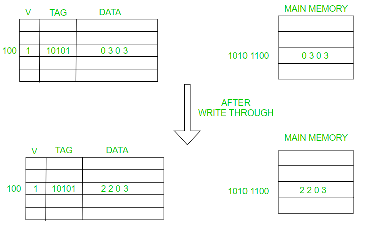
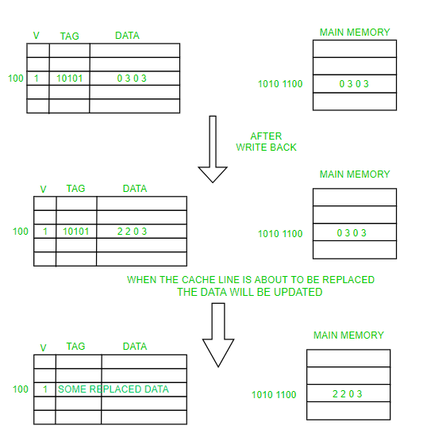
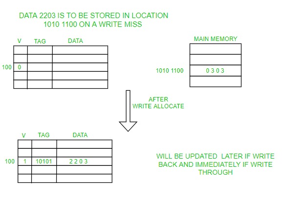
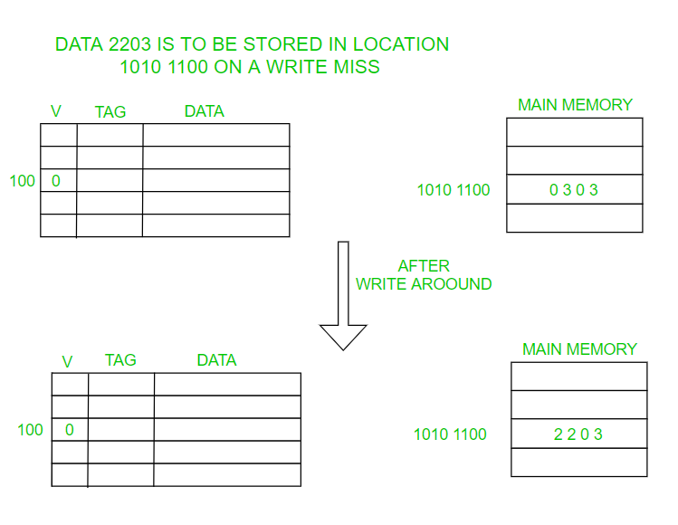

<section id="title">透写和回写缓存（Write Through and Write Back in Cache）</section>

# 1. 透写和回写缓存

高速缓存（**Cache**）是一种将数据副本临时存储在可快速访问的存储内存中的技术。缓存将最近使用的数据存储在小内存中，以提高访问数据的速度。它充当 **RAM** 和 **CPU** 之间的缓冲区，从而提高处理器可用数据的速度。

每当处理器想要写入一个字时，它都会检查它想要写入数据的地址是否存在于缓存中。如果地址存在于缓存中，即写入命中（**Write Hit**）。

我们可以更新缓存中的值并避免昂贵的主内存访问。但这会导致数据不一致（**Inconsistent Data**）问题。由于高速缓存和主存都有不同的数据，如在多处理器系统中，这将导致两个或多个共享主存的设备出现问题。

这就是透写（**Write Through**）和回写（**Write Back**）出现的地方。

## 1.1. 透写（Write Through）

在透写（**Write Through**）场景中，数据同时更新到缓存和内存（**simultaneously updated to cache and memory**）。这个过程更简单、更可靠。这用于没有频繁写入缓存的情况（写入操作的次数较少）。

它有助于数据恢复（在断电或系统故障的情况下）。因为我们必须写入两个位置（内存和缓存），数据写入将经历延迟。虽然它解决了不一致的问题，但它的问题是在写操作中使用缓存的优势，因为使用缓存的全部目的是避免对主内存的多次访问。

## 1.2. 回写（Write Back）

回写（**Write Back**）也被称为延迟写入（**Write Behind / Write Deferred**）。也就是说，最初数据只在缓存中更新，稍后再更新到内存中。对内存的写入动作会被推迟，直到修改的内容在缓存中即将被另一个缓存块替换。

缓存替换会使用以下算法：

* [Belady异常](https://www.geeksforgeeks.org/beladys-anomaly-in-page-replacement-algorithms)（**Belady’s Anomaly**）
* 最近最少使用（Least Recently Used Algorithm）
* 先进先出（**FIFO**）
* 后进先出（**LIFO**)
* 其他取决于应用程序的算法

变脏标志位（**Dirty Bit**）：缓存中的每个块都需要一个位来指示缓存中存在的数据是被修改（变脏的）还是未被修改（干净的）。如果它是干净的，则无需将其写入内存。它旨在减少对内存的写操作。如果缓存发生故障（**Cache fails**）或系统发生故障（**System fails**）或断电（**Power outages**），修改后的数据将丢失。因为如果数据丢失了，几乎不可能从缓存中恢复数据。

支持回写的缓存实现起来比较复杂，因为它需要跟踪哪些位置已被覆盖，并将它们标记为变脏，以便稍后写入后备内存中。只有当这些位置的数据从缓存中被逐出时，它们才会被写回后备内存中，这种效果称为延迟写入。出于这个原因，回写缓存中的读取未命中（需要一个块被另一个块替换）通常需要两次内存访问来服务：一次将替换的数据从缓存写回存储，然后一次检索所需的数据。

其他策略也可能触发数据回写。如客户端可能对缓存中的数据进行了多次更改，然后显式通知缓存写回数据。

## 1.3. 写未命中（Write Miss）

由于在写操作时没有数据返回给请求者，所以需要对写未命中做出决定，是否将数据加载到缓存中。这是由以下两种方法定义的：写分配（**Write Allocation**）和无写分配（**No Write Allocate**）。

### 1.3.1. 写分配（Write Allocation）

写分配（**Write Allocation**）也被称为写时取（**fetch on write**）。即：未写入位置的数据首先被加载到缓存，然后是写入命中操作。在这种方法中，写入未命中类似于读取未命中。

### 1.3.2. 无写分配（No Write Allocation）

无写分配（**No Write Allocation**）也称为 **Write-no-allocate** 或 **write around**。即：未写入位置的数据不加载到缓存，而是直接写入后备内存。在这种方法中，仅在读取未命中时将数据加载到缓存中。这里数据直接写入或者更新到主存而不干扰缓存。当数据无需立即再次使用时，最好使用这种方法。

### 1.3.3. 应用策略

透写（**Write Through**）和回写（**Write Back**）策略都可以使用这两者写未命中（Write Miss）策略中的任何一个。

但通常它们以这种方式配对：

* 回写（**Write Back**）通常与写分配（**Write Allocation**）一起使用。因为这样不需要将数据从内存中带入缓存，然后再把数据更新缓存和主内存中。同时希望后续写入（甚至读取）到现在已缓存的同一位置。
* 透写（**Write Through**）通常与无写分配（**No Write Allocate**）一起使用。因为它们仍然需要直接写入后备内存，所以在这里后续写入没有优势。

## 1.4. 缓存数据写入的一致性

缓存以外的实体可能会更改后备内存中的数据。在这种情况下，缓存中的副本可能会过期或过时。或者，当客户端更新缓存中的数据时，其他缓存中的这些数据的副本将变得过时。保持数据一致的缓存管理器之间的通信协议称为一致性协议。

## 1.5. 参考文献

* [https://www.geeksforgeeks.org/write-through-and-write-back-in-cache](https://www.geeksforgeeks.org/write-through-and-write-back-in-cache)
* [https://en.wikipedia.org/wiki/Cache_(computing)](https://en.wikipedia.org/wiki/Cache_(computing))