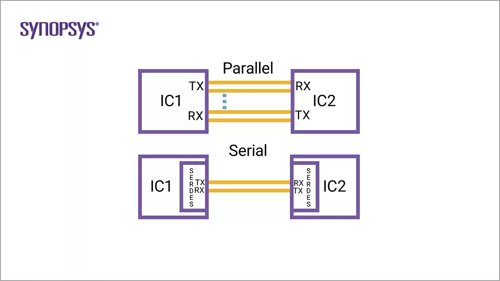

<section id="title">什么是SerDes</section>

# 定义

SerDes是一种功能模块，主要用于在高速的芯片到芯片通信中，序列化（**Serializes**）和去序列化（**Deserializes**）所使用的数字数据（**digital data**）。对于当前高性能计算（**HPC**）、人工智能（**AI**）、汽车、手机和物联网应用（**IoT**）的 **SoC** 实施的 **SerDes** 可以支持多种数据速率和标准，如：PCI Express（PCIe）、MIPI、以太网、USB、USR/XSR。

# 

SerDes实现包括并行到串行（串行到并行）数据转换、阻抗匹配电路和时钟数据恢复功能。SerDes 的主要作用是最大限度地减少 I/O 互连的数量。

