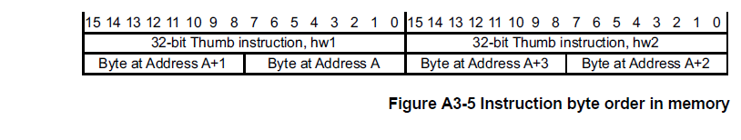

<section id="title">ARM的内存模式</section>

# 1. Arm架构内存模式介绍

## 1.1. 地址空间

**Armv7-M** 是一种内存映射架构。**B3**章节的系统地址映射描述了 **Armv7-M** 地址映射。

**Armv7-M** 架构使用 2<sup>32</sup>个8位字节的单一平坦地址空间。字节地址被视为无符号数，范围从0到2<sup>32</sup> - 1。

该地址空间被视为由 2<sup>30</sup>个32位字组成，每个字的地址都是字对齐的，这意味着地址可以被4整除。字对齐地址为A的字，由四个带地址的字节组成：**A**、**A+1**、**A+2**和**A+3**。地址空间也可以认为是由2<sup>31</sup>个16位半字组成，每个半字的地址都是半字对齐的，也就是说地址可以被2整除。半字对齐地址为A的半字，由两个带地址的字节组成：**A**和**A+1**。

虽然取指总是半字对齐，但一些加载和存储指令支持非对齐地址。这会影响访问地址**A**，所以在字访问情况下的 A[1:0] 和在半字访问情况下的 A[0] 可以具有非零值。

地址计算通常使用普通整数指令来执行。这意味着如果它们溢出或下溢地址空间，它们通常会回绕。描述这一点的另一种方式是任何地址计算都以2<sup>32</sup>为模减少。

指令的正常顺序执行有效地计算：
(address_of_current_instruction) + (2 or 4) /*16 位和 32 位指令混合*/

在每条指令之后确定接下来要执行的指令。如果这个计算溢出地址空间的顶部，结果是不可预测的。在 **Armv7-M** 中，这种情况不会发生，因为内存顶部被定义为始终具有与其关联的 Execute Never (XN) 内存属性。有关详细信息，请参阅第 B3-592 页的系统地址映射。如果发生这种情况，将报告访问冲突。

以上仅适用于执行的指令，包括那些未通过条件代码检查的指令。大多数 Arm 实现在当前执行的指令之前预取指令。

LDC、LDM、LDRD、POP、PUSH、STC、STRD、STM、VLDM、VPOP、VPUSH、VSTM、VLDR.64 和 VSTR.64 指令访问内存地址递增的字序列，有效地将内存地址增加4对于每个寄存器加载或存储。如果此计算溢出地址空间的顶部，则结果是不可预测的。

任何未对齐的加载或存储，其计算地址使得它可以访问 **0xFFFFFFFF** 处的字节和地址 **0x00000000** 处的字节作为指令的一部分是不可预测的。

Armv7-M 中使用的所有内存地址都是物理地址PA（**physical addresses**）。为了与其他 Arm 架构参考手册保持一致，尽管 Armv7-M 没有虚拟地址VA（**virtual addresses**）的概念，但本手册始终使用术语修改虚拟地址MVA（**Modified Virtual Address**）。对于 Armv7-M 架构配置文件，在所有情况下，MVA、VA 和 PA 具有相同的值。

## 1.2. 对齐支持

系统架构为 **Armv7-M** 中的对齐检查提供了两种策略：

* 支持非对齐访问。
* 发生未对齐访问时生成故障。

该策略因访问类型而异。可以将实现配置为对所有未对齐的访问强制对齐错误。

根据第 A5-126 页使用 0b1111 作为寄存器说明符中概述的规则限制对 PC 的写入。

## 1.3. 字节序支持

按[地址空间](#1-地址空间)规则要求地址**A**：

* 地址**A**处的字（**word**）由地址**A**、**A+1**、**A+2**和**A+3**的字节组成。
* 地址**A**的半字（**halfword**）由地址**A**和**A+1**的字节组成。
* 地址**A+2**的半字（**halfword**）由地址**A+2**和**A+3**的字节组成。
* 地址**A**处的字（**word**）可可以理解成由地址**A**和**A+2**处的半字（**halfword**）组成。

但是，这并没有完全指定字、半字和字节之间的映射。存储系统使用以下映射方案之一。这种选择被称为内存系统的字节序（**the endianness of the memory system**）。

在小端存储器系统中，来自存储器的字节与 Arm 寄存器中的解释值之间的映射如图 A3-1 所示。

* 地址**A**处的字节或半字是该地址处字内的最低有效字节或半字。
* 半字地址**A**的字节是该地址半字内的最低有效字节。


在大端存储器系统中，来自存储器的字节与 Arm 寄存器中的解释值之间的映射如图 A3-2 所示。

* 地址**A**处的字节或半字是该地址处字内的最高有效字节或半字。
* 半字地址**A**的字节是该地址半字内的最高有效字节。


对于字地址 A，第 A3-68 页的图 A3-3 和图 A3-4 显示了地址 A 处的字、地址 A 和 A+2 处的半字以及地址 A、A+1、A 处的字节 +2 和 A+3 为每个字节序映射到彼此。


大端（**big-endian**）和小端（**little-endian**）映射方案确定解释字或半字的字节的顺序。

例如：从地址 0x1000 加载一个字（4 个字节）将导致访问包含在内存位置 0x1000、0x1001、0x1002 和 0x1003 中的字节，而不管使用的映射方案如何。映射方案决定了这些字节的重要性。

### 1.3.1. Armv7-M 中的字节序控制

**Armv7-M** 支持可选字节序模型（**selectable endian mode**）。在该模型中，在复位时，控制输入确定字节序是大端字节序 (BE) 还是小端字节序 (LE)。这种字节序映射有以下限制：

* 字节序设置仅适用于数据访问。取指令总是小端。
* 所有对 **SCS** 的访问都是小端的，请参阅[系统控制空间 (SCS)](#22-系统控制空间-scs)。

**AIRCR.ENDIANNESS** 位指示字节顺序，请参见应用程序中断和复位控制寄存器**AIRCR**。

如果实现需要支持大端指令提取，它可以在总线结构中实现。有关详细信息，请参阅第D5-799页的 Endian 支持。

**指令对齐和字节排序**

**Thumb**指令执行对所有指令强制执行16位对齐。这意味着32位指令被视为两个半字，**hw1**和**hw2**，其中**hw1**位于较低地址。

在指令编码图中，**hw1**显示在**hw2**的左侧。这导致编码图读起来更自然。32位Thumb指令的字节顺序如图 **A3-5** 所示。



**字节序的伪代码细节**

BigEndian() 伪代码函数测试数据访问是大端还是小端：

```C++
// BigEndian()
// ===========
boolean BigEndian()
    return (AIRCR.ENDIANNESS == ‘1’);
```

### 1.3.2. 元素大小和字节序

字节序映射对数据的影响适用于在加载和存储指令中传输的元素的大小。表 A3-1 显示了每个加载和存储指令的元素大小：


### 1.3.3. 在通用寄存器中反转字节的指令

当应用程序或设备驱动程序必须与与内部数据结构的字节序或操作系统的字节序不同的内存映射外围寄存器或共享内存结构进行接口时，需要一种能够显式转换数据字节顺序的有效方法。

**Armv7-M** 支持以下字节转换指令：

* **REV**: 反转字（四字节）寄存器，用于转换32位表示。
* **REVSH**：反向半字和符号扩展，用于转换有符号的16位表示。
* **REV16**：反转寄存器中的压缩半字，用于转换无符号16位表示。

有关详细信息，请参阅第 A7 章指令详细信息中的指令定义。

## 1.4. 同步和信号量

独占访问指令支持非阻塞共享内存同步原语，允许在读取和写入阶段之间的信号量上执行计算，并为多处理器系统设计进行扩展。

在 **Armv7-M** 中，提供的同步原语是：

* 加载独占（**Load Exclusive**）：
  - LDREX，参见第 A7-261 页的 LDREX。
  - LDREXB，参见第 A7-262 页的 LDREXB。
  - LDREXH，参见第 A7-263 页的 LDREXH。
* 存储独占（**Store Exclusive**）:
  - STREX，参见第 A7-394 页的 STREX。
  - STREXB，参见第 A7-395 页的 STREXB。
  - STREXH，参见第 A7-396 页的 STREXH。
* 清楚独占（**Clear-Exclusive**）
  - CLREX，参见 A7-219 页上的 CLREX。

**注意：**
此章节使用 **LDREX** 和 **STREX** 指令来作为示范，描述了一对同步原语的 Load-Exclusive/Store-Exclusive 的操作。相同的描述适用于任何其他同步原语对：

* **LDREXB** 与 **STREXB** 一起使用。
* **LDREXH** 与 **STREXH** 一起使用。

每个加载独占（**Load Exclusive**）指令只能与相应的存储独占（**Store Exclusive**）指令一起使用。

**Armv7-M** 不支持 **STREXD** 和 **LDREXD**。

使用加载独占（**Load Exclusive**）/ 存储独占（**Store Exclusive**）指令对访问内存地址 x 的模型是：

* 加载独占（**Load Exclusive**）指令总是成功地从内存地址x读取一个值。
* 仅当没有其他处理器或进程对地址x执行更新的存储时，相应的存储独占（**Store Exclusive**）指令才能成功写回内存地址x。存储独占（**Store Exclusive**）操作返回一个状态位，指示内存写入是否成功。

加载独占指令标记一小块内存以进行独占访问。标记块的大小由实现定义（**IMPLEMENTATION DEFINED**），请参阅第 A3-75 页的标记和标记内存块的大小。对同一地址的存储独占指令清除标签。

## 1.5. 内存类型和属性以及内存顺序模型

Armv7 定义了一组内存属性，这些属性具有支持系统内存映射中的内存和设备所需的特性。

内存区域的访问顺序（称为内存顺序模型）由内存属性定义。 此模型在以下部分中进行描述：

* 内存类型（**Memory types**）。
* Armv7 内存属性摘要。
* Arm 架构中的原子性（**Atomicity in the Arm architecture**）。
* 普通内存（**Normal memory**）。
* 设备内存（**Device memory**)。
* 强秩序内存（**Strongly-ordered memory**）。
* 内存访问限制（**Memory access restrictions**）。

### 1.5.1. 内存类型

对于每个内存区域，最重要的内存属性指定内存类型。 共有三种互斥内存类型：
* 普通内存（**Normal memory**）。
* 设备内存（**Device memory**)。
* 强秩序内存（**Strongly-ordered memory**）。

普通内存和设备内存的内存区域有额外的属性。

通常，用于程序代码和数据存储的内存是普通内存。使用普通内存技术的例子有：
* 可编程闪存只读存储器（**Programmed Flash ROM**）。
* 只读存储器（**ROM**）。
* SRAM。
* **DRAM** 和 **DDR** 内存。

注意：
在编程过程中，Flash存储器可以比普通存储器更严格地排序。

系统外围设备 (I/O) 通常符合对普通内存的不同访问规则。**I/O** 访问示例如下：

* 连续访问的**FIFO**：
  * 在写入访问时添加排队值。
  * 在读取访问时删除排队值。
* 中断控制器寄存器，其中访问可用作中断确认，改变控制器本身的状态。
* 内存控制器配置寄存器，用于设置正常内存区域的时序和正确性。
* 内存映射外设，访问内存位置会导致系统副作用。

在 **Armv7** 中，这些访问的内存映射区域被定义为设备或强秩序内存。为确保系统正确性，设备内存和强秩序内存的访问规则比普通内存的访问规则更严格：

* 读和写访问都可能有副作用。
* 不得重复访问，例如：从异常返回时。
* 访问的数量、顺序和大小必须被维护。

另外，对于强秩序内存，所有的内存访问都严格按照内存访问指令的程序顺序进行排序。

### 1.5.2. Armv7内存属性总结

表 A3-4 总结了内存属性。有关这些属性的更多信息，请参见：

* [普通内存](#154-普通内存normal-memory)和[设备内存](#155-设备内存device-memory)区域的可共享属性，用于可共享性属性。
* [普通内存](#154-普通内存normal-memory)的直写可缓存（**Write-Through cacheable**）、回写可缓存（**Write-back cacheable**）和不可缓存（**Non-cacheable**）普通内存，用于可缓存的属性。


### 1.5.3. Arm架构中的原子性

原子性是内存访问的一个特征，被描述为原子访问。**Arm** 架构描述指的是两种类型的原子性，包括：

* 单副本原子性（**Single-copy atomicity**）。
* 多副本原子性（**Multi-copy atomicity**）。

**单副本贝原子性**

如果以下条件都为真，则读取或写入操作是单副本原子的：

* 在对操作数进行任意次数的写操作之后，操作数的值是由其中一次写操作写入的值。操作数的数值的一部分不能来自一个写操作，而数值的其他部分来自不同的写操作。
* 当对同一个操作数进行读操作和写操作时，读操作获得的值必须是以下情况中的一种：
  * 写操作前操作数的值。
  * 写操作后操作数的值。

永远不会出现读操作的值部分是写操作之前操作数的值而部分是写操作之后操作数的值的情况。

在 Armv7-M 中，单副本原子处理器访问是：

* 所有字节访问。
* 对半字对齐位置的所有半字访问。
* 对字对齐位置的所有字访问。

LDM、LDC、LDC2、LDRD、STM、STC、STC2、STRD、PUSH、POP、VLDR、VSTR、VLDM、VSTM、VPUSH 和 VPOP 指令作为字对齐字访问序列执行。每个32位字访问都保证是单副本原子的。来自序列的两个或多个单词访问的子序列可能无法表现出单副本原子性。

当访问不是单副本原子时，它将作为一系列较小的访问执行，每个访问都是单副本原子，至少在字节级别。

如果一条指令按照这些规则作为访问序列执行，则序列中可能会出现一些异常并导致该指令的执行被放弃。

在异常返回时，生成访问序列的指令被重新执行，因此在发生异常之前已经执行的任何访问都可能被重复。 另请参阅第 B1-543 页的加载多个和存储多个操作中的异常。

**注意：**

这些多访问指令的异常行为意味着它们不适合用于出于软件同步目的而写入内存。

对于隐式访问：

* 高速缓存行填充和逐出对显式事务或指令提取的单副本原子性没有影响。
* 指令提取是16 位粒度的单拷贝原子。

**多副本原子性**

在多处理系统中，如果以下条件都为真，则对内存位置的写入是多副本原子的：

* 对同一位置的所有写入都是序列化的，这意味着所有观察者以相同的顺序观察它们，尽管有些观察者可能不会观察到所有写入。
* 在所有观察者都观察到该写入之前，对某个位置的读取不会返回写入的值。

对普通内存的写入不是多副本原子的。

所有对设备和强秩序内存的单副本原子写入也是多副本原子的。

对同一位置的所有写访问都被序列化。可以对普通内存重复的写访问，直到观察到对同一地址的另一次写入。

对于普通内存，写入的序列化不会禁止写入的合并。

### 1.5.4. 普通内存（Normal memory）

普通内存是幂等的，这也意味着它表现出以下属性：

* 可以重复读取访问而没有副作用。
* 重复读取访问返回写入正在读取的资源的最后一个值。
* 读取访问可以预取额外的内存位置而没有副作用。
* 可以重复写访问而没有副作用，前提是位置的内容在重复写入之间保持不变。
* 可以支持未对齐的访问。
* 在访问目标内存系统之前可以合并访问。

普通内存可以是又读又写的（**read/write**）或者只读的（**read-only**），同时普通内存区域也可被定义为可共享（**shareable**）或不可共享（**Non-shareable**）。

普通内存类型属性适用于系统中使用的大多数内存。

对普通内存的访问具有弱一致的内存秩序模型。有关弱一致性内存模型的描述，请参阅描述内存秩序问题的标准文本，例如：共享内存多处理器的内存一致性模型的第2章，Kourosh Gharachorloo，斯坦福大学技术报告 CSL-TR-95-685。一般来说，对于普通内存，在必须控制其他观察者观察到的内存访问顺序的情况下，需要屏障操作（**barrier operations**）。无论普通内存区域的可缓存性（**Cacheability**）和可共享性（**Shareability**）属性如何，此需求都适用。

第 A3-91 页内存访问的顺序要求中描述的访问顺序需求适用于所有显式访问。

如 A3-79 页的 Arm 架构中的原子性中所述，生成访问序列的指令可能会因为在访问序列期间发生异常而被放弃。从异常返回时，因为指令会重新启动，所以可能会多次访问一个或多个内存位置。这可能导致对在写访问之间已更改的位置进行重复写访问。

**注意：**

对于 **Armv7-M** 来说，LDM、STM、PUSH、POP、VLDM、VSTM、VPUSH 和 VPOP 指令可以在异常返回时重新启动或继续，请参阅第 B1-543 页的加载多个和存储多个操作中的异常。

**不可共享的普通内存**

对于普通内存区域，不可共享属性标识可能只会被单个处理器访问的普通内存。

标记为不可共享正常的内存区域不需要使高速缓存的效果对数据或指令访问透明。 如果其他观察者共享内存系统，如果缓存的存在可能导致观察者之间通信时出现一致性问题，则软件必须使用缓存维护操作。此缓存维护需求是对确保内存顺序所需的屏障操作的补充。

对于不可共享的普通内存，加载独占（**Load Exclusive**）和存储独占（**Store Exclusive**）同步原语不考虑多个观察者访问的可能性。

**可共享的普通内存**

对于普通内存，可共享内存属性描述了预期由多个处理器或其他系统请求者访问的普通内存。

具有可共享属性的普通内存区域是在内存系统上插入一个或多个缓存的效果对于同一可共享域中的数据访问完全透明。需要显性的软件管理来确保指令缓存的一致性。
 
实现可以使用多种机制来支持此管理需求，从简单地不在可共享区域中缓存访问到用于这些区域的缓存一致性的更复杂的硬件方案。

对于可共享的普通内存，加载独占（**Load Exclusive**）和存储独占**Store Exclusive**）同步原语考虑了同一共享域中多个观察者访问的可能性。

**注意：**

可共享概念使系统设计人员能够指定普通内存中必须具有一致性要求的位置。然而，为了促进软件的移植，软件开发人员不得假设将内存区域指定为不可共享允许软件对共享内存系统中不同处理器之间的内存位置的不一致性做出假设。这样的假设在使用可共享概念的不同多处理实现之间是不可移植的。任何多处理实现都可能实现缓存，这些缓存本质上是在不同处理元素之间共享的。

**直写可缓存、回写可缓存和不可缓存普通内存**

除了可共享或不可共享之外，普通内存的每个区域都可以标记为以下之一：
* 直写可缓存（**Write-Through cacheable**）。
* 可回写高速缓存（**Write-Back cacheable**），带有一个附加限定符，将其标记为以下之一：
  * 回写、写分配（**Write-Back, Write-Allocate**）。
  * 回写，没有写分配（**Write-Back, no Write-Allocate**）。
* 不可缓存（**Non-cacheable**）。
  
区域的可缓存性属性独立于该区域的可共享性属性。如果数据区域用于处理共享数据以外的目的，Cacheability属性指示所需的数据区域处理。这种独立性意味着，例如：在可共享区域不缓存其数据的实现中，标记为可缓存和可共享的内存区域可能不会保存在缓存中。

### 1.5.5. 设备内存（Device memory)

设备内存类型属性定义了以下含义的内存位置：
1. 对该位置的访问可能会导致副作用
2. 或者为加载返回的值可能会因执行的加载次数而异。
   
内存映射外设（**memory-mapped peripherals**）和 I/O 位置（**I/O locations**）是通常标记为设备的内存区域的示例。

对于从处理器到标记为设备的内存的显式访问：

* 所有访问都以其程序大小发生。
* 访问次数是程序指定的次数。

如果程序只允许访问该位置一次的权限，则代码实现不得重复访问设备内存位置。换句话说，对设备内存的位置访问是不可重新启动的。

体系架构不允许对标记为设备的内存进行推测性访问。

标记为设备的地址位置是不可缓存的。虽然可以缓冲对设备内存的写入，但只能在合并保持的地方合并写入：

* 访问次数。
* 访问的顺序。
* 每个访问的大小。

对同一地址的多次访问不得改变对该地址的访问次数。对设备内存的访问不允许合并访问。

当设备内存操作具有适用于普通内存区域的副作用时，软件必须使用内存屏障来确保正确执行。一个示例是针对其控制的存储器访问对存储器控制器的配置寄存器进行编程。

所有对设备内存的显式访问都必须符合第 A3-91 页的内存访问的顺序xuq中描述的访问顺序需求。

如 A3-79 页的 Arm 体系结构中的原子性中所述，生成访问序列的指令可能会因为在访问序列期间发生异常而被放弃。从异常返回时，指令会重新启动，因此可能会多次访问一个或多个内存位置。这可能导致对在写访问之间已更改的位置进行重复写访问。

**注意：**

如果指令可能在异常后重新启动并重复任何写访问，请不要使用生成访问序列的指令来访问设备内存，有关详细信息，请参阅第 B1-543 页的加载多个和存储多个操作中的异常。

任何未受对齐限制故障并访问设备内存的未对齐访问都具有不可预测的行为。

**设备内存区域的可共享属性**

设备内存区域可以被赋予可共享属性。这意味着设备内存的区域可以描述为：

* 可共享的设备内存。
* 不可共享的设备内存。

不可共享的设备内存被定义为只能由单个处理器访问。一个支持可共享和不可共享设备内存的系统的实例就是是同时支持两者的实现：

* 用于其私有外围设备的本地总线。
* 在主共享系统总线上实现的系统外设。

这样的系统可能对本地外围设备（例如看门狗定时器或中断控制器）具有更可预测的访问时间。特别是，不可共享设备内存区域中的特定地址可能会访问每个处理器的不同物理外围设备。

### 1.5.6. 强秩序内存（Strongly-ordered memory）

强秩序内存类型属性以下含义的内存位置：
1. 对该位置的访问可能会导致副作用
2. 或者为加载返回的值可能会因执行的加载次数而异。

通常标记为强序的内存区域的示例是内存映射外设和 I/O 位置。

对于从处理器到标记为强序的内存的显式访问：

* 所有访问都以其程序大小发生。
* 访问次数是程序指定的次数。

实现对强秩序内存位置的访问不得超过程序的简单顺序执行所指定的访问次数，除非是异常的结果。本节描述了例外的这种允许效果。

该体系结构不允许对标记为强序的内存进行推测性数据访问。

强秩序内存中的地址位置不保存在缓存中，并且始终被视为可共享的内存位置。

对强秩序内存的所有显式访问都必须符合第 A3-91 页内存访问的秩序要求中描述的访问秩序要求。

如 A3-79 页的 Arm 架构中的原子性中所述，生成访问序列的指令可能会因为在访问序列期间发生异常而被放弃。从异常返回时，指令会重新启动，因此可能会访问一个或多个内存位置
多次。这可能导致对在写访问之间已更改的位置进行重复写访问。

### 1.5.7. 内存访问限制


## 1.6. 访问权限

### 1.6.1. 数据访问的特权级访问控制

### 1.6.2. 指令访问的特权级访问控制

## 1.7. 内存访问顺序

### 1.7.1. 读取和写入

### 1.7.2. 内存访问的顺序要求

### 1.7.3. 内存壁垒

## 1.8. 缓存和内存层次结构

### 1.8.1. 缓存介绍
### 1.8.2. 内存层次结构
### 1.8.3. 缓存对应用程序程序员的影响
### 1.8.4. 预加载缓存


# 2. 系统地址映射

## 2.1. 系统地址映射

**Armv7-M** 支持预定义的**32**位地址空间，细分代码、数据和外设，以及片载（on-chip）和片外（**off-chip**）资源的区域，其中片载是指与处理器紧密耦合的资源。地址空间支持8个主分区，每个**0.5**GB：

* 代码（**Code**）。
* SRAM。
* 外围设备（**Peripheral**）。
* 两个RAM区域。
* 两个设备区域。
* 系统。

该体系结构分配物理地址以用作事件入口点（向量）、系统控制（**system control**）和配置。事件入口点（**event entry points**）都是相对于表基地址定义的，在复位时配置为实现定义（**IMPLEMENTATION DEFINED**）的值，然后维护在为系统配置和控制保留的地址空间中。为了满足这个和其他系统需求，地址空间**0xE0000000**到**0xFFFFFFFF**被保留供系统级使用。

表 **B3-1** 显示了 **Armv7-M** 默认地址映射，以及该映射中内存区域的属性。在[此表](#211-表b3-1-armv7-m-地址映射)以及[表B3-2](#212-表b3-2-armv7-m-地址映射的system区域细分)中。

* **XN**表示从非执行区域。任何从**XN**区域执行代码的尝试都会出错，从而生成**MemManage**的异常。
* 缓存列（**Cache column**）表示普通内存区域的缓存策略，用于内部和外部缓存，以支持系统缓存。声明的缓存类型可以降级但不能提升，如下所示：
  * WT   : 直写（**Write-Through**）。可以被视为非缓存（**non-cached**）。
  * WBWA : 回写（**Write-Back**）写分配（**write allocate**），可被视为直写（**Write-Through**）或者非缓存（**non-cached**）。
* 在设备栏（**Device column**）中：
  * Shareable: 表示该区域支持多个代理在一致的内存域中共享使用。这些代理可以是处理器和 DMA 代理的任意组合。
  * SO       ：表示强秩序内存。强秩序内存始终是可共享的。
* 指定地址空间的哪些部分由实现定义（**IMPLEMENTATION DEFINED**）：
  * 可读可写（**Read/Write**）。
  * 只读（**Read-only**）。例如：闪存空间。
  * 不可访问（**No-access**）。通常是地址映射中未填充的部分。
* 跨越0.5GB地址边界的未对齐或多字访问是不可预测的。

### 2.1.1. 表B3-1 Armv7-M 地址映射

| Address                 | Name       | Device type           | XN? | Cache | Description                                                                     |
| ----------------------- | ---------- | --------------------- | --- | ----- | ------------------------------------------------------------------------------- |
| 0x00000000 - 0x1FFFFFFF | Code       | Normal                | -   | WT    | Typically ROM or flash memory.                                                  |
| 0x20000000 - 0x3FFFFFFF | SRAM       | Normal                | -   | WBWA  | SRAM region typically used for on-chip RAM.                                     |
| 0x40000000 - 0x5FFFFFFF | Peripheral | Device                | XN  | -     | On-chip peripheral address space.                                               |
| 0x60000000 - 0x7FFFFFFF | RAM        | Normal                | -   | WBWA  | Memory with write-back, write allocate cache attribute for L2/L3 cache support. |
| 0x80000000 - 0x9FFFFFFF | RAM        | Normal                | -   | WT    | Memory with Write-Through cache attribute.                                      |
| 0xA0000000 - 0xBFFFFFFF | Device     | Device, shareable     | XN  | -     | Shared device space.                                                            |
| 0xC0000000 - 0xDFFFFFFF | Device     | Device, Non-shareable | XN  | -     | Non-shared device space.                                                        |
| 0xE0000000 - 0xFFFFFFFF | System     | See Description       | XN  | -     | System segment for the PPB and vendor system peripherals, see Table B3-2.       |

内存映射的系统区域，从 0xE0000000 开始，细分如下：

* 偏移+0x00000000 处的1MB 区域被保留为专用外设总线PPB（**Private Peripheral Bus**）。
* 从偏移+0x00100000 开始的区域是供应商系统区域（**Vendor_SYS**）。

[表B3-2](#212-表b3-2-armv7-m-地址映射的system区域细分)显示了该区域的细分。
  
在 **Vendor_SYS** 区域，Arm建议：

* 供应商资源从0xF0000000开始。
* 区域**0xE0100000-0xEFFFFFFF**被保留。

### 2.1.2. 表B3-2 Armv7-M 地址映射的System区域细分

| Address                 | Name       | Memory type      | XN? | Description                                                                                                          |
| ----------------------- | ---------- | ---------------- | --- | -------------------------------------------------------------------------------------------------------------------- |
| 0xE0000000 - 0xE00FFFFF | PPB        | Strongly-ordered | XN  | 1MB region reserved as the PPB. This supports key resources, including the System Control Space, and debug features. |
| 0xE0100000 - 0xFFFFFFFF | Vendor_SYS | Device           | XN  | Vendor system region, see the Arm recommendations in this section.                                                   |

支持识别非特权和特权访问的软件模型需要内存保护方案来控制访问权限。受保护的内存系统架构 (**PMSAv7**) 是提供此类方案的可选系统级功能，请参阅受保护的内存系统架构**PMSAv7**，**PMSAv7**的实现提供了内存保护单元 (**MPU**)。

**注：**

* **PMSAv7** 是 **Armv7-R** 实施的必需功能。有关 **Armv7-M** 和 **Armv7-R** 实施有何不同的信息，请参阅第 B3-633 页上的 **Armv7-M** 特定支持。
* 一些 **Arm** 文档将非特权访问描述为用户访问，将特权访问描述为主管访问。这些描述基于 **Armv7-A** 和 **Armv7-R** 架构配置文件的功能。

地址映射见[表B3-1](#211-表b3-1-armv7-m-地址映射):
* 是未实施 **PMSAv7** 的系统上唯一支持的地址映射。
* 是禁用**MPU**时内存系统的默认映射。
* 当启用**MPU**时，可用作特权访问的背景区域，请参见**MPU**控制寄存器中**PRIVDEFENA**的定义，第B3-637页的**MPU_CTRL**。

**注：**

启用的**MPU**无法更改系统内存区域的**XN**属性。

### 2.1.3. PPB 寄存器访问的一般规则

**PPB**的一般规则，地址范围从**0xE0000000**到**0xE0100000**：

* 该区域被定义为强秩序内存，请参阅[强秩序内存](#156-强秩序内存strongly-ordered-memory)和[内存访问限制](#157-内存访问限制)。
* 无论处理器的字节序状态如何，寄存器访问总是小端字节序（**little endian**）。
* 一般来说，除非另有说明，寄存器仅支持字访问，字节和半字访问不可预测。优先级和故障状态寄存器是影响不同资源的字节对齐位字段的串联。这样的寄存器可以作为字节或半字寄存器访问，具有适当的
与 32 位寄存器基地址的地址偏移量。

**注意：**

只有当本手册中的寄存器描述明确声明它支持这些访问时，一个寄存器才支持字节和半字访问。

* 当一个位被定义为在读取时被清除为0（**being cleared to 0 on a read**）。当读取该位与将该位设置为1的事件同时发生时，当前架构保证以下原子行为：
  * 如果该位读取为1，则读操作将该位清除为0。
  * 如果该位读取为0，则事件将该位设置为1。随后对该位的读取将返回1并将该位清除为 0。
* 保留的寄存器或位域必须被视为**UNK/SBZP**。

除非另有说明，否则对**PPB**的非特权访问会导致**BusFault**错误。值得注意的例外是：

* 通过对配置控制寄存器中的控制位进行编程，可以启用对系统控制空间中的软件触发中断寄存器的非特权访问。
* 有关调试相关资源，请参阅第 C1-686 页上的适用于调试寄存器访问的一般规则以了解异常详细信息。

## 2.2. 系统控制空间 (SCS)

系统控制空间SCS（**System Control Space**）是一个内存映射的 **4KB** 地址空间，为配置、状态报告和控制提供32位寄存器。**SCS** 寄存器分为以下几组：

* 系统控制和识别。
* CPUID 处理器标识空间。
* 系统配置和状态。
* 故障报告。
* 系统定时器SysTick。
* 嵌套向量中断控制器(NVIC)。
* 受保护的内存系统架构 (PMSA)。
* 系统调试。


以下章节总结了系统控制和ID 寄存器：

* [关于系统控制块](#221-关于系统控制块)。
* 系统控制和ID寄存器。
* 调试系统寄存器。
  
以下部分总结了其他寄存器组：

* 系统计时器 **SysTick**
* 嵌套向量中断控制器 **NVIC**
* 在 **SCS** 中注册对 PMSAv7 的支持。

### 2.2.1. 关于系统控制块

在 **Armv7-M** 处理器中，**SCS** 中的系统控制块 (**SCB**) 为处理器提供关键状态信息和控制功能。**SCB** 支持：

* 不同级别的软件复位控制。
* 异常模型的基地址管理，通过控制表指针。
* 系统异常管理，包括：
    - 例外启用。
    - 显示每个异常状态的状态，非活动、未决或活动。
    - 将异常状态设置为待处理，或从异常中移除待处理状态。
    - 设置可配置系统异常的优先级。
    - 提供各种控制功能和状态信息。<br/>
  这不包括外部中断处理。 NVIC 处理所有外部中断。
* 优先分组控制，请参见第 B1-527 页的优先分组。
* 当前执行代码的异常编号，以及最高优先级的未决异常。
* 其他控制和状态功能，包括协处理器访问支持。
* 电源管理，通过睡眠支持。
* 故障状态信息，请参阅第 B1-551 页的故障行为。
* 调试状态信息。调试特定寄存器区域中的控制和状态对此进行了补充，请参阅第 C1 章 **Armv7-M** 调试。

## 2.3. 系统定时器SysTick

## 2.4. 嵌套向量中断控制器NVIC

## 2.5. 受保护的内存系统架构PMSAv7

支持非特权和特权软件执行模型需要控制访问权限的内存保护方案。**Armv7-M**支持受保护的内存系统架构**PMSAv7**（**Protected Memory System Architecture**）。**PMSAv7**实现的系统地址空间由内存保护单元 (**MPU**) 保护。**MPU** 将内存划分为多个区域（**regions**）。支持区域的数量是根据实现定义的（**IMPLEMENTATION DEFINED**）。**PMSAv7** 可以支持小至**32**字节的区域，但是**4GB**地址空间中的只有有限寄存器资源，也就意味着**MPU**只能提供固有的粗粒度保护方案。该方案是完全可预测的，所有控制信息都保存在与处理器紧密耦合的寄存器中。只有 **MPU** 寄存器接口的软件控制才需要内存访问，请参阅第 B3-635 页的 **SCS** 中 **PMSAv7** 的寄存器支持。

同时 **Armv7-M** 中的 **MPU** 支持是可选的。

### 2.5.1. MPU 与系统内存映射的关系

实现时，**MPU** 与第B3-592页的系统地址映射中描述的系统内存映射的关系如下：
* **MPU** 支持提供对物理地址访问权限的控制。它不执行地址转换。
* 当 **MPU** 被禁用或不存在时，系统采用[表B3-1](#211-表b3-1-armv7-m-地址映射)中列出的默认系统内存映射。启用 **MPU** 时，启用的区域定义系统地址映射，但附带条件如下：
  * 对专用外围总线 (**PPB**) 的访问，始终使用默认系统地址映射。
  * 从向量地址表中读取的异常向量总是使用默认的系统地址映射。
  * **MPU** 在如何更改与系统空间关联的默认内存映射属性方面受到限制，即地址**0xE0000000**和更高的地址。系统空间始终标记为**XN**，从不执行。
  * 当执行优先级小于0时，**MPU_CTRL.HFNMIENA**判断内存访问是使用**MPU**还是默认内存映射属性。如果处理器正在执行 **NMI** 或 **HardFault** 处理程序，或者 **FAULTMASK** 设置为 1，则执行优先级小于0。
  * 默认系统内存映射可以配置为提供特权访问的背景区域。
  * 在多个区域中地址匹配的访问使用最高匹配区域编号作为访问属性。
  * 不匹配区域地址匹配（启用MPU）或背景/默认内存映射匹配的所有访问条件的访问会生成故障。

### 2.5.2. 禁用 MPU 时的行为

通过将 **MPU_CTRL.ENABLE** 位设置为 **0** 来禁用 **MPU**，意味着特权和非特权访问使用默认的内存映射。

当 **MPU**被禁用时：

* 指令访问使用[表B3-1](#211-表b3-1-armv7-m-地址映射)中显示的默认内存映射和属性。访问 **execute-never** 属性访问内存区域会生成 **MemManage** 故障，请参阅第 B3-642 页的 **Execute Never** 编码。无其他权限检查会被执行。缓存的额外控制是通过以下方式进行的：
  - 如果实现了单独的指令和数据缓存，则为 **CCR.IC** 位。
  - 如果实现了统一缓存，则为 **CCR.DC** 位。
* 数据访问使用[表B3-1](#211-表b3-1-armv7-m-地址映射)中显示的默认内存映射和属性。不执行内存访问权限检查，也不会产生中止。
* 程序流预测功能正常，由 **CCR.BP** 位的值控制。
* 推测性指令和数据获取操作正常工作，基于默认内存映射：
  - 如果禁用数据缓存，推测性数据读取操作无效。
  - 如果指令高速缓存被禁用，推测性指令获取操作无效。

### 2.5.3. 符合 PMSAv7 的 MPU 操作

**Armv7-M** 仅支持关于 **MPU** 区域支持的统一内存模型（**a unified memory model**）。所有启用的区域（**regions**）都支持指令和数据访问。

区域的基址、大小和属性都是可配置的，一般规则是所有区域自然对齐。这可以表述为：

```
RegionBaseAddress[(N-1):0] = 0，其中 N 为 log2(SizeofRegion_in_bytes)
```

内存区域的大小可以变化为 2 的幂。支持的大小为 2<sup>N</sup>，其中 5 ≤ N ≤ 32。如果两个区域之间存在重叠，则具有最高区域编号的寄存器优先。

**分区域支持**

对于**256**字节或更大的区域，该区域可以划分为8个大小为2<sup>(N-3)</sup>的子区域（**sub-regions**）。相对于相关的区域属性寄存器，区域内的子区域可以单独禁用（8个禁用位）。当子区域被禁用时，需要来自另一个区域的访问匹配，或者如果启用则需要背景匹配。如果未发生访问匹配，则会生成故障。小于**256**字节的区域大小不支持子区域，对于小于**256**字节的区域，将**MPU_RASR.SRD**设置为非零是不可预测的。

**Armv7-M 特定支持**

**Armv7-M** 支持 **Armv7-R** 架构配置文件的标准 **PMSAv7**，具有以下扩展：

1. 优化的两个寄存器更新模型，软件可以通过写入 **MPU** 区域基地址寄存器来选择要更新的区域。此优化仅适用于前**16**个内存区域 (0 ≤ RegionNumber ≤ 0xF)。
2. **MPU** 区域基地址寄存器和 **MPU** 区域属性和大小寄存器对在三个连续的双字位置中具有别名。使用两个寄存器更新模型，软件可以通过使用单个 **STM** 多字存储指令写入适当的偶数字来修改多达四个区域。

**MPU伪代码**

以下伪代码定义了 Armv7-M MPU 的操作。使用的术语与第 B3-635 页 SCS 中 PMSAv7 的寄存器支持中描述的 MPU 寄存器名称和位字段名称一致。

```C++
// ValidateAddress()
// =================
AddressDescriptor ValidateAddress(bits(32) address, AccType acctype, boolean iswrite)
    ispriv = acctype != AccType_UNPRIV && FindPriv();
    
    AddressDescriptor result;
    Permissions perms;
    
    result.physicaladdress = address;
    result.memattrs = DefaultMemoryAttributes(address);
    perms = DefaultPermissions(address);

    hit = FALSE; // assume no valid MPU region and not using default memory map
    
    isPPBaccess = (address<31:20> == ‘111000000000’);

    if acctype == AccType_VECTABLE || isPPBaccess then
        hit = TRUE; // use default map for PPB and vector table lookups
    else if MPU_CTRL.ENABLE == ‘0’ then
        if MPU_CTRL.HFNMIENA == ‘1’ then 
            UNPREDICTABLE;
        else 
            hit = TRUE; // always use default map if MPU disabled
    else if MPU_CTRL.HFNMIENA == ‘0’ && ExecutionPriority() < 0 then
        hit = TRUE; // optionally use default for HardFault, NMI and FAULTMASK
    else // MPU is enabled so check each individual region
        if (MPU_CTRL.PRIVDEFENA == ‘1’) && ispriv then
            hit = TRUE; // optional default as background for Privileged accesses

        for r = 0 to (UInt(MPU_TYPE.DREGION) - 1) // highest matching region wins
            bits(16) size_enable = MPU_RASR[r]<15:0>;
            bits(32) base_address = MPU_RBAR[r];
            bits(16) access_control = MPU_RASR[r]<31:16>;
            
            if size_enable<0> == ‘1’ then // MPU region enabled so perform checks
                lsbit = UInt(size_enable<5:1>) + 1;
                
                if lsbit < 5 then UNPREDICTABLE;
                
                if (lsbit < 8) && (!IsZero(size_enable<15:8>)) then UNPREDICTABLE;
                
                if lsbit == 32 || address<31:lsbit> == base_address<31:lsbit> then
                    subregion = UInt(address<lsbit-1:lsbit-3>);
                    if size_enable<subregion+8> == ‘0’ then
                        texcb = access_control<5:3,1:0>;
                        S = access_control<2>;
                        perms.ap = access_control<10:8>;
                        perms.xn = access_control<12>;
                        result.memattrs = DefaultTEXDecode(texcb,S);
                        hit = TRUE;

    if address<31:29> == ‘111’ then // enforce System space execute never
        perms.xn = ‘1’;

    if hit then // perform check of acquired access permissions
        CheckPermission(perms, address, acctype, iswrite);
    else // generate fault if no MPU match or use of default not enabled
        if acctype == AccType_IFETCH then
            MMFSR.IACCVIOL = ‘1’;
            MMFSR.MMARVALID = ‘0’;
        else
            MMFSR.DACCVIOL = ‘1’;
            MMAR = address;
            MMFSR.MMARVALID = ‘1’;
        ExceptionTaken(MemManage);

    return result;
```

```C++
// DefaultPermissions()
// ====================
Permissions DefaultPermissions(bits(32) address)
    
    Permissions perms;
    
    perms.ap = ‘011’;

    case address<31:29> of
        when ‘000’
            perms.xn = ‘0’;
        when ‘001’
            perms.xn = ‘0’;
        when ‘010’
            perms.xn = ‘1’;
        when ‘011’
            perms.xn = ‘0’;
        when ‘100’
            perms.xn = ‘0’;
        when ‘101’
            perms.xn = ‘1’;
        when ‘110’
            perms.xn = ‘1’;
        when ‘111’
            perms.xn = ‘1’;

    return perms;
```

第 B2-587 页上的访问权限检查定义了 CheckPermission() 函数。

**MPU故障支持**

指令或数据访问违规会导致生成 **MemManage** 异常。有关 **MemManage** 异常的更多详细信息，请参阅第B1-551页的故障行为。

### 2.5.4. 在 SCS 中注册对 PMSAv7 的支持

# 参考文献

1. [STM32H7的CACHE和MPU](https://www.freesion.com/article/6133190980/)