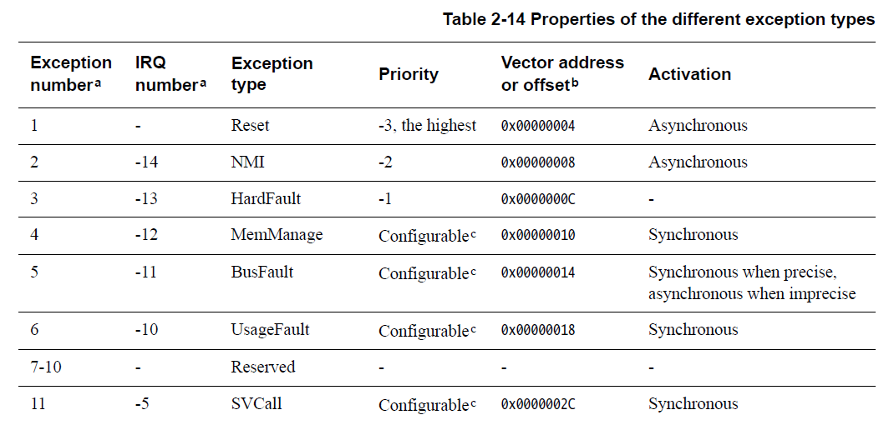
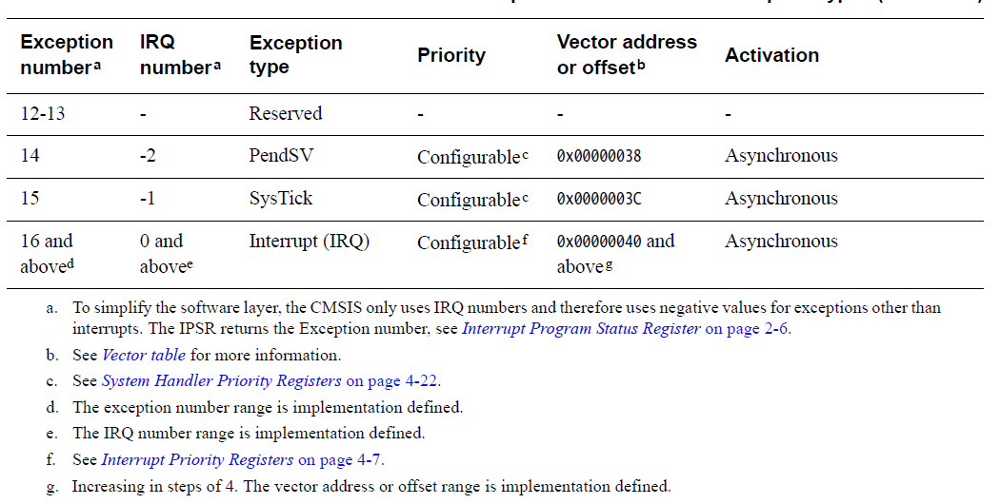
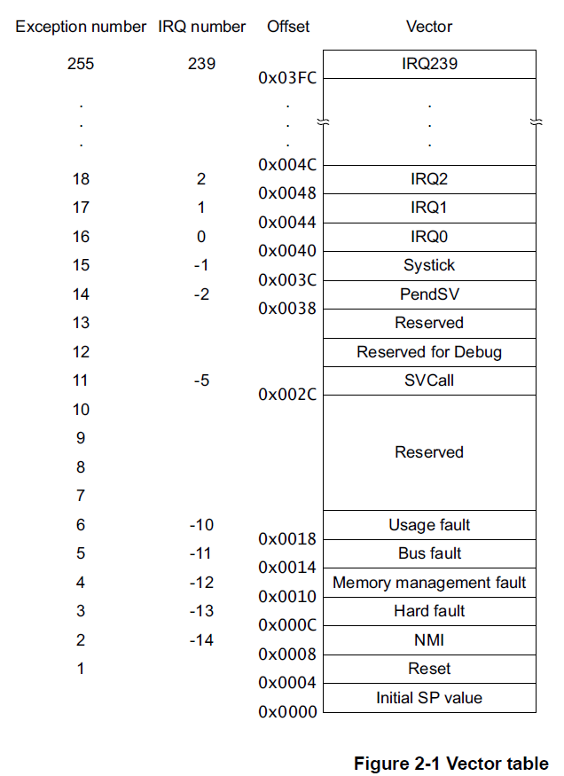
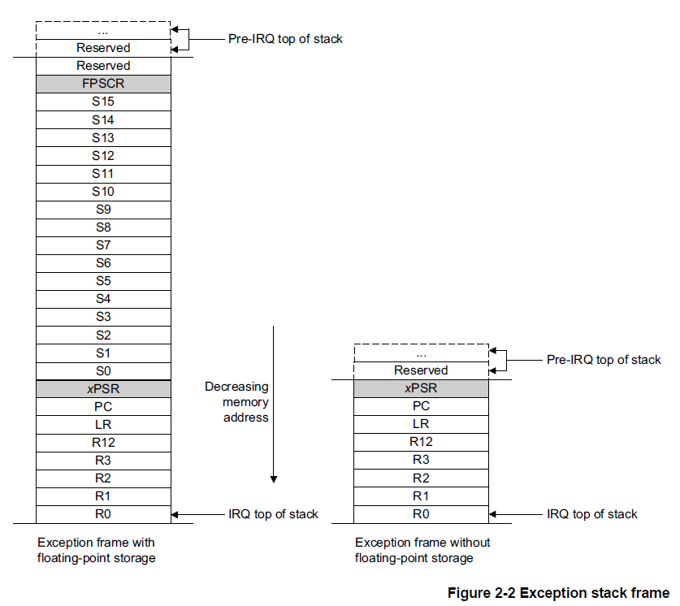
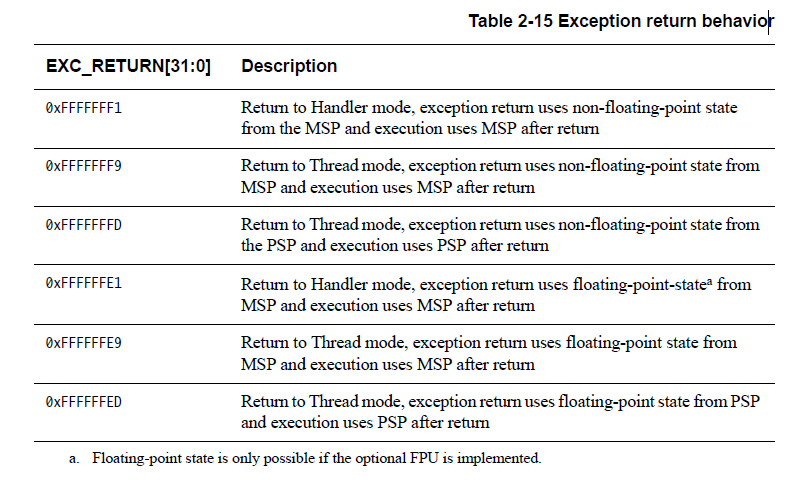

<section id="title">ARM 异常模型（Exception model）</section>

# 1. 异常状态（Exception states）

每个异常都处于以下状态之一：

* **Inactive**：异常未激活且未挂起。
* **Pending**：异常正在等待处理器处理。来自外设或软件的中断请求可以将相应中断的状态更改为挂起（**Pending**）。
* **Active**：处理器正在处理但尚未完成的异常。
* **Active and pending**：异常正在由处理器处理，并且存在来自同一源的挂起的异常。

**注意：**

异常处理程序可以中断另一个异常处理程序的执行。在这种情况下，两个异常都处于活动状态。

# 2. 异常类型（Exception types）

异常类型包括：

## 2.1. Reset

复位（**Reset**）会在上电或热复位时被调用。异常模型将复位视为一种特殊形式的异常。它永久启用并具有固定优先级 **-3**。当复位生效时，处理器的操作可能会在指令中的任何一点停止。当复位无效时，执行将从向量表中复位条目提供的地址重新开始。代码在线程模式下作为，特权模式被执行重新启动。

## 2.2. NMI

不可屏蔽中断由外设发出信号或由软件触发。这是除重置之外优先级最高的异常。它永久启用并具有固定优先级 **-2**。**NMI**不能：

* 被任何其他异常屏蔽或阻止激活。
* 被 **Reset** 以外的任何异常抢占。

## 2.3. HardFault

**HardFault** 是由于异常处理过程中发生的错误，或者因为异常无法由任何其他异常机制管理而发生的异常。**HardFault**的固定优先级为 **-1**，这意味着它们的优先级高于任何具有可配置优先级的异常。

## 2.4. MemManage

**MemManage** 故障是由于内存保护相关故障而发生的异常。对于指令和数据内存事务，固定内存保护约束或者 **MPU**（如果已实现）确定了此故障。此故障始终用于中止对永不执行 (XN) 内存区域的指令访问。

## 2.5. BusFault

**BusFault** 是由于指令或数据内存事务的内存相关故障而发生的异常。这可能是由于在内存系统中的总线上检测到的错误。

## 2.6. UsageFault

**UsageFault** 是由于与指令执行相关的故障而发生的异常。它包括了：

* 未定义的指令。
* 非法未对齐访问。
* 指令执行状态无效。
* 异常返回错误。

当以下内容核心配置为报告时，可能也会导致**UsageFault**：

* 字和半字内存访问中的未对齐地址。
* 被零除。

## 2.7. SVCall 

主管调用**SVC**（**supervisor call**）是由 **SVC** 指令触发的异常。在操作系统环境中，应用程序可以使用 **SVC** 指令访问操作系统内核功能和设备驱动程序。

## 2.8. PendSV 

**PendSV** 是一个中断驱动的系统级服务请求。在 **OS** 环境中，当没有其他异常处于活动状态时，使用 **PendSV** 进行上下文切换。

## 2.9. SysTick 

**SysTick** 异常是系统定时器在达到零时产生的异常。软件也可以生成 **SysTick** 异常。在 **OS** 环境中，处理器可以将此异常用作系统节拍。

## 2.10. Interrupt (IRQ) 

中断或 **IRQ** 是由外设发出信号或由软件请求生成的异常。所有中断都与指令是异步执行的。在系统中，外围设备使用中断与处理器进行通信。

对于异步执行的异常，除了复位之外，处理器可以在触发异常和处理器进入异常处理程序之间执行另一条指令。

特权软件可以禁用第 **2-20** 页的 **Table 2-14** 显示为具有可配置优先级的异常，请参阅：

* 系统处理程序控制和状态寄存器（第 4-24 页）。
* 第 4-5 页的中断清除启用寄存器。

有关 **HardFaults**、**MemManage** 故障、**BusFaults** 和 **UsageFaults** 的更多信息，请参阅第 **2-27** 页的故障处理。

# 3. 异常处理程序

处理器使用以下方法处理异常：

## 中断服务例程 (ISR)

中断 **IRQ0** 到 **IRQ239** 是 **ISR** 可以处理的最大异常范围。可用异常的实际数量是由具体实现定义的。

## Fault handler

**HardFault**、**MemManage** 故障、**UsageFault**、**BusFault** 是由 **fault handler** 处理的故障异常。

## System handler

**NMI**、**PendSV**、**SVCall**、**SysTick**、**fault exceptions** 都是系统异常，通过 **system handler** 处理。

# 4. 向量表

向量表包含堆栈指针的复位值，以及所有异常处理程序的起始地址，所以也称为异常向量。第 **2-22** 页的图 **2-1** 显示了异常向量在向量表中的顺序。每个向量的最低有效位必须为 **1**，表示异常处理程序是 **Thumb** 代码，请参阅第 **2-7** 页的 **Thumb** 状态。

图 **2-1** 显示了异常编号、**IRQ** 编号、偏移量和向量的最大取值范围。可用值的实际范围是实现定义的。

系统复位时，向量表位于实现时配置的地址，通常为 **0x00000000**。特权软件可以写入 **VTOR** 以将向量表起始地址重新定位到不同的内存位置，范围为 0x00000000-0xFFFFFF80。 芯片供应商必须配置上限值，这取决于实施的中断数量。 最小对齐为 32 个字，足够最多 16 个中断。 对于更多中断，通过四舍五入到下一个二的幂来调整对齐。 例如，如果您需要 21 个中断，则对齐必须在 64 字边界上，因为所需的表大小为 37 个字，下一个 2 的幂为 64，请参阅第 4-17 页的向量表偏移寄存器。

ARM 建议您将向量表放在系统内存映射的代码、SRAM、外部 RAM 或外部设备区域中，请参阅第 2-12 页的内存模型。 使用外设、专用外设总线或供应商特定的内存区域可能会导致某些系统出现不可预测的行为。 这是因为处理器在这些内存区域中对加载/存储指令和向量提取使用不同的接口。 如果向量表位于可缓存的内存区域，则必须将对向量的任何加载或存储视为自修改代码，并使用缓存维护指令来同步对数据和指令缓存的更新，请参阅缓存维护设计 第 4-65 页的提示和技巧。

# 5. 异常优先级

如第 2-20 页的表 2-14 所示，所有异常都有一个关联的优先级，其中：

* 较低的优先级值表示较高的优先级。
* 除Reset、HardFault 和NMI 之外的所有异常的可配置优先级。

如果软件未配置任何优先级，则所有具有可配置优先级的异常的优先级均为 0。有关配置异常优先级的信息，请参阅：

* 系统处理程序优先级寄存器（第 4-22 页）。
* 第 4-7 页的中断优先级寄存器。

**注意：**

可配置优先级值的最大范围是 0-255。 可用优先级值的实际范围是实现定义的。 这意味着具有固定负优先级值的 Reset、HardFault 和 NMI 异常的优先级始终高于任何其他异常。

例如，为 IRQ[0] 分配较高的优先级值，为 IRQ[1] 分配较低的优先级值意味着 IRQ[1] 的优先级高于 IRQ[0]。 如果 IRQ[1] 和 IRQ[0] 都有效，则 IRQ[1] 在 IRQ[0] 之前处理。

如果多个未决异常具有相同的优先级，则异常编号最小的未决异常优先。 例如，如果 IRQ[0] 和 IRQ[1] 都处于挂起状态并且具有相同的优先级，则 IRQ[0] 在 IRQ[1] 之前被处理。

当处理器正在执行异常处理程序时，如果发生更高优先级的异常，它会抢占异常处理程序。 如果发生与正在处理的异常具有相同优先级的异常，则处理程序不会被抢占，无论异常编号如何。 但是，新中断的状态变为挂起。

# 6. 中断优先级分组

为了在具有中断的系统中增加优先级控制，NVIC 支持优先级分组。

这将每个中断优先级寄存器条目分为两个字段：

* 定义组优先级的上部字段。
* 定义组内子优先级的较低字段。

只有组优先级决定中断异常的抢占。 当处理器正在执行中断异常处理程序时，另一个与正在处理的中断具有相同组优先级的中断不会抢占处理程序，

如果多个未决中断具有相同的组优先级，则子优先级字段决定它们的处理顺序。 如果多个挂起的中断具有相同的组优先级和子优先级，则首先处理具有最低 IRQ 号的中断。

有关将中断优先级字段拆分为组优先级和子优先级的信息，请参阅第 4-17 页的应用程序中断和复位控制寄存器。

# 7. 异常进入和返回

## 7.1. 异常处理描述术语

### 7.1.1. 抢占（Preemption）

当处理器正在执行异常处理程序时，如果异常的优先级高于正在处理的异常的优先级，则异常可以抢占异常处理程序。 有关中断抢占的更多信息，请参阅中断优先级分组。

当一个异常抢占另一个异常时，这些异常称为嵌套异常。 有关更多信息，请参阅异常条目。

### 7.1.2. 返回（Return）

这发生在异常处理程序完成时，并且：

* 没有具有足够优先级的未决异常需要被处理。
* 已完成的异常处理程序未处理迟到的异常。

处理器弹出堆栈并将处理器状态恢复到中断发生之前的状态。 有关详细信息，请参阅第 2-26 页的异常返回。

### 7.1.3. 尾链（Tail-chaining）

这种机制加速了异常服务。在异常处理程序完成时，如果有满足异常进入要求的未决异常，则跳过堆栈弹出并将控制转移到新的异常处理程序。

### 7.1.4. 迟到（Late-arriving）

这种机制加速了抢占。 如果在为先前异常保存状态期间发生更高优先级的异常，则处理器切换到处理更高优先级的异常并启动该异常的向量提取。 迟到不影响状态保存，因为保存的状态对于两种异常都是相同的。 因此状态保存继续不间断。 处理器可以接受迟到的异常，直到原始异常的异常处理程序的第一条指令进入处理器的执行阶段。 从迟到异常的异常处理程序返回时，将应用正常的尾链规则。

## 7.2. 异常入口

当存在具有足够优先级的未决异常并且：

* 处理器处于线程模式。
* 新的异常比正在处理的异常具有更高的优先级，在这种情况下新的异常会抢占原来的异常。
  
当一个异常抢占另一个异常时，异常是嵌套的。

足够的优先级意味着异常的优先级高于掩码寄存器设置的任何限制，请参阅第 2-7 页的异常掩码寄存器。 优先级低于此的异常处于挂起状态，但未由处理器处理。

当处理器发生异常时，除非异常是尾链异常或迟到异常，否则处理器会将信息压入当前堆栈。 此操作称为堆栈，八个数据字的结构称为堆栈帧。

使用浮点例程时，Cortex-M7 处理器会在异常进入时自动堆栈架构浮点状态。 第 2-25 页的图 2-2 显示了浮点状态因中断或异常而保留在堆栈中时的 Cortex-M7 处理器堆栈帧布局。

**注意：**

在未分配浮点状态堆栈空间的情况下，堆栈帧与没有 FPU 的 ARMv7-M 实现相同。 第 2-25 页的图 2-2 也显示了这个堆栈帧。

堆栈之后，堆栈指针立即指示堆栈帧中的最低地址。 使用配置控制寄存器 (CCR) 的 STKALIGN 位控制堆栈帧的对齐。

**注意：**

在 Cortex-M7 处理器中，CCR.STKALIGN 是只读的，值为 1。这意味着异常堆栈帧起始地址始终是 8 字节对齐的。

堆栈帧包括返回地址。 这是被中断程序中下一条指令的地址。 该值在异常返回时被恢复到 PC，以便中断的程序继续执行。

与堆栈操作并行，处理器执行向量提取，从向量表中读取异常处理程序起始地址。 堆栈完成后，处理器开始执行异常处理程序。 同时，处理器将 EXC_RETURN 值写入 LR。 这表明哪个堆栈指针对应于堆栈帧以及处理器在条目发生之前处于什么操作模式。

如果在异常进入期间没有发生更高优先级的异常，处理器开始执行异常处理程序并自动将相应挂起中断的状态更改为活动状态。

如果在异常进入期间发生另一个更高优先级的异常，处理器开始执行该异常的异常处理程序，并且不改变先前异常的挂起状态。 这是迟到的情况。

## 7.3. 异常返回

当处理器处于 Handler 模式并执行以下指令之一将 EXC_RETURN 值加载到 PC 时，会发生异常返回：

* 加载 PC 的 LDM 或 POP 指令。
* 以 PC 为目标的 LDR 指令。
* 使用任何寄存器的 BX 指令。
  
EXC_RETURN 是在异常进入时加载到 LR 的值。 异常机制依赖于此值来检测处理器何时完成异常处理程序。 该值的最低五位提供有关返回堆栈和处理器模式的信息。 表 2-15 显示了 EXC_RETURN 值以及异常返回行为的描述。

所有 EXC_RETURN 值都将位 [31:5] 设置为 1。 当这个值被加载到 PC 中时，它向处理器表明异常已完成，并且处理器启动适当的异常返回序列。

# 8. 参考文献

1. [ARM Cortex-M7 Devices Generic User Guide - DUI0646B_cortex_m7_dgug.pdf](https://developer.arm.com/documentation/dui0646/b/DUI0646B_cortex_m7_dgug.pdf)