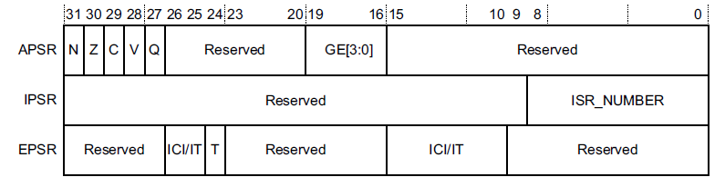
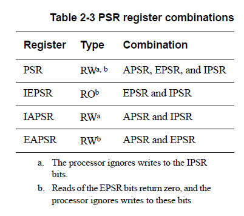
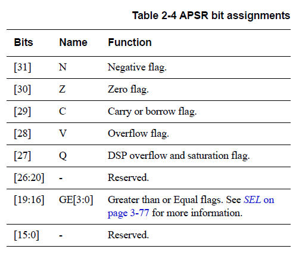
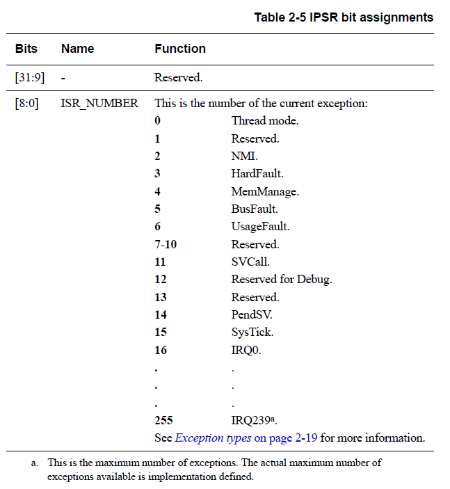
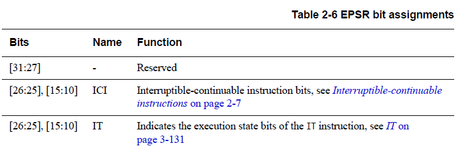
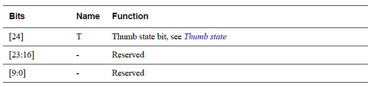

<section id="title">Cortex-M7 程序状态寄存器</section>

# 1. 概述

程序状态寄存器**PSR**（**Program Status Register**）包含了：

* 应用程序状态寄存器（**Application Program Status Register, APSR**）。
* 中断程序状态寄存器（**Interrupt Program Status Register, IPSR**）。
* 执行程序状态寄存器（**Execution Program Status Register, EPSR**）。

这些寄存器是 **32** 位 **PSR** 中互斥的位域。位分配是：

通过使用寄存器名称作为 **MSR** 或 **MRS** 指令的参数，可以单独访问这些寄存器，也可以访问任意两个或所有三个寄存器的组合。

例如：

* 通过 **PSR** 参数使用 **MRS** 指令可读取所有寄存器。
* 通过 **APSR_nzcvq** 参数使用 **MSR** 指令写入 **APSR**寄存器的 **N**、**Z**、**C**、**V** 和 **Q** 位。

**PSR** 组合和属性是：

有关如何访问程序状态寄存器的更多信息，请参阅第 3-178 页的 **MRS** 和第 3-179 页的 **MSR** 指令说明。

## 1.1. 应用程序状态寄存器 APSR

应用程序状态寄存器 **APSR** 包含来自先前指令执行的条件标志的当前状态。

有关其属性，请参见第 2-3 页表 2-2 中的寄存器摘要。位分配是：

## 1.2. 中断程序状态寄存器 IPSR

中断程序状态寄存器 **IPSR** 包含当前中断服务程序 (ISR) 的异常类型编号。

有关其属性，请参见第 2-3 页表 2-2 中的寄存器摘要。位分配是：

## 1.3. 执行程序状态寄存器 **EPSR**

**EPSR** 包含 **Thumb** 状态位和执行状态位：

* If-Then (IT) 指令。
* **Interruptible-Continuable Instruction** (ICI) 字段用于中断加载多个或存储多个指令。

有关 **EPSR** 属性，请参见第 2-3 页表 2-2 中的寄存器摘要。位分配是：

尝试使用 **MSR** 指令通过应用软件直接读取 **EPSR** 总是返回零。在应用软件中使用 **MSR** 指令写入 **EPSR** 的尝试将被忽略。

### 1.3.1. 可中断-可继续指令 Interruptible-continuable instructions

当在执行 **LDM**、**STM**、**PUSH** 或 **POP** 指令期间发生中断时，以及当 **FPU** 执行 **VLDM**、**VSTM**、**VPUSH** 或 **VPOP** 指令时，处理器：

* 暂时停止加载多个或存储多个指令操作。
* 将乘法运算中的下一个寄存器操作数存储到 **EPSR** 位[15:12]。

处理中断后，处理器：

* 返回位[15:12] 指向的寄存器。
* 恢复执行多重加载或存储指令。

当 **EPSR** 保持 **ICI** 执行状态时，位 [26:25,11:10] 为零。

### If-Then 块

**If-Then** 块在 **IT** 指令之后最多包含四个指令。块中的每条指令都是有条件的。指令的条件要么全部相同，要么某些条件与其他条件相反。有关详细信息，请参阅第 3-131 页的 **IT**。

Thumb 状态 **Cortex-M7** 处理器只支持在 **Thumb** 状态下执行指令。以下可以将 **T** 位清零：

* 指令 **BLX**、**BX**、**LDR pc**、[] 和 **POP{PC}**。
* 在异常返回时从堆叠的 **xPSR** 值中恢复。
* 异常进入或复位时矢量值的位[0]。

