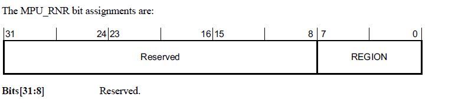

<section id="title">ARM Cortex MPU 内存保护单元</section>

# 1. 受保护的内存系统架构PMSAv7

支持非特权和特权软件执行模型需要控制访问权限的内存保护方案。**Armv7-M**支持受保护的内存系统架构**PMSAv7**（**Protected Memory System Architecture**）。**PMSAv7**实现的系统地址空间由内存保护单元 (**MPU**) 保护。**MPU** 将内存划分为多个区域（**regions**）。支持区域的数量是根据实现定义的（**IMPLEMENTATION DEFINED**）。**PMSAv7** 可以支持小至**32**字节的区域，但是**4GB**地址空间中的只有有限寄存器资源，也就意味着**MPU**只能提供固有的粗粒度保护方案。该方案是完全可预测的，所有控制信息都保存在与处理器紧密耦合的寄存器中。只有 **MPU** 寄存器接口的软件控制才需要内存访问，请参阅第 B3-635 页的 [在SCS中PMSAv7的寄存器支持](#5-在scs中对pmsav7的寄存器支持)

同时 **Armv7-M** 中的 **MPU** 支持是可选的。

# 2. MPU 与系统内存映射的关系

实现时，**MPU** 与第B3-592页的系统地址映射中描述的系统内存映射的关系如下：

* **MPU** 支持提供对物理地址访问权限的控制。它不执行地址转换。
* 当 **MPU** 被禁用或不存在时，系统采用**表B3-1**中列出的默认系统内存映射。启用 **MPU** 时，启用的区域定义系统地址映射，但附带条件如下：
  * 对专用外围总线 (**PPB**) 的访问，始终使用默认系统地址映射。
  * 从向量地址表中读取的异常向量总是使用默认的系统地址映射。
  * **MPU** 在如何更改与系统空间关联的默认内存映射属性方面受到限制，即地址**0xE0000000**和更高的地址。系统空间始终标记为**XN**，从不执行。
  * 当执行优先级小于0时，**MPU_CTRL.HFNMIENA**判断内存访问是使用**MPU**还是默认内存映射属性。如果处理器正在执行 **NMI** 或 **HardFault** 处理程序，或者 **FAULTMASK** 设置为 1，则执行优先级小于0。
  * 默认系统内存映射可以配置为提供特权访问的背景区域。
  * 在多个区域中地址匹配的访问使用最高匹配区域编号作为访问属性。
  * 不匹配区域地址匹配（启用MPU）或背景/默认内存映射匹配的所有访问条件的访问会生成故障。


# 3. 禁用 MPU 时的行为

通过将 **MPU_CTRL.ENABLE** 位设置为 **0** 来禁用 **MPU**，意味着特权和非特权访问使用默认的内存映射。

当 **MPU**被禁用时：

* 指令访问使用[表B3-1](#211-表b3-1-armv7-m-地址映射)中显示的默认内存映射和属性。访问 **execute-never** 属性访问内存区域会生成 **MemManage** 故障，请参阅第 B3-642 页的 **Execute Never** 编码。无其他权限检查会被执行。缓存的额外控制是通过以下方式进行的：
  - 如果实现了单独的指令和数据缓存，则为 **CCR.IC** 位。
  - 如果实现了统一缓存，则为 **CCR.DC** 位。
* 数据访问使用[表B3-1](#211-表b3-1-armv7-m-地址映射)中显示的默认内存映射和属性。不执行内存访问权限检查，也不会产生中止。
* 程序流预测功能正常，由 **CCR.BP** 位的值控制。
* 推测性指令和数据获取操作正常工作，基于默认内存映射：
  - 如果禁用数据缓存，推测性数据读取操作无效。
  - 如果指令高速缓存被禁用，推测性指令获取操作无效。

# 4. 符合 PMSAv7 的 MPU 操作

**Armv7-M** 仅支持关于 **MPU** 区域支持的统一内存模型（**a unified memory model**）。所有启用的区域（**regions**）都支持指令和数据访问。

区域的基址、大小和属性都是可配置的，一般规则是所有区域自然对齐。这可以表述为：

```
RegionBaseAddress[(N-1):0] = 0，其中 N 为 log2(SizeofRegion_in_bytes)
```

内存区域的大小可以变化为 2 的幂。支持的大小为 2<sup>N</sup>，其中 5 ≤ N ≤ 32。如果两个区域之间存在重叠，则具有最高区域编号的寄存器优先。

## 4.1. 分区域支持

对于**256**字节或更大的区域，该区域可以划分为8个大小为2<sup>(N-3)</sup>的子区域（**sub-regions**）。相对于相关的区域属性寄存器，区域内的子区域可以单独禁用（8个禁用位）。当子区域被禁用时，需要来自另一个区域的访问匹配，或者如果启用则需要背景匹配。如果未发生访问匹配，则会生成故障。小于**256**字节的区域大小不支持子区域，对于小于**256**字节的区域，将**MPU_RASR.SRD**设置为非零是不可预测的。

## 4.2. Armv7-M 特定支持

**Armv7-M** 支持 **Armv7-R** 架构配置文件的标准 **PMSAv7**，具有以下扩展：

1. 优化的两个寄存器更新模型，软件可以通过写入 **MPU** 区域基地址寄存器来选择要更新的区域。此优化仅适用于前**16**个内存区域 (0 ≤ RegionNumber ≤ 0xF)。
2. **MPU** 区域基地址寄存器和 **MPU** 区域属性和大小寄存器对在三个连续的双字位置中具有别名。使用两个寄存器更新模型，软件可以通过使用单个 **STM** 多字存储指令写入适当的偶数字来修改多达四个区域。

## 4.3. MPU 伪代码

以下伪代码定义了 Armv7-M MPU 的操作。使用的术语与第 B3-635 页 SCS 中 PMSAv7 的寄存器支持中描述的 MPU 寄存器名称和位字段名称一致。

```C++
// ValidateAddress()
// =================
AddressDescriptor ValidateAddress(bits(32) address, AccType acctype, boolean iswrite)
    ispriv = acctype != AccType_UNPRIV && FindPriv();
    
    AddressDescriptor result;
    Permissions perms;
    
    result.physicaladdress = address;
    result.memattrs = DefaultMemoryAttributes(address);
    perms = DefaultPermissions(address);

    hit = FALSE; // assume no valid MPU region and not using default memory map
    
    isPPBaccess = (address<31:20> == ‘111000000000’);

    if acctype == AccType_VECTABLE || isPPBaccess then
        hit = TRUE; // use default map for PPB and vector table lookups
    else if MPU_CTRL.ENABLE == ‘0’ then
        if MPU_CTRL.HFNMIENA == ‘1’ then 
            UNPREDICTABLE;
        else 
            hit = TRUE; // always use default map if MPU disabled
    else if MPU_CTRL.HFNMIENA == ‘0’ && ExecutionPriority() < 0 then
        hit = TRUE; // optionally use default for HardFault, NMI and FAULTMASK
    else // MPU is enabled so check each individual region
        if (MPU_CTRL.PRIVDEFENA == ‘1’) && ispriv then
            hit = TRUE; // optional default as background for Privileged accesses

        for r = 0 to (UInt(MPU_TYPE.DREGION) - 1) // highest matching region wins
            bits(16) size_enable = MPU_RASR[r]<15:0>;
            bits(32) base_address = MPU_RBAR[r];
            bits(16) access_control = MPU_RASR[r]<31:16>;
            
            if size_enable<0> == ‘1’ then // MPU region enabled so perform checks
                lsbit = UInt(size_enable<5:1>) + 1;
                
                if lsbit < 5 then UNPREDICTABLE;
                
                if (lsbit < 8) && (!IsZero(size_enable<15:8>)) then UNPREDICTABLE;
                
                if lsbit == 32 || address<31:lsbit> == base_address<31:lsbit> then
                    subregion = UInt(address<lsbit-1:lsbit-3>);
                    if size_enable<subregion+8> == ‘0’ then
                        texcb = access_control<5:3,1:0>;
                        S = access_control<2>;
                        perms.ap = access_control<10:8>;
                        perms.xn = access_control<12>;
                        result.memattrs = DefaultTEXDecode(texcb,S);
                        hit = TRUE;

    if address<31:29> == ‘111’ then // enforce System space execute never
        perms.xn = ‘1’;

    if hit then // perform check of acquired access permissions
        CheckPermission(perms, address, acctype, iswrite);
    else // generate fault if no MPU match or use of default not enabled
        if acctype == AccType_IFETCH then
            MMFSR.IACCVIOL = ‘1’;
            MMFSR.MMARVALID = ‘0’;
        else
            MMFSR.DACCVIOL = ‘1’;
            MMAR = address;
            MMFSR.MMARVALID = ‘1’;
        ExceptionTaken(MemManage);

    return result;
```

```C++
// DefaultPermissions()
// ====================
Permissions DefaultPermissions(bits(32) address)
    
    Permissions perms;
    
    perms.ap = ‘011’;

    case address<31:29> of
        when ‘000’
            perms.xn = ‘0’;
        when ‘001’
            perms.xn = ‘0’;
        when ‘010’
            perms.xn = ‘1’;
        when ‘011’
            perms.xn = ‘0’;
        when ‘100’
            perms.xn = ‘0’;
        when ‘101’
            perms.xn = ‘1’;
        when ‘110’
            perms.xn = ‘1’;
        when ‘111’
            perms.xn = ‘1’;

    return perms;
```

第 B2-587 页上的访问权限检查定义了 CheckPermission() 函数。

## 4.4. MPU故障支持

指令或数据访问违规会导致生成 **MemManage** 异常。有关 **MemManage** 异常的更多详细信息，请参阅第B1-551页的故障行为。

# 5. 在SCS中对PMSAv7的寄存器支持

表**B3-11**总结了系统控制空间SCS（**System Control Space**）中内存保护单元 (**MPU**) 的寄存器支持。一般来说，除非另有说明，寄存器仅支持字访问，字节和半字访问是不可预测。所有 **MPU** 寄存器地址都映射为小端（**little endian**）。

**MPU** 寄存器需要特权存储器访问以进行读取和写入。任何非特权访问都会产生 **BusFault** 故障。

共有三个通用 **MPU** 寄存器（**General MPU registers**）：

* MPU类型寄存器（**MPU Type Register**），参见[MPU_TYPE](#51-mpu类型寄存器mpu_type)说明。该寄存器可用于确定是否存在**MPU**，以及支持的区域数。
* MPU控制寄存器（**MPU Control Register**），参见[MPU_CTRL](#52-mpu控制寄存器mpu_ctrl)说明。**MPU** 控制寄存器包含一个全局使能位，必须将其设置为 **1** 才能使能 MPU。
* MPU区域编号寄存器（**MPU Region Number Register**），参见第B3-638页的[MPU_RNR](#53-mpu区域号寄存器mpu_rnr) 。

MPU 区域编号寄存器会选择的相关区域寄存器：

* MPU区域基地址寄存器（**MPU Region Base Address Register**），参见第B3-639页的[MPU_RBAR](#54-mpu区域基地址寄存器mpu_rbar)。
* MPU区域属性和大小寄存器（**MPU Region Attribute and Size Register**），参见第B3-640页的[MPU_RASR](#55-mpu区域属性和大小寄存器mpu_rasr) ，控制了内存区域的区域大小、子区域访问、访问权限、内存类型和其他属性。
 
每组区域寄存器包括其自己的区域使能位。

如果 **Armv7-M** 实现不支持 **PMSAv7**，则只需要 **MPU** 类型寄存器。MPU控制寄存器为**RAZ/WI**，该区域其他所有寄存器为保留，**UNK/SBZP**。

所有MPU寄存器都是 **32** 位宽的。


**注意：**

复位后的 **MPU_RASR** 寄存器的值是未知的。在使用 **MPU_CTRL** 寄存器启用 **MPU** 之前，必须将所有 **MPU_RASR** 寄存器编程为启用或禁用。

# 6. MPU类型寄存器，MPU_TYPE

## 6.1. 功能介绍

**1. 目的**

**MPU**类型寄存器表示**MPU**支持多少个区域（**Region**）。软件可以使用它来确定处理器是否实现了**MPU**。

**2. 使用限制**

没有使用限制。

**3. 配置**

始终执行。

## 6.2. 字段说明


**1. Bits[31:24]**

保留。

**2. IREGION，bits[23:16]**

指令区域。RAZ。**Armv7-M**只支持统一的**MPU**。

**3. DREGION, bits[15:8]**

**MPU**支持的区域数。如果该字段读取为零，则处理器不实现**MPU**。

**4. Bits[7:1]**

保留。

**5. SEPARATE, bit[0]**

表示支持单独的指令和数据地址映射。RAZ。**Armv7-M**只支持统一的**MPU**。

# 7. MPU控制寄存器，MPU_CTRL

## 7.1. 功能介绍

**1. 目的**

启用 **MPU**。当 **MPU** 启用时，控制是否启用默认内存映射作为特权访问的背景区域，以及当 **FAULTMASK** 设置为 **1** 时是否启用 **MPU** 用于 **HardFaults**、**NMI** 和异常处理程序。

**2. 使用限制**

没有使用限制。

**3. 配置**

如果未实现 **MPU**，则该寄存器为 **RAZ/WI**。

## 7.2. 字段说明


**1. Bits[31:3]** 

保留。

**2. PRIVDEFENA, bit[2]**

当 **ENABLE** 位设置为 **1** 时，该位的含义是：

* **0**：禁用默认内存映射。任何不访问已定义区域的指令或数据访问都是错误的。
* **1**：启用默认内存映射作为特权访问的背景区域。背景区域作为**Region Number - 1**。在 **MPU** 中配置的所有内存区域都优先于默认内存映射。B3-592页上的系统地址映射描述了默认的内存映射。

当 **ENABLE** 位设置为 **0** 时，处理器忽略 **PRIVDEFENA** 位。

如果没有启用任何区域并且 **PRIVDEFENA** 和 **ENABLE** 位设置为 1，则只有特权代码可以从系统地址映射中执行。

**3. HFNMIENA, bit[1]** 

当 **ENABLE** 位设置为 **1** 时，控制以低于 **0** 的优先级执行的处理程序是在 **MPU** 启用还是 MPU 禁用时访问内存。 当 FAULTMASK 设置为 1 时，这适用于 HardFaults、NMI 和异常处理程序：

* **0**：为这些处理程序禁用 MPU。
* **1** 将 MPU 用于这些处理程序的内存访问。

如果在 **ENABLE** 设置为 **0** 时, **HFNMIENA** 设置为 **1**，则行为是不可预测的。

**4. ENABLE, bit[0]** 

启用 **MPU**：

* **0**：**MPU** 被禁用。
* **1**：**MPU** 已启用。

通过将 **ENABLE** 位设置为 **0** 来禁用 **MPU**，意味着特权和非特权访问使用默认的内存映射。

## 7.3. MPU_CTRL 设置对非特权指令的影响

Thumb 指令集包括了在特权软件执行时执行非特权内存访问的指令：

* 以下部分描述了执行非特权寄存器加载的指令：
   * A7-256 页上的 LDRBT。
   * A7-269 页上的 LDRHT。
   * A7-274 页上的 LDRSBT。
   * A7-280 页上的 LDRSHT。
   * A7-281 页上的 LDRT。
  
* 以下部分描述了执行非特权寄存器存储的指令：
   * A7-392 页上的 STRBT。
   * A7-400 页上的 STRHT。
   * A7-401 页的 STRT。

表 B3-12 显示了 **MPU_CTRL.HFNMIENA** 和 **MPU_CTRL.ENABLE** 位在由 HardFault 或 NMI 的异常处理程序发出时，或 FAULTMASK 设置为 1 时的另一个异常时如何影响这些指令的处理，并且当这对于 其他特权软件。


* **HardFault** 或 **NMI** 处理程序，或 **FAULTMASK** 设置为 1 时的其他异常处理程序。

表 B3-12 显示了 MPU 配置或默认内存映射是否决定了非特权加载或存储指令访问的地址的属性。指令访问的处理则取决于这些属性。如果属性不允许非特权访问，则内存系统会产生故障。如果访问来自 NMI 或 HardFault 处理程序，或者由于 FAULTMASK 设置为 1 而执行优先级为 -1，则此故障会导致锁定。

# 8. MPU区域号寄存器，MPU_RNR

## 8.1. 功能介绍

**1. 目的**

选择 **MPU_RBAR** 和 **MPU_RASR** 当前访问的区域。

**2. 使用限制**

与 **MPU_RBAR** 和 **MPU_RASR** 一起使用，请参见第B3-639页的[MPU区域基地址寄存器 MPU_RBAR](#258-mpu区域基地址寄存器mpu_rbar)和第B3-640页的[MPU区域属性和大小寄存器 MPU_RASR](#259-mpu区域属性和大小寄存器mpu_rasr)。如果实现支持**N**个区域，则区域编号从 **0** 到 **(N-1)**，将 **N** 或更大的值写入 **REGION** 字段的效果是不可预测的。
 
**3. 配置**

仅当处理器实现了**MPU**时，才被实现。

## 8.2. 字段说明



**1. Bits[31:8]** 

保留。

**2. REGION, bits[7:0]** 

表示 **MPU_RBAR** 和 **MPU_RASR** 访问的内存区域。

# 9. MPU区域基地址寄存器，MPU_RBAR

## 9.1. 功能介绍

**1. 目的：**

保存由 **MPU_RNR** 标识的区域的基地址。在写入时，也可用于更新指定区域的基地址，范围为 **0-5**，用新的区域编号更新 **MPU_RNR**。

**2. 使用限制：**

* 通常与 **MPU_RBAR** 一起使用，请参阅第B3-638页的[MPU区域编号寄存器，MPU_RNR](#257-mpu区域号寄存器mpu_rnr)。
* **MPU_RBAR**所需的最小区域对齐是由实现定义的（**IMPLEMENTATION DEFINED**）。有关允许的区域大小的更多信息，请参阅寄存器描述。
* 如果实现支持 **N** 个区域，则区域编号从 **0** 到 **(N-1)**。如果 **N** 小于 **16**，则将 **N** 或更大的值写入 **REGION** 字段的效果是不可预测的。

**3. 配置：**

仅当处理器实现了**MPU**时，才被实现。

## 9.2. 字段说明


**1. ADDR, bits[31:5]** 

区域的基地址。

**2. VALID, bit[4]** 

在写入时，指示要更新的区域是由 **MPU_RNR.REGION** 指定，还是由此写入中指定的 **REGION** 值指定。当使用由此写入指定的 **REGION** 值时，**MPU_RNR.REGION** 会更新为此值。

* **0**：将基地址更新应用到 **MPU_RNR.REGION** 指定的区域。**REGION** 字段值被忽略。
* **1**：将 **MPU_RNR.REGION** 更新为对本次写入指定的 **REGION** 值进行零扩展得到的值，并将基地址更新应用到该区域。
 
该位读取时为零。

**3. REGION, bits[3:0]** 

在写入时，可以指定要更新的区域编号，具体请参见 **VALID** 字段说明。
在读取时，返回 **MPU_RNR** 的位 [3:0]。

软件可以通过将所有 **1** 写入该区域的 MPU_RBAR[31:5] 来找到 **MPU** 区域支持的最小区域大小，然后读取寄存器中保存在位 [31:5] 的数值。此位字段中尾随零的数量表示支持的最小对齐方式，据此得到支持的区域大小。实现必须支持从最小支持到 **4GB** 的所有区域大小值，请参阅第B3-640页[MPU区域属性和大小寄存器 MPU_RASR](#55-mpu区域属性和大小寄存器mpu_rasr)中的 **MPU_RASR.SIZE** 字段的描述。

软件必须确保写入 **ADDR** 字段的值与所选区域的大小一致。

# 10. MPU区域属性和大小寄存器，MPU_RASR

## 10.1. 功能介绍

**1. 目的：**

定义由 **MPU_RNR** 标识的区域的大小和访问行为，并启用该区域。

**2. 使用限制：**

* 与 **MPU_RNR** 一起使用，请参阅第B3-638页的[MPU区域号寄存器、MPU_RNR](#257-mpu区域号寄存器mpu_rnr)。
* 写入小于相应 **MPU_RBAR** 支持的最小大小的 **SIZE** 值会产生不可预测的效果。

**3. 配置：**

仅当处理器实现了**MPU**时，才被实现。

## 10.2. 字段说明


**1. ATTRS, bits[31:16]**

MPU 区域属性字段，该字段具有以下子字段，在第B3-641页的区域属性控制中定义：

* XN： MPU_RASR[28]**.
* AP[2:0]：MPU_RASR[26:24].
* TEX[2:0]：MPU_RASR[21:19].
* S： MPU_RASR[18].
* C： MPU_RASR[17].
* B： MPU_RASR[16].

**2. SRD, bits[15:8]**

子区域禁用。对于**256**字节或更大的区域，该字段的每一位控制是否启用**8**个相等的子区域之一，请参阅内存区域子区域：

* **0**: 启用子区域。
* **1**: 禁用子区域。

**3. Bits[7:6]** 

保留。

**4. SIZE, bits[5:1]** 

表示区域大小。区域大小（以字节为单位）为 2<sup>(SIZE+1)</sup>。因为支持的最小区域大小为 **32** 字节，所以**SIZE** 字段值小于 **4** 被保留。

**5. ENABLE, bit[0]** 

启用此区域：

* **0**：启用 **MPU** 时，禁用此区域。
* **1**：启用 **MPU** 时，启用此区域。

**注意：**

除非 **MPU_CTRL.ENABLE** 位设置为 1，否则区域启用无效。

## 10.3. 内存区域子区域

对于任何 **256** 字节或更大的区域，**MPU** 将该区域划分为八个大小相等的子区域。将 **SRD** 字段中的某个位设置为 **1** 会禁用相应的子区域：

* 该字段的最低有效位 MPU_RASR[8] 控制具有最低地址范围的子区域。
* 该字段的最高有效位 MPU_RASR[15] 控制具有最高地址范围的子区域。

对于 **32**、**64** 和 **128** 字节的区域大小，将 **SRD** 字段的一位或多位设置为 **1** 的效果是不可预测的。

有关详细信息，请参阅第 B3-633 页的子区域支持。

## 10.4. 区域属性控制

**MPU_RASR.ATTRS** 字段定义内存类型，以及必需的内存区域的可缓存、可共享、访问以及特权的属性。寄存器图显示了该字段的子字段，其中：

1. **TEX[2:0]**、**C** 和 **B** 位一起表示区域的内存类型，有关这些位的编码，请参见表 **B3-13**。并且：
   * 对于普通内存，设置区域的可缓存属性。
   * 对于设备内存，设置区域是否可共享。
2. 对于普通内存区域，**S** 位表示该区域是否可共享，请参见表 **B3-13**。 对于强秩序内存和设备内存，需忽略 **S** 位。
3. **AP[2:0]** 位表示区域的访问和特权属性，请参见第B3-642页的表 **B3-15**。
4. XN 位是 Execute Never 位，指示处理器是否可以从该区域执行指令，请参阅第B3-642页的 [从不执行编码](#555-从不执行编码)。


AP 位 AP[2:0] 用于访问权限。 见表 B3-15


## 10.5. 从不执行编码

XN 位提供从不执行功能。为了让处理器执行一条指令，该指令必须位于以下内存区域中：

* 具有读取权限（**Read access**），由 **AP** 位指示，用于适当的特权级别。
* **XN** 位设置为 **0**。

否则，处理器在发出执行指令时会产生 **MemManage** 故障。表 **B3-16** 显示了 **XN** 位的编码。


# 11. MPU 别名寄存器支持

**MPU_RBAR** 和 **MPU_RASR** 在地址范围 **0xE000ED9C-0xE000EDA3** 中形成一对字。如第B3-635页上的表 **B3-11** 所示，**Armv7-M** 处理器在距 **MPU_RBAR** 地址 **0xE000ED9C** 的 **+8** 字节、**+16** 字节和 **+24** 字节的偏移处实现此地址范围的别名。将这些寄存器别名与 **MPU_RBAR.REGION** 字段一起使用，并将 **MPU_RBAR.VALID** 字段设置为 **1**，软件可以使用字的写入流，有效地更新最多可达四个区域，前提是所有访问的区域都在区域 **0** 到区域的范围内 **15**.