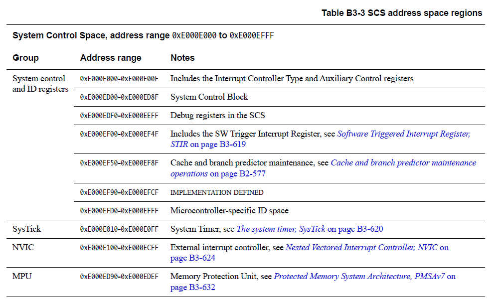

<section id="title">系统地址映射</section>

# 1. 系统地址映射

**Armv7-M** 支持预定义的**32**位地址空间，细分代码、数据和外设，以及片载（on-chip）和片外（**off-chip**）资源的区域，其中片载是指与处理器紧密耦合的资源。地址空间支持8个主分区，每个**0.5**GB：

* 代码（**Code**）。
* SRAM。
* 外围设备（**Peripheral**）。
* 两个RAM区域。
* 两个设备区域。
* 系统。

该体系结构分配物理地址以用作事件入口点（向量）、系统控制（**system control**）和配置。事件入口点（**event entry points**）都是相对于表基地址定义的，在复位时配置为实现定义（**IMPLEMENTATION DEFINED**）的值，然后维护在为系统配置和控制保留的地址空间中。为了满足这个和其他系统需求，地址空间**0xE0000000**到**0xFFFFFFFF**被保留供系统级使用。

表 **B3-1** 显示了 **Armv7-M** 默认地址映射，以及该映射中内存区域的属性。在[此表](#11-表b3-1-armv7-m-地址映射)以及[表B3-2](#12-表b3-2-armv7-m-地址映射的system区域细分)中。

* **XN**表示从非执行区域。任何从**XN**区域执行代码的尝试都会出错，从而生成**MemManage**的异常。
* 缓存列（**Cache column**）表示普通内存区域的缓存策略，用于内部和外部缓存，以支持系统缓存。声明的缓存类型可以降级但不能提升，如下所示：
  * WT   : 直写（**Write-Through**）。可以被视为非缓存（**non-cached**）。
  * WBWA : 回写（**Write-Back**）写分配（**write allocate**），可被视为直写（**Write-Through**）或者非缓存（**non-cached**）。
* 在设备栏（**Device column**）中：
  * Shareable: 表示该区域支持多个代理在一致的内存域中共享使用。这些代理可以是处理器和 DMA 代理的任意组合。
  * SO       ：表示强秩序内存。强秩序内存始终是可共享的。
* 指定地址空间的哪些部分由实现定义（**IMPLEMENTATION DEFINED**）：
  * 可读可写（**Read/Write**）。
  * 只读（**Read-only**）。例如：闪存空间。
  * 不可访问（**No-access**）。通常是地址映射中未填充的部分。
* 跨越0.5GB地址边界的未对齐或多字访问是不可预测的。

## 1.1. 表B3-1 Armv7-M 地址映射

| Address                 | Name       | Device type           | XN? | Cache | Description                                                                     |
| ----------------------- | ---------- | --------------------- | --- | ----- | ------------------------------------------------------------------------------- |
| 0x00000000 - 0x1FFFFFFF | Code       | Normal                | -   | WT    | Typically ROM or flash memory.                                                  |
| 0x20000000 - 0x3FFFFFFF | SRAM       | Normal                | -   | WBWA  | SRAM region typically used for on-chip RAM.                                     |
| 0x40000000 - 0x5FFFFFFF | Peripheral | Device                | XN  | -     | On-chip peripheral address space.                                               |
| 0x60000000 - 0x7FFFFFFF | RAM        | Normal                | -   | WBWA  | Memory with write-back, write allocate cache attribute for L2/L3 cache support. |
| 0x80000000 - 0x9FFFFFFF | RAM        | Normal                | -   | WT    | Memory with Write-Through cache attribute.                                      |
| 0xA0000000 - 0xBFFFFFFF | Device     | Device, shareable     | XN  | -     | Shared device space.                                                            |
| 0xC0000000 - 0xDFFFFFFF | Device     | Device, Non-shareable | XN  | -     | Non-shared device space.                                                        |
| 0xE0000000 - 0xFFFFFFFF | System     | See Description       | XN  | -     | System segment for the PPB and vendor system peripherals, see Table B3-2.       |

内存映射的系统区域，从 0xE0000000 开始，细分如下：

* 偏移+0x00000000 处的1MB 区域被保留为专用外设总线PPB（**Private Peripheral Bus**）。
* 从偏移+0x00100000 开始的区域是供应商系统区域（**Vendor_SYS**）。

[表B3-2](#212-表b3-2-armv7-m-地址映射的system区域细分)显示了该区域的细分。
  
在 **Vendor_SYS** 区域，Arm建议：

* 供应商资源从0xF0000000开始。
* 区域**0xE0100000-0xEFFFFFFF**被保留。

## 1.2. 表B3-2 Armv7-M 地址映射的System区域细分

| Address                 | Name       | Memory type      | XN? | Description                                                                                                          |
| ----------------------- | ---------- | ---------------- | --- | -------------------------------------------------------------------------------------------------------------------- |
| 0xE0000000 - 0xE00FFFFF | PPB        | Strongly-ordered | XN  | 1MB region reserved as the PPB. This supports key resources, including the System Control Space, and debug features. |
| 0xE0100000 - 0xFFFFFFFF | Vendor_SYS | Device           | XN  | Vendor system region, see the Arm recommendations in this section.                                                   |

支持识别非特权和特权访问的软件模型需要内存保护方案来控制访问权限。受保护的内存系统架构 (**PMSAv7**) 是提供此类方案的可选系统级功能，请参阅受保护的内存系统架构**PMSAv7**，**PMSAv7**的实现提供了内存保护单元 (**MPU**)。

**注：**

* **PMSAv7** 是 **Armv7-R** 实施的必需功能。有关 **Armv7-M** 和 **Armv7-R** 实施有何不同的信息，请参阅第 B3-633 页上的 **Armv7-M** 特定支持。
* 一些 **Arm** 文档将非特权访问描述为用户访问，将特权访问描述为主管访问。这些描述基于 **Armv7-A** 和 **Armv7-R** 架构配置文件的功能。

地址映射见[表B3-1](#211-表b3-1-armv7-m-地址映射):
* 是未实施 **PMSAv7** 的系统上唯一支持的地址映射。
* 是禁用**MPU**时内存系统的默认映射。
* 当启用**MPU**时，可用作特权访问的背景区域，请参见**MPU**控制寄存器中**PRIVDEFENA**的定义，第B3-637页的**MPU_CTRL**。

**注：**

启用的**MPU**无法更改系统内存区域的**XN**属性。

## 1.3. PPB 寄存器访问的一般规则

**PPB**的一般规则，地址范围从**0xE0000000**到**0xE0100000**：

* 该区域被定义为强秩序内存，请参阅[强秩序内存](#156-强秩序内存strongly-ordered-memory)和[内存访问限制](#157-内存访问限制)。
* 无论处理器的字节序状态如何，寄存器访问总是小端字节序（**little endian**）。
* 一般来说，除非另有说明，寄存器仅支持字访问，字节和半字访问不可预测。优先级和故障状态寄存器是影响不同资源的字节对齐位字段的串联。这样的寄存器可以作为字节或半字寄存器访问，具有适当的
与 32 位寄存器基地址的地址偏移量。

**注意：**

只有当本手册中的寄存器描述明确声明它支持这些访问时，一个寄存器才支持字节和半字访问。

* 当一个位被定义为在读取时被清除为0（**being cleared to 0 on a read**）。当读取该位与将该位设置为1的事件同时发生时，当前架构保证以下原子行为：
  * 如果该位读取为1，则读操作将该位清除为0。
  * 如果该位读取为0，则事件将该位设置为1。随后对该位的读取将返回1并将该位清除为 0。
* 保留的寄存器或位域必须被视为**UNK/SBZP**。

除非另有说明，否则对**PPB**的非特权访问会导致**BusFault**错误。值得注意的例外是：

* 通过对配置控制寄存器中的控制位进行编程，可以启用对系统控制空间中的软件触发中断寄存器的非特权访问。
* 有关调试相关资源，请参阅第 C1-686 页上的适用于调试寄存器访问的一般规则以了解异常详细信息。

# 2. 系统控制空间 (SCS)

系统控制空间SCS（**System Control Space**）是一个内存映射的 **4KB** 地址空间，为配置、状态报告和控制提供32位寄存器。**SCS** 寄存器分为以下几组：

* 系统控制和识别。
* CPUID 处理器标识空间。
* 系统配置和状态。
* 故障报告。
* 系统定时器SysTick。
* 嵌套向量中断控制器(NVIC)。
* 受保护的内存系统架构 (PMSA)。
* 系统调试。

以下章节总结了系统控制和ID 寄存器：

* [关于系统控制块](#221-关于系统控制块)。
* 系统控制和ID寄存器。
* 调试系统寄存器。
  
以下部分总结了其他寄存器组：

* 系统计时器 **SysTick**
* 嵌套向量中断控制器 **NVIC**
* 在 **SCS** 中注册对 PMSAv7 的支持。

## 2.1. 关于系统控制块

在 **Armv7-M** 处理器中，**SCS** 中的系统控制块 (**SCB**) 为处理器提供关键状态信息和控制功能。**SCB** 支持：

* 不同级别的软件复位控制。
* 异常模型的基地址管理，通过控制表指针。
* 系统异常管理，包括：
    - 例外启用。
    - 显示每个异常状态的状态，非活动、未决或活动。
    - 将异常状态设置为待处理，或从异常中移除待处理状态。
    - 设置可配置系统异常的优先级。
    - 提供各种控制功能和状态信息。 
  这不包括外部中断处理。 NVIC 处理所有外部中断。
* 优先分组控制，请参见第 B1-527 页的优先分组。
* 当前执行代码的异常编号，以及最高优先级的未决异常。
* 其他控制和状态功能，包括协处理器访问支持。
* 电源管理，通过睡眠支持。
* 故障状态信息，请参阅第 B1-551 页的故障行为。
* 调试状态信息。调试特定寄存器区域中的控制和状态对此进行了补充，请参阅第 C1 章 **Armv7-M** 调试。

# 3. 系统定时器SysTick

# 4. 嵌套向量中断控制器NVIC

