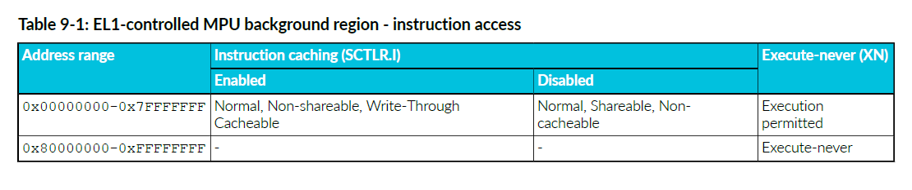
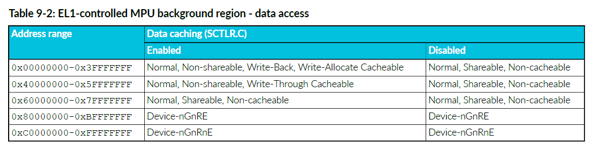
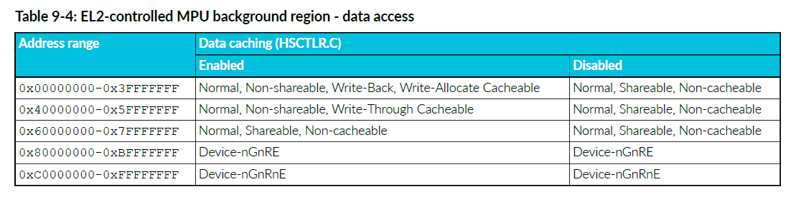
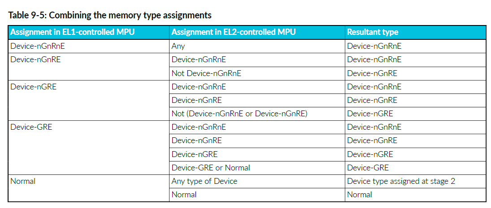
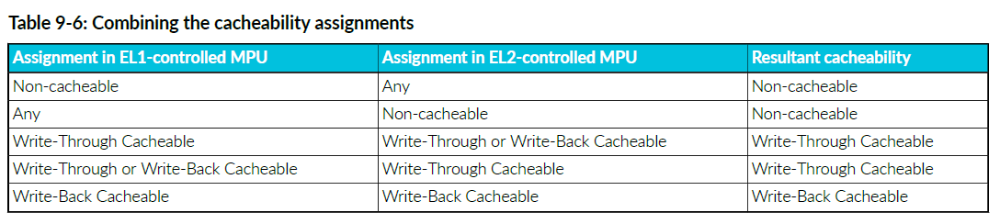
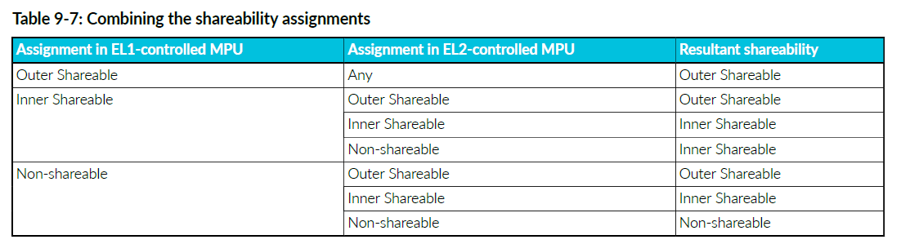
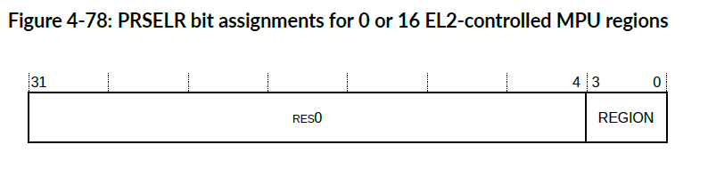
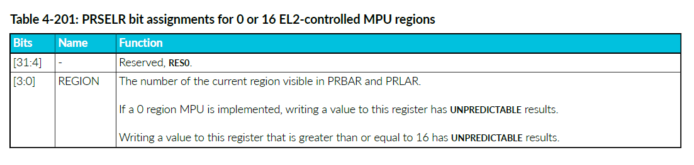
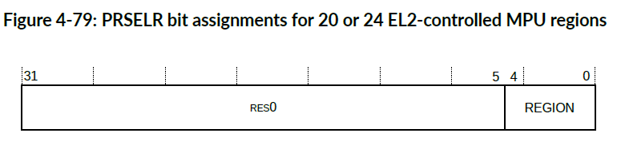
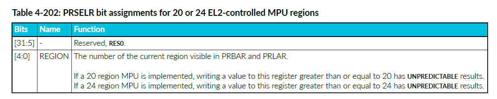

<section id="title">内存保护单元（Memory Protection Unit）</section>

本章介绍 **MPU**。

# 1. 关于 MPU

**Cortex®-R52+** 处理器具有两个可编程 **MPU**，由 **EL1** 和 **EL2** 控制。每个 **MPU** 允许将 **4GB** 内存地址范围细分为多个区域。

每个内存区域定义了基地址（**base address**）、限制地址（**limit address**）、访问权限（**access permissions**）和内存属性（**memory attributes**）。

有关 MPU 的更多信息，请参阅 Arm® 架构Armv8补充参考手册 （**Arm® Architecture Reference Manual Supplement Armv8**），了解更多 **Armv8-R AArch32** 架构配置文件。

对于数据访问，MPU 检查当前转换机制是否允许对某个区域进行访问（读取或写入）。对于指令访问，MPU 检查该区域是否允许访问，以及转换机制是否允许执行。对于数据和指令访问，如果允许访问，MPU 将分配为该区域定义的内存属性。如果不允许访问，则发生权限错误。发生转换错误的原因如下：

• 如果访问命中其中一个 **MPU** 中的多个区域。
• 如果访问未命中任何 **MPU** 区域，并且无法使用后台区域（基于 **MPU** 配置和当前特权级别—）。

由于流水线操作，处理器会尝试预测程序流和未来的数据访问，因此它会在使用数据和指令之前获取它们。除非或直到流水线完成相应指令的执行，否则这些事务被称为推测事务。这可能会导致处理器生成允许区域之外的地址，或者没有权限尝试访问。在这些情况下，**MPU** 会阻止推测访问生成总线事务，但不会引起转换或权限错误。

每个处理器核心都有一个 **EL1** 控制的 **MPU**，具有 16、20 或 24 个可编程区域，以及一个 **EL2** 控制的 **MPU**，后者可选地支持 0、16、20 或 24 个可编程区域。当 **EL2** 控制的 **MPU** 和虚拟化被使能时，所有使用 **EL0/EL1** 转换机制的事务都会在两个 **MPU** 中执行查找。将生成的属性组合起来，以便最少权限的属性被采用。这两个阶段的保护允许虚拟机管理程序保留对 **EL0/EL1** 转换机制的控制，从而实现对虚拟化的支持。当软件执行使用 **EL2** 转换机制时，仅 **EL2** 控制的 **MPU**被使用。

#  2. 2.MPU 区域

区域是从基地址（**base address**）开始延伸到限制地址（**limit address**）（包括：限制地址）的连续地址范围。

基地址由 **PRBAR** （**EL2** 控制的 **MPU** 的 **HPBAR**）配置，限制地址由 **PRLAR**（**EL2** 控制的 **MPU** 的 配置）配置。基地址与 **64** 字节边界对齐，限制地址与 **64** 字节边界以下的字节对齐。基地址和限制地址都包括在内，这意味着区域内的地址由以下公式给出：

PRBAR.BASE:0b000000 <= address <= PRLAR.LIMIT:0b111111

其中冒号（**：**）是位连接运算符。

区域的最小为 **64**个字节。

**PRBAR** 和 **PRLAR** 还包含：

| Name           |                                        |
| -------------- | -------------------------------------- |
| PRBAR.AP       | 访问权限（access permissions）         |
| PRBAR.SH       | 可共享性（shareability）               |
| PRBAR.XN       | 从不执行位（Execute-never bit）        |
| PRLAR.AttrIndx | 内存属性索引（memory attribute index） |

通过使用 **PRLAR.AttrIndx** 索引内存属性间接寄存器 (**MAIRx**) 来确定内存属性。

通过设置或清除区域启用位 (**PRLAR.EN**) 来启用或禁用区域。在 **EL2** 控制的 **MPU** 中，还可以通过写入 **Hypervisor** MPU 区域启用寄存器 (**HPRENR**) 来启用或禁用区域。

## 2.1. EL1 控制的 MPU 背景区域

当 MPU 被禁用（SCTLR.M=0）时，EL1 控制的 MPU 背景区域用作默认内存映射。

当 MPU 启用时，可以通过设置 SCTLR.BR 来启用背景区域。在这种情况下，来自 EL1 转换机制的访问如果未触及任何可编程区域，则将使用背景区域。当 MPU 启用时，来自 EL0 转换机制的访问将出现故障。

**EL1 控制的 MPU 后台区域，指令访问**

下表显示了 EL1 控制的 MPU 后台区域的指令访问。



**EL1 控制的 MPU 后台区域，数据访问**

下表显示了 EL1 控制的 MPU 后台区域的数据访问。



## 2.2. EL2 控制的 MPU 背景区域

当 EL2 控制的 MPU 被禁用（HSCTLR.M=0）时，EL2 控制的背景区域用作所有访问的默认内存映射。

当 EL2 控制的 MPU 启用时，通过设置背景区域启用（HSCTLR.BR=1），它还可用于未命中任何可编程区域的 EL2 访问。当 EL2 控制的 MPU 启用时，来自 EL0/EL1 转换机制的访问如果未命中 EL2 可编程区域，则会产生转换故障。这是两阶段转换的结果。

下表显示了用于指令访问的 EL2 控制的 MPU 背景区域。


下表显示了 EL2 控制的 MPU 后台区域，用于数据访问。



## 2.3. 默认缓存能力

启用默认缓存能力 (HCR.DC=1) 后，使用 EL1 控制的 MPU 后台区域的事务将应用正常、内部写回、外部写回、不可共享属性，同时启用读取分配和写入分配提示。当 HCR.DC=1 时，在后台区域中命中的指令访问始终可执行。

默认属性是最宽松的，这意味着当与来自 EL2 控制的 MPU 的任何属性结合时，生成的属性与 EL2 控制的 MPU 属性相同。这允许 EL2 控制的 MPU 有效地使 EL1 控制的 MPU 对来自后台区域中命中的 EL1 转换机制的事务透明。当 HCR.DC=1 时，来自 EL0/EL1 转换机制的所有转换都会执行两阶段 MPU 查找，处理器的行为就像设置了 HCR.VM 一样。

# 3. Virtualization support

To support virtualization, two stages of MPU lookup are performed.

Virtualization allows processes running at EL1 and EL0 (typically one or more guest operating systems and their applications) to be managed by processes running at EL2 (typically a single hypervisor).

The EL1-controlled MPU checks transactions from processes running at EL0 or EL1 and is programmed by processes running at EL1 or EL2. The EL2-controlled MPU also checks transactions executed from the EL0/EL1 translation regime when virtualization is enabled, and is programmed by software at EL2. Transactions executed under the EL2 translation regime uses the EL2-controlled MPU only.

When virtualization is enabled (HCR.VM=1) and the EL2-controlled MPU is enabled (HSCTLR.M=1), transactions permitted by the EL1-controlled MPU are checked by the EL2-controlled MPU as part of a two stage lookup. If both MPUs permit the transaction, memory attributes from stage 1 are combined with attributes from the matching region in stage 2 and the stricter of the two sets of attributes are applied to the transaction.

## 3.1. Combining MPU memory attributes

When a two-stage lookup is performed, the memory type, cacheability, and shareability attributes from each MPU are combined.

**Combining the memory type attribute**

The following table shows how the memory type assignments are combined as part of a two-stage lookup.



**Combining the cacheability attribute**

The following table shows how the cacheability assignments are combined as part of a two-stage lookup.



**Combining the shareability attribute**

The following table shows how the shareability assignments are combined as part of a two-stage lookup.



# 4. MPU register access

The MPU base and limit registers can be accessed indirectly or directly. 

**Indirectly**

A region is selected by writing to the PRSELR (HPRSELR for EL2 MPU). The selected region is programmed by writing to the PRBAR and PRLAR (HPRBAR and HPRLAR for EL2 MPU). 

**Directly**

The base and limit registers, for region n, are directly accessed by encoding the region number into CRm and opcode2 of the following system register access instructions:

# 5. MPU Register summary

## 5.1. Protection Region Selection Register（PRSELR）

The PRSELR indicates, and selects the current EL1-controlled MPU region registers, PRBAR, and PRLAR.

**Usage constraints**

This register is accessible as follows:

| EL0 | EL1 | EL2 |
| --- | --- | --- |
| -   | RW  | RW  |

**Traps and enables**

The PRSELR is accessible from EL2, and from EL1 when VSCTLR.MSA is 0. 

**Configurations**

This register is available in all build configurations.

**Attributes**

PRSELR is a 32-bit register.

**0 or 16 EL2-controlled MPU regions**

The following figure shows the PRSELR bit assignments if 0 or 16 EL2-controlled MPU regions are implemented.



The following table shows the PRSELR bit assignments if 0 or 16 EL2-controlled MPU regions are implemented.



**20 or 24 EL2-controlled MPU regions**

The following figure shows the PRSELR bit assignments if 20 or 24 EL2-controlled MPU regions are implemented.



The following table shows the PRSELR bit assignments if 20 or 24  EL2-controlled MPU regions are implemented.



**To access the PRSELR:**

```arm
MRC p15, 0, <Rt>, c6, c2, 1 ; Read PRSELR into Rt
MCR p15, 0, <Rt>, c6, c2, 1 ; Write Rt to PRSELR
```

## 5.2. Protection Region Base Address Register（PRBAR）

## 5.3. Protection Region Limit Address Register（PRLAR）

## Hyp Protection Region Base Address Register（）