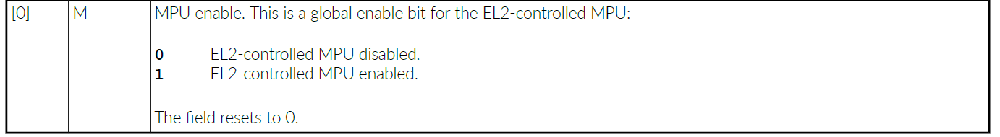
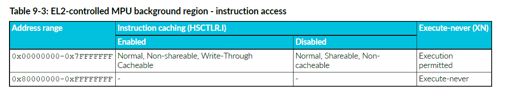
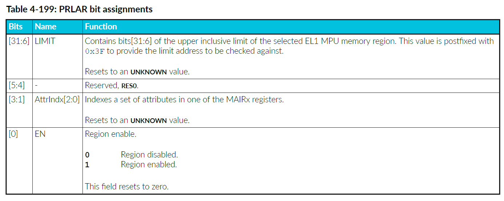

<section id="title">内存保护单元（Memory Protection Unit）</section>

本章介绍 **MPU**。

# 1. 关于 MPU

**Cortex®-R52+** 处理器具有两个可编程 **MPU**，由 **EL1** 和 **EL2** 控制。每个 **MPU** 允许将 **4GB** 内存地址范围细分为多个区域。

每个内存区域定义了基地址（**base address**）、限制地址（**limit address**）、访问权限（**access permissions**）和内存属性（**memory attributes**）。

有关 MPU 的更多信息，请参阅 Arm® 架构Armv8补充参考手册 （**Arm® Architecture Reference Manual Supplement Armv8**），了解更多 **Armv8-R AArch32** 架构配置文件。

对于数据访问，MPU 检查当前转换机制（**current translation regime**）是否允许对某个区域进行访问（读取或写入）。对于指令访问，MPU 检查该区域是否允许访问，以及转换机制是否允许执行。对于数据和指令访问，如果允许访问，MPU 将分配为该区域定义的内存属性。如果不允许访问，则发生权限错误。发生转换错误的原因如下：

* 如果访问命中其中一个 **MPU** 中的多个区域。
* 如果访问未命中任何 **MPU** 区域，并且无法使用背景区域（基于 **MPU** 配置和当前特权级别）。

由于流水线操作，处理器会尝试预测程序流（**program flow**）和未来的数据访问（**future data accesses**），所以它会在使用数据和指令之前获取它们。除非或直到流水线完成相应指令的执行，否则这些事务被称为推测事务（**speculative transactions**）。这可能会导致处理器生成允许区域之外的地址，或者没有权限尝试访问。在这些情况下，**MPU** 会阻止推测访问生成总线事务(**bus transactions**)，但不会引起转换或权限错误。

每个处理器内核都有一个 **EL1** 控制的 **MPU**，具有 **16**、**20** 或 **24** 个可编程区域，以及一个 **EL2** 控制的 **MPU**，后者可选地支持 **0**、**16**、**20** 或 **24** 个可编程区域。当 **EL2** 控制的 **MPU** 和虚拟化被使能时，所有使用 **EL0/EL1** 转换机制的事务都会在两个 **MPU** 中执行查找。将生成的属性组合起来，以便最少权限的属性（**least permissive attributes**）被采用。这两个阶段的保护允许虚拟机管理程序保留对 **EL0/EL1** 转换机制的控制，从而实现对虚拟化的支持。当软件执行使用 **EL2** 转换机制时，仅 **EL2** 控制的 **MPU**被使用。

#  2. MPU 区域

区域是从基地址（**base address**）开始延伸到限制地址（**limit address**）（包括：限制地址）的连续地址范围。

基地址由 **PRBAR** （**EL2** 控制的 **MPU** 的 **HPBAR**）配置。限制地址由 **PRLAR**（**EL2** 控制的 **MPU** 的 配置）配置。基地址与 **64** 字节边界对齐，限制地址与 **64** 字节边界以下的字节对齐。基地址和限制地址都包括在内，这意味着区域内的地址由以下公式给出：

```C
PRBAR.BASE:0b000000 <= address <= PRLAR.LIMIT:0b111111
```

其中冒号（**：**）是位连接运算符。

区域的最小为 **64** 个字节。

**PRBAR** 和 **PRLAR** 还包含：

| 名称           | 含义                                   |
| -------------- | -------------------------------------- |
| PRBAR.AP       | 访问权限（access permissions）         |
| PRBAR.SH       | 可共享性（shareability）               |
| PRBAR.XN       | 从不执行位（Execute-never bit）        |
| PRLAR.AttrIndx | 内存属性索引（memory attribute index） |

通过使用 **PRLAR.AttrIndx** 索引内存属性间接寄存器**MAIRx**（**Memory Attribute Indirection Registers**）来确定内存属性。

通过设置或清除区域启用位 (**PRLAR.EN**) 来启用或禁用区域。在 **EL2** 控制的 **MPU** 中，还可以通过写入 **Hypervisor MPU 区域启用寄存器 HPRENR** (**Hypervisor MPU Region Enable Register**) 来启用或禁用区域。

## 2.1. EL1 控制的MPU背景区域

当MPU被禁用（**SCTLR.M=0**）时，**EL1** 控制的MPU背景区域用作默认内存映射。

当MPU启用时，可以通过设置 **SCTLR.BR** 来启用背景区域。在这种情况下，来自 EL1 转换机制的访问如果未触及任何可编程区域，则将使用背景区域。当 MPU 启用时，来自 EL0 转换机制的访问将出现故障。


### 2.1.1. EL1 控制的MPU背景区域，指令访问

下表显示了EL1控制的MPU背景区域的指令访问。


### 2.1.2. EL1 控制的MPU背景区域，数据访问

下表显示了EL1控制的MPU背景区域的数据访问。


## 2.2. EL2控制的MPU背景区域

当EL2控制的MPU被禁用（**HSCTLR.M=0**）时，**EL2** 控制的背景区域用作所有访问的默认内存映射。

当EL2控制的MPU启用时，通过设置背景区域启用（**HSCTLR.BR=1**），它还可用于未命中任何可编程区域的 EL2 访问。当 EL2 控制的 MPU 启用时，来自 EL0/EL1 转换机制的访问如果未命中 EL2 可编程区域，则会产生转换故障。这是两阶段转换的结果。




### 2.2.1. EL2控制的MPU背景区域，指令访问

下表显示了用于指令访问的EL2控制的MPU背景区域。



### 2.2.2. EL2控制的MPU背景区域，数据访问

下表显示了用于数据访问的EL2控制的MPU背景区域。


## 2.3. 默认缓存能力

启用默认缓存能力 (**HCR.DC=1**) 后，使用 **EL1** 控制的 **MPU** 背景区域的事务将包含：**正常**(**Normal**)、**内部回写**(**Inner Write-Back**)、**外部回写**(**Outer Write-Back**)、**不可共享**(**Non-Shareable**)属性，同时启用**读取分配**(**Read-Allocate**)和**写入分配**(**Write-Allocate**)。当 **HCR.DC=1** 时，在背景区域中命中的指令访问始终可执行。


默认属性是最宽松的，这意味着当与来自 **EL2** 控制的 **MPU** 的任何属性结合时，生成的属性与 **EL2** 控制的 **MPU** 属性相同。这允许 **EL2** 控制的 **MPU** 有效地使 **EL1** 控制的 **MPU** 对来自背景区域中命中的 **EL1** 转换机制的事务透明。当 **HCR.DC=1** 时，来自 **EL0/EL1** 转换机制的所有转换都会执行两阶段 **MPU** 查找，处理器的行为就像设置了 **HCR.VM** 一样。

# 3. 虚拟化支持

为了支持虚拟化，需要执行两个阶段的MPU查找(**MPU lookup**)。

虚拟化允许在 **EL1** 和 **EL0** 上运行的进程（通常是一个或者多个客户操作系统及其应用程序）被在 **EL2** 上运行的进程（通常是单个虚拟机管理程序）进行管理。

* **EL1** 控制的 **MPU** 检查在 **EL0** 或 **EL1** 上运行的进程的事务，并由在 **EL1** 或 **EL2** 上运行的进程进行编程。
* 当启用虚拟化时，**EL2** 控制的 **MPU** 还会检查从 **EL0/EL1** 转换机制执行的事务，并由 **EL2** 上的软件进行编程。
* 在 **EL2** 转换机制下执行的事务仅使用 **EL2** 控制的 **MPU**。

当启用虚拟化（**HCR.VM=1**），并且启用 **EL2** 控制的 **MPU**（**HSCTLR.M=1**）时，**EL1** 控制的 **MPU** 允许的事务将由 **EL2** 控制的MPU检查，作为两阶段查找的一部分。如果两个 **MPU** 都允许该事务，则第1阶段的内存属性将与第2阶段中匹配区域的属性相结合，并将两组中更严格的属性应用于该事务。

## 3.1. 合并MPU内存属性

执行两阶段查找时，每个 **MPU** 的内存类型(**memory type**)、可缓存性(**cacheability**)和可共享性(**shareability**)属性会被合并。

### 3.1.1. 合并内存类型属性

下表显示了内存类型分配如何作为两阶段查找的一部分进行组合。


### 3.1.2. 合并可缓存性属性

下表显示了如何将可缓存性分配合并为两阶段查找的一部分。


### 3.1.3. 合并可共享性属性

下表显示了如何将可共享性分配合并为两阶段查找的一部分。


# 4. MPU寄存器访问

可以间接或直接访问MPU基址寄存器（**base registers**）和限制寄存器（**limit registers**）。

## 4.1. 间接访问（Indirectly）

* 对于EL1，通过写入 **PRSELR** 选择 MPU 区域。接着，通过写入 **PRBAR** 和 **PRLAR**来对所选区域的**MPU**编程。
* 对于EL2，通过写入 **HPRSELR** 选择 MPU 区域。接着，通过写入 **HPRBAR** 和 **HPRLAR**来对所选区域的**MPU**编程。

## 4.2. 直接访问（Directly）

对于MPU区域n，可以通过将区域号编码到以下系统寄存器访问指令的 CRm 和 opcode2 中来直接访问基址寄存器和限制寄存器：

CRm = 0b1rrr，其中 rrr = region_number[3:1]。

要访问基址寄存器：
op2 = 0b000，用于偶数区域。
op2 = 0b100，用于奇数区域。

要访问限制寄存器：
op2 = 0b001，用于偶数区域。
op2 = 0b101，用于奇数区域。


### 4.2.1. 写入基址和限制寄存器

**PRBAR0-PRBAR15**

```ARM
MCR p15, 0, <Rt>, c6, CRm, op2
```

**PRLAR0-PRLAR15**

```ARM
MCR p15, 0, <Rt>, c6, CRm, op2
```

**HPRBAR0-HPRBAR15**

```ARM
MCR p15, 4, <Rt>, c6, CRm, op2
```

**HPRLAR0-HPRLAR15**

```ARM
MCR p15, 4, <Rt>, c6, CRm, op2
```

**PRBAR16-PRBAR23**

```ARM
MCR p15, 1, <Rt>, c6, CRm, op2
```

**PRLAR16-PRLAR23**

```ARM
MCR p15, 1, <Rt>, c6, CRm, op2
```

**HPRBAR16-HPRBAR23**

```ARM
MCR p15, 5, <Rt>，c6，CRm，op2
```

**HPRLAR16-HPRLAR23**

```ARM
MCR p15，5，<Rt>，c6，CRm，op2
```

### 4.2.2. 读取基址和限制寄存器：

**PRBAR0-PRBAR15**

```ARM
MRC p15, 0, <Rt>, c6, CRm, op2
```

**PRLAR0-PRLAR15**

```ARM
MRC p15, 0, <Rt>, c6, CRm, op2
```

**HPRBAR0-HPRBAR15**

```ARM
MRC p15, 4, <Rt>, c6, CRm, op2
```

**HPRLAR0-HPRLAR15**

```ARM
MRC p15, 4, <Rt>, c6, CRm, op2
```

**PRBAR16-PRBAR23**

```ARM
MRC p15, 1, <Rt>, c6, CRm, op2
```

**PRLAR16-PRLAR23**

```ARM
MRC p15, 1, <Rt>, c6, CRm, op2
```

**HPRBAR16-HPRBAR23**

```ARM
MRC p15, 5, <Rt>, c6, CRm, op2
```

**HPRLAR16-HPRLAR23**

```ARM
MRC p15, 5, <Rt>, c6, CRm, op2
```

# 5. MPU寄存器

## 5.1. 保护区域选择寄存器（PRSELR）

**PRSELR** 选择当前 **EL1**控制的 MPU区域寄存器 **PRBAR** 和 **PRLAR**。

**使用限制**

此寄存器的访问方式如下：

| EL0 | EL1 | EL2 |
| --- | --- | --- |
| -   | RW  | RW  |

**捕获和启用**

**PRSELR** 可从 **EL2** 访问，当 **VSCTLR.MSA** 为 **0** 时，可从 **EL1** 访问。

**配置**

此寄存器在所有构建配置中都可用。

**属性**

**PRSELR** 是一个32位寄存器。

**0或16个EL2控制的 MPU 区域**

下图显示了如果实施了 0 或 16 个 EL2 控制的 MPU 区域，PRSELR 位的分配情况。


下表显示了如果实现了 0 或 16 个 EL2 控制的 MPU 区域，PRSELR 位的分配情况。


**20 或 24 个 EL2 控制的 MPU 区域**

下图显示了如果实施了 20 或 24 个 EL2 控制的 MPU 区域，PRSELR 位分配情况。


下表显示了如果实现了 20 或 24 个 EL2 控制的 MPU 区域，PRSELR 位分配情况。


**访问 PRSELR：**

```arm
MRC p15, 0, <Rt>, c6, c2, 1 ; Read PRSELR into Rt
MCR p15, 0, <Rt>, c6, c2, 1 ; Write Rt to PRSELR
```

## 5.2. 保护区域基址寄存器（PRBAR）

保护区域基址寄存器指示 **EL1** 控制的 **MPU** 区域的基址，并提供两种访问机制，直接 (**PRBARn**) 和间接 (**PRBAR**)。有关间接访问，另请参阅 [PRSELR](#51-保护区域选择寄存器prselr)。

**使用限制**

此寄存器的访问方式如下：

| EL0 | EL1 | EL2 |
| --- | --- | --- |
| -   | RW  | RW  |

**捕获和启用**

**PRBAR** 可从 **EL2** 访问，当 **VSCTLR.MSA** 为 **0** 时，可从 **EL1** 访问。

**配置**

此寄存器在所有构建配置中都可用。

**属性**

**PRBAR** 和 **PRBARn** 是 32 位寄存器。

下图显示了 **PRBAR** 位分配：


下表显示了 **PRBAR** 位分配：


下表描述了普通存储器的 SH[1:0] 字段编码。


下表描述了 EL1 控制的 MPU 的数据访问权限。


此寄存器重置时为未知值。

**要访问 PRSELR 选择的 PRBAR：**

```arm
MRC p15, 0, <Rt>, c6, c3, 0 ；将 PRBAR 读入 Rt
MCR p15, 0, <Rt>, c6, c3, 0 ；将 Rt 写入 PRBAR
```

可直接访问 PRBAR0 至 PRBAR23。要访问 PRBARn，其中 n 以二进制数表示：

```arm
MRC p15, 0+nDIV16, <Rt>, c6, c8+n[3:1], 4*n[0] ；将 PRBARn 读入 Rt
MCR p15, 0+nDIV16, <Rt>, c6, c8+n[3:1], 4*n[0] ；将 Rt 写入 PRBARn
```

## 5.3. 保护区域限制地址寄存器（PRLAR）

保护区域限制地址寄存器指示 **EL1** 控制的MPU区域的限制地址，并提供两种访问机制，直接（**PRLARn**）和间接（**PRLAR**）。有关间接访问，另请参阅 [PRSELR](#51-保护区域选择寄存器prselr)。

**使用限制**

此寄存器的访问方式如下：

| EL0 | EL1 | EL2 |
| --- | --- | --- |
| -   | RW  | RW  |

**捕获和启用**

**PRLAR** 可从 **EL2** 访问，当 **VSCTLR.MSA** 为 **0** 时，可从 **EL1** 访问。

**配置**

此寄存器在所有构建配置中都可用。

**属性**

**PRLAR** 和 **PRLARn** 是32位寄存器。

下图显示了 **PRLAR** 位分配：


下表显示了 **PRLAR** 位分配。



**要访问 PRLAR：**

```arm
MRC p15, 0, <Rt>, c6, c3, 1 ; 将 PRLAR 读入 Rt
MCR p15, 0, <Rt>, c6, c3, 1 ; 将 Rt 写入 PRLAR
```

可直接访问 **PRLAR0** 至 **PRLAR23**。要访问 **PRLARn**，其中 **n** 以二进制数表示：

```arm
MRC p15, 0+nDIV16, <Rt>, c6, c8+n[3:1], 4*n[0]+1 ; 将 PRLARn 读入 Rt
MCR p15, 0+nDIV16, <Rt>, c6, c8+n[3:1], 4*n[0]+1 ; 将 Rt 写入 PRLARn
```

## 5.4. MPU类型寄存器

MPUIR 表示由 EL1 控制的 MPU 实现的可编程内存区域的数量。

**使用限制**

此寄存器的访问方式如下：

## 5.5. 内存属性间接寄存器 0 和 1 (MAIR0/MAIR1)

**MAIR0** 和 **MAIR1** 提供与保护区域限制地址寄存器中可能的 **AttrIndx** 值相对应的内存属性编码。该寄存器为从 Hyp 模式以外的状态进行的内存访问提供值。

**使用限制**

这些寄存器的访问方式如下：

| EL0 | EL1 | EL2 |
| --- | --- | --- |
| -   | RW  | RW  |

捕获和启用

当设置 **HCR.TVM** 时，对这些寄存器的 **EL1** 写访问将被捕获到 **EL2**。当设置 **HCR.TRVM** 时，**EL1** 读访问将被捕获到 **EL2**。当设置 **HSTR.T10** 时，**EL1** 访问将被捕获到 **EL2**。

**配置**

这些寄存器在所有构建配置中都可用。

**属性**

**MAIR0** 和 **MAIR1** 是 32 位寄存器。

下图显示了 MAIR0 和 MAIR1 位分配。


下表显示了 **MAIR0** 和 **MAIR1** 位分配。


下表显示了 Attr<n>[7:4] 位分配。


下表显示了 Attr<n>[3:0] 位分配。Attr<n>[3:0] 的编码取决于 Attr<n>[7:4] 的值。


下表显示了第 174 页表 4-163：Attr<n>[7:4] 位分配和第 174 页表 4-164：Attr<n>[3:0] 位分配中的某些 Attr<n> 编码中使用的 R 和 W 位的编码，分别用于定义读取分配和写入分配策略。


**要访问 MAIR0：**

```arm
MRC p15, 0, <Rt>, c10, c2, 0 ；将 MAIR0 读入 Rt
MCR p15, 0, <Rt>, c10, c2, 0 ；将 Rt 写入 MAIR0
```

**要访问 MAIR1：**

```arm
MRC p15, 0, <Rt>, c10, c2, 1 ；将 MAIR1 读入 Rt
MCR p15, 0, <Rt>, c10, c2, 1 ；将 Rt 写入 MAIR1
```