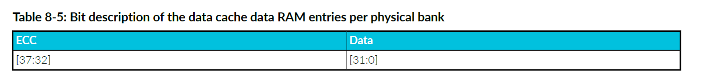

<section id="title">内存系统（Memory System）</section>

本章介绍内存系统。

# 1. 关于内存系统

内存系统控制对内部（**internal RAM**）、缓存（**caches**）、外部内存（**external memory**）和外设端口（**peripheral port**）的访问。

内存系统包括：

* 每个内核专用的内存：
  * 可选的 L1 指令缓存。
  * 可选的 L1 数据缓存。
  * 可选的 TCM。
* 每个内核专用的接口：
  * 符合 AXI4（32 位数据总线）的可选LLPP主接口（**LLPP master interface**）。
  * 符合 AXI4 的可选 Flash 接口，但仅支持事务子集并具有一些附加功能（这些功能不必使用）。
  * 符合 AXI4（128 位数据总线）的 AXIM 接口（**AXIM interface**）。
* 符合 AXI4 但仅支持事务子集的 AXIS 接口，提供对所有内核中的 TCM 的外部访问（128 位数据总线）。

下图显示了内存系统和外部接口。

内核采用哈佛内存架构，这意味着内核具有访问指令和数据的独立路径。指令端获取指令。数据端读取和写入数据。内核可以从指令端和数据端进行并发访问。

**TCM** 提供快速访问内存。 **TCM** 是统一的，这意味着它可以同时保存指令和数据。 **TCM接口** 控制对 **TCM** 的访问。 **TCM接口**包括一个完整的交叉开关，允许从三个主控（指令端、数据端和 AXIS）并发访问 **TCM**（A、B 和 C）。如果一个或多个主控尝试访问同一个 **TCM**，则 **TCM** 接口将根据具有服务质量 (QoS) 机制的固定优先级方案在请求之间进行仲裁。 **TCM** 为内存访问提供最确定的时序(**most deterministic timing**)。

当访问时序确定性不太重要但仍需要快速访问时，可以使用指令缓存和数据缓存。数据端生成的所有针对 **AXIM接口** 的存储，都通过 **AXIM接口** 写入外部存储器，并在数据缓存(**data cache**)中更新或分配。**TCM 和 LLPP 事务** 永远不会分配到数据缓存(**data cache**)中。在缓存未命中时，将向**Flash接口**或者**AXIM接口**发出行填充请求。数据缓存始终具有直写(**Write-Through**)行为。

**AXIM接口**是外部存储器或设备系统的主要接口。**Flash接口**提供对外部只读存储器控制器（如：闪存）的访问。**LLPP接口**提供对外部外围设备或小型专用存储器系统的访问。**AXIS接口** 提供对 TCM 的外部访问。通过 **AXIS接口** 的访问争夺 TCM 访问周期，因此它们可能会降低 TCM 存储器的确定性。

存储器系统包括一个用于独占访问的本地监视器。可以使用独占加载和存储指令（例如：**LDREX**、**STREX**）来提供进程间同步和信号量。它们可以使用适当的外部存储器监控逻辑提供进程间同步和信号量。有关 Armv8-R AArch32 体系结构配置文件，请参阅补充Armv8的Arm® 体系结构参考手册(**Arm® Architecture Reference Manual Supplement Armv8**)。

所有指令端和数据端访问都在**MPU**定义的内存映射中查找。它在指令端或数据端访问外部存储器之前返回访问权限。如果允许访问，**MPU**将为事务提供内存属性。

**注意：**

除了 TCM 与 Flash 重叠的情况（如果存在并启用），执行访问 ATCM、BTCM 和 CTCM 区域中超过一个区域的访问是非法的。此外，如果存在，执行访问 LLPP、Flash 和内部外设区域中超过一个区域的访问也是非法的。

# 2. **TCM 内存**

**TCM** 是统一的，提供快速访问，并具有最确定的内存访问时序(**most deterministic memory access timing**)。

**TCM** 是内核私有的。每个 **TCM** 的大小都独立实现为 **0KB**、**8KB**、**16KB**、**32KB**、64KB、128KB、256KB、512KB 或 1MB。0KB 大小表示未实现 TCM。

每个 **TCM** 都可以实现等待状态，这意味着对该 **TCM** 的所有访问，都会产生额外的延迟周期。如果部分（但不是全部）**TCM** 实现了等待周期，则 **TCM** 的性能可能会各不相同。

如果在复位时，对主输入 **CFGTCMBOOTx** 进行置位，则启用 **ATCM**，基址为 **0x00000000**。其他 **TCM** 则被禁用，其基址为 **未知**。

每个 **TCM** 的基地址以及是否启用，可以通过写入相应的 **TCM** 区域寄存器 (**IMP_ATCMREGIONR**、**IMP_BTCMREGIONR**、**IMP_CTCMREGIONR**) 进行编程。为在 **EL2** 上运行的软件和在 **EL1** 或 **EL0** 上运行的软件，提供独立的启用（**Separate enables**）。**TCM** 基地址必须是大小对齐的。每个 **TCM** 的大小在相应的 **TCM** 区域寄存器中指示。如果当前异常级别禁用了**TCM**，则根据 **Flash接口**的配置，可以通过**AXIM接口**、**Flash接口**或**LLPP接口**访问其地址区域。

通过设置寄存器位 **HCR.TIDCP=1**，可以从 **EL1** 向TCM区域寄存器写入，并将其捕获到在EL2上运行的虚拟机管理程序中。

可以通过**AXIS接口**访问 **TCM**。

**TCM 属性和权限**

启用的 **TCM** 始终表现为：不可缓存、不可共享的普通内存。这与 **MPU** 中，为包含 **TCM** 中保存的地址的内存区域定义的内存类型属性无关。**TCM**访问的访问权限与**MPU**分配给同一地址的权限属性相同。

# 3. 一级缓存(Level-1 caches)

在内核中，可选的指令和数据缓存独立实现。

**指令缓存**

指令缓存的功能包括：

* 指令缓存（如果存在）可实现为 **4KB**、**8KB**、**16KB** 或 **32KB**，并以 **64字节**行四路组相联的方式组织。
* 根据缓存能力属性、缓存隔离策略以及控制缓存的设置的编程方式，来自 **Flash接口**或者**AXIM接口**的指令可缓存在指令缓存中。
* 当指令流是连续的时，缓存可以自动从内存中预取下一行。**PFU**使用其分支预测结构提前请求非连续行。
* 预取行为由 **CPUACTLR.L1IPFCTL** 控制。

**数据缓存**

数据缓存的功能包括：

* 数据缓存（如果存在）可实现为 **4KB**、**8KB**、**16KB** 或 **32KB**，并以四路组（**four-way set**）相联的方式组织，每路**64字节**。
* 根据 **MPU** 中设置的属性、缓存隔离策略以及控制缓存的设置编程方式，可将来自 **Flash接口**或者**AXIM接口**的数据读取缓存在数据缓存中。
* 当管道中的两个或三个访问在数据缓存中未命中时，内存系统可以为它们全部启动行填充。这种所谓的未命中下未命中行为（**miss-under-miss behavior**）允许缓存同时有最多三个未完成的行填充。
* **AXIM接口**有4个数据预取器，它们在 4KB 区域内的可缓存访问和预取中查找模式。**Flash接口**没有数据预取器。

**Cortex®-R52+** 处理器不具有一致性，内部可共享域由单个 **Cortex®-R52+** 内核组成。**Cortex®-R52+** 处理器不会缓存标记为可共享的数据，并且所有缓存维护指令都在本地执行。这意味着指令缓存维护操作不会广播到任何其他内核。外部可共享域位于 **Cortex®-R52+** 处理器外部，所以依赖于系统。

在 **Cortex®-R52+** 处理器中，指令端和数据端访问具有访问主内存的独立路径。所以一致性点存在于处理器外部，依赖于系统。

内部可缓存域由单个 **Cortex®-R52+** 内核组成。外部可缓存域位于 **Cortex®-R52+** 处理器外部。

数据缓存的写入行为始终为直写缓存（**Write-Through caching**）。标记为可回写缓存（**Write-Back Cacheable**）的位置被视为直写（**Write-Through**）。回写（**Write-Back**）和直写（**Write-Through**）区域的缓存取决于所设置的任何读取分配（**Read-Allocate**）或写入分配（**Write-Allocate**）提示。标记为内部或外部可共享（**Inner or Outer Shareable**）的位置，无论其可缓存性属性如何，都将被视为不可缓存。数据缓存不使用瞬态分配提示（**Transient allocation hint**）。任何标记为瞬态的区域都将被视为非瞬态（**Non-transient**）。

## 3.1. 缓存RAM组织

本节介绍指令和数据缓存的 RAM 组织。

**在 Cortex®-R52+** 处理器中，指令和数据缓存均组织为4路组（**4-way set**）相联结构，引脚可配置逻辑大小为 **4KB**、**8KB**、**16KB** 或 **32KB**。

**Cortex®-R52+** 地址宽度为**32**位。每个缓存行（**cache line**）包含64个字节的数据，每条逻辑通道（**logical way**）都是一个双字宽（8字节）。位 [5:3] 用于选择缓存行内的双字地址。位 [2:0] 允许选择双字内的字节。

根据缓存的大小，缓存的标签和索引来自 32 位地址，如下表所示。

该信息有助于通过缓存调试操作来调试缓存，如8.4直接访问L1缓存中所述。

### 3.1.1. 指令缓存（Instruction cache）

本节介绍指令缓存标记和数据RAM的组织。

**标记RAM（Tag RAM）**

指令缓存标记RAM分为四条逻辑通道（**logical way**），每条路包含 **64** 到 **512** 个条目（**entries**），具体取决于缓存的大小。每个条目包含一个有效位（**valid bit**）、一个标记（**tag**），以及可选的六个纠错码 (**ECC**) 位。

四条逻辑通道中的每一条都可以实现为一个物理存储体（**physical bank**），如下图所示。

下表显示了根据指令缓存的大小每个标记 RAM 条目的位字段。

指令缓存标记 RAM 的有效位与指令缓存数据 RAM 中的整个缓存行（八个双字条目）相关联。

**数据RAM（Data RAM）**

指令缓存数据RAM分为四条逻辑通道，每条路径包含 **64** 到 **1024** 个条目。每个条目包含 64位（双字）数据和可选的七个纠错码 (**ECC**) 位。

四条逻辑通道中的每一条都映射到所有四个物理存储体，如下图所示。

给定双字的物理存储体（**physical bank**）取决于双字在缓存行内的偏移量（由地址位 [5:3] 给出）和逻辑通道，具体公式如下：

双字的指令缓存数据 RAM 存储体 = (缓存路径 XOR 数据双字偏移量) AND 0x3

下表显示了每个指令缓存数据 RAM 条目的位字段，与缓存大小无关。

数据缓存标记 RAM 分为四个逻辑通道，每个通道包含 64 到 512 个条目，具体取决于缓存的大小。每个条目包含一个有效位、一个标记以及可选的六个纠错码 (ECC) 位。

### 3.1.2. 数据缓存（Data cache）

本节介绍数据缓存标记和数据RAM的组织。

**标记RAM（Tag RAM）**

**数据缓存标记RAM**分为四个逻辑通道，每个通道包含 **64** 到 **512** 个条目，具体取决于缓存的大小。每个条目包含一个有效位、一个标记以及可选的六个纠错码 (ECC) 位。

四个逻辑通道中的每一条都可以实现为一个物理存储体，如下图所示。

下表显示了根据数据缓存的大小每个**标签 RAM**条目的位字段。

数据缓存标记 RAM 的有效位与数据缓存数据 RAM 中的整条缓存行（八个双字条目）相关联。

**数据RAM（Data RAM）**

**数据缓存数据RAM**分为四条逻辑通道，每条通道包含 **64** 到 **1024** 个双字数据条目。但是，从物理上讲，**数据缓存数据RAM**实现为八个存储体，每个条目包含 32位（一个字）数据和可选的六个ECC位。

四个逻辑通道映射到所有八个物理存储体上，如下图所示。一个双字始终存储在两个相邻的物理存储体中。

给定字的物理存储体取决于字在缓存行内的偏移量（由地址位 [5:2] 给出）和逻辑路径，具体公式如下：

双字的数据缓存数据 RAM 组对 = (缓存路径 + 数据双字偏移量) AND 0x3

字的数据缓存数据 RAM 组 = { ((缓存路径 + 数据双字偏移量) AND 0x3), 地址位 [2] }

下表显示了数据缓存数据 RAM 组的每个条目的位字段，与缓存大小无关。

## 3.2. 缓存隔离

L1指令和数据缓存将来自**Flash接口**或者**AXIM接口**的分配隔离到单独的缓存路中。**IMP_CSCTLR.IFLW** 和 **IMP_CSCTLR.DFLW** 分别控制分配给每个接口的指令缓存和数据缓存的通道数。

**注意：**

只有在系统重置后启用缓存之前才允许更新缓存隔离控制，否则更新将被忽略。

## 3.3. 数据缓存失效（Data cache invalidation）

**EDCCR** 允许将 **Flash内存** 和 **AXIM内存**，与 **RAM** 叠加，并修改 **RAM** 内容。

下图显示了数据缓存失效的状态机。

**空闲（Idle）**

复位后，状态机处于**空闲**状态。从 **EDCCR** 读取的数据为 **0**，表示**数据缓存失效**处于非活动（inactive）状态。

**等待（Wait）**

当 **EDCCR[0]**、**EDCCR[2]** 或者两者均写入 **1** 时：

* 通过内存系统发送请求，使包含**Flash数据**（**EDCCR[0]** 写入 **1**），**AXIM数据**（**EDCCR[2]** 写入 **1**），或者两者（**EDCCR[0]** 和 **EDCCR[2]** 均写入 **1**）的所有数据缓存行失效。这表示为 **ADCIREQ=1**、**FDCIREQ=1** 或者 **ADCIREQ=1** 和 **FDCIREQ=1**。
* **DCIACK=0**。
* 新的**Flash访问**，**AXI访问**，或者 **Flash访问** 和 **AXI访问** 都不可缓存（**non-cacheable**）。
* 状态机处于等待（**Wait**）状态，其中从 EDCCR 读取返回 1，表示缓存未分配新的缓存行，并且旧缓存行的无效化正在进行中。

**活动（Ative）**

当内存系统完成数据缓存失效请求时：

* **DCIACK=1**，表示缓存失效已完成。
* 状态机处于活动（**Active**）状态。
* **EDCCR[0]** 和 **EDCCR[1]** 均读取为 **1**。
* 数据缓存不包含失效的数据类型。
* 所有*Flash访问**，**AXI访问**，或者 **Flash访问** 和 **AXI访问** 均不可缓存。

注意：

* 当 EDCCR[0] 和 EDCCR[2] 写入 0 时，状态机返回空闲状态，并且Flash 或 AXIM 地址可缓存。
* 当状态机不处于空闲（**Idle**）状态时，向 **EDCCR** 写入 **1** 将被忽略。
* 当状态机不处于活动（**Active**）状态时，向 **EDCCR** 写入 **0** 将被忽略。

有关 **EDCCR** 的更多信息，请参阅**外部调试校准控制寄存器**

## 3.4. 写入流模式（Write streaming mode）

根据 **MPU** 编程中配置的分配提示，将缓存行分配给 **L1缓存**。

但是，有些情况下不需要在写入时进行分配。例如，执行 C 标准库 **memset()** 函数将大块内存清除为已知值时。大块数据的写入可能会用不必要的数据把缓存给污染。同时这样也会浪费电量和性能，如果必须执行行填充只是为了丢弃行填充数据，为了整个行随后由 **memset()**写入。

为了解决这个问题，内核包含逻辑，用于在行填充完成之前检测内核何时写入了完整的缓存行。如果在可配置数量的连续行填充中检测到这种情况，则它会切换到写入流模式（**write streaming mode**）。这有时称为读取分配模式（**read allocate mode**）。

在写入流模式下，加载行为正常，仍然会导致行填充，写入仍会查找缓存，但如果它们未命中，则它们会写入总线而不是启动行填充。

**CPUACTLR.WSTRNOL1ACTL** 配置写入流模式阈值。有关 **CPUACTLR** 的更多信息，请参阅**CPU辅助控制寄存器**。

**注意：**

在内核检测到已写入指定数量的完整缓存行并切换到写入流模式之前，主接口上可能会观察到超过指定数量的行填充。核心继续处于写入流模式，直到检测到不是完整缓存行的可缓存写入突发，或者当前正在写入总线的同一行中有负载。

# AXIM接口

**AXIM接口**是外部存储器和外设的主要接口。每个内核都有自己的 **AXIM接口**，仅用于从该内核进行访问。

**AXIM接口**实现 **AXI4协议**，具有 **128** 位数据宽度。

**AXIM接口**接收来自**指令端**(**instruction side**)和**数据端**(**data side**)的请求。您可以通过设置 **CPUACTLR.AXIMARBCTL** 来配置在争用(**contention**)情况下，数据或指令访问是否具有最高优先级。**AXIM接口**可以具有总线保护(**bus protection**)。

## AXIM接口属性

本节介绍**AXIM接口**属性。

下表显示了一个内核的**AXI4主接口**(**AXI4 master interface**)属性。

表 8-18：AXI4主接口属性

| 属性         | 值  | 注释                                                                                                                       |
| ------------ | --- | -------------------------------------------------------------------------------------------------------------------------- |
| 写入发布能力 | 3   | 每个内核最多可以发布三个写入请求。                                                                                         |
| 读取发布能力 | 11  | 每个内核可以发布八个未完成的数据端和三个未完成的指令端 AXIM 读取请求。                                                     |
| 独占线程能力 | 1   | 每个内核可以有一个正在进行的独占访问序列。                                                                                 |
| 写入 ID 能力 | 3   | 主接口可以为所有活动写入事务同时生成的不同 AXIDMx 值的最大数量。                                                           |
|              |     | 设备内存可以有多个具有相同 AXI ID 的未完成事务。                                                                           |
|              |     | 对于普通内存，仅当有多个存储具有相同地址时，存储才会使用相同的 ID。这可以保持存储之间的顺序，否则会产生写后写 (WAW) 风险。 |
| 写入 ID 宽度 | 3   | -                                                                                                                          |
| 读取 ID 功能 | 11  | 主接口可同时为所有活动读取事务生成的不同 ARIDMx 值的最大数量。                                                             |
|              |     | ID 将内存事务的来源编码为 Exclusive62、数据端设备、指令端正常或数据端正常。                                                |
|              |     | 可以有一个数据端设备请求。普通内存的事务对每个未完成的事务使用唯一的 AXI ID。                                              |
|              |     | Cortex®-R52+ 处理器将内存的所有设备区域视为永不执行 (XN)，无论 XN 的编程值如何。                                           |
| 读取 ID 宽度 | 4   | -                                                                                                                          |

**相关信息:**
**AXIM交易ID**(**AXIM transaction IDs**)

## AXIM接口传输（**AXIM interface transfers**）

**AXIM** 符合 **AXI4规范**，但它不会生成该规范允许的所有**AXI事务**类型。本节介绍 **AXIM** 生成的 AXI事务类型。如果您正在设计一个仅与 Cortex®-R52+ AXIM 配合使用的 AXIS，您可以利用这些限制和接口属性来简化从属设备。

所有WRAP突发都从关键字开始提取完整的缓存行。突发不会跨越缓存行边界。

缓存行填充提取长度始终为 64 字节。

对于**回写式**(**Write Back**)或**直写式**(**Write-Through**)，内部可缓存的传输，支持的传输为以下方式：

* WRAP 4 128 位用于读取传输。
* INCR 1 8 位、16 位、32 位和 64 位用于写入传输。
* INCR N (N:1-4) 128 位用于写入传输。
* INCR 1 8 位、16 位、32 位和 64 位用于独占写入传输。

**注意：**

即使 **MPU** 被编程为回写式(**Write-Back**)或直写式(**Write-Through**)，处理器也可能将某个内存位置视为不可缓存。当缓存被禁用时，可能会发生这种情况。在这种情况下，请参阅下面支持的不可缓存事务传输类型。

**For Non-cacheable transactions:**

• INCR N (N:1-4) 128-bit for data side read transfers.
• INCR N (N:1-4) 128-bit for write transfers.
• INCR 1 8-bit, 16-bit, 32-bit, and 64-bit for write transfers.
• INCR 1 8-bit, 16-bit, 32-bit, 64-bit for data side read transfers.
• INCR N (N:1-4) 128-bit for instruction side read transfers.
• INCR 1 8-bit, 16-bit, 32-bit, 64-bit for exclusive write transfers.
• INCR 1 8-bit, 16-bit, 32-bit, 64-bit for exclusive read transfers.

For Device transactions:
• INCR 1 8-bit, 16-bit, 32-bit, 64-bit for data side read transfers.
• INCR N (N:1-4) 128-bit for write transfers.
• INCR 1 8-bit, 16-bit, 32-bit, and 64-bit for write transfers.
• INCR 1 8-bit, 16-bit, 32-bit, 64-bit for exclusive read transfers.
• INCR 1 8-bit, 16-bit, 32-bit, 64-bit for exclusive write transfers.