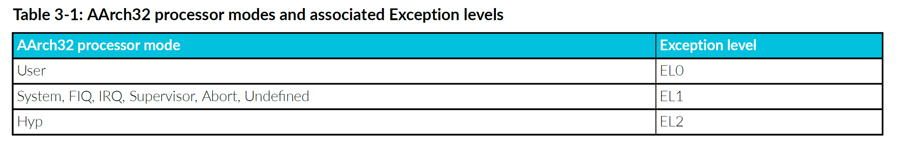

<section id="title">Cortex®-R52+ 程序员模型（Programmers Model）</section>

本章介绍程序员模型。

# 1. 关于程序员模型

**Cortex®-R52+**处理器实现了 **Armv8-R** 架构。包括了：

* 所有异常级别(**Exception levels**)：**EL0** - **EL2**。
* 每个异常级别的 AArch32 执行状态。
* **T32** 和 **A32** 指令集包括：
  * 浮点运算。
  * 高级 **SIMD** 操作（可选）。

有关 Armv8-R AArch32 架构配置文件的更多信息，请参阅 Arm® 架构参考手册补充 Armv8。

## 1.1. 高级 SIMD 和浮点

高级 SIMD 是一种媒体和信号处理架构(**media and signal processing architecture**)。

浮点执行单精度和双精度浮点运算。

**注意：**

高级 **SIMD**、其相关实现和支持软件通常称为 **NEON™技术**。

所有高级 **SIMD** 和浮点运算都是 **A32** 和 **T32** 指令集的一部分。

有关 Armv8-R AArch32 架构配置文件的更多信息，请参阅 Arm® 架构参考手册补充 Armv8。

## 1.2. 通用中断控制器

**Cortex®-R52+** 处理器不支持以下 **GIC** 版本3的功能：

* 1 of N 中断分配（**1of N interrupt distribution**）。
* 特定于位置的外设中断（**Locality-specific Peripheral Interrupts**） (LPI)。
* 中断转换服务（**Interrupt Translation Service**） (ITS)。

## 1.3. Jazelle implementation

处理器仅支持简单的 **Jazelle** 实现。这意味着：

* 不支持 Jazelle 状态。
* BXJ 指令的行为与 BX 指令相同。
  
在简单的 **Jazelle** 实现中，处理器不会加速任何字节码的执行，并且 Java 虚拟机 (JVM) 使用软件例程（**software routines**）来执行所有字节码（**bytecodes**）。

## 1.4. 指令集状态

处理器操作由 PSTATE.T 位控制的两个指令集状态：

* **A32**：处理器执行 32 位、字对齐(**word-aligned**)的 A32 指令。
* **T32**：处理器执行 16 位和 32 位、半字对齐(**halfword-aligned**)的 T32 指令。

## 1.5. 内存模型

**Cortex®-R52+** 处理器将内存视为从零开始按升序编号的字节的线性集合。例如：字节 0-3 保存第一个存储的字，字节 4-7 保存第二个存储的字。

处理器可以以以下任一方式访问内存中的字：

* 大端格式（**Big-endian format**）。
* 小端格式（**Little-endian format**）。

有关大端和小端内存系统的更多信息，请参阅 Arm® 架构参考手册补充 Armv8，了解 Armv8-R AArch32 架构配置文件。

**注意:**

对于指令始终为小端。

## 1.6. 安全状态

**Cortex®-R52+** 处理器未实现 **TrustZone®技术**。它不支持区分安全和非安全物理内存的能力。

# 2. Armv8-R AArch32 架构概念

**Cortex®-R52+处理器**的程序员模型主要由实现的架构定义。本手册不包含架构程序员模型的重复描述。本手册只描述了特定于**Cortex®-R52+处理器**实现的功能和行为。

以下部分介绍了本文档其余部分中使用的主要架构概念和术语。有关更多详细信息，请参阅 Arm® 架构参考手册补充 Armv8，了解 Armv8-R AArch32 架构配置文件。

**注意：**

理解本节中定义的术语是阅读本手册其余部分的先决条件。

## 2.1. 执行状态

**Armv8-R AArch32架构**只有一个执行状态，即：**AArch32**。执行状态定义处理器执行环境，包括：

* 支持的寄存器宽度。
* 支持的指令集。
* 重要方面：
  * 执行模型。7
  * PMSA。
  * 程序员模型。

## 2.2. 异常级别

Armv8-R AArch32 异常模型定义了异常级别 EL0-EL2，其中：

* EL0 具有最低的软件执行权限，在 EL0 执行称为非特权执行。
* 增加的异常级别，从1到2，表示软件执行权限增加。
* EL2 提供对处理器虚拟化的支持。

只有在发生异常或从异常返回时，执行才能在 Armv8-R AArch32 异常级别之间移动：

* 发生异常时，异常级别要么增加，要么保持不变。发生异常时，异常级别不能降低。
* 从异常返回时，异常级别要么降低，要么保持不变。从异常返回时，异常级别不能增加。

发生异常时，执行更改到（execution changes to）或保持（reminds in）或正发生的异常级别称为异常的目标异常级别，并且：

* 每种异常类型都有一个目标异常级别，该级别可以是：
  * 隐含在异常的性质中。
  * 由系统寄存器中的配置位定义。
* 异常不能以 **EL0** 为目标。

## 2.3. 典型的异常级别使用模型

架构没有指定软件在不同异常级别使用什么，并且这种选择超出了架构的范围。但是，以下是异常级别的常见使用模型：

* **EL0**: 应用程序。
* **EL1**: 操作系统内核和通常被描述为特权的相关功能。
* **EL2**: 虚拟机管理程序。

## 2.4. 异常术语

本节定义用于描述异常级别之间导航的术语。

### 2.4.1. 异常发生的术语

当处理器首次响应异常情况时，将生成异常。

此时的处理器状态是异常发生前的状态。发生异常后立即出现的处理器状态是异常发生后的状态。

### 2.4.2. 从异常返回的术语

要从异常返回，处理器必须执行异常返回指令。提交执行异常返回指令时的处理器状态是从异常返回前状态。执行该指令后立即出现的处理器状态是异常返回后的状态。

### 2.4.3. 快速中断

启用快速中断后，当收到中断时，处理器将放弃任何已启动但未完成的可重启内存操作。可重启内存操作是加载和存储指令到普通内存（**Normal memory**）。

为了最大限度地减少中断延迟，Arm 建议您不要对设备内存（**Device memory**）执行多字（**multiword**）传输操作。

## 2.5. 指令集状态

处理器指令集状态决定处理器执行的指令集。

AArch32 执行状态支持的指令集有：

* **A32**: 这是一个使用**32位**指令编码的固定长度指令集。在 **Armv8** 推出之前，它被称为**Arm指令集**。
* **T32**: 这是一个使用**16位**和**32位**指令编码的可变长度指令集。在 **Armv8** 推出之前，它被称为**Thumb指令集**。

## 2.6. AArch32 执行模式

在 AArch32 状态下，处理器可以在几种模式之一中执行。每种模式都与一个异常级别相关联。某些模式具有一些通用寄存器的私有存储副本。异常会导致处理器切换到特定模式。

下表显示了 AArch32 处理器模式以及每种模式的异常级别。

## v8支持的内存类型

Armv8 提供互斥的内存类型（**mutually exclusive memory types**）。内存映射中的每个地址都有一个由 MPU 确定的内存类型。

**内存类型包括：**

* 普通内存（**Normal**）：通常用于大容量内存，包括了读/写和只读内存。
* 设备内存（**Device**）：通常用于外设（**peripherals**），可能是读敏感（**read-sensitive**）或者写敏感（**write-sensitive**）。Arm架构限制了对设备内存的访问的排序、合并或推测方式（**ordered, merged, or speculated**）。

Armv8 架构将设备内存（**Device memory**）细分为几种子类型。这些子类型与以下属性相关：

* **G**： 聚集(**Gathering**)，将请求聚集并合并为单个事务（**single transaction**）的能力。
* **R**： 重新排序（**Reordering**），重新排序事务（**reorder transactions**）的能力。
* **E**： 提前确认(**Early-acknowledge**)，接受来自互连的事务的提前确认的能力。

下表描述了 Armv8 内存类型

**表 3-2：Armv8内存类型**

| 内存类型 | 注释                                                                                                           |
| -------- | -------------------------------------------------------------------------------------------------------------- |
| GRE      | 与 Normal 不可缓存（**Normal non-cacheable**）类似，但不允许推测访问（**speculative access**）。               |
| nGRE     | 在 Cortex®-R52+ 处理器中被视为**nGnRE**，但可以通过外部互连（b）重新排序。                                     |
| nGnRE    | 对应于 Armv7 中的设备。                                                                                        |
| nGnRnE   | 对应于 Armv7 中的强排序。在 Cortex®-R52+ 处理器中与 nGnRE 相同，但在 **ARCACHE** 或 **AWCACHE** 上的报告不同。 |

