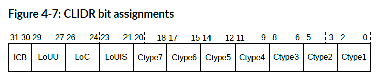
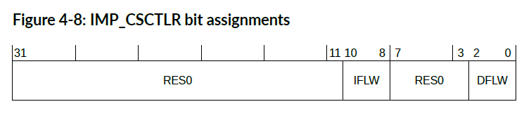
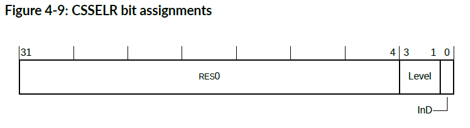
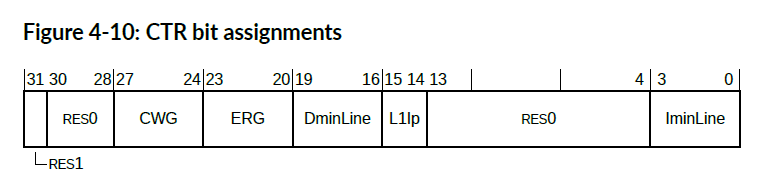

<section id="title">系统控制（**System Control**）</section>

本章介绍系统寄存器及其结构和操作。

# 1. AArch32 寄存器描述

本节按名称的字母顺序介绍系统寄存器。

## 1.1. 缓存级别 ID 寄存器（Cache Level ID Register）

**CLIDR** 标识了在每个已实现的缓存级别类型、缓存层次，已经缓存结构的一致性和统一性级别。

**使用限制**

该寄存器可通过下列方式访问：

| EL0 | EL1 | EL2 |
| --- | --- | --- |
| -   | RO  | RO  |

**捕获和使能**

如果 **HCR.TID2** 设置为 **1**，则从 **EL1** 对此寄存器的读取访问将被捕获到 Hyp 模式。

如果 **HSTR.T0** 设置为 **1**，则从 **EL1** 对此寄存器的读取访问将被捕获到 Hyp 模式。

**配置**

该寄存器在所有构建配置中都可用。

**属性**

**CLIDR** 是一个 32 位寄存器。

下图显示了 **CLIDR** 位分配。



Table 4-48: CLIDR 位分配

| 位      | 名称   | 功能                                         |
| ------- | ------ | -------------------------------------------- |
| [31:30] | ICB    | 内部缓存边界：                               |
|         |        | 0b00 此机制中未公开。                        |
| [29:27] | LoUU   | 指示缓存层次结构的统一单处理器级别：         |
|         |        | 0b001 级别 1（如果已实现任一缓存）。         |
|         |        | 0b000 级别 0（如果未实现指令和数据缓存）。   |
| [26:24] | LoC    | 表示缓存层次结构的一致性级别：               |
|         |        | 0b001 级别 1（如果已实现任一缓存）。         |
|         |        | 0b000 级别 0（如果未实现指令和数据缓存）     |
| [23:21] | LoUIS  | 指示缓存层次结构的统一内部可共享级别：       |
|         |        | 0b001 级别 1（如果已实现任一缓存）。         |
|         |        | 0b000 级别 0（如果未实现指令和数据缓存）。   |
| [20:18] | Ctype7 | 如果处理器实现了 L7 缓存，则指示缓存的类型： |
|         |        | 0b000 未实现 L7 缓存。                       |
| [17:15] | Ctype6 | 如果处理器实现了 L6 缓存，则指示缓存的类型： |
|         |        | 0b000 未实现 L6 缓存。                       |
| [14:12] | Ctype5 | 如果处理器实现了 L5 缓存，则指示缓存的类型： |
|         |        | 0b000 未实现 L5 缓存。                       |
| [11:9]  | Ctype4 | 如果处理器实现了 L4 缓存，则指示缓存的类型： |
|         |        | 0b000 未实现 L4 缓存。                       |
| [8:6]   | Ctype3 | 如果处理器实现了 L3 缓存，则指示缓存的类型： |
|         |        | 0b000 未实现 L3 缓存。                       |
| [5:3]   | Ctype2 | 如果处理器实现了 L2 缓存，则指示缓存的类型： |
|         |        | 0b000 未实现 L2 缓存。                       |
| [2:0]   | Ctype1 | 表示在 L1 上实现的缓存类型：                 |
|         |        | 0b000 无缓存。                               |
|         |        | 0b001 仅限指令缓存。                         |
|         |        | 0b010 仅限数据缓存。                         |
|         |        | 0b011 单独的指令和数据缓存。                 |

访问 CLIDR：

```arm
MRC p15,1,<Rt>,c0,c0,1 ; 将 CLIDR 读入 Rt
```

## 1.2. 缓存隔离控制寄存器（Cache Segregation Control Register）

**IMP_CSCTLR** 控制 **Flash** 和 **AXIM** 之间指令和数据缓存通道的隔离。

**使用限制**

此寄存器的访问方式如下：

| EL0 | EL1 | EL2 |
| --- | --- | --- |
| -   | RW  | RW  |

只有在系统重置后，在使能缓存之前才允许写入 **IMP_CSCTLR**。这可确保在启用数据缓存或指令缓存后，即使随后禁用缓存隔离控制，缓存隔离控制也不会发生变化。

**捕获和启用**

如果 **HCR.TIDCP** 设置为 **1**，则从 **EL1** 对此寄存器的访问，将被捕获到 **EL2**。

**配置**

此寄存器在所有构建配置中都可用。

**属性**

**IMP_CSCTLR** 是一个 32 位寄存器。

下图显示了 **IMP_CSCTLR** 位分配。



| 位      | 名称 | 功能             |
| ------- | ---- | ---------------- |
| [31:11] | -    | 保留，RES0       |
| [10:8]  | IFLW | 指令缓存闪存方式 |
| [7:3]   | -    | 保留，RES0       |
| [2:0]   | DFLW | 数据缓存闪存方式 |

下表显示了 **IFLW** 和 **DFLW** 字段编码。

| 值    | Flash 方式 | AXIM 方式 |
| ----- | ---------- | --------- |
| 0b000 | -          | 0-3       |
| 0b001 | 0          | 1-3       |
| 0b010 | 0-1        | 2-3       |
| 0b011 | 0-2        | 3         |
| 0b100 | 0-3        | -         |

要访问 **IMP_CSCTLR**：

```arm
MRC p15,1,<Rt>,c9,c1,0 ；将 IMP_CSCTLR 读入 Rt
MCR p15,1,<Rt>,c9,c1,0 ；将 Rt 写入 IMP_CSCTLR
```

## 1.3. 缓存大小选择寄存器（Cache Size Selection Register）

CSSELR 通过指定所需的缓存级别和缓存类型（指令或数据缓存）来选择当前 CCSIDR。

**使用限制**

此寄存器的访问方式如下：

| EL0 | EL1 | EL2 |
| --- | --- | --- |
| -   | RW  | RW  |

**捕获和启用**

如果 **HCR.TID2** 设置为 1，则从 **EL1** 访问此寄存器将被捕获到 **Hyp** 模式。

如果 **HSTR.T0** 设置为 1，则从 **EL1** 访问此寄存器将被捕获到 **Hy**p 模式。

**配置**

此寄存器在所有构建配置中都可用。

**属性**

**CSSELR** 是一个 32 位寄存器。

下图显示了 CSSELR 位分配。



| 位     | 名称 | 功能                                     |
| ------ | ---- | ---------------------------------------- |
| [31:4] | -    | 保留，RES0。                             |
| [3:1]  | 级别 | 所需缓存的缓存级别。此字段为只读（RO）： |
|        |      | 0b000: L1。                              |
| [0]    | InD  | 指令非数据位：                           |
|        |      | 0: 数据缓存。                            |
|        |      | 1: 指令缓存。                            |

要访问 **CSSELR**：

```arm
MRC p15, 2, <Rt>, c0, c0, 0 ; Read CSSELR into Rt
MCR p15, 2, <Rt>, c0, c0, 0 ; Write Rt to CSSELR
```

## 1.4. 缓存类型寄存器（Cache Type Register）

CTR 提供有关缓存架构的信息。


**使用限制**

该寄存器可通过下列方式访问：

| EL0 | EL1 | EL2 |
| --- | --- | --- |
| -   | RO  | RO  |

**捕获和启用**

如果 **HCR.TID2** 设置为 1，则从 **EL1** 对此寄存器的读取访问将被捕获到 Hyp 模式。

如果 **HSTR.T0** 设置为 1，则从 **EL1** 对此寄存器的读取访问将被捕获到 Hyp 模式。

**配置**

此寄存器在所有构建配置中都可用。

**属性**

**CTR** 是一个 32 位寄存器。

下图显示了 **CTR** 位分配。




| 位      | 名称     | 功能                                                                                                |
| ------- | -------- | --------------------------------------------------------------------------------------------------- |
| [31]    | -        | 保留，RES1。                                                                                        |
| [30:28] | -        | 保留，RES0。                                                                                        |
| [27:24] | CWG      | 缓存写回颗粒。                                                                                      |
|         |          | **0x1**  缓存写回颗粒为**2**个字。                                                                  |
| [23:20] | ERG      | 独占预留颗粒。                                                                                      |
|         |          | 为加载独占（ Load-Exclusive）和存储独占（Store-Exclusive）指令实现的预留颗粒最大大小的字数的对数2。 |
|         |          | **0x4**  独占预留颗粒为**16**个字。                                                                 |
| [19:16] | DminLine | 处理器控制的所有数据和统一缓存中最小缓存行中字数的对数2：                                           |
|         |          | **0x4** 最小数据缓存行大小为**16**个字。                                                            |
| [15:14] | L1lp     | L1 指令缓存策略。指示 L1 指令缓存的索引和标记策略：                                                 |
|         |          | **0b11** 物理索引物理标记 (PIPT)。                                                                  |
| [13:4]  | -        | 保留，RES0。                                                                                        |
| [3:0]   | IminLine | 处理器控制的所有指令缓存中最小缓存行的字数的对数 2。                                                |
|         |          | **0x4** 最小指令缓存行大小为**16**个字。                                                            |

要访问 **CTR**：

```arm
MRC p15,0,<Rt>,c0,c0,1 ; 将 CTR 读入 Rt
```