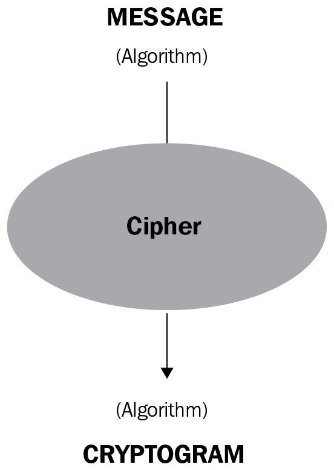

<section id="title">加密术语</section>

# 1. 算法 Algorithm

> 在数学和计算机科学中，算法algorithm是指一种良好的计算机可实现的指令的有限序列。

# 2. 加密 Cipher

> 加密说了简单一些，就是一种如何书写秘密信息的方式。它能够将明文消息（plaintext）转换为难以理解的密文（a ciphertext or cryptogram）。



# 3. 加密运算 Encryption
> 加密运算是通过应用函数 **E** 将通用消息 **message** 转换为密文 **cryptogram** 的操作。

```
message ------- > f(E) --------- > cryptogram
```

# 4. 解密运算 Decryption

> 解密运算是加密运算的一种逆操作。它通过应用函数 **D** 从密文 **cryptogram** 返回明文消息 **message** 的操作。

```
cryptogram ------- > f(D) --------- > messae
```

# 5. 单射 Injective
> 单射意味着不同的 **M** 值必须对应于不同的 **C** 值。**E** 函数必须是单射的。
