## 1. 简介和功能概述

本文介绍了**AUTOSAR**基础软件模块**ICU**驱动程序的功能、**API**和配置。

**ICU**驱动是一个使用输入捕获单元（**Input Capture Unit**）的模块，用于**PWM**信号解调、脉冲计数、频率与占空比测量、生成简单中断以及唤醒中断。

**ICU**驱动提供以下服务：

* 信号边沿通知（**signal edge notification**）
* 控制唤醒中断（**controlling wakeup interrupts**）
* 周期信号时间测量（**periodic signal time measurement**）
* 边沿时间戳（**edge time stamping**），可用于采集非周期信号
* 边沿计数（**edge counting**）

## 2. 缩略语

**Active Time**
> 取决于被捕获信号的起始边沿：起始边沿为下降沿时，**Active Time** = **Low Time**；起始边沿为上升沿时，**Active Time** = **High Time**；起始边沿为双边沿时，若先出现上升沿则 **Active Time** = **High Time**，若先出现下降沿则 **Active Time** = **Low Time**。

**DEM**
> 诊断事件管理器（**Diagnostic Event Manager**）。

**DET**
> 默认错误跟踪器（**Default Error Tracer**）。

**EcuM**
> **ECU**状态管理器（**ECU State Manager**）。

**Enumeration**
> 枚举。在**C**语言中可以是**enum**或**#define**。

**ICU**
> 输入捕获单元（**Input Capture Unit**），而非重症监护室（Intensive Care Unit）。

**ICU Channel**
> 表示绑定到一个输入信号、并为所配置测量模式提供硬件资源的逻辑**ICU**实体。

**ICU State**
> **ICU**通道的逻辑输入状态，可以是**ICU_ACTIVE**或**ICU_IDLE**。

**ICU_ACTIVE**
> **ICU**通道的输入状态，表示已检测到激活边沿。

**ICU_IDLE**
> **ICU**通道的输入状态，表示自上次调用**[Icu_GetInputState](#7310-icu_getinputstate)()**或**[Icu_Init](#731-icu_init)()**以来未检测到激活边沿。

**Symbolic name for a channel**
> 通道的符号名，是用名称对句柄的替代。通过该句柄可以在配置结构中找到每个通道及其相关属性。在**C**语言中可通过**#define**和**enum**实现。

**Wakeup event**
> 唤醒事件被理解为将导致本驱动唤醒的边沿模式。但某个模式是否有效不由本驱动判定，而应由上层判定。

## 3. 相关文档

### 3.1. 输入文件

[1] General Requirements on Basic Software Modules
> AUTOSAR_SRS_BSWGeneral.pdf

[2] General Requirements on SPAL
> AUTOSAR_SRS_SPALGeneral.pdf

[3] Specification of Standard Types
> AUTOSAR_SWS_StandardTypes.pdf

[4] List of Basic Software Modules
> AUTOSAR_TR_BSWModuleList.pdf

[5] Specification of Diagnostic Event Manager
> AUTOSAR_SWS_DiagnosticEventManager.pdf

[6] Specification of Default Error Tracer
> AUTOSAR_SWS_DefaultErrorTracer.pdf

[7] Requirements on ICU Driver
> AUTOSAR_SRS_ICUDriver.pdf

[8] Specification of ECU Configuration
> AUTOSAR_TPS_ECUConfiguration.pdf

[9] Layered Software Architecture
> AUTOSAR_EXP_LayeredSoftwareArchitecture.pdf

[10] Specification of ECU State Manager
> AUTOSAR_SWS_ECUStateManager.pdf

[11] Basic Software Module Description Template
> AUTOSAR_TPS_BSWModuleDescriptionTemplate.pdf

[12] General Specification of Basic Software Modules
> AUTOSAR_SWS_BSWGeneral.pdf

### 3.2. 相关标准和规范

[13] IEC 7498-1 The Basic Model, IEC Norm, 1994

### 3.3. 相关规范

**AUTOSAR**提供了基础软件模块的通用规范 [12] （**SWS BSW General**），该规范同样适用于**ICU**驱动程序。因此，**SWS BSW General**应被视为**ICU**驱动程序的附加和必需规范。

## 4. 约束和假设

### 4.1. 限制

无限制。

### 4.2. 汽车域的适用性

无限制。

## 5. 对其他模块的依赖

### 5.1. DET（默认错误跟踪器）

检测到的错误的详细描述见第 6.2 章错误分类及第 7 章**API**规范中各函数的说明。

### 5.2. MCU 模块

**ICU**驱动依赖系统时钟、预分频器（**prescaler**）和**PLL**。因此**ICU**定时器**tick**的时长取决于**MCU**模块中所做的时钟设置。

**ICU**驱动不会在[**Icu_Init**](#731-icu_init)函数中负责设置配置全局时钟、全局预分频器和**PLL**的寄存器，这些必须由**MCU**模块完成。**ICU**驱动仅配置本地（**ICU**外设特有的）时钟、预分频器等。

### 5.3. OS（操作系统）

**ICU**驱动使用中断，因此依赖配置中断源的**OS**。**OS**仅提供回调函数。

**ICU**驱动不会在[**Icu_Init**](#731-icu_init)函数中负责设置中断关联的寄存器，中断系统的整体分配与激活由操作系统完成。

### 5.4. PORT 模块

**ICU**输入所用端口引脚的配置由**PORT**驱动完成。因此**PORT**驱动必须在**ICU**函数使用之前完成初始化，否则**ICU**函数将表现出未定义行为。

### 5.5. EcuM 模块

**ICU**驱动负责向**EcuM**上报唤醒中断。

## 6. 功能规格

### 6.1. 一般行为

#### 6.1.1. 重入性

为确保数据一致性，**Icu**模块应提供可重入代码。除以下函数外，不同通道号的**Icu**模块函数应为可重入的：

* **[Icu_Init](#731-icu_init)()**
* **[Icu_DeInit](#732-icu_deinit)()**
* **[Icu_SetMode](#733-icu_setmode)()**
* **[Icu_GetVersionInfo](#7324-icu_getversioninfo)()**

#### 6.1.2. 模块模式

**Icu**模块有 2 种模式：

* **ICU_MODE_NORMAL**：正常运行，所有已用中断按通知请求使能。通知可由服务**[Icu_SetActivationCondition](#737-icu_setactivationcondition)()**或**IcuDefaultStartEdge**配置，并可在调用**[Icu_SetMode](#733-icu_setmode)()**之前或之后由**[Icu_DisableNotification](#738-icu_disablenotification)()**和**[Icu_EnableNotification](#739-icu_enablenotification)()**服务选择。
* **ICU_MODE_SLEEP**：降功耗运行。睡眠模式下仅提供配置为唤醒能力（**wakeup capable**）、且在**[Icu_Init](#731-icu_init)()**后通过**[Icu_EnableWakeup](#735-icu_enablewakeup)()**使能、且未被**[Icu_DisableWakeup](#734-icu_disablewakeup)()**禁用的唤醒事件。其他所有由本模块处理的中断均被禁用，事件发生时不得导致**MCU**退出降功耗模式状态（如 idle、halt）。除配置为唤醒能力并经[**Icu_EnableWakeup**](#735-icu_enablewakeup)显式使能的通道外，所有通道均停止。

#### 6.1.3. 时间单位（Tick）

由于振荡器频率、预分频器等设置由**MCU**模块和/或其他模块完成，无法据此计算时间。因此时间与**tick**之间的转换应由上层完成。**ICU**驱动**API**服务中使用的所有时间单位均为**tick**。

### 6.2. 错误分类

基础软件模块通用规范 [12] 第 7.x 章"错误处理"详细描述了基础软件的错误处理，并给出由五种错误类型组成的分类方案。在此基础上，本节规定**ICU**驱动在各子类中的具体错误。

#### 6.2.1. 开发错误

| 错误类型 | 相关错误代码 | 错误值 |
|---|---|---|
| **API**调用时传入了无效指针 | ICU_E_PARAM_POINTER | 0x0A |
| **API**使用了无效的通道标识符，或通道未针对调用**API**的功能进行配置 | ICU_E_PARAM_CHANNEL | 0x0B |
| **API**使用了无效或不可行的激活条件 | ICU_E_PARAM_ACTIVATION | 0x0C |
| 初始化函数失败 | ICU_E_INIT_FAILED | 0x0D |
| **API**使用了无效的缓冲区大小 | ICU_E_PARAM_BUFFER_SIZE | 0x0E |
| **API [Icu_SetMode](#733-icu_setmode)** 使用了无效的模式 | ICU_E_PARAM_MODE | 0x0F |
| **API**在模块未初始化时被调用 | ICU_E_UNINIT | 0x14 |
| 运行操作进行中调用 [**Icu_SetMode**](#733-icu_setmode) | ICU_E_BUSY_OPERATION | 0x16 |
| **ICU**驱动与硬件已初始化时调用 [**Icu_Init**](#731-icu_init) | ICU_E_ALREADY_INITIALIZED | 0x17 |
| 调用 [**Icu_StartTimestamp**](#7311-icu_starttimestamp) 时 **NotifyInterval** 参数无效（如 "0"，即 NotifyInterval < 1） | ICU_E_PARAM_NOTIFY_INTERVAL | 0x18 |
| 调用 [**Icu_GetVersionInfo**](#7324-icu_getversioninfo) 时 **versioninfo** 参数无效（如 **NULL**） | ICU_E_PARAM_VINFO | 0x19 |

#### 6.2.2. 运行时错误

| 错误类型 | 相关错误代码 | 错误值 |
|---|---|---|
| 在未启动或已停止的通道上调用 [**Icu_StopTimestamp**](#7312-icu_stoptimestamp) | ICU_E_NOT_STARTED | 0x15 |

#### 6.2.3. 瞬态故障

无瞬态故障。

#### 6.2.4. 生产错误

无生产错误。

#### 6.2.5. 扩展生产错误

无扩展生产错误。

## 7. API规范

### 7.1. 导入的类型

| 模块 | 头文件 | 导入类型 |
|---|---|---|
| EcuM | EcuM.h | EcuM_WakeupSourceType |
| Std | Std_Types.h | Std_ReturnType |
| Std | Std_Types.h | Std_VersionInfoType |

### 7.2. 类型定义

#### 7.2.1. Icu_ModeType

枚举类型，取值范围：

* **ICU_MODE_NORMAL**（0x00）：正常运行，所有已用中断按通知请求使能。
* **ICU_MODE_SLEEP**（0x01）：降功耗运行，睡眠模式下仅提供配置为唤醒能力的通知。

用于使能/禁用**ECU**唤醒所不需要的所有中断。可通过**Icu.h**使用。

#### 7.2.2. Icu_ChannelType

类型，派生自**uint**。取值范围为实现相关，但并非所有值在该类型内都有效；应选择在特定微控制器平台上最高效的实现。**ICU**通道的数字标识符。可通过**Icu.h**使用。

#### 7.2.3. Icu_InputStateType

枚举类型，取值范围：

* **ICU_ACTIVE**（0x00）：已检测到激活边沿。
* **ICU_IDLE**（0x01）：自上次调用**[Icu_GetInputState](#7310-icu_getinputstate)()**或**[Icu_Init](#731-icu_init)()**以来未检测到激活边沿。

**ICU**通道的输入状态。可通过**Icu.h**使用。

#### 7.2.4. Icu_ConfigType

结构类型。硬件和实现相关的结构，初始化数据结构的内容与微控制器相关。该类型包含初始化数据。可通过**Icu.h**使用。

若**Icu_ConfigType**中每个通道定义为唤醒能力（**wakeup capable**），则用于校验唤醒原因的函数应为**EcuM_CheckWakeup**。

#### 7.2.5. Icu_ActivationType

枚举类型，取值范围：

* **ICU_RISING_EDGE**（0x00）：**ICU**输入信号出现上升沿时执行相应动作。
* **ICU_FALLING_EDGE**（0x01）：**ICU**输入信号出现下降沿时执行相应动作。
* **ICU_BOTH_EDGES**（0x02）：**ICU**输入信号出现上升沿或下降沿时执行相应动作。

定义**ICU**通道的激活类型。可通过**Icu.h**使用。

#### 7.2.6. Icu_ValueType

类型，派生自**uint**。取值范围为 0 至定时器寄存器宽度，实现相关；应选择在特定微控制器平台上最高效的实现。时间戳**tick**和所测经过时间**tick**的缓冲区宽度。可通过**Icu.h**使用。

#### 7.2.7. Icu_DutyCycleType

结构类型，元素：

* **ActiveTime**：类型[**Icu_ValueType**](#726-icu_valuetype)，通道上测得的一致性有效时间（**coherent active-time**）。
* **PeriodTime**：类型[**Icu_ValueType**](#726-icu_valuetype)，通道上测得的一致性周期时间（**coherent period-time**）。

包含计算占空比所需值的类型。可通过**Icu.h**使用。

#### 7.2.8. Icu_IndexType

类型，派生自**uint**。取值范围为实现相关；应选择在特定微控制器平台上最高效的实现。用于抽象服务**[Icu_GetTimestampIndex](#7313-icu_gettimestampindex)()**的返回值。由于支持环形缓冲区处理，且[**Icu_GetTimestampIndex**](#7313-icu_gettimestampindex)可返回"0"作为合法真值（而非错误），**Icu_IndexType**可实现为取值 1..xyz。可通过**Icu.h**使用。

#### 7.2.9. Icu_EdgeNumberType

类型，派生自**uint**。取值范围为实现相关；应选择在特定微控制器平台上最高效的实现。用于抽象服务**[Icu_GetEdgeNumbers](#7319-icu_getedgenumbers)()**的返回值。可通过**Icu.h**使用。

#### 7.2.10. Icu_MeasurementModeType

枚举类型，取值范围：

* **ICU_MODE_SIGNAL_EDGE_DETECT**（0x00）：边沿检测模式。
* **ICU_MODE_SIGNAL_MEASUREMENT**（0x01）：测量各种可配置边沿之间不同时间的模式。
* **ICU_MODE_TIMESTAMP**（0x02）：在可配置边沿捕获定时器值的模式。
* **ICU_MODE_EDGE_COUNTER**（0x03）：在可配置边沿计数的模式。

定义测量模式类型。可通过**Icu.h**使用。

#### 7.2.11. Icu_SignalMeasurementPropertyType

枚举类型，取值范围：

* **ICU_LOW_TIME**（0x00）：通道配置为读取经过的信号低电平时间。
* **ICU_HIGH_TIME**（0x01）：通道配置为读取经过的信号高电平时间。
* **ICU_PERIOD_TIME**（0x02）：通道配置为读取经过的信号周期时间。
* **ICU_DUTY_CYCLE**（0x03）：通道配置为读取计算占空比所需的值（一致的有效时间与周期时间）。

定义测量属性类型。可通过**Icu.h**使用。

#### 7.2.12. Icu_TimestampBufferType

枚举类型，取值范围：

* **ICU_LINEAR_BUFFER**（0x00）：缓冲区仅填充一次。
* **ICU_CIRCULAR_BUFFER**（0x01）：到达缓冲区末尾后，驱动从缓冲区起始处重新开始。

定义时间戳测量属性类型。可通过**Icu.h**使用。

### 7.3. 函数定义

以下为提供给上层模块的函数列表。

#### 7.3.1. Icu_Init

**说明**: 初始化驱动。用**ConfigPtr**参数所引用结构中的值初始化已配置硬件的所有相关寄存器（含清除挂起的中断标志）。初始化后：所有通知被禁用、所有通道的唤醒能力被禁用、所有已用**ICU**通道状态置为**ICU_IDLE**、模块模式置为**ICU_MODE_NORMAL**。若开发错误检测使能且驱动与硬件已初始化时调用本函数，则上报开发错误[**ICU_E_ALREADY_INITIALIZED**](#621-开发错误)并不做任何动作返回。本函数不可重入。本服务为同步调用，可通过**Icu.h**获得。

```C
void Icu_Init ( const Icu_ConfigType* ConfigPtr )
```

#### 7.3.2. Icu_DeInit

**说明**: 将**ICU**模块去初始化：把配置使用的外设状态设置为与上电复位后相同（只读寄存器除外），仅影响静态配置和/或上次**[Icu_Init](#731-icu_init)()**传入的运行时配置所分配的外设；禁用所有已用中断和通知。重新初始化**ICU**模块需先执行**Icu_DeInit()**再执行**[Icu_Init](#731-icu_init)()**。本函数可通过配置参数**IcuDeInitApi**进行编译期/运行期**ON/OFF**配置，不可重入。本服务为同步调用，可通过**Icu.h**获得。

```C
void Icu_DeInit ( void )
```

#### 7.3.3. Icu_SetMode

**说明**: 将**ICU**模块设置为给定模式（**ICU_MODE_NORMAL**或**ICU_MODE_SLEEP**），影响各**ICU**通道的功能，因此模块模式切换必须与**ECU**整体状态兼容。本函数可通过配置参数**IcuSetModeApi**进行编译期**ON/OFF**配置，不可重入。若开发错误检测使能且**Mode**参数超出配置允许范围，则上报[**ICU_E_PARAM_MODE**](#621-开发错误)。本服务为同步调用，可通过**Icu.h**获得。

```C
void Icu_SetMode ( Icu_ModeType Mode )
```

#### 7.3.4. Icu_DisableWakeup

**说明**: 禁用单个**ICU**通道的唤醒能力，仅对静态配置为唤醒能力（**wakeup capable**）为真的通道有效。本函数所做设置仅在设置**ICU_MODE_SLEEP**后相关。可通过配置参数**IcuDisableWakeupApi**进行编译期**ON/OFF**配置，可重入。本服务为同步调用，可通过**Icu.h**获得。

```C
void Icu_DisableWakeup ( Icu_ChannelType Channel )
```

#### 7.3.5. Icu_EnableWakeup

**说明**: 重新使能给定**ICU**通道的唤醒能力，仅对静态配置为唤醒能力为真的通道可行；需再调用请求**ICU_MODE_SLEEP**的[**Icu_SetMode**](#733-icu_setmode)方使选择生效。可通过配置参数**IcuEnableWakeupApi**进行编译期**ON/OFF**配置，可重入。本服务为同步调用，可通过**Icu.h**获得。

```C
void Icu_EnableWakeup ( Icu_ChannelType Channel )
```

#### 7.3.6. Icu_CheckWakeup

**说明**: 检查某个唤醒能力**ICU**通道是否为唤醒事件的源，若为有效的**ICU**通道唤醒事件，则调用**ECU**状态管理器服务**EcuM_SetWakeupEvent**。仅当**IcuReportWakeupSource**静态配置为可用时本函数才可行。可通过配置参数**IcuWakeupFunctionalityApi**进行编译期**ON/OFF**配置，可重入（限于**ICU050**）。本服务为同步调用，可通过**Icu.h**获得。

```C
void Icu_CheckWakeup ( EcuM_WakeupSourceType WakeupSource )
```

#### 7.3.7. Icu_SetActivationCondition

**说明**: 为给定通道设置激活边沿（**ICU_RISING_EDGE**/**ICU_FALLING_EDGE**/**ICU_BOTH_EDGES**，若硬件支持），支持配置为**ICU_MODE_SIGNAL_EDGE_DETECT**、**ICU_MODE_TIMESTAMP**、**ICU_MODE_EDGE_COUNTER**测量模式的通道，并将给定通道状态复位为**ICU_IDLE**。可重入。本服务为同步调用，可通过**Icu.h**获得。

```C
void Icu_SetActivationCondition ( 
    Icu_ChannelType Channel, Icu_ActivationType Activation )
```

#### 7.3.8. Icu_DisableNotification

**说明**: 禁用给定通道的通知。可重入。本服务为同步调用，可通过**Icu.h**获得。

```C
void Icu_DisableNotification ( Icu_ChannelType Channel )
```

#### 7.3.9. Icu_EnableNotification

**说明**: 使能给定通道的通知。可重入。本服务为同步调用，可通过**Icu.h**获得。

```C
void Icu_EnableNotification ( Icu_ChannelType Channel )
```

#### 7.3.10. Icu_GetInputState

**说明**: 返回**ICU**输入的状态。仅支持配置为**ICU_MODE_SIGNAL_EDGE_DETECT**或**ICU_MODE_SIGNAL_MEASUREMENT**测量模式的通道。检测到激活边沿时对边沿检测通道返回**ICU_ACTIVE**；对于信号测量，通道应直到测量完成且驱动能提供输入信号有用信息时才置为**ICU_ACTIVE**。一旦返回**ICU_ACTIVE**，存储的状态即置为**ICU_IDLE**直至检测到下一个边沿。可通过配置参数**IcuGetInputStateApi**进行编译期**ON/OFF**配置，可重入。本服务为同步调用，可通过**Icu.h**获得。

```C
Icu_InputStateType Icu_GetInputState ( Icu_ChannelType Channel )
```

#### 7.3.11. Icu_StartTimestamp

**说明**: 从缓冲区起始处开始在边沿上捕获定时器值到外部缓冲区。捕获边沿由服务**[Icu_SetActivationCondition](#737-icu_setactivationcondition)()**激活（上升/下降/双边沿）。若配置环形缓冲区处理，到达缓冲区末尾时从起始处重新开始；若配置线性缓冲区处理，到达末尾时停止捕获。仅在配置了通知函数、通知已通过**[Icu_EnableNotification](#739-icu_enablenotification)()**使能、**NotifyInterval**大于"0"且已捕获**NotifyInterval**指定数量的事件时，才调用通知函数。本函数仅在**ICU_MODE_TIMESTAMP**测量模式下可用，可通过配置参数**ICU_TIMESTAMP_API**进行编译期**ON/OFF**配置，可重入。本服务为异步调用，可通过**Icu.h**获得。

```C
void Icu_StartTimestamp ( 
    Icu_ChannelType Channel, Icu_ValueType* BufferPtr, 
    uint16 BufferSize, uint16 NotifyInterval )
```

#### 7.3.12. Icu_StopTimestamp

**说明**: 停止给定通道的时间戳测量。仅在**ICU_MODE_TIMESTAMP**测量模式下可用，可通过配置参数**IcuTimestampApi**进行编译期**ON/OFF**配置。生产模式下通道未激活（未启动或已停止）时不返回错误。可重入。本服务为同步调用，可通过**Icu.h**获得。

```C
void Icu_StopTimestamp ( Icu_ChannelType Channel )
```

#### 7.3.13. Icu_GetTimestampIndex

**说明**: 读取给定通道的时间戳索引，即下一个待写入位置的索引。在调用**[Icu_StartTimestamp](#7311-icu_starttimestamp)()**之前（无缓冲区定义）调用本服务返回"0"。仅在**ICU_MODE_TIMESTAMP**测量模式下可用，可通过配置参数**IcuTimestampApi**进行编译期**ON/OFF**配置，可重入。本服务为同步调用，可通过**Icu.h**获得。

```C
Icu_IndexType Icu_GetTimestampIndex ( Icu_ChannelType Channel )
```

#### 7.3.14. Icu_ResetEdgeCount

**说明**: 将计得的边沿数值复位为零。可通过配置参数**ICU_EDGE_COUNT_API**进行编译期**ON/OFF**配置，可重入。本服务为同步调用，可通过**Icu.h**获得。

```C
void Icu_ResetEdgeCount ( Icu_ChannelType Channel )
```

#### 7.3.15. Icu_EnableEdgeCount

**说明**: 使能给定通道的边沿计数（本服务自身不做实际计数），仅计数配置的边沿（上升/下降/双边沿，即**[Icu_Init](#731-icu_init)()**后的默认边沿或**[Icu_SetActivationCondition](#737-icu_setactivationcondition)()**设置的边沿）。对**Edge Counter**测量模式下的每个**ICU**通道可用，可通过配置参数**ICU_EDGE_COUNT_API**进行编译期**ON/OFF**配置，可重入。本服务为同步调用，可通过**Icu.h**获得。

```C
void Icu_EnableEdgeCount ( Icu_ChannelType Channel )
```

#### 7.3.16. Icu_EnableEdgeDetection

**说明**: 使能/重新使能给定通道的边沿检测，仅检测配置的边沿（上升/下降/双边沿）。对**Edge Detection**测量模式下的每个**ICU**通道可用，可通过配置参数**IcuEdgeDetectApi**进行编译期**ON/OFF**配置，可重入。本服务为同步调用，可通过**Icu.h**获得。

```C
void Icu_EnableEdgeDetection ( Icu_ChannelType Channel )
```

#### 7.3.17. Icu_DisableEdgeDetection

**说明**: 禁用给定通道的边沿检测。可通过配置参数**IcuEdgeDetectApi**进行编译期**ON/OFF**配置，可重入。本服务为同步调用，可通过**Icu.h**获得。

```C
void Icu_DisableEdgeDetection ( Icu_ChannelType Channel )
```

#### 7.3.18. Icu_DisableEdgeCount

**说明**: 禁用给定通道的边沿计数（复位边沿计数器请使用服务**[Icu_ResetEdgeCount](#7314-icu_resetedgecount)()**）。可通过配置参数**IcuEdgeCountApi**进行编译期**ON/OFF**配置，可重入。本服务为同步调用，可通过**Icu.h**获得。

```C
void Icu_DisableEdgeCount ( Icu_ChannelType Channel )
```

#### 7.3.19. Icu_GetEdgeNumbers

**说明**: 读取自上次调用**[Icu_ResetEdgeCount](#7314-icu_resetedgecount)()**以来计得的边沿数量。可通过配置参数**ICU_EDGE_COUNT_API**进行编译期**ON/OFF**配置，可重入。本服务为同步调用，可通过**Icu.h**获得。

```C
Icu_EdgeNumberType Icu_GetEdgeNumbers ( Icu_ChannelType Channel )
```

#### 7.3.20. Icu_StartSignalMeasurement

**说明**: 从调用本服务后最先出现的配置默认起始边沿开始，启动信号测量，并将给定通道状态复位为**ICU_IDLE**。仅在**ICU_MODE_SIGNAL_MEASUREMENT**测量模式下可用，可通过配置参数**IcuSignalMeasurementApi**进行编译期**ON/OFF**配置，可重入。本服务为异步调用，可通过**Icu.h**获得。

```C
void Icu_StartSignalMeasurement ( Icu_ChannelType Channel )
```

#### 7.3.21. Icu_StopSignalMeasurement

**说明**: 停止给定通道的信号测量。仅在**ICU_MODE_SIGNAL_MEASUREMENT**测量模式下可用，可通过配置参数**IcuSignalMeasurementApi**进行编译期**ON/OFF**配置，可重入。本服务为同步调用，可通过**Icu.h**获得。

```C
void Icu_StopSignalMeasurement ( Icu_ChannelType Channel )
```

#### 7.3.22. Icu_GetTimeElapsed

**说明**: 读取给定通道经过的时间，具体取决于通道所配置的测量模式与测量属性：低电平时间（下降沿与相邻上升沿之间）、高电平时间（上升沿与相邻下降沿之间）或周期时间（相邻上升沿或下降沿之间，周期起始边沿可配置）。尚未捕获到请求的时间、捕获正在进行未完成、或已返回过的捕获值被再次读取时返回"0"。可通过配置参数**IcuGetTimeElapsedApi**进行编译期**ON/OFF**配置，可重入。本服务为同步调用，可通过**Icu.h**获得。

```C
Icu_ValueType Icu_GetTimeElapsed ( Icu_ChannelType Channel )
```

#### 7.3.23. Icu_GetDutyCycleValues

**说明**: 为给定**ICU**通道读取一致的有效时间与周期时间（配置为"Signal Measurement, Duty Cycle Values"测量模式时），结果（高电平时间与周期时间）写入**DutyCycleValues**指向的缓冲区。尚未捕获到一致的有效/周期时间、捕获正在进行未完成、或已返回过的值被再次读取时返回"0"。可通过配置参数**IcuGetDutyCycleValuesApi**进行编译期**ON/OFF**配置，可重入。本服务为同步调用，可通过**Icu.h**获得。

```C
void Icu_GetDutyCycleValues ( 
    Icu_ChannelType Channel, Icu_DutyCycleType* DutyCycleValues )
```

#### 7.3.24. Icu_GetVersionInfo

**说明**: 返回本模块的版本信息（写入**versioninfo**指向的位置）。若开发错误检测使能且**versioninfo**参数为**NULL**，则上报开发错误[**ICU_E_PARAM_VINFO**](#621-开发错误)。可重入。本服务为同步调用，可通过**Icu.h**获得。

```C
void Icu_GetVersionInfo ( Std_VersionInfoType* versioninfo )
```

#### 7.3.25. Icu_DisableNotificationAsync

**说明**: 禁用给定通道的通知。可重入（限于**ICU050**）。本服务为异步调用，可通过**Icu.h**获得。

```C
void Icu_DisableNotificationAsync ( Icu_ChannelType Channel )
```

#### 7.3.26. Icu_EnableNotificationAsync

**说明**: 使能给定通道的通知。可重入（限于**ICU050**）。本服务为异步调用，可通过**Icu.h**获得。

```C
void Icu_EnableNotificationAsync ( Icu_ChannelType Channel )
```

### 7.4. 回调通知

由于**ICU**是驱动模块，不向下层模块提供任何回调函数。


### 7.5. 预期接口

#### 7.5.1. 必需接口

| API 函数 | 头文件 | 描述 |
|---|---|---|
| Det_ReportRuntimeError | Det.h | 上报运行时错误的服务。若配置了回调（**callout**），则调用该回调。 |

#### 7.5.2. 可选接口

| API 函数 | 头文件 | 描述 |
|---|---|---|
| Det_ReportError | Det.h | 上报开发错误的服务。 |
| EcuM_CheckWakeup | EcuM.h | 检查给定唤醒源，将参数传给集成函数**EcuM_CheckWakeupHook**；也可由唤醒源的中断服务程序调用以建立**PLL**并检查可能连接到同一中断的其他唤醒源。 |
| EcuM_SetWakeupEvent | EcuM.h | 设置唤醒事件。 |

当以下条件全部满足时，将调用服务**EcuM_CheckWakeup**：

* 静态配置参数**IcuReportWakeupSource**设置为"ON"；
* 模块处于**ICU_MODE_SLEEP**模式；
* 唤醒能力**ICU**通道上发生唤醒事件。

**EcuM_CheckWakeup**应在唤醒能力通道的唤醒事件所对应的中断服务程序内被调用。提供唤醒事件的中断服务程序应在硬件需要时负责清除中断标志。

#### 7.5.3. 可配置接口

以下接口的目标函数可配置（通常为回调函数），名称不固定。中断服务程序应在硬件需要时清除中断标志，并调用相应的通知函数。**Icu**通知函数可在初始化数据结构（[**Icu_ConfigType**](#724-icu_configtype)）中配置为函数指针，且应无参数、无返回值。

**Icu_SignalNotification_\<Channel\>**

**说明**: 根据最近一次[**Icu_EnableNotification**](#739-icu_enablenotification)的调用，当请求的信号边沿（上升/下降/双边沿）出现时（每个边沿一次）调用此通知函数。可通过**Icu_Externals.h**获得。本服务为同步调用。

```C
void Icu_SignalNotification_<Channel> ( void )
```

**Icu_TimestampNotification_\<Channel\>**

**说明**: 当已获取到请求数量的时间戳（**Notification interval > 0**）且通知已通过**[Icu_EnableNotification](#739-icu_enablenotification)()**使能时，调用此通知函数。该通知依赖预处理开关**IcuTimestampApi**。可通过**Icu_Externals.h**获得。本服务为同步调用。

```C
void Icu_TimestampNotification_<Channel> ( void )
```

## 8. 时序图

> 以下时序图按 **AUTOSAR_SWS_ICUDriver**（R22-11）第 9 章绘制，参与方包括**ICU**用户（如软件组件）、**Icu**驱动、**EcuM**（**ECU**状态管理器）、**ICU**输入通道、硬件/应用缓冲区及中断服务程序（**ISR**）。

### 8.1. Icu_Init

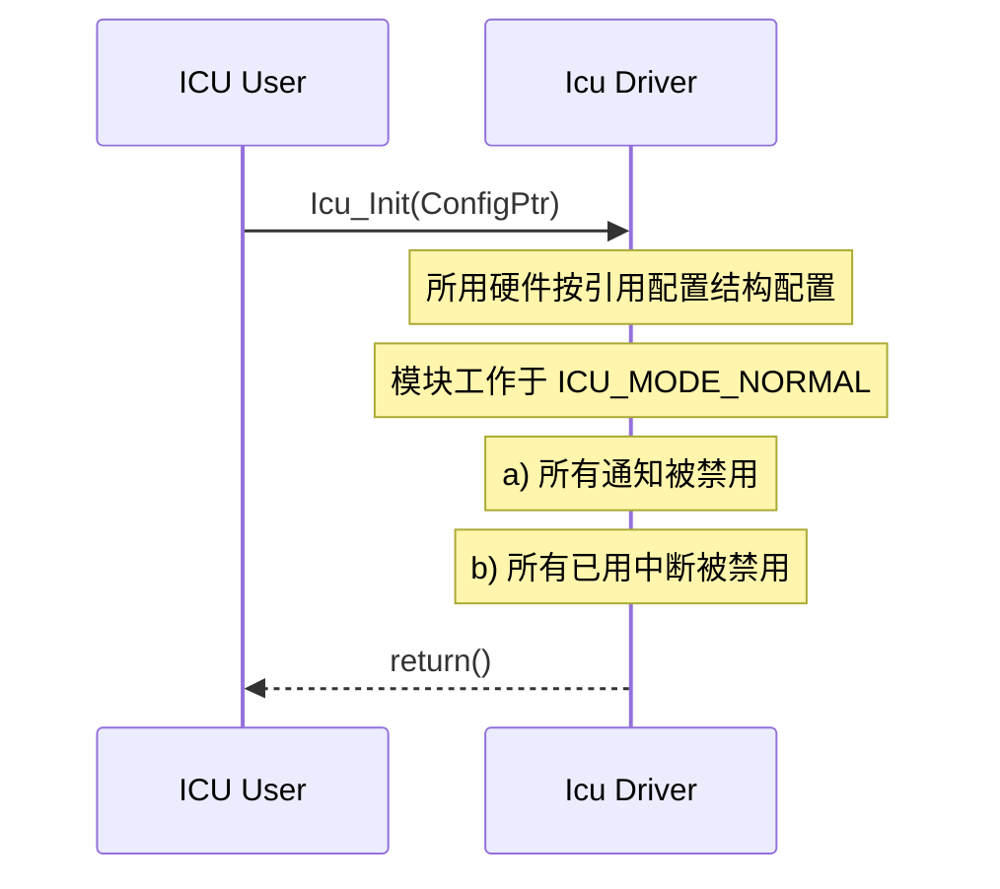
```mermaid
sequenceDiagram
    participant U as ICU User
    participant D as Icu Driver
    U->>D: Icu_Init(ConfigPtr)
    Note over D: 所用硬件按引用配置结构配置
    Note over D: 模块工作于 ICU_MODE_NORMAL
    Note over D: a) 所有通知被禁用
    Note over D: b) 所有已用中断被禁用
    D-->>U: return()
```

### 8.2. Icu_DeInit

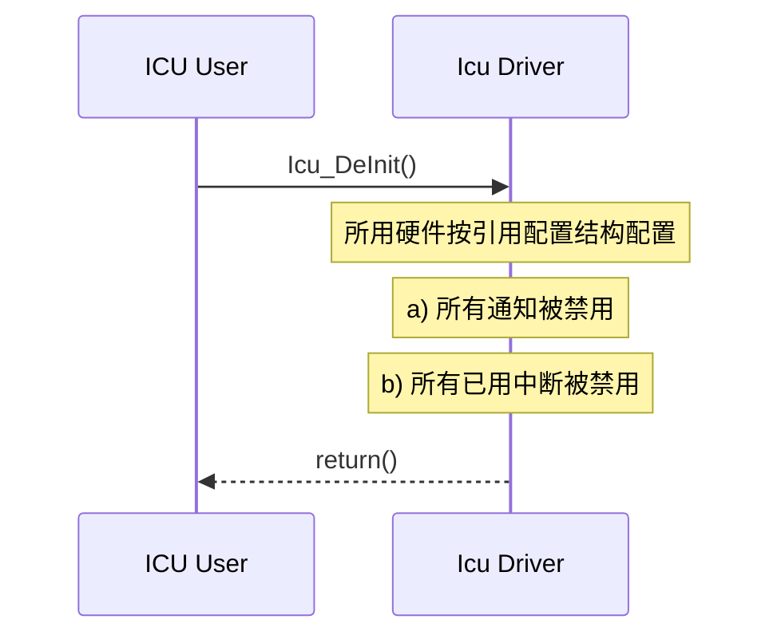
```mermaid
sequenceDiagram
    participant U as ICU User
    participant D as Icu Driver
    U->>D: Icu_DeInit()
    Note over D: 所用硬件按引用配置结构配置
    Note over D: a) 所有通知被禁用
    Note over D: b) 所有已用中断被禁用
    D-->>U: return()
```

### 8.3. Check Wakeup Events

**ICU**的唤醒事件检查时序图见**ECU**状态管理器规范 [10]（AUTOSAR_SWS_ECUStateManager.pdf），本文档不重复给出。

### 8.4. Icu_SetMode

初始条件：**ICU**驱动已初始化——a) 模块工作于**ICU_MODE_NORMAL**；b) 通知禁用；c) 通道 #1 非唤醒能力；d) 通道 #2 唤醒能力；e) 见各图。通道 #1 与 #2 输入信号均为低电平。

#### 8.4.1. SLEEP 模式下通知使能（IcuReportWakeupSource = ON）

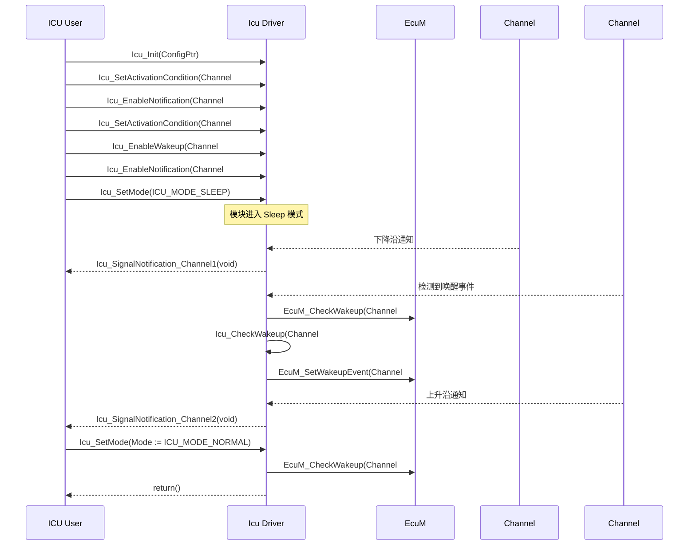
```mermaid
sequenceDiagram
    participant U as ICU User
    participant D as Icu Driver
    participant E as EcuM
    participant C1 as Channel #1
    participant C2 as Channel #2
    U->>D: Icu_Init(ConfigPtr)
    U->>D: Icu_SetActivationCondition(Channel #1, ICU_FALLING_EDGE)
    U->>D: Icu_EnableNotification(Channel #1)
    U->>D: Icu_SetActivationCondition(Channel #2, ICU_RISING_EDGE)
    U->>D: Icu_EnableWakeup(Channel #2)
    U->>D: Icu_EnableNotification(Channel #2)
    U->>D: Icu_SetMode(ICU_MODE_SLEEP)
    Note over D: 模块进入 Sleep 模式
    C1-->>D: 下降沿通知
    D-->>U: Icu_SignalNotification_Channel1(void)
    C2-->>D: 检测到唤醒事件
    D->>E: EcuM_CheckWakeup(Channel #2)
    D->>D: Icu_CheckWakeup(Channel #2)
    D->>E: EcuM_SetWakeupEvent(Channel #2)
    C2-->>D: 上升沿通知
    D-->>U: Icu_SignalNotification_Channel2(void)
    U->>D: Icu_SetMode(Mode := ICU_MODE_NORMAL)
    D->>E: EcuM_CheckWakeup(Channel #2)
    D-->>U: return()
```

#### 8.4.2. SLEEP 模式下不报告唤醒源（IcuReportWakeupSource = OFF）

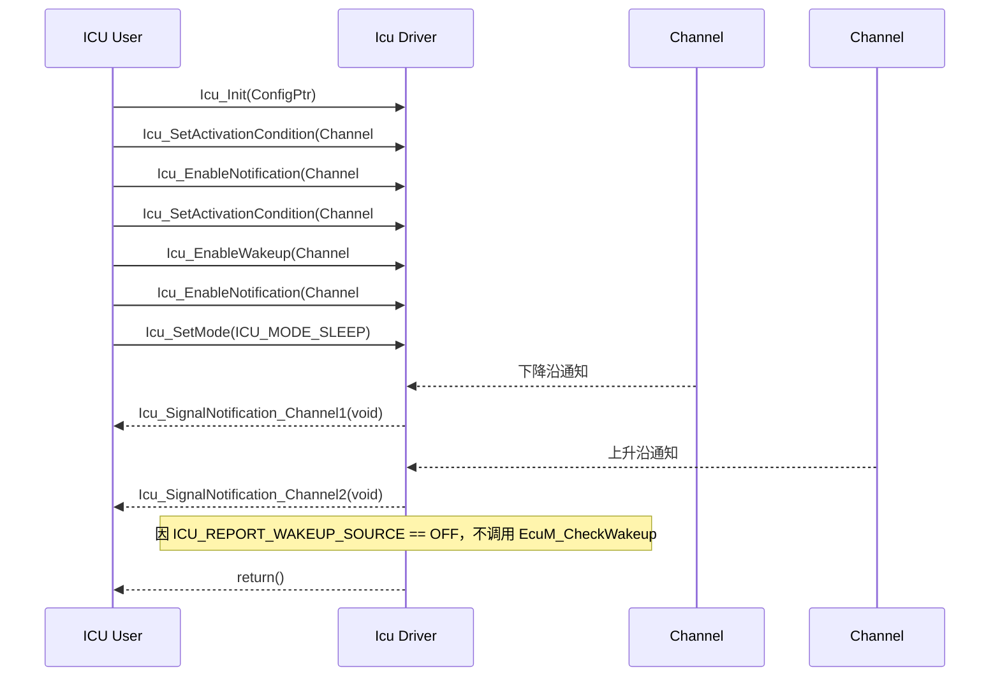
```mermaid
sequenceDiagram
    participant U as ICU User
    participant D as Icu Driver
    participant C1 as Channel #1
    participant C2 as Channel #2
    U->>D: Icu_Init(ConfigPtr)
    U->>D: Icu_SetActivationCondition(Channel #1, ICU_FALLING_EDGE)
    U->>D: Icu_EnableNotification(Channel #1)
    U->>D: Icu_SetActivationCondition(Channel #2, ICU_RISING_EDGE)
    U->>D: Icu_EnableWakeup(Channel #2)
    U->>D: Icu_EnableNotification(Channel #2)
    U->>D: Icu_SetMode(ICU_MODE_SLEEP)
    C1-->>D: 下降沿通知
    D-->>U: Icu_SignalNotification_Channel1(void)
    C2-->>D: 上升沿通知
    D-->>U: Icu_SignalNotification_Channel2(void)
    Note over D: 因 ICU_REPORT_WAKEUP_SOURCE == OFF，不调用 EcuM_CheckWakeup
    D-->>U: return()
```

#### 8.4.3. SLEEP 模式下边沿通知被禁用（IcuReportWakeupSource = ON）

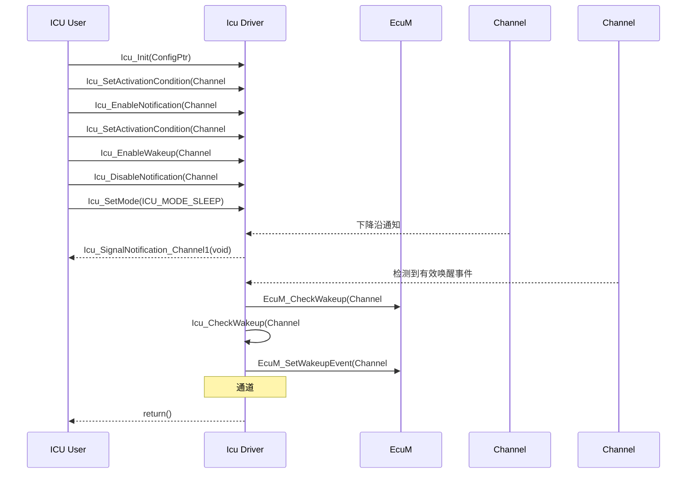
```mermaid
sequenceDiagram
    participant U as ICU User
    participant D as Icu Driver
    participant E as EcuM
    participant C1 as Channel #1
    participant C2 as Channel #2
    U->>D: Icu_Init(ConfigPtr)
    U->>D: Icu_SetActivationCondition(Channel #1, ICU_FALLING_EDGE)
    U->>D: Icu_EnableNotification(Channel #1)
    U->>D: Icu_SetActivationCondition(Channel #2, ICU_RISING_EDGE)
    U->>D: Icu_EnableWakeup(Channel #2)
    U->>D: Icu_DisableNotification(Channel #2)
    U->>D: Icu_SetMode(ICU_MODE_SLEEP)
    C1-->>D: 下降沿通知
    D-->>U: Icu_SignalNotification_Channel1(void)
    C2-->>D: 检测到有效唤醒事件
    D->>E: EcuM_CheckWakeup(Channel #2)
    D->>D: Icu_CheckWakeup(Channel #2)
    D->>E: EcuM_SetWakeupEvent(Channel #2)
    Note over D: 通道 #2 上升沿通知已禁用，故不调用其通知
    D-->>U: return()
```

#### 8.4.4. SLEEP 模式下通知未使能（IcuReportWakeupSource = ON）

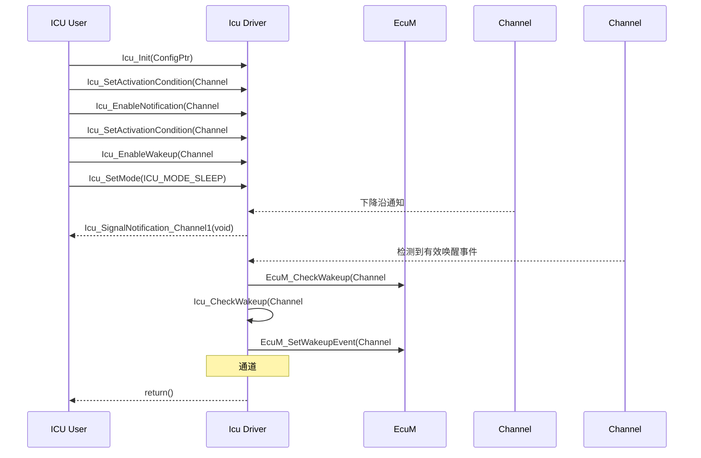
```mermaid
sequenceDiagram
    participant U as ICU User
    participant D as Icu Driver
    participant E as EcuM
    participant C1 as Channel #1
    participant C2 as Channel #2
    U->>D: Icu_Init(ConfigPtr)
    U->>D: Icu_SetActivationCondition(Channel #1, ICU_FALLING_EDGE)
    U->>D: Icu_EnableNotification(Channel #1)
    U->>D: Icu_SetActivationCondition(Channel #2, ICU_RISING_EDGE)
    U->>D: Icu_EnableWakeup(Channel #2)
    U->>D: Icu_SetMode(ICU_MODE_SLEEP)
    C1-->>D: 下降沿通知
    D-->>U: Icu_SignalNotification_Channel1(void)
    C2-->>D: 检测到有效唤醒事件
    D->>E: EcuM_CheckWakeup(Channel #2)
    D->>D: Icu_CheckWakeup(Channel #2)
    D->>E: EcuM_SetWakeupEvent(Channel #2)
    Note over D: 通道 #2 通知未使能，故不调用其上升沿通知
    D-->>U: return()
```

### 8.5. Icu_DisableWakeup

初始条件：**ICU**驱动已初始化——a) 模块工作于**ICU_MODE_NORMAL**；b) 通道 #1 唤醒能力，默认起始边沿 = **ICU_RISING_EDGE**；c) 通道 #2 唤醒能力，默认起始边沿 = **ICU_RISING_EDGE**；d) 通道 #1 唤醒通知禁用；e) 通道 #2 唤醒通知禁用；f) **ICU_NOTIFY_WAKEUP_REASON = ON**。两通道输入信号均为低电平。

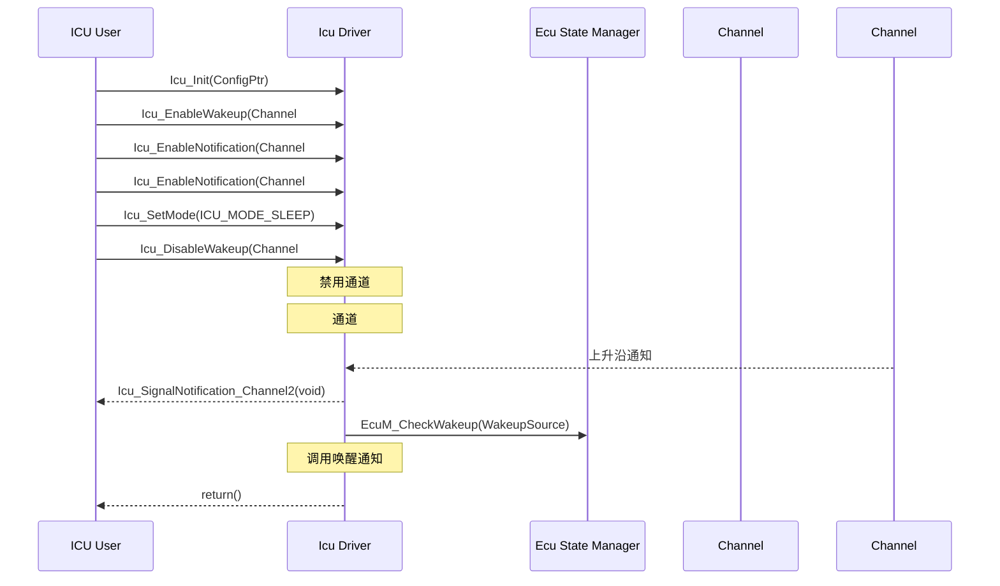
```mermaid
sequenceDiagram
    participant U as ICU User
    participant D as Icu Driver
    participant E as Ecu State Manager
    participant C1 as Channel #1
    participant C2 as Channel #2
    U->>D: Icu_Init(ConfigPtr)
    U->>D: Icu_EnableWakeup(Channel #1)
    U->>D: Icu_EnableNotification(Channel #1)
    U->>D: Icu_EnableNotification(Channel #2)
    U->>D: Icu_SetMode(ICU_MODE_SLEEP)
    U->>D: Icu_DisableWakeup(Channel #1)
    Note over D: 禁用通道 #1 唤醒能力的请求已存储
    Note over D: 通道 #1 唤醒能力将被禁用
    C2-->>D: 上升沿通知
    D-->>U: Icu_SignalNotification_Channel2(void)
    D->>E: EcuM_CheckWakeup(WakeupSource)
    Note over D: 调用唤醒通知
    D-->>U: return()
```

### 8.6. Icu_EnableWakeup

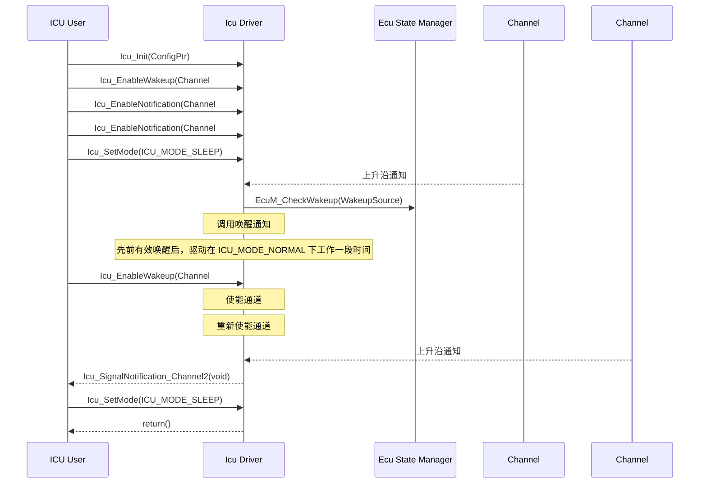
```mermaid
sequenceDiagram
    participant U as ICU User
    participant D as Icu Driver
    participant E as Ecu State Manager
    participant C1 as Channel #1
    participant C2 as Channel #2
    U->>D: Icu_Init(ConfigPtr)
    U->>D: Icu_EnableWakeup(Channel #1)
    U->>D: Icu_EnableNotification(Channel #1)
    U->>D: Icu_EnableNotification(Channel #2)
    U->>D: Icu_SetMode(ICU_MODE_SLEEP)
    C1-->>D: 上升沿通知
    D->>E: EcuM_CheckWakeup(WakeupSource)
    Note over D: 调用唤醒通知
    Note over D: 先前有效唤醒后，驱动在 ICU_MODE_NORMAL 下工作一段时间
    U->>D: Icu_EnableWakeup(Channel #2)
    Note over D: 使能通道 #2 唤醒能力的请求已存储
    Note over D: 重新使能通道 #1 的唤醒能力
    C2-->>D: 上升沿通知
    D-->>U: Icu_SignalNotification_Channel2(void)
    U->>D: Icu_SetMode(ICU_MODE_SLEEP)
    D-->>U: return()
```

### 8.7. Icu_SetActivationCondition

初始条件：**ICU**驱动已初始化，通道 #1 唤醒能力，默认起始边沿 = **ICU_BOTH_EDGES**。

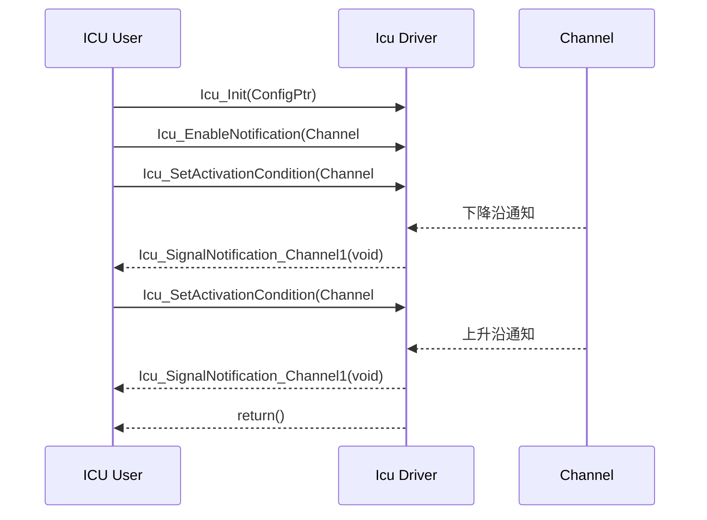
```mermaid
sequenceDiagram
    participant U as ICU User
    participant D as Icu Driver
    participant C1 as Channel #1
    U->>D: Icu_Init(ConfigPtr)
    U->>D: Icu_EnableNotification(Channel #1)
    U->>D: Icu_SetActivationCondition(Channel #1, ICU_FALLING_EDGE)
    C1-->>D: 下降沿通知
    D-->>U: Icu_SignalNotification_Channel1(void)
    U->>D: Icu_SetActivationCondition(Channel #1, ICU_RISING_EDGE)
    C1-->>D: 上升沿通知
    D-->>U: Icu_SignalNotification_Channel1(void)
    D-->>U: return()
```

### 8.8. Icu_DisableNotification

初始条件：**ICU**驱动已初始化，通道 #1 唤醒能力，默认起始边沿 = **ICU_BOTH_EDGES**。

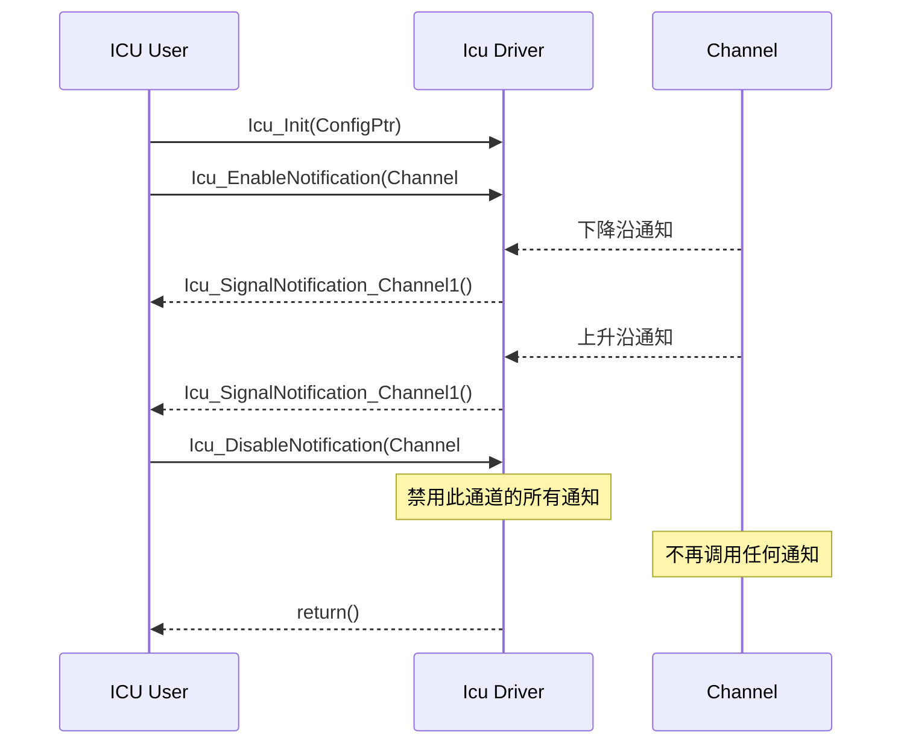
```mermaid
sequenceDiagram
    participant U as ICU User
    participant D as Icu Driver
    participant C1 as Channel #1
    U->>D: Icu_Init(ConfigPtr)
    U->>D: Icu_EnableNotification(Channel #1)
    C1-->>D: 下降沿通知
    D-->>U: Icu_SignalNotification_Channel1()
    C1-->>D: 上升沿通知
    D-->>U: Icu_SignalNotification_Channel1()
    U->>D: Icu_DisableNotification(Channel #1)
    Note over D: 禁用此通道的所有通知
    Note over C1: 不再调用任何通知
    D-->>U: return()
```

### 8.9. Icu_EnableNotification

#### 8.9.1. 使能通道的边沿通知

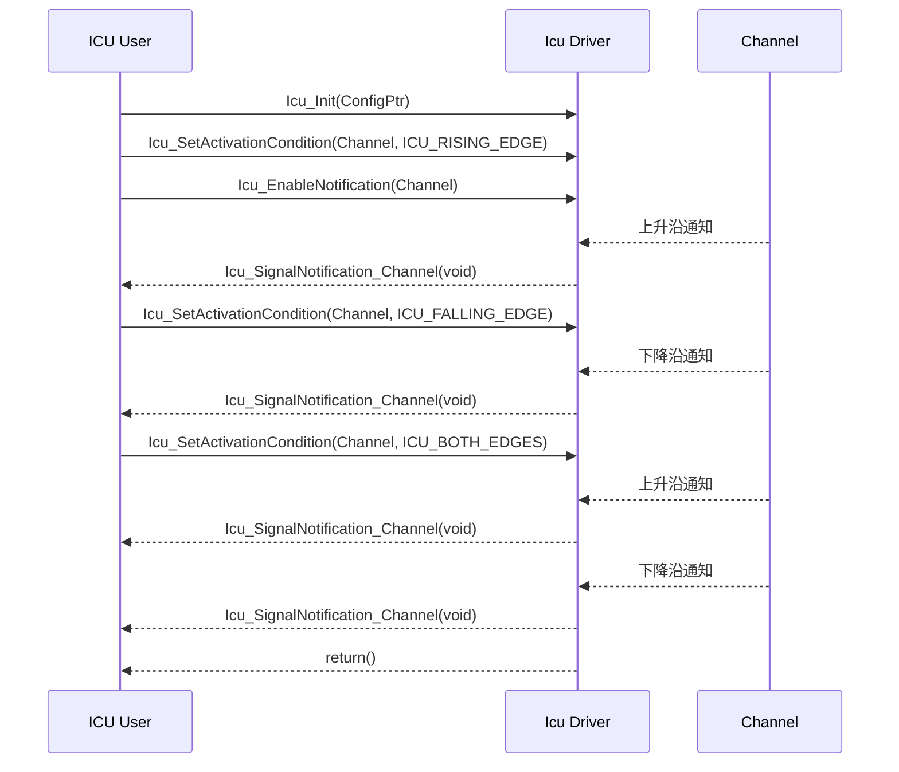
```mermaid
sequenceDiagram
    participant U as ICU User
    participant D as Icu Driver
    participant C as Channel
    U->>D: Icu_Init(ConfigPtr)
    U->>D: Icu_SetActivationCondition(Channel, ICU_RISING_EDGE)
    U->>D: Icu_EnableNotification(Channel)
    C-->>D: 上升沿通知
    D-->>U: Icu_SignalNotification_Channel(void)
    U->>D: Icu_SetActivationCondition(Channel, ICU_FALLING_EDGE)
    C-->>D: 下降沿通知
    D-->>U: Icu_SignalNotification_Channel(void)
    U->>D: Icu_SetActivationCondition(Channel, ICU_BOTH_EDGES)
    C-->>D: 上升沿通知
    D-->>U: Icu_SignalNotification_Channel(void)
    C-->>D: 下降沿通知
    D-->>U: Icu_SignalNotification_Channel(void)
    D-->>U: return()
```

#### 8.9.2. 重新使能通道的通知

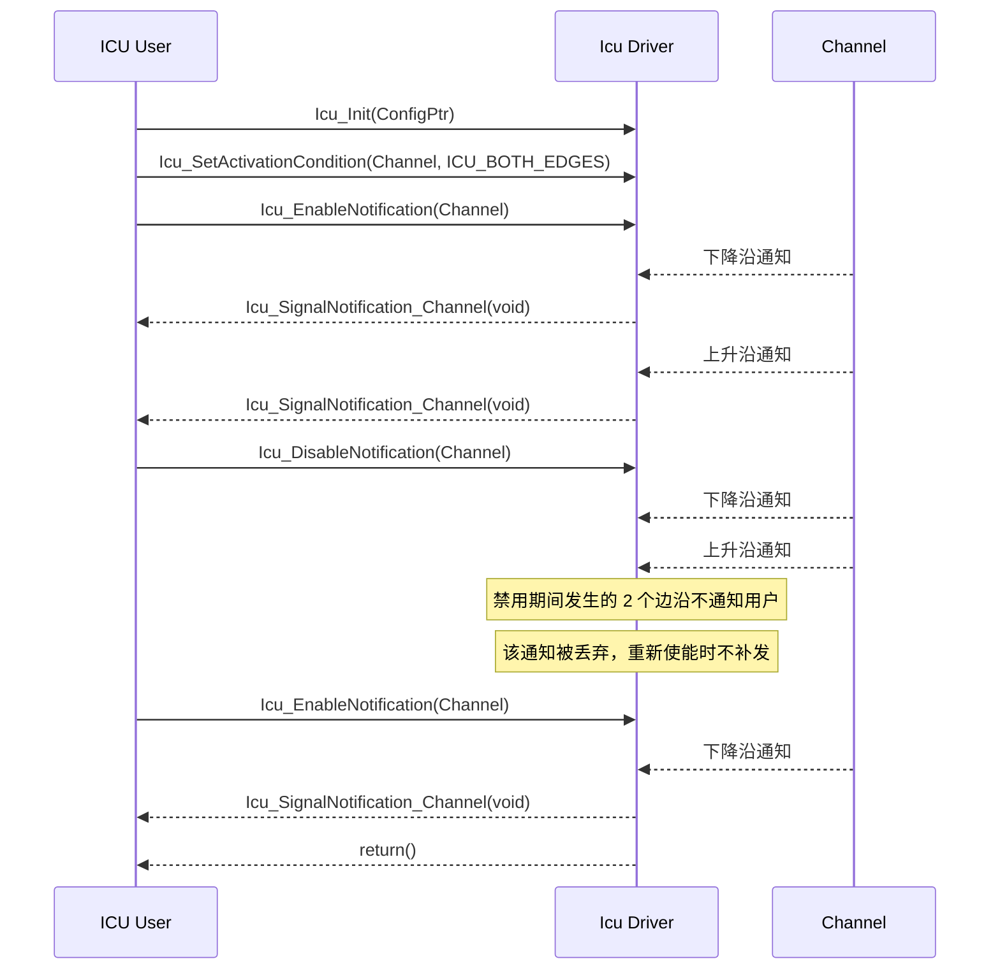
```mermaid
sequenceDiagram
    participant U as ICU User
    participant D as Icu Driver
    participant C as Channel
    U->>D: Icu_Init(ConfigPtr)
    U->>D: Icu_SetActivationCondition(Channel, ICU_BOTH_EDGES)
    U->>D: Icu_EnableNotification(Channel)
    C-->>D: 下降沿通知
    D-->>U: Icu_SignalNotification_Channel(void)
    C-->>D: 上升沿通知
    D-->>U: Icu_SignalNotification_Channel(void)
    U->>D: Icu_DisableNotification(Channel)
    C-->>D: 下降沿通知
    C-->>D: 上升沿通知
    Note over D: 禁用期间发生的 2 个边沿不通知用户
    Note over D: 该通知被丢弃，重新使能时不补发
    U->>D: Icu_EnableNotification(Channel)
    C-->>D: 下降沿通知
    D-->>U: Icu_SignalNotification_Channel(void)
    D-->>U: return()
```

### 8.10. Icu_GetInputState

初始条件：**ICU**驱动已初始化——a) 模块工作于**ICU_MODE_NORMAL**；b) 通知函数配置为**NULL**指针。输入信号为高电平。

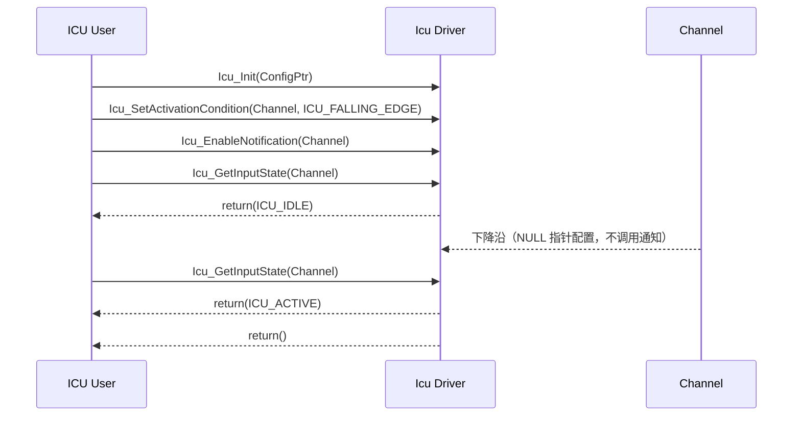
```mermaid
sequenceDiagram
    participant U as ICU User
    participant D as Icu Driver
    participant C as Channel
    U->>D: Icu_Init(ConfigPtr)
    U->>D: Icu_SetActivationCondition(Channel, ICU_FALLING_EDGE)
    U->>D: Icu_EnableNotification(Channel)
    U->>D: Icu_GetInputState(Channel)
    D-->>U: return(ICU_IDLE)
    C-->>D: 下降沿（NULL 指针配置，不调用通知）
    U->>D: Icu_GetInputState(Channel)
    D-->>U: return(ICU_ACTIVE)
    D-->>U: return()
```

### 8.11. Icu 时间戳

#### 8.11.1. 时间戳功能概览

初始条件：**ICU**驱动已初始化——a) 所有通知禁用；b) 所有已用中断禁用。输入信号为高电平。

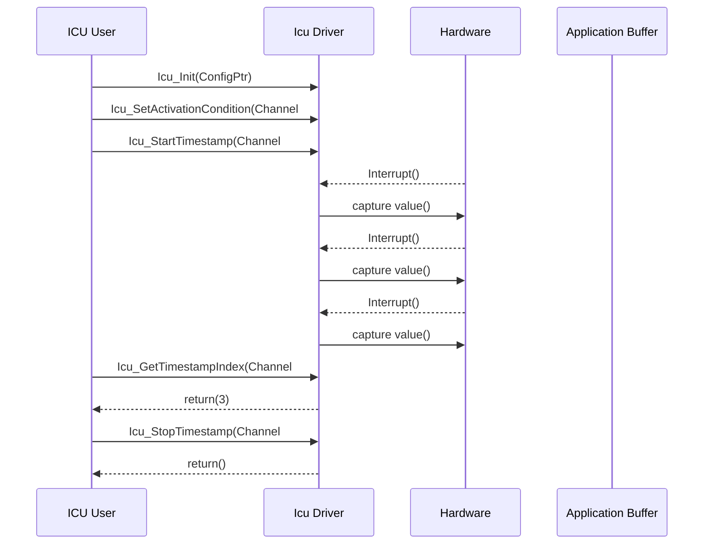
```mermaid
sequenceDiagram
    participant U as ICU User
    participant D as Icu Driver
    participant H as Hardware
    participant B as Application Buffer
    U->>D: Icu_Init(ConfigPtr)
    U->>D: Icu_SetActivationCondition(Channel #1, ICU_FALLING_EDGE)
    U->>D: Icu_StartTimestamp(Channel #1, *BufferPtr, BufferSize, NotifyInterval)
    H-->>D: Interrupt()
    D->>H: capture value()
    H-->>D: Interrupt()
    D->>H: capture value()
    H-->>D: Interrupt()
    D->>H: capture value()
    U->>D: Icu_GetTimestampIndex(Channel #1)
    D-->>U: return(3)
    U->>D: Icu_StopTimestamp(Channel #1)
    D-->>U: return()
```

#### 8.11.2. 时间戳波形说明

下图示意定时器值与输入信号边沿的对应关系：定时器从 0 起计数，输入信号高低电平交替，在每个配置边沿捕获定时器值（如 5461、10922、22937、32767、43690、49151、58981 等，达 0xFFFF 后回绕）。上层据此结合**MCU**时钟设置将**tick**转换为时间。

| 捕获点 | 定时器值 |
|---|---|
| 边沿 1 | 5461 |
| 边沿 2 | 10922 |
| 边沿 3 | 22937 |
| 边沿 4 | 32767 |
| 边沿 5 | 43690 |
| 边沿 6 | 49151 |
| 边沿 7 | 58981 |
| 回绕后 | 6553 |

### 8.12. Icu 边沿计数

初始条件：**ICU**驱动已初始化——a) 所有通知禁用；b) 所有已用中断禁用。输入信号为高电平。

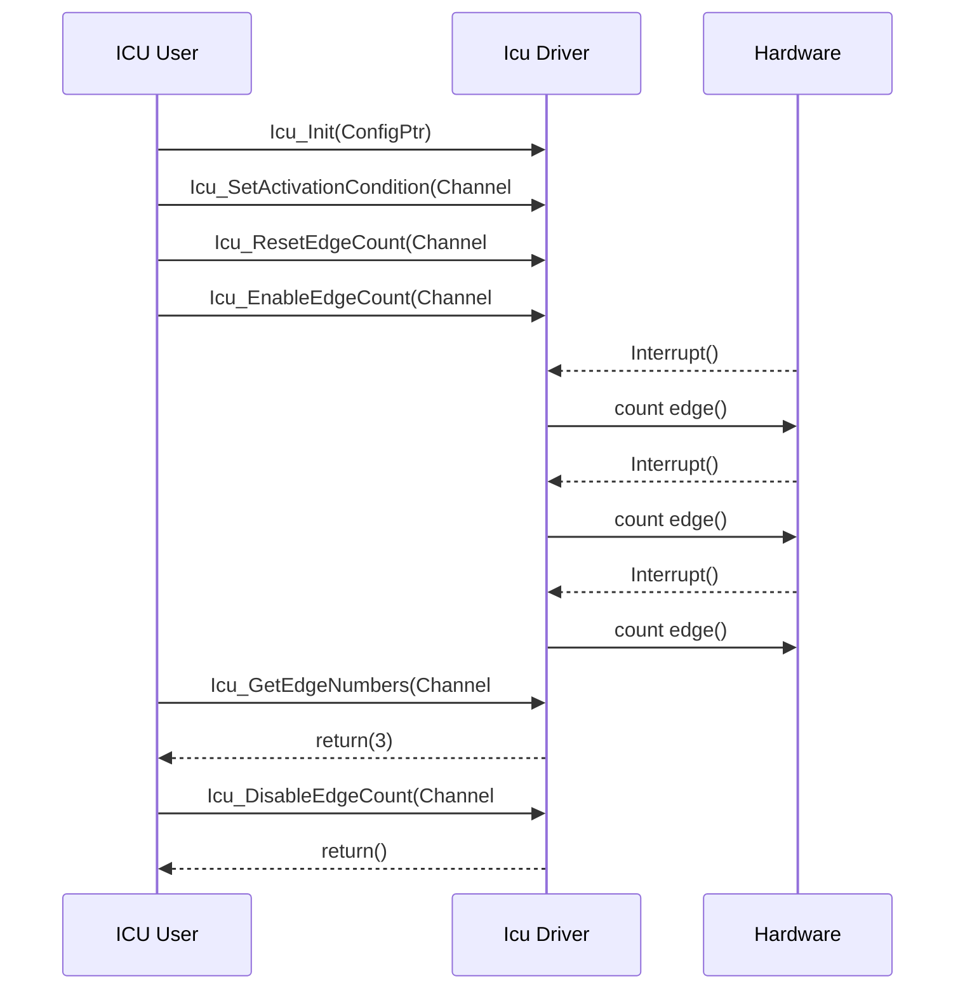
```mermaid
sequenceDiagram
    participant U as ICU User
    participant D as Icu Driver
    participant H as Hardware
    U->>D: Icu_Init(ConfigPtr)
    U->>D: Icu_SetActivationCondition(Channel #1, ICU_RISING_EDGE)
    U->>D: Icu_ResetEdgeCount(Channel #1)
    U->>D: Icu_EnableEdgeCount(Channel #1)
    H-->>D: Interrupt()
    D->>H: count edge()
    H-->>D: Interrupt()
    D->>H: count edge()
    H-->>D: Interrupt()
    D->>H: count edge()
    U->>D: Icu_GetEdgeNumbers(Channel #1)
    D-->>U: return(3)
    U->>D: Icu_DisableEdgeCount(Channel #1)
    D-->>U: return()
```

若未调用[**Icu_ResetEdgeCount**](#7314-icu_resetedgecount)则计数器不复位，[**Icu_GetEdgeNumbers**](#7319-icu_getedgenumbers)直接返回当前计数值（如 3）。

### 8.13. Icu_GetTimeElapsed

#### 8.13.1. 低电平时间测量

初始条件：**ICU**驱动已初始化，通道 #1 配置为：a) 驱动配置中的测量模式 = **SignalMeasurement**；b) 信号测量属性 = **LowTime**。信号仍为低电平。

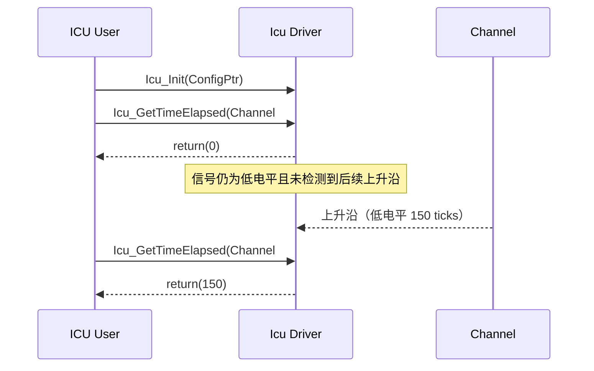
```mermaid
sequenceDiagram
    participant U as ICU User
    participant D as Icu Driver
    participant C as Channel #1
    U->>D: Icu_Init(ConfigPtr)
    U->>D: Icu_GetTimeElapsed(Channel #1)
    D-->>U: return(0)
    Note over D: 信号仍为低电平且未检测到后续上升沿
    C-->>D: 上升沿（低电平 150 ticks）
    U->>D: Icu_GetTimeElapsed(Channel #1)
    D-->>U: return(150)
```

#### 8.13.2. 周期时间测量

初始条件：通道 #1 配置为：a) 测量模式 = **SignalMeasurement**；b) 信号测量属性 = **PeriodTime**；c) 默认周期起始边沿 = **ICU_FALLING_EDGE**。

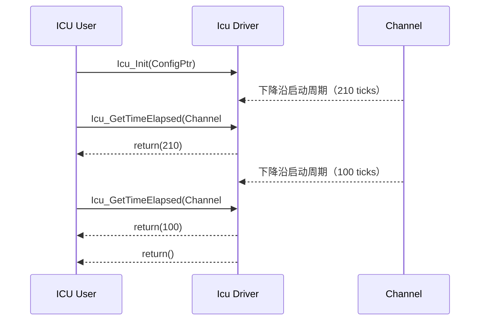
```mermaid
sequenceDiagram
    participant U as ICU User
    participant D as Icu Driver
    participant C as Channel #1
    U->>D: Icu_Init(ConfigPtr)
    C-->>D: 下降沿启动周期（210 ticks）
    U->>D: Icu_GetTimeElapsed(Channel #1)
    D-->>U: return(210)
    C-->>D: 下降沿启动周期（100 ticks）
    U->>D: Icu_GetTimeElapsed(Channel #1)
    D-->>U: return(100)
    D-->>U: return()
```

#### 8.13.3. 高电平时间测量（A/B/C/D 示例）

初始条件：通道 #1 配置为：a) 测量模式 = **SignalMeasurement**；b) 信号测量属性 = **HighTime**。该行为同样适用于**[Icu_GetDutyCycleValues](#7323-icu_getdutycyclevalues)()**。

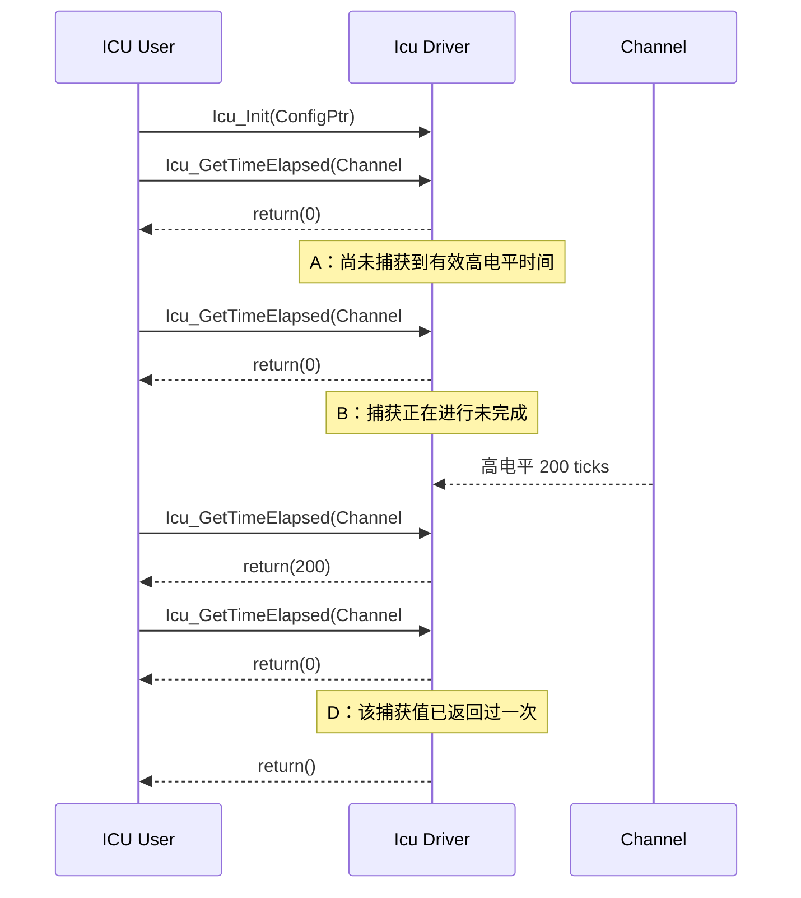
```mermaid
sequenceDiagram
    participant U as ICU User
    participant D as Icu Driver
    participant C as Channel #1
    U->>D: Icu_Init(ConfigPtr)
    U->>D: Icu_GetTimeElapsed(Channel #1)
    D-->>U: return(0)
    Note over D: A：尚未捕获到有效高电平时间
    U->>D: Icu_GetTimeElapsed(Channel #1)
    D-->>U: return(0)
    Note over D: B：捕获正在进行未完成
    C-->>D: 高电平 200 ticks
    U->>D: Icu_GetTimeElapsed(Channel #1)
    D-->>U: return(200)
    U->>D: Icu_GetTimeElapsed(Channel #1)
    D-->>U: return(0)
    Note over D: D：该捕获值已返回过一次
    D-->>U: return()
```

### 8.14. Icu_GetDutyCycleValues

初始条件：通道 #1 配置为：a) 测量模式 = **SignalMeasurement**；b) 信号测量属性 = **DutyCycle**；c) 默认周期起始边沿 = **ICU_RISING_EDGE**。

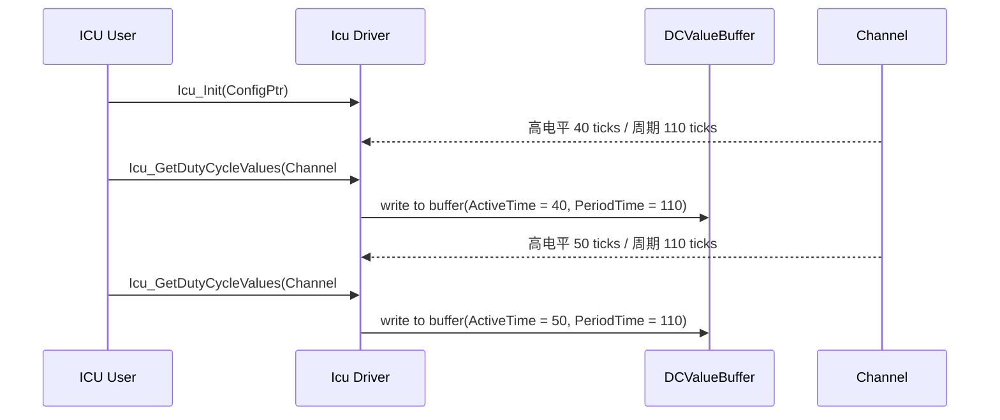
```mermaid
sequenceDiagram
    participant U as ICU User
    participant D as Icu Driver
    participant B as DCValueBuffer
    participant C as Channel #1
    U->>D: Icu_Init(ConfigPtr)
    C-->>D: 高电平 40 ticks / 周期 110 ticks
    U->>D: Icu_GetDutyCycleValues(Channel #1, DCValueBuffer_p)
    D->>B: write to buffer(ActiveTime = 40, PeriodTime = 110)
    C-->>D: 高电平 50 ticks / 周期 110 ticks
    U->>D: Icu_GetDutyCycleValues(Channel #1, DCValueBuffer_p)
    D->>B: write to buffer(ActiveTime = 50, PeriodTime = 110)
```

### 8.15. Icu_DisableNotificationAsync

初始条件：**ICU**驱动已初始化，通道 #1 唤醒能力，默认起始边沿 = **ICU_BOTH_EDGES**。

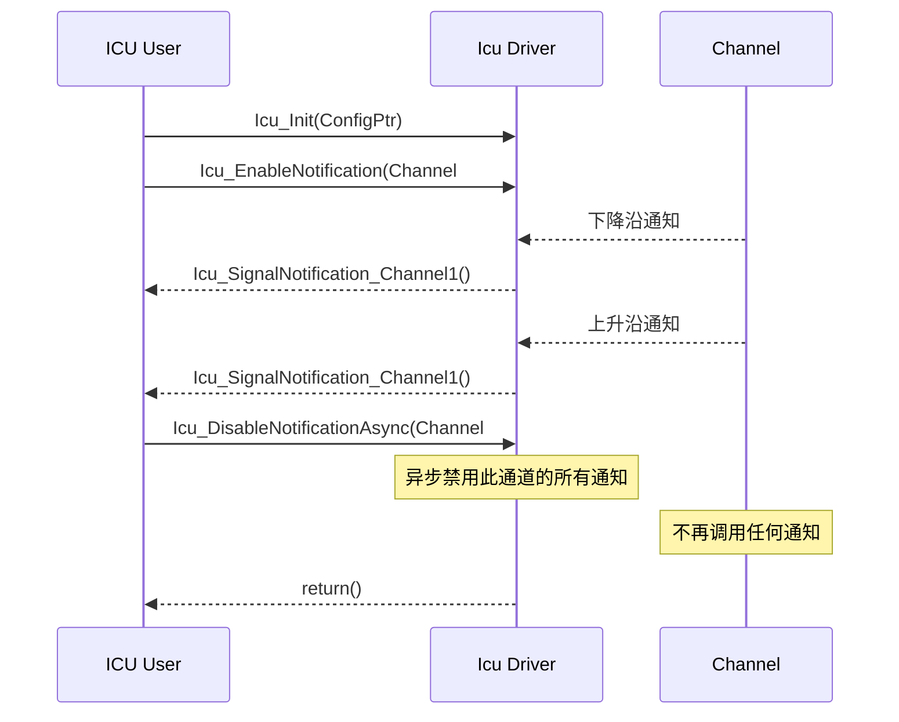
```mermaid
sequenceDiagram
    participant U as ICU User
    participant D as Icu Driver
    participant C as Channel #1
    U->>D: Icu_Init(ConfigPtr)
    U->>D: Icu_EnableNotification(Channel #1)
    C-->>D: 下降沿通知
    D-->>U: Icu_SignalNotification_Channel1()
    C-->>D: 上升沿通知
    D-->>U: Icu_SignalNotification_Channel1()
    U->>D: Icu_DisableNotificationAsync(Channel #1)
    Note over D: 异步禁用此通道的所有通知
    Note over C: 不再调用任何通知
    D-->>U: return()
```

### 8.16. Icu_SignalNotification 与 Icu_GetInputState 的协同使用

初始条件：**ICU**驱动已初始化，所用硬件按引用配置结构配置，输入信号为高电平。

```mermaid
sequenceDiagram
    participant U as Icu User
    participant H as ICU Hardware
    participant I as ISR
    participant D as Icu Driver
    U->>D: Icu_Init(ConfigPtr)
    U->>D: Icu_SetActivationCondition(Channel, Activation)
    U->>D: Icu_EnableNotification(Channel)
    U->>D: Icu_GetInputState(return, Channel)
    D-->>U: Icu_GetInputState = ICU_IDLE()
    H-->>I: 输入信号变为低电平
    I->>I: Set Flag()
    I->>D: Interrupt()
    D->>I: check and reset Flag()
    I->>D: Icu_SignalNotification_Channel()
    D->>U: Icu_SignalNotification_Channel()
    I-->>I: return from ISR()
    U->>D: Icu_GetInputState(return, Channel)
    D-->>U: Icu_GetInputState = ICU_ACTIVE()
```

### 8.17. Icu_EnableNotificationAsync

初始条件：**ICU**驱动已初始化，所用硬件按引用配置结构配置，所有通知禁用。

```mermaid
sequenceDiagram
    participant U as ICU User
    participant D as Icu Driver
    participant C as Channel
    U->>D: Icu_Init(ConfigPtr)
    U->>D: Icu_SetActivationCondition(Channel, ICU_RISING_EDGE)
    U->>D: Icu_EnableNotificationAsync(Channel)
    C-->>D: 上升沿通知
    D-->>U: Icu_SignalNotification_Channel(void)
    U->>D: Icu_SetActivationCondition(Channel, ICU_FALLING_EDGE)
    C-->>D: 下降沿通知
    D-->>U: Icu_SignalNotification_Channel(void)
    U->>D: Icu_SetActivationCondition(Channel, ICU_BOTH_EDGES)
    C-->>D: 上升沿通知
    D-->>U: Icu_SignalNotification_Channel(void)
    C-->>D: 下降沿通知
    D-->>U: Icu_SignalNotification_Channel(void)
    D-->>U: return()
```

## 9. 配置规范

总体而言，本章定义配置参数及其到**容器**（container）的聚类组织。为支持本规范，第 9.1 章描述相关基础知识，并规定参数规范所应使用的模板（表格）。我们有意将第 9.1 章保留在规范中，以保证可理解性。

第 9.2 章规定**ICU**模块的结构（容器）与参数。

第 9.3 章规定**ICU**模块的发布信息。

### 9.1. 如何阅读本章

详情请参阅 SWS_BSWGeneral 中的第 10.1 章 "Introduction to configuration specification"（配置规范导论）。

### 9.2. 容器与配置参数

以下各节汇总所有配置参数。各参数的详细含义见第 6 章和第 7 章。

**ICU** 模块应拒绝实现所不支持的、带有分区映射的配置。

#### 9.2.1. Icu

| SWS 条目 |  |
|---|---|
| 模块名称 | Icu |
| 描述 | **Icu**（**Input Capture Unit**，输入捕获单元）模块的配置。 |
| Post-Build 变体支持 | true |
| 支持的配置变体 | VARIANT-POST-BUILD, VARIANT-PRE-COMPILE |

| 容器名称 | 多重性 | 作用域/依赖 |
|---|---|---|
| IcuConfigSet | 1 | 此容器包含 AUTOSAR **Icu** 模块的配置参数与子容器。 |
| IcuGeneral | 1 | 常规 **ICU** 参数的配置。 |
| IcuOptionalApis | 1 | 此容器包含用于配置 **ICU** 驱动可选 API 服务的所有配置开关。 |

#### 9.2.2. IcuGeneral

| SWS 条目 |  |
|---|---|
| 容器名称 | IcuGeneral |
| 父容器 | Icu |
| 描述 | 常规 **ICU** 参数的配置。 |
| 配置参数 | 见下方参数表 |

| SWS 条目 |  |
|---|---|
| 参数名称 | IcuDevErrorDetect |
| 父容器 | IcuGeneral |
| 描述 | 开启或关闭开发错误检测与通知（true：启用检测与通知；false：禁用检测与通知）。 |
| 多重性 | 1 |
| 类型 | EcucBooleanParamDef |
| 默认值 | false |
| Post-Build 变体值 | false |
| 值配置类 | Pre-compile time：x（All Variants）；Link time：-；Post-build time：- |
| 作用域/依赖 | scope: local |

| SWS 条目 |  |
|---|---|
| 参数名称 | IcuReportWakeupSource |
| 父容器 | IcuGeneral |
| 描述 | 唤醒源上报开关（true：上报唤醒源；false：不上报唤醒源）。 |
| 多重性 | 1 |
| 类型 | EcucBooleanParamDef |
| 默认值 | - |
| Post-Build 变体值 | false |
| 值配置类 | Pre-compile time：x（All Variants）；Link time：-；Post-build time：- |
| 作用域/依赖 | scope: local |

| SWS 条目 |  |
|---|---|
| 参数名称 | IcuEcucPartitionRef |
| 父容器 | IcuGeneral |
| 描述 | 将 **ICU** 驱动映射到零个或多个 ECUC 分区，以使驱动 API 在相应分区中可用。 |
| 多重性 | 0..* |
| 类型 | 对 EcucPartition 的引用 |
| Post-Build 变体多重性 | true |
| Post-Build 变体值 | true |
| 多重性配置类 | Pre-compile time：x；Link time：-；Post-build time：- |
| 值配置类 | Pre-compile time：x；Link time：-；Post-build time：- |
| 作用域/依赖 | scope: ECU |

| SWS 条目 |  |
|---|---|
| 参数名称 | IcuKernelEcucPartitionRef |
| 父容器 | IcuGeneral |
| 描述 | 将 **ICU** 内核映射到零个或一个 ECUC 分区，以将驱动内核分配到某个特定内核。所引用的 ECUC 分区是 **ICU** 驱动所映射到的 ECUC 分区的子集。 |
| 多重性 | 0..1 |
| 类型 | 对 EcucPartition 的引用 |
| Post-Build 变体多重性 | true |
| Post-Build 变体值 | true |
| 多重性配置类 | Pre-compile time：x（All Variants）；Link time：-；Post-build time：- |
| 值配置类 | Pre-compile time：x（All Variants）；Link time：-；Post-build time：- |
| 作用域/依赖 | scope: ECU |

无包含的容器。

IcuKernelEcucPartitionRef 所引用的 ECUC 分区应是 IcuEcucPartitionRef 所引用的 ECUC 分区的子集。

若 IcuEcucPartitionRef 引用一个或多个 ECUC 分区，则 IcuKernelEcucPartitionRef 的多重性应为一，并且也应引用这些 ECUC 分区之一。

#### 9.2.3. IcuOptionalApis

| SWS 条目 |  |
|---|---|
| 容器名称 | IcuOptionalApis |
| 父容器 | Icu |
| 描述 | 此容器包含用于配置 **ICU** 驱动可选 API 服务的所有配置开关。 |
| 配置参数 | 见下方参数表 |

| SWS 条目 |  |
|---|---|
| 参数名称 | IcuDeInitApi |
| 父容器 | IcuOptionalApis |
| 描述 | 在代码中添加/移除 Icu_DeInit() 服务（true：可以使用 Icu_DeInit()；false：不可使用 Icu_DeInit()）。 |
| 多重性 | 1 |
| 类型 | EcucBooleanParamDef |
| 默认值 | - |
| Post-Build 变体值 | false |
| 值配置类 | Pre-compile time：x（All Variants）；Link time：-；Post-build time：- |
| 作用域/依赖 | scope: local |

| SWS 条目 |  |
|---|---|
| 参数名称 | IcuDisableWakeupApi |
| 父容器 | IcuOptionalApis |
| 描述 | 在代码中添加/移除 Icu_DisableWakeup() 服务（true：可以使用 Icu_DisableWakeup()；false：不可使用 Icu_DisableWakeup()）。 |
| 多重性 | 1 |
| 类型 | EcucBooleanParamDef |
| 默认值 | - |
| Post-Build 变体值 | false |
| 值配置类 | Pre-compile time：x（All Variants）；Link time：-；Post-build time：- |
| 作用域/依赖 | scope: local |

| SWS 条目 |  |
|---|---|
| 参数名称 | IcuEdgeCountApi |
| 父容器 | IcuOptionalApis |
| 描述 | 在代码中添加/移除以下服务：Icu_ResetEdgeCount()、Icu_GetEdgeNumbers()、Icu_EnableEdgeCount()、Icu_DisableEdgeCount()（true：可以使用这些服务；false：不可使用这些服务）。 |
| 多重性 | 1 |
| 类型 | EcucBooleanParamDef |
| 默认值 | - |
| Post-Build 变体值 | false |
| 值配置类 | Pre-compile time：x（All Variants）；Link time：-；Post-build time：- |
| 作用域/依赖 | scope: local |

| SWS 条目 |  |
|---|---|
| 参数名称 | IcuEdgeDetectApi |
| 父容器 | IcuOptionalApis |
| 描述 | 在代码中添加/移除与边沿检测功能相关的服务：Icu_EnableEdgeDetection() 和 Icu_DisableEdgeDetection()（true：可以使用这些服务；false：不可使用这些服务）。 |
| 多重性 | 1 |
| 类型 | EcucBooleanParamDef |
| 默认值 | - |
| Post-Build 变体值 | false |
| 值配置类 | Pre-compile time：x（All Variants）；Link time：-；Post-build time：- |
| 作用域/依赖 | scope: local |

| SWS 条目 |  |
|---|---|
| 参数名称 | IcuEnableWakeupApi |
| 父容器 | IcuOptionalApis |
| 描述 | 在代码中添加/移除 Icu_EnableWakeup() 服务（true：可以使用 Icu_EnableWakeup()；false：不可使用 Icu_EnableWakeup()）。 |
| 多重性 | 1 |
| 类型 | EcucBooleanParamDef |
| 默认值 | - |
| Post-Build 变体值 | false |
| 值配置类 | Pre-compile time：x（All Variants）；Link time：-；Post-build time：- |
| 作用域/依赖 | scope: local |

| SWS 条目 |  |
|---|---|
| 参数名称 | IcuGetDutyCycleValuesApi |
| 父容器 | IcuOptionalApis |
| 描述 | 在代码中添加/移除 Icu_GetDutyCycleValues() 服务（true：可以使用 Icu_GetDutyCycleValues()；false：不可使用 Icu_GetDutyCycleValues()）。 |
| 多重性 | 1 |
| 类型 | EcucBooleanParamDef |
| 默认值 | - |
| Post-Build 变体值 | false |
| 值配置类 | Pre-compile time：x（All Variants）；Link time：-；Post-build time：- |
| 作用域/依赖 | scope: local dependency: 若 IcuSignalMeasurementApi 为 false，则此开关也应设为 false |

| SWS 条目 |  |
|---|---|
| 参数名称 | IcuGetInputStateApi |
| 父容器 | IcuOptionalApis |
| 描述 | 在代码中添加/移除 Icu_GetInputState() 服务（true：可以使用 Icu_GetInputState()；false：不可使用 Icu_GetInputState()）。 |
| 多重性 | 1 |
| 类型 | EcucBooleanParamDef |
| 默认值 | - |
| Post-Build 变体值 | false |
| 值配置类 | Pre-compile time：x（All Variants）；Link time：-；Post-build time：- |
| 作用域/依赖 | scope: local |

| SWS 条目 |  |
|---|---|
| 参数名称 | IcuGetTimeElapsedApi |
| 父容器 | IcuOptionalApis |
| 描述 | 在代码中添加/移除 Icu_GetTimeElapsed() 服务（true：可以使用 Icu_GetTimeElapsed()；false：不可使用 Icu_GetTimeElapsed()）。 |
| 多重性 | 1 |
| 类型 | EcucBooleanParamDef |
| 默认值 | - |
| Post-Build 变体值 | false |
| 值配置类 | Pre-compile time：x（All Variants）；Link time：-；Post-build time：- |
| 作用域/依赖 | scope: local dependency: 若 IcuSignalMeasurementApi 为 false，则此开关也应设为 false |

| SWS 条目 |  |
|---|---|
| 参数名称 | IcuGetVersionInfoApi |
| 父容器 | IcuOptionalApis |
| 描述 | 在代码中添加/移除 Icu_GetVersionInfo() 服务（true：可以使用 Icu_GetVersionInfo()；false：不可使用 Icu_GetVersionInfo()）。 |
| 多重性 | 1 |
| 类型 | EcucBooleanParamDef |
| 默认值 | false |
| Post-Build 变体值 | false |
| 值配置类 | Pre-compile time：x（All Variants）；Link time：-；Post-build time：- |
| 作用域/依赖 | scope: local |

| SWS 条目 |  |
|---|---|
| 参数名称 | IcuSetModeApi |
| 父容器 | IcuOptionalApis |
| 描述 | 在代码中添加/移除 Icu_SetMode() 服务（true：可以使用 Icu_SetMode()；false：不可使用 Icu_SetMode()）。 |
| 多重性 | 1 |
| 类型 | EcucBooleanParamDef |
| 默认值 | - |
| Post-Build 变体值 | false |
| 值配置类 | Pre-compile time：x（All Variants）；Link time：-；Post-build time：- |
| 作用域/依赖 | scope: local |

| SWS 条目 |  |
|---|---|
| 参数名称 | IcuSignalMeasurementApi |
| 父容器 | IcuOptionalApis |
| 描述 | 在代码中添加/移除 Icu_StartSignalMeasurement() 和 Icu_StopSignalMeasurement() 服务（true：可以使用这些服务；false：不可使用这些服务）。 |
| 多重性 | 1 |
| 类型 | EcucBooleanParamDef |
| 默认值 | - |
| Post-Build 变体值 | false |
| 值配置类 | Pre-compile time：x（All Variants）；Link time：-；Post-build time：- |
| 作用域/依赖 | scope: local |

| SWS 条目 |  |
|---|---|
| 参数名称 | IcuTimestampApi |
| 父容器 | IcuOptionalApis |
| 描述 | 在代码中添加/移除下列所有与时间戳功能相关的服务：Icu_StartTimestamp()、Icu_StopTimestamp()、Icu_GetTimestampIndex() 等（true：可以使用这些服务；false：不可使用这些服务）。 |
| 多重性 | 1 |
| 类型 | EcucBooleanParamDef |
| 默认值 | - |
| Post-Build 变体值 | false |
| 值配置类 | Pre-compile time：x（All Variants）；Link time：-；Post-build time：- |
| 作用域/依赖 | scope: local |

| SWS 条目 |  |
|---|---|
| 参数名称 | IcuWakeupFunctionalityApi |
| 父容器 | IcuOptionalApis |
| 描述 | 在代码中添加/移除 Icu_CheckWakeup() 服务（true：可以使用 Icu_CheckWakeup()；false：不可使用 Icu_CheckWakeup()）。 |
| 多重性 | 1 |
| 类型 | EcucBooleanParamDef |
| 默认值 | - |
| Post-Build 变体值 | false |
| 值配置类 | Pre-compile time：x（All Variants）；Link time：-；Post-build time：- |
| 作用域/依赖 | scope: local |

无包含的容器。

#### 9.2.4. IcuChannel

| SWS 条目 |  |
|---|---|
| 容器名称 | IcuChannel |
| 父容器 | IcuConfigSet |
| 描述 | 单个 **ICU** 通道的配置。 |
| 配置参数 | 见下方参数表 |

| SWS 条目 |  |
|---|---|
| 参数名称 | IcuChannelId |
| 父容器 | IcuChannel |
| 描述 | **ICU** 通道的通道 ID。该值将赋给由 IcuChannel 容器短名派生的符号名。 |
| 多重性 | 1 |
| 类型 | EcucIntegerParamDef（为此参数生成符号名） |
| 范围 | 0 .. 65535 |
| 默认值 | - |
| Post-Build 变体值 | false |
| 值配置类 | Pre-compile time：x（All Variants）；Link time：-；Post-build time：- |
| 作用域/依赖 | scope: ECU |

| SWS 条目 |  |
|---|---|
| 参数名称 | IcuDefaultStartEdge |
| 父容器 | IcuChannel |
| 描述 | 默认边沿（**Condition()**）。当测量模式设置为 "IcuSignalMeasurement"、"DutyCycle" 或 "Period" 时，此处配置的边沿为周期起始边沿。实现类型：**Icu_ActivationType** |
| 多重性 | 1 |
| 类型 | EcucEnumerationParamDef |
| 范围 | ICU_BOTH_EDGES：默认使用两个边沿；ICU_FALLING_EDGE：默认使用下降沿；ICU_RISING_EDGE：默认使用上升沿 |
| Post-Build 变体值 | true |
| 值配置类 | Pre-compile time：x（VARIANT-PRE-COMPILE）；Link time：-；Post-build time：x（VARIANT-POST-BUILD） |
| 作用域/依赖 | scope: local |

| SWS 条目 |  |
|---|---|
| 参数名称 | IcuMeasurementMode |
| 父容器 | IcuChannel |
| 描述 | 配置此通道的测量模式。实现类型：**Icu_MeasurementModeType** |
| 多重性 | 1 |
| 类型 | EcucEnumerationParamDef |
| 范围 | ICU_MODE_EDGE_COUNTER：该通道用于对通过调用服务 **Icu_SetActivationCondition()** 所配置的边沿进行计数。支持此模式的 API 服务有：**Icu_EnableEdgeCount()**、**Icu_DisableEdgeCount()**、**Icu_GetEdgeNumbers()**、**Icu_ResetEdgeCount()**；ICU_MODE_SIGNAL_EDGE_DETECT：该通道用于检测通过调用服务 **Icu_SetActivationCondition()** 所配置的边沿。支持此模式的 API 服务有：**Icu_EnableNotification()**、**Icu_DisableNotification()**、**Icu_GetInputState()**；ICU_MODE_SIGNAL_MEASUREMENT：该通道用于测量各个可配置边沿之间的不同时间。周期起始边沿的配置由配置完成，且在运行期间不可更改。支持此模式的 API 服务有：**Icu_GetTimeElapsed()**、**Icu_GetDutyCycleValues()**、**Icu_GetInputState()**。仅当 **IcuGetDutyCycleValuesApi** 或 **IcuGetTimeElapsedApi** 至少有一个设置为 "true" 时，才能配置此模式；ICU_MODE_TIMESTAMP：该通道用于捕获通过调用服务 **Icu_SetActivationCondition()** 所配置的边沿上的定时器值。支持此模式的 API 服务有：**Icu_StartTimestamp()**、**Icu_StopTimestamp()**、**Icu_GetTimestampIndex()** |
| Post-Build 变体值 | true |
| 值配置类 | Pre-compile time：x（VARIANT-PRE-COMPILE）；Link time：-；Post-build time：x（VARIANT-POST-BUILD） |
| 作用域/依赖 | scope: local dependency: 可用的测量模式取决于启用/禁用可选 API 服务的预处理器开关 |

| SWS 条目 |  |
|---|---|
| 参数名称 | IcuWakeupCapability |
| 父容器 | IcuChannel |
| 描述 | 关于此通道唤醒能力的信息（true：通道具有唤醒能力；false：通道不具有唤醒能力）。 |
| 多重性 | 1 |
| 类型 | EcucBooleanParamDef |
| 默认值 | - |
| Post-Build 变体值 | true |
| 值配置类 | Pre-compile time：x（VARIANT-PRE-COMPILE）；Link time：-；Post-build time：x（VARIANT-POST-BUILD） |
| 作用域/依赖 | scope: local |

| SWS 条目 |  |
|---|---|
| 参数名称 | IcuChannelEcucPartitionRef |
| 父容器 | IcuChannel |
| 描述 | 将一个 **ICU** 通道映射到零个或多个 ECUC 分区，以限制对该通道的访问。所引用的 ECUC 分区是 **ICU** 驱动所映射到的 ECUC 分区的子集。 |
| 多重性 | 0..* |
| 类型 | 对 EcucPartition 的引用 |
| Post-Build 变体多重性 | true |
| Post-Build 变体值 | true |
| 多重性配置类 | Pre-compile time：x；Link time：-；Post-build time：- |
| 值配置类 | Pre-compile time：x；Link time：-；Post-build time：- |
| 作用域/依赖 | scope: ECU |

| 容器名称 | 多重性 | 作用域/依赖 |
|---|---|---|
| IcuSignalEdgeDetection | 0..1 | 当测量模式为 "IcuSignalEdgeDetection" 时，此容器包含相应的配置（参数）。 |
| IcuSignalMeasurement | 0..1 | 当测量模式为 "IcuSignalMeasurement" 时，此容器包含相应的配置（参数）。 |
| IcuTimestampMeasurement | 0..1 | 当测量模式为 "IcuTimestamp" 时，此容器包含相应的配置（参数）。 |
| IcuWakeup | 0..1 | 此容器包含配置唤醒能力通道所需的配置（参数）。 |

IcuChannelEcucPartitionRef 所引用的 ECUC 分区应是 IcuEcucPartitionRef 所引用的 ECUC 分区的子集。

若 IcuEcucPartitionRef 引用一个或多个 ECUC 分区，则 IcuChannelEcucPartitionRef 的多重性应大于一，并且也应引用这些 ECUC 分区中的一个或多个。

#### 9.2.5. IcuSignalEdgeDetection

| SWS 条目 |  |
|---|---|
| 容器名称 | IcuSignalEdgeDetection |
| 父容器 | IcuChannel |
| 描述 | 当测量模式为 "IcuSignalEdgeDetection" 时，此容器包含相应的配置（参数）。 |
| 配置参数 | 见下方参数表 |

| SWS 条目 |  |
|---|---|
| 参数名称 | IcuSignalNotification |
| 父容器 | IcuSignalEdgeDetection |
| 描述 | 信号通知的通知函数。 |
| 多重性 | 0..1 |
| 类型 | EcucFunctionNameDef |
| 默认值 | - |
| 正则表达式 | - |
| Post-Build 变体多重性 | true |
| Post-Build 变体值 | true |
| 多重性配置类 | Pre-compile time：x（VARIANT-PRE-COMPILE）；Link time：-；Post-build time：x（VARIANT-POST-BUILD） |
| 值配置类 | Pre-compile time：x（VARIANT-PRE-COMPILE）；Link time：-；Post-build time：x（VARIANT-POST-BUILD） |
| 作用域/依赖 | scope: local dependency: IcuMeasurementMode |

无包含的容器。

#### 9.2.6. IcuSignalMeasurement

| SWS 条目 |  |
|---|---|
| 容器名称 | IcuSignalMeasurement |
| 父容器 | IcuChannel |
| 描述 | 当测量模式为 "IcuSignalMeasurement" 时，此容器包含相应的配置（参数）。 |
| 配置参数 | 见下方参数表 |

| SWS 条目 |  |
|---|---|
| 参数名称 | IcuSignalMeasurementProperty |
| 父容器 | IcuSignalMeasurement |
| 描述 | 配置模式为 "IcuSignalMeasurement" 时可测量的属性。此属性在运行期间不可更改。实现类型：**Icu_SignalMeasurementPropertyType** |
| 多重性 | 1 |
| 类型 | EcucEnumerationParamDef |
| 范围 | ICU_DUTY_CYCLE：该通道配置为读取计算占空比所需的值（连贯的激活时间与周期时间）；ICU_HIGH_TIME：该通道配置为读取信号高电平经过的时间；ICU_LOW_TIME：该通道配置为读取信号低电平经过的时间；ICU_PERIOD_TIME：该通道配置为读取信号周期经过的时间 |
| Post-Build 变体值 | true |
| 值配置类 | Pre-compile time：x（VARIANT-PRE-COMPILE）；Link time：-；Post-build time：x（VARIANT-POST-BUILD） |
| 作用域/依赖 | scope: local dependency: IcuMeasurementMode, IcuGetDutyCycleValuesApi, IcuGetTimeElapsedApi |

无包含的容器。

#### 9.2.7. IcuTimestampMeasurement

| SWS 条目 |  |
|---|---|
| 容器名称 | IcuTimestampMeasurement |
| 父容器 | IcuChannel |
| 描述 | 当测量模式为 "IcuTimestamp" 时，此容器包含相应的配置（参数）。 |
| 配置参数 | 见下方参数表 |

| SWS 条目 |  |
|---|---|
| 参数名称 | IcuTimestampMeasurementProperty |
| 父容器 | IcuTimestampMeasurement |
| 描述 | 配置模式为 "Timestamp" 时缓冲区的处理方式。实现类型：**Icu_TimestampBufferType** |
| 多重性 | 1 |
| 类型 | EcucEnumerationParamDef |
| 范围 | ICU_CIRCULAR_BUFFER：到达缓冲区末尾后，从缓冲区开头重新开始；ICU_LINEAR_BUFFER：缓冲区仅填充一次 |
| Post-Build 变体值 | true |
| 值配置类 | Pre-compile time：x（VARIANT-PRE-COMPILE）；Link time：-；Post-build time：x（VARIANT-POST-BUILD） |
| 作用域/依赖 | scope: local dependency: IcuMeasurementMode |

| SWS 条目 |  |
|---|---|
| 参数名称 | IcuTimestampNotification |
| 父容器 | IcuTimestampMeasurement |
| 描述 | 已获取所请求数量的时间戳（通知间隔 > 0）时的通知函数。 |
| 多重性 | 0..1 |
| 类型 | EcucFunctionNameDef |
| 默认值 | - |
| 正则表达式 | - |
| Post-Build 变体多重性 | true |
| Post-Build 变体值 | true |
| 多重性配置类 | Pre-compile time：x（VARIANT-PRE-COMPILE）；Link time：-；Post-build time：x（VARIANT-POST-BUILD） |
| 值配置类 | Pre-compile time：x（VARIANT-PRE-COMPILE）；Link time：-；Post-build time：x（VARIANT-POST-BUILD） |
| 作用域/依赖 | scope: local dependency: IcuTimestampApi |

无包含的容器。

#### 9.2.8. IcuWakeup

| SWS 条目 |  |
|---|---|
| 容器名称 | IcuWakeup |
| 父容器 | IcuChannel |
| 描述 | 此容器包含配置唤醒能力通道所需的配置（参数）。 |
| 配置参数 | 见下方参数表 |

| SWS 条目 |  |
|---|---|
| 参数名称 | IcuChannelWakeupInfo |
| 父容器 | IcuWakeup |
| 描述 | 若唤醒能力为 true，则所引用的唤醒源将传输至 **ECU** 状态管理器（**EcuM**）。实现类型：对 **EcuM_WakeupSourceType** 的符号名引用 |
| 多重性 | 0..1 |
| 类型 | 对 EcuMWakeupSource 的符号名引用 |
| Post-Build 变体多重性 | true |
| Post-Build 变体值 | true |
| 多重性配置类 | Pre-compile time：x（VARIANT-PRE-COMPILE）；Link time：-；Post-build time：x（VARIANT-POST-BUILD） |
| 值配置类 | Pre-compile time：x（VARIANT-PRE-COMPILE）；Link time：-；Post-build time：x（VARIANT-POST-BUILD） |
| 作用域/依赖 | scope: local dependency: IcuWakeupCapability 和 IcuReportWakeupSource |

无包含的容器。

#### 9.2.9. IcuConfigSet

| SWS 条目 |  |
|---|---|
| 容器名称 | IcuConfigSet |
| 父容器 | Icu |
| 描述 | 此容器包含 AUTOSAR **Icu** 模块的配置参数与子容器。 |
| 配置参数 | 见下方参数表 |

| SWS 条目 |  |
|---|---|
| 参数名称 | IcuMaxChannel |
| 父容器 | IcuConfigSet |
| 描述 | 此参数包含配置期间由工具配置的 **Icu** 通道。实现类型：**Icu_ChannelType** |
| 多重性 | 1 |
| 类型 | EcucIntegerParamDef |
| 范围 | 0 .. 65535 |
| 默认值 | - |
| Post-Build 变体值 | true |
| 值配置类 | Pre-compile time：x（VARIANT-PRE-COMPILE）；Link time：-；Post-build time：x（VARIANT-POST-BUILD） |
| 作用域/依赖 | scope: local |

| 容器名称 | 多重性 | 作用域/依赖 |
|---|---|---|
| IcuChannel | 1..* | 单个 **ICU** 通道的配置。 |

### 9.3. 发布信息

**ICU** 驱动应说明需要哪些其他模块（及其版本）。此说明应由实现者提供。

<section id="wechat">

<h4>微信扫一扫，获取更多及时资讯</h4>


</section>
