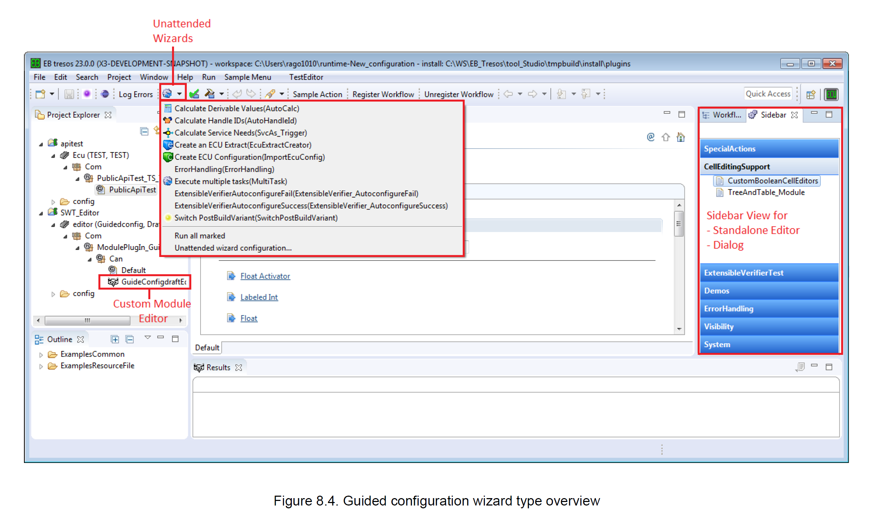

<section id="title">Guided Configuration</section>

# 1. 介绍

熟悉EB Tresos Stduio的朋友们，肯定对EB Tresos Studio中的Sidebar不会陌生，通过非常友善的界面，可以进行Mem Stack的配置，也能非常方便的处理一些System signal的消息。

那是不是有些冲动，自己也想开发一个这样的插件，对EB Tresos Studio的中的数据进行一个批量的处理。那今天就介绍一些：

* EB Tresos Studio能做啥？
* 在EB Tresos Studio中到底需要如何做？

# 2. 目的

EB Tresos Studio是基于Eclispe环境二次开发的一个集成IDE。在扩展性这点上，由于基于Eclipse的生态，所以能力肯定是不容置疑的。

它的**Guided Configuration API**提供了对您的EB Tresos Studio定制我们所需要的对话框以及编辑器的能力。通过**Guided Configuration API**，我们可以做到：

1. 数值的自动计算向导。如：计算Handle ID或者某些特定的栏位的数值。
2. 定义模块数据的编辑，类似于Mem Stack编辑的Sidebar功能
3. 建立需通过多个步骤配置的向导功能，注意是会跨多个EB Tresos的模块。

# 3. 名词解释

**Backend**

> 后端扩展了抽象后端类并处理向导的后台功能。在**model-view-controller**概念中，它对应于**controller**。它注意负责整个配置向导的生命周期。

**Selection context**

> 在**EB Tresos Stduio**的构建中，**ECUConfigContext**、**ModuleConfigContext** 和 **SystemConfigContext**类都属于**Selection context**，它们提供有关当前所选项目及其模块的信息。通过这些类可以控制**GUI**中可见性，也可以通过这些类进行数据的推送操作。

**Memento**

> **Memento**类其实就是对应**model-view-controller**概念中的**model**，通过它来表现配置向导中的数据。相关的数据会保存在备忘录树中。实现可以参考**Memento**和 **MementoOperationHandler**的两个类。

**Push service**

> **Guided Configuration API**为了更新**DataModel**中的数据，提供了一种称为推送服务（**Push service**）的接口，用于用来实现配置向导（**memento**）的数据与 DataModel配置（**DCtxt**）之间的数据交换。推送服务由多个推送事件（**push event**）和多个推送操作（**push operation**）两部分组成。 **Backend**实现发送推送事件，并最终执行相应的推送操作。这些操作用于在通用**DataModel**和**memento**之间进行交换数据。

# 4. 设计理念

EB Tresos的Guided Configuration设计理念是建立在传统的**MVC**（**model-view-controller**）模式框架上的。

## 4.1. Model

**Model**部分用来保存**memento**树，所有的数据会被保存在一个**XML**文件中，文件可以通过**MementoOperationHandler**类进行访问。

## 4.2. View

View的部分用来定制向导页面中的多个页面UI的内容，可以使用EB已定义的标准控件，用户也可以自行开发自己的控件。

## 4.3. Controller

**Controller**部分是通过**Backend**类来实现的，注意用来管理向导页面的整个生命周期。

## 4.4. 向导类型

在**EB Tresos Studio**中，可以通过三种途径打开向导窗口：

* **Project Explorer**
* **Unattended wizard**
* **Sidebar view**

基于意思信息，**Guided Configuration API**也把向导窗口分为三类：

* **自定义模块向导**
* **Unattened向导**
* **Sidebar向导**，

### 4.4.1. 向导窗口类型

### 4.4.2. 独立编辑窗口

独立编辑只能在Sidebar中使用。支持以下功能：

1. 撤消/重做功能 
2. 多页面支持
3. 错误处理
4. 运行向导

### 4.4.3. 对话框

对话框也只能使用在Sidebar中。支持以下功能：

1. 撤消/重做功能 
2. 多页面支持
3. 错误处理
4. 运行向导
5. 对话框初始位置设定

### 4.4.4. 