<section id="title">Safety OS</section>

# 1. 背景资料

**EB tresos Safety OS** 是 **AUTOSAR** 标准中 **Os** 模块子集的实现，您可以在需要高安全完整性级别的项目中使用它。

微内核是 **EB tresos** 安全操作系统的一部分，用于管理 **AUTOSAR** 系统的可执行对象。这样管理的可执行对象是由 **AUTOSAR** 标准定义的任务（**Task**）、**ISR** 和**hook**函数。所有这些对象都作为子程序的执行实例进行管理，在微内核中称为线程。当微内核配置正确时，线程只能修改那些明确允许修改的内存区域。通过这种方式，微内核提供了不受线程间干扰的空间自由度。

此外，微内核还为标准 **AUTOSAR OS** 的计数器（**counter**）、警报（**alarm**）和调度表（**schedule table**）功能提供接口。微内核也使用线程来管理这个接口，因此可以防止标准操作系统和您自己的可执行对象之间的空间干扰。

出于性能和简单性的原因，微内核被设计为尽可能轻量级。在某些情况下，它会偏离 **AUTOSAR** 规范。具体差异点可参见

## 1.1. 任务（Tasks）

任务（**Task**）是可执行的子程序。**EB tresos Safety OS** 使用线程管理任务（**Task**）。优先级会分配给给每个任务（**Task**）。如果多个**Task**任务已经准备好在系统中同时执行，则选择具有最高优先级的任务（**Task**）。这种行为如图 **6.1 Scheduling tasks based on the priority** 所示。具有相同优先级的任务按激活顺序执行。

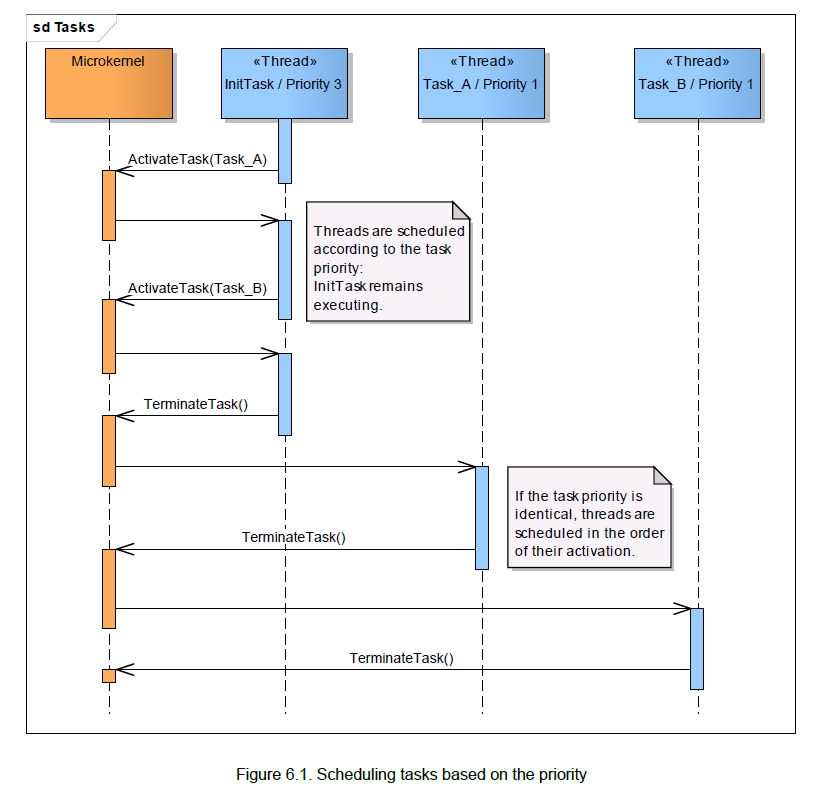

调度策略控制 **EB tresos** 安全操作系统何时决定接下来应该执行哪个任务。存在两种不同的调度策略：

完全抢占式（**full-preemptive**）

如果具有较高优先级的任务就绪，则立即执行。当前执行的任务被抢占并稍后恢复。这种行为在图 **6.2 Scheduling of fully preemptable tasks** 中进行了描述。

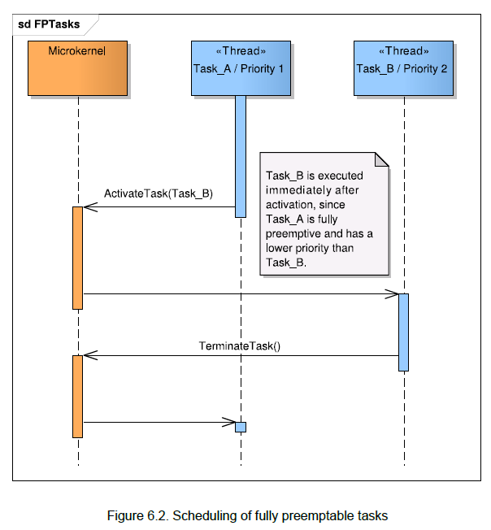

非抢占式（**non-preemptive**）

非抢占式任务继续执行，直到它终止或调用以下服务之一：

* **Schedule()**
* **WaitEvent()** 或 MK_WaitGetClearEvent() 如果事件不存在。

有关 EB tresos Safety OS 如何调度非抢占式任务的信息，请参阅图 **6.3 Scheduling of non-preemptable tasks**。

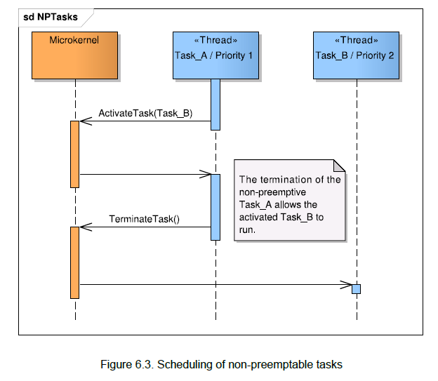

您可以为每个任务设置调度策略。 图 **6.4 Non-preemptive scheduling policy for a task in EB tresos Studio** 描述了如何使用 EB tresos Studio 配置调度策略。

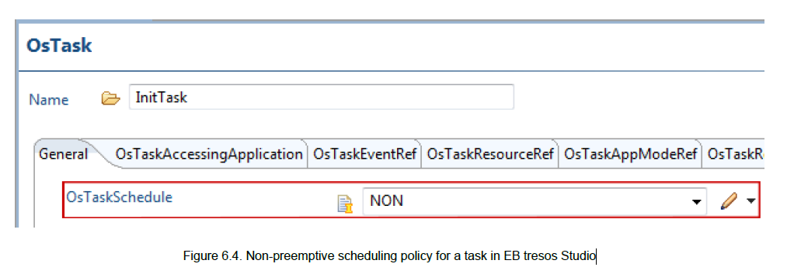

**AUTOSAR** 为任务（**Task**）定义了以下状态：

* 运行（**RUNNING**）
处理器当前正在执行状态为运行（RUNNING）的任务。在处理器的每个内核上，一次只能有一个任务处于运行（RUNNING）状态。

* 挂起（**SUSPENDED**）
处于挂起（**SUSPENDED**）状态的任务是被动的并且可以被激活。

* 准备就绪（READY）
状态为准备就绪（READY）的任务已准备好可由处理器执行，但另一个任务当前占用了处理器。因此，处于准备就绪（READY）状态的任务需要等待，直到调度程序将处理器分配给它。

* 等待（WAITING）
处于等待（WAITING）状态的任务会一直等待，直到发出事件信号。

在 **EB tresos Safety OS** 中，这些状态不是显式维护的，而是根据线程和任务对象的基础状态按需派生的。

## 1.2. 中断和 ISR

硬件组件可以发出中断信号以表示它们需要注意。要对此类请求采取行动，您可以使用中断服务程序 (ISR)。当处理器接受中断请求时，**EB tresos Safety OS** 会激活中断服务例程。

在 **EB tresos Safety OS** 中，每个 **ISR** 都有两个基本属性：

* 中断源（**interrupt source**）

中断源是一种硬件机制，它将外围设备连接到处理器的中断机制。它允许外围设备向处理器请求服务，并且处理器可以控制发出请求的外围设备的请求。正在运行的处理器被中断以服务中断的过程称为向量化（**vectoring**）。在典型的硬件上，中断源是一个寄存器和向量表（**vector table**）中的一个条目。微控制器手册包含一个中断源列表及其含义。对于 **Cortex-M**，中断源由参数 **OsCORTEXMVector** 配置。有关电源架构（**Power Architecture**）的示例，请参见图 **6.6 ISR configuration in EB tresos Studio**。其他 **CPU** 系列有基本类似。

* 中断级别（**interrupt level**）

中断级别是一个数字，其目的类似于任务（**Task**）的优先级。如果正在执行中断服务程序，并且触发了更高级别的中断源，则处理器接受中断请求并抢占当前正在执行的中断服务程序。中断级别是一个依赖于硬件的值，具体含义取决于硬件。一些硬件定义较高的数值表示较高的级别，而另一些硬件定义较低的数值表示较高的级别。对于 **Cortex-M**，您可以使用选项 **OsCORTEXMIrqLevel** 选择 **ISR** 的中断级别。有关电源架构（**Power Architecture**）的示例，请参见图 **6.6 ISR configuration in EB tresos Studio**。其他 **CPU** 系列有基本类似。

注意，编程到硬件中的数字可能与您选择的值不同。这是因为 **EB tresos Studio** 优化了使用的级别范围。但是顺序是会被保留。

图 **6.5 Execution of ISRs** 描述了 **ISR** 的执行。

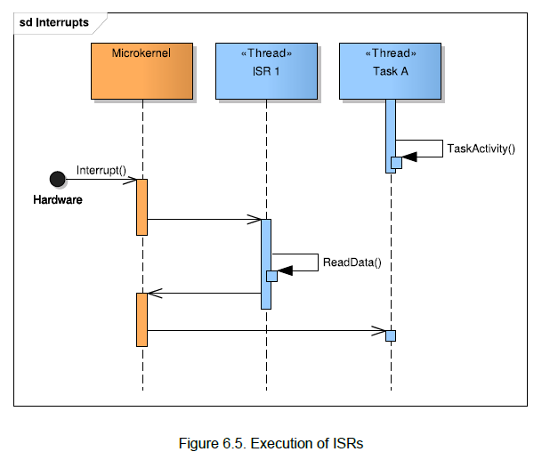

有关电源架构（**Power Architecture**）的示例，请参见图 **6.6 ISR configuration in EB tresos Studio**。其他 **CPU** 系列有基本类似。

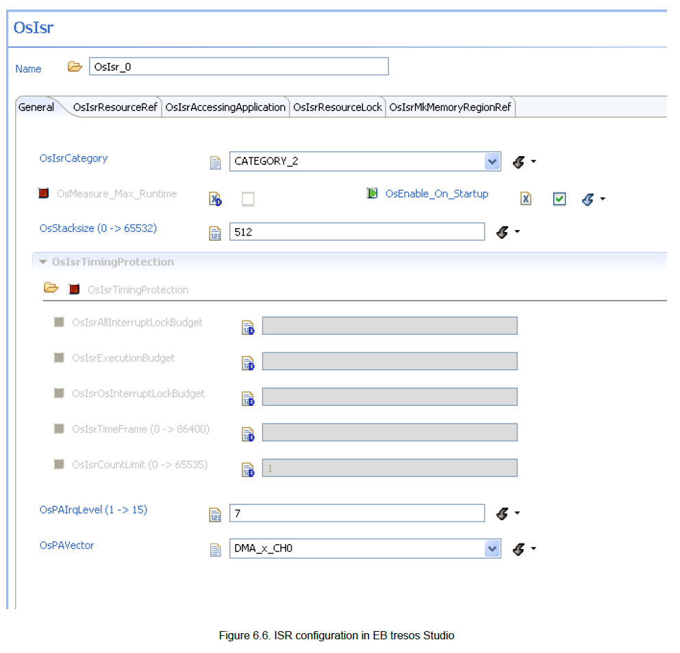

微内核根据其配置的优先级调度 **ISR**，但在执行时将会将其中断级别编程到硬件中。

中断与任务（**Task**）的执行异步发生。这意味着 **ISR** 可以随时抢占任务（**Task**）。如果您不希望这种行为，您可以暂时禁用中断。

您可以使用服务 **DisableAllInterrupts()** 禁用所有中断，也可以使用 **EnableAllInterrupts()** 重新启用中断处理。图 **6.7 Interrupt locks** 显示了一个示例。

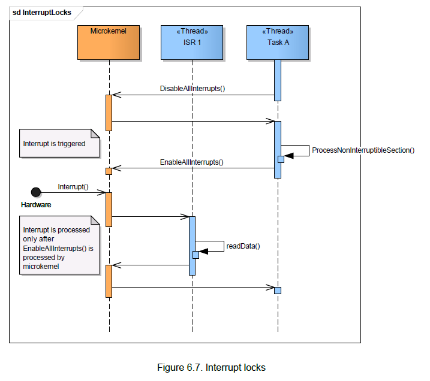

**临界区保护**

如果必须保护临界区免受来自另一个处理器内核的访问，则禁用中断不足以保护多核处理器上的临界区。有关如何实现临界区的更多信息，请参阅第6节，“同步访问公共数据”。

**处理 ISR 类别**

您可以通过配置参数 **OsIsrCategory** 选择从 **AUTOSAR** 已知的中断类别。请注意，**EB tresos Safety OS** 以完全相同的方式处理 1 类和 2 类 **ISR**，即：首先进入微内核，然后如上所述为 **ISR** 启动一个自己的线程。

这两个类别之间的唯一区别是：

* 配置工具强制将 1 类 **ISR** 配置为逻辑上高于任何 2 类 **ISR** 的最高中断级别的中断级别。
* 生成工具为 1 类 **ISR** 的线程生成队列和运行优先级，这些优先级高于任何 2 类 **ISR** 的各自最高优先级。

这些只是源自 **AUTOSAR** 的 **ISR** 类别的初衷的约定。它们旨在为 **EB tresos AutoCore OS** 的配置提供部分交叉兼容性。

作为扩展 **EB tresos Safety OS** 为用户可配置的内部中断（**internal interrupts**）提供了自己的类别，其处理程序不在自己的线程中运行。有关此类别的更多信息，请参阅[内部中断](#121-内部中断)。

### 1.2.1. 内部中断

微内核支持内部中断的概念。内部中断的主要特征是它的处理程序不是在线程中执行，而是直接在内核上下文中执行。它只被内核进入和退出处理的技术上绝对必要的最低限度所包围。内部中断的最初目的是支持需要中断处理的本机内核服务（**native kernel services**），例如：执行预算、时间戳计时器或简单的时间表。出于这个原因，如果您配置了相应的服务并且如果您的衍生产品上的该服务需要它们，则通常会自动生成内部中断的配置。在这些情况下，处理函数作为微内核源代码的一部分提供，不需要您进一步关注。

但是您也可以为自己的目的配置此类内部中断并实现自己的处理程序。为此，您可以按常规方式在 **EB tresos Studio** 中创建 **ISR**，但为参数 **OsIsrCategory** 选择值 **INTERNAL**。如果这样做，除了 **Name**、**OsCORTEXMIrqLevel** 和 **OsCORTEXMVector** 之外的所有配置参数都将毫无意义。如果 **ISR** 是 **INTERNAL**，**EB tresos Studio** 应该将它们中的大多数显示为已禁用或不再可编辑。出于不可避免的技术原因，您必须配置 **OsStacksize**，但您应该将其设置为 **0**，尽管该值同样会被忽略。您可以按照通常的方式将内部中断的 **ISR** 分配给 **OS** 应用程序。这仅在多核环境中有用，因为这将产生的唯一影响是将中断配置为路由到分配应用程序的内核。

如果您以这种方式配置了内部中断，则生成工具会根据您为中断源、级别和内核分配选择的值生成适当的 **IRQ** 配置。它也会生成指向软件中断向量表中的条目，该条目指向具有void OS_ISR_<Name>(void *k, mk_objectid_t p, mk_unsigned_t v) 形式的原型的处理函数。然后，您必须为此标注函数提供一个实现。如果相应的中断发生并导致进入微内核，内核将保存当前上下文并尽可能直接调用该函数，无需进一步的上下文切换、处理器执行状态的更改或内存保护配置的修改。处理函数返回后，微内核可能会选择调度线程，最终恢复传入线程的原始上下文。

如果您使用自己的内部中断，请务必严格遵守以下限制和保留：

* 内部中断处理函数的参数仅供微内核自己的内部处理函数使用。不要使用它们，也不要依赖它们具有一定的价值。
* 请勿从内部处理程序调用任何 **EB tresos Safety OS API**，但 **GetCoreID()** 除外。
* 由于处理程序在内核上下文中运行并且微内核是不可重入的，因此中断被锁定。不要解锁它们。
* 切勿修改内部内核数据结构。如果您的处理程序函数需要一个内存区域，您可以通过通常的方式创建它（参见第 6.8 节，“内存保护”）并使用内核访问对其进行配置。
* 切勿访问专为内核保留的外设的内存映射 **I/O** 区域。如果您需要访问其他外围设备的内存区域，您同样可以通过通常的方式创建内存区域并使用内核访问配置它们。
* 如果访问可能会改变处理器或外围设备的状态，切勿访问专门为微内核保留的专用寄存器。
* 所有内部中断在启动时启用。
* 如果您使用 **EB tresos Safety OS** 生成器来创建您的微内核配置，内部中断的中断级别会受到通常的压缩（如果适用于 CPU 系列）。但是，它们的级别不受锁定级别的计算。因此，没有任何通用的方法可以通过任何微内核的 API 来启用或禁用来自其他可运行实体的内部中断。当且仅当其配置的级别小于或等于适当 ISR 的最高级别时，将中断锁定到该级别的 API 也会锁定内部中断。这也适用于适当的 ISR 被其级别锁定的其他情况，例如在错误hook中运行时。
* 微内核的专有 API MK_DisableInterruptSource() 和 MK_EnableInterruptSource() 不适用于内部中断。
* 当其各自拥有的 OS 应用程序终止时，不会禁用用户配置的内部中断。

您可以在 **EB tresos Safety OS** 安全手册 **CORTEXM** 系列 [SAFETYMANCORTEXM] 中找到有关专有外设和寄存器的更多信息，以及详细的安全要求和限制，特别是在 CPU 系列的补充中，以及处理callout功能。有关如何手动配置内部中断的更多信息，另请参见第 8.4.1 节，“系统范围的配置宏”，尤其是。 MK_SOFTVECTOR_nnnn 的条目和第 8.4.5 节，“中断源的配置”。

**使用内部中断**

由于内部中断完全在内核上下文中运行，因此所有内核数据和外围设备都暴露给它们。同时他们通常还有权修改 **MCU** 中的几乎所有内容，错误的内部中断处理程序可能会导致 **EB tresos Safety OS** 未定义的行为。用户配置的内部中断处理程序必须被评估为系统的最高安全完整性级别，以确保它们不会对内核数据或外围设备执行任何不利的访问。

如果您可以绝对确保用户定义的内部中断处理程序不会对微内核的状态产生不利影响，则才可以被使用。相反，您应该尽可能尝试使用正确的第 1 类或第 2 类 **ISR**。

## 1.3. 受信任函数

受信任函数通常是由应用程序提供的服务，与调用任务（**Task**）或 **ISR** 相比，它们需要使用自己的处理器模式和内存保护设置运行。

### 1.3.1. 受信任函数简介

受信任的函数是可执行的子程序，它们不能在调用者的环境中执行，因为它们需要额外的权限或通常需要特殊的环境。示例是需要在主管模式下运行的功能，例如：执行硬件访问或需要对调用者没有的特殊内存区域进行写访问。

每个受信任函数都有一个配置的处理器模式。在该模式下启动它，并且可以有自己的内存保护配置。此外它被分配给某个内核，并且只能在多核系统中在该内核上被调用。

当应用程序通过 CallTrustedFunction() 调用受信任函数时，如果调用内核上没有其他受信任函数已运行，则在微内核中会发生以下行为：

1. 微内核激活受信任函数线程，这是一个执行受信任函数的特殊线程。设置优先级以便线程在调用者的线程之前。处理器模式和内存保护设置设置为受信任功能配置的设置。
2. 微内核抢占调用者的执行，执行受信任函数线程。在那环境中使用提供给 CallTrustedFunction() 调用的参数执行请求的受信任函数。
3. 当受信任函数结束时，受信任函数线程也会一并结束，微内核将控制权交还给调用者。

这种行为如图 **6.8 Execution of a trusted function** 所示。

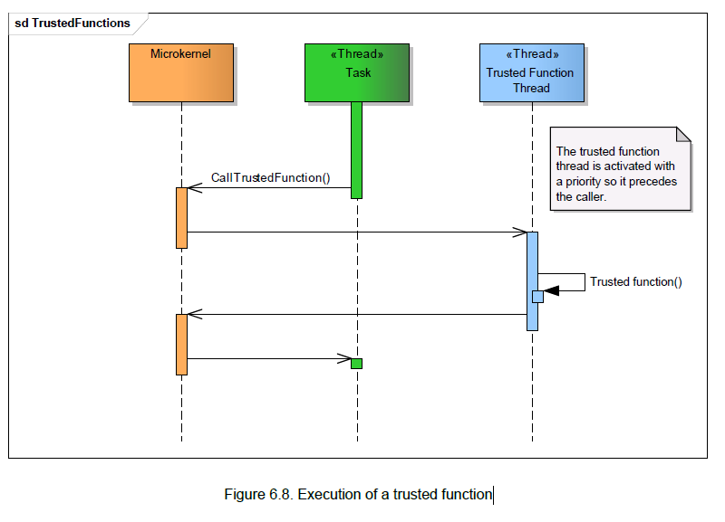

如果调用了一个受信任函数并且该受信任函数线程已经被另一个受信任函数占用，则行为变化如下：

1. 微内核将受信任函数加入到受信任函数线程队列中，然后它会提高受信任函数线程的优先级，以便它在调用者的线程之前。

2. 微内核抢占调用者的执行，继续受信任的函数线程。在那里，当前受信任的功能以及所有排队的功能都使用正确的设置和参数执行。这意味着，例如处理器模式和内存设置适用于线程中执行的每个受信任函数。

3. 当队列为空时，受信任函数线程结束，微内核将控制权交还给具有最高优先级的受信任函数调用者。由于受信任函数线程已被占用，因此有多个调用者。

在每种情况下，当控制权转移回受信任函数的调用者时，该受信任函数在该点被执行并结束。

### 1.3.2. 受信任功能的配置和使用

如果您想在 **EB tresos Safety OS** 中使用受信任函数，您可以使用 **EB tresos Studio** 在配置容器 /Os/OsApplication/OsApplicationTrustedFunction 中配置受信任函数。您可以在那里配置受信任函数本身，包括受信任函数特定的内存区域、处理器模式、必要的堆栈大小和其他属性。

在您的应用程序代码中，调用服务 CallTrustedFunction() 以调用受信任函数。第一个参数是函数索引。这是受信任函数配置列表**MK_CFG_TRUSTEDFUNCTIONLIST**中对应函数的索引。如果您使用 **EB tresos Studio** 生成基本配置，您可以在文件 **Mk_gen_user.h** 中找到带有受信任函数名称的常量，您可以将其用作函数索引。

## 1.4. 与 QM-OS 的交互

微内核并未实现 **AUTOSAR** 定义的所有 **API** 服务。具有完整性类别3（**integrity category 3**）的 **API** 服务由 **QM-OS** 实现。具有完整性类别2（**integrity category 2**） 的 **API** 服务在微内核中实现了一个包装器，该包装器在称为 **QM-OS** 线程的特殊线程中执行相应的 **QM-OS** 服务。 有关完整性类别的更多信息，请参阅 [SAFETYMANCORTEXM]。

### 1.4.1. 完整性类别2的服务

具有完整性类别2的服务是由 **QM-OS** 实现，但在微内核中有一个包装器以确保不受数据域干扰的服务。为了做到这一点，微内核包装器启动一个特殊的线程，**QM-OS** 线程并在这个线程中执行 **QM-OS** 服务。 图 **6.9 Execution of a QM-OS service** 显示了完整性类别 2 服务的处理。

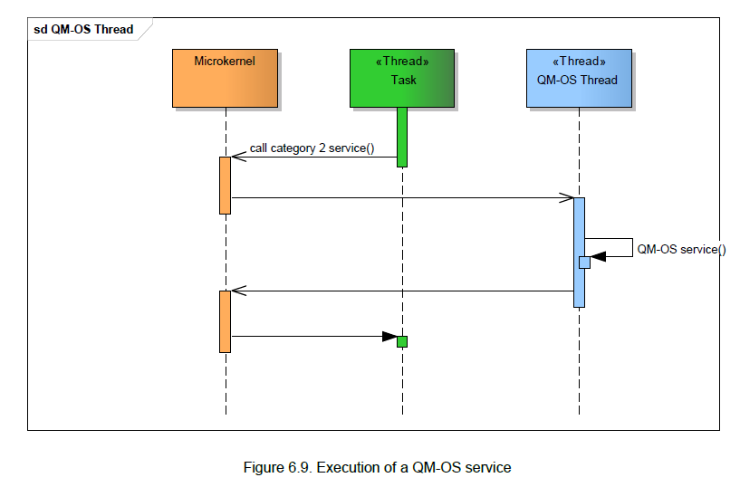

完整性类别 2 服务的处理类似于可信功能的处理，如图 **6.8 Execution of a trusted function** 所示。

如果您使用 **EB tresos Studio** 配置微内核，**QM-OS** 线程会自动访问必要的内存区域并具有适当的处理器模式。除此之外，您可以在设置要添加的内存区域的参数 /Os/OsMicrokernel/MkMemoryProtection/MkMemoryRegion/MkMemoryRegionOsThreadAccess 时向线程添加对更多内存区域的访问。您还可以使用参数 /Os/OsMicrokernel/MkThreadCustomization/MkOsThreadMode 更改线程处理器模式，但您不应该这样做。

完整性类别 2 的服务在第 8.2 节 微内核 API 参考 中标记为 **MK/OS**。

### 1.4.2. 完整性类别3的服务

具有完整性类别 3 的服务是由 **QM-OS** 实现的服务，无需微内核任何附件功能。它们直接在调用者的上下文中执行，并且不像完整性类别 1 和 2 服务那样提供不受干扰的自由。因此，如果在 **ASIL** 分区中使用此类服务，调用者必须采取适当的措施。

如果您使用 **EB tresos Studio** 配置微内核，任务（**Task**）和 ISR 会自动访问必要的内存区域。因此，您无需在 **EB tresos Studio** 中显式配置任何内容。

完整性类别 3 的服务在第 8.2 节 微内核 API 参考 中标记为 **OS**。

## 1.5. 多核运行

微内核能够在多核处理器的两个或更多核上同时执行。当微内核配置为多核操作时，针对 **OS** 对象的静态内核分配的 **AUTOSAR** 概念允许微内核独立于其他内核操作每个内核。为任务（**Task**）和 **ISR** 所描述的调度机制会独立应用于每个内核上。

内核间请求通过消息传递执行，因此在目标对象配置为运行的内核上进行处理。这种机制避免了微内核内部对内核间同步锁的需要。

### 1.5.1. 内核索引和物理内核的映射

**AUTOSAR** 区分物理内核ID和逻辑内核ID。微内核使用类似于但不等于 **AUTOSAR** **CoreID** 的逻辑内核索引。这些内核索引从值 **0** 开始编号，一直编到 **MK_MAXCORES - 1** 的值，这取决于硬件。有关逻辑内核索引及其到物理内核的映射的更多信息，请参阅第 9.12 节，Cortex-M 处理器上的多核支持。

逻辑内核索引在软件中用作参数以及在配置中用于识别不同的内核。

如果启用了高级逻辑内核标识符，则可以配置与上述默认映射不同的内核映射。您可以在 [ASCOS_USERGUIDE]中找到有关此主题的更多信息。

**负内核索引**

一些微内核服务需要内核索引作为参数。除了硬件支持的逻辑内核索引之外，这些服务还允许负值作为内核索引。负内核索引将被这些服务将解释为当前内核。

这个处理被几个微内核服务用来为当前内核提供一个简单版本的服务。例如，对 MK_GetPanicReasonForCore(-1) 的调用与 MK_GetPanicReasonForCore(i) 的行为方式相同，其中 i 是当前内核的内核索引，也与 MK_GetPanicReason() 的方式相同。

### 1.5.2. 内核间通信

您可以从任何内核请求任务激活（**task activations**）、事件设置（**event settings**）和 QM-OS 服务（**QM-OS services**），而不管目标对象配置为哪个内核。微内核提供了两种机制来处理内核间请求：

#### 1.5.2.1. 同步内核间请求（Synchronous inter-core requests）**

同步内核间请求是一种用于触发另一个内核上的工作并需要返回该工作结果的服务的机制。一个示例是 API **ActivateTask()**，如果它被分配给与调用它的内核不同的内核的任务调用它。

在这种情况下，微内核执行以下操作：

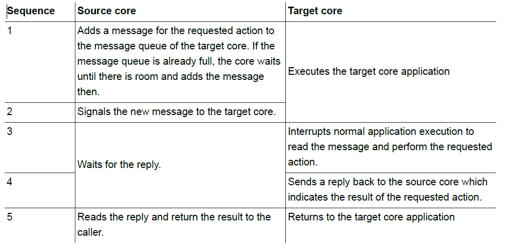

源内核（**Source core**）标识为调用 **API** 服务的内核。目标内核（**Target core**）标识为必须在其上执行 **API** 功能的内核，例如：任务运行的内核，他需要被 **ActivateTask()** 调用激活。

信号是通过内核间中断（**inter-core interrupts**）完成的，这些中断在分配给它们的所有已使用中断中具有最高优先级。通过这种方式设置优先级，以便这些中断不会被任何中断锁定 API 锁定，尤其是包括 **SuspendAllInterrupts()** 和 **DisableAllInterrupts()**。如果您使用 **EB tresos Studio** 进行配置，则无需配置这些中断。如果您手动配置微内核，您可以在第 9.12 节 **Cortex-M 处理器上的多核支持** 中找到有关内核间中断的更多信息。

**向错误hook报告错误**

如果在执行包含对另一个内核的请求的 API 期间识别出错误，则识别错误的内核是需将错误报告给错误挂钩（**error hook**）的内核。另一个内核不向错误挂钩报告错误。与在何处识别错误无关，如果存在与错误对应的返回值，则将该返回值返回给调用者。

示例：如果使用无效的任务（**Task**） ID 调用 ActivateTask()，则该错误已在源内核上已经识别出来，所以源内核也会报告给错误挂钩。如果在另一边，任务 ID 是有效的，但新任务激活超过了激活计数器，这将在目标内核上识别并报告给那里的错误hook。

#### 1.5.2.2. 异步内核间请求（Asynchronous inter-core requests）**

同步的内核间请求在 **CPU** 时间上是昂贵的。因此微内核通过添加一组异步发后不理（**fire and forget**） API 来扩展 **AUTOSAR API** 以处理内核间请求。如果满足参数的静态可验证条件，例如：通过范围检查，在消息为目标内核排队后，立即将结果代码 **E_OK** 返回给调用者。如果检测到诸如 **E_OS_LIMIT** 之类的动态错误，则通过 **ErrorHook()** 函数进行报告。然而，调用者将不会被通知到。

异步 API 可用于所有对象，即使是与调用者在同一内核的对象。对于同一内核上的微内核对象，异步调用被转换为同步调用。但是，如果调用者运行在一个高优先级，对 **QM-OS** 服务的异步调用可以会被加入队列并稍后执行。

您可以通过名称来识别异步 API。它们以前缀 **MK_** 开头，因为它们是特定于微内核的函数，后跟 **Async** 表示异步，并以 **AUTOSAR API** 名称结尾。 **MK_AsyncActivateTask()** 是 **ActivateTask()** 的异步版本。

## 1.6. 同步访问公共数据

在多任务环境中，任务（**Task**）和 **ISR** 通常共享对大量物理资源和系统资源的访问。在 **EB tresos Safety OS** 中，锁（**locks**）提供了一种协调对共享数据的并发访问的方法。微内核的锁机制实现了由 AUTOSAR 资源（**AUTOSAR resources**）、中断锁（**interrupt locks**）和自旋锁（**spinlocks**）指定的所有协调机制。同时也包括由资源和自旋锁组合而成的特定的 EB 供应商的锁（**EB-vendor-specific lock**）。

### 1.6.1. 资源

**AUTOSAR** 将资源(**Resource**) 指定为用于同步在同一内核上（**on the same core**）执行的**Task**任务和 **ISR** 的机制。资源没有死锁（**deadlock**）和优先级倒置（**priority inversion**）。

#### 1.6.1.1. 死锁预防

当一个**Task**任务或 **ISR** 尝试获取已被第二个**Task**任务或 **ISR** 占用的锁，而第二个**Task**任务或 **ISR** 等待获取已被第一个**Task**任务或 **ISR** 占用的锁时，就会发生死锁。**OSEK/VDX** 资源对象通过施加一组限制来防止死锁情况：

* 只有当所有资源都可用时，**Task**任务或 **ISR** 才会从 **READY** 过渡到 **RUNNING**。
* **Task**任务或 **ISR** 在持有资源时不能终止，也不能进入 **WAITING** 状态。
* 必须按照 **LIFO**（后进先出）顺序获取和释放多个资源。 这意味着每个 **Task**任务或 **ISR** 在逻辑上管理它在堆栈上所需的资源。
* **Task**任务或 **ISR** 不得尝试获取其已拥有的资源。

#### 1.6.1.2. 优先级反转

当高优先级**Task**任务 (TH) 被迫无限期地等待低优先级**Task**任务 (TL) 完成时，就会出现优先级反转。当 TL 持有 TH 所需的锁时，就会出现这种情况。TH 在获得锁之前不会进入 RUNNING 状态。在 TL 释放它之前，锁不可用。虽然TL持有锁的执行时间是有限的，但是任何优先级在TL和TH之间的Task（TM）都可以抢占TL，阻止它释放锁。这种行为可能发生无数次，可能是由几个不同的 TM 任务造成的，因此会在不确定的时间内延迟 TH 的执行。

为防止出现这种情况，**EB tresos Studio** 确定使用资源的所有**Task**任务 或 **ISR** 的最高优先级。此优先级称为资源的上限优先级。每当**Task**任务 或 **ISR** 获取资源时，**Task**任务 或 **ISR** 的优先级设置为计算的上限优先级。当资源被释放时，旧的优先级又恢复了。这种方法称为 **OSEK/VDX** 优先级上限协议（**priority ceiling protocol**）。或在某些文献中被称为优先级上限仿真协议（**priority ceiling emulation protocol**）。

该协议确保在**Task**任务 TL 持有资源时，不会执行优先级低于**Task**任务 TH 的 **Task**任务。**Task**任务 TL 优先执行，直到它释放其资源的那一刻，从而使**Task**任务 TH 变为 RUNNING 状态。

#### 1.6.1.3. 资源的配置和使用

如果您想在 **EB tresos Safety OS** 中使用资源，**EB tresos Studio** 可以轻松配置它：

1. 如图 **6.10 Resource configuration in EB tresos Studio** 所示，创建资源。

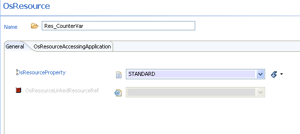

2. 为每个使用资源的任务（**Task**）和 ISR 配置对资源的引用，请参见图 **6.11 Referencing a resource in EB tresos Studio**。

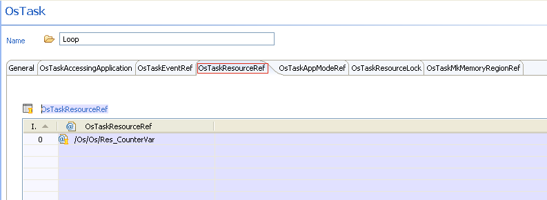

在您的应用程序代码中，调用服务 GetResource() 以获取资源，并调用 ReleaseResource() 以在临界区之后释放它。 图 **6.12 Resources** 中描述了此过程的一个示例。


### 1.6.2. 调度程序资源（The scheduler resource）

OSEK/VDX 将调度程序资源 (**RES_SCHEDULER**) 指定为由所有任务隐式共享的资源，而无需为每个任务显式配置它。 **AUTOSAR** 规范的最新版本省略了 **RES_SCHEDULER**，但 **EB tresos Studio** 和微内核保留了对向后兼容性的支持。

在多核环境中，每个配置的核都有自己的 **RES_SCHEDULER** 的副本（**own cooy**）。因此在特定内核上的任务中调用 **GetResource(RES_SCHEDULER)** 会阻止该内核上的所有其他任务运行，直到 **RES_SCHEDULER** 再次被释放。

### 1.6.3. 中断锁（Interrupt locks）

中断锁定是防止更高优先级任务或 ISR 在同一内核（**on the same core**）上执行的便捷方式。

#### 1.6.3.1. 介绍

AUTOSAR 使用微内核支持的相关 API 指定了几种不同的中断锁类型：
* 锁定所有类别1的和类别2的中断：如果需要嵌套，则为 **SuspendAllInterrupts()** 和 **ResumeAllInterrupts()**；如果不需要嵌套，则为 **DisableAllInterrupts()** 和 **EnableAllInterrupts()**。
* 锁定类别2的中断：**SuspendOsInterrupts()**、**ResumeOsInterrupts()**。

虽然 **DisableAllInterrupts()** 和 **EnableAllInterrupts()** 服务只是启用或禁用中断，但其他中断锁服务会存储先前的锁定状态并使用获取计数器（**acquisition counter**）。这意味着第一个 **SuspendXxxInterrupts()** 调用存储当前的中断锁定状态，禁用相应的中断并增加采集计数器。对同一服务的进一步调用不会更改中断锁，而只会增加获取计数器。服务 **ResumeXxxInterrupts()** 递减获取计数器。它最终会恢复存储的中断锁状态，但前提是获取计数器达到**0**。否则它保持中断锁不变。

两组 **Suspend/ResumeAllInterrupts()** 和 **Suspend/ResumeOsInterrupts()** 有自己独立的采集计数器。

#### 1.6.3.2. 中断锁的配置和使用

如果要使用中断锁，并不需在 **EB tresos Safety OS** 中进行配置。只需在您的应用程序中使用相应的服务。

不要混淆 **Suspend/Disable** 和 **Resume/Enable** 服务以及不同锁类型的 **Suspend** 和 **Resume** 服务。如果你使用例如 **SuspendAllInterrupts()** 获取中断锁，使用 **ResumeAllInterrupts()** 再次释放。

同时也不要嵌套在另一个中断锁中使用 **DisableAllInterrupts()/EnableAllInterrupts()**。

**使用资源而不是中断锁**

您不应该使用中断锁，而是需使用资源来代替。与微内核中的资源相比，中断锁没有性能优势，并且资源可以达到比中断锁更精细的保护粒度。

### 1.6.4. 自旋锁（Spinlocks）

自旋锁是一种在多核环境中同步运行在不同核上（**on different cores**）的任务的机制。顾名思义，等待自旋锁是一个忙等待（**busy-waiting**）的活动。

#### 1.6.4.1. 自旋锁的配置和使用

**AUTOSAR** 指定了自旋锁机制和相关的 **API**，允许任务（**Task**）和 ISR 使用配置的自旋锁。微内核中的自旋锁实现基于 **AUTOSAR** 规范。

如果您想在 **EB tresos Safety OS** 中使用自旋锁，您可以通过创建自旋锁来实现，即 **EB tresos Studio** 中的 **Os/OsSpinlock** 容器。

在您的应用程序代码中，调用服务 **GetSpinlock()** 或 **TryToGetSpinlock()** 来获取自旋锁，并调用 **ReleaseSpinlock()** 来释放它。

#### 1.6.4.2. 死锁预防

自旋锁不是没有死锁的，可能会发生死锁。例如：如果两个内核想要使用相同的两个自旋锁，但使用不同的序列来获取它们。虽然第一个内核获得了自旋锁 **sp1**，现在尝试获得自旋锁 **sp2**，但第二个内核已经可以获得 **sp2**，现在尝试获得 **sp1**。在注意防止这种死锁之前，两个内核都无法继续。

自旋锁也不会阻塞与调用者在同一内核上的任务（**Task**）。例如：如果获得自旋锁的任务（**Task**），被同样需要该自旋锁的更高优先级任务（**Task**）抢占，则更高优先级任务将永远自旋以获取锁，并且形成死锁。

**AUTOSAR** 定义了一些机制和 API 返回值来防止这种死锁。 然而微内核并没有实现任何这样的机制。应用程序必须确保以某种方式使用自旋锁，以免发生死锁。

如何防止死锁取决于应用程序本身。 以下提示是一个很好的起点：

* 如果需要多个自旋锁，请始终以相同的顺序获取自旋锁。
* 如果一个自旋锁被同一个内核上具有不同优先级的多个可抢占任务使用，则将使用自旋锁的部分封装到适当的临界区中，例如：通过使用资源。

### 1.6.5. 组合锁

微内核提供了一种特定于 EB 供应商（**EB-vendor-specific**）的机制的锁，可以称之为组合锁（**combined lock**）。它本质上是自旋锁（**spinlock**）与内核本地锁（**a core local lock**）的一种组合，其行为类似于中断锁（**interrupt lock**）或者资源（**resource**）。

除了其正常的自旋锁属性外，这种组合锁还有一个上限优先级（**a ceiling priority**）和一个中断锁级别（**an interrupt lock level**）。当这样的锁被成功获取时，调用者的优先级被提升到上限的优先级，中断锁级别被提升到组合锁的锁级别，并且获得自旋锁。这种行为有效地防止了其他优先级低于上限优先级的任务（**Task**）和低于锁定级别的中断被执行。

如果锁获取失败或者**API**返回重试状态（即：返回值为**MK_E_TRYAGAIN**）时，则优先级和锁级别保持不变。锁的任何部分都没有被获得占用。

#### 1.6.5.1. 组合锁的配置和使用

如果您想在 **EB tresos Safety OS** 中使用组合锁，您可以在 **EB tresos Studio** 中通过创建自旋锁（即：**Os/OsSpinlock** 容器）并将 **Os/OsSpinlock/OsSpinlockLockMethod** 参数更改为预定义的组合锁的配置值来执行此操作：
* **LOCK_NOTHING**：标准自旋锁。
* **LOCK_ALL_INTERRUPTS**: 一种组合锁，自旋锁外加针对所有中断的中断锁。
* **LOCK_CAT2_INTERRUPT**：一种组合锁：自旋锁外加针对所有2类中断的中断锁。
* **LOCK_WITH_RES_SCHEDULER**：一种组合锁：自旋锁加一个类似于获取 **RES_SCHEDULER** 的锁。有关更多信息，另请参阅第 6.6.2 节，调度程序资源。

您还可以手动配置具有单独的上限优先级和锁定级别的组合锁。有关更多信息，另请参阅第 8.4.11 节，锁的配置。

在您的应用程序代码中，调用服务 GetSpinlock() 或 TryToGetSpinlock() 以获取组合锁，并调用 ReleaseSpinlock() 以释放它，就像您将它们用于自旋锁一样。

**注释：**

* 如果除了自旋锁之外还需要本地锁，则组合锁可以减少微内核开销。
* 组合锁具有类似于第 6.6.3 节中断锁（**Interrupt locks**）的获取计数器。如果您多次获取组合锁，则在第一次调用时获取锁，并且获取计数器设置为 1。进一步获取只会增加获取计数器。当组合锁被释放时，每次释放时获取计数器都会递减。只有当它再次达到 0 时，锁才真正被释放。

#### 1.6.5.2. 死锁预防

组合锁不是没有死锁的。只要选择了适当的组合锁，上述自旋锁中已知的抢占任务的死锁场景就不再适用了。例如：**LOCK_ALL_INTERRUPTS** 来有效地防止了任务抢占。但是一下其他场景，例如来自自旋锁部分的多个锁的场景仍然存在。有关更多信息，可请参阅第 6.6.4.2 节，预防死锁。

因此与自旋锁一样，应用程序必须确保以某种方式使用自旋锁，不会发生死锁。

## 1.7. 事件

在嵌入式系统中，通常需要通知任务（**Task**）状态转换或其他特殊事件。事件就是一种实现此类通知的机制。

事件是分配给任意扩展任务（**Task**）的专有信号。您可以将多个事件分配给同一任务（**Task**）。一个任务（**Task**）可能会等待一个或多个事件，从而进入 **WAITING** 的状态。任何任务（**Task**）都可以为任意任务（**Task**）设置事件。如果接收任务（**Task**）至少需等待这些事件中的某一个事件，则设置事件会导致接收任务（**Task**）进入 **READY** 的状态。

图 **6.13 Events** 显示了如何利用事件的示例性行为。

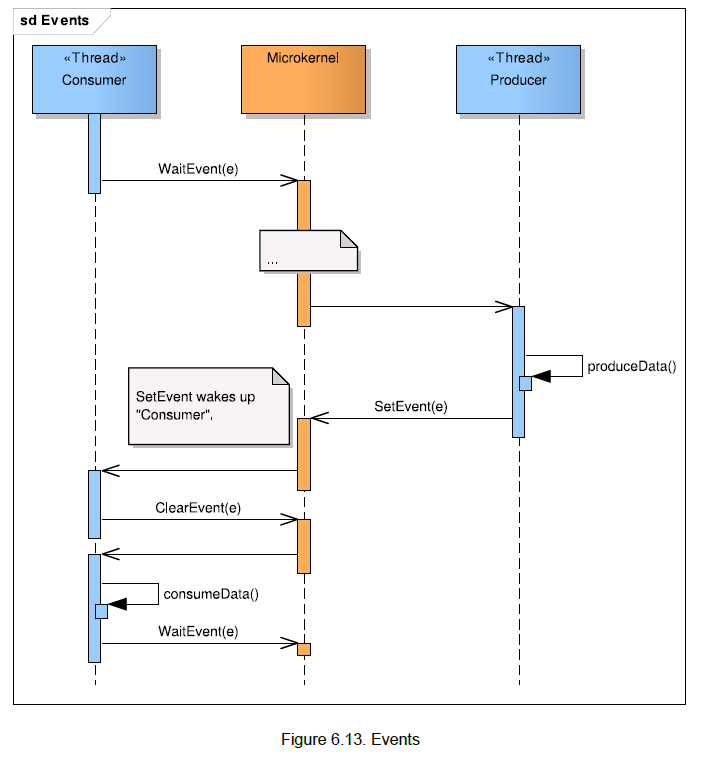

## 1.8. 内存保护

AUTOSAR 兼容的操作系统的内存保护边界基于OS对象（**OS-objects**）和OS应用程序（**OSApplications**）：每个 OS 对象都有自己的堆栈内存区域和私有数据（**private data**）的内存区域。此外每个应用程序都存在一块共享区域。您可以使用驻留在此共享区域中的变量在应用程序的OS对象之间交换信息。这种类型的配置如图 **6.14 Memory protection boundaries based on OS-Applications** 所示。

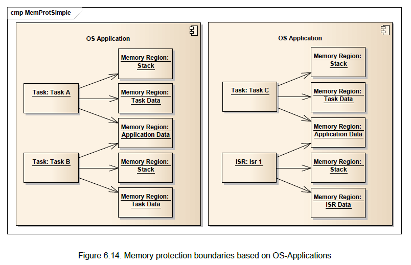

当您在 **EB tresos Studio** 中将任务（**Task**）和 ISR 分配给OS应用程序时，会自动创建内存保护配置。

**OS应用程序的内存保护配置** 

将所有OS应用程序的 **OsTrusted** 选项配置为 **FALSE**。否则，OS应用程序的对象将获得额外的内存访问权限。

### 1.8.1. 细粒度内存区域控制

除了上述内存保护配置之外，**EB tresos Safety OS** 还提供了对不同内存区域及其与**OS对象**关联的非常精细的控制。您可以配置额外的内存区域并将这些内存区域与**任务（**Task**）**和**ISR**相关联。

有关如何使用 **EB tresos Studio** 配置附加内存区域的信息，请参见图 **6.15 Configuration of additional memory regions with EB tresos Studio**。

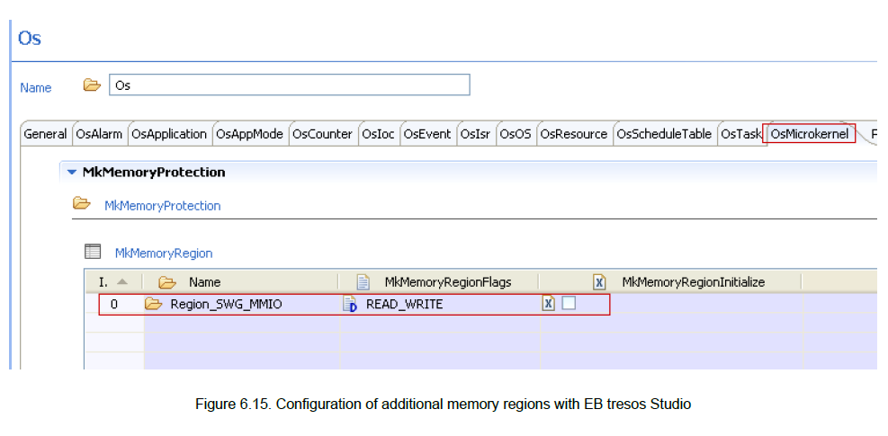

有关如何将内存区域添加到任务（**Task**）的信息，请参见图 **6.16 Referencing a memory region within a task in EB tresos Studio**。

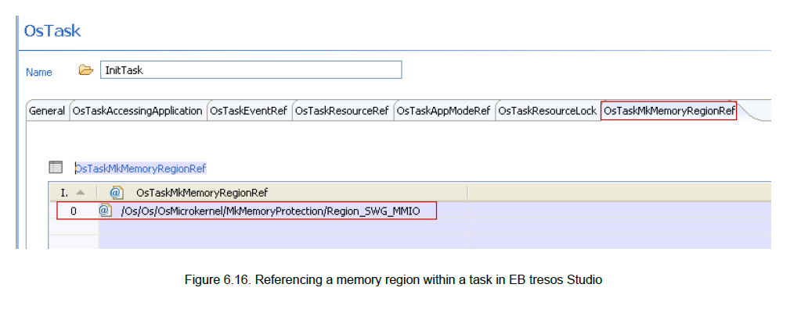

### 1.8.2. 例子

您可以将内存保护配置的细粒度控制用于不同目的。本节展示了两个典型的用例。

#### 1.8.2.1. 限制对外围设备的访问

通常希望将对外设的访问限制在选定的os对象上。如果外设的输入/输出空间是内存映射的，则可以通过使用内存地址空间的专用部分来访问外设，这样也就可以使用内存保护的方式来限制对选定外设的访问。

为了达到此目的，可创建一块专用的内存区域，通过该区域来引用相关外设的内存映射 **IO** 空间。在选定的OS对象中引用此内存区域，并确保没有其他内存区域允许访问此外设。

**对OS对象的附加规定**

依赖于微控制器（**microcontroller**）和外围设备（**peripheral**），可能会需要一些附加的规定。例如：在特权模式（**privileged mode**）下执行 OS 对象。在本示例暂且假定非特权模式已经足够。同时一些其他硬件机制（如：外围设备的保护）可能能够提供额外的保护，并且可能需要独立于本示例进行额外的配置。

### 1.8.3. 在操作系统对象之间交换数据

您可以使用分配给不同OS对象的共享内存区域进行交换数据。执行此操作时，您必须确保数据的一致性。

如果数据有一个发送端（**source**）和一个接收端（**sink**），一个非常适合的方法是生产者-消费者（**producer-consumer**）设计模式。 一个OS对象充当生产者并将数据生成到共享区域中，而消费者则从共享区域读取数据并进一步处理。

您必须考虑生产者-消费者设计模式的两个特殊性：

1. 生产者和消费者共享的内存必须映射到内存区域。
2. 共享数据必须保持一致，例如：使用某种形式的同步。

#### 1.8.3.1. 访问权限

要将数据映射到内存区域，您必须首先知道如何访问数据。生产者-消费者模式适用于以下访问方案：
* 生产者将数据写入共享区域。
* 消费者从共享区域读取数据。

特别是，消费者是不需要对共享区域的内容进行写访问。

**数据确认**

如果消费者需要与生产者通信，您可以使用消费者可写且生产者只读的内存区域。如果消息足够小，使用单个Bit位即可容纳下，则可以使用事件来代替。有关详细信息，请参阅[第1.7节事件](#17-事件)。

有关如何将此访问方案映射到内存区域的信息，请参见图 **6.17 Using memory regions to share data**。

* 一块内存区域被生产者所引用。该区域的访问权限被设置为读/写（**read/write**）。
* 另一个内存区域被具有只读访问权限的消费者所引用。
 
两个区域都引用相同的地址范围，仅在各自的访问权限上有所不同。

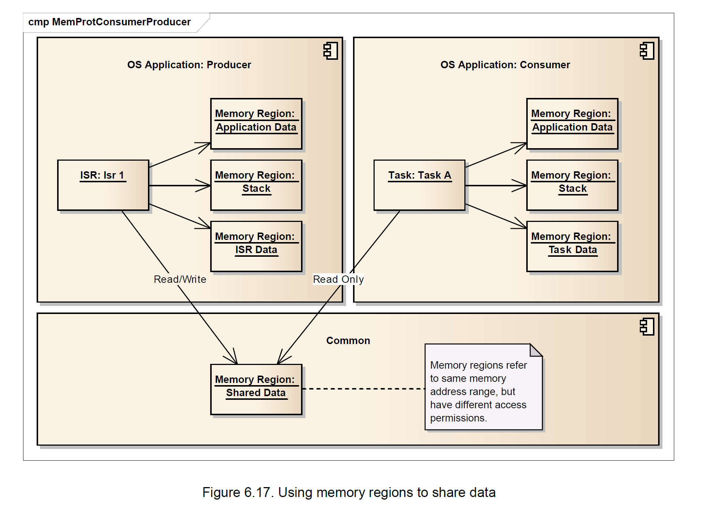

**RAM 读访问**

您可能希望使用一个被所有OS对象所共享的区域，并授予对整个**RAM**的读取访问权限。在这种情况下，消费者不需要不同的内存区域。**EB tresos Studio**会自动生成这样一个区域，请参阅第 7.4.2.9.3 节 使用 EB tresos Studio 时的内存区域 中的 **MK_GlobalRam**

#### 1.8.3.2. 数据一致性

有几种机制可以使消费者和生产者之间的数据保持一致：

* 您可以使用锁（**locks**）来实现生产者和消费者的互斥。
* 您可以使用适当的调度设置（**appropriate scheduling settings**）来保证生产者和消费者的互斥。
* 即使从生产者和消费者并行访问，您也可以使用提供一致视图的数据结构（**data structures**）和访问模式（**access patterns**）。本示例部分未对此方法进行描述。

**使用锁实现互斥**

锁（**Lock**）是一个占位符，涵盖了可用于确保互斥的几种不同机制。这些机制包括资源（**resources**）、中断锁（**interrupt locks**）、自旋锁（**spinlocks**）和组合锁（**combined locks**）。有关更多信息，另请参阅[第6.6节 同步访问公共数据](#16-同步访问公共数据)。

这些机制中的每一个都有自己的应用领域，您必须适当地选择它们。

* 如果生产者和消费者在同一个核上，即：在单核系统和多核系统中同一个核，则使用资源和中断锁。
* 如果将生产者和消费者分配到不同的内核，则使用自旋锁。
* 组合锁适用于分布在多个内核或者同一内核上的多个生产者和/或消费者的情况。

当在使用锁是，需为生产者和消费者配置适当的锁。

* 在访问临界区之前，调用相应的锁获取函数，例如：在使用资源的情况下，调用GetResource() 。
* 在离开临界区之后，调用相应的锁释放函数，例如：在使用资源的情况下，调用ReleaseResource()。

这样可以保证生产者和消费者不能同时进入临界区。

**使用适当的调度设置来保证生产者和消费者的互斥**

在以下的情况下，因为避免了生产者和消费者对共享数据的伪并行访问，所以可以使用此方法:

* 如果生产者和消费者都是任务（**Task**），并且这些任务分配给同一个内核。
* 如果两个任务都被标记为非抢占，它们不能异步抢占对方。 
* 如果两个任务都选择了相同的调度优先级，它们根本不能互相抢占。

推荐使用锁来解决互斥问题，因为这样提供了更好的代码可维护性。可以将锁限制在临界区，每个场景都有锁，尤其是多核系统中的临界区。另一方面，可以通过使用调度设置（**scheduling settings**），来提高运行性能，因为调度设置不需要系统调用。

## 1.9. 时序保护

要在符合 AUTOSAR 的操作系统中实施时序保护，需限制分配给每个任务（**Task**）或 ISR 的执行时间。为此需强制执行两个限制：

1. 每次调用任务（**Task**）或 ISR 的执行时间。
2. 每个任务（**Task**）或 ISR 的激活频率。

目的是保证有足够的可用处理器时间来满足所有实时期限。然而，这种保证所需的调度分析并非易事。

此外仅这些限制不足以确保系统正确运行，因为没有机制可以对激活频率应用一个最低下限。出于这个原因，在许多情况下最终期限监控（**deadline monitoring**）优于 AUTOSAR 时序保护。

尽管如此，微内核还是为 AUTOSAR 时序保护提供了一些支持。微内核还提供了一些低级服务，可以使用这些服务来构建其他形式的时序保护。微内核提供的时序保护功能包括时间服务（time **services**）和执行预算监控（**execution budget monitoring**）。有关详细信息，请参阅[第6.9.1节时间服务](#191-时间服务)和[第6.9.2节执行时间预算](#192-执行时间预算)。

### 1.9.1. 时间服务

微内核的时间服务基于一个长持续时间(**long-duration**)的计时器，该计时器要么由硬件直接提供，要么来源于较短持续时间的硬件计时器。通过长持续时间计时器测量的持续时间是经过设计的，因此永远不必考虑计时器溢出的影响。

为实现此功能，微内核使用**mk_time_t**的64位的数据类型来操作原始时间值。数据类型在参考部分中进行描述。

当您处理较短的时间间隔时，使用**32**位的数据类型通常更方便。为此，微内核也使用**mk_unit32_t**的基本无符号整数类型。

微内核提供了一组服务，您可以使用它们来获取时间并使用绝对时间（**absolute time**）和时间间隔（**intervals of time**）。这些服务在以下段落中，进行了简要的描述，在第 8.2 节微内核API参考中进行了详细描述。您可以从以任何处理器模式运行的线程调用所有这些服务。不需要特殊特权。

**MK_ReadTime** 

为了访问原始计时器值，微内核提供服务**MK_ReadTime**。通过调用此服务获得的时间值可以被视为在过去某个时间从零开始。它们会不断增加，直到下次重新启动系统。定时器的确切范围取决于硬件及其配置，请参见**第9.7节Cortex-M 处理器上的定时器**。

**MK_DiffTime** 

为了计算两次之间的64位差异，微内核提供了服务 **MK_DiffTime**。

**MK_ElapsedTime** 

为了获取自给定时间以来经过的时间，微内核提供服务 **MK_ElapsedTime**。此服务结合 **MK_ReadTime** 和 **MK_DiffTime** 并更新给定时间，以便使用相同变量的重复调用返回调用之间经过的时间。

**MK_DiffTime32** 

为了计算两次之间的32位差异，微内核提供了服务 **MK_DiffTime32**。此服务提供的值在最大可能值处饱和。因此，当您监视事件之间的时间时，您不能将超出允许限制的长持续时间与在允许限制内的短持续时间混淆。

**MK_ElapsedTime32** 

为了获取自给定时间以来经过的时间，微内核提供服务 **MK_ElapsedTime32**。此服务结合 **MK_ReadTime** **和 MK_DiffTime32** 并更新给定时间，以便使用相同变量的重复调用返回调用之间经过的时间。

除了上述服务之外，微内核还提供以下旧的便利服务以实现兼容性：

* MK_ElapsedMicroseconds
* MK_ElapsedTime1u
* MK_ElapsedTime10u
* MK_ElapsedTime100u

**溢出保护**

服务 **MK_ElapsedMicroseconds**、**MK_ElapsedTime1u**、**MK_ElapsedTime10u** 和 **MK_ElapsedTime100u** 已弃用且不提供溢出保护。请改用 **MK_ElapsedTime** 或 **MK_ElapsedTime32**。

微内核提供了转换宏，您可以使用这些宏在计时器滴答和纳秒之间进行转换。

### 1.9.2. 执行时间预算

您可以为您在微内核中配置的所有线程提供执行时间预算。预算指定线程单次调用线程可以占用处理器的最长时间，其中调用定义为激活或成功调用 **WaitEvent** 或 **MK_WaitGetClearEvent**。

微内核仅根据线程预算计算线程实际占用 **CPU** 的时间。等待 **CPU** 所花费的时间（例如：当更高优先级的线程正在运行时）不计算在内。这意味着花在受信函数（**trusted functions**）或调用 QM-OS 服务上的时间不计入调用者的执行预算。

如果线程的执行预算在以下情况之前到期，则微内核报告保护错误，从而导致调用保护hook。

* 线程终止（**thread terminates**）。
* 调用 **WaitEvent()** 。
* 调用 **MK_WaitGetClearEvent()** 。

没有与执行预算相关的微内核服务。

### 1.9.3. 时间换算

微内核提供了宏和函数，用于在以纳秒为单位指定的时间值和在一系列常用频率下运行的时钟的等效滴答值之间进行转换。

您可以在头文件 **Mk_timeconversion.h** 中找到可以转换的频率。本节只涉及一些一般模式。

对于每个支持的频率f，微内核定义了四个宏：

**MK_NsToTicks_f(ns)** 

将参数 ns 纳秒转换为给定频率下的等效滴答数，而不会在中间计算中溢出。该宏可以在编译时进行评估，因此您可以使用它来初始化常量。

**MK_TicksToNs_f(tk)**

将给定频率的参数 tk 滴答值转换为等效的纳秒数，中间计算不会溢出。如果结果值太大而无法用32位无符号数表示，则宏计算为0xffffffff。该宏可以在编译时进行评估，因此您可以使用它来初始化常量。

**MK_NsToTicksF_f(ns)**

将参数 ns 纳秒转换为给定频率下的等效滴答数，而不会在中间计算中溢出。该宏可能使用 **MK_MulDiv** 函数来获得更好的范围和精度，因此不能保证在编译时进行评估。

**MK_TicksToNsF_f(tk)**

将给定频率的参数 tk 滴答值转换为等效的纳秒数，中间计算不会溢出。如果结果值太大而无法用32位无符号数表示，则宏计算为0xffffffff。该宏可能会使用 **MK_MulDiv** 函数以获得更好的范围和精度。因此它不能保证在编译时进行评估。

在编译时使用 **32** 位无符号算术进行评估而不会溢出的要求意味着宏 **MK_NsToTicks_f** 和 **MK_TicksToNs_f** 可能会在中间计算中引入舍入误差。错误通常发生在不是整数的输入值上，例如 **10** 或 **100** 的倍数。微内核的实现试图最小化这些错误。然而当它处理设计无法预测的值时，例如：要将运行时获得的刻度值转换为纳秒，您可能更喜欢使用 **MK_NsToTicksF_f** 或 **MK_TicksToNsF_f**，这会以更少的执行时间为代价提供更好的准确性。

## 1.10. API访问保护

微内核为以下 **API** 提供访问保护机制：

* ShutdownOs()
* ShutdownAllCores()
* TerminateApplication()

对于 ShutdownOs() 和 ShutdownAllCores() API，有应用程序配置参数（/Os/OsApplication/OsAppMkPermitShutdownOS 和 /Os/OsApplication/OsAppMkPermitShutdownAllCores）
它只允许属于该应用程序的所有**Task**任务和 **ISR** 的访问相应 **API** 函数。

对 **TerminateApplication()** 的访问处理方式不同：对于每个应用程序，允许访问它的应用程序在列表 **/Os/OsApplication/OsAppAccessingApplication** 中配置。
如果应用程序 **app1** 被配置为可以访问应用程序 **app2**，则允许应用程序 **app1** 的任务和 ISR 调用 TerminateApplication() 来控制应用程序 app2 。

在这两种情况下，如果 **API** 的访问被限制，**API** 将中止并报告错误 **MK_eid_WithoutPermission**。 否则，**API** 将继续并执行预期的功能。

## 1.11. 简单的调度表

可以使用简单调度表 (SST) 服务来执行 AUTOSAR 调度表的基本操作。它基于计数器的概念，您可以通过任务（**Task**）或 ISR 递增，或自动响应常规定时器中断。

每个计数器只有一个调度表，通过配置固定。每个调度表都有一组会时间截止点。

在计划表上的每个时间截止点，您都可以激活一个或多个任务（**Task**）或为先前激活的任务（**Task**）设置事件。

可以通过此处描述的 API 从任务（**Task**）和其他线程启动、停止和推进计数器以及它们相关的调度表。

可以根据需要配置任意数量的计数器，但可以自动递增的计数器数量受到可用硬件计时器数量的限制。

**SST** 服务实现了 **AUTOSAR** 指定的功能子集。**SST** 和标准 **AUTOSAR** 调度表之间的区别是：

* 每个 **SST** 计数器只支持一个调度表。
* 无法与外部时间源同步。
* 不执行单次操作。
* **SST** 没有等效于 **AUTOSAR** 中的 **NextScheduleTable()** API。
* 没有自动启动设施。计数器必须使用 **API** 启动。

### 1.11.1. 在EB tresos Studio中配置SST

**SST** 最好在 **EB tresos Studio** 中配置。为此请将 **OsCounter** 对象添加到您的配置中并设置其参数，如下所示：

* 将 **OsCounterType** 设置为 **SOFTWARE**。
* 将 **OsMaxAllowedValue** 设置为比计划表的所需持续时间少一。
* 将 **OsCounterMinCycle** 设置为 1。

如果您希望您的计数器定期自动递增：

* 从 **OsHwModule** 下的列表中选择一个硬件定时器。
* 输入所需的中断级别。
* 将 **OsSecondsPerTick** 设置为您需要的刻度间隔。

配置计数器后，您需要将时间表附加到它：

* 创建一个调度表，就像您为标准OS调度表所做的那样。
* 将到期点添加到调度表中。
* 将时间表附在您的计数器。
* 将 **OsScheduleTableDuration** 设置为比计数器的 **OsMaxAllowedValue** 大一。
* 将 **OsScheduleTableRepeating** 设置为 **true**。
* 将 **OsScheduleTableIsSimple** 设置为 **true**。

时间截止点的偏移量必须在 0 到持续时间的范围之间。如果有一个时间截止点的偏移量等于持续时间，它将在下一轮中以与0相同的时间点到期。但是，偏移量等于持续时间的到期点在逻辑上发生在到期点0之前，并且在启动SST后的第一轮不发生在0时刻。

SST 配置在启动期间由微内核检查。如果检测到 SST 配置中的错误，则会使用启动恐慌（**a startup panic**）来报告此情况。有关恐慌的更多信息，请参阅第 7.3.4 节 恐慌。 这意味着计数器配置的一个或多个参数超出范围。

### 1.11.2. 调用 SST 模块

要调用 **SST** 模块，请在源文件顶部包含头文件 **public/Mk_sst_api.h**。此头文件中声明的 API 可用于任何线程，例如任务（**Task**）或 ISR，但也可用于主函数。

要启动计数器及其关联的调度表，请调用 **MK_SstStartCounter(counterId,delay)**。第一个参数 **counterId** 标识您要为其启动计数器的 **SST**。您可以使用您在此处为 **SST** 指定的名称，因为 **EB tresos Studio** 会生成适当定义的宏。第二个参数 **delay** 是在第一轮调度表开始之前经过的计数器滴答数。延迟必须在 0 到 SST 持续时间的范围内，这对应于计数器的模数。

要停止计数器及其关联的简单调度表，请调用 **MK_SstStopCounter(counterId)**。该参数是针对 **MK_SstStartCounter** 描述的计数器 ID。

要推进计数器并导致处理相关的简单调度表上的到期点，请调用 **MK_SstAdvanceCounter(counterId,nTicks)**。第一个参数是针对 **MK_SstStartCounter** 描述的计数器 **ID**。第二个参数 **nTicks** 是计数器前进的刻度数，必须在 1 到 (duration-1) 的范围内。此外计数器不能有依赖于硬件的计数器，即相应的 **MK_SSTCOUNTERCONFIG()** 调用的 **tkr** 必须为 **-1**。

**第8章微内核参考手册** 给出了 **API** 函数的全面描述，包括它们可能返回的所有可能的错误代码。

### 1.11.3. 错误处理

**SST API** 函数通过返回 **StatusType** 结果代码来报告错误。对于 **MK_SstAdvanceCounter()**，结果代码还可能包括在第一个失败的激活任务（**Task**）或一组到期点操作的设置事件操作中遇到的错误，这些错误在 **SST** 计数器提前时到期。 是否调用 **EB tresos Safety OS** 的 **ErrorHook** 功能取决于任务（**Task**）的内核分配，即：已被激活或设置了哪些事件。

当 **SST** 与任务（**Task**）在同一内核运行时，**ErrorHook**不会被调用。这意味着在处理代码中断时检测到的动态错误（例如：尝试激活已经处于活动状态的任务）将被静默忽略。

另一方面，当激活的任务或为其设置事件的任务Task位于与 **SST** 不同的内核时，则会在该内核调用 **ErrorHook**。传递给 **ErrorHook** 的错误代码报告有关任务（**Task**）激活或事件设置的任何错误。**SST API**函数返回的结果代码与内核之间的消息传递有关。

如果作为其正常操作的一部分，**ticker** 中断函数检测到下一个中​​断的预定时间已经过去，它会调用 **ProtectionHook()** 并带有保护错误 **MK_E_INTHEPAST**。这是否被检测到取决于硬件的特性。

如果代码硬件具有自动重新加载功能，则 **SST** 不太可能检测到错误。在这种情况下，如果中断延迟超过一个时间间隔，则计数器滴答会丢失，并且到期操作的处理时间会比预期的晚。

**SST** 不会主动测量连续中断之间的时间以检测是否违反最后期限。因此，使用时序保护机制来检测违反期限和导致系统无法正常运行的其他时序错误非常重要。

# 2. 使用微内核

## 2.1. 准备你的应用程序

按照 **EB tresos AutoCore OS** 文档 [ASCOS_USERGUIDE] 中的指南开发您的应用程序。 配置 **OS** 模块以提供您需要的一组任务（**Task**）、**ISR** 和其他 **OS** 对象。

基于微内核的系统在 **EB tresos Studio** 中的配置与 **EB tresos AutoCore OS** 的配置没有区别。微内核简单地忽略了它未实现的功能配置，例如：任务特定（**task-specific**）或应用程序特定（**application-specific**）的**hook**。不过 **EB** 建议您不要在启用此类功能的情况下配置您的系统。

如果您想使用微内核提供的保护功能，您应该将您的应用程序开发为具有内存保护的可伸缩性等级3或者等级4。为了最大限度地免受干扰（**freedom from interference**），您不应配置任何受信任的OS应用程序（**trusted OS-Applications**）。如果有一个功能需要高权限级别才能访问硬件，您应该将该功能配置为受信任函数（**trusted function**）。

[第3.2节微内核API参考](#xxx)中给出了所有已实现服务的列表。确保您的应用程序仅使用在 **EB tresos Safety OS** 中实施的 **AUTOSAR** 服务。

----


**验证 EB tresos Studio 生成的 EB tresos Safety OS 配置**

如果您使用 **EB tresos Studio** 配置 **EB tresos Safety OS**，请根据 **CORTEXM** 系列 [SAFETYMANCORTEXM] 的 **EB tresos Safety OS** 安全手册中给出的标准验证生成的配置。

----

## 2.2. 使用微内核 API

微内核支持 **AUTOSAR-OS** 标准的一个子集。微内核还在您的任务（**Task**）和 **ISR** 以及 QM-OS 的服务（**Service**）之间提供了一个隔离层。[第3.2节微内核API参考](#xxx)中描述了微内核支持的 **AUTOSAR-OS** 服务子集。

微内核将所有可执行对象，即：任务（**Task**）、**ISR** 和**hook**函数作为称为线程的对象实例来管理。这种统一性意味着您可以从任何线程调用这些服务中的大多数，包括您的**hook**函数，并期望它们能够正常工作。例如：**TerminateTask()**总是终止调用者，无论它是任务（**Task**）、**ISR** 还是**hook**函数。

微内核施加的唯一限制是：

* *WaitEvent*()、*MK_WaitGetClearEvent*() 和 *ClearEvent*() 只能从 **EXTENDED Task** 任务线程调用，因为只有 **EXTENDED Task** 任务具有这些服务所需的事件状态变量。
* 因为不允许 **QM-OS** 线程获得比这些线程更高的优先级，通过微内核线程接口对 **QM-OS** 服务的调用不能从**hook**函数或类别1的**ISR**中调用。

限制的不足意味着微内核不完全符合 **AUTOSAR** 标准。但是只需不去调用微内核的那些未实现的服务，则为了符合 AUTOSAR 开发的系统下运行的系统在微内核下运行不会出现问题。

----


**在预期用途之外使用 API 函数**

请记住，能够做某事并不意味着这样做是有意义的。例如：如果您在 **ProtectionHook()** 中调用 **TerminateTask**，**ProtectionHook()** 线程将被终止。但是，在这种情况下**ProtectionHook()** 的返回值未定义，系统基于此返回值的进一步执行也是未定义的。

如果您在预期用例之外使用 API 函数，请确保您了解后果。

----

## 2.3. 错误处理

**EB tresos Safety OS**中的错误处理分为三类：

* 错误（**Errors**），在[第2.3.1节错误](#231-错误)中描述。
* 保护故障（**Protection faults**），在[第2.3.2节保护故障](#232-保护故障)中描述。
* 恐慌（**Panics**），在[第2.3.4 节恐慌](#234-恐慌)中描述。

微内核支持标准 **AUTOSAR Callout** 函数 *ErrorHook*()、*ProtectionHook*() 和 *ShutdownHook*()。但微内核并不支持特定应用程序的 *ErrorHook*() 和 *ShutdownHook*() 函数。如果您必须提供**hook**函数。[第3.3节微内核标注参考](#xxx)中描述了它们的使用。

与标准 **AUTOSAR** 系统不同，微内核不直接调用 *ErrorHook*()、*ProtectionHook*() 和 *ShutdownHook*() 函数。相反它们在在高优先级线程中被启动。这意味着这些函数使用为它们配置的处理器模式和内存保护边界运行。

在多核环境中，**Hook**函数运行在检测到错误的核上，在此情况下，错误**Hook**可能与**API**的调用者是不相同的。

### 2.3.1. 错误

当线程以错误的参数调用 **EB tresos Safety OS** 的 API 函数时，或者当系统的当前状态意味着 **EB tresos Safety OS** 无法执行请求时，会检测到错误。 

此类错误的示例如下：

* 线程传递了一个超出范围的 **ID** 参数给服务（**Service**）。
* 线程尝试激活已达到配置的最大同时激活数的任务。
* 线程尝试获取已被占用的资源。对于 **AUTOSAR** 来说，嵌套限制为**1**。

当 **EB tresos Safety OS** 检测到错误时，微内核会使用有关错误的信息填充错误信息结构。如果在配置中启用，然后 **EB tresos Safety OS** 调用 **ErrorHook()**，并将 **AUTOSAR** 样式的错误代码作为参数传递。当**ErrorHook()**完成时，控制返回到导致错误的线程，并且在大多数情况下，**API** 函数返回 **AUTOSAR** 样式的错误代码。**API** 函数的错误代码和返回值在[第3.2节微内核API参考](#xxx)的参考页面中进行了描述。

**图7.1 ErrorHook() 的调用**中描述了 **ErrorHook()** 的典型调用。

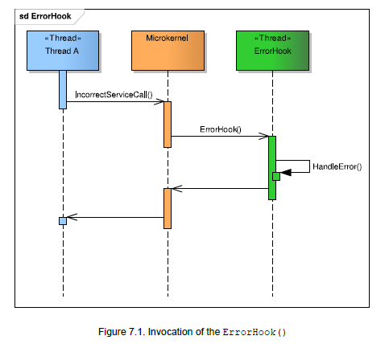

错误信息结构包含 **OSEK** 标准错误信息服务使用的信息，例如 *OSErrorGetServiceId*() 等以及有助于确定错误确切原因的附加信息。错误信息结构在错误信息中描述。

如果 *ErrorHook*() 导致另一个错误，则不会为第二个错误启动 *ErrorHook*()，也不会填充错误信息结构。在这种情况下，您仍然可以使用返回值来检测错误的服务调用。

如果 *ErrorHook*() 导致保护错误，则会像处理任何其他类型的线程一样处理它。

### 2.3.2. 保护故障

当线程尝试执行其配置不允许的操作时，会检测到保护错误。大多数类型的保护故障由硬件检测并通过异常陷阱报告给微内核。导致保护故障的操作示例如下：

* 线程尝试使用它没有所需权限的指令。
* 线程试图访问它没有权限的内存位置。
* 线程继续执行的时间超过其配置的执行预算所允许的时间。

当 **EB tresos Safety OS** 检测到保护故障时，微内核会将有关故障的信息填充到保护故障信息结构中。如果保护故障由硬件异常陷阱报告，如果有特定硬件的信息，则会被附加的放置在特定于硬件的异常信息结构**MK_exceptionInfo**中。然后，如果在配置中启用了 *ProtectionHook*()，微内核将调用它，并将 **AUTOSAR** 样式的错误代码作为参数传递。*ProtectionHook*() 完成后，它的返回值用于确定要采取的行动过程。保护钩子的返回值在 [第7.3.3节：ProtectionHook返回值](#233-protectionhook的返回值) 中描述。

*ProtectionHook*()的典型调用，如图7.2所示。

如果 *ProtectionHook*() 导致错误，则 *ErrorHook*() 会启动但不会运行，直到 *ProtectionHook*() 完成。但是检测到错误的 **API** 函数会返回错误代码并填充错误信息结构。

如果 *ProtectionHook*() 导致保护错误，微内核就会发生恐慌。请参阅[第7.3.4节:恐慌](#234-恐慌)。保护故障信息结构在保护故障信息中描述。如果存在硬件特定的异常信息结构，则在 **MK_exceptionInfo** 中进行描述。

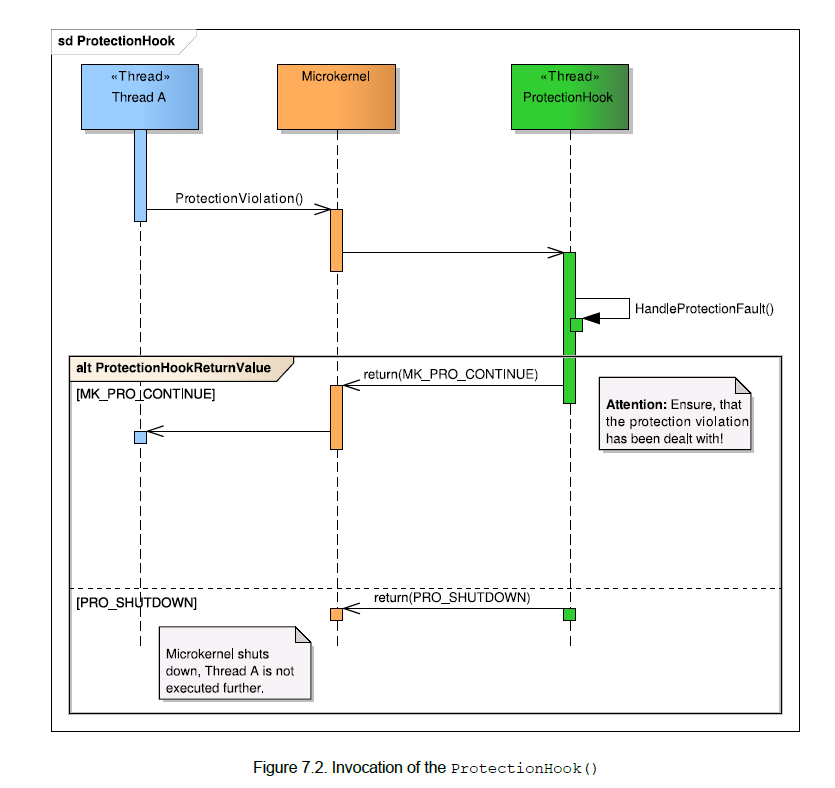

### 2.3.3. ProtectionHook的返回值

*ProtectionHook*() 返回的值称为保护动作（**protection action**），它决定了微内核在报告故障后采取的动作过程。

[EB tresos Safety OS 保护操作](#2331-eb-tresos-safety-os-保护操作) 列出了支持的保护操作。前缀为 **PRO_** 的保护动作由 **AUTOSAR** 标准定义，并且含义相同。带有前缀 **MK_PRO_** 的保护操作特定于 **EB tresos Safety OS**。如果 *ProtectionHook*() 返回一个未列出的值，微内核的行为就好像返回值是 **MK_PRO_INVALIDACTION**。

#### 2.3.3.1. EB tresos Safety OS 保护操作 

**MK_PRO_CONTINUE**
> 微内核不采取进一步行动。这意味着控制返回到故障线程。在大多数情况下，因为导致保护错误的指令会再次执行，所以会再次报告相同的错误。如果 *ProtectionHook*() 以相同方式处理此问题，结果将是无限循环。如果保护故障是线程超出执行预算引起的，则再次报告故障，控制权不返回故障线程。

**PRO_IGNORE**
> 此保护操作由 **AUTOSAR** 标准定义，仅对到达率违规（**arrival rate violations**）有效。因为微内核不提供到达率监控，所以微内核始终将 **PRO_IGNORE** 视为无效，并且表现得好像返回值为 **MK_PRO_INVALIDACTION**。

**PRO_TERMINATETASKISR**
> 如果一个故障的线程运行任务（**Task**）或 **ISR**，微内核将终止该线程。如果线程运行某种其他类型的可执行实体，微内核的行为就好像返回值是 **PRO_TERMINATEAPPL**。

**MK_PRO_TERMINATE**
> 无论在其中运行的可执行实体的类型如何，微内核都会终止故障线程。如果可执行实体是 **QM-OS** 服务或可信函数，状态码 **MK_E_KILLED** 返回给请求服务的线程。

**PRO_TERMINATEAPPL**
> 如果故障线程属于 Os 应用程序（**OS Application**），微内核将终止 Os 应用程序，就像它调用带有 **NO_RESTART** 选项的 *TerminateApplication*() 一样。有关详细信息，请参阅 *TerminateApplication*。如果故障线程不属于操作系统应用程序，微内核的行为就像返回值是 **PRO_SHUTDOWN** 一样。

**PRO_TERMINATEAPPL_RESTART**
> 如果故障线程属于 Os 应用程序（**OS Application**），微内核将终止 Os 应用程序，就像它调用带有 **RESTART** 选项的 *TerminateApplication*() 一样。有关详细信息，请参阅 TerminateApplication。如果故障线程不属于操作系统应用程序，微内核的行为就像返回值是 **PRO_SHUTDOWN** 一样。

**PRO_SHUTDOWN**
> 微内核关闭系统。它等效于使用传递给保护挂钩的相同错误代码调用 *ShutdownOS*()。

**MK_PRO_PANIC**
> 微内核的行为就好像它自己检测到一个严重的问题一样。使用 *MK_panic_PanicFromProtectionHook* 的恐慌原因。随后的行为在[第7.3.4节：恐慌](#234-恐慌)中进行了描述。

**MK_PRO_PANICSTOP**
> 微内核以恐慌原因 **MK_panic_PanicFromProtectionHook** 调用其内部函数 *MK_PanicStop*()。随后的行为，即禁用中断的无限循环，在[第7.3.4节：恐慌](#234-恐慌)中进行了描述。您应该仅在极端情况下使用此保护操作。例如，如果 *ProtectionHook*() 确定硬件的完整性受到严重损害，以至于没有其他安全的操作过程。

**MK_PRO_INVALIDACTION**
> **MK_PRO_INVALIDACTION** 由微内核定义，以便在 *ProtectionHook*() 返回超出范围的保护操作时实施定义的行为。您永远不应将 *ProtectionHook*() 函数设计为返回 **MK_PRO_INVALIDACTION**。如果 *ProtectionHook*() 返回 **MK_PRO_INVALIDACTION** 或任何其他未列出的值，微内核的行为就好像返回值是 **PRO_SHUTDOWN**。无效返回值不报错。

-----


**ProtectionHook**的错误返回值可能会违反可用性要求:

不正确的返回值可能会违反可用性要求。 在系统设计过程中，您必须仔细考虑保护挂钩的返回值。

-----

### 2.3.4. 恐慌

恐慌是一个术语，用于描述微内核在遇到严重问题时的行为。严重问题的例子有：

* 微内核检测到其内部状态不一致。
* 微内核检测到它引发了异常（**exception**）。
* *ProtectionHook*() 导致保护错误（**protection fault**）。
* *ProtectionHook*() 返回 MK_PRO_PANIC。

第一次遇到严重问题时，微内核会存储恐慌原因并启动一个关机序列，如[第2.6节：关机序列](#26-关机序列)中所述。在这种情况下传递给 *ShutdownHook*() 的错误代码是 **MK_E_PANIC**。您可以通过调用 **MK_GetPanicReason** 或 **MK_GetPanicReasonForCore** 在 *ShutdownHook*() 中检索恐慌原因。

第二次以及随后所有遇到严重问题的时间，微内核调用其内部函数 *MK_PanicStop*() 并将新恐慌的原因作为参数。*MK_PanicStop*() 是一个无限循环。当您检查 **CPU** 寄存器中的参数时，您可以在调试器中检查第二个崩溃原因。

----


多核环境中的恐慌：

因为微内核会为每个内核分别保存恐慌原因（**panic reason**），所以*MK_PanicStop*()只能在多核环境中被调用。如果在一个核心上报告了恐慌，而之前在该核心上报告了另一个恐慌。

----

从上面的描述可以看出，微内核只有在检测到故障时才调用 *MK_PanicStop*() 作为最后的手段，并且所有通过 *ProtectionHook*() 和 *ShutdownHook*() 通知应用程序的尝试都会导致检测到更多的故障。调用 *MK_PanicStop*() 的唯一其他方法是，如果您通过从 *ProtectionHook*() 返回 **MK_PRO_PANICSTOP** 来明确请求保护操作。有关更多信息，请参阅[第7.3.3节: ProtectionHook返回值](#233-protectionhook的返回值)。**EB tresos Safety OS** 的安全分析假设如在 *MK_PanicStop*() 中实现的死停（**dead stop**）是安全的。 或者，安全分析假设外部机制会重置系统或在系统停止响应时使其安全。

#### 2.3.4.1. 启动期间出现恐慌

如果微内核的配置存在问题或者处理器的安全完整性受到损害，则您只会在启动过程中遇到严重问题。

在启动过程中，因为线程调度程序不可用，所以微内核是无法正常关闭。启动期间检测到的严重问题的处理方式与正常运行期间的多个严重问题类似。唯一的区别是您可以将处理函数*MK_StartupPanicStop*() 配置为切换为无限循环之前，调用一个用户定义的函数（**user-defined function**）。但是，这个 **callout** 函数可以做什么有严格的限制。特别是，它不能直接或者间接调用任何 **EB tresos Safety OS** 服务。这排除了对 **AUTOSAR** 模块的调用。

#### 2.3.4.2. 内核执行期间的异常

如果在内核执行期间发生异常，这将导致恐慌并最终导致系统关闭。在大多数情况下，这是由配置错误引起的，例如：不正确的内核内存区域。不可屏蔽中断或 **ECC** 错误也可能导致内核异常。

有关异常的更多信息可用于 *ShutdownHook*()。如果恐慌原因（**panic reason**）是 **MK_panic_ExceptionFromKernel**，您可以通过 *MK_GetPanicExceptionInfo* 获取有关异常的信息。通过 *MK_GetExceptionInfo* 获得的值是未被定义。

## 2.4. 手动配置微内核

本节介绍如何手动配置微内核。如果您使用未经修改的 **EB tresos Safety OS** 生成器的输出，则可以忽略此部分。如果您在不使用 **EB tresos Safety OS** 生成器的情况下创建自己的配置文件，则需要阅读本节。如果您修改生成的配置文件，您只需参考[第4.4节: 微内核配置参考](#xxx)中的相应参考表。

一个微内核配置由三个头文件 **Mk_gen_user.h**、**Mk_gen_config.h** 和 **Mk_gen_addons.h** 以及源文件 **Mk_gen_global.c** 组成。

因为头文件 **Mk_gen_user.h** 和 **Mk_gen_config.h** 包含在汇编源文件和C源文件中，所以防止汇编器解析C结构很重要。为此，请在每组C结构周围放置*#ifndef MK_ASM ... #endif* 配对。

**例如：**

```C
#ifndef MK_ASM
extern mk_stackelement_t stack42[200];
#endif
```

您可以使用标准做法来防止多次包含。但在正常情况下，文件受到包含它们的头文件的保护。

### 2.4.1. Mk_gen_user.h

**Mk_gen_user.h** 文件包含应用程序代码所需的定义。需将表示任务（**Task**）、**ISR**、资源（**resource**）和附加标识符（**add-on identifiers**）和事件掩码（**event masks**）的宏定义放在此文件中。

为每种类型的对象分别分配对象标识符。标识符是从零开始的连续整数。它们用作 **Mk_gen_config.h** 中定义的对象表的索引。顺序并不重要。

确保您的事件掩码在每个使用该事件的任务中都是唯一的。最简单的方法是在每个事件的名称中包含任务的名称，以便独立定义每个任务的事件。如果事件被发送到一个不处理它的任务，它总是一个意外行为点，即使事件掩码是由任务处理的掩码。如果这不可能，您可能需要设计一种分配事件的方法。 一个事件是一个 32 位无符号值，只有一位设置为 1，因此每个任务最多可以对 32 个事件做出反应。

您还应该将任务的函数原型和 ISR 函数放在该文件中。 如果您使用与 EB tresos Safety OS 生成器相同的命名方案，您应该将任务命名为 *OS_TASK_\<taskname\>*，并将任务命名为 *OS_ISR_\<isr-name\>*。 这些名称分别与 **AUTOSAR** *TASK*() 和 *ISR* 构造宏兼容。

不要对两个对象使用相同的名称，即使这些对象属于不同类型。

**Example:**

```C

/* Tasks */
#define My2msTask 0
#define MyEventHandler 1
#define My10msTask 2

#ifndef MK_ASM
void OS_TASK_My2msTask(void);
void OS_TASK_EventHandler(void);
void OS_TASK_My10msTask(void);
#endif

/* ISRs */
#define MyCanIsr 0
#define MyGptIsr 1

#ifndef MK_ASM
void OS_ISR_MyCanIsr(void);
void OS_ISR_MyGptIsr(void);
#endif

/* Events */
#define Ev_CanRx 0x00000001u
#define Ev_GptTick 0x00000002u
#define Ev_RunMode 0x00000004u
#define Ev_StandbyMode 0x00000008u

/* Add-ons */
#define MK_ADDON_ID_IOC 0u
```

Locks are a little different. On microcontrollers with more than one core, configured OsResource objects are bound to a specific core and have their core index encoded as part of the ID. This encoding is performed by the macro MK_MakeLockId(coreIndex, resourceIndex). Locks such as interrupt locks, spinlocks,
the scheduler resource RES_SCHEDULER if present and EB-vendor-specific combined locks, must occupy the lowest IDs and are defined without the core index.

**Example:**

```C

/* Resources */
#define MK_RESCAT1 0
#define MK_RESCAT2 1
#define RES_SCHEDULER 2
#define MySpinlock 3
#define MyCombi 4

#define MyCanBufferCore0Mutex   MK_MakeResourceId(0, 5)
#define MyGptCore1Mutex         MK_MakeResourceId(1, 5)
```

Mk_gen_user.h is included by MicroOs.h.

### 2.4.2. Mk_gen_config.h

Mk_gen_config.h is included by Mk_Cfg.h.

The Mk_gen_config.h file contains the definitions that are needed by the microkernel. Place the definitions of macros to construct the task, ISR, and resource tables in this file. For a precise description of each type of object and how to configure the object tables for the microkernel, see the reference Section 4.4, “Microkernel configuration reference”.

#### 2.4.2.1. Allocating priorities
#### 2.4.2.2. Core allocation
#### 2.4.2.3. Allocating tasks to threads
#### 2.4.2.4. Allocating ISRs to threads
#### 2.4.2.5. Allocating stacks to threads
#### 2.4.2.6. Allocating register stores for task and ISR threads
#### 2.4.2.7. Determining the running priority
#### 2.4.2.8. Determining the ceiling priority of a resource
#### 2.4.2.9. 配置内存保护

要配置内存保护，请为每个可执行对象分配一个内存分区。 当可执行对象获得 CPU 时，微内核启用其内存分区。 当可执行对象放弃 CPU 时，微内核将禁用其内存分区。

##### 2.4.2.9.1. 内存区域、内存分区和内存区域映射表

内存区域（**memory region**）是由其起始地址和结束地址以及授予的权限定义的连续物理内存块。

内存分区（**memory partition**）是一组内存区域。

区域映射表（**region mapping table**）将内存区域映射到内存分区。

内存分区（**memory partition**）的配置定义了区域映射表（**region mapping table**）的一部分的开始地址和长度。区域映射表（**region mapping table**）中的每个条目是对内存区域表（**memory region table**）中的内存区域（**memory region**）的引用。内存分区（**memory partitions**）和内存区域（**memory regions**）之间的这种关系如图7.3“内存分区和区域”所示。

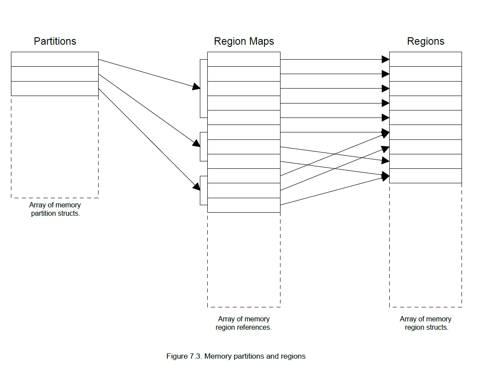

当您使用这种机制时，您可以将一个内存区域分配给多个内存分区。

**内存分区必须确保必要的免于干扰**

内存分区必须与整个软件架构的无干扰论证相对应。

**全局内存分区**

内存分区表的第一个条目是全局内存分区（**global memory partition**）。此分区在启动时启用并无限期保持启用状态。不要将全局分区显式分配给任何可执行对象。

全局分区（**global partition**）应指定允许访问代码和常量的区域以及所有可执行对象使用的只读访问区域。您可以添加更多内存区域以供所有可执行对象访问，但您必须确保系统的安全性不受影响。

全局分区中的区域数加上最大的非全局分区中的区域数不得大于内存保护硬件可以同时管理的区域数。

微内核不会动态为任何线程调整区域。如果您配置的分区太大，微内核会在尝试启动线程时关闭。

**注意：全局分区的不同处理**

某些架构的一些衍生产品（例如：基于 **ARMv8-R** 的 **CPU**）可能会以不同的方式处理全局分区。有关更多详细信息，请参阅特定于体系结构的补充第9章“**Cortex-M**处理器的补充信息”。

**内存区域（续）**

您可以将初始化规则与内存区域相关联。初始化由两个地址定义：一个是初始值的 **ROM** 副本的地址和一个标记隐式初始化变量开始的区域内的地址，即 .bss 起始地址。当微内核启动时，数据从 **ROM** 复制到 .bss 起始地址的区域。从 .bss 起始地址到区域末尾的内存被初始化为零。

以下初始化配置是可能的：

* 仅从 ROM 初始化的变量
> 将 ROM 副本的地址设置为初始化值所在的位置，并将 .bss 起始地址设置为零。

* 只有用零初始化的变量
> 将 ROM 副本的地址设置为零，将 .bss 起始地址设置为内存区域的起始地址。

* 一些变量从ROM初始化，其余的为零
> 将 ROM 副本的地址设置为初始化值所在的位置，将 .bss 起始地址设置为内存区域中隐式初始化变量开始的位置。

* 一些变量未初始化，其余变量初始化为零
> 将 ROM 副本的地址设置为零，将 .bss 起始地址设置为内存区域内隐式初始化变量开始的位置。

* 所有变量都未初始化
> 将 ROM 副本的地址和 .bss 起始地址都设置为零。

您应该使用符号配置内存区域并在链接描述文件中定义符号。如果您使用第4.4.10 节“内存区域的配置”中描述的构造宏，微内核会根据您分配给区域的名称使用符号命名方案：

* MK_RSA_<name>：名称为<name>的内存区域的起始地址。
* MK_RLA_<name>：内存区域的结束地址。区域的结束地址是该区域上方不属于该区域的第一个存储单元的地址。这与几乎所有链接器的行为兼容。
* MK_BSA_<name>：.bss 内存区域的起始地址。
* MK_RDA_<name>：内存区域的 ROM 副本的起始地址。
  
如果您使用宏 **MK_MR_STACK()** 或 **MK_MR_NOINIT()** 来配置该内存区域，则不必在链接描述文件中为特定内存区域添加 MK_BSA_<name> 和 MK_RDA_<name>。

如果您的变量的初始值超出了微内核的控制范围，您可以在不初始化的情况下定义所有内存区域。

**值得注意的**

内存区域不必是不相交的。重叠区域、区域内区域和重复区域都是可能的。您可以使用此功能来减少分区中的区域数量，从而减少切换分区的运行时开销。当两个可执行对象需要具有不同的权限时，您可能还需要使用它。您必须注意重叠区域的初始化。最好的方法是确保每个存储单元的初始值最多由一个区域定义。

您可以将相同的内存分区分配给多个可执行对象。通常只有在两个可执行对象需要访问完全相同的内存（包括堆栈）时才这样做。为了减少内存保护的开销，您可以创建更大的分区，其中包含相关可执行对象的所有堆栈。但是您必须注意，微内核可能无法检测到这些可执行对象的所有越界错误。

在许多微控制器上，您需要为硬件外围设备定义内存区域。您不应该初始化这些内存区域。

##### 2.4.2.9.2. 多核系统

在多核系统中，每个核都有自己的内存分区，即内存分区不能在不同的核之间共享。在内存分区结构体数组中，即 **MK_CFG_MEMORYPARTITIONCONFIG**，这些内存分区必须根据关联的内核进行排序。内核特定的内存分区配置常量 **MK_CFG_Cx_FIRST_MEMORYPARTITION** 和 **MK_CFG_Cx_NMEMORYPARTITIONS** 标识 **MK_CFG_MEMORYPARTITIONCONFIG** 中的内核特定的内存分区。建议从第一个内核的所有内存分区开始，然后是第二个内核的所有内存分区，依此类推，以用于所有其他内核。其他内核序列也是允许的，但不推荐。

请注意，每个内核的内核特定内存分区的第一个条目必须是该内核的全局内存分区。

与内存分区相比，内存区域映射和内存区域可以在不同的内核之间共享。如果必须初始化，内存区域配置包含哪个内核初始化内存区域的信息。有关更多信息，另请参阅第 8.4.10 节，“内存区域的配置”。

#### 2.4.2.10. 使用 EB tresos Studio 时的内存区域

表7.2 “生成的微内核内存区域”列出了使用 **EB tresos Studio** 配置微内核时生成的特定于微内核的内存区域。表中未列出特定于应用程序的内存区域。

**注意：特定于架构的微内核内存区域和内存区域内容**

有关特定于体系结构的微内核内存区域和内存区域内容，另请参见第 9.5 节，“Cortex-M 处理器上的内存区域”。

您可以手动更改微内核的内存区域配置。 有关如何执行此操作的更多信息，请参阅第 8.4 节，“微内核配置参考”。

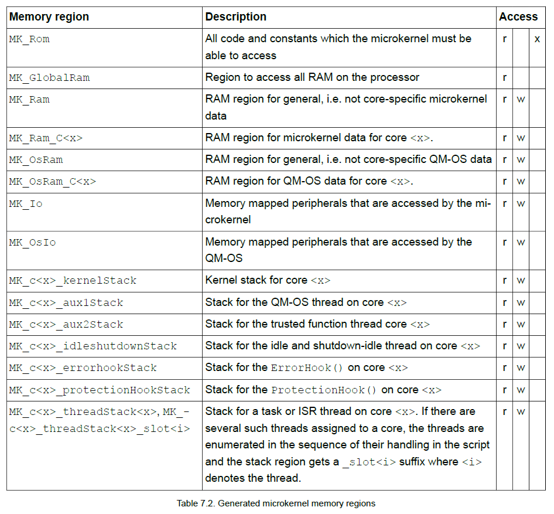

| Memory region                                                    | Description                                                                                                                                                                          | 读  | 写  | 执行 |
| ---------------------------------------------------------------- | ------------------------------------------------------------------------------------------------------------------------------------------------------------------------------------ | --- | --- | ---- |
| MK_Rom                                                           | 微内核必须能够访问的所有代码和常量                                                                                                                                                   | r   |     | x    |
| MK_GlobalRam                                                     | 访问处理器上所有 RAM 的区域                                                                                                                                                          | r   |     |      |
| MK_Ram                                                           | 一般的 RAM 区域，即不是特定于内核的微内核数据                                                                                                                                        | r   | w   |      |
| MK_Ram_C\<x\>                                                    | 内核 \<x\> 的微内核数据的 RAM 区域。                                                                                                                                                 | r   | w   |      |
| MK_OsRam                                                         | 一般的 RAM 区域，即：不是特定于内核的 QM-OS 数据                                                                                                                                     | r   | w   |      |
| MK_OsRam_C\<x\>                                                  | 内核 \<x\> 的 QM-OS 数据的 RAM 区域                                                                                                                                                  | r   | w   |
| MK_Io                                                            | 微内核访问的内存映射外设                                                                                                                                                             | r   | w   |      |
| MK_OsIo                                                          | QM-OS 访问的内存映射外设                                                                                                                                                             | r   | w   |      |
| MK_c\<x\>_kernelStack                                            | 内核 \<x\> 的内核堆栈                                                                                                                                                                | r   | w   |      |
| MK_c\<x\>_aux1Stack                                              | 内核上 QM-OS 线程的堆栈 \<x\>                                                                                                                                                        | r   | w   |      |
| MK_c\<x\>_aux2Stack                                              | 受信任函数线程核心的堆栈 \<x\>                                                                                                                                                       | r   | w   |      |
| MK_c\<x\>_idleshutdownStack                                      | 内核上空闲和关闭空闲线程的堆栈 \<x\>                                                                                                                                                 | r   | w   |      |
| MK_c\<x\>_errorhookStack                                         | 内核上的 ErrorHook() 堆栈 \<x\>                                                                                                                                                      | r   | w   |      |
| MK_c\<x\>_protectionHookStack                                    | 核心上的 ProtectionHook() 堆栈 \<x\>                                                                                                                                                 | r   | w   |      |
| MK_c\<x\>_threadStack\<x\>, MK_c\<x\>_threadStack\<x\>_slot\<i\> | 内核 \<x\> 上的任务或 ISR 线程的堆栈。 如果有多个这样的线程分配给一个核心，则线程会按照它们在脚本中的处理顺序进行枚举，并且堆栈区域会获得一个 _slot\<i\> 后缀，其中 \<i\> 表示线程。 | r   | w   |      |

访问列指示这些区域的访问权限。**r**代表读访问，**w**代表写访问，**x**代表执行访问。

**MK_Rom** 和 **MK_GlobalRam** 是全局区域，是全局内存分区的一部分。

## 2.5. 启动微内核

## 2.6. 关机序列

# 3. 微内核参考手册

## 3.1. 微内核的限制

## 3.2. 微内核API参考

## 3.3. 微内核调用引用

## 3.4. 微内核配置参考

## 3.5. 主板特定配置（）

# 4. Cortex-M 处理器的补充信息

## 4.1. Cortex-M 处理器的启动条件

**NXP S32G27X 的启动条件**

**NXP S32G27X** 硬件具有三个 **Cortex-M7** 内核，每个内核都有一个始终处于活动状态的检查器内核。**EB tresos Safety OS** 假定内核在其整个执行过程中以锁步模式（**lockstep mode**）运行。

**NXP S32G399 的启动条件**

**NXP S32G399** 硬件具有四个 **Cortex-M7** 内核，每个内核都有一个始终处于活动状态的检查器内核。**EB tresos Safety OS** 假定内核在其整个执行过程中以锁步模式（**lockstep mode**）运行。

## 4.2. Cortex-M 处理器上的其他启动配置

### 4.2.1. S32G27X 上的启动配置

#### 4.2.1.1. 寄存器保护配置要求

**S32G27X** 包括其大部分外围硬件组件的所谓寄存器保护。如果启用，寄存器保护（**register protection**）会阻止在处理器的用户模式下使用相应的组件。这将破坏 **EB tresos Safety OS** 的 **QM-OS** 组件。所以对于由 **EB tresos Safety OS** 的 **QM-OS** 部分直接访问的所有硬件组件，需要禁用寄存器保护，如表9.1，**Hardware components used by QM-OS on S32G27X for which register protection needs to be disabled**。

| Component | Device register base address |
| --------- | ---------------------------- |
| STM0      | 0x4011c000                   |
| STM1      | 0x40120000                   |
| STM2      | 0x40124000                   |
| STM3      | 0x40128000                   |
| STM4      | 0x4021c000                   |
| STM5      | 0x40220000                   |
| STM6      | 0x40224000                   |
| STM7      | 0x40228000                   |

Table 9.1. Hardware components used by QM-OS on S32G27X for which register protection needs to be disabled

#### 4.2.1.2. 扩展资源域控制器 (XRDC) 的配置要求

**S32G27X** 使用 **NXP** 的 **Semaphores2 (SEMA42)** 单元来实现自旋锁以在多个 **Cortex-M7** 内核之间进行同步。为此 **EB tresos Safety OS** 依赖于 **S32G27X** 的扩展资源域控制器 (**XRDC**) 的适当配置。**SEMA42** 单元使用由 **XRDC** 的主域分配控制器 (**MDAC**) 的配置确定的域 ID (**DID**) 来识别处理内核。表 9.2，XRDC 中 DID 设置的要求显示了 Cortex-M7 内核所需的 DID 配置。 这里使用 DID 0、1 和 2 来指定三个 Cortex-M7 内核。它们应专门用于指代 Cortex-M7 内核，因此不得用于任何其他总线主控器。

| MDAC descriptor | Busmaster description     | Domain ID (DID) |
| --------------- | ------------------------- | --------------- |
| XRDC_MDAC8      | Cortex-M7_0 AXI interface | 0               |
| XRDC_MDAC16     | Cortex-M7_0 AHB interface | 0               |
| XRDC_MDAC9      | Cortex-M7_1 AXI interface | 1               |
| XRDC_MDAC17     | Cortex-M7_1 AHB interface | 1               |
| XRDC_MDAC10     | Cortex-M7_2 AXI interface | 2               |
| XRDC_MDAC18     | Cortex-M7 2 AHB interface | 2               |

### 4.2.2. S32G399上的启动配置

**S32G399** 包括其大部分外围硬件组件的所谓寄存器保护。 如果启用，寄存器保护会阻止在处理器的用户模式下使用相应的组件。 这将破坏 EB tresos Safety OS 的 QM-OS 组件。 因此，需要为 EB tresos Safety OS 的 QM-OS 部分直接访问的所有硬件组件禁用寄存器保护，如表 9.3“S32G399 上 QM-OS 使用的硬件组件。 需要为这些禁用寄存器保护”。

| Component | Device register base address |
| --------- | ---------------------------- |
| STM0      | 0x4011c000                   |
| STM1      | 0x40120000                   |
| STM2      | 0x40124000                   |
| STM3      | 0x40128000                   |
| STM4      | 0x4021c000                   |
| STM5      | 0x40220000                   |
| STM6      | 0x40224000                   |
| STM7      | 0x40228000                   |
| STM8      | 0x40520000                   |
| STM9      | 0x40524000                   |
| STM10     | 0x40528000                   |
| STM11     | 0x4052c000                   |
| STM12     | 0x4400c000                   |

Table 9.3. Hardware components used by QM-OS on S32G399. Register protection needs to be disabled for these.

### 4.2.3. 扩展资源域控制器 (XRDC) 的配置要求

S32G399 使用 NXP 的 Semaphores2 (SEMA42) 单元来实现自旋锁以在多个 Cortex-M7 内核之间进行同步。 为此，EB tresos 安全操作系统依赖于 S32G399 的扩展资源域控制器 (XRDC) 的适当配置。 SEMA42 单元使用由 XRDC 的主域分配控制器 (MDAC) 的配置确定的域 ID (DID) 来识别内核处理内核。 表 9.4，“XRDC 中 DID 设置的要求”显示了 Cortex-M7 内核所需的 DID 配置。 DID 0、1、2 和 3 在这里用于指定四个 Cortex-M7 内核。 它们应专门用于指代 Cortex-M7 内核，因此不得用于任何其他总线主控器。


| MDAC descriptor | Busmaster description     | Domain ID (DID) |
| --------------- | ------------------------- | --------------- |
| XRDC_MDAC8      | Cortex-M7_0 AXI interface | 0               |
| XRDC_MDAC16     | Cortex-M7_0 AHB interface | 0               |
| XRDC_MDAC9      | Cortex-M7_1 AXI interface | 1               |
| XRDC_MDAC17     | Cortex-M7_1 AHB interface | 1               |
| XRDC_MDAC10     | Cortex-M7_2 AXI interface | 2               |
| XRDC_MDAC18     | Cortex-M7 2 AHB interface | 2               |
| XRDC_MDAC22     | Cortex-M7_3 AXI interface | 3               |
| XRDC_MDAC23     | Cortex-M7 3 AHB interface | 3               |

Table 9.4. Requirements for the DID setup in XRDC

## 4.3. Cortex-M 处理器上的处理器状态映射

Cortex-M 处理器的处理器状态在配置结构中由以下数据类型表示：

```C
typedef struct mk_hwps_s mk_hwps_t;

struct mk_hwps_s
{
    mk_uint32_t control;
    mk_uint16_t level;
    mk_uint8_t fpuEnabled;
};
```

**control** 结构体成员指定 **CONTROL** 寄存器的初始值。它的 **nPRIV** 字段确定处理器的线程模式是特权还是非特权。**level** 结构体成员指定各个线程的中断锁定级别，它最终被写入 BASEPRI 寄存器。 最后 **fpuEnabled** 成员指定 FPU 寄存器是否由微内核为各个线程保存。 只要线程不使用向量浮点单元，不保存 FPU 寄存器可能会提高性能。 微内核使用宏 MK_HWPS_INIT(pm, ilvl, ie, fpu, hwps) 创建这个结构的实例。 参数影响结构成员如下：

pm - processor mode
> This value is written to the control member and thus selects the processor mode of a thread.

ilvl - interrupt level
> This value is written to the level member. It selects the interrupt level that a thread executes with.

ie - interrupt enable
> This value is not used on Cortex-M. Enabling and disabling of interrupts is performed by specifying the interrupt level via ilvl.

fpu - use floating point unit
> This value is directly passed to the fpuEnabled member.

hws - hardware-specific extensions
> This parameter is not used. You should always use MK_THRHWS_DEFAULT.

These parameters are part of e.g. task and ISR configurations, see Section 8.4.4, “Configuration of tasks” and Section 8.4.6, “Configuration of ISRs”. Additional configuration criteria for these parameters are also given in the EB tresos Safety OS safety manual for CORTEXM family [SAFETYMANCORTEXM].

## 4.4. Cortex-M 处理器上的内存保护

**EB tresos Safety OS** 支持使用 **ARMv7-M MPU** 设计的基于 **Cortex-M** 的处理器。它包含从 **0** 开始编号的 **8** 或 **16** 个内存区域。在此方案中，**区域0** 的优先级最低，而**区域7** 或 **区域15** 的优先级最高。通过使用内存区域，可以将访问权限和内存类型属性附加到处理器物理地址空间的可配置区域。如果一个地址属于多个区域，则其权限和属性由索引最高的区域决定。

在 **ARMv7-M MPU** 中，内存区域由其起始地址、配置大小和内存类型属性来描述。硬件对配置有各种限制，在[DDI0403E_e]中有详细描述。

两个最重要的限制：

区域大小（**Region size**）：
> 内存区域的大小必须是**2**的幂。存在特定于导数的最小区域大小。最大大小为 **4GiB**。大小至少为 **256** 字节的区域可以进一步细分为 8 个大小相等的子区域。

区域起始地址对齐（**Region start address alignment**）：
> 区域的起始地址必须始终根据为该区域配置的大小对齐。这也适用于配置单个子区域的情况。即使在这种情况下，区域的起始地址也必须根据大小参数的配置进行对齐。

### 4.4.1. Cortex-M 处理器上的内存区域大小配置

微内核将 **hwextra** 参数以未修改的形式复制到 **MPU_RASR** 寄存器的低**16**位。**MPU_RASR** 的低16位包含存储为2的幂的内存区域的大小、子区域禁用标志和区域启用位。微内核为启用位提供宏 **MK_CORTEXM_MPU_SIZE_ENABLED**。您可以使用以下宏指定区域大小：

* MK_CORTEXM_MPU_SIZE_32
> 32字节

* MK_CORTEXM_MPU_SIZE_64
> 64字节

* MK_CORTEXM_MPU_SIZE_128
> 128字节

* MK_CORTEXM_MPU_SIZE_256
> 256字节

* MK_CORTEXM_MPU_SIZE_512
> 512字节

* MK_CORTEXM_MPU_SIZE_1K
> 1K字节

* MK_CORTEXM_MPU_SIZE_2K
> 2K字节

* MK_CORTEXM_MPU_SIZE_4K
> 4K字节

* MK_CORTEXM_MPU_SIZE_8K
> 8K字节

* MK_CORTEXM_MPU_SIZE_16K
> 16K字节

* MK_CORTEXM_MPU_SIZE_32K
> 32K字节

* MK_CORTEXM_MPU_SIZE_64K
> 64K字节

* MK_CORTEXM_MPU_SIZE_128K
> 128K字节

* MK_CORTEXM_MPU_SIZE_256K
> 256K字节

* MK_CORTEXM_MPU_SIZE_512K
> 512K字节

* MK_CORTEXM_MPU_SIZE_1M
> 1M字节

* MK_CORTEXM_MPU_SIZE_2M
> 2M字节

* MK_CORTEXM_MPU_SIZE_4M
> 4M字节

* MK_CORTEXM_MPU_SIZE_8M
> 8M字节

* MK_CORTEXM_MPU_SIZE_16M
> 16M字节

* MK_CORTEXM_MPU_SIZE_32M
> 32M字节

* MK_CORTEXM_MPU_SIZE_64M
> 64M字节

* MK_CORTEXM_MPU_SIZE_128M
> 128M字节

* MK_CORTEXM_MPU_SIZE_256M
> 256M字节

* MK_CORTEXM_MPU_SIZE_512M
> 512M字节

* MK_CORTEXM_MPU_SIZE_1G
> 1G字节

* MK_CORTEXM_MPU_SIZE_2G
> 2G字节

* MK_CORTEXM_MPU_SIZE_4G
> 4G字节

**注意：最小区域大小**

最小区域大小是特定于硬件的。有关支持的尺寸，请参阅硬件文档。

除了尺寸规格外，微内核还提供宏 MK_CORTEXM_SUBREGION_DISABLE(region) 来指定各个子区域禁用标志。 参数 region 指定所讨论的子区域编号，并且必须介于 0 和 7 之间。可以使用按位或运算组合多个此类子区域。 默认情况下，启用区域的所有子区域。 通过指定禁用位，可以禁用一组子区域，然后不再是定义的内存区域的一部分。

#### 4.4.1.1. 特定于硬件的接口

在 EB tresos Safety OS 配置中，包括子区域禁用规范在内的大小规范是通过将它们各自的值分配给内存区域配置的 hwextra 成员来配置的。此外，MK_CORTEXM_MPU_SIZE_ENABLE 必须使用按位或运算添加到 hwextra 以启用 MPU 中的内存区域。

#### 4.4.1.2. Cortex-M 处理器上的内存权限

权限参数（参见第 8.4.10 节，“内存区域的配置”[181]）定义了内存区域的访问权限以及内存类型参数。指定的权限以及内存属性（例如可缓存/不可缓存）以未修改的形式复制到 **ARMv7-M MPU** 的 **MPU_RASR** 的高16位。所有组件都使用按位或运算组合。

访问控制设置存在以下宏：

* MK_MPERM_NO_ACCESS
> 在特权和非特权模式下都不能访问。

* MK_MPERM_S_RW
> 特权模式有读写权限，非特权模式没有权限。

* MK_MPERM_S_RW_U_R
> 特权模式有读写权限，非特权模式有读权限。

* MK_MPERM_S_RW_U_RW
> 特权模式和非特权模式都有读写权限。

* MK_MPERM_S_R
> 特权模式有读取权限，非特权模式没有权限。

* MK_MPERM_S_R_U_R
> 特权模式和非特权模式具有读取权限。

微内核为 execute-never 标志提供宏 MK_MPERM_XN。如果指定，则无法从该内存区域执行代码。

### 4.4.2. Memory types and caching on Cortex-M processors

The microkernel defines the following macros to specify memory-type attributes for a memory region:

* MK_ATTR_SHARED_DEVICE
> Marks the memory region as shared device, strongly-ordered, and non-bufferable. This means that any access is always done on the underlying peripheral. It is recommended to use this memory type for IOregions.

* MK_ATTR_NONSHARED_WRITEBACK
> Marks the memory region as non-shared and cache-able for the first (inner) and second (outer) level with a write-back/write-allocate strategy. You can use this memory type for RAM or ROM regions.

* MK_ATTR_NONSHARED_WRITETHROUGH
> Marks the memory region as non-shared and cache-able for the first (inner) and second (outer) level with a write-through strategy. You can use this memory type for RAM or ROM regions. In contrast to writeback, the CPU always forwards writes to the underlying hardware component (e.g. SRAM) at the time of the writes. 1

* MK_ATTR_NONSHARED_NONCACHED
> Marks the memory region as non-shared and non-cache-able for the first (inner) and second (outer) level. You can use this memory type for RAM or ROM egions.

* MK_ATTR_SHARED_WRITEBACK
> Marks the memory region as shared and cache-able for the first (inner) and second (outer) level with a write-back/write-allocate strategy. You can use this memory type for RAM or ROM regions.

* MK_ATTR_SHARED_WRITETHROUGH
> Marks the memory region as shared and cache-able for the first (inner) and second (outer) level with a writethrough strategy. You can use this memory type for RAM or ROM regions. In contrast to write-back, the CPU always forwards writes to the underlying hardware component (e.g. SRAM) at the time of the writes.

* MK_ATTR_SHARED_NONCACHED
> Marks the memory region as shared and non-cache-able for the first (inner) and second (outer) level. You can use this memory type for RAM or ROM regions.

When you enable caching on Cortex-M, you have to take special care. Read and understand Chapter B 3.5 of the ARMv7-M Architecture Reference Manual [DDI0403E_e]. It describes the properties and guarantees given by the hardware architecture with regards to memory accesses in the presence of caches. It also contains a description of what happens when the same part of memory is accessed using different memory types.

**WARNING: Interpretation of cachability and sharing settings by the hardware**

The actual caching performed by the processor for a given memory region depends not only on the cachability and shareability settings outlined above, but also on the concrete implementation of the respective processing core. For example, a region marked as cacheable and shareable may not be cached at all if the processor does not implement a proper cache coherency protocol. So to guarantee consistency, a processor implementation may choose to implement all shared memory regions as uncacheable, regardless of which cachability setting is configured. Consult the respective core manual to determine how your processor interprets the configured memory types.

If you want to enable caching on a memory region, it is recommended to configure it as non-shared. To avoid cache coherency issues, access the memory region only from the same core. If such a memory region is accessed by multiple cores, coherency has to be managed manually, depending on the type of cacheability,
as described in ARMv7-M Architecture Reference Manual [DDI0403E_e]. 

However, as cache maintenance can be performed only from supervisor mode, it should best be avoided for safety as well as performance reasons. One possible way would be to use separate memory regions for data only accessed privately on the same core and data to be shared between multiple cores. This way, private data can be made cacheable and shared data can be accessed uncached. This strategy effectively avoids cache coherency issues but still enables the usage of caching for data with suitable access patterns.

#### 4.4.2.1. Memory-types on Cortex-M7

For derivatives that use the Cortex-M7 processor, this section details some peculiarities that arise with its implementation of the cache subsystem. It does not implement cache coherency between different processors. Therefore, if a memory region is marked as shared, by default it is always uncached, regardless of the actual cachability setting.

This behavior can be changed by setting the bit SIWT in the Cortex-M7-specific register CM7_CACR to 1. The SIWT bit only influences the configuration of memory regions that are both configured as shared and cacheable. It enables write-through cacheability. Using such a memory region requires manual management of coherency. 

If configured as outlined in the following sections, the microkernel memory regions are not affected by this setting. However, it is still recommended to set SIWT to 0, as this enables consistent, albeit uncached access to memory regions configured as both cacheable and shared.

#### 4.4.2.2. 4.4.2.2。 单核配置中的内存类型配置

当您的 EB tresos Safety OS 配置仅包含一个内核时，设置缓存将大大简化。为了获得最佳速度，为映射普通内存的所有内存部分配置 **MK_ATTR_NONSHARED_WRITEBACK** 内存类型。对于映射设备寄存器的部分，选择 **MK_ATTR_SHARED_DEVICE** 内存类型。这也适用于 EB tresos Safety OS 的内部存储器部分，其存储器类型可通过 EB tresos Studio 配置。遵循此准则可确保对可缓存内存的所有访问都使用相同的内存类型执行，从而避免内存一致性问题。

#### 4.4.2.3. 4.4.2.3。 多核配置中的内存类型配置

当您的 **EB tresos Safety OS** 配置包含多个内核时，您必须处理 **Cortex-M** 平台上缺少的缓存一致性。**EB tresos Safety OS** 已准备好处理此类配置中缺少的缓存一致性。为了使其正常工作，您需要提供其内部内存区域使用的内存类型的特定配置。

您需要根据表 4.5 “启用缓存的多核衍生产品上的微内核内存区域的内存类型设置”来设置微内核的内部内存区域。

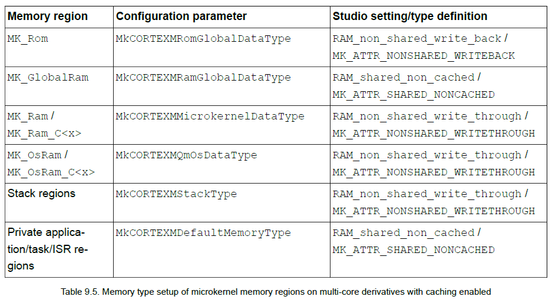

| Memory region                            | Configuration parameter      | Studio setting/type definition                                |
| ---------------------------------------- | ---------------------------- | ------------------------------------------------------------- |
| MK_Rom                                   | MkCORTEXMRomGlobalDataType   | RAM_non_shared_write_back / MK_ATTR_NONSHARED_WRITEBACK       |
| MK_GlobalRam                             | MkCORTEXMRamGlobalDataType   | RAM_shared_non_cached / MK_ATTR_SHARED_NONCACHED              |
| MK_Ram / MK_Ram_C\<x\>                   | MkCORTEXMMicrokernelDataType | RAM_non_shared_write_through / MK_ATTR_NONSHARED_WRITETHROUGH |
| MK_OsRam / MK_OsRam_C\<x\>               | MkCORTEXMQmOsDataType        | RAM_non_shared_write_through / MK_ATTR_NONSHARED_WRITETHROUGH |
| Stack regions                            | MkCORTEXMStackType           | RAM_non_shared_write_through / MK_ATTR_NONSHARED_WRITETHROUGH |
| Private application / task / ISR regions | MkCORTEXMDefaultMemoryType   | RAM_shared_non_cached / MK_ATTR_SHARED_NONCACHED              |

使用此设置，通过以下三种方式被访问的内存根本不会被缓存。这使得通过这些内存区域的访问能够抵御来自不同内核的访问。

1. **MK_GlobalRam** 内存区域。
2. 任务（**Task**）/应用程序。
3. ISR 的私有内存区域。

对于需缓存的数据，需创建具有所需内存类型配置的专用内存区域。将对该内存区域的引用添加到读取或写入它的所有OS对象（**OS objects**）。确保对该内存区域的所有访问都来自同一个内核。此设置可确保始终使用来自同一内核的相同内存属性访问缓存的内存区域。

您可以使用配置参数 MkCORTEXMDataCacheEnable 全局禁用数据缓存。 如果将此设置为 false，则微内核将禁用数据缓存。

#### 4.4.2.4. 4.4.2.4。在启用缓存的多核配置中使用 EB tresos IOC 时的内存设置注意事项

EB tresos IOC 在可能位于不同内核上的内存区域之间传输数据。这使得它在没有缓存一致性的硬件上使用时容易出现问题。**EB tresos Safety OS** 支持的所有多核 **Cortex-M** 处理器都属于这一类。因此要使 IOC 按预期工作，为每个 IOC 通道创建的缓冲区需要映射到非缓存**RAM**。您可以通过将相应内存区域的内存类型配置为 RAM_non_shared_non_cached 或 RAM_shared_non_cached 来实现此目的。

如果您将 IOC 通道之一配置为使用捕获 API，则需要将 MkCORTEXMMicrokernelDataType 配置为 RAM_shared_non_cached。这有效地禁用了微内核内存区域 (MK_Ram/MK_Ram_C\<x\>) 的缓存。

## 4.5. 4.5。 Cortex-M 处理器上的内存区域

**ARMv7-M** 架构规范为所有 **Cortex-M** 设备（即嵌套向量中断控制器 (NVIC)、SysTick、MPU）全局定义的所有设备都位于一个特殊的地址范围内，即系统控制空间 (SCS)，它是专用外围总线 (PPB)。对 PPB 的访问不通过 MPU 路由，但它们具有自己的隐式附加访问权限和 ARMv7-M 定义的内存类型属性。默认情况下，如果非特权软件尝试访问 PPB，硬件会引发 BusFault 异常。这仅适用于一些可配置的例外。因此，EB tresos 安全操作系统不需要显式内存区域来获取和保护对这些设备寄存器的访问。

### 4.5.1. 4.5.1。导数特定的内存区域内容

MK_Io\<x\>。这些内存区域应授予对微内核使用的所有其他外围设备的访问权限。所需的设备因特定的衍生产品而异。因此所需的 MK_Io 区域的数量取决于衍生的使用方法。

# 5. API规范

## 5.1. MPU

### 5.1.1. MK_EnableMpu

**说明**: 启用 **MPU**。激活 **MPU** 通常会改变观察到的内存属性。为了不遇到数据一致性问题，数据缓存（如果存在）在调用此函数时必须已禁用。

```C
void MK_EnableMpu(void)
```

### 5.1.2. MK_DisableMpu

**说明**: 禁用 MPU。前提条件：缓存被禁用。

```C
void MK_DisableMpu(void)
```

### 5.1.3. OS_CheckMpuSupported

**说明**: 此函数检查是否支持 **MPU**。 如果不支持，此函数执行内核恐慌（**Panic**）并且不返回。

```C
void OS_CheckMpuSupported(void)
```

### 5.1.4. OS_SetupStaticRegions

**说明**: 该函数将静态区域编程到 **MPU** 中。 此外它会禁用剩余的区域描述符。

```C
void OS_SetupStaticRegions(void)
```

### 5.1.5. OS_DisableDynamicRegions

**说明**: 此函数检查是否支持 **MPU**。 如果不支持，此函数执行内核恐慌（**Panic**）并且不返回。

```C
void OS_DisableDynamicRegions(void)
```
