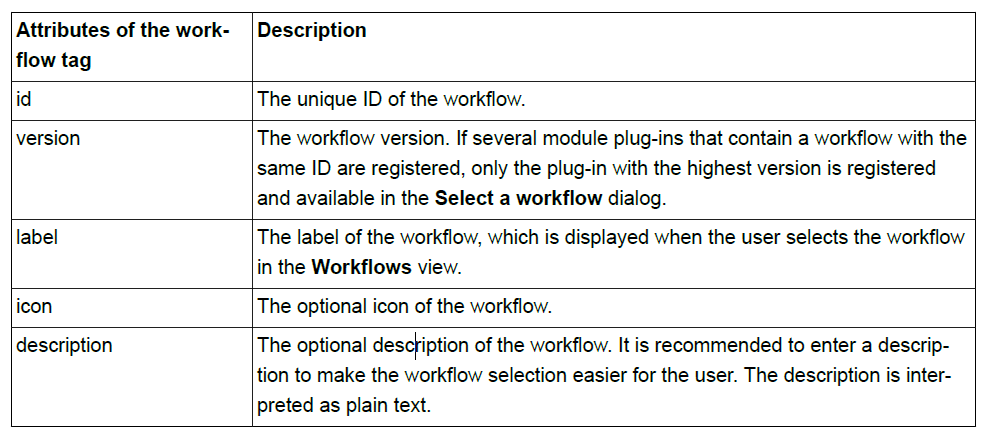

<section id="title">工作流 API</section>

# 1. 目的

**工作流 API** 提供了使用工作流来增强 **EB tresos Studio** 的可能性，工作流会引导用户使用此工具。工作流由以完成特定任务用户必须执行的步骤列表组成。例如：从头开始配置 **Com Stack**。

# 2. 先决条件

## 2.1. 所需知识

为了使用本章中的说明，您需要了解以下主题：

**XML**
> 工作流描述是用 **XML** 编写的。


## 2.2. 所需的插件

按照**如何安装 Eclipse**中所述设置 **Eclipse** 后，创建一个插件项目，然后将以下插件作为依赖项添加到 **MANIFEST.MF**：

* **dreisoft.tresos.workflow.api.plugin**

将此插件添加为依赖项：

* 在 **Eclipse** 中打开 **plugin.xml** 或者 **MANIFEST.MF**。打开一个特殊的编辑器，插件清单编辑器。
* 选择依赖项（**Dependencies**）的选项卡。
* 使用 **Add...按钮**添加插件。

# 3. 设计概述

在本章节中，您将了解**工作流 API**的基本设计。

一个工作流及其所有步骤都由一个用 **XML** 编写的工作流描述文件来描述。此工作流描述文件必须通过 **plugin.xml** 中的扩展点或通过工作流类（**Workflows class**）以编程方式注册。

被称为工作流视图（**Workflows view**）的单独视图提供了处理工作流的功能。此特殊视图一次显示一个工作流。只有注册的工作流将在工作流视图中可用。

**工作流视图**

有关视图部分的更多信息，请参阅 **EB tresos Studio** 用户指南的 **GUI** 主窗口一章。

## 3.1. 工作流程描述

工作流描述是一个 **XML** 文件，用于描述一个工作流，包括其步骤。**Workflow schema** 可以在以下位置找到：

* http://www.tresos.de/_projects/tresos/workflow_1_0.xsd

工作流描述文件示例：

```xml
<?xml version="1.0" encoding="UTF-8"?>
<workflow xmlns="http://www.tresos.de/_projects/tresos/workflow_1_0.xsd" 
    xmlns:xsi="http://www.w3.org/2001/XMLSchema-instance" 
    xsi:schemaLocation="http://www.tresos.de/_projects/tresos/workflow_1_0.xsd" 
    id="CreateDemoProject" 
    version="10.9" 
    label="Create Project" 
    description="Create demo project">

    <group id="CreateProject" label="Create the project">
        <action id="NewProject" label="Create a configuration project">
            <command description="Create the project" 
                serialization="org.eclipse.ui.newWizard(newWizardId=newConfigurationProject)"/>
            <description>Create a new project </description>
        </action>
    ...    
```

每个工作流都包含一个具有单个根节点的步骤树（**a tree of steps**）。包含其他步骤的步骤称为组步骤（**group step**）。树的叶节点称为动作步骤（**action steps**）。操作步骤可以包含在处理工作流时可以执行的命令。

组步骤可以是序列类型（**sequence**）或者选择类型（**choice**）。如果必须执行该组的所有子步骤才能完成任务，则应使用序列步骤（**Sequence steps**）。如果用户可以选择仅执行一个子步骤，则可以使用选择步骤（**Choice steps**）。

工作流描述的根元素是工作流标签。 工作流标签具有以下属性：



工作流标签只包含一个组标签。此组标记本身可以包含多个组和操作步骤。组和操作步骤具有以下共同属性：