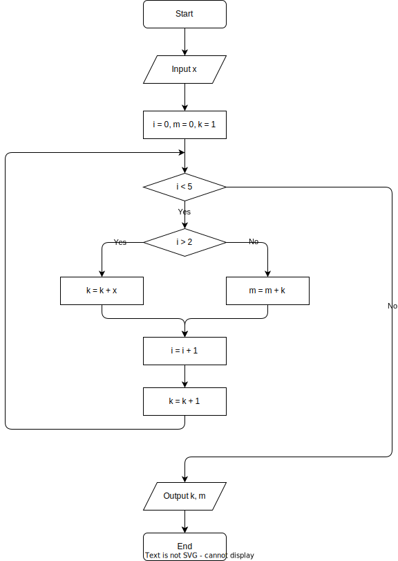

<section id="title">算法与程序设计</section>

# 1. 问题1:

如下图所示算法，输出结果是 ________________________。


## 1.1. Python 代码

```python
def question_1():
    a = 0
    b = 1
    while b <= 20:
        a = a + b
        b = b + a
    
    print(a)
    # print(b)

if __name__=="__main__":
    question_1()
```

# 2. 2 问题2:

如下图所示算法，或输入x=3，输出结果是 ________________________。



## 2.1. Python 代码

```
def question_2():
    print("Please enter x = ")
    x = int(input())
    i = 0
    m = 0
    k = 1
    while i < 5:
        if i > 2:
            k = k + x
        else:
            m = m + k
        i = i + 1
        k = k + 1

    print("k= %d" % k)
    print("m= %d" % m)


if __name__=="__main__":
    question_2()
```